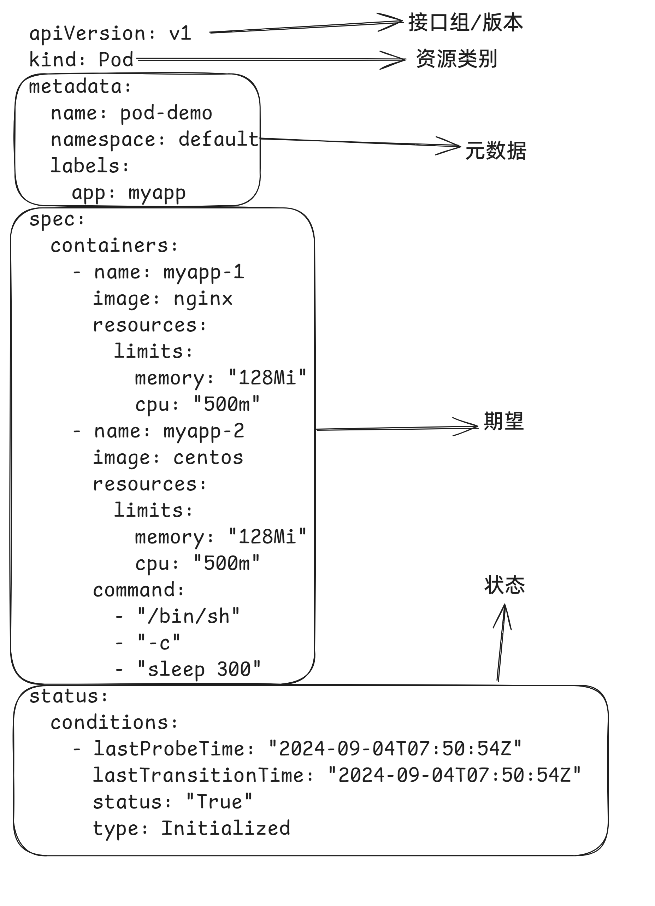

# 资源

kubernetes系统的 api server基于http/https接收并响应客户端的操作请求，它提供了一种基于资源的RESTful风格的编程结构，将集群的各种组件都抽象成为标准的REST资源，如Node、Namespace和Pod等，并支持通过标准的HTTP方法以JSON为数据序列化方案进行资源管理操作。

kubernetes系统将一切事物都抽象为API资源。资源实例化之后，叫做对象。


## 资源类别

- 名称空间级别
  - 工作负载型资源：Pod、ReplicaSet、Deployment...
  - 服务发现及负载均衡型资源:Service、Ingress...
  - 配置与存储型资源：Volume、CSI...
  - 特殊类型的存储卷：ConfigMap、Secre...

- 集群级资源(与集群相关的资源)
  - Namespace、Node、ClusterRole、ClusterRoleBinding

- 元数据型资源(为集群内部的其他资源配置其行为或特性)
  - HPA、PodTemplate、LimitRange

# 资源清单编写

```yaml
apiVersion: v1
kind: Pod
metadata:
  name: pod-demo
  namespace: default
  labels:
    app: myapp
spec:
  containers:
    - name: myapp-1
      image: nginx
      resources:
        limits:
          memory: "128Mi"
          cpu: "500m"
    - name: myapp-2
      image: centos
      resources:
        limits:
          memory: "128Mi"
          cpu: "500m"
      command:
        - "/bin/sh"
        - "-c"
        - "sleep 300"
status:
  conditions:
    - lastProbeTime: "2024-09-04T07:50:54Z"
      lastTransitionTime: "2024-09-04T07:50:54Z"
      status: "True"
      type: Initialized
```

每个组成部分如下



查询对象属性

```bash
$ kubectl explain pod.spec.containers
KIND:       Pod
VERSION:    v1

FIELD: containers <[]Container>

DESCRIPTION:
    List of containers belonging to the pod. Containers cannot currently be
    added or removed. There must be at least one container in a Pod. Cannot be
    updated.
    A single application container that you want to run within a pod.
...
```

kubectl的部分命令

```bash
# 获取当前的资源，pod
$ kubectl get pod 
	-A,--all-namespaces 查看当前所有名称空间的资源
	-n  指定名称空间，默认值 default，kube-system 空间存放是当前组件资源
	--show-labels  查看当前的标签
	-l  筛选资源，key、key=value
	-o wide  详细信息包括 IP、	分配的节点
	-w  监视，打印当前的资源对象的变化部分
	
# 进入 Pod 内部的容器执行命令
$ kubectl exec -it podName -c cName -- command
	-c  可以省略，默认进入唯一的容器内部
	
# 查看资源的描述
$ kubectl explain pod.spec

# 查看 pod 内部容器的 日志
$ kubectl logs podName -c cName

# 查看资源对象的详细描述
$ kubectl describe pod podName

# 删除资源对象
$ kubectl delete kindName objName
	--all 删除当前所有的资源对象
```

