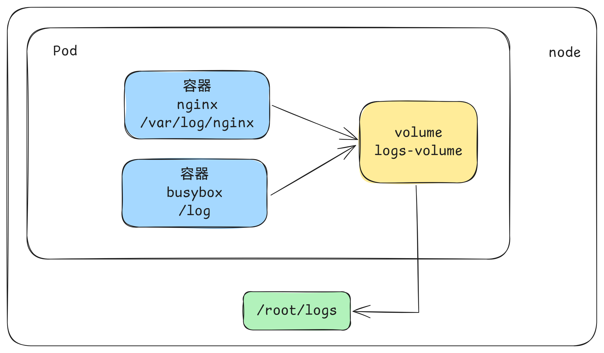
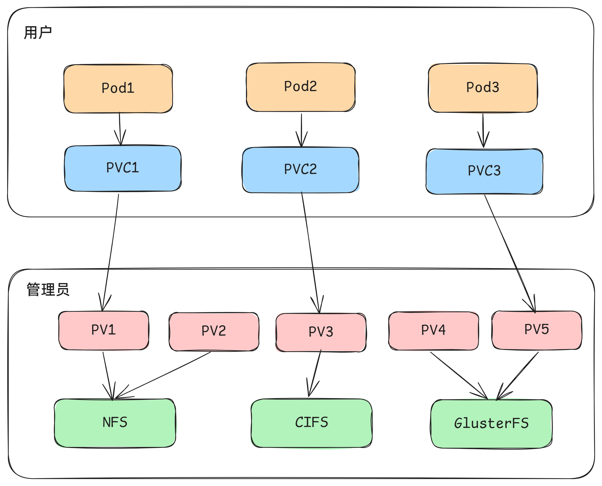
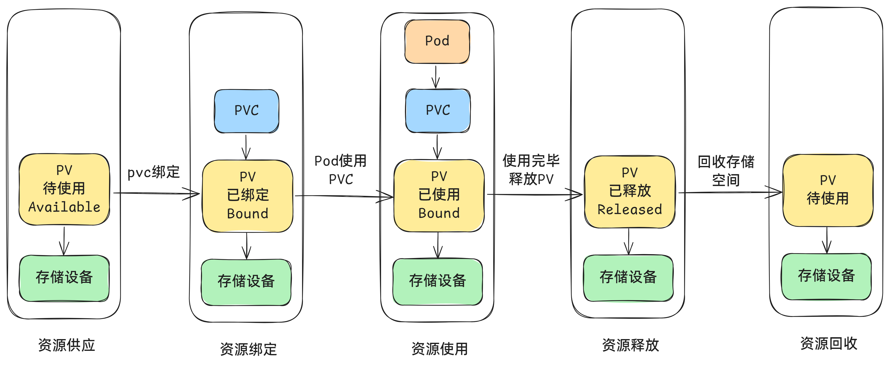
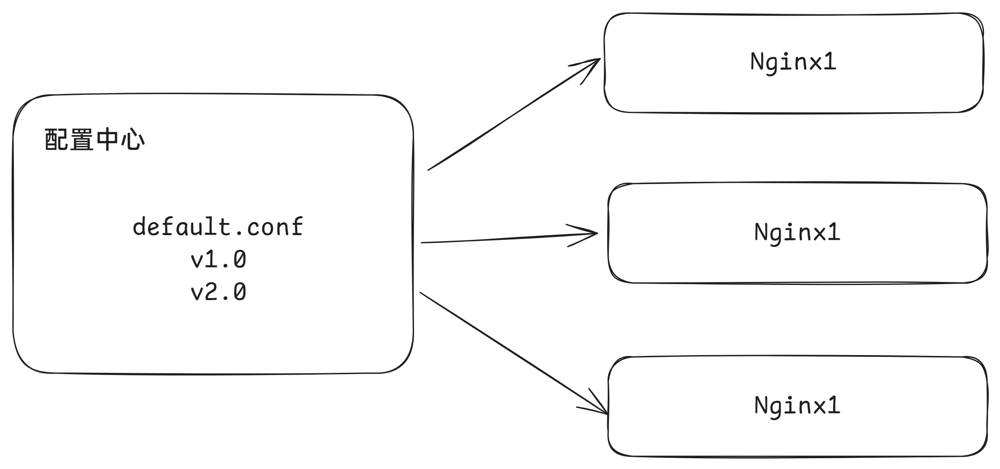

# 数据存储

在前面已经提到，容器的生命周期可能很短，会被频繁地创建和销毁。那么容器在销毁时，保存在容器中的数据也会被清除。这种结果对用户来说，在某些情况下是不乐意看到的。为了持久化保存容器的数据，kubernetes引入了Volume的概念。

Volume是Pod中能够被多个容器访问的共享目录，它被定义在Pod上，然后被一个Pod里的多个容器挂载到具体的文件目录下，kubernetes通过Volume实现同一个Pod中不同容器之间的数据共享以及数据的持久化存储。Volume的生命容器不与Pod中单个容器的生命周期相关，当容器终止或者重启时，Volume中的数据也不会丢失。

kubernetes的Volume支持多种类型，比较常见的有下面几个：

- 简单存储：EmptyDir、HostPath、NFS
- 高级存储：PV、PVC
- 配置存储：ConfigMap、Secret

# 基本存储

## EmptyDir

EmptyDir是最基础的Volume类型，**一个EmptyDir就是Host上的一个空目录**。

EmptyDir是在Pod被分配到Node时创建的，它的初始内容为空，并且无须指定宿主机上对应的目录文件，因为kubernetes会自动分配一个目录，当Pod销毁时， EmptyDir中的数据也会被永久删除。 EmptyDir用途如下：

- 临时空间，例如用于某些应用程序运行时所需的临时目录，且无须永久保留
- 一个容器需要从另一个容器中获取数据的目录（多容器共享目录）

接下来，通过一个容器之间文件共享的案例来使用一下EmptyDir。

在一个Pod中准备两个容器nginx和busybox，然后声明一个Volume分别挂在到两个容器的目录中，然后nginx容器负责向Volume中写日志，busybox中通过命令将日志内容读到控制台。


```yaml
apiVersion: v1
kind: Pod
metadata:
  name: volume-emptydir
spec:
  containers:
  - name: nginx
    image: aaronxudocker/myapp:v1.0
    ports:
    - containerPort: 80
    volumeMounts:  # 将logs-volume挂在到nginx容器中，对应的目录为 /var/log/nginx
    - name: logs-volume
      mountPath: /var/log/nginx
  - name: busybox
    image: aaronxudocker/tools:busybox
    command: ["/bin/sh","-c","tail -f /logs/access.log"] # 初始命令，动态读取指定文件中内容
    volumeMounts:  # 将logs-volume 挂在到busybox容器中，对应的目录为 /logs
    - name: logs-volume
      mountPath: /logs
  volumes: # 声明volume， name为logs-volume，类型为emptyDir
  - name: logs-volume
    emptyDir: {}
```

查看运行结果

```bash
$ kubectl get pod -o wide
NAME              READY   STATUS    RESTARTS   AGE    IP               NODE     NOMINATED NODE   READINESS GATES
volume-emptydir   2/2     Running   0          102s   10.244.196.158   node01   <none>           <none>
$ curl 10.244.196.158/hostname.html
volume-emptydir
$ kubectl logs -f volume-emptydir -c busybox
192.168.173.100 - - [14/Sep/2024:08:10:03 +0000] "GET /hostname.html HTTP/1.1" 200 16 "-" "curl/7.76.1" "-"
```

## HostPath

EmptyDir中数据不会被持久化，它会随着Pod的结束而销毁，如果**想简单的将数据持久化到主机**中，可以选择HostPath。

HostPath就是将Node主机中一个实际目录挂在到Pod中，以供容器使用，这样的设计就可以保证Pod销毁了，但是数据依据可以存在于Node主机上。



```yaml
apiVersion: v1
kind: Pod
metadata:
  name: volume-hostpath
spec:
  containers:
  - name: nginx
    image: aaronxudocker/myapp:v1.0
    ports:
    - containerPort: 80
    volumeMounts:  # 将logs-volume挂在到nginx容器中，对应的目录为 /var/log/nginx
    - name: logs-volume
      mountPath: /var/log/nginx
  - name: busybox
    image: aaronxudocker/tools:busybox
    command: ["/bin/sh","-c","tail -f /logs/access.log"] # 初始命令，动态读取指定文件中内容
    volumeMounts:  # 将logs-volume 挂在到busybox容器中，对应的目录为 /logs
    - name: logs-volume
      mountPath: /logs
  volumes: # 声明volume， name为logs-volume，类型为emptyDir
  - name: logs-volume
    hostPath: 
      path: /root/logs
      type: DirectoryOrCreate  # 目录存在就使用，不存在就先创建后使用
```

关于type的值的一点说明：
- DirectoryOrCreate 目录存在就使用，不存在就先创建后使用
- Directory   目录必须存在
- FileOrCreate  文件存在就使用，不存在就先创建后使用
- File 文件必须存在 
- Socket  unix套接字必须存在
- CharDevice  字符设备必须存在
- BlockDevice 块设备必须存在

测试一下

```bash
$ kubectl get pod -o wide
NAME              READY   STATUS    RESTARTS   AGE   IP               NODE     NOMINATED NODE   READINESS GATES
volume-hostpath   2/2     Running   0          55s   10.244.196.157   node01   <none>           <none>

$ curl 10.244.196.157/hostname.html
volume-hostpath

$ ssh root@node01
root@node01's password: 
Last login: Sat Sep 14 16:11:40 2024 from 192.168.173.100
$ cat /root/logs/access.log 
192.168.173.100 - - [14/Sep/2024:08:18:50 +0000] "GET /hostname.html HTTP/1.1" 200 16 "-" "curl/7.76.1" "-"
192.168.173.100 - - [14/Sep/2024:08:23:01 +0000] "GET /hostname.html HTTP/1.1" 200 16 "-" "curl/7.76.1" "-"
```

## NFS

​	HostPath可以解决数据持久化的问题，但是一旦Node节点故障了，Pod如果转移到了别的节点，又会出现问题了，此时需要准备单独的网络存储系统，**比较常用的用NFS、CIFS**。

​	NFS是一个网络文件存储系统，可以搭建一台NFS服务器，然后将Pod中的存储直接连接到NFS系统上，这样的话，无论Pod在节点上怎么转移，只要Node跟NFS的对接没问题，数据就可以成功访问。


- 首先要准备nfs的服务器，这里为了简单，直接是master节点做nfs服务器

```bash
# 安装nfs服务
$ yum install nfs-utils -y

# 创建一个共享文件夹
$ mkdir -pv /root/data/nfs
mkdir: created directory '/root/data'
mkdir: created directory '/root/data/nfs'

# 将共享文件夹读写权限暴露给192.168.173.0/24网段中的所有主机
$ vim /etc/exports
/root/data/nfs  192.168.173.0/24(rw,no_root_squash)

# 启动nfs服务
$ systemctl restart nfs-server
```

- 接下来，要在的每个node节点上都安装下nfs，这样的目的是为了node节点可以驱动nfs设备

```bash
# 在node上安装nfs服务，注意不需要启动
$ yum install nfs-utils -y
```

- 接下来，就可以编写pod的配置文件了

```yaml
apiVersion: v1
kind: Pod
metadata:
  name: volume-nfs
spec:
  containers:
  - name: nginx
    image: aaronxudocker/myapp:v1.0
    ports:
    - containerPort: 80
    volumeMounts:
    - name: logs-volume
      mountPath: /var/log/nginx
  - name: busybox
    image: aaronxudocker/tools:busybox
    command: ["/bin/sh","-c","tail -f /logs/access.log"] 
    volumeMounts:
    - name: logs-volume
      mountPath: /logs
  volumes:
  - name: logs-volume
    nfs:
      server: 192.168.173.100  #nfs服务器地址
      path: /root/data/nfs #共享文件路径
```

- 查看一下效果，可以看到文件已经写入到nfs中了

```bash
$ ls /root/data/nfs/
access.log  error.log
```

# 高级存储

前面已经学习了使用NFS提供存储，此时就要求用户会搭建NFS系统，并且会在yaml配置nfs。由于kubernetes支持的存储系统有很多，要求客户全都掌握，显然不现实。为了能够屏蔽底层存储实现的细节，方便用户使用， kubernetes引入PV和PVC两种资源对象。

PV（Persistent Volume）是持久化卷的意思，是对底层的共享存储的一种抽象。一般情况下PV由kubernetes管理员进行创建和配置，它与底层具体的共享存储技术有关，并通过插件完成与共享存储的对接。

PVC（Persistent Volume Claim）是持久卷声明的意思，是用户对于存储需求的一种声明。换句话说，PVC其实就是用户向kubernetes系统发出的一种资源需求申请。



使用了PV和PVC之后，工作可以得到进一步的细分：

- 存储：存储工程师维护
- PV： kubernetes管理员维护
- PVC：kubernetes用户维护

## PV

PV是存储资源的抽象，下面是资源清单文件:

```yaml
apiVersion: v1  
kind: PersistentVolume
metadata:
  name: pv2
spec:
  nfs: # 存储类型，与底层真正存储对应
  capacity:  # 存储能力，目前只支持存储空间的设置
    storage: 2Gi
  accessModes:  # 访问模式
  storageClassName: # 存储类别
  persistentVolumeReclaimPolicy: # 回收策略
```

PV 的关键配置参数说明：

- **存储类型**

  - 底层实际存储的类型，kubernetes支持多种存储类型，每种存储类型的配置都有所差异

- **存储能力（capacity）**

  - 目前只支持存储空间的设置( storage=1Gi )，不过未来可能会加入IOPS、吞吐量等指标的配置

- **访问模式（accessModes）**

  - 用于描述用户应用对存储资源的访问权限，访问权限包括下面几种方式：

    - ReadWriteOnce（RWO）：读写权限，但是只能被单个节点挂载
    - ReadOnlyMany（ROX）： 只读权限，可以被多个节点挂载
    - ReadWriteMany（RWX）：读写权限，可以被多个节点挂载
    - ReadWriteOncePod(RWOP)：卷只能由单个 Pod 以读写方式挂载，kubernetes版本1.22+才支持

  > 需要注意的是，底层不同的存储类型可能支持的访问模式不同

- **回收策略（persistentVolumeReclaimPolicy）**

  当PV不再被使用了之后，对其的处理方式。目前支持三种策略：

  - Retain （保留） **保留数据**，需要管理员手工清理数据
  - Recycle（回收） **清除 PV 中的数据**，效果相当于执行 rm -rf /thevolume/*
  - Delete （删除） 与 PV 相连的后端存储完成 volume 的删除操作，当然这常见于云服务商的存储服务

  > 需要注意的是，底层不同的存储类型可能支持的回收策略不同

- **存储类别**

  PV可以通过storageClassName参数指定一个存储类别

  - 具有特定类别的PV只能与请求了该类别的PVC进行绑定
  - 未设定类别的PV则只能与不请求任何类别的PVC进行绑定

- **状态（status）**

  一个 PV 的生命周期中，可能会处于4中不同的阶段：

  - Available（可用）： 表示可用状态，还未被任何 PVC 绑定
  - Bound（已绑定）： 表示 PV 已经被 PVC 绑定
  - Released（已释放）： 表示 PVC 被删除，但是资源还未被集群重新声明
  - Failed（失败）： 表示该 PV 的自动回收失败

**实验**

使用NFS作为存储，来演示PV的使用，创建3个PV，对应NFS中的3个暴露的路径。

1) 准备NFS环境

```shell
# 创建目录
$ mkdir /root/data/{pv1,pv2,pv3} -pv
mkdir: created directory '/root/data/pv1'
mkdir: created directory '/root/data/pv2'
mkdir: created directory '/root/data/pv3'

# 暴露服务
$ vim /etc/exports
/root/data/pv1  192.168.173.0/24(rw,no_root_squash)
/root/data/pv2  192.168.173.0/24(rw,no_root_squash)
/root/data/pv3  192.168.173.0/24(rw,no_root_squash)

# 重启服务
$ systemctl restart nfs-server
```

2) 创建pv

```yaml
apiVersion: v1
kind: PersistentVolume
metadata:
  name:  pv1
spec:
  capacity: 
    storage: 1Gi
  accessModes:
  - ReadWriteMany
  persistentVolumeReclaimPolicy: Retain
  nfs:
    path: /root/data/pv1
    server: 192.168.173.100

---

apiVersion: v1
kind: PersistentVolume
metadata:
  name:  pv2
spec:
  capacity: 
    storage: 2Gi
  accessModes:
  - ReadWriteMany
  persistentVolumeReclaimPolicy: Retain
  nfs:
    path: /root/data/pv2
    server: 192.168.173.100
    
---

apiVersion: v1
kind: PersistentVolume
metadata:
  name:  pv3
spec:
  capacity: 
    storage: 3Gi
  accessModes:
  - ReadWriteMany
  persistentVolumeReclaimPolicy: Retain
  nfs:
    path: /root/data/pv3
    server: 192.168.173.100
```

```shell
# 创建 pv
$ kubectl create -f pv.yaml
persistentvolume/pv1 created
persistentvolume/pv2 created
persistentvolume/pv3 created

# 查看pv
$ kubectl get pv
NAME   CAPACITY   ACCESS MODES   RECLAIM POLICY   STATUS      CLAIM   STORAGECLASS   VOLUMEATTRIBUTESCLASS   REASON   AGE
pv1    1Gi        RWX            Retain           Available                          <unset>                          32s
pv2    2Gi        RWX            Retain           Available                          <unset>                          32s
pv3    3Gi        RWX            Retain           Available                          <unset>                          32s
```

## PVC

PVC是资源的申请，用来声明对存储空间、访问模式、存储类别需求信息。下面是资源清单文件:

```yaml
apiVersion: v1
kind: PersistentVolumeClaim
metadata:
  name: pvc
spec:
  accessModes: # 访问模式
  selector: # 采用标签对PV选择
  storageClassName: # 存储类别
  resources: # 请求空间
    requests:
      storage: 5Gi
```

PVC 的关键配置参数说明：

- **访问模式（accessModes）**
  - 用于描述用户应用对存储资源的访问权限

- **选择条件（selector）**
  - 通过Label Selector的设置，可使PVC对于系统中己存在的PV进行筛选

- **存储类别（storageClassName）**
  - PVC在定义时可以设定需要的后端存储的类别，只有设置了该class的pv才能被系统选出

- **资源请求（Resources ）**
  - 描述对存储资源的请求

**实验**

1) 创建pvc申请pv

```yaml
apiVersion: v1
kind: PersistentVolumeClaim
metadata:
  name: pvc1
spec:
  accessModes: 
  - ReadWriteMany
  resources:
    requests:
      storage: 1Gi
---
apiVersion: v1
kind: PersistentVolumeClaim
metadata:
  name: pvc2
spec:
  accessModes: 
  - ReadWriteMany
  resources:
    requests:
      storage: 1Gi
---
apiVersion: v1
kind: PersistentVolumeClaim
metadata:
  name: pvc3
spec:
  accessModes: 
  - ReadWriteMany
  resources:
    requests:
      storage: 1Gi
```

```shell
# 创建pvc
$ kubectl create -f pvc.yaml
persistentvolumeclaim/pvc1 created
persistentvolumeclaim/pvc2 created
persistentvolumeclaim/pvc3 created

# 查看pvc
$ kubectl get pvc -o wide
NAME   STATUS   VOLUME   CAPACITY   ACCESS MODES   STORAGECLASS   VOLUMEATTRIBUTESCLASS   AGE   VOLUMEMODE
pvc1   Bound    pv1      1Gi        RWX                           <unset>                 26s   Filesystem
pvc2   Bound    pv2      2Gi        RWX                           <unset>                 26s   Filesystem
pvc3   Bound    pv3      3Gi        RWX                           <unset>                 26s   Filesystem

# 查看pv
$ kubectl get pv -o wide
NAME   CAPACITY   ACCESS MODES   RECLAIM POLICY   STATUS   CLAIM          STORAGECLASS   VOLUMEATTRIBUTESCLASS   REASON   AGE   VOLUMEMODE
pv1    1Gi        RWX            Retain           Bound    default/pvc1                  <unset>                          6m    Filesystem
pv2    2Gi        RWX            Retain           Bound    default/pvc2                  <unset>                          6m    Filesystem
pv3    3Gi        RWX            Retain           Bound    default/pvc3                  <unset>                          6m    Filesystem
```

2) 创建pod, 使用pv

```yaml
apiVersion: v1
kind: Pod
metadata:
  name: pod1
spec:
  containers:
  - name: busybox
    image: aaronxudocker/tools:busybox
    command: ["/bin/sh","-c","while true;do echo pod1 >> /root/out.txt; sleep 10; done;"]
    volumeMounts:
    - name: volume
      mountPath: /root/
  volumes:
    - name: volume
      persistentVolumeClaim:
        claimName: pvc1
        readOnly: false
---
apiVersion: v1
kind: Pod
metadata:
  name: pod2
spec:
  containers:
  - name: busybox
    image: aaronxudocker/tools:busybox
    command: ["/bin/sh","-c","while true;do echo pod2 >> /root/out.txt; sleep 10; done;"]
    volumeMounts:
    - name: volume
      mountPath: /root/
  volumes:
    - name: volume
      persistentVolumeClaim:
        claimName: pvc2
        readOnly: false
```

```shell
# 查看nfs中的文件存储
$ more /root/data/pv1/out.txt 
pod1
pod1
pod1

$ more /root/data/pv2/out.txt 
pod2
pod2
pod2
```

### 生命周期

PVC和PV是一一对应的，PV和PVC之间的相互作用遵循以下生命周期：

- **资源供应**：管理员手动创建底层存储和PV

- **资源绑定**：用户创建PVC，kubernetes负责根据PVC的声明去寻找PV，并绑定

  - 在用户定义好PVC之后，系统将根据PVC对存储资源的请求在已存在的PV中选择一个满足条件的
  - 一旦找到，就将该PV与用户定义的PVC进行绑定，用户的应用就可以使用这个PVC了
  - 如果找不到，PVC则会无限期处于Pending状态，直到等到系统管理员创建了一个符合其要求的PV
  - PV一旦绑定到某个PVC上，就会被这个PVC独占，不能再与其他PVC进行绑定了

- **资源使用**：用户可在pod中像volume一样使用pvc
  - Pod使用Volume的定义，将PVC挂载到容器内的某个路径进行使用。
  
- **资源释放**：用户删除pvc来释放pv
  - 当存储资源使用完毕后，用户可以删除PVC，与该PVC绑定的PV将会被标记为“已释放”，但还不能立刻与其他PVC进行绑定。通过之前PVC写入的数据可能还被留在存储设备上，只有在清除之后该PV才能再次使用。

- **资源回收**：kubernetes根据pv设置的回收策略进行资源的回收
  - 对于PV，管理员可以设定回收策略，用于设置与之绑定的PVC释放资源之后如何处理遗留数据的问题。只有PV的存储空间完成回收，才能供新的PVC绑定和使用




# 配置存储

## ConfigMap

​	ConfigMap功能在Kubernetes1.2版本中引入，许多应⽤程序会从配置文件、命令⾏参数或环境变量中读取配置信息。ConfigMapAPI给我们提供了向容器中注入配置信息的机制，ConfigMap可以被⽤来保存单个属性，也可以⽤来保存整个配置文件或者JSON⼆进制等对象



```bash
# 创建configMag
$ kubectl create configmap myconfig --from-file=myconfig.conf

# myconfig.conf文件内容
username=admin
password=12345

# 通过选项的方式传递内容
$ kubectl create configmap myconfig myconfig --from-literal=username=admin --from-literal=password=12345
```

ConfigMap在实际使用中最常见的用法是：

- 注入环境变量
- 注入配置文件

### 环境变量

```yaml
apiVersion: v1
kind: ConfigMap
metadata:
  name: literal-config
  namespace: default
data:
  name: admin
  password: "123456"
---
apiVersion: v1
kind: ConfigMap
metadata:
  name: env-config
  namespace: default
data:
  log_level: INFO
---
apiVersion: v1
kind: Pod
metadata:
  name: cm-env-pod
spec:
  containers:
    - name: myapp-container
      image: aaronxudocker/myapp:v1.0
      command: [ "/bin/sh", "-c", "env" ]
      env:
        - name: USERNAME
          valueFrom:
            configMapKeyRef:
              name: literal-config
              key: name
        - name: PASSWORD
          valueFrom:
            configMapKeyRef:
              name: literal-config
              key: password
      envFrom:
        - configMapRef:
            name: env-config
  restartPolicy: Never
```

查看一下环境变量

```bash
$ kubectl logs cm-env-pod
USERNAME=admin
log_level=INFO
PASSWORD=123456
```

### 文件挂载

将ConfigMap当做文件挂载到pod中

```yaml
apiVersion: v1
kind: ConfigMap
metadata:
  name: literal-config
  namespace: default
data:
  name: admin
  password: "123456"
---
apiVersion: v1
kind: Pod
metadata:
  name: cm-volume-pod
spec:
  containers:
    - name: myapp-container
      image: aaronxudocker/myapp:v1.0
      volumeMounts:
      - name: config-volume
        mountPath: /etc/config
  volumes:
    - name: config-volume
      configMap:
        name: literal-config
  restartPolicy: Never
```

```bash
$ kubectl exec -it cm-volume-pod -c myapp-container -- /bin/bash
root@cm-volume-pod:/# ls /etc/config/
name  password
root@cm-volume-pod:/# ls -l /etc/config
total 0
lrwxrwxrwx 1 root root 11 Sep 16 05:35 name -> ..data/name
lrwxrwxrwx 1 root root 15 Sep 16 05:35 password -> ..data/password
```

### 热更新

编写一个nginx的配置文件

```bash
$ cat default.conf 
server {
    listen 80 default_server;
    server_name example.com www.example.com;
    location / {
        root /usr/share/nginx/html;
        index index.html index.htm;
     }
}
```

创建configmap

```bash
$ kubectl create cm default-nginx --from-file=default.conf

$ kubectl describe cm default-nginx
Name:         default-nginx
Namespace:    default
Labels:       <none>
Annotations:  <none>

Data
====
default.conf:
----
server {
    listen 80 default_server;
    server_name example.com www.example.com;
    location / {
        root /usr/share/nginx/html;
        index index.html index.htm;
     }
}


BinaryData
====

Events:  <none>
```

创建nginx的deployment控制器

```yaml
apiVersion: apps/v1
kind: Deployment
metadata:
  labels:
    app: hotupdate-deploy
  name: hotupdate-deploy
spec:
  replicas: 5
  selector:
    matchLabels:
      app: hotupdate-deploy
  template:
    metadata:
      labels:
        app: hotupdate-deploy
    spec:
      containers:
      - image: aaronxudocker/myapp:v1.0
        name: nginx
        volumeMounts:
        - name: config-volume
          mountPath: /etc/nginx/conf.d/
      volumes:
        - name: config-volume
          configMap:
            name: default-nginx
```

创建好之后，检查配置文件

```bash
$ kubectl exec -it hotupdate-deploy-b548444d4-54r88 -- /bin/bash
root@hotupdate-deploy-b548444d4-54r88:/# cat /etc/nginx/conf.d/default.conf 
server {
    listen 80 default_server;
    server_name example.com www.example.com;
    location / {
        root /usr/share/nginx/html;
        index index.html index.htm;
     }
}
```

修改configmap中的端口号配置

```bash
# 修改nginx端口号为8080
$ kubectl edit cm default-nginx
```

检查修改后的情况

```bash
$ kubectl exec -it hotupdate-deploy-b548444d4-54r88 -- /bin/bash
root@hotupdate-deploy-b548444d4-54r88:/# cat /etc/nginx/conf.d/default.conf
server {
    listen 8080 default_server;
    server_name example.com www.example.com;
    location / {
        root /usr/share/nginx/html;
        index index.html index.htm;
     }
}

# 访问8080端口，发现并未生效
$ curl 10.244.196.166
Myapp Version 1.0

$ curl 10.244.196.166:8080
curl: (7) Failed to connect to 10.244.196.166 port 8080: Connection refused
```

可以通过修改pod annotations的⽅式强制触发滚动更新

```bash
$ kubectl patch deployment hotupdate-deploy --patch '{"spec": {"template": {"metadata": {"annotations": {"version/config": "v1.0" }}}}}'

$ kubectl get pod
NAME                                READY   STATUS        RESTARTS   AGE
hotupdate-deploy-7995cdc7dc-2bqvp   1/1     Running       0          7s
hotupdate-deploy-7995cdc7dc-7s5vt   1/1     Running       0          6s
hotupdate-deploy-7995cdc7dc-b5mpx   1/1     Running       0          8s
hotupdate-deploy-7995cdc7dc-bwr5q   1/1     Running       0          8s
hotupdate-deploy-7995cdc7dc-xlvtc   1/1     Running       0          8s
hotupdate-deploy-b548444d4-54r88    1/1     Terminating   0          5m19s
hotupdate-deploy-b548444d4-kgnk7    1/1     Terminating   0          5m19s
hotupdate-deploy-b548444d4-pg2jm    1/1     Terminating   0          5m19s
hotupdate-deploy-b548444d4-tlm8d    1/1     Terminating   0          5m19s
hotupdate-deploy-b548444d4-zbrq4    1/1     Terminating   0          5m19s

$ curl 10.244.140.115:8080
Myapp Version 1.0
```

更新ConfigMap后：
- 使⽤该ConfigMap挂载的Env不会同步更新
- 使⽤该ConfigMap挂载的Volume中的数据需要⼀段时间（实测⼤概10秒）才能同步更新

### 不可变configmap

Kubernetes给不可变的ConfigMap和Secret提供了⼀种可选配置，可以设置各个Secret和ConfigMap为不可变的。对于⼤量使⽤configmap的集群（⾄少有成千上万各不相同的configmap供Pod挂载），禁⽌变更它们的数据有下列好处：

- 防⽌意外（或非预期的）更新导致应⽤程序中断
- 通过将configmap标记为不可变来关闭kube-apiserver对其的监视，从⽽显著降低kube-apiserver的负载，提升集群性能。

```bash
$ kubectl explain cm
KIND:       ConfigMap
VERSION:    v1

DESCRIPTION:
    ConfigMap holds configuration data for pods to consume.
    
FIELDS:
  immutable     <boolean>
    Immutable, if set to true, ensures that data stored in the ConfigMap cannot
    be updated (only object metadata can be modified). If not set to true, the
    field can be modified at any time. Defaulted to nil.
```

## Secret

Secret对象类型⽤来保存敏感信息，例如密码、OAuth令牌和SSH密钥。将这些信息放在secret中比放在Pod的定义或者容器镜像中来说更加安全和灵活。

- Kubernetes通过仅仅将Secret分发到需要访问Secret的Pod所在的机器节点来保障其安全性
- Secret只会存储在节点的内存中，永不写入物理存储，这样从节点删除secret时就不需要擦除磁盘数据
- 从Kubernetes1.7版本开始，etcd会以加密形式存储Secret，⼀定程度的保证了Secret安全性
- Secret的内置类型有如下表

| 内置类型                            | 用法                                  |
| :---------------------------------- | ------------------------------------- |
| Opaque                              | 用户定义的任意数据                    |
| kubernetes.io/service-account-token | 服务账号令牌                          |
| kubernetes.io/dockercfg             | ~/.dockercfg文件的序列化形式          |
| kubernetes.io/dockerconfigjson      | ~/.docker/config.json文件的序列化形式 |
| kubernetes.io/basic-auth            | 用于基本身份认证的凭据                |
| kubernetes.io/ssh-auth              | 用于SSH身份认证的凭据                 |
| kubernetes.io/tls                   | 用于TLS客户端或者服务器端的数据       |
| bootstrap.kubernetes.io/token       | 启动引导令牌数据                      |

当Secret配置文件中未作显式设定时，默认的Secret类型是Opaque。当你使⽤kubectl来创建⼀个Secret时，你会使⽤generic⼦命令来标明要创建的是⼀个Opaque类型Secret。

```bash
# 存入secret中的数据需要base64编码
$ echo -n "admin" | base64
YWRtaW4=
$ echo -n "123456" | base64
MTIzNDU2

# base64可以轻易的被解码
$ echo -n "YWRtaW4=" | base64 -d
admin
```

创建一个secret类型的资源

```yaml
apiVersion: v1
kind: Secret
metadata:
  name: mysecret
type: Opaque
data:
  password: MTIzNDU2
  username: YWRtaW4=
```

查看资源创建

```bash
$ kubectl get secret
NAME         TYPE                DATA   AGE
mysecret     Opaque              2      22s

$ kubectl describe secret mysecret
Name:         mysecret
Namespace:    default
Labels:       <none>
Annotations:  <none>

Type:  Opaque

Data
====
password:  6 bytes
username:  5 bytes

$ kubectl get secret mysecret -o yaml
apiVersion: v1
data:
  password: MTIzNDU2
  username: YWRtaW4=
kind: Secret
metadata:
  creationTimestamp: "2024-09-16T06:05:59Z"
  name: mysecret
  namespace: default
  resourceVersion: "676071"
  uid: 30896725-6713-491f-b779-ce75f7e6312e
type: Opaque
```

### 环境变量

```yaml
apiVersion: apps/v1
kind: Deployment
metadata:
 labels:
   app: opaque-secret-env
 name: opaque-secret-env-deploy
spec:
 replicas: 5
 selector:
   matchLabels:
     app: op-se-env-pod
 template:
   metadata:
     labels:
       app: op-se-env-pod
   spec:
     containers:
     - image: aaronxudocker/myapp:v1.0
       name: myapp-continaer
       ports:
       - containerPort: 80
       env:
       - name: TEST_USER
         valueFrom:
           secretKeyRef:
             name: mysecret
             key: username
       - name: TEST_PASSWORD
         valueFrom:
           secretKeyRef:
             name: mysecret
             key: password
```

验证环境

```bash
$ kubectl exec -it opaque-secret-env-deploy-6b5b66b9db-292zl -- /bin/bash
root@opaque-secret-env-deploy-6b5b66b9db-292zl:/# env
TEST_USER=admin
TEST_PASSWORD=123456
```

### 文件挂载

```yaml
apiVersion: v1
kind: Pod
metadata:
  labels:
    name: secret-volume
  name: secret-volume-pod
spec:
  volumes:
  - name: volumes12
    secret:
      secretName: mysecret
  containers:
  - image: aaronxudocker/myapp:v1.0
    name: myapp-container
    volumeMounts:
    - name: volumes12
      mountPath: "/data"
```

验证结果

```bash
kubectl exec -it secret-volume-pod -- /bin/bash
root@secret-volume-pod:/# ls /data/
password  username
root@secret-volume-pod:/# ls -l /data/
total 0
lrwxrwxrwx 1 root root 15 Sep 16 06:17 password -> ..data/password
lrwxrwxrwx 1 root root 15 Sep 16 06:17 username -> ..data/username
root@secret-volume-pod:/# cat /data/password 
123456
```

可以指定挂载后文件的权限

```yaml
# 修改权限，256的八进制是400
  volumes:
  - name: volumes12
    secret:
      secretName: mysecret
      defaultMode: 256
```

验证权限

```bash
$ kubectl exec -it secret-volume-pod -- /bin/bash
root@secret-volume-pod:/data/..data# ls -l
total 8
-r-------- 1 root root 12 Sep 16 06:22 password
-r-------- 1 root root  5 Sep 16 06:22 username
```

指定只需要的键

```yaml
  volumes:
  - name: volumes12
    secret:
      secretName: mysecret
      items:
      - key: username
        path: my-group/my-username
```

验证

```bash
$ kubectl exec -it secret-volume-pod -- /bin/bash
root@secret-volume-pod:/# ls -l /data/
total 0
lrwxrwxrwx 1 root root 15 Sep 16 06:26 my-group -> ..data/my-group
```

