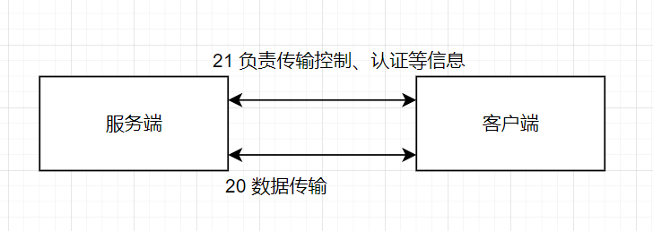
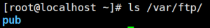

# FTP简介

FTP协议：文件传输协议（File Transfer Protocol）

* * 协议定义了一个在远程计算机系统和本地计算机系统之间传输文件的一个标准
  * FTP运行在OSI模型的应用层，并利用传输协议TCP在不同的主机之间提供可靠的数据传输
  * FTP 在文件传输中还支持断点续传功能，可以大幅度减少CPU网络带宽的开销

FTP模型

* * 用户接口：提供一个用户接口并使用客户端协议解释器的服务
  * 客户端协议解释器：向远程服务器发送命令 并建立客户数据传输过程
  * 服务端协议解释器：响应客户协议机发出的命令并驱动服务端数据传输过程
  * 客户端数据传输协议：负责完成和服务器数据传输过程及客户端本地文件系统的通信
  * 服务端数据传输协议：负责完成和客户数据过程及服务器端文件系统的通信

控制连接（端口号21）

* * 主要用来传送在实际通信过程中需要执行的FTP命令以及命令的响应
  * 只需要很小的网络带宽
  * FTP服务端监听21端口号来等待控制连接建立
  * 建立控制连接后，还需要验证客户身份，决定是否建立数据连接
  * 当需要目录列表，传输文件时，才建立数据连接，并且每次客户端都是用不同的端口号来建立数据连接。数据 传输完毕，就中断这条临时的数据连接
  * 在FTP连接期间，控制连接始终保持通常的连接状态。在数据连接存在期间，控制连接必须存在；一旦控制连接断开，数据连接会自动关闭。

数据连接（端口号20）

* * FTP服务端监听20端口来等待数据连接
  * 数据连接依赖于控制连接
  * 建立方式（主动被动都是相对服务器而言）

主动模式

* * 通过三次握手，建立控制连接；客户端的源端口是高位随机端口，目标端口是21端口
  * 控制连接建立后，客户端进行身份验证，协商数据连接采用主动模式；随后客户端会向FTP服务器发送Port报文，表明自己监听的IP+端口，并等待FTP服务器（20端口）向自己监听的IP+端口发起数据连接请求。
  * 服务端发起数据连接请求，建立数据连接

被动模式

* * 通过三次握手，建立控制连接；客户端的源端口是高位随机端口，目标端口是21端口；
  * 控制连接建立后，客户端进行身份验证，协商数据连接采用被动模式；随后客户端会向服务器发送PASV报文，表示我们用被动模式
  * 服务端收到PASV报文，于是向客户端发送Port报文，表明自己监听的IP+端口
  * 客户端发起数据连接请求，建立数据连接



# VSFTPD服务介绍

* 服务包：vsftpd
* 服务类型：由Systemd启动的守护进程
* 配置单元：`/usr/lib/systemd/system/vsftpd.service`
* 守护进程：`/usr/sbin/vsftpd`
* 端口：`21(ftp)`,`20(ftp‐data)`
* 主配置文件：`/etc/vsftpd/vsftpd.conf`
* 用户访问控制配置文件：`/etc/vsftpd/ftpusers /etc/vsftpd/user_list`
* 日志文件：`/etc/logrotate.d/vsftpd`
* 配置文件参数

| 参数                        | 作用                                             |
| :-------------------------- | :----------------------------------------------- |
| listen=NO                   | 是否以独立运行的方式监听服务                     |
| listen_address=ip地址       | 设置要监听的IP地址                               |
| listen_port=21              | 设置FTP服务的监听端口                            |
| download_enable=YES         | 是否允许下载文件                                 |
| userlist_enable=YES         | 设置用户列表为"允许"                             |
| userlist_deny=YES           | 设置用户列表为"禁止"                             |
| max_clients=0               | 最大客户端连接数，0为不限制                      |
| max_per_ip=0                | 同一IP地址的最大连接数，0为不限制                |
| anonymous_enable=YES        | 是否允许匿名用户访问                             |
| anon_upload_enable=YES      | 是否允许匿名用户上传文件                         |
| anon_umask                  | 匿名用户上传文件的umask                          |
| anon_root=/var/ftp          | 匿名用户的ftp根目录                              |
| anon_mkdir_write_enable=YES | 是否允许匿名用户创建目录                         |
| anon_other_write_enable=YES | 是否开放匿名用户的其他写入权限（重命名、删除等） |
| anon_max_rate=0             | 匿名用户的最大传输速率，0为不限制                |
| local_enable=yes            | 是否允许本地用户登录                             |
| local_umask=022             | 本地用户上传文件的umask值                        |
| local_root=/vat/ftp         | 本地用户的ftp根目录                              |
| chroot_local_user=YES       | 是否将用户权限禁锢在ftp目录，以确保安全          |
| local_max_rate=0            | 本地用户的最大传输速率，0为不限制                |

## 基础配置

* 安装vsftp

```shell
[root@localhost ~]#yum -y install vsftpd
```

* 准备分发的文件

```shell
[root@localhost ~]#touch /var/ftp/abc.txt
```

* 启动服务

```shell
[root@localhost ~]#systemctl start vsftpd
[root@localhost ~]#systemctl enable vsftpd
```

* 关闭防火墙

```shell
[root@localhost ~]#systemctl stop firewalld
[root@localhost ~]#setenforce 0
```

## 客户端工具

### Linux中

* 第一种

```shell
[root@localhost ~]# yum install ftp -y
[root@localhost ~]# ftp <IP地址>
Name (192.168.175.10:root):anonymous
password:直接回车
```

* 第二种

```shell
[root@localhost ~]# yum install lftp -y
[root@localhost ~]# lftp <IP地址>
```

* 区别
  * ftp工具是一定要输入用户名称和密码的，登录成功或者失败会给出提示。lftp不会直接给出登录成功或者失败的
  * 提示，需要输入ls工具才可以发现是否连接成功，优点在于连接更加方便
* 注意：

ftp默认禁止root等用户登录，禁止名单如下

```
vim /etc/vsftpd/user_list
```


### Windows中

第一种

* * 可以在浏览器、运行窗口或者资源管理器中输入`ftp://IP地址/`，这样访问的是ftp的根位置，如果需要访问相关
  * 目录可以输入`ftp://IP地址/目录/文件名`

第二种

* * 在cmd窗口中，输入命令`ftp <IP地址>`即可访问

>需要注意的是直接访问ftp服务器的IP地址时访问的根位置目录是`/var/ftp`如下图，比如如果需要访问pub里的test可以访问`ftp://192.168.80.129/pub/test`。



## 案例1，匿名用户访问（默认开启）

```shell
[root@localhost ~]# vi /etc/vsftpd/vsftpd.conf
anonymous_enable=YES
anon_umask=022
anon_upload_enable=YES
anon_mkdir_write_enable=YES
anon_other_write_enable=YES
local_enable=YES
write_enable=YES
local_umask=022
dirmessage_enable=YES
xferlog_enable=YES
connect_from_port_20=YES
xferlog_std_format=YES
listen=NO
listen_ipv6=YES
pam_service_name=vsftpd
userlist_enable=YES
tcp_wrappers=YES
[root@localhost ~]# systemctl restart vsftpd
linux的目录权限会限制我们不允许往里面新建文件，但是如果直接添加目录的w权限又会导致触发他的安全判断问题，所以就把ftp目录里的pub目录的属主和属主改为ftp解决，并且添加写权限
chown ftp.ftp /var/ftp/pub
chmod 777 /var/ftp/pub
现在就可以往里面写文件了
```

## 案例2，本地用户访问

使用本地用户登录成功时位置在家目录的位置

```shell
[root@localhost ~]# vi /etc/vsftpd/vsftpd.conf
anonymous_enable=NO
local_enable=YES
write_enable=YES
local_umask=022
dirmessage_enable=YES
xferlog_enable=YES
connect_from_port_20=YES
xferlog_std_format=YES
listen=NO
listen_ipv6=YES
pam_service_name=vsftpd
userlist_enable=YES
tcp_wrappers=YES
[root@localhost ~]# systemctl restart vsftpd
[root@localhost ~]# systemctl enable vsftpd
注意：出现在/etc/vsftpd/ftpusers  /etc/vsftpd/user_list这两个文件
中的内容将会被定义为黑名单
```

## 案例3，虚拟用户访问

1. 创建用于进行FTP认证的用户数据库文件，其中奇数行为账户名，偶数行为密码。

```shell
[root@localhost ~]# cd /etc/vsftpd/
[root@localhost vsftpd]# vi vuser.list
eagle
centos
cisco
centos
huawei
centos
```

2. 使用db_load命令用哈希（hash）算法将原始的明文信息文件转换成数据库文件
3. 降低数据库文件的权限（避免其他人看到数据库文件的内容）
4. 把原始的明文信息文件删除。

```shell
[root@localhost vsftpd]# db_load -T -t hash -f vuser.list vuser.db
[root@localhost vsftpd]# file vuser.db
vuser.db: Berkeley DB (Hash, version 9, native byte-order)
[root@localhost vsftpd]# vi vuser.db
[root@localhost vsftpd]# chmod 600 vuser.db
[root@localhost vsftpd]# rm -f vuser.list 
```

5. 创建一个本地用户，用来做虚拟用户在本地的代理，为了安全起见，**禁止这个本地用户登录**

```shell
[root@localhost vsftpd]# useradd -d /var/ftproot -s /sbin/nologin virtual
[root@localhost vsftpd]# ls -ld /var/ftproot/
drwx------. 2 virtual virtual 59 8月 10 23:04 /var/ftproot/
[root@localhost vsftpd]# chmod -Rf 755 /var/ftproot/
```

6. 新建一个用于虚拟用户认证的PAM文件vsftpd.vu，利用pam模块（linux内核的一个认证模块）做一个认证

```shell
[root@localhost vsftpd]# vi /etc/pam.d/vsftpd.vu
auth required pam_userdb.so db=/etc/vsftpd/vuser
account required pam_userdb.so db=/etc/vsftpd/vuser
```

7. 配置文件

```shell
[root@localhost vsftpd]# cat /etc/vsftpd/vsftpd.conf
anonymous_enable=NO
local_enable=YES
guest_enable=YES
guest_username=virtual
allow_writeable_chroot=YES
write_enable=YES
local_umask=022
dirmessage_enable=YES
xferlog_enable=YES
connect_from_port_20=YES
xferlog_std_format=YES
listen=NO
listen_ipv6=YES
pam_service_name=vsftpd.vu 
#记得修改这里为我们自己的认证文件
userlist_enable=YES
tcp_wrappers=YES
[root@localhost vsftpd]# systemctl restart vsftpd
用刚刚创建好的用户登录，但是只能登录，不能写文件，想要给权限，这个用户的权限是被匿名用户权限控制的

客户端
[root@atopos ~]# ftp 192.168.88.141
Connected to 192.168.88.141 (192.168.88.141).
220 (vsFTPd 3.0.2)
Name (192.168.88.141:root): eagle
331 Please specify the password.
Password:
# password：centos
```

8. 如果想要针对不同的用户设置不同的权限

```shell
[root@localhost vsftpd]# mkdir /etc/vsftpd/vusers_dir/
[root@localhost vsftpd]# cd /etc/vsftpd/vusers_dir/
[root@localhost vusers_dir]# touch huawei
[root@localhost vusers_dir]# vi cisco
anon_upload_enable=YES
anon_mkdir_write_enable=YES
anon_other_write_enable=YES
[root@localhost vusers_dir]# vi /etc/vsftpd/vsftpd.conf
anonymous_enable=NO
local_enable=YES
guest_enable=YES
guest_username=virtual
allow_writeable_chroot=YES
write_enable=YES
local_umask=022
dirmessage_enable=YES
xferlog_enable=YES
connect_from_port_20=YES
xferlog_std_format=YES
listen=NO
listen_ipv6=YES
pam_service_name=vsftpd.vu
userlist_enable=YES
tcp_wrappers=YES
user_config_dir=/etc/vsftpd/vusers_dir 
#告诉主配置文件我们这里还有配置
[root@localhost vusers_dir]# systemctl restart vsftpd
huawei没权限，cisco有权限
```

