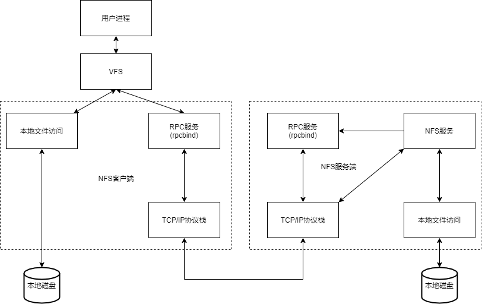
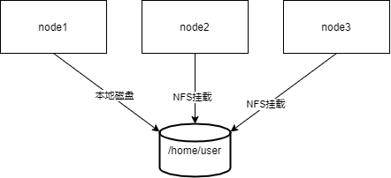

# NFS简介

* NFS最早是希望可以把一台电脑的硬盘挂载到另一台电脑给另一台电脑用
* 如果想使用 ftp 资源的话，必须要下载到本地之后才可以打开，所以 ftp 的资源是一个纯网络资源，nfs 就可以直接打开共享的文件
* NFS: Network File System 网络文件系统，基于内核的文件系统。Sun 公司开发, 通过使用 NFS,用户和程序可以像访问本地文件一样访问远端系统上的文件,不过他是基于RPC协议的
*  RPC (Remote Procedure Call Protocol 远程过程调用)  采用 C/S 模式，客户机请求程序调用进程发送一个有进程参数的调用信息到服务进程，然后等待应答信息。在服务器端，进程保持睡眠状态直到调用信息到达为止。当一个调用信息到达,服务器获得进程参数,计算结果,发送答复信息，然后等待下一个调用信息，最后，客户端调用进程接收答复信息，获得进程结果，然后调用执行继续进行


* 我们可以通过`modinfo nfs`查看 Linux 内核支持的 nfs 驱动
* 下图是 NFS 工作原理简图



# RPC 远程过程调度

* NFS 协议本身并没有网络传输功能，而是基于远程过程调用协议实现的
* 提供一个面向过程的远程服务的接口
* 可以通过网络从远程主机程序上请求服务，而不需要了解底层网络技术的协议
* 工作在 OSI 模型的会话层，它可以为遵从 RPC 协议应用层协议提供端口注册功能
* 事实上，有很多服务（NFS 和 NIS 等）都可以向 RPC 注册端口
* RPC 使用网络端口 111 来监听客户端的请求

# RPC 协议模型

1. 基于 rpc 的服务（此处是指 nfs 服务，在别处有可能是代表其他服务）在启动时向 portmapper 注册端口
2. 基于 rpc 的客户端联系服务端 portmapper 询问服务的端口号
3. portmapper 告知客户端基于 rpc 服务使用的端口号
4. 基于 rpc 的客户端访问被告知单某基于 rpc 服务的端口
5. 基于 rpc 的服务响应客户端的请求

# NSF 部署

* 安装 rpcbind

```shell
[root@node2 ~]# yum -y install rpcbind
```

* 安装 nfs 服务

```shell
[root@node2 ~]# yum -y install nfs-utils
# 其实直接装 nfs-utils 也会以依赖的方式自动装上 rpcbind
[root@node2 ~]# systemctl start nfs-server
[root@node2 ~]# systemctl enable nfs-server
```

* 比较 nfs 启动前后的 rpcbind 的状态

```shell
[root@node2 ~]# systemctl status rpcbind.socket
# nfs 启动前，只是监听 111 端口，但是并没有启动对应的服务
[root@node2 ~]# systemctl status rpcbind
# nfs 启动后，可以看到 rpcbind 自动启动了，也说明了 nfs 对 rpc 的依赖
```

* 查看已经监听的端口，在重启 nfs 之后，端口号会随机变化，所以需要 rpc 做注册

```shell
[root@node2 ~]# ss -ntulp
[root@node2 ~]# systemctl restart nfs
[root@node2 ~]# ss -ntulp
[root@node2 ~]# rpcinfo -p
# 可以查看到注册的端口号
```

# NFS 软件介绍

* 软件包
  * nfs-utils
* 相关软件包
  * rpcbind(必须)，tcp_wrappers
* kernel 支持
  * nfs.ko
* 端口
  * 2049(nfsd), 其它端口由 portmap(111)分配
  * 说明: CentOS 6 开始 portmap 进程由 rpcbind 代替
* NFS 服务主要进程
  * rpc.nfsd 最主要的 NFS 进程， 管理客户端是否可登录
  * rpc.mountd 挂载和卸载 NFS 文件系统，包括权限管理
  * rpc.lockd 非必要，管理文件锁,避免同时写出错
  * rpc.statd 非必要， 检查文件-致性， 可修复文件
  * 日志：/var/lib/nfs
* NFS 配置文件
  * /etc/exports
  * /etc/exports.d/*.exports

# NFS 共享配置文件格式

```shell
/dir    主机 1(opt1,opt2)    主机 2(opt1,opt2)
```

* 主机格式
  * 单个主机: ipv4, ipv6, FQDN
  * IP networks: 两种掩码格式均支持
    * 172.18.0.0/255.255.0.0
    * 172.18.0.0/16
  * wildcards:主机名通配，例如*.iproute.cn，IP 不可以
  * netgroups: NIS 域的主机组，@group_ name
  * anonymous:表示使用*通配所有客户端
* 选项格式
  * 默认选项
    * (ro,sync,root_squash, no_all_squash)
  * ro, rw
    * 只读和读写
  * async
    * 异步，数据变化后不立即写磁盘，等磁盘空闲时再写入，性能高
  * sync
    * 同步(1.0.0 后为默认)，数据在请求时立即写入共享存储磁盘
  * root_squash
    * 远程 root 映射为 nfsnobody(默认)，UID 为 65534，Centos8 为 nobody, 早期版本是 4294967294 (nfsnobody)
  * no_root_squash
    * 远程 root 映射成 root 用户
  * all_squash
    * 所有远程用户(包括 root)都变成 nfsnobody , Centos8 为 nobody
  * no_all_squash
    * 保留共享文件的 UID 和 GID (默认)
  * anonuid 和 anongid
    * 指明匿名用户映射为特定用户 UID 和组 GID，而非 nfsnobody ,可配合 all_squash 使用

# NFS 工具

## rpcinfo

rpcinfo 工具可以查看 RPC 相关信息

查看注册在指定主机的 RPC 程序

```shell
rpcinfo -p hostname
```

查看 rpc 注册程序

```shell
rpcinfo -s hostname
```

## exportfs

可用于管理 NFS 导出的文件系统

常见选项：

* **-v**：查看本机所有 NFS 共享
* **-r**：重读配置文件，并共享目录
* **-a**：输出本机所有共享
* **-au**：停止本机所有共享

## showmount

常见用法：

```shell
showmount -e hostname
```

### 手动挂载案例

```bash
服务端
[root@localhost ~]# vim /etc/exports
/myshare 192.168.175.0/24
[root@localhost ~]# mkdir /myshare
[root@localhost ~]# cd /myshare
[root@localhost myshare]# echo "hello" > file
[root@localhost ~]# systemctl stop firewalld
[root@localhost ~]# setenforce 0
客户端：
[root@localhost ~]# yum -y install nfs-utils
[root@localhost ~]# showmount -e 192.168.175.19
Export list for 192.168.175.19:
# 虽然我们自己配置共享了，但是没有重读配置文件，所以读不到
服务端：
[root@localhost ~]# exportfs -r
exportfs: No options for /myshare 192.168.175.0/24: suggest 192.168.175.0/24(sync) to avoid warning
[root@localhost ~]# exportfs -v
/myshare        192.168.175.0/24(sync,wdelay,hide,no_subtree_check,sec=sys,ro,secure,root_squash,no_all_squash)
客户端：
[root@localhost ~]# showmount -e 192.168.175.19
Export list for 192.168.175.19:
/myshare 192.168.175.0/24
[root@localhost ~]# mkdir /mnt/nfs
[root@localhost ~]# mount -t nfs 192.168.175.19:/myshare /mnt/nfs
[root@localhost ~]# df -h
[root@localhost ~]# rm file
[root@localhost ~]# umount /mnt/nfs
现在是只读模式，想要修改模式要去改配置文件
服务端：
[root@localhost ~]# vim /etc/exports
/myshare 192.168.175.0/24(rw,sync,root_squash,no_all_squash)
[root@localhost ~]# exportfs -v
/myshare        192.168.175.0/24(sync,wdelay,hide,no_subtree_check,sec=sys,ro,secure,root_squash,no_all_squash)
[root@localhost ~]# exportfs -r
[root@localhost ~]# exportfs -v
/myshare        192.168.175.0/24(sync,wdelay,hide,no_subtree_check,sec=sys,rw,secure,root_squash,no_all_squash)
客户端：
[root@localhost ~]# showmount -e 192.168.175.19
Export list for 192.168.175.19:
/myshare 192.168.175.0/24
[root@localhost ~]# mount -t nfs 192.168.175.19:/myshare /mnt/nfs
[root@localhost ~]# df -h
[root@localhost ~]# cd /mnt/nfs/
[root@localhost nfs]# rm file
rm：是否删除普通空文件 "file"？y
rm: 无法删除"file": 权限不够
# 虽然给了rw权限，但是目录权限被linux控制
服务端：
[root@localhost ~]# ll -d /myshare/
drwxr-xr-x. 2 root root 18 7月  16 21:56 /myshare/
[root@localhost ~]# chmod a+w /myshare
[root@192 myshare]# ll -d /myshare/
drwxrwxrwx. 2 root root 18 7月  16 21:56 /myshare/
客户端：
[root@localhost nfs]# rm file
rm：是否删除普通空文件 "file"？y
[root@localhost nfs]# echo "hello" >> file
[root@localhost nfs]# ll
总用量 4
-rw-r--r-- 1 nfsnobody nfsnobody 6 7月  16 22:08 file
[root@localhost nfs]# su - user01
[user01@localhost ~]$ cd /mnt/nfs/
[user01@localhost nfs]$ touch file1
[user01@localhost nfs]$ ll
总用量 4
-rw-r--r-- 1 nfsnobody nfsnobody 6 7月  16 22:08 file
-rw-rw-r-- 1 user01    user01    0 7月  16 22:11 file1
服务端：
[root@localhost myshare]# ll
总用量 4
-rw-r--r--. 1 nfsnobody nfsnobody 6 7月  16 22:08 file
-rw-rw-r--. 1      1000      1000 0 7月  16 22:11 file1
[root@localhost myshare]# useradd -u1000 zhangsan
[root@localhost myshare]# ll
总用量 4
-rw-r--r--. 1 nfsnobody nfsnobody 6 7月  16 22:08 file
-rw-rw-r--. 1 zhangsan  zhangsan  0 7月  16 22:11 file1
[root@localhost ~]# vim /etc/exports
/myshare 192.168.175.0/24(rw,sync,no_root_squash,all_squash)
[root@localhost myshare]# exportfs -r
[root@localhost myshare]# exportfs -v
/myshare        192.168.175.0/24(sync,wdelay,hide,no_subtree_check,sec=sys,rw,secure,no_root_squash,all_squash)
客户端：
[root@localhost ~]# umount /mnt/nfs/
[root@localhost ~]# mount -t nfs 192.168.175.19:/myshare /mnt/nfs
[root@localhost ~]# df -h
[root@localhost ~]# cd /mnt/nfs/
[root@localhost ~]# touch file{1,2,3}
[root@localhost nfs]# ll
总用量 4
-rw-r--r-- 1 nfsnobody nfsnobody 6 7月  16 22:08 file
-rw-rw-r-- 1 user01    user01    0 7月  16 22:11 file1
-rw-r--r-- 1 nfsnobody nfsnobody 0 7月  16 22:26 file2
-rw-r--r-- 1 nfsnobody nfsnobody 0 7月  16 22:26 file3
```

## mount.nfs

客户端 NFS 挂载

NFS 相关的挂载选项:`man 5 nfs`

* **fg**：(默认)前台挂载
* **bg**：后台挂载
* **hard**：(默认)持续请求
* **soft**：非持续请求
* **intr 和 hard 配合**：请求可中断
* **rsize 和 wsize**：一次读和写数据最大字节数，rsize=32768
* _**netdev**：无网络不挂载

提示:基于安全考虑，建议使用`nosuid,_netdev,noexec`挂载选项

范例:临时挂载 NFS 共享

```shell
mount -o rw,nosuid,fg,hard,intr 192.168.175.147:/test/dir /mnt/nfs
```

范例:开机挂载

```shell
vim /etc/fstab
192.168.175.147:/public    /mnt/fs    nfs    defaults,_netdev  0 0
```

# 自动挂载

可使用autofs服务按需要挂载外围设备，NFS共享等，并在空闲5分钟后后自动卸载

## 相关包和文件

* 软件包: autofs
* 服务文件: /usr/lib/systemd/system/autofs.service
* 配置文件: /etc/auto.master

## 配置文件格式

参看帮助: man 5 autofs

所有导出到网络中的NFS启用特殊匹配-host至"browse"

范例: /net目录可以自动挂载NFS共享

```shell
cat /etc/auto.master
/net    -hosts
cd /net/192.168.175.147
```

* 自动挂载资源有两种格式
  * 相对路径法:将mount point路径分成dirname和basename分别配置，可能会影响现有的目录结构
  * 绝对路径法:直接匹配全部绝对路径名称,不会影响本地目录结构

### 相对路径法

* `/etc/auto.master`格式

```shell
挂载点的dirname    指定目录的配置文件路径
```

* 指定目录的配置文件格式

```shell
挂载点的basename    挂载选项    选项设备
```

#### 案例

* 相对路径法为支持通配符

```shell
客户端：
[root@localhost ~]# vim /etc/auto.master
/misc    /etc/auto.misc
[root@localhost ~]# mkdir /misc 
[root@localhost ~]# vim /etc/auto.misc
# 表示/misc下面的子目录和nfs共享/export目录的子目录同名
* -fstype=nfs,vers=3 192.168.175.19:/myshare/&
[root@localhost ~]# systemctl restart autofs
服务端：
[root@localhost myshare]# mkdir -p dir/dir1
客户端：
[root@localhost ~]# df -h
[root@localhost misc]# ll /misc
总用量 0
[root@localhost misc]# cd /misc/dir
[root@localhost dir]# ll
总用量 0
drwxr-xr-x 2 root root 6 7月  17 19:10 dir1
[root@localhost dir]# df -h
```

### 绝对路径法

* /etc/auto.master格式

```shell
/-      指定配置文件路径
```

* 指定配置文件格式

```shell
绝对路径      挂载选项      选项设备
```

#### 案例

* 绝对路径法

```shell
[root@localhost dir]# vim /etc/auto.misc
#* -fstype=nfs,vers=3 192.168.175.19:/myshare/&
#把之前挂载的注释掉，防止重复挂载出问题
[root@localhost dir]# vim /etc/auto.master
/-      /etc/auto.direct
#添加一行，/-表示直接挂在根目录下
[root@localhost dir]# vim /etc/auto.direct
/nfsdir -fstype=nfs 192.168.175.19:/myshare
[root@localhost dir]# mkdir /nfsdir
[root@localhost dir]# systemctl restart autofs
[root@localhost dir]# df -h
[root@localhost ~]# cd /nfsdir/
[root@localhost ~]# df -h
```


# 实战案例

将NFS的共享目录，通过autofs 发布出来，做为远程主机用户的家目录



## 环境准备

将node1中的用户家目录共享出来，node2在登陆这个用户的到时候，看到家目录下的文件是一致的

## 步骤

* NFS服务器创建用户和相应的目录，将用户user的家目录共享

```shell
[root@NFSserver ~]# mkdir /data
[root@NFSserver ~]# useradd -d /data/user user
[root@NFSserver ~]# id user
uid=1000(user) gid=1000(user) 组=1000(user)
[root@NFSserver ~]# vim /etc/exports
#/myshare 192.168.175.0/24(rw,sync,no_root_squash,all_squash)
/data/user    *(rw,sync,anonuid=1000,anongid=1000,all_squash)
[root@NFSserver ~]# exportfs -r
[root@NFSserver ~]# exportfs -v
/data/user      <world>(sync,wdelay,hide,no_subtree_check,anonuid=1000,anongid=1000,sec=sys,rw,secure,root_squash,all_squash)
```

* 在nfs客户端上实现autofs

```shell
[root@localhost ~]# vim /etc/auto.master
/-      /etc/auto.direct
[root@NFSclient ~]# vim /etc/auto.direct
/data/user -fstype=nfs,vers=3 192.168.175.19:/data/user
[root@NFSclient ~]# systemctl restart autofs
```

* 在nfs客户端上创建用户user

```shell
[root@NFSclient ~]# mkdir /data
[root@NFSclient ~]# useradd -d /data/user -u 1000 user
```

* 测试是否完成目标

```shell
[root@NFSserver ~]# su - user
[user@NFSserver ~]$ touch file
# 在NSF服务器上登录user用户，创建文件在家目录中
[root@NFSclient /]# su - user
[user@NFSclient ~]$ ll
总用量 0
-rw-rw-r--. 1 user user 0 4月  30 10:13 file
# 在NSF客户机上登录user用户，发现文件已经被共享了
```

