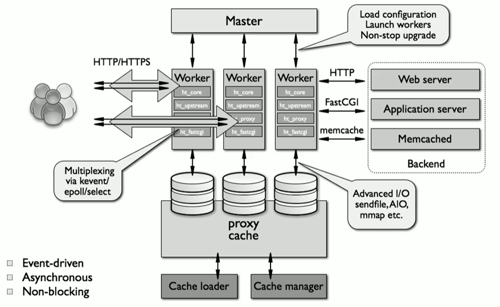
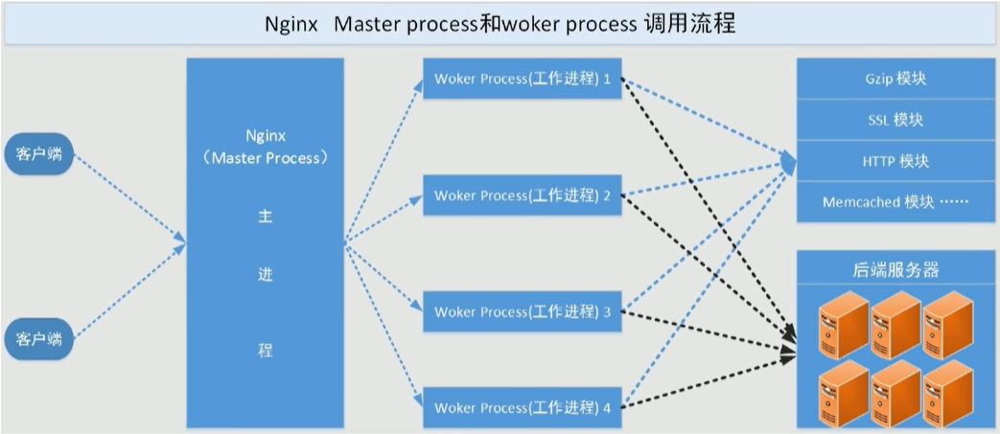
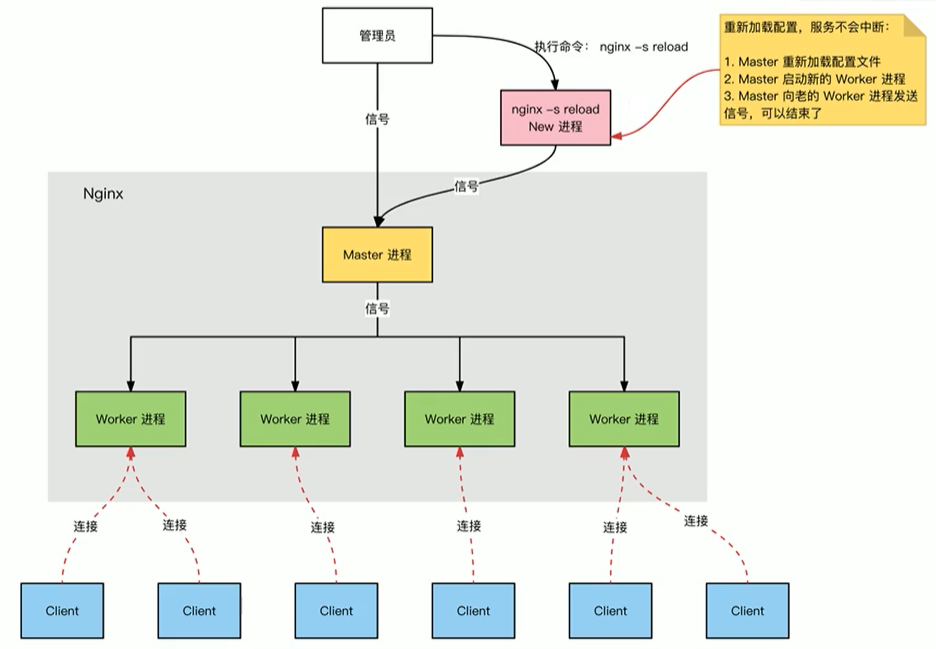
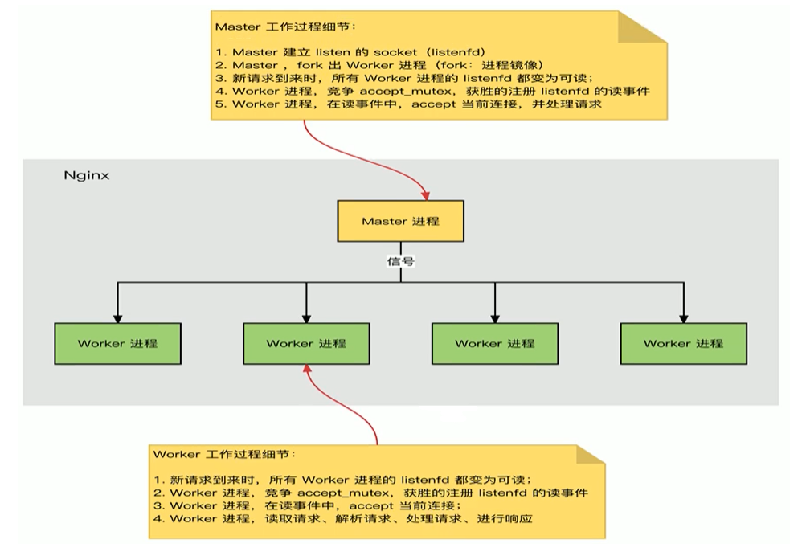
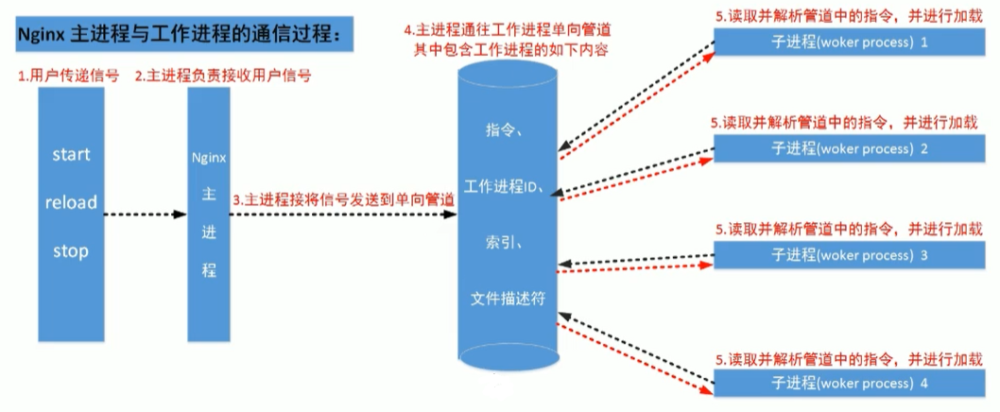
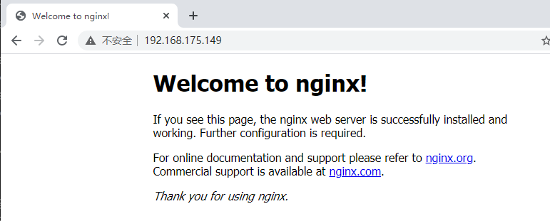
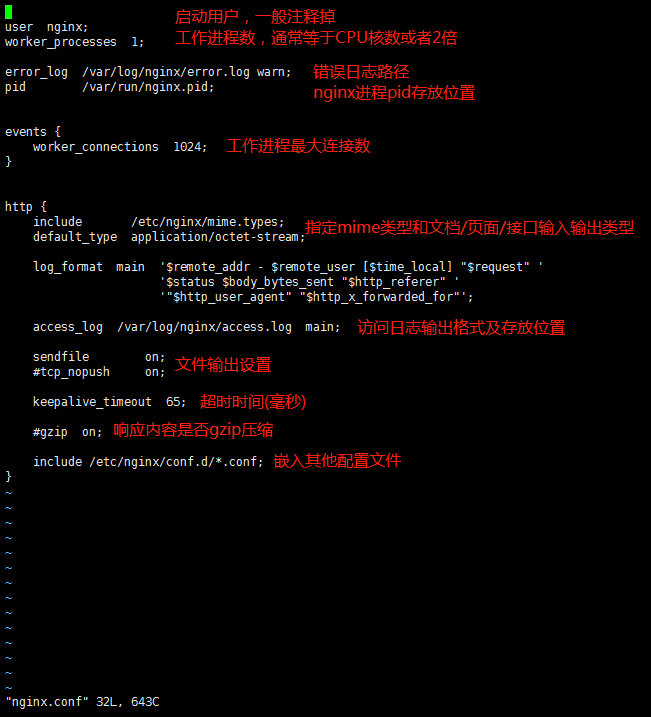
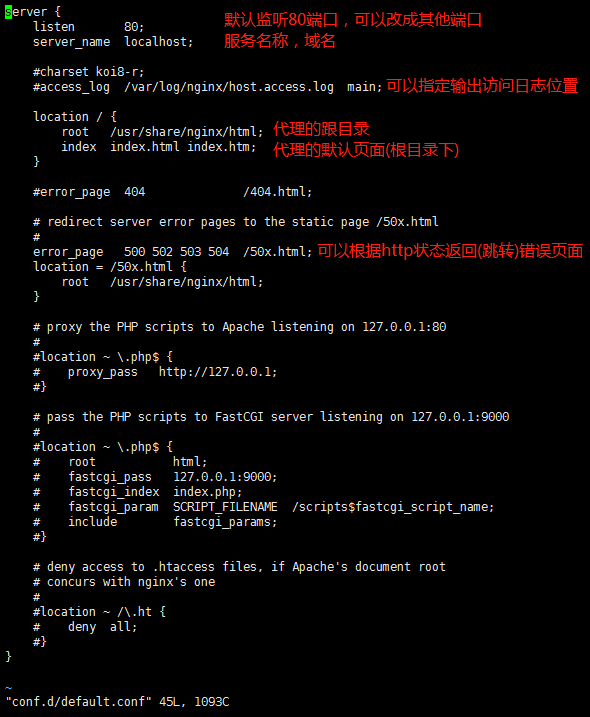
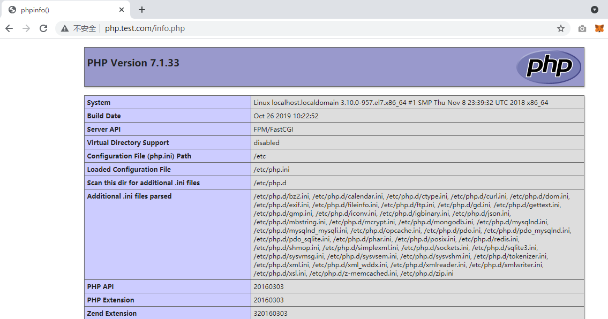

# Nginx介绍

Nginx：engine X ，2002年开始开发，2004年开源，2019年3⽉11⽇，Nginx公司被F5 Networks以6.7亿美元收购。

Nginx 则是免费的、开源的、⾼性能的HTTP和反向代理服务器、邮件代理服务器、以及TCP/UDP代理服务器 解决[C10K问题](https://www.ideawu.net/blog/archives/740.html)（10K Connections）

Nginx官⽹：[http://nginx.org](http://nginx.org/)

Nginx 商业版为Nginx Plus：https://www.nginx.com/products/nginx/

- nginx的其它的⼆次发⾏版：
  - Tengine：由淘宝⽹发起的Web服务器项⽬。它在Nginx的基础上，针对⼤访问量⽹站的需求，添加了很多⾼级功能和特性。Tengine的性能和稳定性已经在⼤型的⽹站如淘宝⽹，天猫商城等得到了很好的检验。它的最终⽬标是打造⼀个⾼效、稳定、安全、易⽤的Web平台，从2011年12⽉开始，Tengine成为⼀个开源项⽬，官⽹http://tengine.taobao.org/
  - OpenResty：基于 Nginx 与 Lua 语⾔的⾼性能 Web 平台， 章亦春团队开发，官⽹：http://openresty.org/cn/

# Nginx功能介绍

- 静态的web资源服务器html，图⽚，js，css，txt等静态资源
- 结合FastCGI/uWSGI/SCGI等协议反向代理动态资源请求
- http/https协议的反向代理
- imap4/pop3协议的反向代理
- tcp/udp协议的请求转发（反向代理）

## 基础特性

- 模块化设计，较好的扩展性
- ⾼可靠性 远远超过apache
- ⽀持热部署：不停机更新配置⽂件，升级版本，更换⽇志⽂件
- 低内存消耗：10000个keep-alive连接模式下的⾮活动连接，仅需2.5M内存
- event-driven,aio,mmap（内存映射），sendfile

## web服务相关的功能

- 虚拟主机（server）
- ⽀持 keep-alive 和管道连接(利⽤⼀个连接做多次请求)
- 访问⽇志（⽀持基于⽇志缓冲提⾼其性能）
- url rewirte
- 路径别名
- 基于IP及⽤⼾的访问控制
- ⽀持速率限制及并发数限制
- 重新配置和在线升级⽽⽆须中断客⼾的⼯作进程

# Nginx架构和进程

## Nginx架构



## Nginx进程结构

- web请求处理机制
  - 多进程方式:服务器每接收到一个客户端请求就有服务器的主进程生成一个子进程响应客户端，直到用户关闭连接，这样的优势是处理速度快。子进程之间相互独立，但是如果访问过大会导致服务器资源耗尽而无法提供请求。
  - 多线程方式:与多进程方式类似，但是每收到一个客户端请求会有服务进程派生出一个线程来个客户方进行交互，一个线程的开销远远小于一个进程，因此多线程方式在很大程度减轻了web服务器对系统资源的要求，但是多线程也有自己的缺点。即当多个线程位于同一个进程内工作的时候，可以相互访问同样的内存地址空间，所以他们相互影响，一旦主进程挂掉则所有子线程都不能工作了，IIS服务器使用了多线程的方式，需要间隔一段时间就重启一次才能稳定。
- Nginx是多进程组织模型，而且是一个由Master主进程和Worker工作进程组成。



- 主进程(master process)的功能:
  - 对外接口:接收外部的操作(信号)
  - 对内转发:根据外部的操作的不同，通过信号管理worker
  - 监控:监控worker进程的运行状态，worker进程异常终止后，自动重启worker进程
  - 读取Nginx配置文件并验证其有效性和正确性
  - 建立、绑定和关闭socket连接
  - 按照配置生成、管理和结束工作进程
  - 接受外界指令，比如重启、升级及退出服务器等指令
  - 不中断服务，实现平滑升级，重启服务并应用新的配置
  - 开启日志文件，获取文件描述符
  - 不中断服务，实现平滑升级，升级失败进行回滚处理
  - 编译和处理perl脚本
- 工作进程(worker process的功能:
  - 所有Worker进程都是平等的
  - 实际处理:网络请求，由Worker进程处理
  - Worker进程数量:在nginx.conf 中配置，一般设置为核心数，充分利用CPU资源，同时，避免进程数量过多，避免进程竞争CPU资源，增加
  - 上下文切换的损耗
  - 接受处理客户的请求
  - 将请求依次送入各个功能模块进行处理
  - I/O调用，获取响应数据
  - 与后端服务器通信，接收后端服务器的处理结果
  - 缓存数据，访问缓存索引，查询和调用缓存数据
  - 发送请求结果，响应客户的请求
  - 接收主程序指令，比如重启、升级和退出等





## Nginx进程间通信

⼯作进程是有主进程⽣成的，主进程由root启用，主进程使⽤fork()函数，在Nginx服务器启动过程中主进程根据配置⽂件决定启动⼯作进程的数量，然后建⽴⼀张全局的⼯作表⽤于存放当前未退出的所有的⼯作进程，主进程⽣成⼯作进程后会将新⽣成的⼯作进程加⼊到⼯作进程表中，并建⽴⼀个单向的管道并将其传递给⼯作进程，该管道与普通的管道不同，它是由主进程指向⼯作进程的单项通道，包含了主进程向⼯作进程发出的指令、⼯作进程ID、⼯作进程在⼯作进程表中的索引和必要的⽂件描述符等信息，单向管道，工作进程只能监听内容之后读取指令。 主进程与外界通过信号机制进⾏通信，当接收到需要处理的信号时，它通过管道向相关的⼯作进程发送正确的指令，每个⼯作进程都有能⼒捕获管道中的可读事件，当管道中有可读事件的时候，⼯作进程就会从管道中读取并解析指令，然后采取相应的执⾏动作，这样就完成了主进程与⼯作进程的交互。

⼯作进程之间的通信原理基本上和主进程与⼯作进程之间的通信是⼀样的，只要⼯作进程之间能够取得彼此的信息，建⽴管道即可通信，但是由于⼯作进程之间是完全隔离的，因此⼀个进程想要知道另外⼀个进程的状态信息就只能通过主进程来设置了。

为了实现⼯作进程之间的交互，主进程在⽣成⼯作进程之后，在⼯作进程表中进⾏遍历，将该新进程的ID以及针对该进程建⽴的管道句柄传递给⼯作进程中的其他进程，为⼯作进程之间的通信做准备，当⼯作进程1向⼯作进程2发送指令的时候，⾸先在主进程给它的其他⼯作进程⼯作信息中找到2的进程ID，然后将正确的指令写⼊指向进程2的管道，⼯作进程2捕获到管道中的事件后，解析指令并进⾏相关操作，这样就完成了⼯作进程之间的通信。



## 连接建立和请求处理过程

- Nginx启动时，Master 进程，加载配置文件
- Master进程，初始化监听的socket
- Master进程，fork 出多个Worker进程
- Worker进程，竞争新的连接，获胜方通过三次握手，建立Socket连接，并处理请求

## HTTP处理过程


# Nginx模块介绍

- nginx有多种模块
  - 核心模块:是Nginx服务器正常运行必不可少的模块，提供错误日志记录、配置文件解析、事件驱动机制、进程管理等核心功能
  - 标准HTTP模块:提供HTTP协议解析相关的功能，比如:端口配置、网页编码设置、HTTP响应头设置 等等
  - 可选HTTP模块:主要用于扩展标准的HTTP功能，让Nginx能处理一些特殊的服务， 比如: Flash 多媒体传输、解析GeolP请求、网络传输压缩、安全协议SSL支持等
  - 邮件服务模块:主要用于支持Nginx的邮件服务，包括对POP3协议、IMAP 协议和SMTP协议的支持
  - Stream服务模块:实现反向代理功能包括TCP协议代理
  - 第三方模块:是为了扩展Nginx服务器应用，完成开发者自定义功能，比如: Json支持、 Lua 支持等
- nginx高度模块化，但其模块早期不支持DSO机制;1.9.11版本支持动态装载和卸载
- 模块分类：
  - 标准模块
    - HTTP模块：ngx_http_*
      - HTTP Core modules 默认功能
      - HTTP Optional modules 需要编译时指定
    - Mail模块：ngx_mail_*
    - Stream模块：ngx_stream_*
  - 第三方模块
    - http://nginx.org/en/docs/

# Nginx安装

Nginx版本分为Mainline version(主要开发版本)、Stable version(当前最新稳定版)和Legacy versions(旧的稳定版)http://nginx.org/en/download.html

Nginx安装可以使用yum或源码安装，但是推荐使用源码编译安装

- yum的版本比较旧
- 编译安装可以更方便自定义相关路径
- 使用源码编译可以自定义相关功能，更方便业务的上的使用

源码安装需要提前准备标准的编译器，GCC的全称是(GNU Compiler collection)，其有GNU开发,并以GPL即LGPL许可，是自由的类UNIX即苹果电脑Mac OS X操作系统的标准编译器，因为GCC原本只能处理C语言，所以原名为GNU C语言编译器，后来得到快速发展,可以处理C++,Fortran, pascal, objective-C, java以及Ada等其他语言，此外还需要Automake:工具，以完成自动创建Makefile的工作,Nginx的一些模块需要依赖第三方库，比如: pcre (支持rewrite) ，zlib (支持gzip模块) 和openssI (支持ssI模块) 等。

## 基于yum安装nginx

### 查看当前系统中的nginx版本

范例：查看系统和EPEL的nginx版本

要先装第三方库，否则没有Nginx，yum -y install epel-release

```shell
[root@localhost ~]# yum info nginx
[root@localhost ~]# yum -y install nginx
[root@localhost ~]# rpm -ql nginx
[root@localhost ~]# systemctl start nginx
[root@localhost ~]# systemctl enable nginx
```

### 官方包源码安装最新版本nginx

系统和EPEL源的中nignx版本较旧,可以安装官方源的最新版本

官方包链接:

```shell
http://nginx.org/en/linux_packages.html
```

查看官方编译指令：

```shell
[root@localhost ~]# nginx -V
```

## 编译安装

- 从官网获取源码包，以1.18.0举例

```shell
[root@localhost ~]# wget http://nginx.org/download/nginx-1.18.0.tar.gz -P /usr/local/src/
[root@localhost ~]# cd /usr/local/src
[root@localhost src]# tar xzvf nginx-1.18.0.tar.gz 
[root@localhost src]# cd nginx-1.18.0
[root@localhost nginx-1.18.0]# ./configure --help
```

- 编译安装

```shell
[root@localhost nginx-1.18.0]# yum -y install gcc pcre-devel openssl-devel zlib-devel
[root@localhost nginx-1.18.0]# useradd -r -s /sbin/nologin nginx
[root@localhost nginx-1.18.0]# ./configure --prefix=/apps/nginx \
--user=nginx \
--group=nginx \
--with-http_ssl_module \
--with-http_v2_module \
--with-http_realip_module \
--with-http_stub_status_module \
--with-http_gzip_static_module \
--with-pcre \
--with-stream \
--with-stream_ssl_module \
--with-stream_realip_module \
--with-file-aio
[root@localhost nginx-1.18.0]# make -j 2 && make install
[root@localhost nginx-1.18.0]# chown -R nginx.nginx /apps/nginx
[root@localhost nginx-1.18.0]# ln -s /apps/nginx/sbin/nginx /usr/bin/
[root@localhost nginx-1.18.0]# nginx -v
```

- nginx完成安装以后，有四个主要的目录
  - **conf:**保存nginx所有的配置文件，其中nginx.conf是nginx服务器的最核心最主要的配置文件，其他的.conf则是用来配置nginx相关的功能的，例如fastcgi功能使用的是fastcgi. conf和fastcgi.params两个文件，配置文件一般都有个样板配置文件，是文件名. default结尾，使用的使用将其复制为并将default去掉即可。
  - **html:**目录中保存了nginx服务器的web文件，但是可以更改为其他目录保存web文件，另外还有一个50x的web文件是默认的错误页面提示页面。
  - **logs:**用来保存ngi nx服务器的访问日志错误日志等日志，logs目录可以放在其他路径，比如/var/logs/nginx里面。
  - sbin:保存nginx二进制启动脚本，可以接受不同的参数以实现不同的功能。

```shell
[root@localhost nginx-1.18.0]# tree /apps/nginx -C -L 1
/apps/nginx
├── conf
├── html
├── logs
└── sbin
```

### 启动和停止nginx测试访问web界面

- 启动和关闭nginx

```shell
[root@localhost nginx-1.18.0]# nginx 
[root@localhost nginx-1.18.0]# nginx -s stop
```



###  创建nginx自启动文件

```shell
# 复制同一版本的nginx的yum安装生成的service文件
[root@localhost ~]# vim /usr/lib/systemd/system/nginx.service
[Unit]
Description=The nginx HTTP and reverse proxy server
Documentation=http://nginx.org/en/docs/
After=network.target remote-fs.target nss-lookup.target
Wants=network-online.target
 
[Service]
Type=forking
PIDFile=/apps/nginx/run/nginx.pid
ExecStart=/apps/nginx/sbin/nginx -c /apps/nginx/conf/nginx.conf
ExecReload=/bin/kill -s HUP $MAINPID
ExecStop=/bin/kill -s TERM $MAINPID
 
[Install]
WantedBy=multi-user.target
[root@localhost ~]# mkdir /apps/nginx/run/
[root@localhost ~]# vim /apps/nginx/conf/nginx.conf
pid        /apps/nginx/run/nginx.pid;
```

### 验证Nginx自启动文件

```shell
[root@localhost ~]# systemctl daemon-reload
[root@localhost ~]# systemctl enable --now nginx
[root@localhost ~]# ll /apps/nginx/run
总用量 4
-rw-r--r--. 1 root root 5 5月  24 10:07 nginx.pid
```

# Nginx核心配置详解

## 配置文件说明

- nginx官方帮助文档
  - http://nginx.org/en/docs/
- tengine帮助文档
  - http://tengine.taobao.org/documentation.html
- Nginx的配置文件的组成部分
  - 主配置文件：nginx.conf
  - 子配置文件：include conf.d/*.conf
  - fastcgi, uwsgi, scgi等协议相关的配置文件
  - mime.types：支持的mime类型，MIME(Multipurpose Internet Mail Extensions)多用途互联网邮件扩展类型，MIME消息能包含文本、图像、音频、视频以及其他应用程序专用的数据，是设定某种扩展名的文件用一种应用程序来打开的方式类型，当该扩展名文件被访问的时候，浏览器会自动使用指定应用程序来打开。多用于指定一些客户端自定义的文件名，以及一-些媒体文件打开方式。MIME参考文档:https://developer.mozilla.org/zh-CN/docs/Web/HTTP/Basics_of_HTTP/MIME_types
- Nginx主配置文件的配置指令方式

```shell
directive value [value2 ...];
注意
(1) 指令必须以封号结尾
(2) 支持使用配置变量
    内建变量：由Nginx模块引入，可直接应用
    自定义变量：由用户使用set命令定义，格式：set variable_name value;
    引用变量：$variable_name
```

- 主配置文件结构：四部分

```shell
main block：主配置段，既全局配置段，对http,mail都有效
# 事件驱动相关的配置
event {
  ...
}
# http/https协议相关配置段
http {
  ...
}
# 默认配置文件不包括下面两个块
# mail协议相关配置段
mail {
  ...
}
# stream服务器相关配置段
stream {
  ...
}
# 导入其他路径的配置文件
include /apps/nginx/conf.d/*.conf
```

## 默认的nginx.conf配置文件格式说明





##  全局配置

Main全局配置段常见的配置指令分类

- 正常运行必备的配置
- 优化性能相关的配置
- 用于调试及定位问题相关的配置
- 时间驱动相关的配置

全局配置说明

### CPU性能优化

```shell
user    nginx nginx;    #启动Nginx工作进程的用户和组
worker_processes [number | auto];   #启动Nginx工作进程的数量，一般设为和CPU核心数相同
worker_cpu_affinity 0001 0010 0100 1000;  # 将Nginx工作进程绑定到指定的CPU核心，默认Nginx是不进行进程绑定的，绑定并不是意味着当前nginx进程独占一核心CPU，但是可以保障此进程不会运行在其他核心上，这就极大减少了nginx的工作进程在不同的cpu核心上的来回跳转，减少了cpu对进程的资源分配与回收以及内存管理等，因此可以有效的提升nginx服务器的性能。
CPU MASK：0001    0号CPU
          0010    1号CPU
          0100    2号CPU
          1000    3号CPU
[root@localhost ~]# watch -n.5 'ps axo pid,cmd,psr |grep nginx'
# 查看nginx进程对应的CPU
  6834 nginx: master process /apps   2
 47621 nginx: worker process         0
 47622 nginx: worker process         1
 47623 nginx: worker process         2
 47624 nginx: worker process         3
[root@localhost ~]# while true;do ab -c 1000 -n 2000 http://127.0.0.1/;done
# 压力测试 要先yum -y install httpd-tools
```

### 错误日志记录配置

```shell
# 错误日志记录配置，语法：error_log file [debug | info | notice | warn | error | crit | alert |emerg]
# error_log logs/error.log;
# error_log logs/error.log notice;
error_log /app/nginx/logs/error.log error;
```

### 工作优先级与文件并发数

```shell
worker_priority 0;   #工作进程优先级(-20~19)
worker_rlimit_nofile 65536;     #所有worker进程能打开的文件数量上线，包括：Nginx的所有连接(例如与代理服务器的连接等)，而不仅仅是与客户端的连接，另一个考虑因素是实际的并发连接数不能超过系统级别的最大打开文件数的限制，最好与ulimit -n的值保持一致
[root@localhost ~]# vim /etc/security/limits.conf
*        soft    nofile    102400
*        hard    nofile    102400

# 查看优先级
[root@localhost ~]# watch -n.5 'ps axo pid,cmd,psr,nice |grep nginx'
```

### 其他优化配置

```shell
daemon off;    # 前台运行nginx服务，用于测试、docker等环境
master_process off|on;    # 是否开启Nginx的master-worker工作模式，仅用于开发调试场景，默认为on
events {
  worker_connections 65536;    # 设置单个工作进程的最大并发连接数
  use epoll;    # 使用epoll事件驱动，Nginx支持众多的事件驱动，比如：select、poll、epoll,只能设置在events模块中
  accept_mutex on;  # on为同一时刻一个请求轮流由work进程处理，而防止被同时唤醒所有worker，避免多个睡眠进程被唤醒的设置，默认为off,新请求会唤醒所有worker进程，此过程也被称为"惊群",因此nginx刚安装完以后要进行适当的优化，建议设置为on
  multi_accept on;  # on时Nginx服务器的每个工作进程可以同时接受多个新的网络连接，此指令默认为off，即默认为一个工作进程只能一次接受一个新的网络连接，打开后几个同时接受多个，建议设置为on
}
```

- 默认配置并不支持高并发，在压力测试下会报错

```shell
[root@localhost ~]# while true;do ab -c 5000 -n 10000 http://127.0.0.1/;sleep 0.5;done

[root@localhost ~]# tail /apps/nginx/logs/error.log
2021/05/24 12:35:53 [crit] 6828#0: *10996 open() "/apps/nginx/html/index.html" failed (24: Too many open files), client: 127.0.0.1, server: localhost, request: "GET / HTTP/1.0", host: "127.0.0.1"
2021/05/24 12:35:53 [crit] 6828#0: *10996 open() "/apps/nginx/html/50x.html" failed (24: Too many open files), client: 127.0.0.1, server: localhost, request: "GET / HTTP/1.0", host: "127.0.0.1"
[root@localhost ~]# vim /etc/security/limits.conf
*        -       nproc     100000
[root@localhost ~]# vim /apps/nginx/conf/nginx.conf
worker_rlimit_nofile 65536;
events {
    worker_connections  10240;
}
[root@localhost ~]# systemctl restart nginx
```

## http配置块

http协议相关的配置结构

```shell
http {
  ...
  ... #各server的公共配置
  server {    # 每个server用于定义一个虚拟主机，第一个server为默认虚拟服务器
    ...
  }
  server {
    ...
    server_name    # 虚拟主机名
    root      # 主目录
    alias      # 路径别名
    location [OPERATOR] URL {    # 指定URL的特性
      ...
      if CONDOTION {
        ...
      }
    }
  }
}
```

http协议配置说明

```shell
http {
  include mime.types;    # 导入支持的文件类型，是相对于/apps/nginx/conf的目录
  default_type  application/octet-stream;    # 除mime.types中文件类型外，设置其他文件默认类型，访问其他类型时会提示下载不匹配的类型文件
    
    # 日志配置部分
    #log_format  main  '$remote_addr - $remote_user [$time_local] "$request" '
    #                  '$status $body_bytes_sent "$http_referer" '
    #                  '"$http_user_agent" "$http_x_forwarded_for"';
    #access_log  logs/access.log  main;
    # 自定义优化参数
    sendfile on;
    #tcp_nopush on;#在开启了sendfile的情况下，合并请求后统一发送给客户端
    #tcp_nodelay off;#在开启了keeplived模式下的连接是否启用TCP_NODELAY选项，当为off时，延迟0.2s发送，默认on时，不延迟
    #keepalive_timeout 0;
    keepalive_timeout 65 65;# 设置会话保持时间，第二个值为响应首部:keep-Alived:timeout=65,可以和第一个值不同
    #gzip on;#开启文件压缩
    
    server {
      listen 80;# 设置监听端口
      server_name localhost;# 设置server name,可以空格隔开写多个，并支持正则表达式，如：*.iproute.cn
    }
}
```

### MIME

```shell
# 在响应报文中将指定的文件扩展名映射至MIME对应的类型
include            /etc/nginx/mime.types;
default_type        application/octet-stream;
types {
  text/html html;
  images/gif gif;
  images/jpeg jpg;
}
```

范例：识别php文件为text/html

```shell
[root@localhost ~]# cat << eof > /apps/nginx/html/test.php
> <?php
> phpinfo();
> ?>
> eof
[root@localhost ~]# curl 127.0.0.1/test.php -I
HTTP/1.1 200 OK
Server: nginx/1.18.0
Date: Mon, 24 May 2021 06:05:05 GMT
Content-Type: application/octet-stream
Content-Length: 20
Last-Modified: Mon, 24 May 2021 06:04:49 GMT
Connection: keep-alive
ETag: "60ab4201-14"
Accept-Ranges: bytes
[root@localhost ~]# vim /apps/nginx/conf/nginx.conf
http {
    include       mime.types;
    default_type  text/html;
...
[root@localhost ~]# nginx -s reload
[root@localhost ~]# curl 127.0.0.1/test.php -I
```

### 指定响应报文server首部

```shell
# 是否在响应报文中的Content-Type显示指定的字符集，默认off不显示
charset charset | off;
# 示例
charset utf-8;
# 是否在响应报文的Server首部显示nginx版本
server_tokens on | off |build | string
```

范例：修改server字段

```shell
# 如果想自定义响应报文的nginx版本信息，需要修改源码文件，重新编译
# 如果server_tokens on,修改 src/core/nginx.h 修改第13-14行，如下示例
#define NGINX_VERSION "1.68.9"
#define NGINX_VER "mynginx" NGINX_VERSION
如果server_tokens off, 修改 src/http/ngx_http_header_filter_module.c
第49行，如下示例：
static char ngx_http_server_string[] = 'Server: nginx' CRLF;
把其中的nginx改为自己想要的文字即可，如mynginx
```

范例：修改Server头部信息

```shell
[root@localhost ~]# vim /usr/local/src/nginx-1.18.0/src/core/nginx.h
# define NGINX_VERSION    "1.68.9"
# define NGINX_VER        "mynginx/" NGINX_VERSION
[root@localhost ~]# vim nginx-1.18.0/src/http/ngx_http_header_filter_module.c
static u_char ngx_http_server_string[] = "Server: mynginx" CRLF;
```

## 核心配置示例

基于不同的IP、不同的端口以及不用得域名实现不同的虚拟主机，依赖于核心模块ngx_http_ core_module实现。

### PC站与手机站

- 定义子配置文件路径，在主配置文件最后添加导入

```shell
[root@localhost ~]# mkdir /apps/nginx/conf.d
[root@localhost ~]# vim /apps/nginx/nginx.conf
http {
...
    include /apps/nginx/conf.d/*.conf;
}
```

- 创建pc网站配置

```shell
[root@localhost ~]# vim /apps/nginx/conf.d/pc.conf
server {
    listen 80;
    server_name www.test.com;
    location / {
        root /apps/nginx/html/www;
    }
}
[root@localhost ~]# mkdir -p /apps/nginx/html/www
[root@localhost ~]# echo "hello world" > /apps/nginx/html/www/index.html
[root@localhost ~]# systemctl reload nginx
```

- 创建移动端的网站配置

```shell
[root@localhost ~]# vim /apps/nginx/conf.d/mobile.conf
server {
    listen 80;
    server_name m.test.com;
    location / {
        root /data/nginx/html/mobile;
    }
}
[root@localhost ~]# mkdir -p /apps/nginx/html/mobile
[root@localhost ~]# echo "hello mobile" > /apps/nginx/html/mobile/index.html
[root@localhost ~]# systemctl reload nginx
```

### root与alias

- root：指定web的家目录，在定义location的时候，文件的绝对路径等于**root+location**

**范例：**

```shell
server {
  listen 80;
  server_name iproute.cn;
  location / {
    root /apps/nginx/html/www;
  }
  
  location /about {
    root /opt/html;    # 必须要在html目录中创建一个about目录才可以访问，否则报错
  }
}
[root@localhost ~]# mkdir -p /opt/html/about
[root@localhost ~]# echo "about" > /opt/html/about/index.html
# 重启Nginx并访问测试
如果：
location /about {
    root /opt/html/about;    
  }
此时访问URL/about时候，访问的/opt/html/about/about/index.html 没有页面因此返回404
```

- alias：定义路径别名，会把访问的路径重新定义到其指定的路径，文档映射的另一种机制；仅能用于location上下文，此指令使用较少

范例：

```shell
server {
  listen 80;
  server_name iproute.cn;
  location / {
    root /data/nginx/html/www;
  }
    
  location /about {    # 注意about后不要加/，使用alias的时候uri后面加了斜杠，下面的路径也必须加，不然403错误
    alias /opt/html/about;    # 当访问about的时候，会显示alias定义的/opt/html/about里面的内容
  }
}
```

### location的详细使用

在一个server中location配置段可存在多个，用于实现从uri到文件系统的路径映射; ngnix会根据用户请求的URI来检查定义的所有location,按一定的优化级找出一 个最佳匹配，而后应用其配置。

在没有使用正则表达式的时候，nginx会先在server中的多个location选取匹配度最高的一个uri, uri是用户请求的字符串，即域名后面的web文件路径，然后使用该location模块中的正则ur|和字符串，如果匹配成功就结束搜索，并使用此location处理此请求。

location官方帮助:http://nginx.org/en/docs/http/ngx_http_core_module.html#location

- 语法规则

```shell
location [ = | ~ | ~* | ^~ ] uri { ... }
```

| 匹配正则                                                     | 解释                                                         |
| :----------------------------------------------------------- | :----------------------------------------------------------- |
| =                                                            | 用于标准uri前，需要请求字串与uri精确匹配，大小敏感,如果匹配成功就停止向下匹配并立即处理请求 |
| ^~                                                           | 用于标准uri前，表示包含正则表达式，并且适配以指定的正则表达式开头,对URI的最左边部分做匹配检查，不区分字符大小写 |
| ~                                                            | 用于标准uri前，表示包含正则表达式，并且区分大小写            |
| ~*                                                           | 用于标准uri前，表示包含正则表达式， 并且不区分大写           |
| 不带符号                                                     | 匹配起始于此uri的所有的uri                                   |
| \|用于标准uri前，表示包含正则表达式并且转义字符。可以将.*等转义为普通符号 |                                                              |

- 匹配优先级从高到低
  - `=``^~``~/~*``不带符号`
- 官方范例
  - The “`/`” request will match configuration A
  - the “`/index.html`” request will match configuration B
  - the “`/documents/document.html`” request will match configuration C
  - the “`/images/1.gif`” request will match configuration D
  - the “`/documents/1.jpg`” request will match configuration E

```shell
location = / {
    [ configuration A ]
}
location / {
    [ configuration B ]
}
location /documents/ {
    [ configuration C ]
}
location ^~ /images/ {
    [ configuration D ]
}
location ~* \.(gif|jpg|jpeg)$ {
    [ configuration E ]
}
```

#### 精确匹配

- 精确匹配logo

```shell
server {
  listen 80;
  server_name iproute.cn;
  location / {
    root /data/nginx/html/www;
  }
  
  location = /logo.jpg {
    root /data/nginx/images;
  }
}
```

#### 区分大小写

- `~`实现区分大小写的模糊匹配，以下范例中,如果访问uri中包含大写字母的JPG，则以下location匹配Ax.jpg条件不成功，因为~区分大小写，那么当用户的请求被执行匹配时发现location中定义的是小写的jpg.则匹配失败，即要么继续往下匹配其他的location (如果有) ,要么报错给客户端

```shell
location ~ /A.?\.jpg {
  index index.html;
root /data/nginx/html/image;
}
```

#### 不区分大小写

- ~*用来对用户请求的uri做模糊匹配，uri中无论都是大写、都是小写或者大小写混合，此模式也都会匹配，通常使用此模式匹配用户request中的静态资源，并继续做下一步操作，此方式使用较多
- 注意：此方式中，对Linux文件系统上的文件仍然是区分大小写的，如果磁盘文件不存在，仍会提示404

```shell
location ~* /A.?\.jpg {
  index index.html;
  root /data/nginx/html/image;
}
```

#### URI开始

```shell
location ^~ /images {
  index index.html;
  root /data/nginx/html/;
}
location /api {
  index index.html;
  root /data/nginx/api;
}
```

#### 文件名后缀

```shell
location ~* \.(gif|jpg|jpeg|bmp|png|tiff|tif|ico|wmf|js|css)$ {
  index index.html;
  root /data/nginx/static/;
}
```

#### 优先级

```shell
location = /1.jpg {
  index index.html;
  root /data/nginx/static1;
}
location = /1.jpg {
  index index.html;
  root /data/nginx/static2;
}
location ~* \.(gif|jpg|jpeg|bmp|png|tiff|tif|ico|wmf|js|css)$ {
  index index.html;
  root /data/nginx/static3;
}
```

- 查看到底匹配哪个location的方法：

  配置文件里面开启日志access_log  路径  main

  另外开启个SSH连接，tailf这个日志文件观察变化就会显示访问的路径 

- 匹配优先级
  
  - `location =`>`location ^~ 路径`>`location ~,~* 正则`>`location 完整路径`>`location 部分起始路径`>`/`
  - （存疑？）也和location的顺序有关，例如location /如果写在第一个条目，则先匹配这个。

#### 生产使用案例

- 直接匹配网站根会加速Nginx访问处理

```shell
location = /index.html {
  ....
}
location / {
  ...
}
```

- 静态资源配置方法1

```shell
location ^~ /static/ {
  ...
}
```

- 静态资源配置方案2，应用较多

```shell
location ~* \.(gif|jpg|jpeg|png|css|js|ico)$ {
  ...
}
```

- 多应用配置

```shell
location ~* /app1 {
  ...
}
location ~* /app2 {
  ...
}
```

### Nginx四层访问控制

访问控制基于模块ngx_http_access_module实现，可以通过匹配客户端源IP地址进行限制

注意:如果能在防火墙设备控制最好就不要在nginx上配置,可以更好的节约资源

官方帮助：http://nginx.org/en/docs/http/ngx_http_access_module.html

范例：

```shell
location = /login/ {
  root /data/nginx/html/pc;
  allow 10.0.0.0/24
  deny all;
}
location /about {
  alias /data/nginx/html/www;
  index index.html;
  deny 192.168.1.1;
  allow 192.168.1.0/24;
  allow 10.1.1.0/16;
  allow 2001:0db8::/32;
  deny all;
}
```

### Nginx账户认证功能

由ngx_http_auth_basic_module模块提供此功能

官方帮助：http://nginx.org/en/docs/http/ngx_http_auth_basic_module.html

范例：

```shell
[root@localhost ~]# htpasswd -cb /apps/nginx/conf.d/.htpasswd user1 123456
[root@localhost ~]# htpasswd -b /apps/nginx/conf.d/.htpasswd user1 123456
# -c  创建用户
# -b  非交互方式提交密码
[root@localhost ~]# tail /apps/nginx/conf.d/.htpasswd
user1:$apr1$N5FQRfTZ$41cCA49sQCSA9z71hlO6n.
user2:$apr1$/NXK7rS7$1AUTuESFJEQW490XjTs851
location /admin {
  auth_basic "login password";
  auth_basic_user_file /apps/nginx/conf.d/.htpasswd;
}
```

### 自定义错误页面

定义错误页，以指定的响应状态码进行响应,可用位置: http, server, location, if in location

```shell
erro_page code ... [=[response]] uri;
```

范例：

```shell
listen 80;
server_name iproute.cn;
error_page 500 502 503 504 /error.html;
location = /error.html {
  root /data/nginx/html;
}
```

范例：

```shell
error_page 404 /40x.html;
location = /40x.html {
  root /data/html/;
}
```

范例：

```shell
error_page 404 /index.html;
# 如果404，就跳转到主页
```

范例：

- 一些国产浏览器(比如某数字的浏览器)，会恶意的劫持报错页面，然后加上自己的广告

```shell
error_page 404 =302 /index.html; 
# 如果是404，就返回302错误
error_page 500 502 503 504 /50x.html;
  location = /50x.html {
    ...
}
```

### 自定义错误日志

可以自定义错误日志

```shell
Syntax: error_log file [level];
Default:
error_log logs/error.log error;
Context: main, http, mail, stream, server, location
level: debug, info, notice, warn, error, crit, alert, emerg
```

范例：

```shell
listen 80;
server_name iproute.cn;
error_page 500 502 503 504 404 /error.html;
access_log /apps/nginx/logs/iproute_cn_access.log ;
error_log /apps/nginx/logs/iproute_cn_error.log;
location = /error.html {
  root html;
}
```

### 检测文件是否存在

try_files会按顺序检查文件是否存在，返回第一个找到的文件或文件夹 (结尾加斜线表示为文件夹) , 如果所有文件或文件夹都找不到，会进行一个内部重定向到最后一个参数。 只有最后一个参数可以引|起一个内部重定向， 之前的参数只设置内部URl的指向。最后一个参数是回退URI且必须存在，否则会出现内部500错误。

语法格式

```shell
Syntax: try_files file ... uri;
try_files file ... =code;
Default: -
Context: server, location
```

范例：如果不存在页面，就转到default.html页面

```shell
location / {
  root /data/nginx/html/pc;
  index index.html;
  try_files $uri $uri.html $uri/index.html /about/default.html;
  #try_files $uri $uri.html $uri/index.html =456
}
```

### 长连接配置

```shell
keepalive_timeout timeout [header_timeout];
# 设定保持连接超时时长，0表示禁止长连接，默认为75s,通常配置在http字段作为站点全局配置
keepalive_requests number;
# 在一次长连接上所允许请求的资源的最大数量，默认为100次，建议适当调大，比如：500
```

范例：

```shell
keepalive_requests 3;
keepalive_timeout 65 60;
# 开启长连接后，返回客户端的会话保持时间为60s，单次长连接累计请求达到指定次数请求或65秒就会被断开，后面的60为发送给客户端应答报文头部中显示的超时时间设置为60s，如不设置客户端将不显示超时时间。
keep-Alive:timeout=60;
# 浏览器收到的服务器返回的报文
# 如果设置为0表示关闭会话保持功能，将如下显示：
Connection:close  # 浏览器收到的服务器返回的报文
# 使用命令测试
[root@localhost ~]# telnet iproute.cn 80
GET / HTTP/1.1
HOST: iproute.cn
```

### 作为下载服务器

ngx_http_autoindex_module模块处理以斜杠字符"/"结尾的请求，并生成目录列表可以做为下载服务配置使用

官方文档：http://nginx.org/en/docs/http/ngx_http_autoindex_module.html

相关指令：

```shell
autoindex on|off;
# 自动文件索引功能，默认off
autoindex_exact_size on|off;
# 计算文件确切大小(单位bytes),off显示大概大小(单位K、M),默认on
autoindex_localtime on|off;
# 显示本机时间而非GMT(格林威治)时间,默认off
autoindex_format html|xml|json|jsonp;
# 显示索引的页面分割，默认html
limit_rate rate;
# 限制响应客户端传输速率(除GET和HEAD以外的所有方法),单位B/s,既bytes/second,默认值0，表示无限制，此指令由ngx_http_core_module提供
```

范例：实现下载站点

```shell
[root@localhost ~]# mkdir -p /data/nginx/html/www/download
[root@localhost ~]# vim /apps/nginx/conf/conf.d/www.conf
location /download {
  autoindex on;    # 自动索引功能
  autoindex_exact_size on;    # 计算文件大小
  autoindex_localtime on;    # on表示显示本机时间
  limit_rate 1024k;      # 限速，默认不限速
  root /data/nginx/html/www;
}
```

### 作为上传服务器

```shell
client_max_body_size 1m;
# 设置允许客户端上传单个文件的最大值，默认值为1m,上传文件超过此值会出现413错误
client_body_buffer_size size;
# 用户接受每个客户端请求报文的body部分的缓冲区大小;默认16k;超出此大小是，其将被暂存到磁盘上下面client_body_temp_path指定所定义的位置
client_body_temp_path path [level1 [level 2 [level 3]]];
# 设定存储客户端请求报文的body部分的临时存储路径及子目录结构和数量，目录名为16进制的数字，使用hash之后的值从后往前截取1位、2位、2位作为目录名
# 1级目录占1位16进制，即2^4=16个目录 0-f
# 2级默认占2位16进制，即2^8=256个目录 00-ff
# 3级目录占2位16进制，即2^8=256个目录
[root@localhost ~]# md5sum /data/nginx/html/www/index.html
```

### 其他配置

- 对哪种浏览器禁用长连接

```shell
keepalive_disable none | browser ...;
```

- 限制客户端使用除了指定的请求方法置位的其他方法

```shell
limit_execept method ... { ... }；  # 仅用于location
method: GET, HEAD, POST, PUT, DELETE, MKCOL, COPY, MOVE, OPTIONS, PROPFIND, PROPPATCH, LOCK, UNLOCK, PATCH
limit_except GET {
  allow 192.168.0.0/24;
  allow 10.0.0.1;
  deny all;
}
```

- 是否启用asynchronous file I/O(AIO)功能，需要编译开启`--with-file-aio`
- 在读取文件的时候使用异步可以提高效率

```shell
aio on | off;
```

- directio是在写文件到磁盘的时候大小大于size的时候，直接写磁盘，而非写缓存

```shell
directio size | off;
```

- Nginx支持对磁盘中的文件进行缓存

```shell
open_file_cache off;    # 是否缓存打开过的文件信息
open_file_cache max=N [inactive=time];
#nginx可以缓存以下三种信息：
#1. 文件元数据，文件的描述符，文件大小和最近一次的修改时间
#2. 打开的目录结构
#3. 没有找到的或者没有权限访问的文件相关信息
max=N;    # 可缓存的缓存项上限数量；达到上限后会使用LRU(Least recently used,最近最少使用)算法实现管理
inactive=time;    # 缓存项的非活动时长，在此处指定的时长内未被命中的或命中的次数少于open_file_cache_min_user指令所指定的次数的缓存项即为非活动项，将被删除
open_file_cache_valid time;  #缓存项有效性的检查验证频率，默认值为60s
open_file_cache_errors on | off；   #是否缓存查找时发生错误的文件一类的信息，默认值为off
open_file_cache_min_uses number;   # open_file_cache指令的inactive参数指定的时长内，至少被命中此处指定的次数方可被归类为活动项，默认值为1
```

范例：

```shell
open_file_cache max=10000 inactive=60s;
open_file_cache_vaild 60s;
open_file_cache_min+uses 5;
open_file_cache_errors on;
```

# Nginx高级配置

## Nginx状态页

基于nginx模块ngx_http_stub_status_ module实现，在编译安装nginx的时候需要添加编译参数--with-http_stub_status_module,否则配置完成之后监测会是提示语法错误

注意:状态页显示的是整个服务器的状态，而非虚拟主机的状态

```shell
location /nginx_status {
  stub_status on;
  auth_basic "auth login";
  auth_basic_user_file /apps/nginx/conf/.htpasswd;
  allow 192.168.0.0/16;
  allow 127.0.0.1;
  deny all;
}
```


- Active connections: 2 表示Nginx正在处理的活动连接数2个。
- server 2 表示Nginx启动到现在共处理了2个连接
- accepts 2 表示Nginx启动到现在共成功创建2次握手
- handled requests 1 表示总共处理了 1 次请求
- Reading:Nginx 读取到客户端的 Header 信息数，数值越大，说明排队越长，性能不足
- Writing:Nginx 返回给客户端 Header 信息数，数值越大，说明访问量越大
- Waiting:Nginx 已经处理完正在等候下一次请求指令的驻留链接（开启keep-alive的情况下，这个值等于Active-(Reading+Writing)）

## Nginx第三方模块

第三模块是对nginx的功能打展，第三方模块需要在编译安装Nginx的时候使用参数--add-module=PATH指定路径添加，有的模块是由公司的开发人员针对业务需求定制开发的，有的模块是开源爱好者开发好之后上传到github进行开源的模块，nginx支持第三方模块需要从源码重新编译支持，比如:开源的echo模块https://github.com/openresty/echo-nginx-module

```shell
location /main {
     index index.html;
     default_type text/html;
     echo "hello world,main-->";
     echo $remote_addr;
     echo_reset_timer;    # 将计时器开始时间重置为当前时间
     echo_location /sub1;
     echo_location /sub2;
     echo "took $echo_timer_elapsed sec for total.";
}
location /sub1 {
     echo_sleep 2;
     echo hello;
}
location /sub2 {
     echo_sleep 1;
     echo world;
}
[root@localhost ~]# cd /usr/local/src
[root@localhost src]# git clone https://github.com/openresty/echo-nginx-module.git
[root@localhost src]# cd nginx-1.18.0
[root@localhost nginx-1.18.0]# ./configure --prefix=/apps/nginx \
--user=nginx \
--group=nginx \
--with-http_ssl_module \
--with-http_v2_module \
--with-http_realip_module \
--with-http_stub_status_module \
--with-http_gzip_static_module \
--with-pcre \
--with-stream \
--with-stream_ssl_module \
--with-stream_realip_module \
--add-module=/usr/local/src/echo-nginx-module
[root@localhost nginx-1.18.0]# make -j 2 && make install
```


手动下载下来，传到/usr/local/src目录下，解压unzip后重命名为echo-nginx-module目录，重新编译，make一下

Nginx -V可以看到该模块。

## Nginx变量使用

nginx的变量可以在配置文件中应用，作为功能判断或者日志等场景使用

变量可以分为内置变量和自定义变量

内置变量是由nginx模块自带，通过变量可以获取到众多的与客户端访问相关的值

### 内置变量

官方文档：http://nginx.org/en/docs/varindex.html

常用内置变量

```shell
$remote_addr;
# 存放了客户端的地址，注意是客户端的公网IP
$proxy_add_x_forwarded_for;
# 此变量表示将客户端IP追加请求报文中X-Forwarded-For首部字段，多个IP之间用逗号分隔，如果请求中没有X-Forwarder-For，就使用$remote_addr
$args;
# 变量中存放了URL中的参数
$document_root;
# 保存了针对当前资源的系统根目录
$document_uri;
# 保存了当前请求中不包含参数的URI,注意是不包含请求的指令，比如/img/logo.png
$host;
# 存放了请求的host名称
limit_rate 10240;
echo $limit_rate;
# 如果nginx服务器使用limit_rate配置了显示网络速率，则会显示，如果没有设置，则显示0
$remote_port;
# 客户端请求Nginx服务器时随机打开的端口，这是每个客户端自己的端口
$remote_user;
# 已经经过Auth Basic Module验证的用户名
$request_body_file;
# 做反向代理时发给后端服务器的本地资源的名称
$request_method;
# 请求资源的方式，GET/PUT等等
$request_filename;
# 当前请求的资源文件的磁盘路径，由root或alias指令与URL请求生成的文件绝对路径
# /apps/nginx/html/www/index.html
$request_uri;
# 包含请求参数的原始URI,不包含主机名，相当于:$document_uri?$args
$scheme;
# 请求的协议，例如：http,https,ftp等等
$server_protocol;
# 保存了客户端请求资源使用的协议版本，例如：HTTP/1.0,HTTP/1.1,HTTP/2.0等等
$server_addr;
# 保存了服务器的IP地址
$server_name;
# 请求的服务器的主机名
$server_port;
# 请求的服务器的端口号
$http_<name>
# name为任意请求报文首部字段，表示记录请求报文的首部字段
$http_user_agent;
# 客户端浏览器的详细信息
$http_cookie;
# 客户端的cookie信息
$cookie_<name>
# name为任意请求报文首部字段cookie的key名
```

### 自定义变量

假如需要自定义变量名和值，使用指令set $variable value;

语法格式：

```shell
Syntax:set $varible value;
Default: -
Context: server, location, if
```

范例：

```shell
set $name aaron;
echo $name;
set $my_port $server_port;
echo $my_port;
echo "$setver_name:$server_port";
```

## Nginx自定义访问日志

访问日志是记录客户端即用户的具体请求内容信息，全局配置模块中的error_log是记录nginx服务器运行时的日志保存路径和记录日志的level,因此有着本质的区别，而且Nginx的错误日志一般只有一个， 但是访问日志可以在不同server中定义多个，定义一个日志需要使用access_log指定日志的保存路径，使用log_format指定日志的格式,格式中定义要保存的具体日志内容。

访问日志由ngx_http_log_module 模块实现

官方帮助文档：http://nginx.org/en/docs/http/ngx_http_log_module.html

通过命令tailf + 日志名称来查看日志新增情况

语法格式：

```shell
Syntax:	access_log path [format [buffer=size] [gzip[=level]] [flush=time] [if=condition]];
access_log off;
Default:	
access_log logs/access.log combined;
Context:	http, server, location, if in location, limit_except
```

### 自定义默认格式日志

如果是要保留日志的源格式，只是添加相应的日志内容，则配置如下:

```shell
log_format  nginx_format1  '$remote_addr - $remote_user [$time_local] "$request" '
                  '$status $body_bytes_sent "$http_referer" '
                  '"$http_user_agent" "$http_x_forwarded_for"'
                  '$server_name:$server_port';
access_log  logs/access.log  nginx_format1;
# 重启nginx并访问测试日志格式
# /apps/nginx/logs/access.log
```

### 自定义json格式日志

Nginx的默认访问日志记录内容相对比较单一， 默认的格式也不方便后期做日志统计分析，生产环境中通常将nginx日志转换为json日志，然后配合使用ELK做日志收集-统计-分析。

```shell
log_format access_json '{"@timestamp":"$time_iso8601",'
  '"host":"$server_addr",'
  '"clientip":"$remote_addr",'
  '"size":$body_bytes_sent,'
  '"responsetime":$request_time,'
  '"upstreamhost":"$upstream_response_time",'
  '"upstreamhost":"$upstream_addr",'
  '"http_host":"$host",'
  '"uri":"$uri",'
  '"xff":"$http_x_forwarded_for",'
  '"referer":"$http_referer",'
  '"tcp_xff":"$proxy_protocol_addr",'
  '"status":"$status"}';
access_log  logs/access.log  access_json;
```

## Nginx压缩功能

Nginx支持对指定类型的文件进行压缩，然后再传输给客户端，而且压缩还可以设置压缩比例，压缩后的文件大小将比源文件显著变小，这样有助于降低出口带宽的利用率，不过会占用相应的CPU资源。

Nginx对文件的压缩功能是依赖于模块ngx_http_gzip_module

官方文档：https://nginx.org/en/docs/http/ngx_http_gzip_module.html

```shell
# 启用或禁用gzip压缩，默认关闭
gzip on | off;
# 压缩比由低到高1到9，默认为1
gzip_comp_level level;
# 禁用IE6 gzip功能
gzip_disable "MSIE [1-6]\.";
# gzip压缩的最小文件，小于设置值的文件将不会压缩
gzip_min_length 1k;
# 启用压缩功能时，协议的最小版本，默认HTTP/1.1
gzip_http_version 1.0 | 1.1;
# 指定Nginx服务需要向服务器申请的缓存空间的个数和大小，平台不同，默认：32 4k或者 16 8k;
gzip_buffers number size;
# 指明仅对哪些类型的资源执行压缩操作，默认为gzip_types text/html,不用显示指定，否则出错
gzip_types mime-type ...;
# 如果启用压缩，是否在相应报文首部插入"vary: Accept-Encoding",一般建议打开
gzip_vary on | off
# 重启nginx并进行访问测试压缩功能
[root@localhost ~]# curl --head --compressed 127.0.0.1
```

## https功能

Web网站的登录页面都是使用https加密传输的，加密数据以保障数据的安全，HTTPS能够加密信息，以免敏感信息被第三方获取,所以很多银行网站或电子邮箱等等安全级别较高的服务都会采用HTTPS协议，HTTPS其实是有两部分组成: HTTP + SSL/ TLS,也就是在HTTP上又加了一层处理加密信息的模块。服务端和客户端的信息传输都会通过TLS进行加密，所以传输的数据都是加密后的数据。


https 实现过程如下：

1. 客户端发起HTTPS请求
   1. 客户端访问某个web端的https地址，一般都是443端口
2. 服务端的配置
   1. 采用https协议的服务器必须要有一套证书，可以通过一些组织申请，也可以自己制作，目前国内很多⽹站都⾃⼰做的，当你访问⼀个⽹站的时候提示证书不可信任就表示证书是⾃⼰做的，证书就是⼀个公钥和私钥匙，就像⼀把锁和钥匙，正常情况下只有你的钥匙可以打开你的锁，你可以把这个送给别⼈让他锁住⼀个箱⼦，⾥⾯放满了钱或秘密，别⼈不知道⾥⾯放了什么⽽且别⼈也打不开，只有你的钥匙是可以打开的。
3. 传送证书
   1. 服务端给客户端传递证书，其实就是公钥，⾥⾯包含了很多信息，例如证书得到颁发机构、过期时间等等。
4. 客户端解析证书
   1. 这部分⼯作是有客户端完成的，⾸先回验证公钥的有效性，⽐如颁发机构、过期时间等等，如果发现异常则会弹出⼀个警告框提示证书可能存在问题，如果证书没有问题就⽣成⼀个随机值，然后⽤证书对该随机值进⾏加密，就像2步骤所说把随机值锁起来，不让别⼈看到。
5. 传送4步骤的加密数据
   1. 就是将⽤证书加密后的随机值传递给服务器，⽬的就是为了让服务器得到这个随机值，以后客户端和服务端的通信就可以通过这个随机值进⾏加密解密了。
6. 服务端解密信息
   1. 服务端用私钥解密5步骤加密后的随机值之后，得到了客户端传过来的随机值(私钥)，然后把内容通过该值进⾏对称加密，对称加密就是将信息和私钥通过算法混合在⼀起，这样除非你知道私钥，不然是⽆法获取其内部的内容，而正好客户端和服务端都知道这个私钥，所以只要机密算法够复杂就可以保证数据的安全性。
7. 传输加密后的信息
   1. 服务端将⽤私钥加密后的数据传递给客户端，在客户端可以被还原出原数据内容
8. 客户端解密信息
   1. 客户端⽤之前⽣成的私钥获解密服务端传递过来的数据，由于数据⼀直是加密的，因此即使第三⽅获取到数据也⽆法知道其详细内容。

### https配置参数

nginx的https功能基于模块ngx_http_ssl_module实现，因此如果是编译安装的nginx要使用参数ngx_http_ssl_module开启ssI功能，但是作为nginx的核心功能，yum安装的nginx默认就是开启的，编译安装的nginx需要指定编译参数--with-http_ssl_module开启

官方文档：https://nginx.org/en/docs/http/ngx_http_ssl_module.html

配置参数如下：

```shell
ssl on | off;
listen 443 ssl;
# 为指定的虚拟主机配置是否启用ssl功能，此功能在1.15.0废弃，使用listen [ssl]替代。
ssl_certificate /path/to/file;
# 当前虚拟主机使用使用的公钥文件，一般是crt文件
ssl_certificate_key /path/to/file;
# 当前虚拟主机使用的私钥文件，一般是key文件
ssl_protocols [SSLv2] [SSLv3] [TLSv1] [TLSv1.1] [TLSv1.2];
# 支持ssl协议版本，早期为ssl现在是TSL，默认为后三个
ssl_session_cache off | none | [builtin[:size]] [shared:name:size];
# 配置ssl缓存
	off： 
	# 关闭缓存
	none: 
	# 通知客户端支持ssl session cache，但实际不支持
	builtin[:size]：
	# 使用OpenSSL内建缓存，为每worker进程私有
	[shared:name:size]：
	# 在各worker之间使用一个共享的缓存，需要定义一个缓存名称和缓存空间大小，一兆可以存储4000个会话信息，多个虚拟主机可以使用相同的缓存名称。
ssl_session_timeout time;
# 客户端连接可以复用ssl session cache中缓存的有效时长，默认5m
```

### 自签名证书

- 生成ca证书

```shell
cd /apps/nginx
mkdir certs && cd certs
openssl req -newkey rsa:4096 -nodes -sha256 -keyout ca.key -x509 -days 3650 -out ca.crt
```

- 生成证书请求文件

```shell
openssl req -newkey rsa:4096 -nodes -sha256 -keyout iproute.cn.key -out iproute.cn.csr
```

- 签发证书

```shell
openssl x509 -req -days 36500 -in iproute.cn.csr -CA ca.crt -CAkey ca.key -CAcreateserial -out iproute.cn.crt
cat iproute.cn.crt ca.crt > iproute.crt
```

- 验证证书内容

```shell
openssl x509 -in iproute.cn.crt -noout -text
```

### Nginx证书配置

```shell
server {
  listen 80;
  listen 443 ssl;
  ssl_certificate /apps/nginx/certs/iproute.crt;
  ssl_certificate_key /apps/nginx/certs/iproute.cn.key;
  ssl_session_cache shared:sslcache:20m;
  ssl_session_timeout 10m;
  root /data/nginx/html;
}
```

## 虚拟主机

```shell
[root@www conf.d]# ll
总用量 12
-rw-r--r--. 1 root root 107 9月  25 16:45 bbs.conf
-rw-r--r--. 1 root root 109 9月  25 16:45 blog.conf
-rw-r--r--. 1 root root 107 9月  25 16:44 www.conf
[root@www conf.d]# cat *.conf
server {
listen      *:8080;
server_name bbs.eagle.com;
location / {
root /html/bbs;
index index.html;
}
}
server {
listen      *:8080;
server_name blog.eagle.com;
location / {
root /html/blog;
index index.html;
}
}
server {
listen      *:8080;
server_name www.eagle.com;
location / {
root /html/www;
index index.html;
}
}
```

# LNMP架构概述

## 什么是LNMP

LNMP是一套技术的组合，L=Linux、N=Nginx、M~=MySQL、P=PHP

## LNMP架构是如何工作的

- 首先nginx服务是不能请求动态请求，那么当用户发起动态请求时，nginx无法处理
- 当用户发起http请求，请求会被nginx处理，如果是静态资源请求nginx则直接返回，如果是动态请求nginx则通过fastcgi协议转交给后端的PHP程序处理


## Nginx与fastcgi详细工作流程


1. 用户通过http协议发起请求，请求会先抵达LNMP架构中的nginx；
2. nginx会根据用户的请求进行location规则匹配；
3. location如果匹配到请求是静态，则由nginx读取本地直接返回；
4. location如果匹配到请求是动态，则由nginx将请求转发给fastcgi协议；
5. fastcgi收到请求交给php-fpm管理进程，php-fpm管理进程接收  到后会调用具体的工作进程wrapper；
6. wrapper进程会调用PHP程序进行解析，如果只是解析代码，php直接返回；
7. 如果有查询数据库操作，则由php连接数据库（用户 密码 ip）发起查询的操作；
8. 最终数据由mysql-->php-->php-fpm-->fastcgi-->nginx-->http-->user

# LNMP架构环境部署

## 使用官方仓库安装nginx

```bash
[root@localhost ~]# vim /etc/yum.repos.d/nginx.repo
[nginx]
name=nginx repo
baseurl=http://nginx.org/packages/centos/7/$basearch/
gpgcheck=0
enabled=1

[root@localhost ~]# yum -y install nginx
```

## 修改nginx用户

```bash
[root@localhost ~]# groupadd www -g 666
[root@localhost ~]# useradd www -u 666 -g 666 -s /sbin/nologin -M

[root@localhost ~]# sed -i '/^user/c user www;' /etc/nginx/nginx.conf
```

vim /etc/nginx/nginx.conf 可以看到user变成www

## 启动nginx并加入开机自启

```bash
[root@localhost ~]# systemctl start nginx
[root@localhost ~]# systemctl enable nginx
```

## 使用第三方扩展源安装php7.1

```bash
# rpm -Uvh https://dl.fedoraproject.org/pub/epel/epel-release-latest-7.noarch.rpm
# rpm -Uvh https://mirror.webtatic.com/yum/el7/webtatic-release.rpm
[root@localhost ~]# yum -y install epel-release
[root@localhost ~]# vim /etc/yum.repos.d/php.repo
[php]
name = php Repository
baseurl = http://repo.webtatic.com/yum/el7/x86_64/
gpgcheck = 0

[root@localhost ~]# yum -y install php71w php71w-cli php71w-common php71w-devel php71w-embedded php71w-gd php71w-mcrypt php71w-mbstring php71w-pdo php71w-xml php71w-fpm php71w-mysqlnd php71w-opcache php71w-pecl-memcached php71w-pecl-redis php71w-pecl-mongodb
```

用yum info php命令查看版本

## 配置php-fpm用户与nginx的运行用户保持一致

```bash
[root@localhost ~]# sed -i '/^user/c user = www' /etc/php-fpm.d/www.conf
[root@localhost ~]# sed -i '/^group/c user = www' /etc/php-fpm.d/www.conf
```

## 启动php-fpm并加入开机自启

```bash
[root@localhost ~]# systemctl start php-fpm
[root@localhost ~]# systemctl enable php-fpm
```

## 安装mariadb数据库

```bash
[root@localhost ~]# yum install mariadb-server mariadb -y
[root@localhost ~]# systemctl start mariadb
[root@localhost ~]# systemctl enable mariadb
[root@localhost ~]# mysqladmin password '123456'
[root@localhost ~]# mysql -uroot -p123456
```

# LNMP架构环境配置

- 在将nginx与PHP集成的过程中，需要先了解fastcgi代理配置语法

## 设置fastcgi服务器的地址

- 该地址可以指定为域名或IP地址，以及端口

```bash
Syntax: fastcgi_pass address;
Default:-
Context:location,if in location
#语法示例
fastcgi_pass location:9000;
fastcgi_pass unix:/tmp/fastcgi.socket;
```

## 设置fastcgi默认的首页文件

- 需要结合fastcgi_param一起设置

```bash
Syntax: fastcgi_index name;
Default:-
Context:http,server,location
```

## 通过fastcgi_param设置变量

- 将设置的变量传递到后端的fastcgi服务器

```bash
Syntax: fastcgi_param parameter value [if_not_empty];
Default:-
Context:http,server,location
#语法示例
fastcgi_index index.php;
fastcgi_param SCRIPT_FILENAME /code$fastcgi_script_name;
```

## fastcgi_index与fastcgi_param的作用

## Nginx连接Fastcgi服务器配置

```bash
[root@localhost ~]# vim /etc/nginx/conf.d/php.conf
server {
        listen 80;
        server_name php.test.com;
        root /code;

        location / {
                index index.php index.html;
         }

        location ~ \.php$ {
                fastcgi_pass 127.0.0.1:9000;
                fastcgi_param SCRIPT_FILENAME $document_root$fastcgi_script_name; #资源的路径+脚本的名字
                include fastcgi_params;
         }
}
[root@localhost ~]# nginx -t
nginx: the configuration file /etc/nginx/nginx.conf syntax is ok
nginx: configuration file /etc/nginx/nginx.conf test is successful
[root@localhost ~]# systemctl restart nginx
```

一定要关闭selinux： setenforce 0，也要本地hosts文件配置URL。

## 测试Fastcgi是否正常

```bash
[root@localhost ~]# mkdir /code
[root@localhost ~]# vim /code/info.php
<?php
    phpinfo();
?>
```




## 测试数据库连接

```bash
[root@localhost ~]# vim /code/mysqli.php
<?php
    $servername = "localhost";
    $username = "root";
    $password = "123456";

    // 创建连接
    $conn = mysqli_connect($servername, $username, $password);

    // 检测连接
    if (!$conn) {
         die("Connection failed: " . mysqli_connect_error());
    }
    echo "连接MySQL...成功！";
?>
```


# 部署WordPress

## 配置Nginx虚拟主机站点

- 部署博客产品WordPress配置Nginx虚拟主机站点，域名为blog.test.com

```bash
[root@localhost ~]# vim /etc/nginx/conf.d/wordpress.conf
server {
        listen 80;
        server_name blog.test.com;
        root /code/wordpress;
        index index.php index.html;

        location ~ \.php$ {
                root /code/wordpress;
                fastcgi_pass   127.0.0.1:9000;
                fastcgi_index  index.php;
                fastcgi_param  SCRIPT_FILENAME $document_root$fastcgi_script_name;
                include fastcgi_params;
        }
}
[root@localhost code]# nginx -t
[root@localhost code]# systemctl restart nginx
```

## 下载wordpress源码

```bash
[root@localhost ~]# cd /code
[root@localhost code]# wget https://cn.wordpress.org/latest-zh_CN.tar.gz
[root@localhost code]# tar xzvf latest-zh_CN.tar.gz
[root@localhost code]# chown -R www.www /code/wordpress
```


## 创建所需数据库

- 由于wordpress产品需要依赖数据库,所以需要手动建立数据库

```bash
[root@localhost ~]# mysql -uroot -p123456 -e "create database wordpress;show databases;"
+--------------------+
| Database           |
+--------------------+
| information_schema |
| mysql              |
| performance_schema |
| test               |
| wordpress          |
+--------------------+
```

## 配置wordpress


## 设置文件上传大小限制

- 解决nginx上传文件大小限制，413错误

```bash
[root@localhost ~]# vim /etc/nginx/conf.d/wordpress.conf
server {
        listen 80;
        server_name blog.test.com;
        root /code/wordpress;
        index index.php index.html;
        client_max_body_size 100m;

        location ~ \.php$ {
                root /code/wordpress;
                fastcgi_pass   127.0.0.1:9000;
                fastcgi_index  index.php;
                fastcgi_param  SCRIPT_FILENAME $document_root$fastcgi_script_name;
                include fastcgi_params;
        }
}
[root@localhost ~]# nginx -t
[root@localhost ~]# systemctl restart nginx
```

- 测试大文件上传


PHP对文件大小有限制，需要vim /etc/php/php.ini将upload_max_filesize = 2M修改成100M；

以及post_max_size = 8M修改

# 部署wecenter

## 配置nginx

```bash
[root@localhost ~]# vim /etc/nginx/conf.d/wecenter.conf
server {
        listen 80;
        server_name wecenter.test.com;
        root /code/wecenter;
        index index.php index.html;
 
        location ~ \.php$ {
                fastcgi_pass   127.0.0.1:9000;
                fastcgi_index  index.php;
                fastcgi_param  SCRIPT_FILENAME  $document_root$fastcgi_script_name;
                include        fastcgi_params;
        }
}
[root@localhost ~]# nginx -t
[root@localhost ~]# systemctl restart nginx
```

## 获取wecenter源码

- wecenter下载地址：https://download.s21i.faiusr.com/23126342/0/0/ABUIABBPGAAgjvmphwYowKnuxwc.zip?f=WeCenter_3-6-1.zip&v=1625980046

```bash
[root@localhost ~]# mkdir -p /code/wecenter
[root@localhost ~]# cd /code/wecenter/
[root@localhost wecenter]# unzip WeCenter_3-6-1.zip
[root@localhost wecenter]# chown -R www.www /code/wecenter/
```

## 配置数据库

- 由于wecenter产品需要依赖数据库, 所以需要手动建立数据库

```bash
[root@localhost wecenter]# mysql -uroot -p123456 -e "create database wecenter;show databases;"
+--------------------+
| Database           |
+--------------------+
| information_schema |
| mysql              |
| performance_schema |
| test               |
| wecenter           |
| wordpress          |
+--------------------+
```

## 配置Wecenter


# 部署EduSoho

## 配置nginx

```bash
[root@localhost ~]# vim /etc/nginx/conf.d/edu.conf
server {
        listen 80;
        server_name edu.test.com;
        root /code/edusoho/web;
        client_max_body_size 200m;
 
        location / {
                index app.php;
                try_files $uri @rewriteapp;
        }
        location @rewriteapp {
                rewrite ^(.*)$ /app.php/$1 last;
        }
 
        location ~ ^/udisk {
                internal;
                root /code/edusoho/app/data/;
        }
 
        location ~ ^/(app|app_dev)\.php(/|$) {
                fastcgi_pass   127.0.0.1:9000;
                fastcgi_split_path_info ^(.+\.php)(/.*)$;
                include fastcgi_params;
                fastcgi_param  SCRIPT_FILENAME    $document_root$fastcgi_script_name;
                fastcgi_param  HTTPS              off;
                fastcgi_param HTTP_X-Sendfile-Type X-Accel-Redirect;
                fastcgi_param HTTP_X-Accel-Mapping /udisk=/code/edusoho/app/data/udisk;
                fastcgi_buffer_size 128k;
                fastcgi_buffers 8 128k;
        }
        # 配置设置图片格式文件
        location ~* \.(jpg|jpeg|gif|png|ico|swf)$ {
                # 过期时间为3年
                expires 3y;
                # 关闭日志记录
                access_log off;
                # 关闭gzip压缩，减少CPU消耗，因为图片的压缩率不高。
                gzip off;
        }
        # 配置css/js文件
        location ~* \.(css|js)$ {
                access_log off;
                expires 3y;
        }
        # 禁止用户上传目录下所有.php文件的访问，提高安全性
        location ~ ^/files/.*\.(php|php5)$ {
                deny all;
        }
        # 以下配置允许运行.php的程序，方便于其他第三方系统的集成。
        location ~ \.php$ {
                fastcgi_pass   127.0.0.1:9000;
                fastcgi_split_path_info ^(.+\.php)(/.*)$;
                include fastcgi_params;
                fastcgi_param  SCRIPT_FILENAME    $document_root$fastcgi_script_name;
                fastcgi_param  HTTPS              off;
        }
}
[root@localhost ~]# nginx -t
[root@localhost ~]# systemctl restart nginx
```

## 获取edusoho的源码

```bash
[root@localhost ~]# cd /code/
[root@localhost code]# wget http://download.edusoho.com/edusoho-8.2.17.tar.gz
[root@localhost code]# tar xzvf edusoho-8.2.17.tar.gz
[root@localhost code]# chown -R www.www edusoho
```

## 调整php的上传大小

```bash
[root@localhost ~]# vim /etc/php.ini
post_max_size = 200M
upload_max_filesize = 200M
[root@localhost ~]# systemctl restart php-fpm
```

## 配置edusoho


