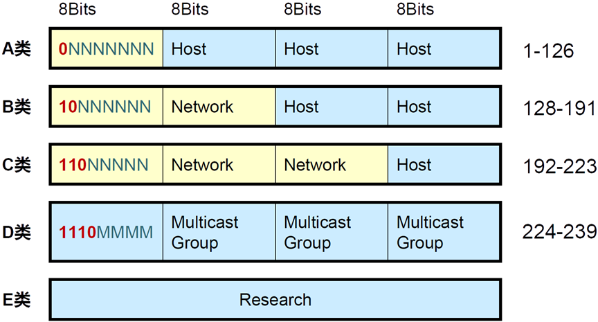
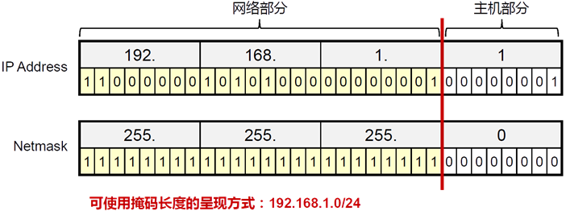

# 数据通信基础

- 数据从产生到传递到目的地的过程中会经历好几个过程，每个过程都负责加工自己这部分的内容，类似于工厂流水线
- 目前我们只需要有个最基本的概念：
  - IP地址是用来标识网络中位置的，比如你在江苏省xxx市xxx路xxx号
  - MAC地址是每个网络设备的唯一ID，比如你的身份证号码
  - 如果想要发送数据，必须(暂且认为必须)同时拥有IP和MAC地址
  - Linux的网络管理基础部分就是需要大家掌握IP地址的配置

## IP地址

- 在IP网络中，通信节点需要有一个唯一的IP地址
- IP地址用于IP报文的寻址以及标识一个节点
- IPv4地址一共32bits，使用点分十进制的形式表示

- IPv4地址由网络位和主机位组成
  - 网络位一致表示在同一个广播域中，可以直接通信
  - 主机位用于在同一个局域网中标识唯一节点

### IP地址的类别

- 早期参与互联网的设备不多，所以仅仅使用ABC类地址分配给用户即可
- 随着网络用户的增多，ABC类分配地址过于浪费，于是出现子网掩码方式划分网络位和主机位

### IP网络通信类型

- 单播(Unicast)
- 广播(Broadcast)
- 组播(Multicast)

### 子网掩码(Netmask)

- 网络掩码与IP地址搭配使用，用于描述一个IP地址中的网络部分及主机部分
- 网络掩码32bits，与32bits的IP地址一一对应，掩码中为1的位对应IP地址中的网络位，掩码中为0的位对应IP地址中的主机位

- 减少一个局域网中的设备数量可以有效降低广播报文消耗资源

- 可变长子网掩码可以将一个局域网中的主机地址分配的更加小

### 广播地址与网络号

- 在局域网中经常会有广播的需要(比如，mac地址查询，地址冲突检测等等)，所以将主机位全为1的地址做为本局域网的广播地址(注意！广播并不能跨越不同的局域网)
- 在网络中需要表示整个局域网，就像邮政编码表示一个大的区域一样，所以将主机位全为0的地址作为本局域网的网络号，用来代指整个网段
- 综上所述，计算产生的子网及每个子网的主机数量公式如下：

### 私有IP地址

- 如果要取得互联网合法地址用于通信，必须要找iana.org组织分配
- 很多企业内部都有大量的网络设备，大多数时候这些设备只需要内部通信即可
- 企业的网络管理员可以从如下网段中自行分配地址

- 私有IP地址空间中的地址不需要申请，随意使用，但是不能在互联网上与合法地址通信(因为对方没法回复你这个地址，因为世界上私有IP地址段无数个重复的，怎么知道回到谁那里呢)
- 而我们明明用的私有IP地址，也可以上网，因为我们需要先把自己的上网请求提交给网络中的网关(就是你家的出口路由器)，再由网关代替我们去获取内容转交给我们的电脑手机，而网关往往能从运营商那里得到一个合法的公有IP地址