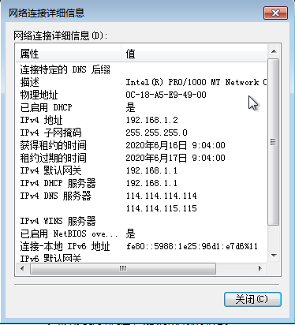
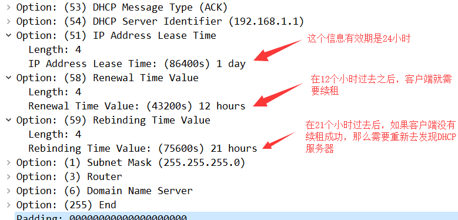
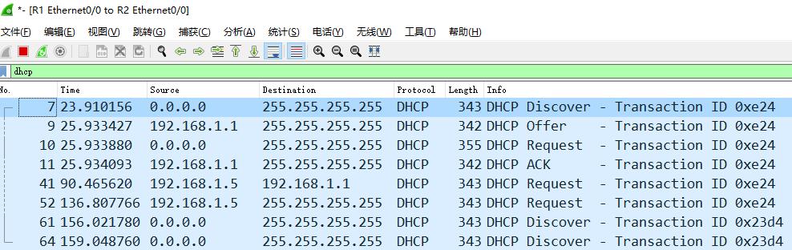
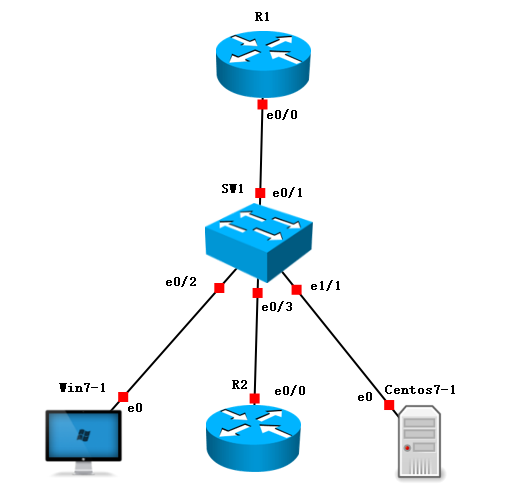
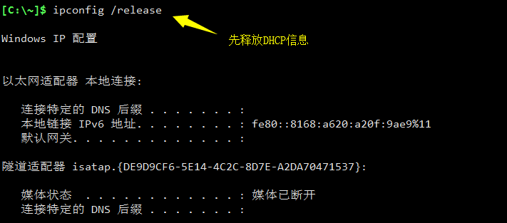
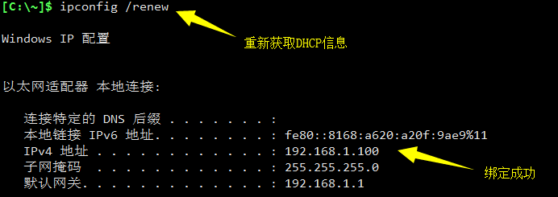

# DHCP

- DHCP用于给设备自动分配IP地址，我们几乎天天用到
- DHCP给设备提供的内容如下
  - IP地址
  - 子网掩码
  - 网关地址
  - DNS服务器地址
  - 租约时间

## DHCP配置

### 拓扑


### 路由器配置

```bash
R1#conf t
R1(config)#int e0/0
R1(config-if)#ip add 192.168.1.1 255.255.255.0
R1(config-if)#no sh
R1(config-if)#ip dhcp pool cisco		# 创建一个地址池
R1(dhcp-config)#network 192.168.1.0 /24		# 在地址池中放一个网段
R1(dhcp-config)#default-router 192.168.1.1		# 设置默认网关
R1(dhcp-config)#dns-server 114.114.114.114 114.114.115.115		# 设置主备DNS
R1(dhcp-config)#lease 1		# 租约时间改为1天
R1(dhcp-config)#exit		
R1(config)#ip dhcp excluded-address 192.168.1.1		# 设置排除地址
```

### 检查IP地址分配情况




- 在路由器上查看地址池分配的情况

```bash
R1#show ip dhcp binding 
Bindings from all pools not associated with VRF:
IP address          Client-ID/	 	    Lease expiration        Type
		    Hardware address/
		    User name
192.168.1.2         010c.18a5.e949.00       Jun 17 2020 09:04 AM    Automatic
192.168.1.3         010c.18a5.fca9.00       Jun 17 2020 09:05 AM    Automatic
```

## DHCP工作过程

通过对DHCP获取信息的过程抓包，可以得到如下4个数据包


1. `Discover`消息是用于客户端向整个内网发送广播，期待DHCP服务器进行回应
   1. 这个数据包中的重要内容就是：消息类型，客户端ID，主机名，请求获得的信息
2. `Offer`消息是DHCP服务器对客户的回应
   1. 这个消息中会回复对方所需要的所有信息
3. `Request`这个是客户端确认DHCP服务器的消息
   1. 这个消息和第一个消息差不多，但是消息类别变为`Request`，并且会携带请求的IP地址
4. `ACK`DHCP服务器给客户端的最终确认
   1. 这个消息和第二个消息差不多，但是消息类型变为`ACK`

## DHCP续租

DHCP分配的信息是有有效期的，在DHCP服务器给客户端的数据包中可以明确看到



为了我们做实验方便，我们将DHCP的租约时间减少到只有两分钟，这样就可以清楚的看到续租的过程

并且我们在客户端获得IP之后，就关闭服务端，让客户端无法续租成功，看客户端是怎么去`Rebinding`的

- DHCP服务端操作

```bash
R1(config)#ip dhcp pool cisco	
R1(dhcp-config)#lease 0 0 2			# 租约时间改为2分钟
R1(config)#int e0/0
R1(config-if)#sh			# 在客户端获得IP信息之后关闭接口
```



### 总结

- 客户端会在租约时间过去$\frac{1}{2}$ 的时候以单播方式请求续租
- 在租约时间过去$\frac{7}{8}$的时候以广播的方式请求续租
- 在租约时间过去100%的时候，以广播方式重新发现局域网中的DHCP服务器

## DHCP地址绑定

- 通过上面的学习，我们知道设备必须提供自己的身份信息才能在dhcp服务端获取地址信息
- 那么想要给设备绑定固定的IP地址，就必须知道设备的身份信息

### 拓扑



- 我们分别测试`windows`、`linux`、`Router`在DHCP中使用什么身份信息

### 路由器配置

```bash
R1#conf t
R1(config)#int e0/0
R1(config-if)#ip add 192.168.1.1 255.255.255.0
R1(config-if)#no sh
R1(config-if)#ip dhcp pool cisco
R1(dhcp-config)#netw 192.168.1.0 /24
R1(dhcp-config)#def 192.168.1.1
R1(dhcp-config)#dns 114.114.114.114 114.114.115.115
R1(dhcp-config)#exit
R1(config)#ip dhcp ex 192.168.1.1
```

### windows绑定DHCP

- 查看windows获取到的IP地址


- 去路由器上查看分配这个地址的对应身份信息

```bash
R1#sh ip dhcp binding 
Bindings from all pools not associated with VRF:
IP address          Client-ID/	 	    Lease expiration        Type
		    Hardware address/
		    User name
192.168.1.3         010c.18a5.af90.00       Jun 18 2020 01:23 AM    Automatic
```

可以看到windows使用的是`010c.18a5.af90.00`这个信息获得的这个IP地址，而这个信息并不是MAC地址，这台windows的mac地址我们可以通过`ipconfig /all`查看


所以windows会在mac地址前加上`01`组成`Client-ID`向DHCP服务端发起请求，我们下面绑定这个`Client-ID`到一个地址池，这个地址池中只放一个IP地址，这样windows的地址就被绑定了

```bash
R1(config)#ip dhcp pool windows
R1(dhcp-config)#host 192.168.1.100
R1(dhcp-config)#client-identifier 010c.18a5.af90.00
% A binding for this client already exists.
```

如果绑定的时候出现`% A binding for this client already exists.`，说明你要绑定的这个身份信息在dhcp地址池中已经被占用，先去清理一下

```bash
R1#clear ip dhcp binding *
```

清理完成后，再次绑定，就可以成功了，查看地址池，可以看到windows地址池只有一个IP地址

```bash
R1#sh ip dhcp pool

Pool cisco :
 Utilization mark (high/low)    : 100 / 0
 Subnet size (first/next)       : 0 / 0 
 Total addresses                : 254
 Leased addresses               : 0
 Pending event                  : none
 1 subnet is currently in the pool :
 Current index        IP address range                    Leased addresses
 192.168.1.4          192.168.1.1      - 192.168.1.254     0

Pool windows :
 Utilization mark (high/low)    : 100 / 0
 Subnet size (first/next)       : 0 / 0 
 Total addresses                : 1
 Leased addresses               : 1
 Pending event                  : none
 0 subnet is currently in the pool :
 Current index        IP address range                    Leased addresses
 192.168.1.100        192.168.1.100    - 192.168.1.100     1
```

让windows重新获取IP地址





### Linux绑定DHCP

- 步骤和windows一样，不过要注意linux是使用mac地址作为身份信息来获取DHCP的
- 查看Linux获得的IP地址


- 在路由器上查看dhcp地址池，可以看到linux就是用mac地址来获得的DHCP信息

```bash
R1#show ip dhcp bin
Bindings from all pools not associated with VRF:
IP address          Client-ID/	 	    Lease expiration        Type
		    Hardware address/
		    User name
192.168.1.2         0c18.a52c.fa00          Jun 18 2020 01:38 AM    Automatic
```

- 绑定

```bash
R1#clear ip dhcp bin *		# 别忘了先清空地址池
R1#conf t
R1(config)#ip dhcp pool linux
R1(dhcp-config)#host 192.168.1.101
R1(dhcp-config)#hardware-address 0c18.a52c.fa00		# 这次绑定的是硬件地址，也就是mac地址
```

- linux需要重新获得一下dhcp信息


Centos7通过dhclient命令和systemctl restart network（ifup/ifdown eth0）重新获取IP

### 路由器等其他网络设备绑定DHCP

- cisco设备是使用的`Client-ID`来获取DHCP信息的
- 首先要让想获取DHCP信息的设备随意获得一下DHCP信息

```bash
R2#conf t
R2(config)#int e0/0
R2(config-if)#ip add dhcp
R2(config-if)#no sh
```

- 在DHCP服务端上查看DHCP地址池绑定情况

```bash
R1#sh ip dhcp binding 
Bindings from all pools not associated with VRF:
IP address          Client-ID/	 	    Lease expiration        Type
		    Hardware address/
		    User name
192.168.1.5         0063.6973.636f.2d61.    Jun 18 2020 01:51 AM    Automatic
                    6162.622e.6363.3030.
                    2e30.3330.302d.4574.
                    302f.30
```

- cisco设备提供的`Client-ID`太长了，在复制的时候需要稍微处理一下，变成一行

```bash
0063.6973.636f.2d61.6162.622e.6363.3030.2e30.3330.302d.4574.302f.30
```

- 开始绑定

```bash
R1#clea ip dhcp bin *
R1#conf t
R1(config)#ip dhcp pool Router
R1(dhcp-config)#host 192.168.1.102 
R1(dhcp-config)#client-identifier 0063.6973.636f.2d61.6162.622e.6363.3030.2e30.3330.302d.4574.302f.30
```

- DHCP客户端重新获得IP地址

```bash
R2(config)#int e0/0
R2(config-if)#sh
R2(config-if)#no sh
R2(config-if)#do sh ip int br
Interface                  IP-Address      OK? Method Status                Protocol
Ethernet0/0                192.168.1.102   YES DHCP   up                    up   
```

# 