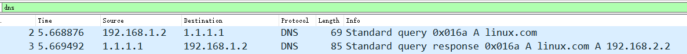
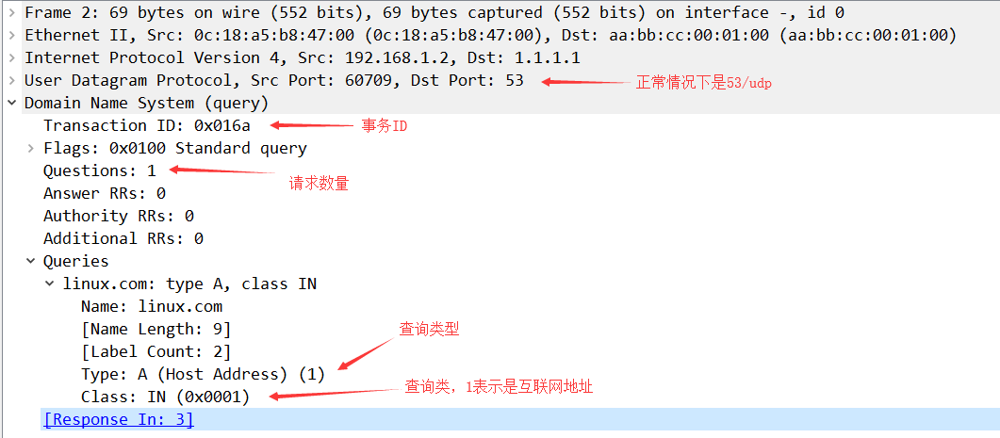
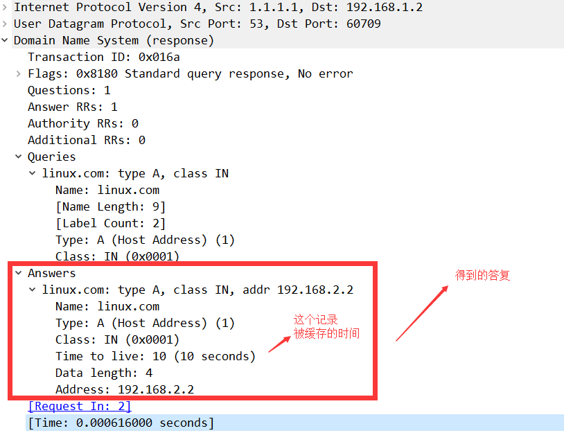

# DNS域名系统

## DNS的诞生

DNS(Domain Name System) 是一套从域名到IP的映射系统。 

在网络中要确定一台主机，可以通过IP地址来做到。但是IP地址不方便记忆， 于是人们发明了一种叫主机名的东西 。

最初时候人们把主机名和IP地址的对应关系都写在一个hosts文件里面，然后这个hosts文件由“互联网信息中心（SRI-NIC）”来管理和分发。也就是人们需要定期更新hosts文件。这个文件目前在windows系统的`C:\Windows\System32\drivers\etc\hosts`中。

时间长了，这个Hosts的机制并不好用，而且更新不及时，主机名多了之后hosts文件太大了，后来就不用这个机制了。

人们后来改用域名解析系统DNS

- 一个组织的系统管理机构，维护系统内的每个主机的`IP和主机名`的对应关系
- 如果新计算机接入网络，将这个信息注册到`数据库`中
- 用户输入域名的时候，会自动查询`DNS`服务器，由`DNS服务器`检索数据库, 得到对应的IP地址。

## 域名

主域名是用来识别主机名称和主机所属的组织机构的一种分层结构的名称。
例如：http://www.baidu.com(域名使用.连接)

- com： 一级域名，表示这是一个企业域名。同级的还有 "net"(网络提供商)，"org"(非盈利组织) 等。
- baidu: 二级域名, 公司名。
- www: 只是一种习惯用法，并不是每个域名都支持。
- http:// :  要使用什么协议来连接这个主机名。

## 域名解析的过程

1. 浏览器发起域名解析，首先查询浏览器缓存，如果没有，就查询hosts文件，如果没有就提出域名解析请求
2. 客户机提出域名解析请求，并将该请求发送给本地的域名服务器。
3. 当本地的域名服务器收到请求后,就先查询本地的缓存,如果有该纪录项,则本地的域名服务器就直接把查询的结果返回。
4. 如果本地的缓存中没有该纪录,则本地域名服务器就直接把请求发给根域名服务器,然后根域名服务器再返回给本地域名服务器一个所查询域(根的子域)的主域名服务器的地址。
5. 本地服务器再向上一步返回的域名服务器发送请求,然后接受请求的服务器查询自己的缓存,如果没有该纪录,则返回相关的下级的域名服务器的地址。
6. 重复第四步,直到找到正确的纪录。
7. 本地域名服务器把返回的结果保存到缓存,以备下一次使用,同时还将结果返回给客户机

## 查看域名解析的工具

### nslookup

windows上在`cmd`中直接输入使用

```
C:\Users\Aaron>nslookup iproute.cn
服务器:  public1.114dns.com
Address:  114.114.114.114

非权威应答:
名称:    cqfz53.coding-pages.com
Address:  124.156.193.111
Aliases:  iproute.cn
```

### dig

```bash
[root@eagleslab ~]# dig iproute.cn

; <<>> DiG 9.11.4-P2-RedHat-9.11.4-9.P2.el7 <<>> iproute.cn
;; global options: +cmd
;; Got answer:
;; ->>HEADER<<- opcode: QUERY, status: NOERROR, id: 9577
;; flags: qr rd ra; QUERY: 1, ANSWER: 2, AUTHORITY: 0, ADDITIONAL: 1

;; OPT PSEUDOSECTION:
; EDNS: version: 0, flags:; udp: 4096
;; QUESTION SECTION:
;iproute.cn.			IN	A

;; ANSWER SECTION:
iproute.cn.		600	IN	CNAME	cqfz53.coding-pages.com.#不知道iproute.cn.但是cqfz53.coding-pages.com知道
cqfz53.coding-pages.com. 600	IN	A	150.109.19.98#给出了具体的IP地址，发生变化也没关系，因为cqfz53.coding-pages.com总能提出正确IP
#可搜索pubyun来实现自定义域名与IP绑定，IP变化也没事。

;; Query time: 84 msec
;; SERVER: 100.100.2.136#53(100.100.2.136)
;; WHEN: Fri Mar 13 19:18:33 CST 2020
;; MSG SIZE  rcvd: 92
```

## cisco路由器配置DNS

```
ip dns server   # 开启DNS服务器
ip host domain.com 192.168.1.1
```

### 拓扑


- windows的DNS设置为`1.1.1.1`，当windows访问`linux.com`的时候，由centos回应

### 配置

- R1

```bash
R1(config)#int e0/0
R1(config-if)#ip add 192.168.1.1 255.255.255.0
R1(config-if)#no sh
R1(config-if)#int e0/1
R1(config-if)#ip add 192.168.2.1 255.255.255.0
R1(config-if)#no sh
R1(config-if)#int lo0
R1(config-if)#ip add 1.1.1.1 255.255.255.0
R1(config-if)#ip dns server
R1(config)#ip host linux.com 192.168.2.2
```

- windows


- Linux


### 检测DNS是否正常工作


### 抓包分析

- 找到解析的数据包



- 查看请求数据



- 查看回复的数据


