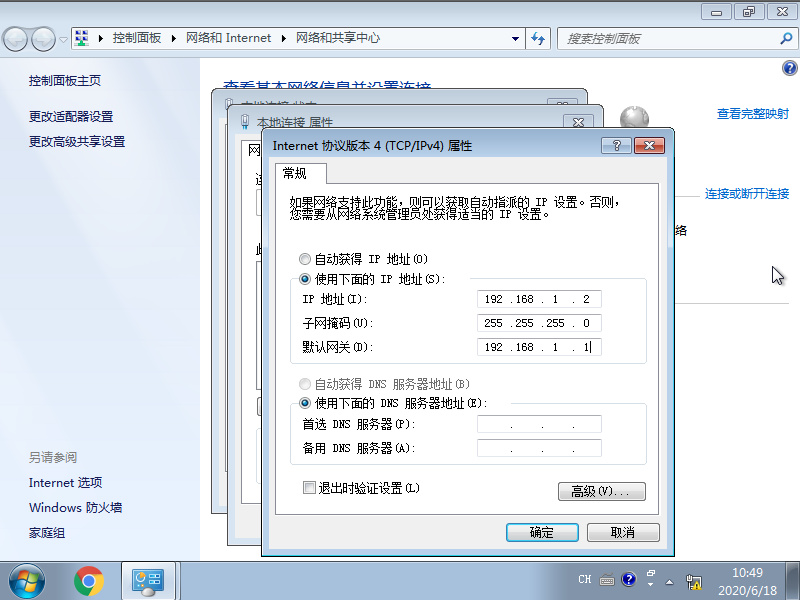
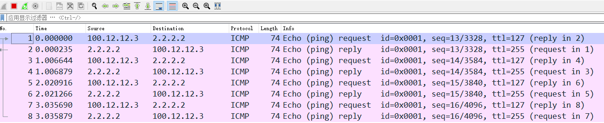
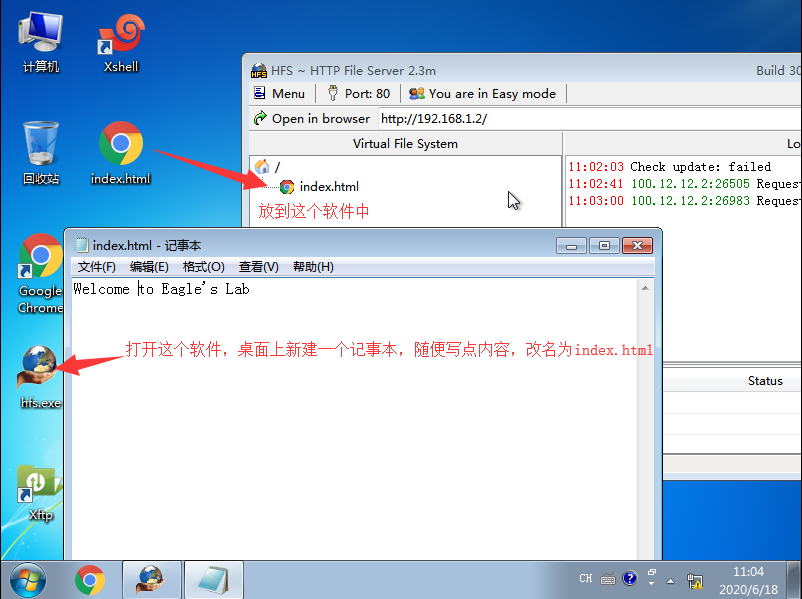
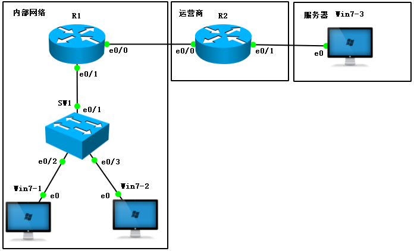
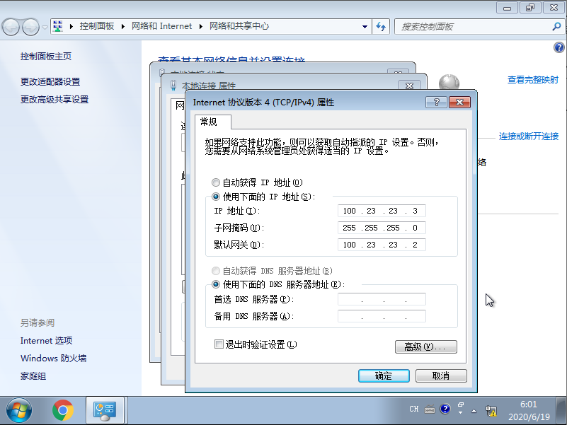
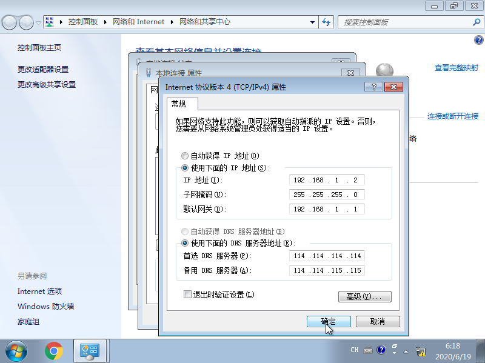
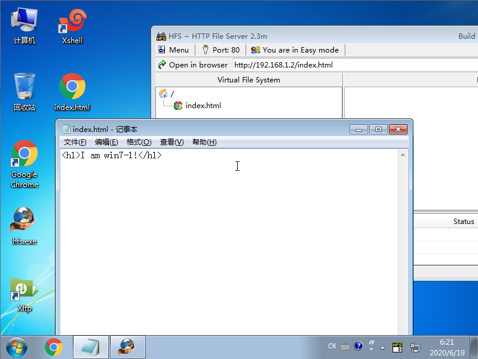
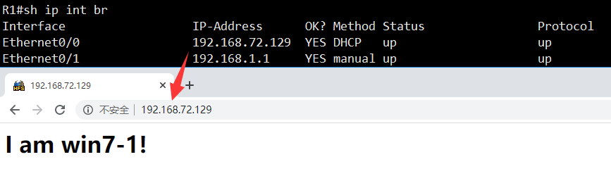
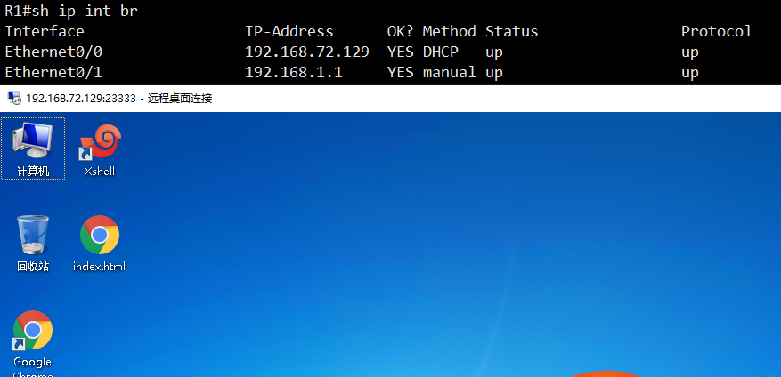

# NAT(Network Address Translation)

- 当今的互联网是由一个个小的自治系统组成，一个家庭，一个企业就是一个小的自治系统
- 自治系统内部有着众多的设备需要IP地址联网，每个地址都需要去IANA申请明显做不到，所以就会使用私有IP地址进行分配
- 私有IP地址无法做到互联网通信，在内网之中就需要一个默认网关来代替大家请求互联网数据
- NAT网络地址转换技术能够将数据包中的IP地址进行转换

## NAT优缺点

| 优点                                 | 缺点                                  |
| :----------------------------------- | :------------------------------------ |
| 节省IP地址空间                       | 增加转发延迟                          |
| 解决IP地址重叠问题                   | 丧失端到端的寻址能力                  |
| 增加网络的连入Internet的弹性         | 某些应用不支持NAT                     |
| 网络变更的时候减少IP重编址带来的麻烦 | 需要一定的内存空间支持动态存储NAT表项 |
| 对外隐藏内部地址，增加网络安全性     | 需要耗费一定CPU内存资源进行NAT操作    |

## NAT术语

| 术语     | 英文           | 解释             |
| :------- | :------------- | :--------------- |
| 内部本地 | inside local   | 转换之前源地址   |
| 外部本地 | outside local  | 转换之前目的地址 |
| 内部全局 | inside global  | 转换之后源地址   |
| 内部全局 | outside global | 转换之后目的地址 |

- `inside`表示源地址，`outside`表示目的地址
- `local`表示转换之前，`global`表示转换之后

## 静态NAT

- 一对一映射，为每个内部的地址指定一个公网IP地址
- 这种方法主要用在内网中存在需要对公网提供服务的服务器的场景，类似的例子有WEB服务器、邮件服务器、FTP服务器等

### 拓扑


### 配置

- R1

```bash
R1(config)#int e0/0
R1(config-if)#ip add 192.168.1.1 255.255.255.0
R1(config-if)#no sh
R1(config-if)#int e0/1
R1(config-if)#ip add 100.12.12.1 255.255.255.0
R1(config-if)#no sh
R1(config-if)#ip route 0.0.0.0 0.0.0.0 100.12.12.2		# 网关需要指向运营商默认路由
```

- R2

```bash
R2(config)#int lo0
R2(config-if)#ip add 2.2.2.2 255.255.255.0
R2(config-if)#int e0/0
R2(config-if)#ip add 100.12.12.2 255.255.255.0
R2(config-if)#no sh
```

- windows



### 分析

- 当前windows无法访问互联网的`2.2.2.2`网段，因为windows是以自己的IP地址`192.168.1.2`作为源，而这个地址在互联网上无法被路由
- 在R2上开启`debug ip packet`，然后在windows上尝试访问`2.2.2.2`
  - 看第7行，`unroutable`表示无法路由

```bash
R2#debug ip packet 
IP packet debugging is on
*Jun 18 10:52:22.122: IP: s=192.168.1.2 (Ethernet0/0), d=2.2.2.2, len 60, input feature, MCI Check(109), rtype 0, forus FALSE, sendself FALSE, mtu 0, fwdchk FALSE
*Jun 18 10:52:22.122: IP: tableid=0, s=192.168.1.2 (Ethernet0/0), d=2.2.2.2 (Loopback0), routed via RIB
*Jun 18 10:52:22.122: IP: s=192.168.1.2 (Ethernet0/0), d=2.2.2.2, len 60, rcvd 4
*Jun 18 10:52:22.122: IP: s=192.168.1.2 (Ethernet0/0), d=2.2.2.2, len 60, stop process pak for forus packet
*Jun 18 10:52:22.122: IP: s=2.2.2.2 (local), d=192.168.1.2, len 60, unroutable
```

- 正常情况下运营商会直接拦截和丢弃这种无效数据包，所以在真实的网络环境中，目的地根本都收不到源地址为私有IP的数据包

### 静态NAT配置

- 我们找运营商获得一个全新的公网IP地址，假设是`100.12.12.3`，然后将其对应的分配给`192.168.1.2`，那么windows在上网的时候就可以用公网IP地址对外了

```bash
R1(config-if)#int e0/1
R1(config-if)#ip nat outside 	# 必须标注接口对互联网
R1(config-if)#int e0/0
R1(config-if)#ip nat inside 	# 必须标注接口对内网
R1(config-if)#exit              
R1(config)#ip nat inside source static 192.168.1.2 100.12.12.3	# 分配公网IP地址给内网
```

- 在windows上测试是否能访问R2


- R2的e0/0口抓包，可以看到确实是由`100.12.12.3`来访问的目的地



- 在网关上查看nat的映射关系

```bash
R1#sh ip nat translations 
Pro Inside global      Inside local       Outside local      Outside global
--- 100.12.12.3        192.168.1.2        ---                ---
```

- 在windows上搭建一个网站



- 尝试使用R2来模拟用户访问`100.12.12.3`是否能打得开

```bash
R2#telnet 100.12.12.3 80
Trying 100.12.12.3, 80 ... Open
GET /index.html HTTP/1.1

HTTP/1.1 200 OK
Content-Type: text/html
Content-Length: 22
Accept-Ranges: bytes
Server: HFS 2.3m
Set-Cookie: HFS_SID_=0.823777113575488; path=/; HttpOnly
ETag: E7859486A427E189D004529E3CB873B6
Last-Modified: Thu, 18 Jun 2020 03:04:14 GMT
Content-Disposition: filename="index.html";

Welcome to Eagle's Lab[Connection to 100.12.12.3 closed by foreign host]	# 内容正确显示
```

- 静态NAT在服务器提供商的应用场景下使用较多

## PAT(端口地址转换)

- 正常情况下我们家用宽带，或者仅仅只是有上网需求的情况下，没必要为每个设备都申请一个公网IP(也做不到)
- 在数据通信的时候只是需要一个端口号用于接收和发送数据即可，而一个IP地址可以有65535个端口号，所以将端口号轮流着分配给内网设备即可

### 拓扑



### 配置

- R1

```bash
R1(config)#int e0/0
R1(config-if)#ip add 100.12.12.1 255.255.255.0
R1(config-if)#no sh
R1(config-if)#ip nat out
R1(config-if)#int e0/1
R1(config-if)#ip add 192.168.1.1 255.255.255.0
R1(config-if)#no sh
R1(config-if)#ip nat in
R1(config)#ip route 0.0.0.0 0.0.0.0 100.12.12.2
R1(config-if)#access-list 1 per 192.168.1.0 /24
R1(config)#ip nat inside source list 1 interface Ethernet0/0 overload	# 匹配acl1的流量过载nat到e0/0口
```

- R2

```bash
R2(config)#int e0/0
R2(config-if)#ip add 100.12.12.2 255.255.255.0
R2(config-if)#no sh
R2(config-if)#int e0/1
R2(config-if)#ip add 100.23.23.2 255.255.255.0
R2(config-if)#no sh
```

- win7-1


- win7-2


- win7-3



- 在win7-3上搭建一个网页来模拟服务器


### 测试

- 在win7-1和win7-2上面打开网页


- 查看nat表

```bash
R1#sh ip nat tr
Pro Inside global      Inside local       Outside local      Outside global
tcp 100.12.12.1:1024   192.168.1.2:49166  100.23.23.3:80     100.23.23.3:80
tcp 100.12.12.1:1025   192.168.1.2:49167  100.23.23.3:80     100.23.23.3:80
tcp 100.12.12.1:49166  192.168.1.3:49166  100.23.23.3:80     100.23.23.3:80
tcp 100.12.12.1:49167  192.168.1.3:49167  100.23.23.3:80     100.23.23.3:80
tcp 100.12.12.1:49168  192.168.1.3:49168  100.23.23.3:80     100.23.23.3:80
```

## 端口映射

- NAT会导致只能内网主动访问外网，而互联网没法主动访问内部网络，这样虽然保护了内部网络，但是却丢失了端到端通信的过程
- 端口映射可以将公网IP地址的端口对应到内网某个IP的端口号，从而让内网的设备也可以对外发布服务
- 端口映射可以让内网多个IP地址共用一个公网IP，可以节约很多成本

### 拓扑


- 那个cloud上面的`eth1`接口如果不知道怎么调整出来，说明你没认真听老师上课！

### 配置

- R1

```bash
R1(config)#int e0/0
R1(config-if)#ip add dhcp   
R1(config-if)#no sh
R1(config-if)#ip nat out
R1(config-if)#int e0/1
R1(config-if)#ip add 
R1(config-if)#ip add 192.168.1.1 255.255.255.0
R1(config-if)#no sh
R1(config-if)#ip nat in
R1(config-if)#acc 1 per 192.168.1.0 /24
R1(config)#ip nat in so li 1 int e0/0 over
```

- win7-1



### 验证配置

- 如果你一切顺利，那么win7-1就已经可以正常访问互联网了


### 搭建web服务

- 将win7-1当作服务器，在上面搭建服务




### 启用远程桌面


- 设置用户密码，因为windows默认不给没密码的用户远程登录


### 端口映射

- 因为网页需要被各种用户访问，所以最好端口使用大家都公认的端口，web使用的是80端口

```bash
R1(config)#ip nat inside source static tcp 192.168.1.2 80 interface e0/0 80
```

- 使用自己的电脑浏览器访问R1的e0/0接口，如果打开了网页，说明映射成功



- 由于远程桌面不需要客户访问，为了安全起见，最好不要放在大家都公认的端口，这样容易被黑客扫描和破解
- 需要注意，默认远程桌面用的端口号是3389，并且tcp和udp都会使用

```bash
R1(config)#ip nat inside source static tcp 192.168.1.2 3389 int e0/0 23333   
R1(config)#ip nat inside source static udp 192.168.1.2 3389 int e0/0 23333
```

- 在自己电脑上远程桌面R1的e0/0接口的23333端口
- 远程桌面是在自己的电脑上运行`mstsc`后即可打开远程桌面连接软件



## 负载均衡

- NAT也支持对公网IP地址的请求，分发给内部的设备来进行处理

### 拓扑


- R1配置好正常的SNAT(源IP地址转换)，保障两台windows能正常访问互联网
- win7-1的IP地址是`192.168.1.2/24`，win7-2的IP地址是`192.168.1.3/24`
- 在两台windows上都搭建好网站，网站内容有所区分

### NAT负载均衡配置

- R1

```bash
R1(config)#access-list 2 permit 192.168.72.129
R1(config)#ip nat pool webservers 192.168.1.2 192.168.1.3 netmask 255.255.255.0 type rotary
R1(config)#ip nat inside destination list 2 pool webservers
```

1. 将被访问的公网地址匹配出来，本案例中是R1的e0/0接口
2. 配置web服务器地址池，在地址池中将服务器的IP地址都加入，然后配置地址池是轮询着响应请求
3. 当访问的目的地是acl2中匹配的地址时，将目的IP转换为地址池中给的地址

### 检查结果

- 使用自己电脑的浏览器多次访问R1的e0/0接口的IP地址，会发现由两台服务器轮询着响应请求


