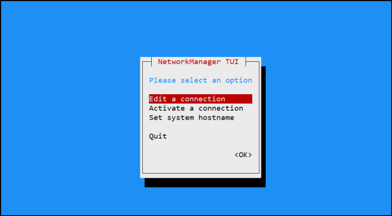
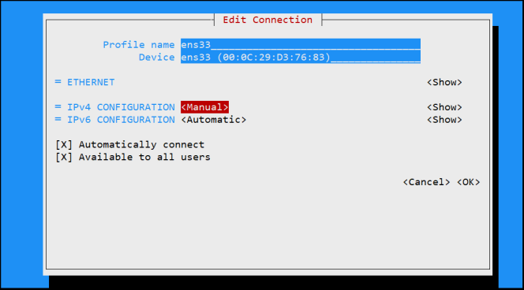
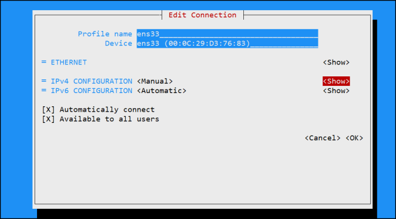
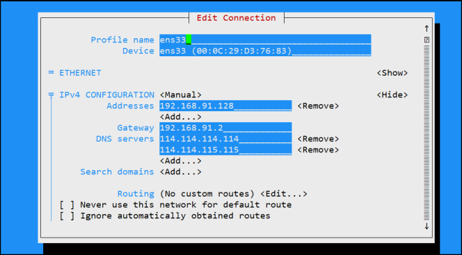

# 配置网络服务

## 配置网络参数

使用nmtui命令来配置网络

```bash
[root@localhost ~]# nmtui
```











```bash
[root@localhost ~]# cat /etc/sysconfig/network-scripts/ifcfg-ens33 
TYPE=Ethernet
PROXY_METHOD=none
BROWSER_ONLY=no
BOOTPROTO=none
DEFROUTE=yes
IPV4_FAILURE_FATAL=no
IPV6INIT=yes
IPV6_AUTOCONF=yes
IPV6_DEFROUTE=yes
IPV6_FAILURE_FATAL=no
IPV6_ADDR_GEN_MODE=stable-privacy
NAME=ens33
UUID=7cb2fd3e-61dd-4856-87fa-c6db7ec0169b
DEVICE=ens33
ONBOOT=yes
IPADDR=192.168.91.128
PREFIX=24
GATEWAY=192.168.91.2
DNS1=114.114.114.114
DNS2=114.114.115.115
```

当修改完Linux系统中的服务配置文件后，并不会对服务程序立即产生效果。要想让服务程序获取到最新的配置文件，需要手动重启相应的服务，之后就可以看到网络畅通了

```bash
[root@localhost ~]# systemctl restart network
[root@localhost ~]# ping -c 4 114.114.114.114
PING 114.114.114.114 (114.114.114.114) 56(84) bytes of data.
64 bytes from 114.114.114.114: icmp_seq=1 ttl=128 time=17.0 ms
64 bytes from 114.114.114.114: icmp_seq=2 ttl=128 time=16.0 ms
64 bytes from 114.114.114.114: icmp_seq=3 ttl=128 time=16.6 ms
64 bytes from 114.114.114.114: icmp_seq=4 ttl=128 time=16.4 ms

--- 114.114.114.114 ping statistics ---
4 packets transmitted, 4 received, 0% packet loss, time 3006ms
rtt min/avg/max/mdev = 16.020/16.556/17.094/0.395 ms
```

## 手动修改配置文件


网卡配置文件参数

| 解释         | 参数                  |
| ------------ | --------------------- |
| 设备类型     | TYPE=Ethernet         |
| 地址分配模式 | BOOTPROTO=static      |
| 网卡名称     | NAME=ens33            |
| 是否启动     | ONBOOT=yes            |
| IP地址       | IPADDR=192.168.91.128 |
| 子网掩码     | NETMASK=255.255.255.0 |
| 网关地址     | GATEWAY=192.168.91.1  |
| DNS地址      | DNS1=114.114.114.114  |

最后需要重启网络服务并测试网络是否联通

# ifconfig

- Linux ifconfig命令用于显示或设置网络设备。

- ifconfig可设置网络设备的状态，或是显示目前的设置。

## 语法

```bash
ifconfig [网络设备][down up -allmulti -arp -promisc][add<地址>][del<地址>][<hw<网络设备类型><硬件地址>][io_addr<I/O地址>][irq<IRQ地址>][media<网络媒介类型>][mem_start<内存地址>][metric<数目>][mtu<字节>][netmask<子网掩码>][tunnel<地址>][-broadcast<地址>][-pointopoint<地址>][IP地址]
```

**参数说明**：

```bash
add<地址> 设置网络设备IPv6的IP地址。
del<地址> 删除网络设备IPv6的IP地址。
down 关闭指定的网络设备。
<hw<网络设备类型><硬件地址> 设置网络设备的类型与硬件地址。
io_addr<I/O地址> 设置网络设备的I/O地址。
irq<IRQ地址> 设置网络设备的IRQ。
media<网络媒介类型> 设置网络设备的媒介类型。
mem_start<内存地址> 设置网络设备在主内存所占用的起始地址。
metric<数目> 指定在计算数据包的转送次数时，所要加上的数目。
mtu<字节> 设置网络设备的MTU。
netmask<子网掩码> 设置网络设备的子网掩码。
tunnel<地址> 建立IPv4与IPv6之间的隧道通信地址。
up 启动指定的网络设备。
  -broadcast<地址> 将要送往指定地址的数据包当成广播数据包来处理。
  -pointopoint<地址> 与指定地址的网络设备建立直接连线，此模式具有保密功能。
  -promisc 关闭或启动指定网络设备的promiscuous模式。
[IP地址] 指定网络设备的IP地址。
[网络设备] 指定网络设备的名称。
```

## 实例

- 显示网络设备信息

```bash
[root@localhost ~]# ifconfig        
eth0   Link encap:Ethernet HWaddr 00:50:56:0A:0B:0C 
     inet addr:192.168.0.3 Bcast:192.168.0.255 Mask:255.255.255.0
     inet6 addr: fe80::250:56ff:fe0a:b0c/64 Scope:Link
     UP BROADCAST RUNNING MULTICAST MTU:1500 Metric:1
     RX packets:172220 errors:0 dropped:0 overruns:0 frame:0
     TX packets:132379 errors:0 dropped:0 overruns:0 carrier:0
     collisions:0 txqueuelen:1000 
     RX bytes:87101880 (83.0 MiB) TX bytes:41576123 (39.6 MiB)
     Interrupt:185 Base address:0x2024 

lo    Link encap:Local Loopback 
     inet addr:127.0.0.1 Mask:255.0.0.0
     inet6 addr: ::1/128 Scope:Host
     UP LOOPBACK RUNNING MTU:16436 Metric:1
     RX packets:2022 errors:0 dropped:0 overruns:0 frame:0
     TX packets:2022 errors:0 dropped:0 overruns:0 carrier:0
     collisions:0 txqueuelen:0 
     RX bytes:2459063 (2.3 MiB) TX bytes:2459063 (2.3 MiB)
```

- 启动关闭指定网卡

```bash
[root@localhost ~]# ifconfig eth0 down
[root@localhost ~]# ifconfig eth0 up
```

- 为网卡配置和删除IPv6地址

```bash
[root@localhost ~]# ifconfig eth0 add 33ffe:3240:800:1005::2/ 64 //为网卡设置IPv6地址
[root@localhost ~]# ifconfig eth0 del 33ffe:3240:800:1005::2/ 64 //为网卡删除IPv6地址
```

- 用ifconfig修改MAC地址

```bash
[root@localhost ~]# ifconfig eth0 down //关闭网卡
[root@localhost ~]# ifconfig eth0 hw ether 00:AA:BB:CC:DD:EE //修改MAC地址
[root@localhost ~]# ifconfig eth0 up //启动网卡
[root@localhost ~]# ifconfig eth1 hw ether 00:1D:1C:1D:1E //关闭网卡并修改MAC地址 
[root@localhost ~]# ifconfig eth1 up //启动网卡
```

- 配置IP地址

```bash
[root@localhost ~]# ifconfig eth0 192.168.1.56 
//给eth0网卡配置IP地址
[root@localhost ~]# ifconfig eth0 192.168.1.56 netmask 255.255.255.0 
// 给eth0网卡配置IP地址,并加上子掩码
[root@localhost ~]# ifconfig eth0 192.168.1.56 netmask 255.255.255.0 broadcast 192.168.1.255
// 给eth0网卡配置IP地址,加上子掩码,加上个广播地址
```

- 启用和关闭ARP协议

```bash
[root@localhost ~]# ifconfig eth0 arp  //开启
[root@localhost ~]# ifconfig eth0 -arp  //关闭
```

- 设置最大传输单元

```bash
[root@localhost ~]# ifconfig eth0 mtu 1500 
//设置能通过的最大数据包大小为 1500 bytes
```

