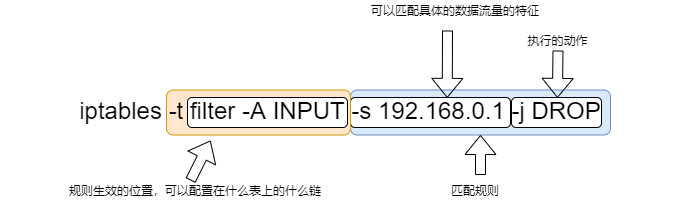

# 防火墙相关概念

主要作用：保护内部的网络、主机、服务的安全等

我们常听到的防火墙有很多不同的类型，从大的角度来看，主要是分为硬件防火墙和软件防火墙。

**硬件防火墙：**


**软件防火墙：**

软件防火墙就是通过软件来对数据包，流量请求进行过滤等，属于从软件层面保护系统的安全。如我们熟知的360，金山毒霸，火绒安全等等。

当然防火墙除了软件及硬件的分类，也可以对数据封包的取得方式来分类，可分为**代理服务器（Proxy）**及**封包过滤机制（IP Filter）**。

- 代理服务
  - 是一种网络服务，通常就架设在路由上面，可完整的掌控局域网的对外连接。

- IP Filter
  - 这种方式可以直接分析最底层的封包表头数据来进行过滤，所以包括 MAC地址, IP, TCP, UDP, ICMP 等封包的信息都可以进行过滤分析的功能，用途非常广泛。

  相较于企业内网，外部的公网环境更加恶劣，罪恶丛生。在公网与企业内网之间充当保护屏障的防火墙虽然有软件或硬件之分，但主要功能都是依据策略对穿越防火墙自身的流量进行过滤。防火墙策略可以基于流量的源目地址、端口号、协议、应用等信息来定制，然后防火墙使用预先定制的策略规则监控出入的流量，若流量与某一条策略规则相匹配，则执行相应的处理，反之则丢弃。这样一来，就可以保证仅有合法的流量在企业内网和外部公网之间流动了

# RHEL/Centos系统

对于RHEL、Centos等红帽系Linux操作系统，我们常用到的防火墙软件主要有**iptables和firewalld**

- iptables:
  - iptables 是 Linux 默认的防火墙管理工具,它是基于命令行的。
  - iptables 使用规则表(tables)和规则链(chains)的方式来控制网络数据包的流向和处理。
  - iptables 提供了强大的灵活性和细粒度的控制,可以根据数据包的各种属性进行复杂的过滤和转发操作。
  - iptables 的配置相对比较复杂,需要对防火墙的工作原理有一定的了解。
- firewalld:
  - firewalld 是 RHEL/CentOS 7 及以后版本中引入的动态防火墙管理工具。
  - firewalld 采用区域(zones)和服务(services)的概念来管理防火墙规则,相比 iptables 更加简单和易用。
  - firewalld 支持动态更新防火墙规则,无需重启服务即可生效,这对于需要经常调整防火墙的场景很有帮助。
  - firewalld 提供了图形化的管理界面,方便管理员进行配置和管理。


**不过，对于Linux而言，其实Iptables和firewalld服务不是真正的防火墙，只是用来定义防火墙规则功能的"防火墙管理工具"，将定义好的规则交由内核中的netfilter即网络过滤器来读取，从而真正实现防火墙功能。**


# iptables

iptables过滤数据包的方式：

- 允许/拒绝让 Internet 的封包进入 Linux 主机的某些 port

- 允许/拒绝让某些来源 IP 的封包进入

- 允许/拒绝让带有某些特殊标志( flag )的封包进入

- 分析硬件地址(MAC)来提供服务

## 五链

iptables命令中设置数据过滤或处理数据包的策略叫做规则，将多个规则合成一个链，叫规则链。
规则链则依据处理数据包的位置不同分类： 

- PREROUTING
  - 在进行路由判断之前所要进行的规则(DNAT/REDIRECT)
- INPUT
  - 处理入站的数据包
- OUTPUT
  - 处理出站的数据包
- FORWARD
  - 处理转发的数据包
- POSTROUTING
  - 在进行路由判断之后所要进行的规则(SNAT/MASQUERADE)


## 四表

iptables中的规则表是用于容纳规则链，规则表默认是允许状态的，那么规则链就是设置被禁止的规则，而反之如果规则表是禁止状态的，那么规则链就是设置被允许的规则。

- raw表
  - 确定是否对该数据包进行状态跟踪
- mangle表
  - 为数据包设置标记（较少使用）
- nat表
  - 修改数据包中的源、目标IP地址或端口
- filter表
  - 确定是否放行该数据包（过滤）

  

 **规则表的先后顺序:0000

规则链的先后顺序:

- 入站顺序
  - PREROUTING→INPUT
- 出站顺序
  - OUTPUT→POSTROUTING
- 转发顺序
  - PREROUTING→FORWARD→POSTROUTING


## 基本选项和用法

### 选项

| 参数         | 作用                                                        |
| ------------ | ----------------------------------------------------------- |
| -P           | 设置默认策略:iptables -P INPUT (DROP\|ACCEPT)类似于黑白名单 |
| -F           | 清空规则链                                                  |
| -L           | 查看规则链                                                  |
| -A           | 在规则链的末尾加入新规则                                    |
| -I num       | 在规则链的头部加入新规则                                    |
| -D num       | 删除某一条规则                                              |
| -s           | 匹配来源地址IP/MASK，加叹号"!"表示除这个IP外。              |
| -d           | 匹配目标地址                                                |
| -i 网卡名称  | 匹配从这块网卡流入的数据                                    |
| -o 网卡名称  | 匹配从这块网卡流出的数据                                    |
| -p           | 匹配协议,如tcp,udp,icmp                                     |
| --dports num | 匹配目标端口号                                              |
| --sports num | 匹配来源端口号                                              |


为了防止firewalld与iptables的冲突，建议在学习iptables的时候，先关闭firewalld


### 简单用法（初体验）

案例：现在有一个web服务提供网站访问，默认情况下是允许被我们的主机访问的，我们可以尝试通过设置iptables的策略，来禁止别人访问该网站

- 为了防止firewalld对iptables的影响，我们学习iptables的时候应该关闭firewalld

```bash
[root@localhost ~]# systemctl stop firewalld
```

- 网站部署：

```bash
[root@localhost ~]# yum install -y epel-release
# 安装扩展源，以便安装下面的web服务器nginx
[root@localhost ~]# yum install -y nginx
# 安装web服务器
[root@localhost ~]# systemctl start nginx
# 启动web服务器
```

- 访问测试：

打开浏览器访问你的**IP地址**，可以看到有一个网站（nginx提供的默认页面）


- 接下来通过iptables进行访问控制

```bash
[root@localhost ~]# iptables -A INPUT -p tcp --dport 80 -j DROP
# 对INPUT链上增加一个策略，丢弃掉来自80端口tcp协议的请求报文
```

- 再次访问发现，这个网站已经打不开了，提示回应超时！


- 在Linux上查看刚刚添加的过滤规则

```bash
[root@localhost ~]# iptables -vnL INPUT --line-numbers
Chain INPUT (policy ACCEPT 62 packets, 4776 bytes)
num   pkts bytes target     prot opt in     out     source               destination
1       75  3900 DROP       tcp  --  *      *       0.0.0.0/0            0.0.0.0/0            tcp dpt:80
```

## iptables规则说明

- 规则：根据指定的匹配条件来尝试匹配每个经流“关卡”的报文，一旦匹配成功，则由规则后面指定的处理动作进行处理
- 匹配条件
  - 基本匹配条件：sip、dip
  - 扩展匹配条件：sport、dport
  - 扩展条件也是条件的一部分，只不过使用的时候需要用`-m`参数声明对应的模块
- 处理动作
  - accept：接受
  - drop：丢弃
  - reject：拒绝
  - snat：源地址转换，解决内网用户同一个公网地址上上网的问题
  - masquerade：是snat的一种特殊形式，使用动态的、临时会变的ip上
  - dnat：目标地址转换
  - redirect：在本机作端口映射
  - log：记录日志，/var/log/messages文件记录日志信息，然后将数据包传递给下一条规则


## iptables高级用法




- `-t table`指定表
  - raw
  - mangle
  - nat
  - filter  默认
- `-A`：添加规则，后面更上你要添加到哪个链上
- `-j`：设置处理策略
  - accept：接受
  - drop：丢弃
  - reject：拒绝
- `-s`：指定数据包的来源地址
- `-p`：指定数据包协议类型
  - tcp
  - udp
  - icmp
  - ......

### 增加规则

**案例一：**屏蔽来自其他主机上的ping包

```bash
# 正常通过cmd去ping我们的虚拟机的IP地址
C:\Users\Atopos>ping 192.168.88.136

正在 Ping 192.168.88.136 具有 32 字节的数据:
来自 192.168.88.136 的回复: 字节=32 时间<1ms TTL=64
来自 192.168.88.136 的回复: 字节=32 时间<1ms TTL=64
来自 192.168.88.136 的回复: 字节=32 时间<1ms TTL=64
来自 192.168.88.136 的回复: 字节=32 时间<1ms TTL=64

192.168.88.136 的 Ping 统计信息:
    数据包: 已发送 = 4，已接收 = 4，丢失 = 0 (0% 丢失)，
往返行程的估计时间(以毫秒为单位):
    最短 = 0ms，最长 = 0ms，平均 = 0ms
    

# 在虚拟机上屏蔽来自我们物理机的ping包，注意物理机的IP的地址为：192.168.xxx.1
# ping命令是基于icmp协议的，所以这里对类型为icmp协议的数据包进行丢弃
[root@localhost ~]# iptables -A INPUT -s 192.168.88.1 -p icmp -j DROP

# 丢弃以后ping测试：
C:\Users\Atopos>ping 192.168.88.136

正在 Ping 192.168.88.136 具有 32 字节的数据:
请求超时。

# 注意，DROP和REJECT有一定的区别，DROP为丢弃数据包，不给予对方回应，所以对方就会一直等待。REJECT是拒绝对方，会将拒绝的数据包发给对方，对方就会知道我们拒绝的访问。
# 如果改成REJECT现象是：
C:\Users\Atopos>ping 192.168.88.136

正在 Ping 192.168.88.136 具有 32 字节的数据:
来自 192.168.88.136 的回复: 无法连到端口。
来自 192.168.88.136 的回复: 无法连到端口。
来自 192.168.88.136 的回复: 无法连到端口。
来自 192.168.88.136 的回复: 无法连到端口。

192.168.88.136 的 Ping 统计信息:
    数据包: 已发送 = 4，已接收 = 4，丢失 = 0 (0% 丢失)，


`其他用法`
[root@localhost ~]# iptables -A INPUT -s 192.168.88.100 -j ACCEPT
# 目标来自 192.168.88.100 这个 IP 的封包都予以接受
[root@localhost ~]# iptables -A INPUT -s 192.168.88.0/24 -j ACCEPT
[root@localhost ~]# iptables -A INPUT -s 192.168.88.10 -j DROP
# 192.168.88.0/24 可接受，但 192.168.88.10 丢弃
```

**案例二：**屏蔽Linux系统中的远程链接服务（sshd），使得我们无法通过MobaXterm连接到虚拟机上

```bash
[root@localhost ~]# iptables -A INPUT -p tcp --dport 22 -j REJECT
# ssh服务所用的协议类型为tcp协议，端口号为22
# 所以我们将来自22端口上的tcp协议数据包给拒绝
```

当敲完这个命令以后，你的远程连接就会中断了，可以在VMware中的虚拟机终端上删除这个规则，就恢复了

删除命令：`iptables -D INPUT -p tcp --dport 22 -j REJECT`


### 查看规则

```bash
[root@localhost ~]# iptables [-t tables] [-L] [-nv]
参数：
-t	后面接table,例如nat或filter，如果省略，默认显示filter
-L	列出目前的table的规则
-n	不进行IP与主机名的反查，显示信息的速度会快很多
-v	列出更多的信息，包括封包数，相关网络接口等
--line-numbers 显示规则的序号
```

- 查看具体每个表的规则

  - policy：当前链的默认策略，当所有规则都没有匹配成功时执行的策略
  - packets：当前链默认策略匹配到的包的数量
  - bytes：当前链默认策略匹配到的包的大小
  - pkts：对应规则匹配到的包数量
  - bytes：对应规则匹配到的包大小
  - target：对应规则执行的动作
  - prot：对应的协议，是否针对某些协议应用此规则
  - opt：规则对应的选项
  - in：数据包由哪个接口流入
  - out：数据包由哪个接口流出
  - source：源ip地址
  - distination：目的ip地址

```bash
[root@localhost ~]# iptables -vnL INPUT -t filter --line-numbers
[root@localhost ~]# iptables -nL -t nat
[root@localhost ~]# iptables -nL -t mangle
[root@localhost ~]# iptables -nL -t raw
```


### 删除规则

通过上面学习的查看规则的方法，先查找到你想要删除的规则

```bash
# 举例
# 查看nat表上所有链的规则
[root@localhost ~]# iptables -t nat -nL --line-numbers
# 查看filter（默认表）上所有链的规则
[root@localhost ~]# iptables -nL --line-numbers
```

- 通过num序号进行删除

```bash
删除input链上num为1的规则
[root@localhost ~]# iptables -D INPUT 1
```

- 通过规则匹配删除

```bash
[root@localhost ~]# iptables -D INPUT -p tcp --dport 80 -j DROP
```

- 清空所有的规则

```bash
[root@localhost ~]# iptables -F
```


### 修改规则

方案一：通过`iptables -D`删除原有的规则后添加新的规则

方案二：通过`iptables -R`可以对具体某一个num的规则进行修改

```bash
# 修改端口的为8080
[root@localhost ~]# iptables -R INPUT 1 -p tcp --dport 8080 -j ACCEPT

# 针对具体的某一个表和链进行修改
# 将8080修改回80
[root@localhost ~]# iptables -t filter -R INPUT 1 -p tcp --dport 80 -j ACCEPT
```


## 自定义链

iptables中除了系统自带的五个链之外，还可以自定义链，来实现将规则进行分组，重复调用的目的

具体方法见如下案例：

案例一：我们自定义一个WEB_CHAIN链，专门管理跟web网站相关的规则策略

```bash
# 1. 先查看我们现有的系统链
[root@localhost ~]# iptables -L
Chain INPUT (policy ACCEPT)
target     prot opt source               destination
Chain FORWARD (policy ACCEPT)
target     prot opt source               destination
Chain OUTPUT (policy ACCEPT)
target     prot opt source               destination

# 2. 添加WEB_CHAIN自定义链，并且查看
[root@localhost ~]# iptables -t filter -N web_chain
[root@localhost ~]# iptables -L
..........
Chain web_chain (0 references)
target     prot opt source               destination

# 3. 可以通过-E参数修改自定义链
[root@localhost ~]# iptables -t filter -E web_chain WEB_CHAIN
[root@localhost ~]# iptables -L
.........
Chain WEB_CHAIN (0 references)
target     prot opt source               destination
# 可以看到名字已经发生变化了

# 4. 向我们创建的自定义链中添加规则，开放80端口上的服务
[root@localhost ~]# iptables -t filter -A WEB_CHAIN -p tcp -m multiport --dports 80,443 -j ACCEPT

# 5. 将自定义链关联到系统链上才能使用
# 因为数据包只会经过上面讲过的五个系统链，不会经过我们的自定义链，所以需要把自定义链关联到某个系统链上

# 我们允许来自IP：192.168.88.1的访问，随后拒绝其他所有的访问，这样，只有192.168.88.1的主机可以访问这个网站
[root@localhost ~]# iptables -t filter -A INPUT -s 192.168.88.1 -j WEB_CHAIN
[root@localhost ~]# iptables -t filter -A INPUT -p tcp -m multiport --dports 80,443 -j DROP
[root@localhost ~]# iptables -L
Chain INPUT (policy ACCEPT)
target     prot opt source               destination
WEB_CHAIN  all  --  192.168.88.1         anywhere
Chain FORWARD (policy ACCEPT)
target     prot opt source               destination
Chain OUTPUT (policy ACCEPT)
target     prot opt source               destination
Chain WEB_CHAIN (1 references)
target     prot opt source               destination
ACCEPT     tcp  --  anywhere             anywhere             tcp dpt:http

```

访问测试：

- windows本身可以访问我们的网站
- 但是其他主机无法访问


```bash
- 删除自定义链

# 先清空自定义链上的规则
[root@localhost ~]# iptables -t filter -F WEB_CHAIN
# 然后通过-X选项删除自定义链
[root@localhost ~]# iptables -t filter -X WEB_CHAIN
```


## 其他用法（模块）

- tcp/udp
  - --dport：指定目的端口
  - --sport：指定源端口

- iprange：匹配报文的源/目的地址所在范围
  - --src-range
  - --dst-range

```bash
[root@localhost ~]# iptables -A INPUT -d 172.16.1.100 -p tcp --dport 80 -m iprange --src-range 172.16.1.5-172.16.1.10 -j DROP
```

- string：指定匹配报文中的字符串
  - --algo：指定匹配算法，可以是bm/kmp
    - bm：Boyer-Moore
    
    - kmp：Knuth-Pratt-Morris
  - --string：指定需要匹配的字符串
  - --from offset：开始偏移
  - --to offset：结束偏移

```bash
[root@localhost ~]# iptables -A OUTPUT -p tcp --sport 80 -m string --algo bm --from 62  --string "google" -j REJECT
```

**案例：**

```shell
[root@localhost ~]# yum -y install httpd
[root@localhost ~]# systemctl start httpd
[root@localhost ~]# systemctl enable httpd
[root@localhost ~]# echo "<h1>hello world</h1>" > /var/www/html/index.html
[root@localhost ~]# iptables -A OUTPUT -p tcp --sport 80 -m string --algo bm --string "world" -j REJECT
#用浏览器刷新页面发现打不开
[root@localhost ~]# iptables -nL
Chain INPUT (policy ACCEPT)
target     prot opt source               destination
Chain FORWARD (policy ACCEPT)
target     prot opt source               destination
Chain OUTPUT (policy ACCEPT)
target     prot opt source               destination
REJECT     tcp  --  0.0.0.0/0            0.0.0.0/0            tcp spt:80 STRING match  "world" ALGO name bm TO 65535 reject-with icmp-port-unreachable

[root@localhost ~]# echo "<h1>hello XHZ</h1>" > /var/www/html/index.html
# 此时浏览器打开成功
```


- time：指定匹配报文的时间
  - --timestart
  - --timestop
  - --weekdays
  - --monthdays
  - --datestart
  - --datestop

```bash
[root@localhost ~]# iptables -A INPUT -s 172.16.0.0/16 -d 172.16.100.10 -p tcp --dport 80 -m time --timestart 14:30 --timestop 18:30 --weekdays Sat,Sun  -j DROP

-m time --timestart 14:30 --timestop 18:30 --weekdays Sat,Sun：在指定的时间范围内生效，即从周六到周日的14:30到18:30之间。这表示该规则只在这个时间段内生效

- 该规则的作用是在指定时间范围内，阻止来自172.16.0.0/16网段源IP地址、目标IP地址为172.16.100.10、目标端口为80的TCP数据包进入系统
```


- connlimit：限制每个ip连接到server端的数量，不需要指定ip默认就是针对每个ip地址,可防止Dos(Denial of Service，拒绝服务)攻击
  - --connlimit-above：最大连接数

```bash
[root@localhost ~]# iptables -A INPUT -d 172.16.100.10 -p tcp --dport 22 -m connlimit --connlimit-above 2 -j REJECT

-m connlimit --connlimit-above 2：使用连接限制模块，限制连接数超过2的数据包。这表示如果同一源IP地址的连接数超过2个，将匹配到该规则

- 该规则的作用是限制目标IP地址为172.16.100.10、目标端口为22的数据包，如果同一源IP地址的连接数超过2个，则拒绝回复该数据包。这个规则可以用于防止对SSH服务的暴力破解攻击，限制来自同一IP地址的并发连接数
```

**案例：**

```shell
[root@localhost ~]# iptables -A INPUT -s 192.168.88.0/24 -p tcp --dport 22 -m connlimit --connlimit-above 2 -j REJECT

#此时登第三个终端，会登不上
[root@localhost ~]# iptables -nL --line-numbers
Chain INPUT (policy ACCEPT)
num  target     prot opt source               destination
1    DROP       tcp  --  172.16.0.0/16        172.16.100.10        tcp dpt:80 TIME from 14:30:00 to 18:30:00 on Sat,Sun UTC
2    REJECT     tcp  --  192.168.88.0/24      0.0.0.0/0            tcp dpt:22 #conn src/32 > 2 reject-with icmp-port-unreachable

[root@Centos7-VM-1 ~]# iptables -D INPUT 2
```


- limit：对报文到达的速率继续限制，限制包数量
  - 10/second
  - 10/minute
  - 10/hour
  - 10/day
  - --limit-burst：空闲时可放行的包数量，默认为5，前多少个包不限制


```bash
iptables -A INPUT -p icmp -m limit --limit-burst 10 --limit 20/minute -j ACCEPT
iptables -A INPUT -p icmp  -j REJECT

--limit-burst 10：设置允许的初始突发量为10个数据包。
--limit 20/minute：设置平均速率为20个数据包/分钟，即每分钟允许通过的ICMP数据包数量为20个。

- 该规则的作用是限制ICMP数据包的速率，允许初始突发量为10个数据包，以后每分钟最多允许通过20个ICMP数据包。匹配到的ICMP数据包将被接受，其他超出限制的数据包将被丢弃。这个规则可以用于控制对系统的ICMP流量，以避免过多的ICMP请求对系统造成负载过大的影响
```


- 指定TCP匹配扩展

```bash
使用 --tcp-flags 选项可以根据tcp包的标志位进行过滤。
[root@localhost ~]# iptables -A INPUT -p tcp --tcp-flags SYN,FIN,ACK SYN
[root@localhost ~]# iptables -A FROWARD -p tcp --tcp-flags ALL SYN,ACK
上实例中第一个表示SYN、ACK、FIN的标志都检查，但是只有SYN匹配。第二个表示ALL（SYN，ACK，FIN，RST，URG，PSH）的标志都检查，但是只有设置了SYN和ACK的匹配。
[root@localhost ~]# iptables -A FORWARD -p tcp --syn
选项--syn相当于"--tcp-flags SYN,RST,ACK SYN"的简写。
```


- state模块：用于针对tcp连接进行限制，较耗资源

```bash
[root@localhost ~]# iptables -A INPUT -m 模块名 --state 状态
参数：
-m	iptables的模块
		state: 状态检查
		mac:网卡硬件地址
--state	 连接追踪中的状态：
        NEW: 新建立一个会话
        ESTABLISHED：已建立的连接
        RELATED: 有关联关系的连接
        INVALID: 无法识别的连接
[root@localhost ~]# iptables -A INPUT -p tcp --dport 22 -m state --state NEW -j ACCEPT    
-m state --state NEW：使用状态模块，匹配数据包的连接状态为NEW，即新建的连接。
- 该规则的作用是允许进入系统的TCP数据包，目标端口为22（SSH服务），且连接状态为NEW（新建的连接）。这个规则用于允许建立新的SSH连接，而拒绝已经建立的或结束的连接

[root@localhost ~]# iptables -A INPUT -m mac --mac-source 00:0C:29:56:A6:A2 -j ACCEPT
-m mac --mac-source 00:0C:29:56:A6:A2：使用MAC模块，匹配源MAC地址为00:0C:29:56:A6:A2的数据包
- 该规则的作用是允许源MAC地址为00:0C:29:56:A6:A2的数据包进入系统。这个规则可以用于根据MAC地址限制网络访问，只允许特定的MAC地址通过防火墙进入系统
```

## 规则的保存与恢复

- 用规则文件保存各规则，开机后导入该规则文件中的规则

```bash
# 保存到文件中
[root@localhost ~]# iptables-save > /etc/sysconfig/iptables-config
# 从文件中导入规则
[root@localhost ~]# iptables-restore < /etc/sysconfig/iptables-config
```


- 安装`iptables-services`，在centos7和centos8上，通过该服务来帮助我们自动管理iptables规则。

```bash
[root@localhost ~]# yum -y install iptables-services
[root@localhost ~]# systemctl start iptables.service
[root@localhost ~]# systemctl enable iptables.service
```


## NAT（地址转换协议）

​	网络地址转换 NAT（Network Address Translation），被广泛应用于各种类型 Internet 接入方式和各种类型的网络中。原因很简单，NAT 不仅完美地解决了 IP 地址不足的问题，而且还能够有效地避免来自网络外部的攻击，隐藏并保护网络内部的计算机。默认情况下，内部 IP 地址是无法被路由到外网的，内部主机 10.1.1.1 要与外部 Internet通信，IP 包到达 NAT 路由器时，IP 包头的源地址 10.1.1.1 被替换成一个合法的外网 IP，并在 NAT 转发表中保存这条记录。当外部主机发送一个应答到内网时，NAT 路由器收到后，查看当前 NAT 转换表，用 10.1.1.1 替换掉这个外网地址。NAT 将网络划分为内部网络和外部网络两部分，局域网主机利用 NAT 访问网络时，是将局域网内部的本地地址转换为全局地址（互联网合法的 IP 地址）后转发数据包；


### 案例一：内网数据代理及服务映射

背景：现在有两个服务器server1和server2，server1是可以上网的，server2是不可以上网的，我们需要在server1上配置NAT来让server2通过server1去访问外网，同样我们也可以通过server1来访问位于server2服务器上的内部网站


**环境准备：**

两台虚拟机，可以克隆一个出来，然后server1添加一张仅主机的网卡。为了模拟server2不能上网的情况，将server2上原有的网卡改成仅主机模式。

由于server2的网卡修改成仅主机以后无法通过yum部署httpd，所以我们先在server2上部署一个Web网站

```bash
[root@localhost ~]# yum install -y httpd
[root@localhost ~]# systemctl enable --now httpd
# 确保关闭了firewalld，防止firewalld造成干扰
[root@localhost ~]# systemctl disable --now firewalld

# 检查80端口是否启动
[root@localhost ~]# ss -nlt
State         Recv-Q        Send-Q               Local Address:Port                Peer Address:Port        Process
LISTEN        0             128                        0.0.0.0:22                       0.0.0.0:*
LISTEN        0             128                           [::]:22                          [::]:*
LISTEN        0             511                              *:80                             *:*
```


**server1：**


**server2：**


第一步：配置仅主机模式网卡的IP地址，其中：

**server1：**

​	IP：192.168.12.1/24 

**server2：**

​	IP：192.168.12.2/24

​	网关：192.168.12.1  # 网关指向server1的地址

​	dns：114.114.114.114

第二步：在server1的Linux内核中开启数据转发功能

```bash
- 开启数据转发
[root@localhost ~]# echo "net.ipv4.ip_forward=1" >> /usr/lib/sysctl.d/50-default.conf
[root@localhost ~]# sysctl -w net.ipv4.ip_forward=1
[root@localhost ~]# sysctl -p

或者：
[root@localhost ~]# echo 1 > /proc/sys/net/ipv4/ip_forward

禁止数据转发：
[root@localhost ~]# echo 0 > /proc/sys/net/ipv4/ip_forward
```

第三步：访问测试

- server2访问外网测试

  `ping www.baidu.com`

- Windows访问server2上的网站测试

### 配置SNAT让server2能够网上冲浪

server1上操作：

```bash
[root@localhost ~]# iptables -t nat -A POSTROUTING -s 192.168.12.0/24 -j SNAT --to-source 192.168.88.136

- POSTROUTING：数据包出口链
- SNAT：将源地址进行转发

也可以使用如下写法（PAT）：
[root@localhost ~]# iptables -t nat -A POSTROUTING -s 192.168.12.0/24 -j MASQUERADE
```

server2上测试网络连通性：

`ping www.baidu.com`

并且通过对Vmnet 8网卡抓包查看，虽然我们是用server去ping百度。但是却能抓到server1的ens160网卡发往百度的ping包


### 配置DNAT使得可以访问server2中的内部网站

```bash
[root@localhost ~]# iptables -t nat -A PREROUTING -p tcp --dport 8080 -j DNAT --to-destination 192.168.12.2:80

# 在PREROUTING链上将来自8080端口上的访问转发到内网中的192.168.88.12.2上的80端口

`访问测试：`
浏览器中输入：192.168.88.136:8080

- 扩展案例：
- 配置DNAT来映射server2上的ssh服务
[root@localhost ~]# iptables -t nat -A PREROUTING -p tcp --dport 3322 -j DNAT --to-destination 192.168.12.2:22

`连接测试：`
ssh root@192.168.88.136 -p 3322
```


## 案例二：转发本地端口

```bash
[root@localhost ~]# iptables -t nat -A PREROUTING -p tcp --dport 6666 -j REDIRECT --to-port 22
# 此时连接6666端口，iptables会帮我们转发到22端口
```


# firewalld

firewalld是CentOS 7.0新推出的管理netfilter的用户空间软件工具

并且支持划分区域zone,每个zone可以设置独立的防火墙规则

- 流量的规则匹配顺序
  - 先根据数据包中源地址，将其纳为某个zone
  - 纳为网络接口所属zone
  - 纳入默认zone，默认为public zone,管理员可以改为其它zone

- firewalld中常用的区域名称及策略规则

| 区域     | 默认策略规则                                                 |
| -------- | ------------------------------------------------------------ |
| public   | 默认区域,对应普通网络环境。允许选定的连接,拒绝其他连接       |
| drop     | 所有传入的网络包都会被直接丢弃,不会发送任何响应              |
| block    | 所有传入的网络包会被拒绝,并发送拒绝信息                      |
| external | 用于路由/NAT流量的外部网络环境。与public类似,更适用于网关、路由器等处理外部网络流量的设备 |
| dmz      | 隔离区域,只允许选定的连接，适用于部署公开服务的网络区域,如 Web 服务器，可以最大限度地降低内部网络的风险 |
| work     | 适用于工作环境，开放更多服务,如远程桌面、文件共享等。比 public 区域更加信任 |
| home     | 适用于家庭环境，开放更多服务，比如默认情况下会开放一些如:3074端口(Xbox)、媒体、游戏数据等待 |
| trusted  | 信任区域,允许所有连接                                        |

## 管理工具-firewall-cmd

- firewall-cmd命令常用的选项

| 参数                          | 作用                                                 |
| ----------------------------- | ---------------------------------------------------- |
| --get-default-zone            | 查询默认的区域名称                                   |
| --set-default-zone=<区域名称> | 设置默认的区域，使其永久生效                         |
| --get-zones                   | 显示可用的区域                                       |
| --get-services                | 显示预先定义的服务                                   |
| --get-active-zones            | 显示当前正在使用的区域与网卡名称                     |
| --add-source=                 | 将源自此IP或子网的流量导向指定的区域                 |
| --remove-source=              | 不再将源自此IP或子网的流量导向某个指定区域           |
| --add-interface=<网卡名称>    | 将源自该网卡的所有流量都导向某个指定区域             |
| --change-interface=<网卡名称> | 将某个网卡与区域进行关联                             |
| --list-all                    | 显示当前区域的网卡配置参数、资源、端口以及服务等信息 |
| --list-all-zones              | 显示所有区域的网卡配置参数、资源、端口以及服务等信息 |
| --add-service=<服务名>        | 设置默认区域允许该服务的流量                         |
| --add-port=<端口号/协议>      | 设置默认区域允许该端口的流量                         |
| --remove-service=<服务名>     | 设置默认区域不再允许该服务的流量                     |
| --remove-port=<端口号/协议>   | 设置默认区域不再允许该端口的流量                     |
| --reload                      | 让“永久生效”的配置规则立即生效，并覆盖当前的配置规则 |
| --panic-on                    | 开启应急状况模式                                     |
| --panic-off                   | 关闭应急状况模式                                     |
| --permanent                   | 设定的当前规则保存到本地，下次重启生效               |


## 简单用法（初体验）

为了防止之前配置过的iptables规则导致与firewalld策略冲突，建议恢复快照后再开始练习

通过web服务部署一个网站,然后访问测试

```bash
[root@localhost ~]# yum -y install httpd
[root@localhost ~]# systemctl start httpd
```

在浏览器中输入`192.168.88.136`访问测试发现，我们无法访问此网站，这是因为默认情况下，firewalld是出于开启的状态，并且默认区域为public。在public区域中，除了部分系统服务，其他服务的流量一律是禁止的。

```bash
# 查看firewalld是否启用，可以看到当前是出于actice的状态
[root@localhost ~]# systemctl status firewalld
● firewalld.service - firewalld - dynamic firewall daemon
   Loaded: loaded (/usr/lib/systemd/system/firewalld.service; enabled; vendor preset: enabled)
   Active: active (running) since 四 2024-05-23 15:39:56 CST; 28min ago
     Docs: man:firewalld(1)
 Main PID: 6264 (firewalld)
   CGroup: /system.slice/firewalld.service
           └─6264 /usr/bin/python -Es /usr/sbin/firewalld --nofork --nopid
           
# 查看当前所在的区域
[root@localhost ~]# firewall-cmd --get-default-zone
public
# 查看当前网卡所在的区域
[root@localhost ~]# firewall-cmd --get-zone-of-interface=ens160
public

# 查询public区域是否允许请求SSH或者HTTP协议的流量
[root@localhost ~]# firewall-cmd --zone=public --query-service=ssh
yes
[root@localhost ~]# firewall-cmd --zone=public --query-service=http
no

`可以看出，在public区域中，默认是禁止来自http协议的请求数据包的`

```

修改firewalld策略,使得我们可以访问到刚刚部署的网站

```bash
- 方法一：针对服务协议类型进行放行
# 临时放行
[root@localhost ~]# firewall-cmd --zone=public --add-service=http
# 可以加上--permanent实现永久放行
[root@localhost ~]# firewall-cmd --permanent --zone=public --add-service=http

- 方法二：针对服务具体访问请求的端口号进行放行
[root@localhost ~]# firewall-cmd --zone=public --add-port=80/tcp
success
# 同样也可以加上--permanent实现永久放行
```

以上方法二选一，然后访问测试


取消放行

```bash
[root@localhost ~]# firewall-cmd --zone=public --remove-service=http --permanent
success
```


## 其他用法

- 把firewalld服务的当前默认区域设置为public

```bash
[root@localhost ~]# firewall-cmd --set-default-zone=public
Warning: ZONE_ALREADY_SET: public
success
[root@localhost ~]# firewall-cmd --get-default-zone
public
```

- 查看某个区域的详细配置

```bash
[root@localhost ~]# firewall-cmd --zone=public --list-all
public (active)
  target: default
  icmp-block-inversion: no
  interfaces: ens33
  sources:
  services: ssh dhcpv6-client
  ports: 80/tcp
  protocols:
  masquerade: no
  forward-ports:
  source-ports:
  icmp-blocks:
  rich rules:
```

- 将firewalld 切换到紧急模式(panic mode)。这种模式下,firewalld 会采取一种非常严格的防护策略:
  1. 所有传入的网络连接都会被拒绝,除了 ssh 和 ICMP 回送(ping)请求。
  2. 所有区域的防火墙规则都会被重置为默认的严格策略。
  3. 所有区域的默认策略都会被设置为 DROP

```bash
[root@localhost ~]# firewall-cmd --panic-on
# 取消紧急模式
[root@localhost ~]# firewall-cmd --panic-off
```

- 临时生效/永久生效

```bash
# 临时生效
[root@localhost ~]# firewall-cmd --zone=public --add-service=http
success
# 永久生效，加了--permanent所进行的更改，会被写入到配置文件中，下次开机任然生效
[root@localhost ~]# firewall-cmd --permanent --zone=public --add-service=http
success
# 使得最近对防火墙规则变更或者所作的修改生效
[root@localhost ~]# firewall-cmd --reload
success
[root@localhost ~]# firewall-cmd --zone=public --query-service=http
yes

-配置文件路径
/etc/firewalld/zones/public.xml
/etc/firewalld/direct.xml
/etc/firewalld/firewalld.conf
```

- 把firewalld服务中请求HTTPS协议的流量设置为永久拒绝，并立即生效

```bash
[root@localhost ~]# firewall-cmd --zone=public --remove-service=https --permanent
success
[root@localhost ~]# firewall-cmd --reload
success
```

- 把在firewalld服务中访问8080和8081端口的流量策略设置为允许，当前生效

```bash
# 可以指定要开放端口的范围
[root@localhost ~]# firewall-cmd --zone=public --add-port=8080-8081/tcp
success
[root@localhost ~]# firewall-cmd --zone=public --list-ports
8080-8081/tcp
```

## 端口转发

通过firewalld，将用户访问服务器上6666端口的流量转发到22端口上，实现本地端口映射。我们就可以使用6666端口来远程连接到服务器

```bash
[root@localhost ~]# firewall-cmd --permanent --add-forward-port=port=6666:proto=tcp:toport=22
success
[root@localhost ~]# firewall-cmd --reload
```

连接测试：

```bash
C:\Users\Atopos>ssh root@192.168.88.136 -p 6666
root@192.168.88.136's password:
Last login: Thu May 23 21:20:38 2024 from 192.168.88.1
[root@localhost ~]#
可以看到我们通过6666端口成功连接到我们的虚拟机
```


## firewalld富规则

富规则是 firewalld 提供的一种灵活且强大的防火墙规则配置方式。与简单的端口和服务规则不同,富规则支持更复杂的匹配条件和操作。

使用富规则,可以实现复杂的防火墙策略,例如:

- 允许特定 IP 地址访问某个端口
- 拒绝特定 IP 地址访问某个服务
- 限制某个网段的连接频率
- 转发某个端口到另一个端口

**富规则的配置方法：**

`firewall-cmd --permanent --add-rich-rule='<rich_rule_definition>'`

需要注意的是,富规则的语法比较复杂,使用时务必仔细检查,以免引入安全隐患。同时,在修改完成后记得执行 `firewall-cmd --reload` 命令,让更改生效

其中rule部分的语法如下：

```bash
rule [family="<family>"] [source address="<address>"][source port="<port>"] [destination address="<address>"][destination port="<port>"] [protocol value="<protocol>"] [icmp-block-inversion][forward-port port="<port>" protocol="<protocol>" to-port="<port>"][masquerade][log [prefix="<prefix>"] [level="<level>"] [limit value="<value>"] [accept][reject][drop]
```

其中各个选项的含义如下:

- `family`: 指定地址族,可以是 `ipv4` 或 `ipv6`
- `source`/`destination`: 指定源/目标地址
- `port`: 指定端口号
- `protocol`: 指定协议,如 `tcp`、`udp` 等
- `icmp-block-inversion`: 反转 ICMP 阻止规则
- `forward-port`: 端口转发规则
- `masquerade`: 启用地址伪装
- `log`: 日志记录规则,可指定前缀、日志级别、限速
- `accept`/`reject`/`drop`: 动作,分别表示允许、拒绝、丢弃


由于firewalld中的富规则比较复杂，我们从以下几个案例中来简单学习富规则的一些用法即可

**案例一：**允许某个IP地址访问系统中的Web网站服务

```bash
[root@localhost ~]# firewall-cmd --permanent --add-rich-rule='rule family="ipv4" source address="192.168.88.1" port port="80" protocol="tcp" accept'
[root@localhost ~]# firewall-cmd --reload
```

这条规则允许来自 192.168.88.1 的 IPv4 流量访问 80 端口的  Web 服务

**案例二：**限制某个区域内的 SSH 连接次数

```bash
[root@localhost ~]# firewall-cmd --permanent --add-rich-rule='rule family="ipv4" source address="192.168.88.0/24" port port="22" protocol="tcp" limit value="3/m" accept'
[root@localhost ~]# firewall-cmd --reload
```

这条规则允许 192.168.88.0/24 网段内的 IPv4 流量访问 22 端口的  SSH 服务,但是限制每分钟最多 3 次连接

**案例三：**使用富规则配置将6666端口上的访问转发到22端口上

```bash
[root@localhost ~]# firewall-cmd --permanent --add-rich-rule='rule family="ipv4" forward-port port="6666" protocol="tcp" to-port="22"'
[root@localhost ~]# firewall-cmd --reload
```

这条规则将 6666 端口的 TCP 流量转发到 22 端口


**注意：**富规则的语法比较复杂,但是可以让您更精细地控制防火墙规则。通过组合不同的条件,您可以实现更复杂的防火墙策略。使用富规则时,请务必仔细检查语法和规则是否符合您的需求,以免引入安全隐患


# 服务访问控制 TCP Wrappers

TCP Wrappers是一种用于网络服务访问控制的工具，它使用配置文件中的规则来决定是否允许或拒绝对特定网络服务的访问。控制列表由两个主要文件组成：/etc/hosts.allow和/etc/hosts.deny。这些文件包含服务和客户端的规则，用于控制服务的访问权限

**TCP Wrapperes在最新的RockyLinux 9系统中默认已经不适用。通过上述讲到的iptables和firewalld来进行服务访问控制即可。**

TCP Wrappers服务的控制列表文件中常用的参数

| 客户端类型     | 示例                       | 满足示例的客户端列表              |
| -------------- | -------------------------- | --------------------------------- |
| 单一主机       | 192.168.10.10              | IP地址为192.168.10.10的主机       |
| 指定网段       | 192.168.10.                | IP段为192.168.10.0/24的主机       |
| 指定网段       | 192.168.10.0/255.255.255.0 | IP段为192.168.10.0/24的主机       |
| 指定主机名称   | www.eagleslab.com          | 主机名称为www.eagleslab.com的主机 |
| 指定所有客户端 | ALL，*                     | 所有主机全部包括在内              |

在配置TCP Wrappers服务时需要遵循两个原则：

- 编写拒绝策略规则时，填写的是服务名称，而非协议名称；
- 建议先编写拒绝策略规则，再编写允许策略规则，以便直观地看到相应的效果。

**/etc/hosts.deny：**该文件包含拒绝访问网络服务的规则。如果没有在hosts.allow文件中找到允许访问的规则，TCP Wrappers将检查hosts.deny文件以确定是否拒绝访问。以下规则拒绝所有客户端访问SSH服务：

```bash
[root@localhost ~]# vim /etc/hosts.deny 
#
# hosts.deny	This file contains access rules which are used to
#		deny connections to network services that either use
#		the tcp_wrappers library or that have been
#		started through a tcp_wrappers-enabled xinetd.
#
#		The rules in this file can also be set up in
#		/etc/hosts.allow with a 'deny' option instead.
#
#		See 'man 5 hosts_options' and 'man 5 hosts_access'
#		for information on rule syntax.
#		See 'man tcpd' for information on tcp_wrappers
#
#
sshd:*
```

```bash
[c:\~]$ ssh root@192.168.88.136


Connecting to 192.168.88.136:22...
Connection established.
To escape to local shell, press 'Ctrl+Alt+]'.
Connection closing...Socket close.

Connection closed by foreign host.

Disconnected from remote host(192.168.88.136:22) at 16:35:31.
```

**/etc/hosts.allow：**该文件包含允许访问网络服务的规则。每个规则占据一行，有两个主要部分：服务和允许访问的客户端。例如，以下规则允许192.168.88.0/24网段访问SSH服务：

```bash
[root@localhost ~]# vim /etc/hosts.allow 
#
# hosts.allow	This file contains access rules which are used to
#		allow or deny connections to network services that
#		either use the tcp_wrappers library or that have been
#		started through a tcp_wrappers-enabled xinetd.
#
#		See 'man 5 hosts_options' and 'man 5 hosts_access'
#		for information on rule syntax.
#		See 'man tcpd' for information on tcp_wrappers
#
sshd:192.168.136.
```

# SELinux安全子系统

SELinux 是一个强大的访问控制机制,它建立在 Linux 内核之上,为系统提供了更细粒度的安全策略控制。与传统的基于用户/组的访问控制不同,SELinux 采用基于角色(role)和类型(type)的强制访问控制(Mandatory Access Control, MAC)。简单来讲，SELinux 主要作用就是最大限度地减小系统中服务进程可访问的资源（最小权限原则）

SELinux 的主要特点包括:

1. 基于策略的安全访问控制:SELinux 通过预先定义的安全策略来控制系统进程和资源的访问权限,而不是依赖于用户/组的身份
2. 最小特权原则:SELinux 遵循"最小特权"的安全原则,即只授予程序运行所需的最小权限,大大降低了系统被攻击者利用的风险
3. 灵活的策略配置:SELinux 提供了丰富的策略配置选项,可以根据系统的具体需求进行定制和调整
4. 审计能力:SELinux 内置了强大的审计日志记录功能,可以帮助管理员快速发现和分析系统安全事件

SELinux 的主要工作模式包括:

- Enforcing 模式:完全执行 SELinux 策略,阻止任何未经授权的访问行为
- Permissive 模式:只记录违反 SELinux 策略的行为,但不会阻止它们
- Disabled 模式:完全关闭 SELinux 功能

## 调整SELinux的模式

**临时调整：**

```bash
# 查看当前SELinux的模式
[root@localhost ~]# getenforce
Enforcing

# 临时调整为Permissive
[root@localhost ~]# setenforce 0
[root@localhost ~]# getenforce
Permissive
[0]为Permissive模式，只记录行为，不阻止
[1]为Enforcing模式
```

临时调整只在当前状态有效，如果系统重启，将会恢复为默认的Enforcing模式

**永久调整：**

通过编辑配置文件`/etc/selinux/config`中的SELINUX字段来更改SELinux的模式

```bash
[root@localhost ~]# vim /etc/selinux/config 
# This file controls the state of SELinux on the system.
# SELINUX= can take one of these three values:
#     enforcing - SELinux security policy is enforced.
#     permissive - SELinux prints warnings instead of enforcing.
#     disabled - No SELinux policy is loaded.
SELINUX=enforcing
# SELINUXTYPE= can take one of three values:
#     targeted - Targeted processes are protected,
#     minimum - Modification of targeted policy. Only selected processes are protected. 
#     mls - Multi Level Security protection.
SELINUXTYPE=targeted
```

## 自主访问控制（DAC）

在没有使用 SELinux 的操作系统中，决定一个资源是否能被访问的因素是：某个资源是否拥有对应用户的权限（读、写、执行）

只要访问这个资源的进程符合以上的条件就可以被访问

而最致命问题是，root 用户不受任何管制，系统上任何资源都可以无限制地访问

这种权限管理机制的主体是用户，也称为自主访问控制（DAC）

## 强制访问控制（MAC）

在使用了 SELinux 的操作系统中，决定一个资源是否能被访问的因素除了上述因素之外，还需要判断每一类进程是否拥有对某一类资源的访问权限

这样一来，即使进程是以 root 身份运行的，也需要判断这个进程的类型以及允许访问的资源类型才能决定是否允许访问某个资源。进程的活动空间也可以被压缩到最小

即使是以 root 身份运行的服务进程，一般也只能访问到它所需要的资源。即使程序出了漏洞，影响范围也只有在其允许访问的资源范围内。安全性大大增加

这种权限管理机制的主体是进程，也称为强制访问控制（MAC）

## 案例说明：

假设您有一个 Web 服务器,运行着 Apache 服务。默认情况下,Apache 需要访问一些系统资源,比如网页文件、日志文件等。如果没有 SELinux 的保护,任何程序都可以访问这些资源,这可能会带来安全隐患。

但是如果开启了 SELinux,情况就不一样了。SELinux 会为 Apache 进程设置专门的安全上下文(context),限制它只能访问特定的资源。比如:

- Apache 进程的安全上下文是 `httpd_t`
- Apache 网页文件的安全上下文是 `httpd_sys_content_t`
- Apache 日志文件的安全上下文是 `httpd_log_t`

这样一来,即使 Apache 进程被黑客利用,它也只能访问预先授权的资源,无法对系统造成更大的破坏

我们比较一下自己创建的acpache目录和原本的目录的安全上下文

```bash
# 安装Apache服务，使其产生/var/www/html/
[root@localhost ~]# yum install -y httpd
[root@localhost ~]# systemctl start httpd
[root@localhost ~]# mkdir /html			# 新建一个目录做为对比

# 查看Apache服务创建的工作目录和自己手动创建的目录的区别
[root@localhost ~]# ls -Zd /var/www/html/
system_u:object_r:httpd_sys_content_t:s0 /var/www/html/
[root@localhost ~]# ls -Zd /html/
unconfined_u:object_r:default_t:s0 /html/

- 会发现由Apache创建的工作目录 /var/www/html 具有一个httpd_sys_content_t的标签，这样，SELinux就可以通过在内核中对于这个带有这个标签的文件进行限制了

```

**字段解释：**

普通目录：unconfined_u:object_r:user_home_dir_t:s0

- 用户身份(user): `unconfined_u`
- 角色(role): `object_r`
- 类型(type): `user_home_dir_t`
- 敏感度级别(sensitivity level): `s0`

Apache工作目录：system_u:object_r:httpd_sys_content_t:s0

- 用户身份(user): `system_u`
- 角色(role): `object_r`
- 类型(type): `httpd_sys_content_t`
- 敏感度级别(sensitivity level): `s0`

## semanage

用于管理SELinux策略的一个工具

如果系统中没有这个命令的话，可以通过以下命令安装一下该工具

```bash
[root@localhost ~]# yum install -y policycoreutils-python-utils-3.6-2.1.el9.noarch
```

**用法：**

`semanage [选项] [文件]`

**基本选项：**

- -l：参数用于查询；
- -a：参数用于添加；
- -m：参数用于修改；
- -d：参数用于删除。

### **案例：**

更改httpd网站的默认工作目录，检查能否访问，如果不能访问，则为其添加`httpd_sys_content_t`策略再次访问测试：

```bash
1. 部署httpd

2. 更改httpd的配置文件,将工作目录变成/html
[root@localhost ~]# vim /etc/httpd/conf/httpd.conf
......
DocumentRoot "/html"

#
# Relax access to content within /var/www.
#
<Directory "/html">
    AllowOverride None
    # Allow open access:
    Require all granted
</Directory>

# Further relax access to the default document root:
<Directory "/html">

3. 在工作目录中添加一个index.html文件做为网站首页
[root@localhost ~]# echo "<h1> hello world </h1>" > /html/test.html

4. 浏览完访问192.168.88.10/test.html测试，发现访问被拒绝，提示403Forbidden
- 这是因为新工作目录/html 没有携带httpd_sys_content_t标签，所以httpd进程受到SELinux限制，无法访问该资源


4. 可以向网站新的工作目录中新添加一条SELinux安全上下文，让这个目录以及里面的所有文件能够被httpd服务程序所访问到
[root@localhost ~]# semanage fcontext -a -t httpd_sys_content_t /html
[root@localhost ~]# semanage fcontext -a -t httpd_sys_content_t /html/*

#使用restorecon命令来检查SELinux上下文并且递归更新
[root@localhost ~]# restorecon -Rv /html
restorecon reset /data/html context unconfined_u:object_r:default_t:s0->unconfined_u:object_r:httpd_sys_content_t:s0
restorecon reset /data/html/index.html context unconfined_u:object_r:default_t:s0->unconfined_u:object_r:httpd_sys_content_t:s0


5. 再次访问测试

Hello world
```


### 查看跟Apache（httpd）服务相关的所有标签

使用getsebool命令查询并过滤出所有与HTTP协议相关的安全策略。其中，off为禁止状态，on为允许状态。

```bash
[root@localhost ~]# getsebool -a | grep http
httpd_anon_write --> off
httpd_builtin_scripting --> on
httpd_can_check_spam --> off
httpd_can_connect_ftp --> off
httpd_can_connect_ldap --> off
httpd_can_connect_mythtv --> off
httpd_can_connect_zabbix --> off
httpd_can_network_connect --> off
httpd_can_network_connect_cobbler --> off
httpd_can_network_connect_db --> off
httpd_can_network_memcache --> off
httpd_can_network_relay --> off
httpd_can_sendmail --> off
httpd_dbus_avahi --> off
httpd_dbus_sssd --> off
httpd_dontaudit_search_dirs --> off
httpd_enable_cgi --> on
httpd_enable_ftp_server --> off
httpd_enable_homedirs --> off
httpd_execmem --> off
httpd_graceful_shutdown --> on
httpd_manage_ipa --> off
httpd_mod_auth_ntlm_winbind --> off
httpd_mod_auth_pam --> off
httpd_read_user_content --> off
httpd_run_ipa --> off
httpd_run_preupgrade --> off
httpd_run_stickshift --> off
httpd_serve_cobbler_files --> off
httpd_setrlimit --> off
httpd_ssi_exec --> off
httpd_sys_script_anon_write --> off
httpd_tmp_exec --> off
httpd_tty_comm --> off
httpd_unified --> on
httpd_use_cifs --> off
httpd_use_fusefs --> off
httpd_use_gpg --> off
httpd_use_nfs --> off
httpd_use_openstack --> off
httpd_use_sasl --> off
httpd_verify_dns --> off
named_tcp_bind_http_port --> off
prosody_bind_http_port --> off
[root@localhost ~]# setsebool -P httpd_enable_homedirs=on
```

面对如此多的`SELinux`域安全策略规则，实在没有必要逐个理解它们，我们只要能通过名字大致猜测出相关的策略用途就足够了。比如，想要开启`httpd`服务的个人用户主页功能，那么用到的`SELinux`域安全策略是`httpd_enable_homedir`
