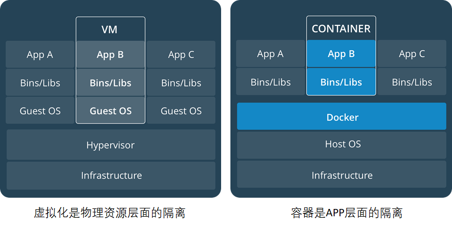

# Docker平台
Docker 提供了在松散隔离的环境中打包和运行应用程序的功能，该环境称为容器。隔离和安全性使您可以在给定主机上同时运行多个容器。容器是轻量级的，包含运行应用程序所需的一切，因此您无需依赖主机上安装的内容。您可以在工作时共享容器，并确保与您共享的每个人都能获得以相同方式工作的相同容器。

Docker 提供工具和平台来管理容器的生命周期：
- 使用容器开发应用程序及其支持组件
- 容器成为分发和测试应用程序的单元
- 应用程序作为容器或编排服务部署到生产环境（本地数据中心、云提供商等等）

# Docker使用场景
## 快速、一致地交付您的应用程序
Docker 允许开发人员使用提供应用程序和服务的本地容器在标准化环境中工作，从而简化了开发生命周期。容器非常适合持续集成和持续交付 (CI/CD) 工作流程。

**示例场景：**
- 开发人员本地编写代码并使用 Docker 容器与同事共享他们的工作。
- 使用 Docker 将应用程序推送到测试环境并运行自动和手动测试。
- 发现错误时，在开发环境中修复它们，并将其重新部署到测试环境中进行测试和验证。
- 测试完成后，将修复后代码构建成镜像并更新至生产环境并部署容器运行。

## 响应式部署和扩展
Docker 基于容器的平台支持高度可移植的工作负载。Docker 容器可以在开发人员的本地笔记本电脑、数据中心的物理机或虚拟机、云提供商或混合环境中运行。

Docker 的可移植性和轻量级特性还使其能够轻松地动态管理工作负载，根据业务需求近乎实时地扩大或拆除应用程序和服务。

## 在相同硬件上运行更多工作负载
Docker 轻量且快速。它为基于虚拟机管理程序的虚拟机提供了一种可行且经济高效的替代方案，因此您可以使用更多的服务器容量来实现业务目标。Docker 非常适合高密度环境以及需要使用更少资源完成更多任务的中小型部署。

## Docker与虚拟机对比

| **虚拟化**                                       | **容器**                                                |
| ------------------------------------------------ | ------------------------------------------------------- |
| 隔离性强，有独立的GUEST  OS                      | 共享内核和OS，隔离性弱!                                 |
| 虚拟化性能差(>15%)                               | 计算/存储无损耗，无Guest  OS内存开销(~200M)             |
| 虚拟机镜像庞大(十几G~几十G),  且实例化时不能共享 | Docker容器镜象200~300M，且公共基础镜象实例化时可以共享  |
| 虚拟机镜象缺乏统一标准                           | Docker提供了容器应用镜象事实标准，OCI推动进一  步标准化 |
| 虚拟机创建慢(>2分钟)                             | 秒级创建(<10s)相当于建立索引                            |
| 虚拟机启动慢(>30s)  读文件逐个加载               | 秒级(<1s,不含应用本身启动)                              |
| 资源虚拟化粒度低，单机10~100虚拟机               | 单机支持1000+容器密度很高，适合大规模的部署             |

- 资源利用率更高：一台物理机可以运行数百个容器，但一般只能运行数十个虚拟机
- 开销更小：不需要启动单独的虚拟机占用硬件资源
- 启动速度更快：可以在数秒内完成启动

# Docker架构
Docker 使用客户端-服务器架构。Docker 客户端与 Docker 守护程序通信，后者负责构建、运行和分发 Docker 容器的繁重工作。Docker 客户端和守护程序可以在同一系统上运行，或者您可以将 Docker 客户端连接到远程 Docker 守护程序。Docker 客户端和守护程序使用 REST API、通过 UNIX 套接字或网络接口进行通信。另一个 Docker 客户端是 Docker Compose，它允许您使用由一组容器组成的应用程序。

## Docker daemon
Docker 守护程序 ( `dockerd` ) 监听 Docker API 请求并管理 Docker 对象（例如images、containers、networks和volumes）。守护程序还可以与其他守护程序通信以管理 Docker 服务。

## Docker client
Docker 客户端 ( `docker` ) 是许多 Docker 用户与 Docker 交互的主要方式。当您使用诸如 `docker run` 类的命令时，客户端会将这些命令发送到 `dockerd` ，后者会执行这些命令。docker 命令使用 `docker` API。Docker 客户端可以与多个守护程序进行通信。

## Docker registry
Docker registry存储 Docker images。Docker Hub 是任何人都可以使用的public registry，Docker 默认在 Docker Hub 上查找images。也可以运行自己的private regsitry。

当使用 `docker pull` 或 `docker run` 命令时，Docker 会从配置的registry中拉取所需的images。当使用 `docker push` 命令时，Docker 会images推送到配置的registry。

## Docker objects
**Images**
image包含了创建 Docker container的说明。通常，可以基于其他镜像进行二次构建。例如，已经有 `ubuntu` 镜像，但我们还要安装 Apache Web服务 + 应用 + 自定义配置。

创建自己镜像，可以使用其他人发布在registry中的镜像，编写 Dockerfile，使用简单的语法来定义创建和运行映像所需的步骤。Dockerfile 中的每条指令都会在镜像中创建一个层。更改 Dockerfile 并重建镜像时，只会重建已更改的层。与其他虚拟化技术相比，这正是镜像如此轻量、小巧和快速的原因之一。

**Containers**
容器是镜像的可运行实例。可以使用 Docker API 或 CLI 创建、启动、停止、移动或删除容器。您可以将容器连接到一个或多个网络、为其附加存储，甚至根据其当前状态创建新镜像。

容器由其镜像和创建或启动容器时提供的任何配置选项定义。当容器被删除时，未持久化存储的更改都会消失。

## Docker Desktop
Docker Desktop 是一款易于安装的应用程序，适用于 Mac、Windows 或 Linux 环境，可让您构建和共享容器化应用程序和微服务。Docker Desktop 包括 Docker 守护程序 ( `dockerd` )、Docker 客户端 ( docker )、Docker Compose、Docker Content Trust、Kubernetes 和 Credential Helper。

# 容器规范
容器技术除了docker之外，还有coreOS的rkt，还有阿里的Pouch，还有红帽 的podman，为了保证容器生态的标准性和健康可持续发展，包括Linux基金会、Docker、微软、红帽、谷歌和IBM等公司在2015年6月共同成立了一个叫open container（OCI）的组织，其目的就是制定开放的标准的容器规范，目前OCI一共发布了两个规范分别是runtime spec和image format spec，不同的容器公司只需要兼容这两个规范，就可以保证容器的可移植性和相互可操作性。

runtime是真正运行容器的地方，因此运行了不同的容器runtime需要和操作系统内核紧密合作相互在支持，以便为容器提供相应的运行环境，目前主流的三种runtime：
- lxc：linux上早期的runtime，Docker早期就是采用lxc作为runtime
- runc：是目前docker默认的runtime，runc遵守oci规范，因此可以兼容lxc
- rkt：是coreOS开发的容器runtime，也符合oci规范