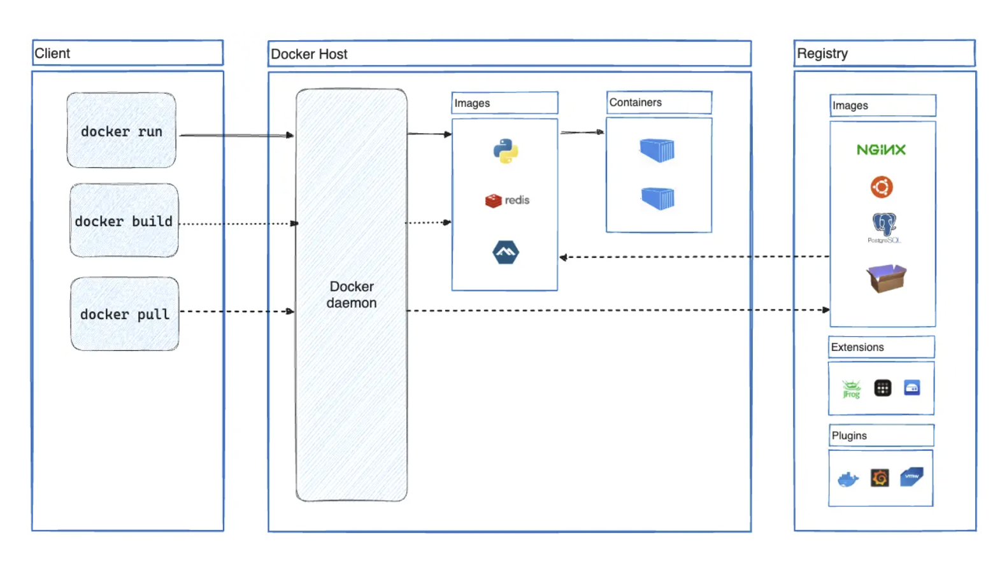

# Docker平台
Docker 提供了在松散隔离的环境中打包和运行应用程序的功能，该环境称为容器。隔离和安全性可以在给定主机上同时运行多个容器。容器是轻量级的，包含运行应用程序所需的一切，因此无需依赖主机上安装的内容。可以在工作时共享容器，并确保与共享的每个人都能获得以相同方式工作的相同容器。

Docker 提供工具和平台来管理容器的生命周期：
- 使用容器开发应用程序及其支持组件。
- 容器成为分发和测试应用程序的单元。
- 应用程序作为容器或编排服务部署到生产环境（本地数据中心、云提供商等等）。

# Docker使用场景
## 快速、一致地交付应用程序
Docker 允许开发人员使用提供应用程序和服务的本地容器在标准化环境中工作，从而简化了开发生命周期。容器非常适合持续集成和持续交付 (CI/CD) 工作流程。

**示例场景：**
- 开发人员本地编写代码并使用 Docker 容器与同事共享他们的工作。
- 使用 Docker 将应用程序推送到测试环境并运行自动和手动测试。
- 发现错误时，可以在开发环境中修复它们，并将其重新部署到测试环境中进行测试验证。
- 测试验证完成后，将修复后代码构建成镜像并更新至生产环境并部署容器运行。

## 响应式部署和扩展
Docker 基于容器的平台是高度可移植的。Docker 容器可以在开发人员的本地笔记本电脑、数据中心的物理机或虚拟机、云提供商或混合环境中运行。

Docker 的可移植性和轻量级特性还使其能够轻松地动态管理，根据业务需求近乎实时地扩大或拆除应用程序和服务。

## 在相同硬件上运行更多应用
Docker 轻量且快速。它为基于虚拟机的服务程序管理提供了一种可行且经济高效的替代方案，因此可以使用更多的服务器容量来实现业务目标。Docker 非常适合高密度环境以及需要使用更少资源完成更多任务的中小型部署。

# Docker架构
Docker 使用客户端-服务器架构。Docker 客户端与 Docker 守护程序通信，后者负责构建、运行和分发 Docker 容器的繁重工作。Docker 客户端和守护程序可以在同一系统上运行，或者可以将 Docker 客户端连接到远程 Docker 守护程序。Docker 客户端和守护程序使用 REST API、通过 UNIX 套接字或网络接口进行通信。另一个 Docker 客户端是 Docker Compose，可以管理由一组容器组成的应用程序。

## Docker Host
Docker Host是一款易于安装的应用程序，适用于 Mac、Windows 或 Linux 环境，可让构建和共享容器化应用程序和微服务。Docker Host 包括 Docker 守护程序 ( `dockerd` )、Docker 客户端 ( docker )、Docker Compose、Docker Content Trust、Kubernetes 和 Credential Helper。

## Docker Daemon
Docker 守护程序 ( `dockerd` ) 监听 Docker API 请求并管理 Docker 对象（例如images、containers、networks和volumes）。守护程序还可以与其他守护程序通信以管理 Docker 服务。

## Docker Client
Docker 客户端 ( `docker` ) 是许多 Docker 用户与 Docker 交互的主要方式。当使用诸如 `docker run` 类的命令时，客户端会将这些命令发送到 `dockerd` ，后者会执行这些命令。`docker` 命令使用 Docker API。Docker 客户端可以与多个守护程序进行通信。

## Docker Registry
Docker 镜像仓库是存储 Docker 镜像。Docker Hub 是个公共镜像仓库，Docker 默认会在 Docker Hub 上查找镜像。也可以运行自己的私有镜像仓库。

当使用 `docker pull` 或 `docker run` 命令时，Docker 会从配置的镜像仓库地址中拉取所需的镜像。当使用 `docker push` 命令时，Docker 会将镜像推送到配置的镜像仓库。

## Docker Objects
**Images**
镜像是创建 Docker 容器的模版。通常可以基于其他镜像进行二次构建。例如，已经有 `ubuntu` 镜像，但我们还要安装 Apache Web服务 + 应用 + 自定义配置。

基于别人发布在镜像仓库中的镜像，编写 Dockerfile 构建自己的镜像。Dockerfile 中的每条指令都会在镜像中创建一个层。更改 Dockerfile 并重建镜像时，只会重建已更改的层。这正是与虚拟化技术相比，镜像如此轻量、小巧和快速的原因之一。

**Containers**
容器是镜像的运行实例。可以使用 Docker API 或 CLI 创建、启动、停止、移动或删除容器。可以将容器连接到一个或多个网络、附加存储，甚至根据其当前状态创建新镜像。

容器由其镜像和创建或启动容器时提供的任何配置选项定义。当容器被删除时，未持久化存储的更改都会消失。

