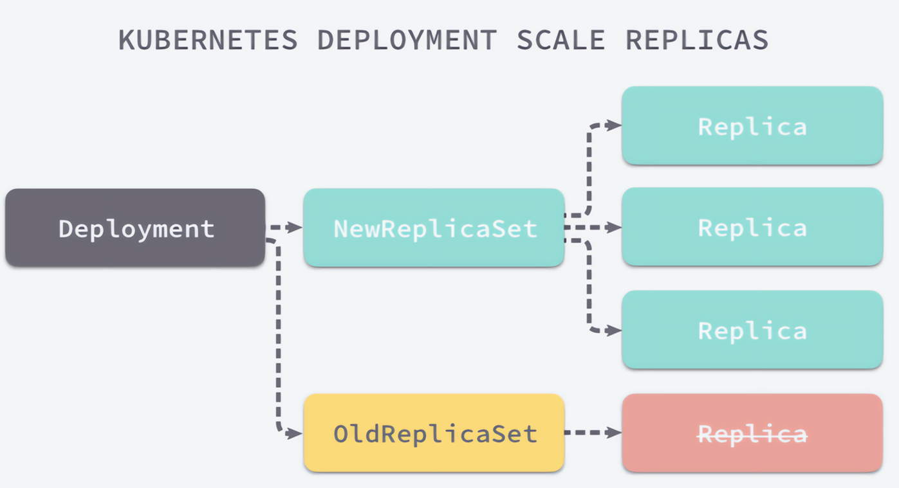

# 控制器

在Kubernetes中运⾏了⼀系列控制器来确保集群的当前状态与期望状态保持⼀致，它们就是Kubernetes集群内部的管理控制中⼼或者说是”中⼼⼤脑”。例如，ReplicaSet控制器负责维护集群中运⾏的Pod数量；Node控制器负责监控节点的状态，并在节点出现故障时，执⾏⾃动化修复流程，确保集群始终处于预期的⼯作状态。


- ReplicationController 和 ReplicaSet
- Deployment
- DaemonSet
- StateFulSet
- Job/CronJob
- Horizontal Pod Autoscaling

# ReplicationController

​	ReplicationController(RC)⽤来确保容器应⽤的副本数始终保持在⽤户定义的副本数，即如果有容器异常退出，会⾃动创建新的Pod来替代；⽽如果异常多出来的容器也会⾃动回收；

​	在新版本的Kubernetes中建议使⽤ReplicaSet(RS)来取代ReplicationController。ReplicaSet跟ReplicationController没有本质的不同，只是名字不⼀样，并且ReplicaSet⽀持集合式的selector；

```yaml
apiVersion: v1
kind: ReplicationController
metadata:
  name: rc-demo
spec:
  replicas: 3
  selector:
    app: rc-demo
  template:
    metadata:
      name: rc-demo
      labels:
        app: rc-demo
    spec:
      containers:
        - name: rc-demo-container
          image: aaronxudocker/myapp:v1.0
          ports:
            - containerPort: 80
            
# kubectl delete pod rc-demo-fl7vb
# kubectl label pod rc-demo-fl7vb app=rc-demo1 --overwrite
```

RS控制器

```yaml
apiVersion: apps/v1
kind: ReplicaSet
metadata:
  name: rc-ml-demo
spec:
  replicas: 3
  selector:
    matchLabels:
      app: rc-ml-demo
  template:
    metadata:
      name: rc-ml-demo
      labels:
        app: rc-ml-demo
    spec:
      containers:
        - name: rc-ml-demo-container
          image: aaronxudocker/myapp:v1.0
          ports:
            - containerPort: 80
```

`selector.matchExpressions` 
rs在标签选择器上，除了可以定义键值对的选择形式，还支持matchExpressions字段，可以提供多种选择。
目前支持的操作包括：

- In：label的值在某个列表中
- NotIn：label的值不在某个列表中
- Exists：某个label存在
- DoesNotExist：某个label不存在

```yaml
apiVersion: apps/v1
kind: ReplicaSet
metadata:
  name: rc-me-demo
spec:
  replicas: 3
  selector:
    matchExpressions:
      - key: app
        operator: Exists
  template:
    metadata:
      name: rc-me-demo
      labels:
        app: rc-me-demo
    spec:
      containers:
        - name: rc-me-demo-container
          image: aaronxudocker/myapp:v1.0
          ports:
            - containerPort: 80
```

```yaml
apiVersion: apps/v1
kind: ReplicaSet
metadata:
  name: rc-me-in-demo
spec:
  replicas: 3
  selector:
    matchExpressions:
      - key: app
        operator: In
        values:
        - spring-k8s
        - xixixi
  template:
    metadata:
      name: rc-me-in-demo
      labels:
        app: rc-me-in-demo
    spec:
      containers:
        - name: rc-me-in-demo-container
          image: aaronxudocker/myapp:v1.0
          ports:
            - containerPort: 80
```

# Deployment

声明性的东⻄是对终结果的陈述，表明意图⽽不是实现它的过程。在Kubernetes中，这就是说“应该有⼀个包含三个Pod的ReplicaSet”。
命令式充当命令。声明式是被动的，⽽命令式是主动且直接的：“创建⼀个包含三个Pod的ReplicaSet”。

```bash
$ kubectl replace -f deployment.yaml

$ kubectl apply -f deployment.yaml

$ kubectl diff -f deployment.yaml
```

替换⽅式
- kubectl replace:使⽤新的配置完全替换掉现有资源的配置。这意味着新配置将覆盖现有资源的所有字段和属性，包括未指定的字段，会导致整个资源的替换
- kubectl apply:使⽤新的配置部分地更新现有资源的配置。它会根据提供的配置文件或参数，只更新与新配置中不同的部分，⽽不会覆盖整个资源的配置

字段级别的更新
- kubectl replace:由于是完全替换，所以会覆盖所有字段和属性，⽆论是否在新配置中指定
- kubectl apply:只更新与新配置中不同的字段和属性，保留未指定的字段不受影响

部分更新
- kubectl replace:不⽀持部分更新，它会替换整个资源的配置
- kubectl apply:⽀持部分更新，只会更新新配置中发⽣变化的部分，保留未指定的部分不受影响

与其他配置的影响
- kubectl replace:不考虑其他资源配置的状态，直接替换资源的配置
- kubectl apply:可以结合使⽤-f或-k参数，从文件或⽬录中读取多个资源配置，并根据当前集群中的资源状态进⾏更新

## Deployment介绍

Deployment为Pod和ReplicaSet提供了⼀个声明式定义(declarative)⽅法，⽤来替代以前的ReplicationController来⽅便的管理应⽤。典型的应⽤场景包括：

- 定义Deployment来创建Pod和ReplicaSet
- 滚动升级和回滚应⽤
- 扩容和缩容
- 暂停和继续Deployment



```yaml
apiVersion: apps/v1
kind: Deployment
metadata:
  labels: 
    app: myapp-deploy
  name: myapp-deploy
spec:
  replicas: 1
  selector:
    matchLabels:
      app: myapp-deploy
  template:
    metadata:
      labels:
        app: myapp-deploy
    spec:
      containers:
      - name: myapp
        image: aaronxudocker/myapp:v1.0
        resources:
          limits:
            memory: "128Mi"
            cpu: "500m"
        ports:
        - containerPort: 80
```

## 更新策略

Deployment可以保证在升级时只有⼀定数量的Pod是down的。默认的，它会确保⾄少有比期望的Pod数量少⼀个是up状态（最多⼀个不可⽤）

Deployment同时也可以确保只创建出超过期望数量的⼀定数量的Pod。默认的，它会确保最多比期望的Pod数量多⼀个的Pod是up的（最多1个surge）

未来的Kuberentes版本中，将从1-1变成25%-25%。目前的版本已经支持。

kubectlexplaindeploy.spec.strategy.type

- Recreate
  - 在创建出新的Pod之前会先杀掉所有已存在的Pod

- rollingUpdate
  - 滚动更新，就是杀死一部分，就启动一部分，在更新过程中，存在两个版本Pod

  - maxSurge：指定超出副本数有⼏个，两种⽅式：1、指定数量2、百分比

  - maxUnavailable：最多有⼏个不可⽤


```bash
$ kubectl create -f deployment.yaml --record
# --record 参数可以记录命令，可以看到每次revision的变化

$ kubectl scale deployment myapp-deploy --replicas 10

$ kubectl autoscale deployment myapp-deploy --min=10 --max=15 --cpu-percent=80

$ kubectl set image deployment/myapp-deploy myapp=aaronxudocker/myapp:v2.0

$ kubectl rollout history deployment/myapp-deploy

$ kubectl rollout undo deployment/myapp-deploy
```

可以通过设置`.spec.revisionHistoryLimit`项来指定deployment最多保留多少revision历史记录。默认的会保留所有的revision；如果将该项设置为0，Deployment就不允许回退了

## 金丝雀部署

⾦丝雀部署的名字灵感来源于17世纪英国矿井⼯⼈使⽤⾦丝雀作为⽡斯检测指标的传统⽅法。⾦丝雀对⽡斯这种⽓体⼗分敏感，空⽓中哪怕有极其微量的⽡斯，⾦丝雀也会停⽌歌唱。⽽当⽡斯含量超过⼀定限度时，虽然⼈类毫⽆察觉，⾦丝雀却早已毒发⾝亡。在采矿设备相对简陋的条件下，⼯⼈们每次下井都会带上⼀只⾦丝雀作为“⽡斯检测指标”，以便在危险状况下紧急撤离。

⾦丝雀部署的核⼼思想是在实际运⾏环境中的⼀⼩部分⽤户或流量上测试新版本的软件，⽽⼤部分⽤户或流量仍然使⽤旧版本。通过对新版本进⾏有限范围的实时测试和监控，可以及早发现潜在的问题，并减少对整个系统的冲击。


```bash
$ kubectl patch deployment myapp-deploy -p '{"spec":{"strategy":{"rollingUpdate":{"maxSurge":1,"maxUnavailable":0}}}}'
# 允许pod多出预期1个，不允许少一个

$ kubectl patch deployment myapp-deploy --patch '{"spec": {"template": {"spec": {"containers": [{"name": "myapp","image":"aaronxudocker/myapp:v2.0"}]}}}}'   &&  kubectl rollout pause deploy  myapp-deploy
# 修改镜像为v2.0版本，并且立马停止回滚，可以看到pod数量复合上面的设置

$ kubectl rollout resume deploy myapp-deploy
# 恢复回滚动作
```

回滚相关的命令

```bash
$ kubectl rollout status deployment myapp-deploy
# 查看上次回滚的状态

$ kubectl rollout history deployment/myapp-deploy
# 查看回滚的历史记录，需要配合--record使用

$ kubectl rollout undo deployment/myapp-deploy --to-revision=2
# 状态回退到李四记录里面的2的状态

$ kubectl rollout pause deployment/myapp-deploy
# 暂停回滚
```

# DaemonSet

DaemonSet确保全部（或者⼀些）Node上运⾏⼀个Pod的副本。当有Node加入集群时，也会为他们新增⼀个Pod。当有Node从集群移除时，这些Pod也会被回收。删除DaemonSet将会删除它创建的所有Pod

使⽤DaemonSet的⼀些典型⽤法：
- 运⾏集群存储daemon，例如在每个Node上运⾏`glusterd`、`ceph`
- 在每个Node上运⾏⽇志收集daemon，例如`fluentd`、`logstash`
- 在每个Node上运⾏监控daemon，例如PrometheusNode Exporter、`collectd`、Datadog代理、NewRelic代理，或Ganglia`gmond`

```yaml
apiVersion: apps/v1
kind: DaemonSet
metadata:
  name: deamonset-demo
  namespace: default
  labels:
    app: deamonset-demo
spec:
  selector:
    matchLabels:
      app: deamonset-demo
  template:
    metadata:
      labels:
        app: deamonset-demo
    spec:
      containers:
      - name: deamonset-demo
        image: aaronxudocker/myapp:v1.0
```

# Job

Job负责批处理任务，即仅执⾏⼀次的任务，它保证批处理任务的⼀个或多个Pod成功结束

特殊说明
- spec.template格式同Pod
- RestartPolicy仅⽀持Never或OnFailure
- 单个Pod时，默认Pod成功运⾏后Job即结束
- `.spec.completions`标志Job结束需要成功运⾏的Pod个数，默认为1
- `.spec.parallelism`标志并⾏运⾏的Pod的个数，默认为1
- `spec.activeDeadlineSeconds`标志失败Pod的重试最⼤时间，超过这个时间不会继续重试

案例：使用马青公式计算圆周率后一千位，可以用来看下节点的计算能力

​	这个公式由英国天文学教授约翰·⻢青于1706年发现。他利⽤这个公式计算到了100位的圆周率。⻢青公式每计算⼀项可以得到1.4位的⼗进制精度。因为它的计算过程中被乘数和被除数都不⼤于⻓整数，所以可以很容易地在计算机上编程实现
$$
\frac{\pi}{4} = 4 \tan^{-1}\left(\frac{1}{5}\right) - \tan^{-1}\left(\frac{1}{239}\right)
$$

```yaml
apiVersion: batch/v1
kind: Job
metadata:
  name: job-demo
spec:
  template:
    metadata:
      name: job-demo-pod
    spec:
      containers:
      - name: job-demo
        image: aaronxudocker/tools:maqingpythonv1
      restartPolicy: Never
```

Job负责批处理任务，即仅执⾏⼀次的任务，它保证批处理任务的⼀个或多个Pod成功结束

## 错误的Job任务

```yaml
apiVersion: batch/v1
kind: Job
metadata:
  name: rand
spec:
  template:
    metadata:
      name: rand
    spec:
      containers:
      - name: rand
        image: aaronxudocker/tools:randexitv1
        args: ["--exitcode=1"]
      restartPolicy: Never
```

Job控制器会记录成功的次数

```bash
$ kubectl get job 
NAME   COMPLETIONS   DURATION   AGE
rand   0/1           30s        30s
```

改为产生随机返回值

```yaml
apiVersion: batch/v1
kind: Job
metadata:
  name: rand
spec:
  completions: 10
  parallelism: 5
  template:
    metadata:
      name: rand
    spec:
      containers:
      - name: rand
        image: aaronxudocker/tools:randexitv1
      restartPolicy: Never
```

可以看到并行启动5个pod，直到成功为止

```bash
$ kubectl get job -w
NAME   COMPLETIONS   DURATION   AGE
rand   2/10          24s        24s
rand   2/10          50s        50s
rand   2/10          52s        52s
rand   2/10          58s        58s
rand   2/10          59s        59s
rand   3/10          59s        59s
rand   3/10          60s        60s
rand   5/10          60s        60s
rand   5/10          61s        61s
rand   5/10          62s        62s
rand   5/10          67s        67s
rand   5/10          68s        68s
rand   8/10          68s        68s
rand   8/10          69s        69s
rand   8/10          69s        69s


$ kubectl get job -o yaml
......
  spec:
    backoffLimit: 6
# 6次尝试失败，就达到尝试上限
```

# CronJob

CronJob管理基于时间的Job，即：
- 在给定时间点只运⾏⼀次
- 周期性地在给定时间点运⾏

使⽤条件：当前使⽤的Kubernetes集群，版本>=1.8（对CronJob）

典型的⽤法如下所⽰：
- 在给定的时间点调度Job运⾏
- 创建周期性运⾏的Job，例如：数据库备份、发送邮件


- `.spec.schedule`：调度，必需字段，指定任务运⾏周期，格式同Cron
- `.spec.jobTemplate`：Job模板，必需字段，指定需要运⾏的任务，格式同Job
- `.spec.startingDeadlineSeconds`：启动Job的期限（秒级别），该字段是可选的。如果因为任何原因⽽错过了被调度的时间，那么错过执⾏时间的Job将被认为是失败的。如果没有指定，则没有期限
- `.spec.concurrencyPolicy`：并发策略，该字段也是可选的。它指定了如何处理被CronJob创建的Job的并发执⾏。只允许指定下⾯策略中的⼀种：
  - `Allow`（默认）：允许并发运⾏Job
  - `Forbid`：禁⽌并发运⾏，如果前⼀个还没有完成，则直接跳过下⼀个
  - `Replace`：取消当前正在运⾏的Job，⽤⼀个新的来替换
  - 注意，当前策略只能应⽤于同⼀个CronJob创建的Job。如果存在多个CronJob，它们创建的Job之间总是允许并发运⾏。

- `.spec.suspend`：挂起，该字段也是可选的。如果设置为`true`，后续所有执⾏都会被挂起。它对已经开始执⾏的Job不起作⽤。默认值为`false`
- `.spec.successfulJobsHistoryLimit`和`.spec.failedJobsHistoryLimit`：历史限制，是可选的字段。它们指定了可以保留多少完成和失败的Job。默认情况下，它们分别设置为`3`和`1`。设置限制的值为`0`，相关类型的Job完成后将不会被保留

```yaml
apiVersion: batch/v1
kind: CronJob
metadata:
  name: cronjob-demo
spec:
  schedule: "*/1 * * * *"
  jobTemplate:
    spec:
      completions: 3
      template:
        spec:
          containers:
          - name: cronjob-demo-container
            image: aaronxudocker/tools:busybox
            args:
            - /bin/sh
            - -c
            - date; echo Hello from the Kubernetes cluster
          restartPolicy: OnFailure
```

创建job操作应该是幂等的

# Horizontal Pod Autoscaler(HPA)

​	在前面的课程中，我们已经可以实现通过手工执行`kubectl scale`命令实现Pod扩容或缩容，但是这显然不符合Kubernetes的定位目标--自动化、智能化。 Kubernetes期望可以实现通过监测Pod的使用情况，实现pod数量的自动调整，于是就产生了Horizontal Pod Autoscaler（HPA）这种控制器。

​	HPA可以获取每个Pod利用率，然后和HPA中定义的指标进行对比，同时计算出需要伸缩的具体值，最后实现Pod的数量的调整。其实HPA与之前的Deployment一样，也属于一种Kubernetes资源对象，它通过追踪分析RC控制的所有目标Pod的负载变化情况，来确定是否需要针对性地调整目标Pod的副本数，这是HPA的实现原理。


查看pod的资源

```bash
# 由于没安装metrics服务，所以无法查看pod资源情况
$ kubectl top pod myapp-deploy-57bff895d5-cvlmg
error: Metrics API not available
```

安装metrics-server

```bash
$ wget https://github.com/kubernetes-sigs/metrics-server/releases/download/v0.7.2/components.yaml

# 修改配置文件
- args:
  - --kubelet-preferred-address-types=InternalIP,ExternalIP,Hostname,InternalDNS,ExternalDNS
  - --kubelet-insecure-tls
  image: registry.k8s.io/metrics-server/metrics-server:v0.7.2
  
$ kubectl apply -f components.yaml

$ kubectl get pod -n kube-system |grep metrics
metrics-server-5c7fbc6ff6-fssfd            1/1     Running   0             2m42s

# 使用kubectl top node 查看资源使用情况
$ kubectl top node
NAME       CPU(cores)   CPU%   MEMORY(bytes)   MEMORY%   
master01   116m         2%     1943Mi          55%       
node01     48m          1%     961Mi           27%       
node02     61m          1%     1161Mi          32%

$ kubectl top pod myapp-deploy-57bff895d5-cvlmg
NAME                            CPU(cores)   MEMORY(bytes)   
myapp-deploy-57bff895d5-cvlmg   0m           4Mi
```

准备deployment和service资源

```yaml
apiVersion: apps/v1
kind: Deployment
metadata:
  name: nginx
spec:
  replicas: 1
  selector:
    matchLabels:
      app: nginx-pod
  template:
    metadata:
      labels:
        app: nginx-pod
    spec:
      containers:
      - name: nginx
        image: aaronxudocker/myapp:v1.0
        resources:
          limits:
            cpu: "1"
          requests:
            cpu: "100m"
```

创建service并且查看

```bash
$ kubectl expose deployment nginx --type=NodePort --port=80

$ kubectl get deployment,pod,svc
NAME                           READY   UP-TO-DATE   AVAILABLE   AGE
deployment.apps/nginx          1/1     1            1           114s

NAME                                READY   STATUS    RESTARTS   AGE
pod/nginx-7b4664bb57-pgllw          1/1     Running   0          114s

NAME                 TYPE        CLUSTER-IP   EXTERNAL-IP   PORT(S)        AGE
service/nginx        NodePort    10.8.51.98   <none>        80:30482/TCP   37s
```

创建HPA资源

```yaml
apiVersion: autoscaling/v2
kind: HorizontalPodAutoscaler
metadata:
  name: hpa-demo
spec:
  minReplicas: 1  #最小pod数量
  maxReplicas: 10 #最大pod数量
  behavior:
    scaleUp:
      stabilizationWindowSeconds: 10 # 在连续10秒内稳定后才考虑进一步扩展操作
      policies:
      - type: Percent
        value: 100 # 当超过当前副本数的100%才进行扩展 
        periodSeconds: 3 # 两次扩容之间的最小时间间隔
    scaleDown:
      stabilizationWindowSeconds: 300 # 在连续300秒内稳定后才考虑缩减操作
      policies:
      - type: Percent
        value: 10 # 当低于当前副本数的10%才进行缩减 
        periodSeconds: 3 # 两次缩减之间的最小时间间隔
  metrics:
  - type: Resource
    resource:
      name: cpu
      target:
        type: Utilization
        averageUtilization: 10 # CPU平均利用率目标设为10%
  scaleTargetRef:   # 指定要控制的nginx信息
    apiVersion: apps/v1
    kind: Deployment
    name: nginx
```

查看hpa资源

```bash
$ kubectl get hpa -w
NAME       REFERENCE          TARGETS   MINPODS   MAXPODS   REPLICAS   AGE
hpa-demo   Deployment/nginx   0%/10%    1         10        1          20s
```

使用压力测试工具

```bash
$ ab -c 1000 -n 1000000 http://192.168.173.100:30482/

$ kubectl get hpa -w
NAME       REFERENCE          TARGETS   MINPODS   MAXPODS   REPLICAS   AGE
hpa-demo   Deployment/nginx   0%/10%    1         10        1          20s
hpa-demo   Deployment/nginx   1%/10%    1         10        1          105s
hpa-demo   Deployment/nginx   366%/10%   1         10        1          2m
hpa-demo   Deployment/nginx   522%/10%   1         10        2          2m15s
hpa-demo   Deployment/nginx   352%/10%   1         10        4          2m30s
hpa-demo   Deployment/nginx   189%/10%   1         10        8          2m45s
hpa-demo   Deployment/nginx   103%/10%   1         10        10         3m
hpa-demo   Deployment/nginx   68%/10%    1         10        10         3m15s
```

压力测试停止之后

```bash
$ kubectl get hpa -w
NAME       REFERENCE          TARGETS   MINPODS   MAXPODS   REPLICAS   AGE
hpa-demo   Deployment/nginx   0%/10%     1         10        10         8m45s
hpa-demo   Deployment/nginx   0%/10%     1         10        9          9m
hpa-demo   Deployment/nginx   0%/10%     1         10        8          9m15s
hpa-demo   Deployment/nginx   0%/10%     1         10        7          9m30s
hpa-demo   Deployment/nginx   0%/10%     1         10        6          9m45s
hpa-demo   Deployment/nginx   0%/10%     1         10        5          10m
hpa-demo   Deployment/nginx   0%/10%     1         10        4          10m
hpa-demo   Deployment/nginx   0%/10%     1         10        3          10m
hpa-demo   Deployment/nginx   0%/10%     1         10        2          10m
hpa-demo   Deployment/nginx   0%/10%     1         10        1          11m
```


