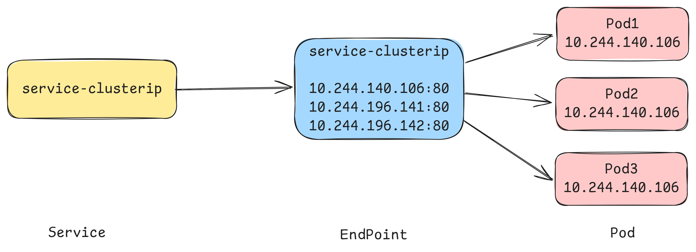
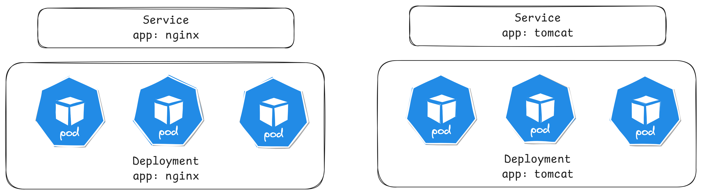
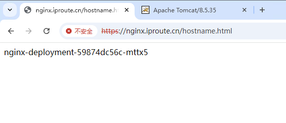

# 概念以及原理

Kubernetes`Service`定义了这样⼀种抽象：

​	⼀个`Pod`的逻辑分组，⼀种可以访问它们的策略，通常称为微服务。这⼀组`Pod`能够被`Service`访问到，通常是通过`LabelSelector`


Service在很多情况下只是一个概念，真正起作用的其实是kube-proxy服务进程，每个Node节点上都运行着一个kube-proxy服务进程。当创建Service的时候会通过api-server向etcd写入创建的service的信息，而kube-proxy会基于监听的机制发现这种Service的变动，然后**它会将最新的Service信息转换成对应的访问规则**。


# 工作模式

kube-proxy目前支持三种工作模式:

## userspace模式

​	userspace模式下，kube-proxy会为每一个Service创建一个监听端口，发向Cluster IP的请求被Iptables规则重定向到kube-proxy监听的端口上，kube-proxy根据LB算法选择一个提供服务的Pod并和其建立链接，以将请求转发到Pod上。  该模式下，kube-proxy充当了一个四层负责均衡器的角色。由于kube-proxy运行在userspace中，在进行转发处理时会增加内核和用户空间之间的数据拷贝，虽然比较稳定，但是效率比较低。


## iptables模式

​	iptables模式下，kube-proxy为service后端的每个Pod创建对应的iptables规则，直接将发向Cluster IP的请求重定向到一个Pod IP。该模式下kube-proxy不承担四层负责均衡器的角色，只负责创建iptables规则。该模式的优点是较userspace模式效率更高，但不能提供灵活的LB策略，当后端Pod不可用时也无法进行重试。


## ipvs模式

​	ipvs模式和iptables类似，kube-proxy监控Pod的变化并创建相应的ipvs规则。ipvs相对iptables转发效率更高。除此以外，ipvs支持更多的LB算法。


```yaml
# 创建三个pod
apiVersion: apps/v1
kind: Deployment
metadata:
  labels: 
    app: myapp-deploy
  name: myapp-deploy
spec:
  replicas: 3
  selector:
    matchLabels:
      app: myapp-deploy
  template:
    metadata:
      labels:
        app: myapp-deploy
    spec:
      containers:
      - name: myapp
        image: aaronxudocker/myapp:v1.0
        resources:
          limits:
            memory: "128Mi"
            cpu: "500m"
        ports:
        - containerPort: 80
```

```bash
# 启动一个负载均衡的service
$ kubectl create svc clusterip myapp-deploy --tcp=80:80

# 修改ipvs
$ kubectl edit configmap kube-proxy -n kube-system
mode: "ipvs"

# 删除kube-proxy的pod
$ kubectl delete pod -n kube-system -l k8s-app=kube-proxy
pod "kube-proxy-ckwsj" deleted
pod "kube-proxy-t729f" deleted
pod "kube-proxy-z6dt8" deleted

# 查看pod创建的状态
$ kubectl get pod -n kube-system -l k8s-app=kube-proxy
NAME               READY   STATUS    RESTARTS   AGE
kube-proxy-948s5   1/1     Running   0          3s
kube-proxy-ggpwj   1/1     Running   0          3s
kube-proxy-v7lgs   1/1     Running   0          3s

# 查看虚拟IP地址
$ kubectl get svc
NAME           TYPE        CLUSTER-IP   EXTERNAL-IP   PORT(S)   AGE
myapp-deploy   ClusterIP   10.9.86.78   <none>        80/TCP    6m54s

# 查看ipvsadm的状态
$ ipvsadm -Ln
IP Virtual Server version 1.2.1 (size=4096)
Prot LocalAddress:Port Scheduler Flags
  -> RemoteAddress:Port           Forward Weight ActiveConn InActConn      
TCP  10.9.86.78:80 rr
  -> 10.244.140.106:80            Masq    1      0          0         
  -> 10.244.196.141:80            Masq    1      0          0         
  -> 10.244.196.142:80            Masq    1      0          0
  
# 负载均衡的地址正好对应着pod的ip地址
$ kubectl get pod -o wide
NAME                            READY   STATUS    RESTARTS   AGE   IP               NODE     NOMINATED NODE   READINESS
myapp-deploy-57bff895d5-b2hhk   1/1     Running   0          73s   10.244.196.142   node01   <none>           <none>
myapp-deploy-57bff895d5-fbln4   1/1     Running   0          73s   10.244.140.106   node02   <none>           <none>
myapp-deploy-57bff895d5-frnfd   1/1     Running   0          73s   10.244.196.141   node01   <none>           <none>
```

# Service资源清单

```yaml
kind: Service  # 资源类型
apiVersion: v1  # 资源版本
metadata: # 元数据
  name: service # 资源名称
  namespace: default # 命名空间
spec: # 描述
  selector: # 标签选择器，用于确定当前service代理哪些pod
    app: nginx
  type: # Service类型，指定service的访问方式
  clusterIP:  # 虚拟服务的ip地址
  sessionAffinity: # session亲和性，支持ClientIP、None两个选项
  sessionAffinityConfig:
    clientIP:
      timeoutSeconds: 120  # session的过期时间
  ports: # 端口信息
    - protocol: TCP 
      port: 3017  # service端口
      targetPort: 5003 # pod端口
      nodePort: 31122 # 主机端口
```

可以使用如下命令得到基本的yaml格式的文件

```bash
$ kubectl create svc clusterip nginx --tcp=80:80 --dry-run=client -o yaml

$ ipvsadm -lnc
```

`spec.type`可以选择的类型

- ClusterIP：默认值，它是Kubernetes系统自动分配的虚拟IP，只能在集群内部访问
- NodePort：将Service通过指定的Node上的端口暴露给外部，通过此方法，就可以在集群外部访问服务
- LoadBalancer：使用外接负载均衡器完成到服务的负载分发，注意此模式需要外部云环境支持
- ExternalName： 把集群外部的服务引入集群内部，直接使用

# Service使用

```yaml
# 创建三个pod
apiVersion: apps/v1
kind: Deployment
metadata:
  labels: 
    app: myapp-deploy
  name: myapp-deploy
spec:
  replicas: 3
  selector:
    matchLabels:
      app: myapp-deploy
  template:
    metadata:
      labels:
        app: myapp-deploy
    spec:
      containers:
      - name: myapp
        image: aaronxudocker/myapp:v1.0
        resources:
          limits:
            memory: "128Mi"
            cpu: "500m"
        ports:
        - containerPort: 80
```

测试三个pod

```bash
$ kubectl get pod -o wide
NAME                            READY   STATUS    RESTARTS   AGE   IP               NODE     NOMINATED NODE   READINESS GATES
myapp-deploy-57bff895d5-b2hhk   1/1     Running   0          30m   10.244.196.142   node01   <none>           <none>
myapp-deploy-57bff895d5-fbln4   1/1     Running   0          30m   10.244.140.106   node02   <none>           <none>
myapp-deploy-57bff895d5-frnfd   1/1     Running   0          30m   10.244.196.141   node01   <none>           <none>

# 查看一下访问情况
$ curl 10.244.196.142/hostname.html
myapp-deploy-57bff895d5-b2hhk
$ curl 10.244.140.106/hostname.html
myapp-deploy-57bff895d5-fbln4
$ curl 10.244.196.141/hostname.html
myapp-deploy-57bff895d5-frnfd
```

## ClusterIP类型的Service

```yaml
apiVersion: v1
kind: Service
metadata:
  name: service-clusterip
spec:
  selector:
    app: myapp-deploy
  # clusterIP: 172.16.66.66 # service的ip地址，如果不写，默认会生成一个
  type: ClusterIP
  ports:
  - port: 80  # Service端口       
    targetPort: 80 # pod端口
```

查看运行结果

```bash
$ kubectl get svc
NAME                TYPE        CLUSTER-IP     EXTERNAL-IP   PORT(S)   AGE
service-clusterip   ClusterIP   10.13.125.29   <none>        80/TCP    22s

$ kubectl describe svc service-clusterip 
Name:              service-clusterip
Namespace:         default
Labels:            <none>
Annotations:       <none>
Selector:          app=myapp-deploy
Type:              ClusterIP
IP Family Policy:  SingleStack
IP Families:       IPv4
IP:                10.13.125.29
IPs:               10.13.125.29
Port:              <unset>  80/TCP
TargetPort:        80/TCP
Endpoints:         10.244.140.106:80,10.244.196.141:80,10.244.196.142:80
Session Affinity:  None
Events:            <none>

$ ipvsadm -Ln
IP Virtual Server version 1.2.1 (size=4096)
Prot LocalAddress:Port Scheduler Flags
  -> RemoteAddress:Port           Forward Weight ActiveConn InActConn     
TCP  10.13.125.29:80 rr
  -> 10.244.140.106:80            Masq    1      0          0         
  -> 10.244.196.141:80            Masq    1      0          0         
  -> 10.244.196.142:80            Masq    1      0          0     
  
$ while true;do curl 10.13.125.29/hostname.html; done
myapp-deploy-57bff895d5-b2hhk
myapp-deploy-57bff895d5-frnfd
myapp-deploy-57bff895d5-fbln4
myapp-deploy-57bff895d5-b2hhk
myapp-deploy-57bff895d5-frnfd
myapp-deploy-57bff895d5-fbln4
```

## Endpoint

​	Endpoint是kubernetes中的一个资源对象，存储在etcd中，用来记录一个service对应的所有pod的访问地址，它是根据service配置文件中selector描述产生的。必须要满足就绪探测。

​	一个Service由一组Pod组成，这些Pod通过Endpoints暴露出来，**Endpoints是实现实际服务的端点集合**。换句话说，service和pod之间的联系是通过endpoints实现的。



```bash
$ kubectl get endpoints -o wide
NAME                ENDPOINTS                                               AGE
service-clusterip   10.244.140.106:80,10.244.196.141:80,10.244.196.142:80   6m27s
```

在deployment中添加一个就绪探测

```yaml
apiVersion: apps/v1
kind: Deployment
metadata:
  labels: 
    app: myapp-deploy
  name: myapp-deploy
spec:
  replicas: 3
  selector:
    matchLabels:
      app: myapp-deploy
  template:
    metadata:
      labels:
        app: myapp-deploy
    spec:
      containers:
      - name: myapp
        image: aaronxudocker/myapp:v1.0
        resources:
          limits:
            memory: "128Mi"
            cpu: "500m"
        readinessProbe:
          httpGet:
            port: 80
            path: /index1.html
          initialDelaySeconds: 1
          periodSeconds: 3
        ports:
        - containerPort: 80
```

在不满足就绪探测的情况下，是不会被endpoint采用的

```bash
$ kubectl get pod
NAME                            READY   STATUS    RESTARTS   AGE
myapp-deploy-659f9975b8-2sntn   0/1     Running   0          40s
myapp-deploy-659f9975b8-nd66b   0/1     Running   0          40s
myapp-deploy-659f9975b8-p4j5k   0/1     Running   0          40s

$ kubectl get endpoints
NAME                ENDPOINTS              AGE
service-clusterip                          10s
```

满足了就绪探测和标签被匹配上的pod会被加入endpoint中

```bash
$ kubectl exec -it myapp-deploy-659f9975b8-2sntn -- /bin/bash
root@myapp-deploy-659f9975b8-2sntn:/# echo "hello world" > /usr/share/nginx/html/index1.html

$ kubectl get pod
NAME                            READY   STATUS    RESTARTS   AGE
myapp-deploy-659f9975b8-2sntn   1/1     Running   0          3m4s
myapp-deploy-659f9975b8-nd66b   0/1     Running   0          3m4s
myapp-deploy-659f9975b8-p4j5k   0/1     Running   0          3m4s

$ kubectl get endpoints 
NAME                ENDPOINTS              AGE
service-clusterip   10.244.140.107:80      3m1s

$ ipvsadm -L -n
IP Virtual Server version 1.2.1 (size=4096)
Prot LocalAddress:Port Scheduler Flags
  -> RemoteAddress:Port           Forward Weight ActiveConn InActConn     
TCP  10.12.150.224:80 rr
  -> 10.244.140.107:80            Masq    1      0          0
```

**负载分发策略**

对Service的访问被分发到了后端的Pod上去，目前kubernetes提供了两种负载分发策略：

- 如果不定义，默认使用kube-proxy的策略，比如随机、轮询

- 基于客户端地址的会话保持模式，即来自同一个客户端发起的所有请求都会转发到固定的一个Pod上

  此模式可以使在spec中添加`sessionAffinity: ClientIP`选项

```bash
$ kubectl edit svc service-clusterip
sessionAffinity: ClientIP

$ while true;do curl 10.13.125.29/hostname.html; done
myapp-deploy-57bff895d5-fbln4
myapp-deploy-57bff895d5-fbln4
myapp-deploy-57bff895d5-fbln4
myapp-deploy-57bff895d5-fbln4
myapp-deploy-57bff895d5-fbln4
myapp-deploy-57bff895d5-fbln4
myapp-deploy-57bff895d5-fbln4
myapp-deploy-57bff895d5-fbln4

$ ipvsadm -Ln
IP Virtual Server version 1.2.1 (size=4096)
Prot LocalAddress:Port Scheduler Flags
  -> RemoteAddress:Port           Forward Weight ActiveConn InActConn       
TCP  10.13.125.29:80 rr persistent 10800
  -> 10.244.140.106:80            Masq    1      0          155       
  -> 10.244.196.141:80            Masq    1      0          0         
  -> 10.244.196.142:80            Masq    1      0          0 
```

## HeadLess类型的Service

在某些场景中，开发人员可能不想使用Service提供的负载均衡功能，而希望自己来控制负载均衡策略，针对这种情况，kubernetes提供了HeadLiness Service，这类Service不会分配Cluster IP，如果想要访问service，只能通过service的域名进行查询。

```yaml
apiVersion: v1
kind: Service
metadata:
  name: service-headliness
spec:
  selector:
    app: myapp-deploy
  clusterIP: None # 将clusterIP设置为None，即可创建headliness Service
  type: ClusterIP
  ports:
  - port: 80    
    targetPort: 80
```

```bash
$ kubectl get svc -o wide
NAME                 TYPE        CLUSTER-IP      EXTERNAL-IP   PORT(S)   AGE   SELECTOR
service-headliness   ClusterIP   None            <none>        80/TCP    40s   app=myapp-deploy

$ kubectl describe svc service-headliness
Name:              service-headliness
Namespace:         default
Labels:            <none>
Annotations:       <none>
Selector:          app=myapp-deploy
Type:              ClusterIP
IP Family Policy:  SingleStack
IP Families:       IPv4
IP:                None
IPs:               None
Port:              <unset>  80/TCP
TargetPort:        80/TCP
Endpoints:         10.244.140.107:80
Session Affinity:  None
Events:            <none>

$ kubectl exec -it myapp-deploy-659f9975b8-2sntn -- /bin/bash
root@myapp-deploy-659f9975b8-2sntn:/# cat /etc/resolv.conf 
nameserver 10.0.0.10
search default.svc.cluster.local svc.cluster.local cluster.local
options ndots:5

$ dig @10.0.0.10 service-headliness.default.svc.cluster.local
;; ANSWER SECTION:
service-headliness.default.svc.cluster.local. 30 IN A 10.244.140.107
service-headliness.default.svc.cluster.local. 30 IN A 10.244.196.145
service-headliness.default.svc.cluster.local. 30 IN A 10.244.196.144
```

## NodePort类型的Service

​	在之前的样例中，创建的Service的ip地址只有集群内部才可以访问，如果希望将Service暴露给集群外部使用，那么就要使用到另外一种类型的Service，称为NodePort类型。NodePort的工作原理其实就是**将service的端口映射到Node的一个端口上**，然后就可以通过`NodeIp:NodePort`来访问service了。


```yaml
apiVersion: v1
kind: Service
metadata:
  name: service-nodeport
spec:
  selector:
    app: myapp-deploy
  type: NodePort # service类型
  ports:
  - port: 80
    nodePort: 30002 # 指定绑定的node的端口(默认的取值范围是：30000-32767), 如果不指定，会默认分配
    targetPort: 80
```

查看是否能够正常的访问

```bash
$ for i in {1..6};do curl 192.168.173.100:30002/hostname.html;done
myapp-deploy-659f9975b8-nd66b
myapp-deploy-659f9975b8-p4j5k
myapp-deploy-659f9975b8-2sntn
myapp-deploy-659f9975b8-nd66b
myapp-deploy-659f9975b8-p4j5k
myapp-deploy-659f9975b8-2sntn
```

## LoadBalancer类型的Service

​	LoadBalancer和NodePort很相似，目的都是向外部暴露一个端口，区别在于LoadBalancer会在集群的外部再来做一个负载均衡设备，而这个设备需要外部环境支持的，外部服务发送到这个设备上的请求，会被设备负载之后转发到集群中。

 

## ExternalName类型的Service

​	ExternalName类型的Service用于引入集群外部的服务，它通过`externalName`属性指定外部一个服务的地址，然后在集群内部访问此service就可以访问到外部的服务了。


```yaml
apiVersion: v1
kind: Service
metadata:
  name: service-externalname
  namespace: dev
spec:
  type: ExternalName # service类型
  externalName: www.baidu.com  #改成ip地址也可以
```

```bash
$ kubectl get svc
NAME                   TYPE           CLUSTER-IP     EXTERNAL-IP     PORT(S)        AGE
service-externalname   ExternalName   <none>         www.baidu.com   <none>         7s

$ dig @10.0.0.10 service-externalname.default.svc.cluster.local
;; ANSWER SECTION:
service-externalname.default.svc.cluster.local. 30 IN CNAME www.baidu.com.
www.baidu.com.          30      IN      CNAME   www.a.shifen.com.
www.a.shifen.com.       30      IN      A       180.101.50.242
www.a.shifen.com.       30      IN      A       180.101.50.188
```

# Ingress介绍

在前面课程中已经提到，Service对集群之外暴露服务的主要方式有两种：NotePort和LoadBalancer，但是这两种方式，都有一定的缺点：

- NodePort方式的缺点是会占用很多集群机器的端口，那么当集群服务变多的时候，这个缺点就愈发明显
- LB方式的缺点是每个service需要一个LB，浪费、麻烦，并且需要kubernetes之外设备的支持

基于这种现状，kubernetes提供了Ingress资源对象，Ingress只需要一个NodePort或者一个LB就可以满足暴露多个Service的需求。工作机制大致如下图表示：


实际上，Ingress相当于一个7层的负载均衡器，是kubernetes对反向代理的一个抽象，它的工作原理类似于Nginx，可以理解成在**Ingress里建立诸多映射规则，Ingress Controller通过监听这些配置规则并转化成Nginx的反向代理配置 , 然后对外部提供服务**。在这里有两个核心概念：

- ingress：kubernetes中的一个对象，作用是定义请求如何转发到service的规则
- ingress controller：具体实现反向代理及负载均衡的程序，对ingress定义的规则进行解析，根据配置的规则来实现请求转发，实现方式有很多，比如Nginx, Contour, Haproxy等等

Ingress（以Nginx为例）的工作原理如下：

1. 用户编写Ingress规则，说明哪个域名对应kubernetes集群中的哪个Service
2. Ingress控制器动态感知Ingress服务规则的变化，然后生成一段对应的Nginx反向代理配置
3. Ingress控制器会将生成的Nginx配置写入到一个运行着的Nginx服务中，并动态更新
4. 到此为止，其实真正在工作的就是一个Nginx了，内部配置了用户定义的请求转发规则


## 安装helm

```bash
# 安装helm，helm在kubernetes中相当于yum，是可以在线去获取资源清单，快速部署服务
$ curl -fsSL -o get_helm.sh https://raw.githubusercontent.com/helm/helm/main/scripts/get-helm-3
$ chmod 700 get_helm.sh
$ ./get_helm.sh

# 初始化,可以从 https://artifacthub.io/ 中选择一个可用的仓库地址
$ helm repo add bitnami https://charts.bitnami.com/bitnami
$ helm repo list
NAME    URL                               
bitnami https://charts.bitnami.com/bitnami

# 常见操作
$ helm repo update				# 更新chart列表
$ helm show chart bitnami/apache	# 查看chart基本信息
$ helm install bitnami/apache --generate-name		# 部署chart
$ helm list				# 查看部署包，加上--all可以看到所有的
$ helm uninstall apache-1726297430		# 删除这个安装包所有的kubernetes资源

$ helm search hub wordpress		# 在 helm hub(https://hub.helm.sh)上搜索helm chart
$ helm search repo wordpress	# 在repo中搜索
```

## 安装Ingress-nginx

```bash
$ helm repo add ingress-nginx https://kubernetes.github.io/ingress-nginx
$ helm pull ingress-nginx/ingress-nginx

# 修改 values.yaml 文件
修改 hostNetwork 的值为 true
dnsPolicy的值改为: ClusterFirstWithHostNet
kind类型更改为：DaemonSet
ingressClassResource.default:true
      
# 关闭所有镜像的 digest   

# 如果是本地的helm chart，使用这个命令安装
$ kubectl create ns ingress
$ helm install ingress-nginx -n ingress . -f values.yaml
$ kubectl get pod -n ingress
NAME                             READY   STATUS    RESTARTS   AGE
ingress-nginx-controller-7c4x8   1/1     Running   0          12s
ingress-nginx-controller-bjk4s   1/1     Running   0          12s
```

## 实验测试

创建如下两个资源模型



```yaml
apiVersion: apps/v1
kind: Deployment
metadata:
  name: nginx-deployment
spec:
  replicas: 3
  selector:
    matchLabels:
      app: nginx
  template:
    metadata:
      labels:
        app: nginx
    spec:
      containers:
      - name: nginx
        image: aaronxudocker/myapp:v1.0
        ports:
        - containerPort: 80

---

apiVersion: apps/v1
kind: Deployment
metadata:
  name: tomcat-deployment
spec:
  replicas: 3
  selector:
    matchLabels:
      app: tomcat
  template:
    metadata:
      labels:
        app: tomcat
    spec:
      containers:
      - name: tomcat
        image: tomcat:8.5-jre10-slim
        ports:
        - containerPort: 8080

---

apiVersion: v1
kind: Service
metadata:
  name: nginx-service
spec:
  selector:
    app: nginx
  clusterIP: None
  type: ClusterIP
  ports:
  - port: 80
    targetPort: 80

---

apiVersion: v1
kind: Service
metadata:
  name: tomcat-service
spec:
  selector:
    app: tomcat
  clusterIP: None
  type: ClusterIP
  ports:
  - port: 8080
    targetPort: 8080
```

### Http代理

```yaml
apiVersion: networking.k8s.io/v1
kind: Ingress
metadata:
  name: ingress-nginx
spec:
  rules:
  - host: nginx.iproute.cn
    http:
      paths:
      - path: /
        pathType: Prefix
        backend: 
          service:
            name: nginx-service
            port: 
              number: 80
  ingressClassName: nginx
---

apiVersion: networking.k8s.io/v1
kind: Ingress
metadata:
  name: ingress-tomcat
spec:
  rules:
  - host: tomcat.iproute.cn
    http:
      paths:
      - path: /
        pathType: Prefix
        backend:
          service:
            name: tomcat-service
            port: 
              number: 8080
  ingressClassName: nginx
```

查看运行状态

```bash
$ kubectl get ing
NAME             CLASS   HOSTS               ADDRESS   PORTS   AGE
ingress-nginx    nginx   nginx.iproute.cn              80      7s
ingress-tomcat   nginx   tomcat.iproute.cn             80      7s

$ kubectl describe ing

Rules:
  Host              Path  Backends
  ----              ----  --------
  nginx.iproute.cn  
                    /   nginx-service:80 (10.244.140.109:80,10.244.196.149:80,10.244.196.150:80)

Rules:
  Host               Path  Backends
  ----               ----  --------
  tomcat.iproute.cn  
                     /   tomcat-service:8080 (10.244.140.110:8080,10.244.196.151:8080,10.244.196.153:8080)
```

访问测试


其中nginx多次访问主机名，可以看到负载均衡


## Https代理

创建证书

```bash
# 生成证书
$ openssl req -x509 -sha256 -nodes -days 365 -newkey rsa:2048 -keyout tls.key -out tls.crt -subj "/C=CN/ST=BJ/L=BJ/O=nginx/CN=iproute.cn"

# 创建密钥
$ kubectl create secret tls tls-secret --key tls.key --cert tls.crt
```

创建资源清单

```yaml
apiVersion: networking.k8s.io/v1
kind: Ingress
metadata:
  name: https-nginx
spec:
  tls:
    - hosts:
      - nginx.iproute.cn
      secretName: tls-secret # 指定秘钥
  rules:
  - host: nginx.iproute.cn
    http:
      paths:
      - path: /
        pathType: Prefix
        backend:
          service:
            name: nginx-service
            port: 
              number: 80
  ingressClassName: nginx
---

apiVersion: networking.k8s.io/v1
kind: Ingress
metadata:
  name: tomcat-https
spec:
  tls:
    - hosts:
      - tomcat.iproute.cn
      secretName: tls-secret # 指定秘钥
  rules:
  - host: tomcat.iproute.cn
    http:
      paths:
      - path: /
        pathType: Prefix
        backend:
          service:
            name: tomcat-service
            port: 
              number: 8080
  ingressClassName: nginx
```

访问测试


可以看到负载均衡


