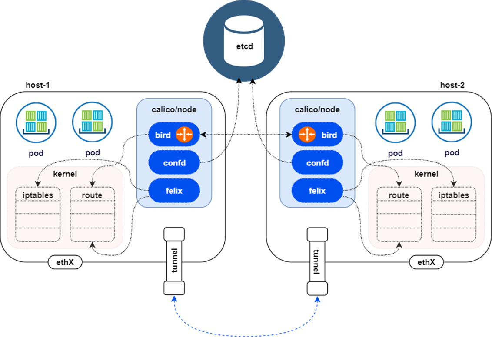
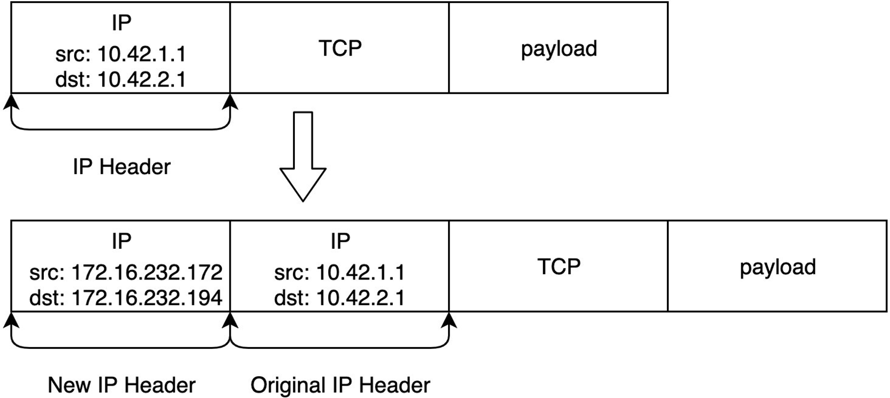

# pod概念


首先我们要明确一个概念，Kubernetes并不是只支持Docker这一个容器运行时，Kubernetes通过CRI这个抽象层，支持除Docker之外的其他容器运行时，比如rkt甚至支持客户自定义容器运行时。

- 第一个原因：借助CRI这个抽象层，使得Kubernetes不依赖于底层某一种具体的容器运行时实现技术，而是直接操作pod，pod内部再管理多个业务上紧密相关的用户业务容器，这种架构便于Kubernetes做扩展。
- 第二个原因，我们假设Kubernetes没有pod的概念，而是直接管理容器，那么一组容器作为一个单元，假设其中一个容器死亡了，此时这个单元的状态应该如何定义呢？应该理解成整体死亡，还是个别死亡？

这个问题不易回答的原因，是因为包含了这一组业务容器的逻辑单元，没有一个统一的办法来代表整个容器组的状态，这就是Kubernetes引入pod的概念，并且每个pod里都有一个Kubernetes系统自带的pause容器的原因，通过引入pause这个与业务无关并且作用类似于Linux操作系统守护进程的Kubernetes系统标准容器，以pause容器的状态来代表整个容器组的状态。


- 第三个原因：pod里所有的业务容器共享pause容器的IP地址，以及pause容器mount的Volume，通过这种设计，业务容器之间可以直接通信，文件也能够直接彼此共享。

## Pause特性

- Pod内部第一个启动的容器
- 初始化网络栈
- 挂载需要的存储卷
- 回收僵⼫进程
- 容器与Pause容器共享名字空间(Network、PID、IPC)

# 实战：基于Docker模拟pod

- 编写Nginx配置文件

```bash
cat <<EOF>> nginx.conf
error_log stderr;
events {
    worker_connections 1024;
}
http {
    access_log /dev/stdout combined; 
    server {
        listen 80 default_server; 
        server_name example.com www.example.com; 
        location / {
            proxy_pass http://127.0.0.1:2368;
        }
    }
}
EOF
```

- 启动容器

```bash
docker run --name pause -p 8080:80 -d k8s.gcr.io/pause:3.1

docker run --name nginx -v `pwd`/nginx.conf:/etc/nginx/nginx.conf --net=container:pause --ipc=container:pause --pid=container:pause -d nginx

docker run -d --name ghost -e NODE_ENV=development --net=container:pause --ipc=container:pause --pid=container:pause ghost
```


# kubernetes网络

## 基本概述

Kubernetes的网络模型假定了所有Pod都在一个可以直接连通的扁平的网络空间中，这在GCE（Google Compute Engine）里面是现成的网络模型，Kubernetes假定这个网络已经存在。而在私有云里搭建Kubernetes集群，就不能假定这个网络已经存在了。我们需要自己实现这个网络假设，将不同节点上的Docker容器之间的互相访问先打通，然后运行Kubernetes。

## 网络模型原则

- 在不使用网络地址转换(NAT)的情况下，集群中的Pod能够与任意其他Pod进行通信
- 在不使用网络地址转换(NAT)的情况下，在集群节点上运行的程序能与同一节点上的任何Pod进行通信
- 每个Pod都有自己的IP地址（IP-per-Pod），并且任意其他Pod都可以通过相同的这个地址访问它

## CNI

借助CNI标准，Kubernetes可以实现容器网络问题的解决。通过插件化的方式来集成各种网络插件，实现集群内部网络相互通信，只要实现CNI标准中定义的核心接口操作（ADD，将容器添加到网络；DEL，从网络中删除一个容器；CHECK，检查容器的网络是否符合预期等）。CNI插件通常聚焦在容器到容器的网络通信。


CNI的接口并不是指HTTP，gRPC这种接口，CNI接口是指对可执行程序的调用（exec）可执行程序，Kubernetes节点默认的CNI插件路径为/opt/cni/bin

```bash
[root@master01 ~]# ls /opt/cni/bin/
bandwidth  calico       dhcp   firewall  host-device  install  loopback  portmap  sbr     tap     vlan
bridge     calico-ipam  dummy  flannel   host-local   ipvlan   macvlan   ptp      static  tuning  vrf
```

CNI通过JSON格式的配置文件来描述网络配置，当需要设置容器网络时，由容器运行时负责执行CNI插件，并通过CNI插件的标准输入（stdin）来传递配置文件信息，通过标准输出（stdout）接收插件的执行结果。从网络插件功能可以分为五类：


- **Main插件**
  - 创建具体网络设备
    - bridge：网桥设备，连接container和host；
    - ipvlan：为容器增加ipvlan网卡；
    - loopback：IO设备；
    - macvlan：为容器创建一个MAC地址；
    - ptp：创建一对Veth Pair；
    - vlan：分配一个vlan设备；
    - host-device：将已存在的设备移入容器内
- **IPAM插件**：
  - 负责分配IP地址
    - dhcp：容器向DHCP服务器发起请求，给Pod发放或回收IP地址；
    - host-local：使用预先配置的IP地址段来进行分配；
    - static：为容器分配一个静态IPv4/IPv6地址，主要用于debug
- **META插件**：
  - 其他功能的插件
    - tuning：通过sysctl调整网络设备参数；
    - portmap：通过iptables配置端口映射；
    - bandwidth：使用TokenBucketFilter来限流；
    - sbr：为网卡设置source based routing；
    - firewall：通过iptables给容器网络的进出流量进行限制
- **Windows插件**：专门用于Windows平台的CNI插件（win-bridge与win-overlay网络插件）
- **第三方网络插件**：第三方开源的网络插件众多，每个组件都有各自的优点及适应的场景，难以形成统一的标准组件，常用有Flannel、Calico、Cilium、OVN网络插件


## 网络插件


### 人气数据

数据更新时间：2024-09-04

| 提供商  | 项目                                    | Stars | Forks | Contributors |
| ------- | --------------------------------------- | ----- | ----- | ------------ |
| Canal   | https://github.com/projectcalico/canal  | 714   | 100   | 20           |
| Flannel | https://github.com/flannel-io/flannel   | 8.7k  | 2.9k  | 235          |
| Calico  | https://github.com/projectcalico/calico | 5.9k  | 1.3k  | 353          |
| Weave   | https://github.com/weaveworks/weave/    | 6.6k  | 668   | 87           |
| Cilium  | https://github.com/cilium/cilium        | 19.7k | 2.9k  | 803          |

功能说明

| 提供商  | 网络模型                 | 路由分发 | 网络策略 | 网格 | 外部数据存储   | 加密 | Ingress/Egress策略 |
| ------- | ------------------------ | -------- | -------- | ---- | -------------- | ---- | ------------------ |
| Canal   | 封装(VXLAN)              | 否       | 是       | 否   | K8s API        | 是   | 是                 |
| Flannel | 封装(VXLAN)              | 否       | 否       | 否   | K8s API        | 是   | 中                 |
| Calico  | 封装(VXLAN，IPIP),未封装 | 是       | 是       | 是   | Etcd 和K8s API | 是   | 是                 |
| Weave   | 封装                     | 是       | 是       | 是   | 否             | 是   | 是                 |
| Cilium  | 封装(VXLAN)              | 是       | 是       | 是   | Etcd和K8sAPI   | 是   | 是                 |

- 网络模型：封装或未封装。
- 路由分发：一种外部网关协议，用于在互联网上交换路由和可达性信息。BGP可以帮助进行跨集群pod之间的网络。此功能对于未封装的CNI网络插件是必须的，并且通常由BGP完成。如果你想构建跨网段拆分的集群，路由分发是一个很好的功能。
- 网络策略：Kubernetes提供了强制执行规则的功能，这些规则决定了哪些service可以使用网络策略进行相互通信。这是从Kubernetes1.7起稳定的功能，可以与某些网络插件一起使用。
- 网格：允许在不同的Kubernetes集群间进行service之间的网络通信。
- 外部数据存储：具有此功能的CNI网络插件需要一个外部数据存储来存储数据。
- 加密：允许加密和安全的网络控制和数据平面。
- Ingress/Egress策略：允许你管理Kubernetes和非Kubernetes通信的路由控制。

## 网络模型

- underlay network（非封装网络）
  - 现实的物理基础层网络设备
  - underlay就是数据中心场景的基础物理设施，保证任何两个点路由可达，其中包含了传统的网络技术
- overlay network（封装网络）
  - 一个基于物理网络之上构建的逻辑网络
  - overlay是在网络技术领域指的是一种网络架构上叠加的虚拟化技术模式
  - Overlay网络技术多种多样，一般采用TRILL、VxLan、GRE、NVGRE等隧道技术

### overlay


### underlay


## calico

或许是目前最主流的网络解决方案-calico

Calico是一个纯三层的虚拟网络，它没有复用docker的docker0网桥，而是自己实现的，calico网络不对数据包进行额外封装，不需要NAT和端口映射

### calico架构



- Felix
  - 管理网络接口
  - 编写路由
  - 编写ACL
  - 报告状态
- bird（BGPClient）
  - BGPClient将通过BGP协议⼴播告诉剩余calico节点，从而实现网络互通
- confd
  - 通过监听etcd以了解BGP配置和全局默认值的更改。Confd根据ETCD中数据的更新，动态生成BIRD配置文件。当配置文件更改时，confd触发BIRD重新加载新文件

### VXLAN

- VXLAN，即Virtual Extensible LAN（虚拟可扩展局域网），是Linux本身支持的一网种网络虚拟化技术。VXLAN可以完全在内核态实现封装和解封装工作，从而通过“隧道”机制，构建出覆盖网络（OverlayNetwork）
- 基于三层的”二层“通信，层即vxlan包封装在udp数据包中，要求udp在k8s节点间三层可达；
- 二层即vxlan封包的源mac地址和目的mac地址是自己的vxlan设备mac和对端vxlan设备mac实现通讯。


- 数据包封包：封包，在vxlan设备上将pod发来的数据包源、目的mac替换为本机vxlan网卡和对端节点vxlan 网卡的mac。外层udp目的ip地址根据路由和对端vxlan的mac查fdb表获取

- 优势：只要k8s节点间三层互通，可以跨网段，对主机网关路由没有特殊要求。各个node节点通过vxlan设备实现基于三层的”二层”互通,三层即vxlan包封装在udp数据包中，要求udp在k8s节点间三层可达；二层即vxlan封包的源mac地址和目的mac地址是自己的vxlan设备mac和对端vxlan设备mac

- 缺点：需要进行vxlan的数据包封包和解包会存在一定的性能损耗


配置方法

```yaml
# 在calico的配置文件中。如下配置
# Auto-detect the BGP IP address.
- name: IP
value: "autodetect"
# Enable IPIP
- name: CALICO_IPV4POOL_IPIP
value: "Never"
# Enable or Disable VXLAN on the default IP pool.
- name: CALICO_IPV4POOL_VXLAN
value: "Always"
# Enable or Disable VXLAN on the default IPv6 IP pool.
- name: CALICO_IPV6POOL_VXLAN
value: "Always"

# 分割线========================
# calico_backend: "bird"
calico_backend: "vxlan"


# - -felix-live
# - -bird-live
```

查看验证


VXLAN不需要BGP来建立节点间的邻接关系


### IPIP

- Linux原生内核支持
- IPIP隧道的工作原理是将源主机的IP数据包封装在一个新的IP数据包中，新的IP数据包的目的地址是隧道的另一端。在隧道的另一端，接收方将解封装原始IP数据包，并将其传递到目标主机。IPIP隧道可以在不同的网络之间建立连接，例如在IPv4网络和IPv6网络之间建立连接。


- 数据包封包：封包，在tunl0设备上将pod发来的数据包的mac层去掉，留下ip层封包。外层数据包目的ip地址根据路由得到。
- 优点：只要k8s节点间三层互通，可以跨网段，对主机网关路由没有特殊要求。
- 缺点：需要进行IPIP的数据包封包和解包会存在一定的性能损耗



配置方法

```yaml
# 在calico的配置文件中。如下配置
# Auto-detect the BGP IP address.
- name: IP
value: "autodetect"
# Enable IPIP
- name: CALICO_IPV4POOL_IPIP
value: "Always"
# Enable or Disable VXLAN on the default IP pool.
- name: CALICO_IPV4POOL_VXLAN
value: "Never"
# Enable or Disable VXLAN on the default IPv6 IP pool.
- name: CALICO_IPV6POOL_VXLAN
value: "Never"
```

查看验证


IPIP模式需要BGP来建立节点间的邻接关系，VXLAN不需要


### BGP

边界网关协议（Border Gateway Protocol,BGP）是互联网上一个核心的去中心化自治路由协议。它通过维护IP路由表或‘前缀’表来实现自治系统（AS）之间的可达性，属于矢量路由协议。BGP不使用传统的内部网关协议（IGP）的指标，而使用基于路径、网络策略或规则集来决定路由。因此，它更适合被称为矢量性协议，而不是路由协议。BGP，通俗的讲就是讲接入到机房的多条线路（如电信、联通、移动等）融合为一体，实现多线单IP，BGP机房的优点：服务器只需要设置一个IP地址，最佳访问路由是由网络上的骨⼲路由器根据路由跳数与其它技术指标来确定的，不会占用服务器的任何系统。


- 数据包封包：不需要进行数据包封包
- 优点：不用封包解包，通过BGP协议可实现pod网络在主机间的三层可达
- 缺点：跨网段时，配置较为复杂网络要求较高，主机网关路由也需要充当BGPSpeaker。

配置方法

```yaml
# 在calico的配置文件中。如下配置
# Auto-detect the BGP IP address.
- name: IP
value: "autodetect"
# Enable IPIP
- name: CALICO_IPV4POOL_IPIP
value: "Off"
# Enable or Disable VXLAN on the default IP pool.
- name: CALICO_IPV4POOL_VXLAN
value: "Never"
# Enable or Disable VXLAN on the default IPv6 IP pool.
- name: CALICO_IPV6POOL_VXLAN
value: "Never"
```

查看验证


