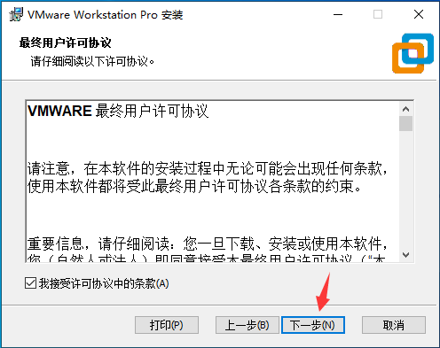
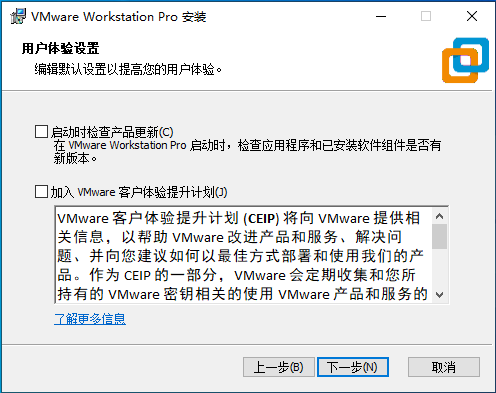
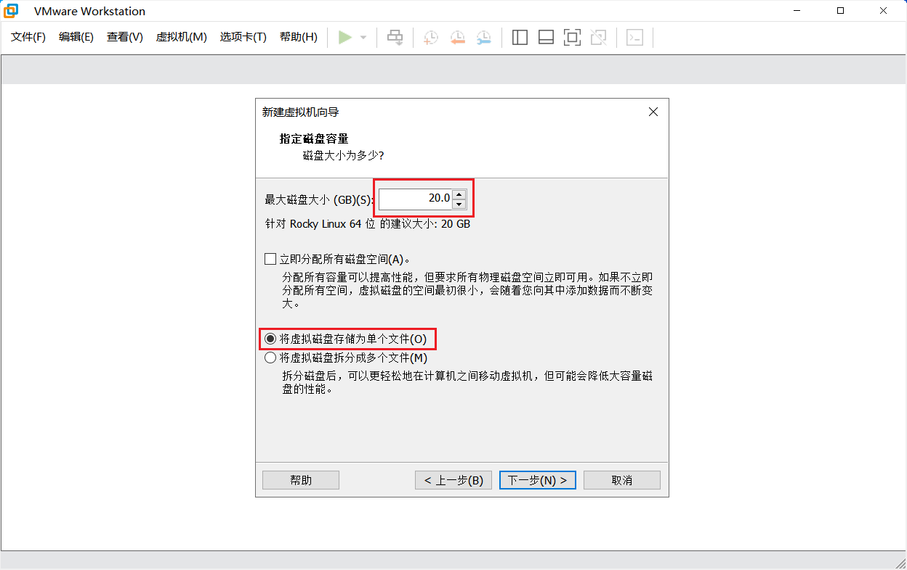
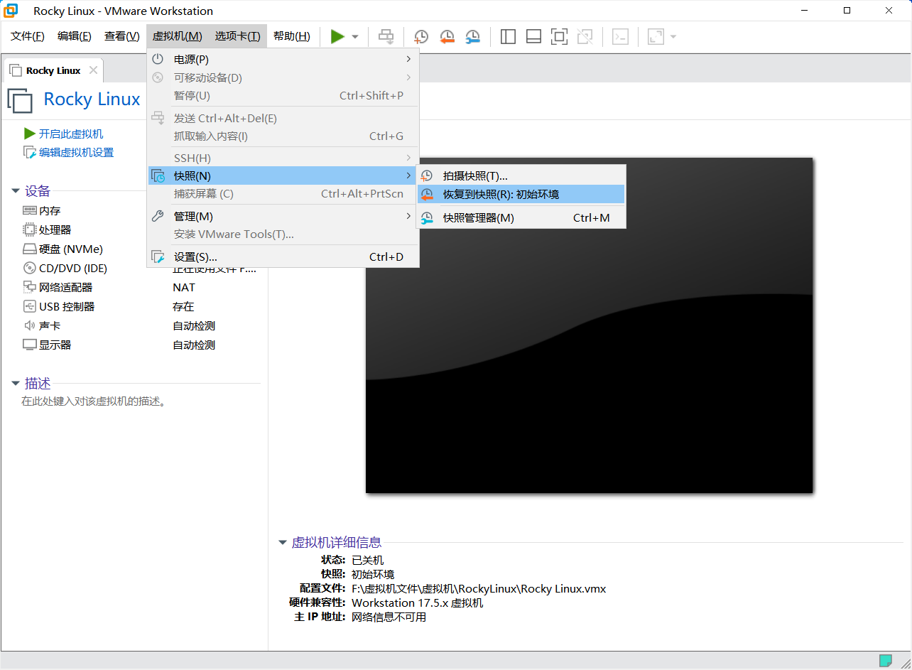
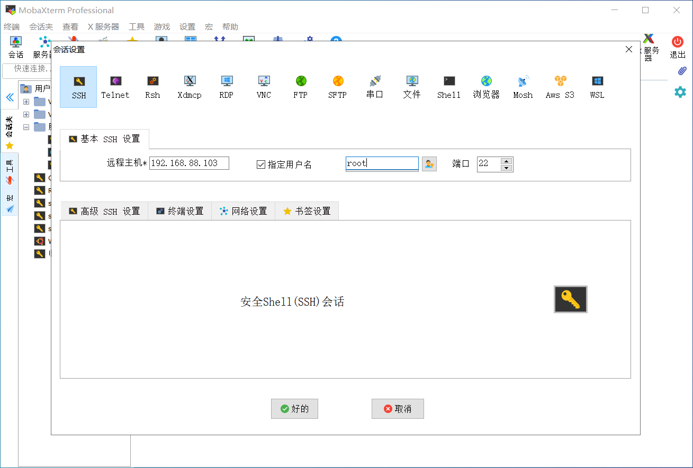

RockyLinux系统在企业中一般是安装在服务器上的，但是我们学习的时候买台服务器并不方便，所以我们可以将其安装在虚拟机中(实际上很多企业也这么做)

# vmware workstation 软件安装

**双击安装包**








**输入许可证**


# 创建 RockyLinux 虚拟机

**新建虚拟机**


**以下选项全部保持默认或者按照图片中选择**


**创建新的虚拟磁盘**




**完成创建**


**导入ISO文件**


# 安装 RockyLinux 系统

1. 点击开启此虚拟机


2. 鼠标点击进入这个黑框中，通过方向键选择**安装选项**，我们选择第一个：**Install Rocky Linux 9.4**


3. 依次按照图片所示，完成以下设置


4. 依次设置带有黄色感叹号的选项

5. 选择安装位置：


6. 选择安装的软件环境，标准安装：


7. 选择网络和主机名，用于开启网络连接：


8. 设置 root 密码，为了方便操作，我们统一设置为`2`,然后点击两次完成：


9. 点击开始安装，并且等待安装完成


10. 安装完成以后，点击重启系统


# RockyLinux 系统使用

重启之后就进入 RockyLinux 系统的界面，没有图形化，只有黑框框。然后我们先输入用户名`root`回车以后，在输入我们设置的密码`2`。但是输入密码的时候，是没有任何显示的，这是命令行为了保护密码的安全故意为之，我们我们输入了密码以后这直接回车即可进入系统。


如果输入密码回车之后，显示`[root@localhost ~]# `那么说明我们成功进入系统

最好检查一下，网络有没有问题，我们可以使用命令`ping qq.com -c 4`来测试与腾讯服务器的连通性，依次来判断网络是否正常连接。


如果输出的结果如图所示，说明我们系统的网络连接正常。那么接下来我们就是给这个系统拍个快照。

# 虚拟机快照

快照可以理解为保存的一个当前状态的还原点，可以完整保存当前的环境及状态。当我们以后再实验中，不小心把环境弄坏了以后，我们可以通过拍摄的快照，时光回溯到现在这个状态，避免我们重新安装系统的麻烦。

## 快照的创建

在创建快照的时候，一定要关机了以后再拍摄快照，不要在开机的状态下创建快照。

关机命令：

```shell
poweroff
```

创建快照：

在上方点击虚拟机，找到快照，拍摄快照，然后起个名字，最后点击拍摄快照。我们的快照就创建好了


## 快照的使用

如果我们想要回复到某一个快照的时候，我们还是在上方虚拟机，快照，然后选择恢复到快照即可。



# 远程管理 Linux 服务器

大多数情况下 Linux 服务器都是安装在数据中心机房的机柜里面的，大家可以把数据中心理解为大仓库，那么机柜就是一个个货架，而管理人员都是坐在办公室当中，通过电脑远程连接服务器进行管理，所以我们在后续学习的时候，为了方便，全部使用远程连接。

Linux 远程连接命令行工具有很多:

- xshell
  - 收费工具，有免费版，基本能满足需求，目前比较主流
- putty
  - 开源工具，功能比较简单
- MobaXterm
  - 免费工具，功能比较齐全，本次课程中推荐使用

首先查看虚拟机的IP地址，也就是 Linux 服务器的 IP 地址，登录进虚拟机之后输入`ip address`可以查看


这边可以看到本次安装的 RockyLinux 操作系统获取到的IP地址是 `192.168.88.103` 每个人装的虚拟机获取的 IP 地址可能是不一样的，需要仔细看清楚。

在连接之前，我们需要在 RockyLinux 上设置一下，让它允许通过 root 用户远程连接进来，大家先照着做，后面我们都会详细学到

```shell
[root@localhost ~]# echo "PermitRootLogin yes" >> /etc/ssh/sshd_config
[root@localhost ~]# systemctl restart sshd
```

## MobaXterm

解压之前下载的 MobaXterm 压缩包，双击程序运行


选择会话——ssh，然后填入IP地址



输入密码以后，回车。如果让你保存密码，建议选择不保存

如下图所示，则为登录成功


MobaXterm 工具只是用来远程连接和管理我们的 RockyLinux 虚拟机，所以在使用的时候，我们必须先启动RockyLinux 虚拟机。然后再次使用 MobaXterm 工具连接上来。并且我们在 MobaXterm 上面执行的命令，也都会被传递到我们的 RockyLinux 上面执行。

