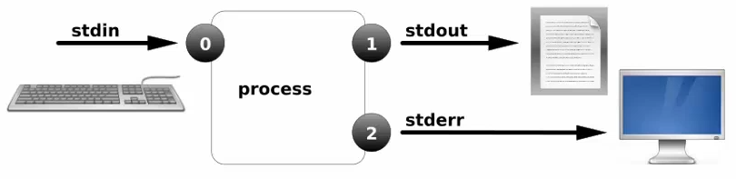

# I/O重定向

I/O对应系统中的输入(input)和输出(output)

其中输入可以是键盘输入，鼠标输入等等。同样输出也可以输出到终端中或者文件中

对于Linux系统，我们常见的输入输出的类型有：

- 标准输入   0
- 标准正确输出    1
- 标准错误输出    2


## File Descriptors(FD，文件描述符 )

**案例切入**：通过vim来追踪fd的信息

我们打开两个终端，然后在其中一个终端中使用vim打开一个文件，然后在另一个终端中查看与FD相关的文件

```bash
终端一：vim file.txt

终端二：
[root@192 fd]# ps aux | grep vim
root      16350  0.0  0.2 149432  5064 pts/1    S+   23:01   0:00 vim file1.txt
root      16360  0.0  0.0 112724   984 pts/0    S+   23:03   0:00 grep --color=auto vim
[root@192 fd]# cd /proc/16350/fd
[root@192 fd]# ll
总用量 0
lrwx------. 1 root root 64 6月   1 23:01 0 -> /dev/pts/1
lrwx------. 1 root root 64 6月   1 23:01 1 -> /dev/pts/1
lrwx------. 1 root root 64 6月   1 23:01 2 -> /dev/pts/1
lrwx------. 1 root root 64 6月   1 23:01 3 -> /root/.file1.txt.swp

# 这里有0 1 2 3
其中0表示标准输入
1表示标准正确输出
2表示标准错误输出
其他的都为输出到文件中

# 我们可以尝试通过0来向我们刚刚vim打开的文档里面输入内容
[root@192 fd]# echo hello > 0

这里也是体现Linux一切皆文件的特性，连输入输出都可以由文件来进行控制
```

| Number | Channel name | Description | Default connection | Usage        |
| ------ | ------------ | ----------- | ------------------ | ------------ |
| 0      | stdin        | 标准输入    | 键盘               | 只读         |
| 1      | stdout       | 标准输出    | 命令行             | 只写         |
| 2      | stderr       | 标准错误    | 命令行             | 只写         |
| 3+     | filename     | 其他文件    | none               | 读 and/or 写 |

**所以说，到底什么是文件描述符呢？**

文件描述符是操作系统内部用于管理和跟踪打开的文件和I/O资源。比如当我们打开一个文件的时候，操作系统会分配一个文件描述符给这个文件，我们可以通过这个文件描述符来对文件进行读写等操作。

每个进程默认打开三个文件描述符：

- `0`：标准输入（stdin）
- `1`：标准输出（stdout）
- `2`：标准错误输出（stderr）


# 输出重定向(覆盖,追加)

`>`：覆盖重定向

`>>`：追加重定向

`1>`：覆盖重定向正确的输出数据流

`1>>`：追加重定向正确的输出数据流

`2>`：覆盖重定向错误输出数据流

`2>>`：追加重定向错误输出数据流


**示例一：输出重定向(覆盖)**

```bash
[root@localhost ~]# date 1> date.txt
[root@localhost ~]# cat date.txt
```



**示例二：输出重定向(追加)**

```bash
[root@localhost ~]# date >> date.txt
[root@localhost ~]# date >> date.txt
[root@localhost ~]# date >> date.txt
[root@localhost ~]# cat date.txt
```


**示例三：错误输出重定向**

```bash
[root@localhost ~]# touch file
[root@localhost ~]# cd file
bash: cd: file: 不是目录
[root@localhost ~]# cd file 2> log.txt
[root@localhost ~]# cat log.txt
bash: cd: file: 不是目录
```


**示例四：正确和错误都输入到相同位置**

```bash
[root@localhost ~]# ls /home/ /test
ls: 无法访问/test: 没有那个文件或目录
/home/:
user01

#将正确和错误的输出都输出的文件中
[root@localhost ~]# ls /home/ /test &> log.txt
[root@localhost ~]# cat log.txt
ls: 无法访问/test: 没有那个文件或目录
/home/:
user01

```


**示例五：正确和错误都输出到相同位置**

```bash
[root@localhost ~]# ls /home/ /test > log.txt
ls: 无法访问/test: 没有那个文件或目录
[root@localhost ~]# ls /home/ /test > log.txt 2>&1
[root@localhost ~]# cat log.txt
ls: 无法访问/test: 没有那个文件或目录
/home/:
user01

```


**示例六：重定向到空设备`/dev/null`**

```bash
# /dev/null是一个空设备，可以理解为一个无限大的垃圾堆，可以往里面丢任意多的垃圾进去

[root@localhost ~]# ls /home/ /test > log.txt 2>/dev/null
[root@localhost ~]# cat log.txt
/home/:
user01

[root@localhost ~]# ls /home/ /test &>/dev/null
```


# 输入重定向

标准输入：`< 等价 0<`

**案例1：**

```bash
[root@localhost ~]# cat < /etc/passwd
root:x:0:0:root:/root:/bin/bash
bin:x:1:1:bin:/bin:/sbin/nologin
daemon:x:2:2:daemon:/sbin:/sbin/nologin
adm:x:3:4:adm:/var/adm:/sbin/nologin
lp:x:4:7:lp:/var/spool/lpd:/sbin/nologin
sync:x:5:0:sync:/sbin:/bin/sync
shutdown:x:6:0:shutdown:/sbin:/sbin/shutdown
halt:x:7:0:halt:/sbin:/sbin/halt
mail:x:8:12:mail:/var/spool/mail:/sbin/nologin
operator:x:11:0:operator:/root:/sbin/nologin
games:x:12:100:games:/usr/games:/sbin/nologin
ftp:x:14:50:FTP User:/var/ftp:/sbin/nologin
nobody:x:99:99:Nobody:/:/sbin/nologin
systemd-network:x:192:192:systemd Network Management:/:/sbin/nologin
dbus:x:81:81:System message bus:/:/sbin/nologin
polkitd:x:999:998:User for polkitd:/:/sbin/nologin
sshd:x:74:74:Privilege-separated SSH:/var/empty/sshd:/sbin/nologin
postfix:x:89:89::/var/spool/postfix:/sbin/nologin
chrony:x:998:996::/var/lib/chrony:/sbin/nologin
user01:x:1000:1000::/home/user01:/bin/bash

```

**案例2：**

```bash
[root@localhost ~]# grep 'root' < /etc/passwd
root:x:0:0:root:/root:/bin/bash
operator:x:11:0:operator:/root:/sbin/nologin
```

**案例3：at**

```bash
[root@localhost ~]# at now +5 min
at> ping -c4 baidu.com
at> <EOT>
job 1 at Thu Dec 12 15:50:00 2019
[root@localhost ~]# vim at.txt
ping -c4 baidu.com
[root@localhost ~]# at now +1 min < at.txt 
job 2 at Thu Dec 12 15:47:00 2019
```

**案例4：**利用重定向建立多行的文件

```bash
[root@localhost ~]# cat > file2.txt <<EOF
> hello
> python
> linux
> EOF
[root@localhost ~]# cat file2.txt
hello
python
linux
```


# 进程管道

用法：`command1 | command2 | command3 | ....`


```bash
[root@localhost ~]# ll /dev/ |less
[root@localhost ~]# ps aux |grep 'sshd'
[root@localhost ~]# rpm -qa |grep 'httpd'
[root@localhost ~]# yum list |grep 'httpd'
```

**案例1：** 统计出最占CPU的5个进程

```bash
[root@localhost ~]# ps aux --sort=-%cpu |head -6
```

**案例2：** 过滤secure文件中跟ssh相关的内容

```bash
[root@localhost ~]# cat /var/log/secure | grep ssh
```


# tee管道


```bash
[root@localhost ~]# du -h . | sort -hr | tee file_sizes.txt
44K     .
0       ./dir1
0       ./dir

使用 du 命令列出当前目录下的文件大小,然后通过管道传递给 sort 命令进行降序排序。最后使用 tee 命令将排序结果同时输出到终端和 file_sizes.txt 文件中。这样既可以在终端查看结果,也可以保存一份供后续分析使用
```
