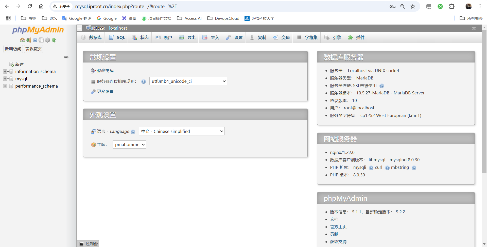
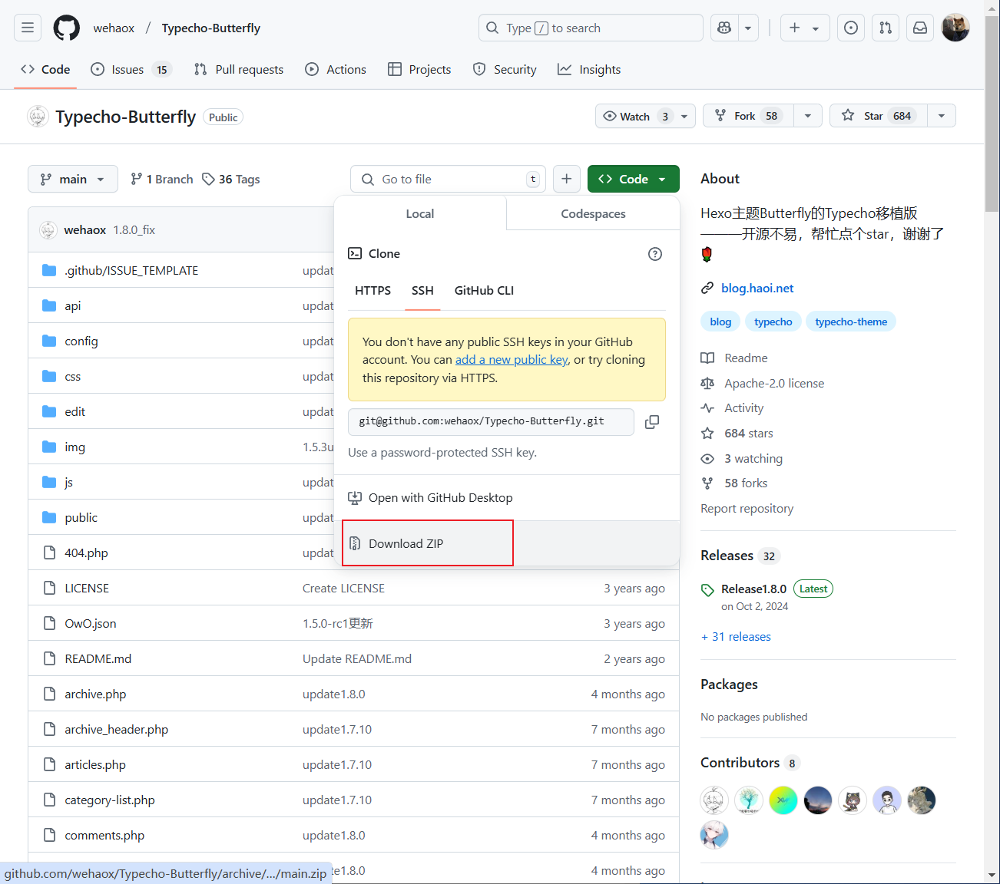

# Nginx介绍

Nginx：engine X ，2002年开始开发，2004年开源，2019年3⽉11⽇，Nginx公司被F5 Networks以6.7亿美元收购。

Nginx 则是免费的、开源的、⾼性能的HTTP和反向代理服务器、邮件代理服务器、以及TCP/UDP代理服务器 解决[C10K问题](https://www.ideawu.net/blog/archives/740.html)（10K Connections）

**Nginx官网：**[http://nginx.org](http://nginx.org/)

**Nginx 商业版为Nginx Plus：**https://www.nginx.com/products/nginx/

**Nginx的其它的⼆次发行版：**

- Tengine：由淘宝⽹发起的Web服务器项⽬。它在Nginx的基础上，针对⼤访问量⽹站的需求，添加了很多⾼级功能和特性。Tengine的性能和稳定性已经在⼤型的⽹站如淘宝⽹，天猫商城等得到了很好的检验。它的最终⽬标是打造⼀个⾼效、稳定、安全、易⽤的Web平台，从2011年12⽉开始，Tengine成为⼀个开源项⽬，官⽹http://tengine.taobao.org/
- OpenResty：基于 Nginx 与 Lua 语⾔的⾼性能 Web 平台， 章亦春团队开发，官⽹：http://openresty.org/cn/

## Nginx所具备的功能

- 静态的web资源服务器html，图⽚，js，css，txt等静态资源
- 结合FastCGI/uWSGI/SCGI等协议反向代理动态资源请求
- http/https协议的反向代理
- imap4/pop3协议的反向代理
- tcp/udp协议的请求转发（反向代理）

### web服务相关的功能支持

- 虚拟主机（server）
- ⽀持 keep-alive 和管道连接(利用⼀个连接做多次请求)
- 访问⽇志（⽀持基于⽇志缓冲提⾼其性能）
- url rewirte
- 路径别名
- 基于IP及用户的访问控制
- ⽀持速率限制及并发数限制
- 重新配置和在线升级而无需中断客⼾的⼯作进程

## 基本特征

- 模块化设计，较好的扩展性
- ⾼可靠性 远远超过apache
- ⽀持热部署：不停机更新配置⽂件，升级版本，更换⽇志⽂件
- 低内存消耗：10000个keep-alive连接模式下的⾮活动连接，仅需2.5M内存
- event-driven,aio,mmap（内存映射），sendfile

# Nginx架构和进程结构

## Nginx架构

简单来讲，Nginx采用了master-worker架构，由master进程负责通信和调度，woker进程响应具体的请求


## Nginx进程结构

**常见web请求处理机制**

- 多进程方式:服务器每接收到一个客户端请求就有服务器的主进程生成一个子进程响应客户端，直到用户关闭连接，这样的优势是处理速度快。子进程之间相互独立，但是如果访问过大会导致服务器资源耗尽而无法提供请求。
- 多线程方式:与多进程方式类似，但是每收到一个客户端请求会有服务进程派生出一个线程来个客户方进行交互，一个线程的开销远远小于一个进程，因此多线程方式在很大程度减轻了web服务器对系统资源的要求，但是多线程也有自己的缺点。即当多个线程位于同一个进程内工作的时候，可以相互访问同样的内存地址空间，所以他们相互影响，一旦主进程挂掉则所有子线程都不能工作了，IIS服务器使用了多线程的方式，需要间隔一段时间就重启一次才能稳定。

**Nginx是多进程组织模型，而且是一个由Master主进程和Worker工作进程组成。**


### 主进程(master process)的功能:

- 对外接口:接收外部的操作(信号)
- 对内转发:根据外部的操作的不同，通过信号管理worker
- 监控:监控worker进程的运行状态，worker进程异常终止后，自动重启worker进程
- 读取Nginx配置文件并验证其有效性和正确性
- 建立、绑定和关闭socket连接
- 按照配置生成、管理和结束工作进程
- 接受外界指令，比如重启、升级及退出服务器等指令
- 不中断服务，实现平滑升级，重启服务并应用新的配置
- 开启日志文件，获取文件描述符
- 不中断服务，实现平滑升级，升级失败进行回滚处理
- 编译和处理perl脚本

### 工作进程(worker process的功能:

- 所有Worker进程都是平等的
- 实际处理:网络请求，由Worker进程处理
- Worker进程数量:在nginx.conf 中配置，一般设置为核心数，充分利用CPU资源，同时，避免进程数量过多，避免进程竞争CPU资源，增加
- 上下文切换的损耗
- 接受处理客户的请求
- 将请求依次送入各个功能模块进行处理
- I/O调用，获取响应数据
- 与后端服务器通信，接收后端服务器的处理结果
- 缓存数据，访问缓存索引，查询和调用缓存数据
- 发送请求结果，响应客户的请求
- 接收主程序指令，比如重启、升级和退出等

**如下图所示：**


**Master-Worker进程工作细节：**


## Nginx进程间通信

工作进程是由主进程生成的，主进程由root启用，主进程使用fork()函数，在Nginx服务器启动过程中主进程根据配置文件决定启动工作进程的数量，然后建立一张全局的工作表用于存放当前未退出的所有的工作进程，主进程生成工作进程后会将新生成的工作进程加入到工作进程表中，并建立一个单向的管道并将其传递给工作进程，该管道与普通的管道不同，它是由主进程指向工作进程的单项通道，包含了主进程向工作进程发出的指令、工作进程ID、工作进程在工作进程表中的索引和必要的文件描述符等信息，单向管道，工作进程只能监听内容之后读取指令。主进程与外界通过信号机制进行通信，当接收到需要处理的信号时，它通过管道向相关的工作进程发送正确的指令，每个工作进程都有能力捕获管道中的可读事件，当管道中有可读事件的时候，工作进程就会从管道中读取并解析指令，然后采取相应的执行动作，这样就完成了主进程与工作进程的交互。

工作进程之间的通信原理基本上和主进程与工作进程之间的通信是一样的，只要工作进程之间能够取得彼此的信息，建立管道即可通信，但是由于工作进程之间是完全隔离的，因此一个进程想要知道另外一个进程的状态信息就只能通过主进程来设置了。

为了实现工作进程之间的交互，主进程在生成工作进程之后，在工作进程表中进行遍历，将该新进程的ID以及针对该进程建立的管道句柄传递给工作进程中的其他进程，为工作进程之间的通信做准备，当工作进程1向工作进程2发送指令的时候，首先在主进程给它的其他工作进程工作信息中找到2的进程ID，然后将正确的指令写入指向进程2的管道，工作进程2捕获到管道中的事件后，解析指令并进行相关操作，这样就完成了工作进程之间的通信。

**如下图所示：**


## 连接建立和请求处理过程

- Nginx启动时，Master 进程，加载配置文件
- Master进程，初始化监听的socket
- Master进程，fork 出多个Worker进程
- Worker进程，竞争新的连接，获胜方通过三次握手，建立Socket连接，并处理请求

## HTTP协议处理过程


# Nginx模块介绍

**nginx常见模块类型：**

- **核心模块:**是Nginx服务器正常运行必不可少的模块，提供错误日志记录、配置文件解析、事件驱动机制、进程管理等核心功能
- **标准HTTP模块:**提供HTTP协议解析相关的功能，比如:端口配置、网页编码设置、HTTP响应头设置 等等
- **可选HTTP模块:**主要用于扩展标准的HTTP功能，让Nginx能处理一些特殊的服务， 比如: Flash 多媒体传输、解析GeolP请求、网络传输压缩、安全协议SSL支持等
- **邮件服务模块:**主要用于支持Nginx的邮件服务，包括对POP3协议、IMAP 协议和SMTP协议的支持
- **Stream服务模块:**实现反向代理功能包括TCP协议代理
- **第三方模块:**是为了扩展Nginx服务器应用，完成开发者自定义功能，比如: Json支持、 Lua 支持等

**部分第三方模块官方文档：**http://nginx.org/en/docs/


# Nginx安装和部署

Nginx版本分为Mainline version(主要开发版本)、Stable version(当前最新稳定版)、Legacy versions(旧的稳定版)

**官方下载地址：**http://nginx.org/en/download.html

对于Nginx的安装，我们常用的方法为**yum在线安装**和**源码包编译安装**

**其中：**

- yum下载的相关文件都是放在默认的位置，不方便我们进一步研究。
- 编译安装可以指定具体的版本，而且更方便自定义相关路径
- 使用源码编译可以自定义相关功能，更方便业务的上的使用

## YUM部署Nginx

1. 查看当前yum源中Nginx的版本，Base基本库中一般情况下没有nginx安装包，对于Redhat系列发行版，我们需要先安装红帽提供的EPEL扩展软件仓库。

```bash
[root@localhost ~]# yum install -y epel-release
[root@localhost ~]# yum info nginx
Last metadata expiration check: 0:03:49 ago on Thu Feb  6 09:59:28 2025.
Available Packages
Name         : nginx
Epoch        : 2
Version      : 1.20.1
Release      : 20.el9.0.1
Architecture : x86_64
Size         : 36 k
Source       : nginx-1.20.1-20.el9.0.1.src.rpm
Repository   : appstream
Summary      : A high performance web server and reverse proxy server
URL          : https://nginx.org
License      : BSD
Description  : Nginx is a web server and a reverse proxy server for HTTP, SMTP, POP3 and
             : IMAP protocols, with a strong focus on high concurrency, performance and low
             : memory usage.
[root@localhost ~]# yum -y install nginx
```

2. 通过systemctl启动nginx服务，并且查看端口号

```bash
[root@localhost ~]# systemctl start nginx
[root@localhost ~]# systemctl enable nginx		# enable 开机自启动
[root@localhost ~]# ss -nlt
State       Recv-Q Send-Q Local Address:Port               Peer Address:Port   
LISTEN      0      128         *:80                      *:*
LISTEN      0      128         *:22                      *:*
LISTEN      0      100    127.0.0.1:25                      *:*                
LISTEN      0      128        :::22                     :::*
LISTEN      0      100       ::1:25                     :::*

# 检查80端口是否启动
```

3. 访问测试：

   最好是关闭防火墙和selinux后进行

```bash
[root@localhost ~]# systemctl stop firewalld
[root@localhost ~]# setenforce 0
```

​		在浏览器中输入IP地址：192.168.88.10


看到上述页面，说明已经成功部署好了nginx 的环境。

## 官方源码编译部署Nginx

官方源码包地址：http://nginx.org/download/

查看官方编译指令：

```shell
[root@localhost ~]# nginx -V
```

### 编译

通过编译的方式安装nginx前，建议先移除之前yum安装的nginx，防止多个nginx之间相互冲突~

```bash
[root@localhost ~]# yum remove -y nginx
```

1. 从官网下载源码包，这里以1.22.0为例：

```bash
[root@localhost ~]# wget http://nginx.org/download/nginx-1.22.0.tar.gz -P /usr/local/src/
[root@localhost ~]# cd /usr/local/src

# 解压源码包
[root@localhost src]# tar xzvf nginx-1.22.0.tar.gz
[root@localhost src]# cd nginx-1.22.0
```

2. 查看编译帮助

```bash
[root@localhost nginx-1.22.0]# ./configure --help
```

3. 开始编译

源码安装需要提前准备标准的编译器，GCC的全称是(GNU Compiler collection)，其有GNU开发,并以GPL即LGPL许可，是自由的类UNIX即苹果电脑Mac OS X操作系统的标准编译器，因为GCC原本只能处理C语言，所以原名为GNU C语言编译器，后来得到快速发展,可以处理C++,Fortran, pascal, objective-C, java以及Ada等其他语言，此外还需要Automake:工具，以完成自动创建Makefile的工作,Nginx的一些模块需要依赖第三方库，比如: pcre (支持rewrite) ，zlib (支持gzip模块) 和openssI (支持ssI模块) 等

```bash
# 先安装编译环境
[root@localhost nginx-1.22.0]# yum -y install gcc pcre-devel openssl-devel zlib-devel
[root@localhost nginx-1.22.0]# useradd -r -s /sbin/nologin nginx
[root@localhost nginx-1.22.0]# ./configure --prefix=/apps/nginx \
--user=nginx \
--group=nginx \
--with-http_ssl_module \
--with-http_v2_module \
--with-http_realip_module \
--with-http_stub_status_module \
--with-http_gzip_static_module \
--with-pcre \
--with-stream \
--with-stream_ssl_module \
--with-stream_realip_module \
--with-file-aio
[root@localhost nginx-1.22.0]# make -j 2 && make install
```

4. 善后工作

```bash
[root@localhost nginx-1.22.0]# chown -R nginx.nginx /apps/nginx

# 创建连接文件，使得可以全局使用nginx命令
[root@localhost nginx-1.22.0]# ln -s /apps/nginx/sbin/nginx /usr/sbin/
[root@localhost nginx-1.22.0]# nginx -v
```

- nginx完成安装以后，有四个主要的目录
  - **conf:**保存nginx所有的配置文件，其中nginx.conf是nginx服务器的最核心最主要的配置文件，其他的.conf则是用来配置nginx相关的功能的，例如fastcgi功能使用的是fastcgi. conf和fastcgi.params两个文件，配置文件一般都有个样板配置文件，是文件名. default结尾，使用的使用将其复制为并将default去掉即可。
  - **html:**目录中保存了nginx服务器的web文件，但是可以更改为其他目录保存web文件，另外还有一个50x的web文件是默认的错误页面提示页面。
  - **logs:**用来保存nginx服务器的访问日志错误日志等日志，logs目录可以放在其他路径，比如/var/logs/nginx里面。
  - **sbin:**保存nginx二进制启动脚本，可以接受不同的参数以实现不同的功能。

可以使用tree命令查看目录结构：

```bash
[root@localhost nginx-1.22.0]# tree /apps/nginx
/apps/nginx
├── conf
│   ├── fastcgi.conf
│   ├── fastcgi.conf.default
│   ├── fastcgi_params
│   ├── fastcgi_params.default
│   ├── koi-utf
│   ├── koi-win
│   ├── mime.types
│   ├── mime.types.default
│   ├── nginx.conf
│   ├── nginx.conf.default
│   ├── scgi_params
│   ├── scgi_params.default
│   ├── uwsgi_params
│   ├── uwsgi_params.default
│   └── win-utf
├── html
│   ├── 50x.html
│   └── index.html
├── logs
└── sbin
    └── nginx
```

### 启动和停止Nginx

```bash
[root@localhost nginx-1.22.0]# nginx 
[root@localhost nginx]# ss -nlt
State       Recv-Q      Send-Q            Local Address:Port             Peer Address:Port      Process
LISTEN      0           128                     0.0.0.0:22                    0.0.0.0:*
LISTEN      0           511                     0.0.0.0:80                    0.0.0.0:*
LISTEN      0           128                        [::]:22                       [::]:*
```

浏览器中访问测试：

防火墙和SElinux不要忘记了~

```bash
[root@localhost nginx]# systemctl stop firewalld
[root@localhost nginx]# setenforce 0
```


**停止nginx：**

```bash
[root@localhost nginx-1.22.0]# nginx -s stop
```

### 配置Nginx自启动

创建service文件，这样可以把nginx交由systemctl来管理。

```bash
# 复制同一版本的nginx的yum安装生成的service文件
[root@localhost ~]# vim /usr/lib/systemd/system/nginx.service
[Unit]
Description=The nginx HTTP and reverse proxy server
Documentation=http://nginx.org/en/docs/
After=network.target remote-fs.target nss-lookup.target
Wants=network-online.target
 
[Service]
Type=forking
PIDFile=/apps/nginx/run/nginx.pid
ExecStart=/apps/nginx/sbin/nginx -c /apps/nginx/conf/nginx.conf
ExecReload=/bin/kill -s HUP $MAINPID
ExecStop=/bin/kill -s TERM $MAINPID
 
[Install]
WantedBy=multi-user.target


# 在配置文件中制定进程id存放的文件路径
[root@localhost ~]# mkdir /apps/nginx/run/
[root@localhost ~]# vim /apps/nginx/conf/nginx.conf
pid        /apps/nginx/run/nginx.pid;
```

### 验证Nginx服务自启动

```bash
[root@localhost ~]# systemctl daemon-reload
[root@localhost ~]# systemctl enable --now nginx
[root@localhost ~]# ll /apps/nginx/run
总用量 4
-rw-r--r--. 1 root root 5 5月  24 10:07 nginx.pid
```

# Nginx配置详解

- nginx官方帮助文档
  - http://nginx.org/en/docs/
- tengine帮助文档
  - http://tengine.taobao.org/documentation.html
- Nginx的配置文件的组成部分
  - 主配置文件：nginx.conf
  - 子配置文件：xxx/conf.d/*.conf
  - fastcgi, uwsgi, scgi等协议相关的配置文件
  - mime.types：支持的mime类型，MIME(Multipurpose Internet Mail Extensions)多用途互联网邮件扩展类型，MIME消息能包含文本、图像、音频、视频以及其他应用程序专用的数据，是设定某种扩展名的文件用一种应用程序来打开的方式类型，当该扩展名文件被访问的时候，浏览器会自动使用指定应用程序来打开。多用于指定一些客户端自定义的文件名，以及一-些媒体文件打开方式。
  - MIME参考文档:https://developer.mozilla.org/zh-CN/docs/Web/HTTP/Basics_of_HTTP/MIME_types

## 主配置文件 nginx.conf

nginx的主配置文件中主要由4部分构成

```bash
main block：主配置段，既全局配置段，对http,mail都有效
# 事件驱动相关的配置
event {
  ...
}
# http/https协议相关配置段
http {
  ...
}
# 默认配置文件不包括下面两个块
# mail协议相关配置段
mail {
  ...
}
# stream服务器相关配置段
stream {
  ...
}
# 导入其他路径的配置文件
include /apps/nginx/conf.d/*.conf
```

## 配置文件默认字段及格式说明


## 全局配置

Main全局配置段常见的配置指令分类

- 正常运行必备的配置
- 优化性能相关的配置
- 用于调试及定位问题相关的配置
- 时间驱动相关的配置

### CPU性能相关

```bash
user    nginx nginx;    #启动Nginx工作进程的用户和组
worker_processes [number | auto];   #启动Nginx工作进程的数量，一般设为和CPU核心数相同
worker_cpu_affinity 0001 0010 0100 1000;  # 将Nginx工作进程绑定到指定的CPU核心，默认Nginx是不进行进程绑定的，绑定并不是意味着当前nginx进程独占一核心CPU，但是可以保障此进程不会运行在其他核心上，这就极大减少了nginx的工作进程在不同的cpu核心上的来回跳转，减少了cpu对进程的资源分配与回收以及内存管理等，因此可以有效的提升nginx服务器的性能。
CPU MASK：0001    0号CPU
          0010    1号CPU
          0100    2号CPU
          1000    3号CPU
[root@localhost ~]# watch -n.5 'ps axo pid,cmd,psr |grep nginx'
# 查看nginx进程对应的CPU
  6834 nginx: master process /apps   2
 47621 nginx: worker process         0
 47622 nginx: worker process         1
 47623 nginx: worker process         2
 47624 nginx: worker process         3
[root@localhost ~]# while true;do ab -c 1000 -n 2000 http://127.0.0.1/;done
# 压力测试 要先yum -y install httpd-tools
```

#### 案例-修改cpu的数量

1. 使用top命令查看虚拟机中cpu的核心数


2. 修改nginx.conf，在全局配置中增加对cpu的控制字段

```bash
[root@localhost nginx-1.22.0]# vim /apps/nginx/conf/nginx.conf
#user  nobody;
worker_processes  4;
worker_cpu_affinity 0001 0010 0100 1000;

# 这里配置的时候，注意自己虚拟机上cpu的数量，不要超过自己虚拟机cpu核心数

#重载配置
[root@localhost nginx-1.22.0]# nginx -t
[root@localhost nginx-1.22.0]# systemctl restart nginx
```

3. 查看nginx进程所使用对应的cpu

```bash
[root@localhost nginx-1.22.0]# watch -n.5 'ps axo pid,cmd,psr |grep nginx'
# 查看nginx进程对应的CPU
  6834 nginx: master process /apps   2
 47621 nginx: worker process         0
 47622 nginx: worker process         1
 47623 nginx: worker process         2
 47624 nginx: worker process         3
```

### 错误日志记录配置

```bash
# 错误日志记录配置，语法：error_log file [debug | info | notice | warn | error | crit | alert |emerg]
# error_log logs/error.log;
# error_log logs/error.log notice;
error_log /apps/nginx/logs/error.log error;
```

### 工作优先级与文件并发数

```shell
worker_priority 0;   #工作进程优先级(-20~19)
worker_rlimit_nofile 65536;     #所有worker进程能打开的文件数量上线，包括：Nginx的所有连接(例如与代理服务器的连接等)，而不仅仅是与客户端的连接，另一个考虑因素是实际的并发连接数不能超过系统级别的最大打开文件数的限制，最好与ulimit -n的值保持一致
[root@localhost ~]# vim /etc/security/limits.conf
*        soft    nofile    102400
*        hard    nofile    102400


# 案例-修改优先级
root@localhost nginx-1.22.0]# vim /apps/nginx/conf/nginx.conf
worker_priority -20;

#重载配置
[root@localhost nginx-1.22.0]# nginx -t
[root@localhost nginx-1.22.0]# systemctl restart nginx

# 查看优先级
[root@localhost ~]# watch -n.5 'ps axo pid,cmd,psr,nice |grep nginx'
Every 0.5s: ps axo pid,cmd,psr,nice |grep nginx                   Mon Jul 15 08:11:44 2024

 22950 nginx: master process /apps   1   0
 22951 nginx: worker process         0 -20
 22952 nginx: worker process         1 -20
 22953 nginx: worker process         2 -20
 22954 nginx: worker process         3 -20
 23004 grep nginx                    3   0
```

### 其他优化配置

```shell
daemon off;    # 前台运行nginx服务，用于测试、docker等环境
master_process off|on;    # 是否开启Nginx的master-worker工作模式，仅用于开发调试场景，默认为on
events {
  worker_connections 65536;    # 设置单个工作进程的最大并发连接数
  use epoll;    # 使用epoll事件驱动，Nginx支持众多的事件驱动，比如：select、poll、epoll,只能设置在events模块中
  accept_mutex on;  # on为同一时刻一个请求轮流由work进程处理，而防止被同时唤醒所有worker，避免多个睡眠进程被唤醒的设置，默认为off,新请求会唤醒所有worker进程，此过程也被称为"惊群",因此nginx刚安装完以后要进行适当的优化，建议设置为on
  multi_accept on;  # on时Nginx服务器的每个工作进程可以同时接受多个新的网络连接，此指令默认为off，即默认为一个工作进程只能一次接受一个新的网络连接，打开后几个同时接受多个，建议设置为on
}
```

- 默认配置并不支持高并发，在压力测试下会报错

```shell
[root@localhost ~]# yum install -y httpd-tools
[root@localhost ~]# while true;do ab -c 1000 -n 10000 http://127.0.0.1/;sleep 0.5;done

[root@localhost ~]# tail /apps/nginx/logs/error.log
2021/05/24 12:35:53 [crit] 6828#0: *10996 open() "/apps/nginx/html/index.html" failed (24: Too many open files), client: 127.0.0.1, server: localhost, request: "GET / HTTP/1.0", host: "127.0.0.1"
2021/05/24 12:35:53 [crit] 6828#0: *10996 open() "/apps/nginx/html/50x.html" failed (24: Too many open files), client: 127.0.0.1, server: localhost, request: "GET / HTTP/1.0", host: "127.0.0.1"

[root@localhost ~]# vim /etc/security/limits.conf
*        -       nproc     100000
[root@localhost ~]# vim /apps/nginx/conf/nginx.conf
worker_rlimit_nofile 65536;
events {
    worker_connections  10240;
}
[root@localhost ~]# systemctl restart nginx
```


## HTTP配置块

http协议相关的配置结构

```shell
http {
  ...
  ... #各server的公共配置
  server {    # 每个server用于定义一个虚拟主机，第一个server为默认虚拟服务器
    ...
  }
  server {
    ...
    server_name    # 虚拟主机名
    root      # 主目录
    alias      # 路径别名
    location [OPERATOR] URL {    # 指定URL的特性
      ...
      if CONDOTION {
        ...
      }
    }
  }
}
```

http协议配置说明

```shell
http {
  include mime.types;    # 导入支持的文件类型，是相对于/apps/nginx/conf的目录
  default_type  application/octet-stream;    # 除mime.types中文件类型外，设置其他文件默认类型，访问其他类型时会提示下载不匹配的类型文件
    
    # 日志配置部分
    #log_format  main  '$remote_addr - $remote_user [$time_local] "$request" '
    #                  '$status $body_bytes_sent "$http_referer" '
    #                  '"$http_user_agent" "$http_x_forwarded_for"';
    #access_log  logs/access.log  main;
    # 自定义优化参数
    sendfile on;
    #tcp_nopush on;#在开启了sendfile的情况下，合并请求后统一发送给客户端
    #tcp_nodelay off;#在开启了keeplived模式下的连接是否启用TCP_NODELAY选项，当为off时，延迟0.2s发送，默认on时，不延迟
    #keepalive_timeout 0;
    keepalive_timeout 65 65;# 设置会话保持时间，第二个值为响应首部:keep-Alived:timeout=65,可以和第一个值不同
    #gzip on;#开启文件压缩
    
    server {
      listen 80;# 设置监听端口
      server_name localhost;# 设置server name,可以空格隔开写多个，并支持正则表达式，如：*.iproute.cn
    }
}
```

### MIME

```shell
# 在响应报文中将指定的文件扩展名映射至MIME对应的类型
include            /etc/nginx/mime.types;
default_type        application/octet-stream;
types {
  text/html html;
  images/gif gif;
  images/jpeg jpg;
}
```

范例：识别php文件为text/html

```shell
[root@localhost ~]# cat /apps/nginx/html/test.php
<?php
        phpinfo();
?>
[root@localhost ~]# curl 127.0.0.1/test.php -I
HTTP/1.1 200 OK
Server: nginx/1.22.0
Date: Mon, 24 May 2021 06:05:05 GMT
Content-Type: application/octet-stream
Content-Length: 20
Last-Modified: Mon, 24 May 2021 06:04:49 GMT
Connection: keep-alive
ETag: "60ab4201-14"
Accept-Ranges: bytes
[root@localhost ~]# vim /apps/nginx/conf/nginx.conf
http {
    include       mime.types;
    default_type  text/html;
...
[root@localhost ~]# nginx -s reload
[root@localhost ~]# curl 127.0.0.1/test.php -I
```

### 指定响应报文server首部

默认情况下的响应报文

```bash
[root@localhost nginx-1.22.0]#  curl -I 127.0.0.1
HTTP/1.1 200 OK
Server: nginx/1.22.0
Date: Tue, 16 Jul 2024 11:35:41 GMT
Content-Type: text/html
Content-Length: 612
Last-Modified: Tue, 16 Jul 2024 11:32:31 GMT
Connection: keep-alive
ETag: "66965a4f-264"
Accept-Ranges: bytes
```

如何让响应报文中不要显示nginx的版本号

添加配置如下：

```bash
# 配置如下字段：
charset utf-8;

# 是否在响应报文的Server首部显示nginx版本
server_tokens on | off |build | string

# 具体配置
[root@localhost conf]# vim /apps/nginx/conf/nginx.conf
    server {
        listen       80;
        server_name  localhost;
        charset utf-8;
        server_tokens off;
        
        
# 重启nginx服务
[root@localhost conf]# systemctl restart nginx
```

再次访问测试：

```bash
[root@localhost nginx-1.22.0]# curl -I 127.0.0.1
HTTP/1.1 200 OK
Server: nginx
Date: Tue, 16 Jul 2024 11:39:35 GMT
Content-Type: text/html; charset=utf-8
Content-Length: 612
Last-Modified: Tue, 16 Jul 2024 11:32:31 GMT
Connection: keep-alive
ETag: "66965a4f-264"
Accept-Ranges: bytes
```

这样以来，别人访问的时候就看不到我们使用的nginx的版本，防止他人根据某个版本的漏洞进行攻击

## server核心配置示例

基于不同的IP、不同的端口以及不同的域名实现不同的虚拟主机，依赖于核心模块ngx_http_ core_module实现。

### PC站与手机站(虚拟主机)

- 定义子配置文件路径，在主配置文件最后添加导入

```shell
[root@localhost ~]# mkdir /apps/nginx/conf.d
[root@localhost ~]# vim /apps/nginx/conf/nginx.conf
http {
...
    include /apps/nginx/conf.d/*.conf;
}
```

- 创建pc网站配置

```shell
[root@localhost ~]# vim /apps/nginx/conf.d/pc.conf
server {
    listen 80;
    server_name pc.test.com;
    location / {
        root /apps/nginx/html/pc;
    }
}
[root@localhost ~]# mkdir -p /apps/nginx/html/pc
[root@localhost ~]# echo "hello pc web" > /apps/nginx/html/pc/index.html
[root@localhost ~]# systemctl reload nginx
[root@localhost conf]# vim /etc/hosts
192.168.88.10 pc.test.com
```

- 创建移动端的网站配置

```shell
[root@localhost ~]# vim /apps/nginx/conf.d/mobile.conf
server {
    listen 80;
    server_name m.test.com;
    location / {
        root /apps/nginx/html/mobile;
    }
}
[root@localhost ~]# mkdir -p /apps/nginx/html/mobile
[root@localhost ~]# echo "hello mobile web" > /apps/nginx/html/mobile/index.html
[root@localhost ~]# systemctl reload nginx
[root@localhost conf]# vim /etc/hosts
192.168.88.10 m.test.com
```

### ROOT

**root：**指定web的家目录，在定义location的时候，文件的绝对路径等于root+location

**案例：**

```shell
[root@localhost conf]# vim /apps/nginx/conf.d/test.conf
server {
  listen 80;
  server_name a.test.com;

  location /about {
    root /apps/nginx/html/about;
    # 这样写其实访问的是/apps/nginx/html/下的about的about  /apps/nginx/html/about/about
  }
}
[root@localhost conf]# vim /etc/hosts
192.168.88.10 a.test.com

[root@localhost ~]# mkdir -p /apps/nginx/html/about
[root@localhost ~]# echo "about" > /apps/nginx/html/about/index.html

# 重启Nginx并访问测试,404
[root@localhost html]# systemctl restart nginx
[root@localhost html]# curl a.test.com/about/
<html>
<head><title>404 Not Found</title></head>
<body>
<center><h1>404 Not Found</h1></center>
<hr><center>nginx/1.22.0</center>
</body>
</html>

# 我们把root后买你的路径中去掉about，这样一来，路径就变成了/apps/nginx/html/about/
[root@localhost conf]# vim /apps/nginx/conf.d/test.conf
server {
  listen 80;
  server_name a.test.com;

  location /about {
    root /apps/nginx/html;
  }
}

# 重启Nginx并访问测试
[root@localhost ~]# systemctl reload nginx
[root@localhost ~]# curl a.test.com/about/
about
```

### Alias

**alias：**定义路径别名，会把访问的路径重新定义到其指定的路径，文档映射的另一种机制；仅能用于location上下文，此指令使用较少

**案例：**

```shell
[root@localhost conf]# vim /apps/nginx/conf.d/test.conf
server {
  listen 80;
  server_name a.test.com;

  location /about/ {
  # 使用alias的时候uri后面加了斜杠，下面的路径也必须加，不然403错误
    alias /apps/nginx/html/about/;
    # 当访问about的时候，会显示alias定义的/apps/nginx/html/about/里面的内容
  }
}

# 重启Nginx并访问测试
[root@localhost ~]# systemctl reload nginx
[root@localhost ~]# curl a.test.com/about/
about
```

### Location的详细使用

在一个server中location配置段可存在多个，用于实现从uri到文件系统的路径映射; nginx会根据用户请求的URI来检查定义所有的location,按一定的优先级找出一 个最佳匹配，然后应用其配置。

在没有使用正则表达式的时候，nginx会先在server中的多个location选取匹配度最高的一个uri, uri是用户请求的字符串，即域名后面的web文件路径，然后使用该location模块中的正则uri和字符串，如果匹配成功就结束搜索，并使用此location处理此请求。

location官方帮助:https://nginx.org/en/docs/http/ngx_http_core_module.html#location

#### 语法规则

```shell
location [ = | ~ | ~* | ^~ ] uri { ... }
```

| 匹配正则 | 解释                                                         |
| :------- | :----------------------------------------------------------- |
| =        | 用于标准uri前，需要请求字串与uri精确匹配，**大小敏感**,如果匹配成功就停止向下匹配并立即处理请求 |
| ^~       | 用于标准uri前，表示包含正则表达式，并且适配以指定的正则表达式开头,对URI的最左边部分做匹配检查，不区分字符大小写 |
| ~        | 用于标准uri前，表示包含正则表达式，并且区分大小写            |
| ~*       | 用于标准uri前，表示包含正则表达式， 并且不区分大写           |
| 不带符号 | 匹配起始于此uri的所有的uri                                   |
| \        | 用于标准uri前，表示包含正则表达式并且转义字符。可以将.*等转义为普通符号 |

- 匹配优先级从高到低
  - `= ^~ ~/~* 不带符号`

#### 官方范例

  - The “`/`” request will match configuration A
  - the “`/index.html`” request will match configuration B
  - the “`/documents/document.html`” request will match configuration C
  - the “`/images/1.gif`” request will match configuration D
  - the “`/documents/1.jpg`” request will match configuration E

```shell
location = / {
    [ configuration A ]
}
location / {
    [ configuration B ]
}
location /documents/ {
    [ configuration C ]
}
location ^~ /images/ {
    [ configuration D ]
}
location ~* \.(gif|jpg|jpeg)$ {
    [ configuration E ]
}
```

```
server {
  listen 80;
  server_name a.test.com;
  location / {
    root /apps/nginx/html/www;
  }
  location /about {
    root /apps/nginx/html/www;
  }
  location ^~ /images/{
  
  }
  location ~* \.(gif|jpg|jpeg)$ {
    root /apps/nginx/html/www/images;
  }
}
```

在Nginx的配置中,`\`和`/`在正则表达式中有以下不同的作用:

1. `\`用于转义字符:
   - 在正则表达式中,一些字符有特殊含义,如`.`、`*`、`+`等。要匹配这些字符本身,需要在前面加上`\`进行转义。
   - 例如,要匹配一个字面量的`.`字符,需要使用`\.`。
2. `/`用于路径分隔:
   - 在Nginx的location块中,`/`用于表示URL路径的层级关系。
   - 例如,`location /admin {...}`表示匹配以`/admin`开头的URL路径。

总结如下:

- `\`主要用于在正则表达式中对特殊字符进行转义,确保匹配字面量字符。
- `/`主要用于表示URL路径的层级关系,在location块中使用。

#### 精确匹配

- 精确匹配logo

```shell
[root@localhost conf.d]# vim /apps/nginx/conf.d/test.conf
server {
  listen 80;
  server_name a.test.com;
  location / {
    root /apps/nginx/html/www;
  }
  
  location = /logo.jpg {
    root /apps/nginx/html/images;
  }
}

[root@localhost conf.d]# mkdir -p /apps/nginx/html/images
[root@localhost conf.d]# cd /apps/nginx/html/images && wget https://www.baidu.com/img/PCtm_d9c8750bed0b3c7d089fa7d55720d6cf.png 
[root@localhost images]# mv PCtm_d9c8750bed0b3c7d089fa7d55720d6cf.png logo.jpg
[root@localhost images]# systemctl restart nginx
[root@localhost images]# curl http://a.test.com/logo.jpg
访问http://a.test.com/logo.jpg测试即可
```

#### 区分大小写

- `~`实现区分大小写的匹配，对于以下location的意思是该图片文件名称第一个字母必须是大写的A，第二个字母可以随意。并且后缀必须是.jpg

```shell
[root@localhost conf.d]# vim /apps/nginx/conf.d/test.conf
server {
  listen 80;
  server_name a.test.com;
  location ~ /A.?\.jpg {
# A.jpg
# Aa
# AB
    index index.html;
    root /apps/nginx/html/images;
    }
}

[root@localhost images]# mv logo.jpg Aa.jpg
[root@localhost images]# systemctl restart nginx
http://a.test.com/Aa.jpg  这里可以匹配到正常访问
[root@localhost images]# mv Aa.jpg aa.jpg
修改文件为小写之后再访问因为大小写敏感就访问不了了
```

#### 不区分大小写

- ~*用来对用户请求的uri做模糊匹配，uri中无论都是大写、都是小写或者大小写混合，此模式也都会匹配，通常使用此模式匹配用户request中的静态资源，并继续做下一步操作，此方式使用较多
- 注意：此方式中，对Linux文件系统上的文件仍然是区分大小写的，如果磁盘文件不存在，仍会提示404

```shell
[root@localhost conf.d]# vim /apps/nginx/conf.d/test.conf
server {
  listen 80;
  server_name a.test.com;

  location ~* /A.?\.jpg {
    index index.html;
    root /apps/nginx/html/images;
  }
}


# 这里虽然规则写的大写A但是去访问http://a.test.com/aa.jpg正常可以访问到
```

#### URI开始

```shell
[root@localhost conf.d]# vim /apps/nginx/conf.d/test.conf
server {
  listen 80;
  server_name a.test.com;
  location ^~ /images {
      index index.html;
      root /apps/nginx/html;
  }
}

访问http://a.test.com/images/aa.jpg
```

- 它表示如果URL路径以 `/images` 开头,那么就使用这个location块,而不会继续尝试其他更具体的正则表达式匹配。
- 也就是说,这个location块具有更高的优先级,一旦匹配成功就不再进行其他正则表达式的匹配。

#### 文件名后缀

```shell
location ~* \.(gif|jpg|jpeg|bmp|png|tiff|tif|ico|wmf|js|css)$ {
  index index.html;
  root /apps/nginx/html/images/;
}
http://a.test.com/aa.jpg可以访问到
```

- `~*` 表示使用大小写不敏感的正则表达式进行匹配。
- `\.` 表示匹配字面量的`.`字符。
- `(gif|jpg|jpeg|bmp|png|tiff|tif|ico|wmf|js|css)` 是一个组合正则表达式,表示匹配这些文件扩展名。
- `$` 表示匹配以这些扩展名结尾的URL路径。

#### 优先级

```shell
[root@localhost conf.d]# mkdir - p /apps/nginx/html/static{1,2,3}
[root@localhost conf.d]# vim /apps/nginx/conf.d/test.conf\
server{
	listen 80;
    server_name a.test.com;
    location = /1.jpg {
      index index.html;
      root /apps/nginx/html/static1;
    }
    location /1.jpg {
      index index.html;
      root /apps/nginx/html/static2;
    }
    location ~* \.(gif|jpg|jpeg|bmp|png|tiff|tif|ico|wmf|js|css)$ {
      index index.html;
      root /apps/nginx/html/static3;
    }
}
[root@localhost conf.d]# wget -O /apps/nginx/html/static1/1.jpg "https://dummyimage.com/600x100/000/fff&text=static1"
[root@localhost conf.d]# wget -O /apps/nginx/html/static2/1.jpg "https://dummyimage.com/600x200/000/fff&text=static2"
[root@localhost conf.d]# wget -O /apps/nginx/html/static3/1.jpg "https://dummyimage.com/600x300/000/fff&text=static3"

# 重启nginx测试访问http://a.test.com/1.jpg
```

为了更方便的看出具体显示的是哪张图片，我们修改一下windows的hosts文件，然后通过浏览器访问测试......

- 匹配优先级
  - `location = ` --> `location ^~ 路径`-->`location ~,~* 正则`-->`location 完整路径`-->`location 部分起始路径`>`/`

#### 生产使用案例

- 直接匹配网站根会加速Nginx访问处理（小窍门）

```shell
location = /index.html {
  ....
}
location / {
  ...
}
```

- 静态资源配置方法1

```shell
location ^~ /static/ {
  ...
}
```

- 静态资源配置方案2，应用较多

```shell
location ~* \.(gif|jpg|jpeg|png|css|js|ico)$ {
  ...
}
```

- 多应用配置

```shell
location ~* /app1 {
  ...
}
location ~* /app2 {
  ...
}
```

### Nginx四层访问控制

访问控制基于模块ngx_http_access_module实现，可以通过匹配客户端源IP地址进行限制

注意:如果能在防火墙设备控制最好就不要在nginx上配置,可以更好的节约资源

官方帮助：https://nginx.org/en/docs/http/ngx_http_access_module.html

范例：

```shell
[root@localhost static3]# vim /apps/nginx/conf.d/test.conf
server {
    listen 80;
    server_name a.test.com;
    location = /1.jpg {
        index index.html;
        root /apps/nginx/html/static1;
        allow 192.168.88.10;
        deny all;
	
	}
}

# 禁止了主机访问，虚拟机本机可以访问刚才的1.jpg
```

Linux自己是192.168.88.10 所以自己可以访问。但是windows是192.168.88.1拒绝访问


### Nginx账户认证功能

由ngx_http_auth_basic_module模块提供此功能

官方帮助：https://nginx.org/en/docs/http/ngx_http_auth_basic_module.html

#### 案例-基于用户的账户验证

1. 创建用户密码文件htpasswd

```bash
# htpasswd命令是由httpd-tools软件包提供
[root@localhost ~]# yum install -y httpd-tools
[root@localhost ~]# htpasswd -cb /apps/nginx/conf/.htpasswd user1 123
[root@localhost ~]# htpasswd -b /apps/nginx/conf/.htpasswd user2 123
# -c  创建用户
# -b  非交互方式提交密码
```

2. 检查创建好的密码本

```bash
[root@localhost ~]# tail /apps/nginx/conf/.htpasswd
user1:$apr1$N5FQRfTZ$41cCA49sQCSA9z71hlO6n.
user2:$apr1$/NXK7rS7$1AUTuESFJEQW490XjTs851
```

3. 编辑子配置文件`test.conf`

```shell
[root@localhost ~]# vim /apps/nginx/conf.d/test.conf
server {
    listen 80;
    server_name a.test.com;
    auth_basic "login password";
    auth_basic_user_file /apps/nginx/conf/.htpasswd;
    location = /1.jpg {
        index index.html;
        root /apps/nginx/html/static1;
    }
}
[root@localhost ~]# systemctl restart nginx
```

`auth_basic "login password";`

- 这行配置开启了基本的HTTP身份验证功能,提示信息为"login password"。

`auth_basic_user_file /apps/nginx/conf/.htpasswd;`

- 这行配置指定了存储用户名和密码的文件路径为`/apps/nginx/conf/.htpasswd`。

##### 访问测试


### 自定义错误页面

定义错误页，以指定的响应状态码进行响应,可用位置: http, server, location, if in location

```shell
erro_page code ... [=[response]] uri;
```

**官方示例：**

```shell
[root@localhost static3]# vim /apps/nginx/conf/nginx.conf
server {
listen 80;
server_name www.example.com;
error_page 500 502 503 504 /error.html;
location = /error.html {
  root html;
}
```

**范例：**

```shell
[root@localhost static3]# vim /apps/nginx/conf.d/test.conf
server {
    listen 80;
    server_name a.test.com;
    auth_basic "login password";
    auth_basic_user_file /apps/nginx/conf/.htpasswd;
    error_page 404 /40x.html;
    location = /1.jpg {
        index index.html;
        root /apps/nginx/static1;
    }
    location /40x.html{
    	root /apps/nginx/html;
    }
}
[root@localhost html]# echo "<h1>404 not found</h1>" > /apps/nginx/html/40x.html 
```

**范例：**

```shell
error_page 404 /index.html;
# 如果404，就跳转到主页
```

### 自定义错误日志

可以自定义错误日志

```shell
Syntax: error_log file [level];
Default:
error_log logs/error.log error;
Context: main, http, mail, stream, server, location
level: debug, info, notice, warn, error, crit, alert, emerg
```

范例：

```shell
[root@localhost static3]# vim /apps/nginx/conf/nginx.conf
server{
...
error_page 500 502 503 504 404 /error.html;
access_log /apps/nginx/logs/a_test_access.log;
error_log /apps/nginx/logs/a_test_error.log;
location = /error.html {
  root html;
}
```

### 长连接配置

```shell
[root@localhost html]# vim /apps/nginx/conf/nginx.conf

keepalive_timeout timeout [header_timeout];
# 设定保持连接超时时长，0表示禁止长连接，默认为75s,通常配置在http字段作为站点全局配置
keepalive_requests number;
# 在一次长连接上所允许请求的资源的最大数量，默认为100次，建议适当调大，比如：500
```

范例：

```shell
[root@localhost html]# vim /apps/nginx/conf/nginx.conf
http {
...
keepalive_requests 3;
keepalive_timeout 65 60;
# 开启长连接后，返回客户端的会话保持时间为60s，单次长连接累计请求达到指定次数请求或65秒就会被断开，后面的60为发送给客户端应答报文头部中显示的超时时间设置为60s，如不设置客户端将不显示超时时间。
keep-Alive:timeout=60;
# 浏览器收到的服务器返回的报文
# 如果设置为keepalive_timeout 0表示关闭会话保持功能，将如下显示：
Connection:close  # 浏览器收到的服务器返回的报文
# 使用命令测试
[root@localhost html]# telnet a.test.com 80
Trying 192.168.88.10...
Connected to a.test.com.
Escape character is '^]'.
GET / HTTP/1.1
HOST: a.test.com
```

### 作为下载服务器

ngx_http_autoindex_module模块处理以斜杠字符"/"结尾的请求，并生成目录列表可以做为下载服务配置使用

官方文档：https://nginx.org/en/docs/http/ngx_http_autoindex_module.html

相关指令：

```shell
autoindex on|off;
# 自动文件索引功能，默认off
autoindex_exact_size on|off;
# 计算文件确切大小(单位bytes),off显示大概大小(单位K、M),默认on
autoindex_localtime on|off;
# 显示本机时间而非GMT(格林威治)时间,默认off
autoindex_format html|xml|json|jsonp;
# 显示索引的页面分割，默认html
limit_rate rate;
# 限制响应客户端传输速率(除GET和HEAD以外的所有方法),单位B/s,既bytes/second,默认值0，表示无限制，此指令由ngx_http_core_module提供
```

范例：实现下载站点

```shell
[root@localhost ~]# mkdir -p /apps/nginx/html/www/download
[root@localhost ~]# cd /apps/nginx/html/www/download
[root@localhost download]# touch f1
[root@localhost download]# touch f2
[root@localhost ~]# vim /apps/nginx/conf.d/www.conf
server {
    listen 80;
    server_name file.test.com;
    location /download {
        autoindex on;    
        # 自动索引功能,开启才会展示出文件列表
        autoindex_exact_size off;    
        # 关闭详细文件大小统计，让文件大小显示MB，GB单位，默认为b
        autoindex_localtime on;    
        # on表示显示本机时间
        limit_rate 1024k;      
            # 限速，默认不限速
        root /apps/nginx/html/www;
    }
}


# 修改windwos里面的hosts
192.168.88.140 file.test.com
测试http://file.test.com/download/
```

### 作为上传服务器

```shell
client_max_body_size 1m;
# 设置允许客户端上传单个文件的最大值，默认值为1m,上传文件超过此值会出现413错误
client_body_buffer_size size;
# 用户接受每个客户端请求报文的body部分的缓冲区大小;默认16k;超出此大小时，其将被暂存到磁盘上client_body_temp_path指定所定义的位置
client_body_temp_path path [level1 [level 2 [level 3]]];
# 设定存储客户端请求报文的body部分的临时存储路径及子目录结构和数量，目录名为16进制的数字，使用hash之后的值从后往前截取1位、2位、2位作为目录名
# 1级目录占1位16进制，即2^4=16个目录 0-f
# 2级默认占2位16进制，即2^8=256个目录 00-ff
# 3级目录占2位16进制，即2^8=256个目录
#因为如果所有上传的文件都放在一个文件夹下，不仅很容易文件名冲突，并且容易导致一个文件夹特别大。所以有必要创建子目录这里的level1,2,3如果有值就代表存在一级，二级，三级子目录。目录名是由数字进行命名的，所以这里的具体的值就是代表目录名的数字位数，比如如果如下设置
#client_body_temp_path  /spool/nginx/client_temp 3 2;
#可能创建的文件路径为
#/spool/nginx/client_temp/702/45/00000123457
[root@localhost ~]# md5sum f1
d41d8cd98f00b204e9800998ecf8427e  f1
[root@localhost ~]# md5sum f2
b026324c6904b2a9cb4b88d6d61c81d1  f2
```

**配置示例：**但是上传操作不太好展示，因为需要从前端通过POST和GET来提交上传的内容

```bash
server {
        listen       80;
        server_name  upload.test.com;

        location /upload {
            # 上传目录
            root /apps/nginx/upload;
            # 允许上传的文件大小
            client_max_body_size 2m;
            # 处理上传请求
            location ~ ^/upload/(?P<file>.*) {
                limit_rate 1m;
                limit_rate_after 10m;
                client_body_temp_path /tmp/nginx_upload;
                client_body_in_file_only clean;

                # 保存上传的文件
                alias /apps/nginx/upload/$file;
            }
        }
    }

```

### 其他配置

- 对哪种浏览器禁用长连接

```shell
keepalive_disable none | browser ...;
```

- 限制客户端使用除了指定的请求方法之外的其他方法

```shell
limit_except method ... { ... }；  # 仅用于location
method: GET, HEAD, POST, PUT, DELETE, MKCOL, COPY, MOVE, OPTIONS, PROPFIND, PROPPATCH, LOCK, UNLOCK, PATCH
[root@localhost conf.d]# vim /apps/nginx/conf.d/www.conf
location /download {
    root /apps/nginx/html/www;
    autoindex on;
    autoindex_exact_size off;
    autoindex_localtime on;
    limit_except POST {          #相当于只允许底下允许列表里的使用除了post外的其他方法
    allow 192.168.112.1;         #只有浏览器可以使用除了post外的其他方法(get delete)，其他人只能用post
    deny all;
}
}
[root@localhost conf.d]# systemctl restart nginx


# 观察现象
curl file.test.com/download
curl file.test.com/download -X POST -d "hello"
两次报错不一致，一个403一个404

# 
cd /apps/nginx/html/www
touch f1
touch f2
vim /apps/nginx/conf.d/www.conf

将    root /apps/nginx/html/www;改成    alias /apps/nginx/html/www;
浏览器测试http://file.test.com/download/，能否访问到get请求
```

- 是否启用asynchronous file I/O(AIO)功能，需要编译开启`--with-file-aio`
- 在读取文件的时候使用异步可以提高效率

```shell
aio on | off;
```

```shell
[root@localhost nginx-1.22.0]# cd /usr/local/src/nginx-1.22.0 
[root@localhost nginx-1.22.0]# ./configure --prefix=/apps/nginx \
--user=nginx \
--group=nginx \
--with-http_ssl_module \
--with-http_v2_module \
--with-http_realip_module \
--with-http_stub_status_module \
--with-http_gzip_static_module \
--with-pcre \
--with-stream \
--with-stream_ssl_module \
--with-stream_realip_module \
--with-file-aio
[root@localhost nginx-1.22.0]# make -j 2 && make install
[root@localhost nginx-1.22.0]# nginx -V
nginx version: slsnginx/1.22.0
built by gcc 4.8.5 20150623 (Red Hat 4.8.5-44) (GCC)
built with OpenSSL 1.0.2k-fips  26 Jan 2017
TLS SNI support enabled
configure arguments: --prefix=/apps/nginx --user=nginx --group=nginx --with-http_ssl_module --with-http_v2_module --with-http_realip_module --with-http_stub_status_module --with-http_gzip_static_module --with-pcre --with-stream --with-stream_ssl_module --with-stream_realip_module --with-file-aio
#支持file-aio了
[root@localhost nginx-1.22.0]# vim /apps/nginx/conf.d/www.conf
server {
  listen 80;
  server_name file.test.com;
  aio on;
...
}
```

- directio是在写文件到磁盘的时候大小大于size的时候，直接写磁盘，而非写缓存

```shell
directio size | off;
```

- Nginx支持对磁盘中的文件进行缓存

```shell
open_file_cache on;    # 是否缓存打开过的文件信息
open_file_cache max=N [inactive=time];
#nginx可以缓存以下三种信息：
#1. 文件元数据，文件的描述符，文件大小和最近一次的修改时间
#2. 打开的目录结构
#3. 没有找到的或者没有权限访问的文件相关信息
max=N;    # 可缓存的缓存项上限数量；达到上限后会使用LRU(Least recently used,最近最少使用)算法实现管理
inactive=time;    # 缓存项的非活动时长，在此处指定的时长内未被命中的或命中的次数少于open_file_cache_min_uses指令所指定的次数的缓存项即为非活动项，将被删除
open_file_cache_valid time;  #缓存项有效性的检查验证频率，默认值为60s
open_file_cache_errors on | off；   #是否缓存查找时发生错误的文件一类的信息，默认值为off
open_file_cache_min_uses number;   # open_file_cache指令的inactive参数指定的时长内，至少被命中此处指定的次数方可被归类为活动项，默认值为1
```

范例：

```shell
open_file_cache max=10000 inactive=60s;
open_file_cache_vaild 60s;
open_file_cache_min_uses 5;
open_file_cache_errors off;
```


# Nginx高级配置

## Nginx状态页

基于nginx模块ngx_http_stub_status_ module实现，在编译安装nginx的时候需要添加编译参数--with-http_stub_status_module,否则配置完成之后监测会是提示语法错误

注意:状态页显示的是整个服务器的状态，而非虚拟主机的状态

```shell
[root@localhost ~]# vim /apps/nginx/conf.d/www.conf
server {
    listen 80;
    server_name status.test.com;

    location /status {
        stub_status on;
        # 开启nginx状态页显示
        allow 192.168.88.0/24;
        deny all;
    }
}

[root@localhost ~]# vim /etc/hosts
192.168.88.140 status.test.com
[root@localhost download]# curl http://status.test.com/status
Active connections: 1
server accepts handled requests
 1 1 1
Reading: 0 Writing: 1 Waiting: 0
```


- Active connections: 2 表示Nginx正在处理的活动连接数2个。
- server 2 表示Nginx启动到现在共处理了2个连接
- accepts 2 表示Nginx启动到现在共成功创建2次握手
- handled requests 1 表示总共处理了 1 次请求
- Reading:Nginx 读取到客户端的 Header 信息数，数值越大，说明排队越长，性能不足
- Writing:Nginx 返回给客户端 Header 信息数，数值越大，说明访问量越大
- Waiting:Nginx 已经处理完正在等候下一次请求指令的驻留链接（开启keep-alive的情况下，这个值等于Active-(Reading+Writing)）

## Nginx第三方模块

第三方模块是对nginx的功能扩展，第三方模块需要在编译安装Nginx的时候使用参数--add-module=PATH指定路径添加，有的模块是由公司的开发人员针对业务需求定制开发的，有的模块是开源爱好者开发好之后上传到github进行开源的模块，nginx支持第三方模块需要从源码重新编译支持.

比如:开源的**echo模块：**https://github.com/openresty/echo-nginx-module

```shell
[root@localhost nginx-1.22.0]# vim /apps/nginx/conf.d/echo.conf
server {
    listen 80;
    server_name echo.test.com;

    location /main {
        index index.html;
        default_type text/html;
        echo "hello world,main-->";
        echo $remote_addr;
        echo_reset_timer;
        # 将计时器开始时间重置为当前时间

        echo_location /sub1;
        echo_location /sub2;
        echo "took $echo_timer_elapsed sec for total.";
}
    location /sub1 {
        echo_sleep 2;
        echo hello;
}
    location /sub2 {
        echo_sleep 1;
        echo world;
}
}


# 重新编译nginx，以前的配置文件不会丢失
[root@localhost ~]# cd /usr/local/src
[root@localhost src]# wget https://github.com/openresty/echo-nginx-module/archive/refs/heads/master.zip
[root@localhost src]# unzip echo-nginx-module-master.zip
[root@localhost src]# mv echo-nginx-module-master echo-nginx-module
[root@localhost src]# cd nginx-1.22.0
[root@localhost nginx-1.22.0]# ./configure --prefix=/apps/nginx \
--user=nginx \
--group=nginx \
--with-http_ssl_module \
--with-http_v2_module \
--with-http_realip_module \
--with-http_stub_status_module \
--with-http_gzip_static_module \
--with-pcre \
--with-stream \
--with-stream_ssl_module \
--with-stream_realip_module \
--add-module=/usr/local/src/echo-nginx-module
[root@localhost nginx-1.22.0]# make -j 2 && make install


# 进行访问测试
[root@localhost ~]# echo "192.168.88.10 echo.test.com" >> /etc/hosts
[root@localhost ~]# curl echo.test.com/main
hello world,main-->
192.168.88.140
hello
world
took 3.008 sec for total.

```

### 内置变量

官方文档：https://nginx.org/en/docs/varindex.html

常用内置变量

```shell
$remote_addr;
# 存放了客户端的地址，注意是客户端的公网IP
$proxy_add_x_forwarded_for;
# 此变量表示将客户端IP追加请求报文中X-Forwarded-For首部字段，多个IP之间用逗号分隔，如果请求中没有X-Forwarder-For，就使用$remote_addr
$args;
# 变量中存放了URL中的参数
$document_root;
# 保存了针对当前资源的系统根目录
$document_uri;
# 保存了当前请求中不包含参数的URI,注意是不包含请求的指令，比如/img/logo.png
$host;
# 存放了请求的host名称
limit_rate 10240;
echo $limit_rate;
# 如果nginx服务器使用limit_rate配置了显示网络速率，则会显示，如果没有设置，则显示0
$remote_port;
# 客户端请求Nginx服务器时随机打开的端口，这是每个客户端自己的端口
$remote_user;
# 已经经过Auth Basic Module验证的用户名
$request_body_file;
# 做反向代理时发给后端服务器的本地资源的名称
$request_method;
# 请求资源的方式，GET/PUT等等
$request_filename;
# 当前请求的资源文件的磁盘路径，由root或alias指令与URL请求生成的文件绝对路径
# /apps/nginx/html/www/index.html
$request_uri;
# 包含请求参数的原始URI,不包含主机名，相当于:$document_uri?$args
$scheme;
# 请求的协议，例如：http,https,ftp等等
$server_protocol;
# 保存了客户端请求资源使用的协议版本，例如：HTTP/1.0,HTTP/1.1,HTTP/2.0等等
$server_addr;
# 保存了服务器的IP地址
$server_name;
# 请求的服务器的主机名
$server_port;
# 请求的服务器的端口号
$http_<name>
# name为任意请求报文首部字段，表示记录请求报文的首部字段
$http_user_agent;
# 客户端浏览器的详细信息
$http_cookie;
# 客户端的cookie信息
$cookie_<name>
# name为任意请求报文首部字段cookie的key名
```

### 自定义变量

假如需要自定义变量名和值，使用指令set $variable value;

语法格式：

```shell
Syntax:set $varible value;
Default: -
Context: server, location, if
```

范例：

```shell
[root@localhost ~]# vim /apps/nginx/conf.d/www.conf
set $name zs;
echo $name;
set $my_port $server_port;
echo $my_port;
echo "$server_name:$server_port";
```

## Nginx自定义访问日志

访问日志是记录客户端即用户的具体请求内容信息，全局配置模块中的error_log是记录nginx服务器运行时的日志保存路径和记录日志的level,因此有着本质的区别，而且Nginx的错误日志一般只有一个， 但是访问日志可以在不同server中定义多个，定义一个日志需要使用access_log指定日志的保存路径，使用log_format指定日志的格式,格式中定义要保存的具体日志内容。

访问日志由ngx_http_log_module 模块实现

官方帮助文档：http://nginx.org/en/docs/http/ngx_http_log_module.html

语法格式：

```shell
Syntax:	access_log path [format [buffer=size] [gzip[=level]] [flush=time] [if=condition]];
access_log off;
Default:	
access_log logs/access.log combined;
Context:	http, server, location, if in location, limit_except
```

### 自定义默认格式日志

如果是要保留日志的源格式，只是添加相应的日志内容，则配置如下:

```shell
[root@localhost ~]# vim /apps/nginx/conf/nginx.conf
log_format  nginx_format1  '$remote_addr - $remote_user [$time_local] "$request" '
                  '$status $body_bytes_sent "$http_referer" '
                  '"$http_user_agent" "$http_x_forwarded_for"'
                  '$server_name:$server_port';
access_log  logs/access.log  nginx_format1;
# 重启nginx并访问测试日志格式
# /apps/nginx/logs/access.log
```

### 自定义json格式日志

Nginx的默认访问日志记录内容相对比较单一， 默认的格式也不方便后期做日志统计分析，生产环境中通常将nginx日志转换为json日志，然后配合使用ELK做日志收集-统计-分析。

```shell
log_format access_json '{"@timestamp":"$time_iso8601",'
  '"host":"$server_addr",'
  '"clientip":"$remote_addr",'
  '"size":$body_bytes_sent,'
  '"responsetime":$request_time,'
  '"upstreamhost":"$upstream_response_time",'
  '"upstreamhost":"$upstream_addr",'
  '"http_host":"$host",'
  '"uri":"$uri",'
  '"xff":"$http_x_forwarded_for",'
  '"referer":"$http_referer",'
  '"tcp_xff":"$proxy_protocol_addr",'
  '"status":"$status"}';
access_log  logs/access.log  access_json;
```

## Nginx压缩功能

Nginx支持对指定类型的文件进行压缩，然后再传输给客户端，而且压缩还可以设置压缩比例，压缩后的文件大小将比源文件显著变小，这样有助于降低出口带宽的利用率，不过会占用相应的CPU资源。

Nginx对文件的压缩功能是依赖于模块ngx_http_gzip_module

官方文档：https://nginx.org/en/docs/http/ngx_http_gzip_module.html

```shell
# 启用或禁用gzip压缩，默认关闭
gzip on | off;
# 压缩比由低到高1到9，默认为1
gzip_comp_level level;
# 禁用IE6 gzip功能
gzip_disable "MSIE [1-6]\.";
# gzip压缩的最小文件，小于设置值的文件将不会压缩
gzip_min_length 1k;
# 启用压缩功能时，协议的最小版本，默认HTTP/1.1
gzip_http_version 1.0 | 1.1;
# 指定Nginx服务需要向服务器申请的缓存空间的个数和大小，平台不同，默认：32 4k或者 16 8k;
gzip_buffers number size;
# 指明仅对哪些类型的资源执行压缩操作，默认为gzip_types text/html,不用显示指定，否则出错
gzip_types mime-type ...;
# 如果启用压缩，是否在相应报文首部插入"vary: Accept-Encoding",一般建议打开
gzip_vary on | off
# 重启nginx并进行访问测试压缩功能
[root@localhost ~]# curl -I --compressed 127.0.0.1
```

### 案例-压缩对比

1. 编写配置文件，创建两个虚拟机主机：site1和site2，其中site1开启gzip压缩，site2不开启

```bash
[root@localhost site1]# vim /apps/nginx/conf.d/test.conf
server {
        listen 80;
        server_name www.site1.com;
        gzip on;
        gzip_comp_level 9;
        gzip_vary on;
        gzip_types text/html;
        location / {
                index index.html;
                root /data/site1;
        }
}
server {
        listen 80;
        server_name www.site2.com;
        location / {
                root /data/site2;
        }
}


# 创建网站目录和文件
[root@localhost ~]# mkdir -p /apps/nginx/html/{site1,site2}
[root@localhost ~]# yum install -y tree
[root@localhost ~]# tree /etc/ > /apps/nginx/html/site1/site1.html
[root@localhost ~]# tree /etc/ > /apps/nginx/html/site2/site2.html

# 更改hosts文件
[root@localhost ~]# vim /etc/hosts
192.168.88.10 www.site1.com
192.168.88.10 www.site2.com
```

2. 通过curl --compressed访问测试

```bash
[root@localhost site1]# curl -I --compressed http://www.site1.com/site1.html
HTTP/1.1 200 OK
Server: nginx/1.22.0
Date: Thu, 18 Jul 2024 08:40:04 GMT
Content-Type: text/html
Last-Modified: Thu, 18 Jul 2024 08:38:22 GMT
Connection: keep-alive
Vary: Accept-Encoding
ETag: W/"6698d47e-1ee6a"
Content-Encoding: gzip

[root@localhost site1]# curl -I --compressed http://www.site2.com/site2.html
HTTP/1.1 200 OK
Server: nginx/1.22.0
Date: Thu, 18 Jul 2024 08:40:45 GMT
Content-Type: text/html
Content-Length: 126570
Last-Modified: Thu, 18 Jul 2024 08:38:09 GMT
Connection: keep-alive
ETag: "6698d471-1ee6a"
Accept-Ranges: bytes
```

其中site1站可以看到响应报文中提示**Content-Encoding: gzip**

## HTTPS功能

Web网站的登录页面都是使用https加密传输的，加密数据以保障数据的安全，HTTPS能够加密信息，以免敏感信息被第三方获取,所以很多银行网站或电子邮箱等等安全级别较高的服务都会采用HTTPS协议，HTTPS其实是有两部分组成: HTTP + SSL/ TLS,也就是在HTTP上又加了一层处理加密信息的模块。服务端和客户端的信息传输都会通过TLS进行加密，所以传输的数据都是加密后的数据。


### HTTPS配置参数

nginx的https功能基于模块ngx_http_ssl_module实现，因此如果是编译安装的nginx要使用参数ngx_http_ssl_module开启ssI功能，但是作为nginx的核心功能，yum安装的nginx默认就是开启的，编译安装的nginx需要指定编译参数--with-http_ssl_module开启

官方文档：https://nginx.org/en/docs/http/ngx_http_ssl_module.html

配置参数如下：

```shell
ssl on | off;
listen 443 ssl;
# 为指定的虚拟主机配置是否启用ssl功能，此功能在1.15.0废弃，使用listen [ssl]替代。
ssl_certificate /path/to/file;
# 当前虚拟主机使用使用的公钥文件，一般是crt文件
ssl_certificate_key /path/to/file;
# 当前虚拟主机使用的私钥文件，一般是key文件
ssl_protocols [SSLv2] [SSLv3] [TLSv1] [TLSv1.1] [TLSv1.2];
# 支持ssl协议版本，早期为ssl现在是TSL，默认为后三个
ssl_session_cache off | none | [builtin[:size]] [shared:name:size];
# 配置ssl缓存
	off： 
	# 关闭缓存
	none: 
	# 通知客户端支持ssl session cache，但实际不支持
	builtin[:size]：
	# 使用OpenSSL内建缓存，为每worker进程私有
	[shared:name:size]：
	# 在各worker之间使用一个共享的缓存，需要定义一个缓存名称和缓存空间大小，一兆可以存储4000个会话信息，多个虚拟主机可以使用相同的缓存名称。
ssl_session_timeout time;
# 客户端连接可以复用ssl session cache中缓存的有效时长，默认5m
```

### 自签名证书

- 生成ca证书

```shell
[root@localhost ~]# cd /apps/nginx
[root@localhost nginx]# mkdir certs && cd certs
[root@localhost certs]# openssl req -newkey rsa:4096 -nodes -sha256 -keyout ca.key -x509 -days 3650 -out ca.crt
```

- 生成证书请求文件

```shell
[root@localhost certs]# openssl req -newkey rsa:4096 -nodes -sha256 -keyout iproute.cn.key -out iproute.cn.csr
```

- 签发证书

```shell
[root@localhost certs]# openssl x509 -req -days 36500 -in iproute.cn.csr -CA ca.crt -CAkey ca.key -CAcreateserial -out iproute.cn.crt
[root@localhost certs]# cat iproute.cn.crt ca.crt > iproute.crt
```

- 验证证书内容

```shell
[root@localhost certs]# openssl x509 -in iproute.cn.crt -noout -text
```

### Nginx证书配置

```shell
[root@localhost certs]# vim /apps/nginx/conf.d/ssl.conf
server {
        listen 80;
        listen 443 ssl;
        ssl_certificate /apps/nginx/certs/iproute.crt;
        ssl_certificate_key /apps/nginx/certs/iproute.cn.key;
        ssl_session_cache shared:sslcache:20m;
        ssl_session_timeout 10m;
        root /apps/nginx/html;
}
```

#### windows验证


## 虚拟主机

```shell
[root@localhost conf.d]# ll /apps/nginx/conf.d
总用量 12
-rw-r--r--. 1 root root 107 9月  25 16:45 bbs.conf
-rw-r--r--. 1 root root 109 9月  25 16:45 blog.conf
-rw-r--r--. 1 root root 107 9月  25 16:44 www.conf
[root@localhost conf.d]# cat *.conf
server {
listen      *:8080;
server_name bbs.eagle.com;
location / {
root /apps/html/bbs;
index index.html;
}
}

server {
listen      *:8080;
server_name blog.eagle.com;
location / {
root /apps/html/blog;
index index.html;
}
}

server {
listen      *:8080;
server_name www.eagle.com;
location / {
root /apps/html/www;
index index.html;
}
}
```

# LNMP架构概述

## 什么是LNMP

LNMP是一套技术的组合，L=Linux、N=Nginx、M=MySQL、P=PHP

## LNMP架构是如何工作的

- 首先nginx服务是不能处理动态请求，那么当用户发起动态请求时，nginx无法处理
- 当用户发起http请求，请求会被nginx处理，如果是静态资源请求nginx则直接返回，如果是动态请求nginx则通过fastcgi协议转交给后端的PHP程序处理


## Nginx与fastcgi详细工作流程


1. 用户通过http协议发起请求，请求会先抵达LNMP架构中的nginx；
2. nginx会根据用户的请求进行location规则匹配；
3. location如果匹配到请求是静态，则由nginx读取本地直接返回；
4. location如果匹配到请求是动态，则由nginx将请求转发给fastcgi协议；
5. fastcgi收到请求交给php-fpm管理进程，php-fpm管理进程接收到后会调用具体的工作进程wrapper；
6. wrapper进程会调用PHP程序进行解析，如果只是解析代码，php直接返回；
7. 如果有查询数据库操作，则由php连接数据库（用户 密码 ip）发起查询的操作；
8. 最终数据由mysql-->php-->php-fpm-->fastcgi-->nginx-->http-->user

# LNMP架构环境部署

## 安装nginx

参考课件开始部分中的编译安装，当然也可以通过yum安装，但是yum安装的时候需要注意配置文件的路径

自行完成nginx的编译安装...

## 安装php

1. 安装php8.0全家桶

```bash
[root@localhost ~]# yum install -y epel-release

# 安装php仓库
[root@localhost ~]# yum install -y dnf-utils http://rpms.remirepo.net/enterprise/remi-release-8.rpm --skip-broken
[root@localhost ~]# yum install -y php php-cli php-curl php-mysqlnd php-gd php-opcache php-zip php-intl
```

2. 更改php配置文件，启动监控9000端口

```bash
[root@localhost ~]# vim /etc/php-fpm.d/www.conf
......
;listen = /run/php-fpm/www.sock
listen = 9000
......
```

3. 更改php-fpm用户，与nginx保持一致

```bash
[root@localhost ~]# sed -i '/^user/c user = nginx' /etc/php-fpm.d/www.conf
[root@localhost ~]# sed -i '/^group/c group = nginx' /etc/php-fpm.d/www.conf
```

4. 启动php-fpm管理器

```bash
[root@localhost ~]# systemctl enable --now php-fpm
[root@localhost ~]# systemctl status php-fpm
● php-fpm.service - The PHP FastCGI Process Manager
     Loaded: loaded (/usr/lib/systemd/system/php-fpm.service; enabled; pr>
     Active: active (running) since Fri 2025-02-07 19:26:10 CST; 10s ago
   Main PID: 34396 (php-fpm)
     Status: "Processes active: 0, idle: 5, Requests: 0, slow: 0, Traffic>
      Tasks: 6 (limit: 10888)
     Memory: 29.1M
        CPU: 60ms
     CGroup: /system.slice/php-fpm.service
             ├─34396 "php-fpm: master process (/etc/php-fpm.conf)"
             ├─34397 "php-fpm: pool www"
             ├─34398 "php-fpm: pool www"
             ├─34399 "php-fpm: pool www"
             ├─34400 "php-fpm: pool www"
             └─34401 "php-fpm: pool www"

# 检查9000端口号是否监听
[root@localhost ~]# ss -nlt
State   Recv-Q  Send-Q   Local Address:Port   Peer Address:Port  Process
LISTEN  0       128            0.0.0.0:22          0.0.0.0:*
LISTEN  0       511            0.0.0.0:80          0.0.0.0:*
LISTEN  0       511                  *:9000              *:*
LISTEN  0       128               [::]:22             [::]:*
```

## 安装Mariadb数据库

```bash
# 安装mariadb数据库软件
[root@localhost ~]# yum install -y mariadb-server mariadb

# 启动数据库并且设置开机自启动
[root@localhost ~]# systemctl enable --now mariadb

# 设置mariadb的密码
[root@localhost ~]# mysqladmin password '123456'

# 验证数据库是否工作正常
[root@localhost ~]# mysql -uroot -p123456 -e "show databases;"
+--------------------+
| Database           |
+--------------------+
| information_schema |
| mysql              |
| performance_schema |
+--------------------+
```

# LNMP架构环境配置

- 在将nginx与PHP集成的过程中，需要先了解fastcgi代理配置语法

## 设置fastcgi服务器的地址

- 该地址可以指定为域名或IP地址，以及端口

```bash
Syntax: fastcgi_pass address;
Default:-
Context:location,if in location
#语法示例
fastcgi_pass location:9000;
fastcgi_pass unix:/tmp/fastcgi.socket;
```

## 设置fastcgi默认的首页文件

- 需要结合fastcgi_param一起设置

```bash
Syntax: fastcgi_index name;
Default:-
Context:http,server,location
```

## 通过fastcgi_param设置变量

- 将设置的变量传递到后端的fastcgi服务器

```bash
Syntax: fastcgi_param parameter value [if_not_empty];
Default:-
Context:http,server,location
#语法示例
fastcgi_index index.php;
fastcgi_param SCRIPT_FILENAME /code$fastcgi_script_name;
```

## php探针测试

为了测试php环境是否正常，我们可以编写一个php文件，然后查看是否运行正常来进行判断

```bash
# 首先为php探针创建一个虚拟主机
[root@localhost ~]# vim /apps/nginx/conf.d/php.conf
server {
        listen 80;
        server_name php.iproot.cn;
        root /code;

        location / {
                index index.php index.html;
         }

        location ~ \.php$ {
                fastcgi_pass 127.0.0.1:9000;
                fastcgi_param SCRIPT_FILENAME $document_root$fastcgi_script_name;
                include fastcgi_params;
         }
}

# 测试nginx配置是否正确
[root@localhost ~]# nginx -t

# 重启nginx服务
[root@localhost ~]# systemctl restart nginx
```

编写php文件，在php文件中编写如下代码

```php
[root@localhost ~]# mkdir /code
[root@localhost ~]# vim /code/info.php
<?php
    phpinfo();
?>
```

在浏览器中访问`php.iproot.cn`记得更改windows的hosts文件，可以得到如下的结果：


## 测试数据库连接

为了确保php能正确访问数据库，我们可以编写如下php代码用于验证数据库是否正确连接

```php
[root@localhost ~]# vim /code/mysql.php
<?php
    $servername = "localhost";
    $username = "root";
    $password = "123456";

    // 创建连接
    $conn = mysqli_connect($servername, $username, $password);

    // 检测连接
    if (!$conn) {
         die("Connection failed: " . mysqli_connect_error());
    }
    echo "连接MySQL...成功！";
?>
```

使用浏览器访问，可以得到数据库连接的结果:


## 安装phpmyadmin

为了方便的使用数据库，我们可以安装数据库图形化管理工具phpmyadmin

```bash
# 为数据库管理工具创建虚拟主机
[root@localhost ~]# vim /apps/nginx/conf.d/mysql.conf
server {
        listen 80;
        server_name mysql.iproot.cn;
        root /code/phpmyadmin;

        location / {
                index index.php index.html;
         }

        location ~ \.php$ {
                fastcgi_pass 127.0.0.1:9000;
                fastcgi_param SCRIPT_FILENAME $document_root$fastcgi_script_name;
                include fastcgi_params;
         }
}

# 检查nginx配置文件，并且重启
[root@localhost ~]# nginx -t
[root@localhost ~]# systemctl restart nginx


# 下载phpmyadmin源码
[root@localhost ~]# cd /code/
[root@localhost code]# wget https://files.phpmyadmin.net/phpMyAdmin/5.1.1/phpMyAdmin-5.1.1-all-languages.zip

# 解压软件包，并且重命名
[root@localhost phpmyadmin]# unzip phpMyAdmin-5.1.1-all-languages.zip
[root@localhost phpmyadmin]# mv phpMyAdmin-5.1.1-all-languages phpmyadmin

# 添加session文件夹权限
[root@localhost phpmyadmin]# chown nginx.nginx /var/lib/php/session
```

下面浏览器访问phpmyadmin页面，同样记得更改windows下的hosts文件


输入数据库用户名`root`和密码`123456`就可以进入图形化数据库管理页面了



# 安装博客系统

## 部署虚拟主机

```bash
# 为博客创建虚拟主机
[root@localhost ~]# vim /apps/nginx/conf.d/typecho.conf
server {
        listen 80;
        server_name blog.iproot.cn;
        root /code/typecho;
        index index.php index.html;

        location ~ .*\.php(\/.*)*$ {
                root /code/typecho;
                fastcgi_pass   127.0.0.1:9000;
                fastcgi_index  index.php;
                fastcgi_param  SCRIPT_FILENAME $document_root$fastcgi_script_name;
                include fastcgi_params;
        }
}

# 检查nginx配置文件，并且重启
[root@localhost ~]# nginx -t
[root@localhost ~]# systemctl restart nginx

# 创建typecho目录
[root@localhost ~]# mkdir /code/typecho
[root@localhost ~]# cd /code/typecho

[root@localhost ~]# wget https://github.com/typecho/typecho/releases/latest/download/typecho.zip

# 解压源码
[root@localhost ~]# unzip typecho.zip
```

## 创建数据库

点击数据库，输入数据库名之后，就可以点击创建


## 安装博客系统

下面就可以开始进入网站安装的部分了，访问博客系统页面


赋予网站根目录下usr/uploads目录权限

```bash
[root@localhost typecho]# chmod a+w usr/uploads/
```

继续下一步，填写数据库密码和网站后台管理员密码


点击开始安装之后，会出现了如下页面，这个是因为php的用户是nginx用户，而/code/typecho文件夹是root用户的，所以这个网站根本没有权限保存数据相关的配置到文件夹中


方法一：直接将typecho文件夹赋予nginx权限

方法二：手动去帮助网站创建网站没有权限的配置文件，下面将会演示方法二

直接在/code/typecho下创建`config.inc.php`文件，然后将网页提示内容写入这个文件中

```bash
[root@localhost typecho]# vim /code/typecho/config.inc.php
复制网页上的内容进去
```

配置文件创建完成之后，可以点击`创建完毕，继续安装>>`

下面是安装成功的页面


## 切换主题

默认的主题如下，界面比较的简洁，我们可以给这个网站替换主题，也可以借此加深熟悉我们对Linux命令行的熟练程度


第三方主题商店：https://www.typechx.com/

我们尝试更换这个主题


选择模板下载


然后在打开的github仓库中下载ZIP压缩包



将下载好的主题压缩包上传到博客主题的目录`/code/typecho/usr/themes`


然后解压主题包，并且将名称改为简单一点的

```bash
[root@localhost themes]# unzip Typecho-Butterfly-main.zip
[root@localhost themes]# ls
Typecho-Butterfly-main  Typecho-Butterfly-main.zip  default
[root@localhost themes]# mv Typecho-Butterfly-main butterfly
[root@localhost themes]# rm -rf Typecho-Butterfly-main.zip
```

然后登录到博客后台，在设置里更换主题


然后回到博客首页刷新一下，就可以看到新的主题已经应用了~


会有一些图片资源的丢失，稍微了解一点前端知识，就可以将其完善好了。不懂前端的同学，可以去找一些简单一点的主题。


# 安装网盘

## 部署虚拟主机

```bash
# 为网盘创建虚拟主机
[root@localhost themes]# vim /apps/nginx/conf.d/kod.conf
server {
        listen 80;
        server_name kod.iproot.cn;
        root /code/kod;
        index index.php index.html;

        location ~ .*\.php(\/.*)*$ {
                root /code/kod;
                fastcgi_pass   127.0.0.1:9000;
                fastcgi_index  index.php;
                fastcgi_param  SCRIPT_FILENAME $document_root$fastcgi_script_name;
                include fastcgi_params;
        }
}

# 检查nginx配置文件，并且重启
[root@localhost ~]# nginx -t
[root@localhost ~]# systemctl restart nginx

# 下载源代码然后解压重命名
[root@localhost ~]# mkdir /code/kod
[root@localhost ~]# cd /code/kod
[root@localhost kod]# wget https://static.kodcloud.com/update/download/kodbox.1.23.zip

# 解压源码
[root@localhost kod]# unzip kodbox.1.23.zip
```

## 创建数据库


## 安装网盘系统

浏览器访问此站点，我们发现目录权限，这个比较重要


```bash
# 设置权限
[root@localhost kod]# chown -R nginx.nginx /code/kod
```

添加完成之后，刷新页面，可以看到所有条件都已经符合，就可以直接点击下一步了


填写数据库密码和数据库名


设置系统密码


完成网站安装


下面根据自己的喜好，进行简单的设置就可以正常使用啦！


我们也可以直接在这个上面编辑Linux上的文件，比如我们之前创建的php文件


# 总结

如何各位同学不是搭建在自己虚拟机上的，是去租用阿里云或者腾讯云，直接搭建，并且购买域名，就可以让自己的网站在互联网上永远在线了