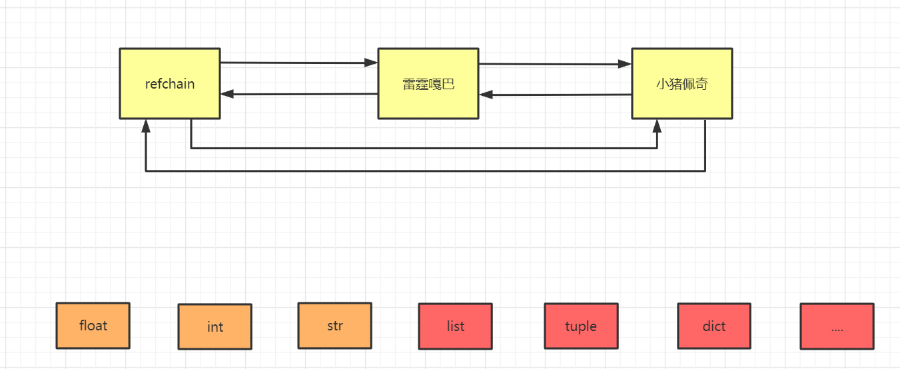
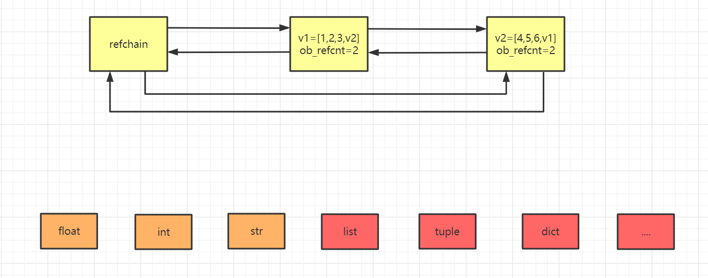
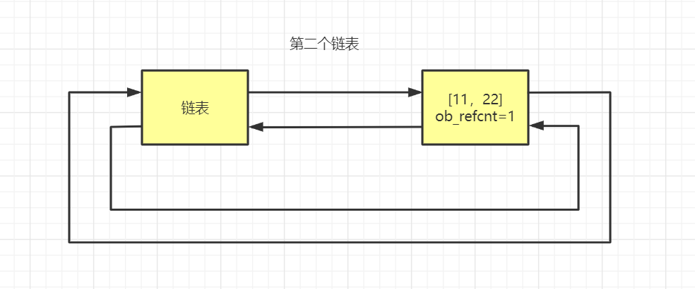
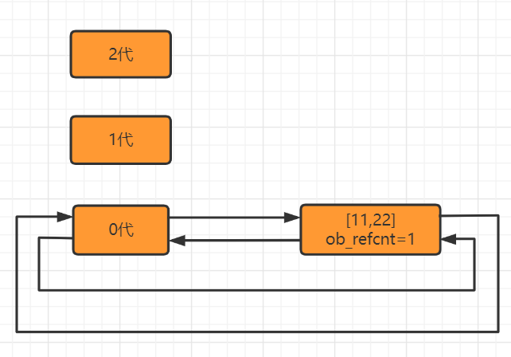
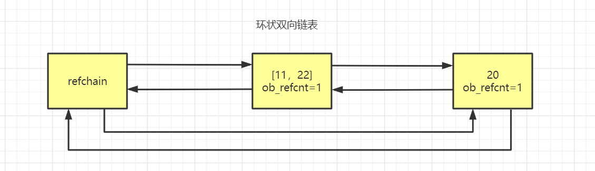

# 垃圾回收机制

如果将应用程序比作人的身体：所有你所写的那些优雅的代码，业务逻辑，算法，应该就是大脑。垃圾回收就是应用程序就是相当于人体的腰子，过滤血液中的杂质垃圾，没有腰子，人就会得尿毒症，垃圾回收器为你的应该程序提供内存和对象。如果垃圾回收器停止工作或运行迟缓，像尿毒症，你的应用程序效率也会下降，直至最终崩溃坏死。

在 C/C++ 中采用**用户自己管理维护内存**的方式。自己管理内存极其自由，可以任意申请内存，但也为大量内存泄露、悬空指针等 bug 埋下隐患。

因此，现在的很多高级语言(Python、Java、C#、Golang)等，都底层封装实现了垃圾回收机制，不需要我们用户自己维护和管理。

# Python 垃圾回收机制

网上能够搜到大量的资料，但是所有的资料都在论述一个观点，就是**引用计数器为主，分代回收和标记清除为辅**。
- Python 的 GC 模块主要运用了“引用计数”（reference counting）来跟踪和回收垃圾。
- 在引用计数的基础上，还可以通过“标记-清除”（mark and sweep）解决容器对象可能产生的循环引用的问题，
- 并且通过“分代回收”（generation collection）以空间换取时间的方式来进一步提高垃圾回收的效率。

# 引用计数器

引用计数是 Python 管理内存的基础机制。每一个对象在 Python 中都有一个 `引用计数器`，用于跟踪有多少个引用指向该对象。当没有引用指向某个对象时，这个对象就不再需要，系统会自动回收其占用的内存。

## 工作原理

- 引用计数增加：
  - 对象被创建  
  - 对象被引用
  - 对象被作为参数，传到函数中
  - 对象作为一个元素，存储在容器中

```python
a = 14  # 对象被创建  
b = a   # 对象被引用 
func(a)   # 对象被作为参数,传到函数中
List = [a,"a","b",2]   # 对象作为一个元素，存储在容器中  
```

- 引用计数减少
  - 对象被显式销毁
  - 变量重新赋予新的对象
  - 对象离开它的作用域
  - 对象所在的容器被销毁，或从容器中删除对象。

```python
del a  # 删除 a 的引用，引用计数减为 1
del b  # 删除 b 的引用，引用计数减为 0，内存被释放
```

**示例**
```python

import sys
import gc

class MyObject:
    def __init__(self, name):
        self.name = name
        print(f"[+] 对象 {self.name} 被创建")

    def __del__(self):
        print(f"[-] 对象 {self.name} 被销毁")

def main():
    print("\n=== 场景：基础引用计数 ===")
    a = MyObject("A")      # 初始引用计数为1
    # 当调用 sys.getrefcount(a) 时，引用计数会加 1
    print(sys.getrefcount(a))
    # 重复调用函数不会增加引用计数
    print(sys.getrefcount(a))
    # 对象作为一个元素，存储在容器中   
    List = [1, a]
    print(sys.getrefcount(a))

    b = a                  # 引用计数加1
    print(sys.getrefcount(a))

    del b                  # 引用计数减1
    print(sys.getrefcount(a))     # 应输出: 2

    del a                  # 引用计数归零，对象被销毁
    # print(sys.getrefcount(a))     UnboundLocalError: local variable 'a' referenced before assignment
```

## [扩展] 底层实现

在python程序中，创建的任何对象都会放在 **refchain 双向链表**中

例如：

```python
name = "小猪佩奇"   # 字符串对象
age = 18    # 整形对象
hobby = ["吸烟","喝酒","烫头"]   # 列表对象
```

这些对象都会放到多个**双向链表**当中，也就是帮忙维护了 python 中所有的对象。也就是说如果你得到了 **refchain**，也就得到了 python 程序中的所有对象。



## [扩展] 底层结构体源码

Python 解释器由 c 语言开发完成，py 中所有的操作最终都由底层的 c 语言来实现并完成，所以想要了解底层内存管理需要结合 python 源码来进行解释。

```c
#define PyObject_HEAD       PyObject ob_base ;
#define PyObject_VAR_HEAD       PyVarObject ob_base;

//宏定义，包含上一个、下一个，用于构造双向链表用。(放到refchain链表中时，要用到)
#define _PyObject_HEAD_EXTRA            \
    struct _object *_ob_next;           \
    struct _object *_ob_prev;

typedef struct _object {
    _PyObject_HEAD_EXTRA            //用于构造双向链表
    Py_ssize_t ob_refcnt;           //引用计数器
    struct _typeobject *ob_type;    //数据类型
} PyObject;

typedef struct {
    PyObject ob_base;       // PyObject对象
    Py_ssize_t ob_size; /* Number of items in variable part, 即:元素个数*/
} PyVarObject;
```

在 C 源码中如何体现每个对象中都有的相同的值：PyObject 结构体（4个值：_ob_next、_ob_prev、ob_refcnt、*ob_type）
9-13行 定义了一个结构体，第10行实际上就是6，7两行，用来存放前一个对象，和后一个对象的位置。

这个结构体可以存贮四个值（**这四个值是对象都具有的**）。

在 C 源码中如何体现由多个元素组成的对象：PyObject + ob_size(元素个数)  

15-18行又定义了一个结构体，第16行相当于代指了9-13行中的四个数据。

而17行又多了一个数据字段，叫做元素个数。

**以上源码是Python内存管理中的基石，其中包含了**：

- **PyObject**，此结构体中包含3个元素。
  - PyObject_HEAD_EXTRA，用于构造双向链表。
  - ob_refcnt，引用计数器。
  - *ob_type，数据类型。

- **PyVarObject**，次结构体中包含4个元素（ob_base 中包含3个元素）
  - ob_base，PyObject 结构体对象，即：包含 PyObject 结构体中的三个元素。
  - ob_size，内部元素个数。

## [扩展] 类型封装结构体

在我们了解了这两个结构体，现在我们来看看每一个数据类型都封装了哪些值：

**float 类型**

```c
typedef struct {
    PyObject_HEAD  # 这里相当于代表基础的4个值
    double ob_fval;
} PyFloatObject;

data = 3.14

内部会创建：
    _ob_next = refchain 中的上一个对象
    _ob_prev = refchain 中的后一个对象
    ob_refcnt = 1     引用个数
    ob_type= float    数据类型
    ob_fval = 3.14   
```

**int 类型**

道理都是相同的，第2行代指第二个重要的结构体，第三行是 int 类型特有的值，总结下来就是这个结构体中有几个值，那么创建这个类型对象的时候内部就会创建几个值。

```c
struct _longobject {
    PyObject_VAR_HEAD
    digit ob_digit[1];
};

// longobject.h

/* Long (arbitrary precision) integer object interface */
typedef struct _longobject PyLongObject; /* Revealed in longintrepr.h */

```

**list 类型**

```c
typedef struct {
    PyObject_VAR_HEAD

    /* Vector of pointers to list elements.  list[0] is ob_item[0], etc. */
    PyObject **ob_item;

    /* ob_item contains space for 'allocated' elements.  The number
     * currently in use is ob_size.
     * Invariants:
     *     0 <= ob_size <= allocated
     *     len(list) == ob_size
     *     ob_item == NULL implies ob_size == allocated == 0
     * list.sort() temporarily sets allocated to -1 to detect mutations.
     *
     * Items must normally not be NULL, except during construction when
     * the list is not yet visible outside the function that builds it.
     */
    Py_ssize_t allocated;
} PyListObject;
```

**tuple 类型**

```c
typedef struct {
    PyObject_VAR_HEAD
    PyObject *ob_item[1];

    /* ob_item contains space for 'ob_size' elements.
     * Items must normally not be NULL, except during construction when
     * the tuple is not yet visible outside the function that builds it.
     */
} PyTupleObject;
```

**dict 类型**

```c
typedef struct {
    PyObject_HEAD
    Py_ssize_t ma_used;
    PyDictKeysObject *ma_keys;
    PyObject **ma_values;
} PyDictObject;
```

## 引用计数的优缺点

- 优点：
  - 引用计数简单且高效，能够立即回收不再使用的对象。
  - 对象的销毁过程是确定性的，即当引用计数为 0 时，内存立刻被回收。
- 缺点：
  - 需要为对象分配引用计数空间，增大了内存消耗。
  - 当需要释放的对象比较大时，需要对引用的所有对象循环嵌套调用，可能耗时比较长。
  - 无法处理**循环引用**。当两个或多个对象互相引用时，它们的引用计数永远不会为 0，导致内存泄漏。

## 循环引用问题

一种编程语言利用引用计数器实现垃圾管理和回收，已经是比较完美的了，只要计数器为0就回收，不为0就不回收，即简单明了，又能实现垃圾管理。

但是如果真正这样想就太单纯了，因为，仅仅利用引用计数器实现垃圾管理和回收，就会存在一个BUG，就是循环引用问题。

循环引用是指多个对象之间互相引用，导致它们的引用计数无法归零，从而无法被回收。例如：

```python
v1 = [1,2,3]         # refchain中创建一个列表对象，由于v1=对象，所以列表引对象用计数器为1.
v2 = [4,5,6]         # refchain中再创建一个列表对象，因v2=对象，所以列表对象引用计数器为1.
v1.append(v2)        # 把v2追加到v1中，则v2对应的[4,5,6]对象的引用计数器加1，最终为2.
v2.append(v1)        # 把v1追加到v1中，则v1对应的[1,2,3]对象的引用计数器加1，最终为2.

del v1    # 引用计数器-1
del v2    # 引用计数器-1

# 最终v1,v2引用计数器都是1
```



两个引用计数器现在都是1，那么它们都不是垃圾所以都不会被回收，但如果是这样的话，我们的代码就会出现问题。

我们删除了v1和v2，那么就没有任何变量指向这两个列表，那么这两个列表之后程序运行的时候都无法再使用，但是这两个列表的引用计数器都不为0，所以不会被当成垃圾进行回收，所以这两个列表就会一直存在在我们的内存中，永远不会销毁，当这种代码越来越多时，我们的程序一直运行，内存就会一点一点被消耗，然后内存变满，满了之后就爆栈了。这时候如果重新启动程序或者电脑，这时候程序又会正常运行，其实这就是因为循环引用导致数据没有被及时的销毁导致了内存泄漏。

**所以大家要记得，因为引用计数器存在循环应用的问题，所以在 python 的垃圾管理机制中引入新的机制—标记清除和分代回收**

```python
import sys
import gc

class MyObject:
    def __init__(self, name):
        self.name = name
        print(f"[+] 对象 {self.name} 被创建")

    def __del__(self):
        print(f"[-] 对象 {self.name} 被销毁")

def main():
	print("\n=== 循环引用 ===")
    obj1 = MyObject("循环引用-1")
    obj2 = MyObject("循环引用-2")

    # 创建循环引用
    obj1.link = obj2
    obj2.link = obj1

    print(sys.getrefcount(obj1))  # 输出: 2（obj1被obj1和obj2.link引用）
    print(sys.getrefcount(obj2))  # 输出: 2（obj2被obj2和obj1.link引用）

    del obj1, obj2        # 删除外部引用，但循环引用仍存在
    print("删除外部引用后，循环引用对象未被回收")

    # 手动触发垃圾回收（解决循环引用）
    print("手动执行垃圾回收...")
    gc.collect()  # 输出两个对象的 __del__ 方法

```

# 标记清除

## 引入目的

为了解决循环引用问题，python 的底层不会单单只用引用计数器，引入了一个机制叫做标记清除。

## 实现原理

在 python 的底层中，再去维护一个链表，这个链表中专门放那些可能存在循环引用的对象。

那么哪些情况可能导致循环引用的情况发生？

容器：`list/dict/tuple/set` 甚至 `class`




第二个链表只存储**可能存在循环引用问题的对象**

维护两个链表的作用是，在 python 内部某种情况下，会去扫描可能存在循环引用的链表中的每个元素，在循环一个列表的元素时，由于内部还有子元素 ，如果存在循环引用(v1 = [1,2,3,v2]和v2 = [4,5,6,v1])，比如从v1的子元素中找到了v2，又从v2的子元素中找到了v1，那么就检查到循环引用，如果有循环引用，就让双方的引用计数器各自-1，如果是0则垃圾回收。

## 标记清除算法

【标记清除（Mark—Sweep）】算法是一种基于追踪回收（tracing GC）技术实现的垃圾回收算法。它分为两个阶段：第一阶段是标记阶段，GC 会把所有的『活动对象』打上标记，第二阶段是把那些没有标记的对象『非活动对象』进行回收。那么 GC 又是如何判断哪些是活动对象哪些是非活动对象的呢？

对象之间通过引用（指针）连在一起，构成一个有向图，**对象构成这个有向图的节点，而引用关系构成这个有向图的边**。从根对象（root object）出发，沿着有向边遍历对象，可达的（reachable）对象标记为活动对象，**不可达的对象就是要被清除的非活动对象**。根对象就是全局变量、调用栈、寄存器。


在上图中，我们把小黑点视为全局变量，也就是把它作为root object，从小黑点出发，对象1可直达，那么它将被标记，对象2、3可间接到达也会被标记，而4和5不可达，那么1、2、3就是活动对象，4和5是非活动对象会被 GC 回收。

1. 寻找跟对象（root object）的集合作为垃圾检测动作的起点，跟对象也就是一些全局引用和函数栈中的引用，这些引用所指向的对象是不可被删除的。

2. 从root object集合出发，沿着root object集合中的每一个引用，如果能够到达某个对象，则说明这个对象是可达的，那么就不会被删除，这个过程就是垃圾检测阶段。

3. 当检测阶段结束以后，所有的对象就分成可达和不可达两部分，所有的可达对象都进行保留，其它的不可达对象所占用的内存将会被回收，这就是垃圾回收阶段。（底层采用的是**链表**将这些集合的对象连接在一起）。

# 分代回收

## 引入目的

- 什么时候扫描去检测循环引用？
- **标记和清除的过程效率不高**。清除非活动的对象前它必须顺序扫描整个堆内存，哪怕只剩下小部分活动对象也要扫描所有对象。
  为了解决上述的问题，python又引入了分代回收。

## 实现原理

将第二个链表（可能存在循环引用的链表），维护成3个环状双向的链表：

- `G0`：对象刚创建时
- `G1`：经过一轮 `GC` 扫描存活下来的对象
- `G2`：经过多轮 `GC` 扫描存活下来的对象






## 触发 GC 时机

当某世代中分配的对象数量与被释放的对象之差达到某个阈值的时，将触发对该代的扫描。每次 `GC` 都会将存活对象移至下一代。

- 当 `G0` 对象超过 700 触发 `GC`
- 当 `G0` 触发 `GC` 超过 10 次，`G1` 触发 `GC`
- 当 `G1` 触发 `GC` 超过 10 次，`G2` 触发 `GC`

```python
import gc

threshold = gc.get_threshold()
print("各世代的阈值:", threshold)

# 修改各代阈值
# gc.set_threshold(threshold0, threshold1, threshold2) 
```

**扩展**

```c
// 分代的C源码
#define NUM_GENERATIONS 3
struct gc_generation generations[NUM_GENERATIONS] = {
    /* PyGC_Head,                                    threshold,    count */
    (uintptr_t)_GEN_HEAD(0), (uintptr_t)_GEN_HEAD(0)},   700,        0}, // 0代
    (uintptr_t)_GEN_HEAD(1), (uintptr_t)_GEN_HEAD(1)},   10,         0}, // 1代
    (uintptr_t)_GEN_HEAD(2), (uintptr_t)_GEN_HEAD(2)},   10,         0}, // 2代
};
```

## 弱代假说

为什么要按一定要求进行分代扫描？

这种算法的根源来自于**弱代假说**

这个假说由两个观点构成：**首先是年轻的对象通常死得也快，而老对象则很有可能存活更长的时间。**

假定现在我用 Python 创建一个新对象 n1 = "ABC"

根据假说，我的代码很可能仅仅会使用 ABC 很短的时间。这个对象也许仅仅只是一个方法中的中间结果，并且随着方法的返回这个对象就将变成垃圾了。大部分的新对象都是如此般地很快变成垃圾。然而，偶尔程序会创建一些很重要的，存活时间比较长的对象，例如 web 应用中的 session 变量或是配置项。

频繁的处理零代链表中的新对象，可以将让 Python 的**垃圾收集器把时间花在更有意义的地方**：它处理那些很快就可能变成垃圾的新对象。同时只在很少的时候，当满足一定的条件，收集器才回去处理那些老变量。

# 总结

将上面三个点学习之后，基本上应付面试没有太大问题了。

在 python 中维护了 refchain 的双向环状链表，这个链表中存储创建的所有对象，而每种类型的对象中，都有一个 ob_refcnt 引用计数器的值，它维护者引用的个数+1，-1，最后当引用计数器变为0时，则进行垃圾回收（对象销毁、refchain 中移除）。

但是，在python中对于那些可以有多个元素组成的对象，可能会存在循环引用的问题，并且为了解决这个问题，python又引入了标记清除和分代回收，在其内部维护了4个链表，分别是：

* refchain
* 2代，10次
* 1代，10次
* 0代，700个

在源码内部，当达到各自的条件阈值时，就会触发扫描链表进行标记清除的动作（如果有循环引用，引用计数器就各自-1）

到这里我们只需要把这些给面试官说完就可以了。

————————————————

**同时，为了提高内存的分配效率，Python 还引入了缓存机制**

# [扩展] Python缓存机制

## 内存池

在 Python 中为了避免重复创建和销毁一些常见的对象，引入了内存池的概念

```python
v1 = 7
v2 = 9
v3 = 9

# 按理说在python中会创建3个对象，都加入refchain中。
```

然而 python 在启动解释器时，python 认为-5、-4、….. 、256，bool、一定规则的字符串，这些值都是常用的值，所以就会在内存中帮你先把这些值先创建好，接下来进行验证：

```python
# 启动解释器时，python内部帮我们创建-5、-4、...255、256的整数和一定规则的字符串
v1 = 9  # 内部不会开辟内存，直接去池中获取
v2 = 9  # 同上，都是去数据池里直接拿9，所以v1和v2指向的内存地址是一样的
print(id(v1),id(v2))

v3 = 256  # 内部不会开辟内存，直接去池中获取
v4 = 256  # 同上，都是去数据池里直接拿256，所以v3和v4指向的内存地址是一样的
print(id(v3),id(4))

v5 = 257
v6 = 257
print(id(v5),id(v6))
```

### 代码块缓存机制

在大多数情况下，同一个代码块(一个模块、一个函数、一个类、一个文件等都可以理解为一个代码块)中，也会存在一定的缓存机制

Python在执行同一个代码块的初始化对象的命令时，会检查是否其值是否已经存在，如果存在，会将其重用，即将两个变量指向同一个对象。换句话说：执行同一个代码块时，遇到初始化对象的命令时，他会将初始化的这个变量与值存储在一个字典中，在遇到新的变量时，会先在字典中查询记录，如果有同样的记录那么它会重复使用这个字典中的之前的这个值。所以在用命令模式执行时（同一个代码块）会把i1、i2两个变量指向同一个对象，满足缓存机制则他们在内存中只存在一个，即：id相同。

* 适用对象： int（float），str，bool。
* 对象的具体细则：（了解）

- int(float)：**任何数字**在同一代码块下都会复用。

*  bool：True和False在字典中会以**1，0**方式存在，并且复用。
*  str：**几乎所有的字符串**都会符合字符串驻留机制。

```python
# 同一个代码块内的缓存机制————任何数字在同一代码块下都会复用
i1 = 1000
i2 = 1000
print(id(i1))
print(id(i2))

# 同一个代码块内的缓存机制————几乎所有的字符串都会符合缓存机制
s1 = 'hfdjka6757fdslslgaj@!#fkdjlsafjdskl;fjds中国'
s2 = 'hfdjka6757fdslslgaj@!#fkdjlsafjdskl;fjds中国'
print(id(s1))
print(id(s2))

# 同一个代码块内的缓存机制————非数字、str、bool类型数据，指向的内存地址一定不同
t1 = (1,2,3)
t2 = (1,2,3)
l1 = [1,2,3]
l2 = [1,2,3]
print(id(t1))
print(id(t2))
print(id(l1))
print(id(l2))
```

### 小对象的内存管理

- **小对象**：Python 将小对象定义为大小小于 512 字节的对象。对于小对象，Python 会从专门的内存池中分配内存，而不是每次都向操作系统申请内存。这减少了频繁的系统调用，从而提高了性能。
- **内存池**：Python 维护一个内存池，将小对象的内存分配和释放集中管理。通过这种方式，Python 避免了频繁的内存碎片化问题。

### 大对象的内存管理

- **大对象**：对于大小超过 512 字节的对象，Python 直接向操作系统申请内存。这些对象的分配和释放不经过内存池。

## free_list

当一个对象的引用计数器为0的时候，按理说应该回收，但是在python内部为了优化，不会去回收，而是将对象添加到free_list链表中当作缓存。以后再去创建对象时就不再重新开辟内存，而是直接使用free_list。

```python
v1 = 3.14  # 创建float型对象，加入refchain，并且引用计数器的值为1
del v1   #refchain中移除，按理说应该销毁，但是python会将对象添加到free_list中。

v2 = 3.14  # 就不会重新开辟内存，去free_list中获取对象，对象内部数据初始化，再放到refchain中。
```

但是free_list也是有容量的，不是无限收纳, 假设默认数量为80，只有当free_list满的时候，才会直接去销毁。
代表性的有float/list/tuple/dict，这些数据类型都是以free_list方式来进行回收的。

**总结一下，就是引用计数器为0的时候，有的是直接销毁，而有些需要先加入缓存当中的。**

# [扩展] C 源码

`arena`是 CPython 的内存管理结构之一。代码在`Python/pyarena.c`中其中包含了 C 的内存分配和解除分配的方法。

[https://github.com/python/cpython/blob/master/Python/pyarena.c](https://github.com/python/cpython/blob/master/Python/pyarena.c)

`Modules/gcmodule.c`，该文件包含垃圾收集器算法的实现。

[https://github.com/python/cpython/blob/master/Modules/gcmodule.c](https://github.com/python/cpython/blob/master/Modules/gcmodule.c) 
