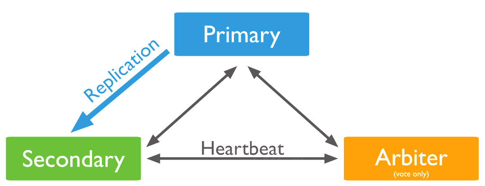

# NoSQL 简史

NoSQL一词最早出现于1998年，是Carlo Strozzi开发的一个轻量、开源、不提供SQL功能的关系数据库。

2009年，Last.fm的Johan Oskarsson发起了一次关于分布式开源数据库的讨论[2]，来自Rackspace的Eric Evans再次提出了NoSQL的概念，这时的NoSQL主要指非关系型、分布式、不提供ACID的数据库设计模式。

2009年在亚特兰大举行的"no:sql(east)“讨论会是一个里程碑，其口号是"select fun, profit from real_world where relational=false;”。因此，对NoSQL最普遍的解释是"非关联型的"，强调Key-Value Stores和文档数据库的优点，而不是单纯的反对RDBMS。

## 什么是NoSQL

NoSQL，指的是非关系型的数据库。NoSQL有时也称作Not Only SQL的缩写，是对不同于传统的关系型数据库的数据库管理系统的统称。

NoSQL用于超大规模数据的存储。（例如谷歌或Facebook每天为他们的用户收集万亿比特的数据）。这些类型的数据存储不需要固定的模式，无需多余操作就可以横向扩展。

## 为什么使用NoSQL

今天我们可以通过第三方平台（如：Google,Facebook等）可以很容易的访问和抓取数据。用户的个人信息，社交网络，地理位置，用户生成的数据和用户操作日志已经成倍的增加。我们如果要对这些用户数据进行挖掘，那SQL数据库已经不适合这些应用了, NoSQL 数据库的发展却能很好的处理这些大的数据。

## NoSQL的优点/缺点

* 优点:
  * 高可扩展性
  * 分布式计算
  * 低成本
  * 架构的灵活性，半结构化数据
  * 没有复杂的关系
* 缺点:
  * 没有标准化
  * 有限的查询功能（到目前为止）
  * 最终一致是不直观的程序

## RDBMS vs NoSQL

* NoSQL
  * 代表着不仅仅是SQL
  * 没有声明性查询语言
  * 没有预定义的模式
  * 键-值对存储，列存储，文档存储，图形数据库
  * 最终一致性，而非ACID属性
  * 非结构化和不可预知的数据
  * CAP定理
  * 高性能，高可用性和可伸缩性
* RDBMS
  * 高度组织化结构化数据
  * 结构化查询语言(SQL) (SQL)
  * 数据和关系都存储在单独的表中。
  * 数据操纵语言，数据定义语言
  * 严格的一致性
  * 基础事务

## 常见的数据库管理系统

[DB-Engines](https://db-engines.com/en/ranking)排行榜,每月更新一次

## NoSQL数据库四大家族

* 键值(Key-Value)存储数据库
  * 特点
    * 键值数据库就想传统语言中使用的哈希表，通过key添加、查询或者删除数据
  * 优点
    * 查询速度更快
  * 缺点
    * 数据无结构化，通常只被当做字符串或者二进制数据存储
  * 应用场景
    * 内容缓存、用户信息比如会话、配置信息、购物车等等，主要用于处理大量数据的高访问负债
  * NoSQL代表
    * Redis、Memcached...
* 文档型数据库
  * 特点
    * 文档数据库将数据以文档的形式储存，类似JSON，是一系列数据项的集合。每个数据项都有一个名称与对应的值，值既可以是简单的数据类型，如字符串、数字和日期等；也可以是复杂的类型，如有序列表和关联对象。
  * 优点
    * 数据结构要求不严格，表结构可变，不需要像关系型数据库一样需要预先定义表结构
  * 应用场景
    * 日志、web应用等
  * NoSQL代表
    * MongoDB、CouchDB...
* 列数据库
  * 特点
    * 列存储数据库将数据存储在列族中，将多个列集合成一个列族，键仍然存在，但是他们的特点是指向多个列。举个例子，如果我们有一个Person类，我们通常会一起查询他们的姓名和年龄而不是薪资。这种情况下，姓名和年龄就会被放入一个列族中，而薪资则在另一个列族中
  * 优点
    * 列存储查找速度快，可扩展性强，更容容易进行分布式扩展，适用于分布式的文件系统，应对分布式存储的海量数据
  * 缺点
    * 查询性能不高，缺乏统一的查询语法
  * 应用场景
    * 日志、分布式文件系统(对象存储)、推荐画像、时空数据、消息/订单等等。
  * NoSQL代表
    * Cassandra、HBase....
* 图形(Graph)数据库
  * 特点
    * 图形数据库允许我们将数据以图的方式存储
  * 优点
    * 图形相关算法，比如最短路径寻址，N度关系查找等
  * 缺点
    * 很多时候需要对整个图做计算才能提出需求的信息，分布式的群集方案不好做，处理超级节点乏力，没有分片存储机制，国内社区不活跃
  * 应用场景
    * 社交网络，推荐系统等，专注于构建关系图谱
  * NoSQL代表
    * Neo4j、Infinite Graph...

# MongDB简介


Mongo并非芒果(Mango)的意思，而是源于Humongous(巨大的，庞大的)一词

MongoDB是一个基于分布式文件存储的NoSQL数据库，由C++语言编写。旨在为WEB应用提供可扩展的高性能数据存储解决方案。

MongoDB是一个介于关系型数据库和非关系型数据库之间的产品，是非关系型数据库当中功能最丰富，最像关系数据库的。


MongoDB使用了BSON(Binary JSON)对象来存储，与JSON格式的键值对(key/value)类似，字段值可以包含其他文档，数组及文档数组。支持的查询语言非常强大，其语法有点类似于面向对象的查询语言，几乎可以实现类似关系型数据库单表查询的绝大部分功能，而且还支持对数据建立索引。

# MongoDB 历史

2007 年，Dwight Merriman，Eliot Horowitz 和 Kevin Ryan 成立 10gen 软件公司，在成立之初，这家的公司目标是进军云计算行业，为企业提供云计算服务。在开发云计算产品时，他们准备开发一个类似于数据库的组件，为云计算产品提供存储服务。当时是关系型数据库一统天下的时间，他们觉得传统的关系型数据库无法满足他们的要求，他们想要一款程序员不懂SQL语言也可以使用的数据存储产品。

在网络上找了一圈，不管是开源的还是闭源的产品，都没找到让他们满意的东西，既然找不到，那就自己开发吧，反正他们也有那个技术实力，10gen 的创始人都来自谷歌，他们创建的网络广告公司 DoubleClick 被谷歌收购了，这是他们的第二次创业。

10gen 公司不使用关系型数据库是有一定原因的，当时他们还在 DoubleClick 公司的时候，就吃过关系型数据库的苦头。DoubleClick 是一家网络广告公司，服务美国众多的知名公司，该公司每秒提供 40 万个广告，但在可伸缩性和敏捷性方面经常遇到困难，因此他们不得不经常自己开发和使用许多自定义数据存储来解决现有关系型数据库的不足，这让他们很是苦恼。

因此他们决定开发一款数据库产品解决他们在 DoubleClick 时遇到的问题，并为自己的云计算产品提供存储服务。

* MongoDB 最初于 2007 年开发，由位于纽约的一个名为 10gen 的组织开发，现在被称为 MongoDB Inc.
* 2009 年，经过将近 2 年的开发，10gen 开发出了 MongoDB 的雏形并将它开源以及正式命名为 MongoDB，同时成立开源社区，通过社区运营 MongoDB。
* 2009 年 02 月 MongoDB 1.0 发布，提供了大部分基本的查询功能。
* 2009 年 12 月 MongoDB 1.2 发布，引入了 map-reduce，支持大规模数据处理。
* MongoDB 的第一个真正产品是从 2010 年 03 月发布的 MongoDB 1.4 版本开始的。
* 2010 年 8 月 MongoDB 1.6 发布，引入了一些主要特性，比如用于水平伸缩的分片、具备自动故障转移能力的副本集以及对 IPv6 的支持。
* 2012 年 05 月 23 日，MongoDB 2.1 发布。该版本采用全新架构，包含诸多增强。
* 2012 年 06 月 06 日，MongoDB 2.0.6 发布，分布式文档数据库。
* 2012 年 8 月 MongoDB 2.2 发布，引入了聚合管道，可以将多个数据处理步骤组合成一个操作链。
* 2013 年 MongoDB 推出第一款商业版本 MongoDB Enterprise Advanced。
* 2013 年 04 月 23 日，MongoDB 2.4.3 发布，此版本包括了一些性能优化，功能增强以及 bug 修复。
* 2013 年 08 月 20 日，MongoDB 2.4.6 发布，仍然是以性能优化，功能增强和 bug 修复为主。
* 2015 年 03 月 MongoDB 3.0 发布，包含了新的 WiredTiger 存储引擎、可插拔存储引擎 API、增加了 50 个副本集限制和安全改进。同年晚些时候又发布了 3.2 版本，支持文档验证、部分索引和一些主要的聚合增强。
* 2016 年 MongoDB 推出了 Atlas 服务，MongoDB Atlas，与公有云服务厂商（谷歌、微软Azure）合作。这一年，MongoDB 爆出了非常严重的安全门事件，黑客通过 MongoDB 的默认监听地址 0.0.0.0 删除数据，并且通过此漏洞进行勒索，支付 0.2 到 0.5 的比特币就可以恢复数据。
* 2017 年 10 月 MongoDB 公司成立 10 周年之际，顺利通过 IPO 在纽交所上市。开盘 24 美元，公司估值达到 16 亿美元，并获得 1.92 美元的筹资。
* 2017 年 11 月 MongoDB 3.6 发布，为多集合连接查询、变更流和使用 JSON 模式进行文档验证提供了更好的支持。
* 2018 年 06 月 MongoDB 4.0 发布，这一版本的发布获得了广泛的关注，提供了跨文档事务处理能力。这是一个重要的里程碑，MongoDB 已经为高数据完整性需求做好了准备。
* 2019 年 03 月 18 日，Forrester 授予 MongoDB NoSQL 领导者称号。
* 2019 年 10 月 MongoDB 4.2 发布，开始支持分布式事务。
* 截至 2020 年 10 月，MongoDB 的社区版版本是 4.4.1，扩展性和性能增强，降低复制延迟，可用性和容错性增强，查询能力和易用性增强，MongoDB 云平台的功能更新。MongoDB 逐渐的从一个专注于数据库服务的厂商，转变为提供数据平台服务的厂商。

截至 2020 年，MongoDB 的全球下载量达到了 1.1 亿次。MongoDB 公司目前有 2000 多名员工，有超过 18000 名付费客户，其中有很多客户同时使用 MongoDB Atlas 和 MongoDB 企业版。大多数大公司在内部的一些场景中仍然使用的是社区版。MongoDB 社区版仍然是开源的，除了一些关键特性外，它与 MongoDB 企业版差不多。

## MongoDB 支持语言


## MongoDB 与关系型数据库术语对比


| SQL 术语概念          | MongoDB 术语概念                            |
| :-------------------- | :------------------------------------------ |
| database（数据库）    | database（数据库）                          |
| table（表）           | collection（集合）                          |
| row（行）             | document or BSON document（文档）           |
| column（列）          | field（字段）                               |
| index（索引）         | index（索引）                               |
| table joins（表连接） | 表连接，MongoDB不支持，但是可以文档嵌入文档 |
| primary key(主键)     | primary key(主键)                           |

## 数据类型

| 数据类型  | 描述                                                  | 举例                |
| :-------- | :---------------------------------------------------- | :------------------ |
| 字符串    | utf8字符串都可以表示为字符串类型的数据                | {"x":"foobar"}      |
| 对象id    | 对象id是文档的12字节的唯一ID                          | {"X":Objectid()}    |
| 布尔值    | 真或者假：true或者false                               | {"x":true}          |
| 数组      | 值的集合或者列表都可以表示成数组                      | {"x":["a","b","c"]} |
| 整数      | (Int32 Int64 你们就知道有个Int就行了,一般我们用Int32) | {"age":18}          |
| null      | 表示空值或者未定义的对象                              | {"x":null}          |
| undefined | 文档中也可以使用未定义类型                            | {"x":undefined}<br> |

# 部署MongoDB

## 下载二进制包

* 下载地址：[https://www.mongodb.com/try/download/community](https://www.mongodb.com/try/download/community)


## 安装步骤

* 下载安装包并且解压

```shell
mkdir -p /usr/local/mongdb
wget https://fastdl.mongodb.org/linux/mongodb-linux-x86_64-rhel70-4.4.6.tgz
tar xzvf mongodb-linux-x86_64-rhel70-4.4.6.tgz -C /usr/local/
cd /usr/local/
mv mongodb-linux-x86_64-rhel70-4.4.6/ mongodb
```

* 创建用于存放数据和日志的文件夹，并修改其权限增加读写权限

```shell
# 创建存放数据的目录
mkdir -p /usr/local/mongodb/data/db
# 创建存放日志的目录
mkdir -p /usr/local/mongodb/logs
# 创建日志记录文件
touch /usr/local/mongodb/logs/mongodb.log
```

## 启动MongoDB

* MongoDB 的默认启动方式为前台启动。所谓的前台启动就是 MongoDB 启动进程后会占用当前的终端窗口

```shell
cd /usr/local/mongodb/
bin/mongod \
--dbpath /usr/local/mongodb/data/db/ \
--logpath /usr/local/mongodb/logs/mongodb.log \
--logappend \
--port 27017 \
--bind_ip 0.0.0.0
```

> --dbpath：指定数据文件存放目录
> --logpath：指定日志文件，注意是指定文件不是目录
> --logappend：使用追加的方式记录日志
> --port：指定端口，默认为 27017
> --bind_ip：绑定服务 IP，若绑定 127.0.0.1，则只能本机访问，默认为本机地址

* 所谓的后台启动就是以守护进程的方式启动 MongoDB。命令中添加 --fork 即可

```shell
# 后台启动
bin/mongod \
--dbpath /usr/local/mongodb/data/db/ \
--logpath /usr/local/mongodb/logs/mongodb.log \
--logappend \
--port 27017 \
--bind_ip 0.0.0.0 \
--fork
```

通过命令启动的方式并不适合管理，毕竟每次输入命令都需要考虑各参数的配置。我们可以通过配置文件来配置启动参数，然后通过指定配置文件的方式启动服务，这样在管理 MongoDB 上就比较方便了。

* 在 bin 目录下增加一个 mongodb.conf 配置文件

```shell
vim /usr/local/mongodb/bin/mongodb.conf 
# 数据文件存放目录
dbpath = /usr/local/mongodb/data/db
# 日志文件存放目录
logpath = /usr/local/mongodb/logs/mongodb.log
# 以追加的方式记录日志
logappend = true
# 端口默认为 27017
port = 27017
# 对访问 IP 地址不做限制，默认为本机地址
bind_ip = 0.0.0.0
# 以守护进程的方式启用，即在后台运行
fork = true
bin/mongod -f /usr/local/mongodb/bin/mongodb.conf
```

* 配置systemd服务

```shell
vim /usr/lib/systemd/system/mongodb.service
[Unit]
Description=mongodb
After=network.target remote-fs.target nss-lookup.target

[Service]
Type=forking
ExecStart=/usr/local/mongodb/bin/mongod --config /usr/local/mongodb/bin/mongodb.conf
ExecReload=/bin/kill -s HUP $MAINPID
ExecStop=/usr/local/mongodb/bin/mongod --shutdown --config /usr/local/mongodb/bin/mongodb.conf
PrivateTmp=true

[Install]
WantedBy=multi-user.target

chmod 754 /usr/lib/systemd/system/mongodb.service
```

* 启动

```shell
systemctl daemon-reload
systemctl restart mongodb
```

## 客户端配置

* 添加环境变量

```shell
vim /etc/profile
export PATH=/usr/local/mongodb/bin/:$PATH

source /etc/profile
mongo
```

* 客户端常用命令

```shell
# 查看帮助
> help
        db.help()                    help on db methods
        db.mycoll.help()             help on collection methods
        sh.help()                    sharding helpers
        rs.help()                    replica set helpers
        help admin                   administrative help
        help connect                 connecting to a db help
        help keys                    key shortcuts
        help misc                    misc things to know
        help mr                      mapreduce
        show dbs                     show database names
        show collections             show collections in current database
        show users                   show users in current database
        show profile                 show most recent system.profile entries with time >= 1ms
        show logs                    show the accessible logger names
        show log [name]              prints out the last segment of log in memory, 'global' is default
        use <db_name>                set current database
        db.mycoll.find()             list objects in collection mycoll
        db.mycoll.find( { a : 1 } )  list objects in mycoll where a == 1
        it                           result of the last line evaluated; use to further iterate
        DBQuery.shellBatchSize = x   set default number of items to display on shell
        exit                         quit the mongo shell
# 查看版本信息
> db.version()
4.4.6
# 查看数据库
> show dbs;
admin   0.000GB
config  0.000GB
local   0.000GB
```

## 关闭MongoDB

### 前台启动

`Ctrl+c`

### 后台启动

* 使用 --shutdown 参数即可关闭

```shell
# 命令启动方式的关闭
bin/mongod --dbpath /usr/local/mongodb/data/db/ --logpath /usr/local/mongodb/logs/mongodb.log --logappend --port 27017 --bind_ip 0.0.0.0 --fork --shutdown
# 配置文件启动方式的关闭
bin/mongod -f bin/mongodb.conf --shutdown
```

### kill 命令关闭

* 通过 kill -9 的方式强制关闭进程，一般这种方式都不怎么推荐使用

```shell
# 查看 mongodb 运行的进程信息
ps -ef | grep mongodb
# kill -9 强制关闭
kill -9 pid
```

### MongoDB 函数关闭

* 连接到 MongoDB 服务后，切换到 admin 数据库，并使用相关函数关闭服务

```shell
# 连接 mongodb
bin/mongo
# 切换 admin 数据库
use admin
# 执行以下函数(2选1)即可关闭服务
db.shutdownServer()
db.runCommand(“shutdown”)
```

# 数据库操作

## 案例需求

存档文章评论的数据库放到MongoDB中，数据结构参考如下

数据库：articledb

| 字段名称       | 字段含义       | 字段类型         | 备注                      |
| :------------- | :------------- | :--------------- | :------------------------ |
| _id            | ID             | Objectid或string | 主键                      |
| articleid      | 文章ID         | string           |                           |
| content        | 评论内容       | string           |                           |
| userid         | 评论人id       | string           |                           |
| nickname       | 评论人昵称     | string           |                           |
| createdatetime | 评论的日期时间 | date             |                           |
| likenum        | 点赞数         | int              |                           |
| replynum       | 回复数         | int              |                           |
| state          | 状态           | string           | 0：不可见 1：可见         |
| parentid       | 上级id         | string           | 如果为0表示为文章顶级评论 |

## 选择和创建数据库

选择和创建数据库的语法格式

```sql
use 数据库名称
```

如果数据库不存在则自动创建，例如，以下语句创建`spitdb`数据库

```sql
use articledb
```

查看有权限查看的所有数据库命令

```sql
show dbs
或
show databases
```

>注意：在MongoDB中，集合只有在内容插入后才会创建！就是说，创建集合(数据表)后要再插入一个文档(记录)，集合才会真正创建

查看当前正在使用的数据库命令

```sql
db
```

MongoDB中默认的数据库为test，如果你没有选择数据库，集合将存放在test数据库中。
数据库名必须满足以下条件

1. 不能是空字符串（"")。
2. 不得含有' '（空格)、.、$、/、\和\0 (空字符)。
3. 应全部小写。
4. 最多64字节。

有一些数据库名是保留的，可以直接访问这些有特殊作用的数据库

* admin：从权限的角度来看，这是'root'数据库。要是将一个用户添加到这个数据库，这个用户自动继承所有数据库的权限。一些特定的服务器端命令也只能从这个数据库运行，比如列出所有的数据库或者关闭服务器。
* local：这个数据永远不会被复制，可以用来存储限于本地单台服务器的任意集合
* config：当Mongo用于分片设置时，config数据库在内部使用，用于保存分片的相关信息

## 数据库的删除

MongoDB删除数据库的语法格式如下

```sql
db.dropDatabase()
# 主要用来删除已经持久化的数据库
```

## 集合操作

集合，类似于关系型数据库中的表

可以显式的创建，也可以隐式的创建

* 显式的创建(了解)

```sql
db.createCollection(name)
```

参数说明

* name：要创建的集合名称

例如：创建一个名为`mycollection`的普通集合

```sql
db.createCollection("mycollection")
```

查看当前库中的表，show tables命令

```sql
show collections
或
show tables
```

集合的命名规范：

1. 集合名不能是空字符串""。
2. 集合名不能含有\0字符（空字符)，这个字符表示集合名的结尾。
3. 集合名不能以"system."开头，这是为系统集合保留的前缀。
4. 用户创建的集合名字不能含有保留字符。有些驱动程序的确支持在集合名里面包含，这是因为某些系统生成的集合中包含该字符。除 非你要访问这种系统创建的集合，否则千万不要在名字里出现$。

* 集合的隐式创建
  * 当向一个集合中插入一个文档的时候，如果集合不存在，则会自动创建集合
  * 通常我们使用隐式创建文档即可

## 集合的删除

集合删除的语法格式如下

```sql
db.collection.drop()
或
db.集合.drop()
```

返回值

* 如果成功删除选定集合，则drop()方法返回true，否则返回false

例如：要删除mycollection集合

```sql
db.mycollection.drop()
```

## 文档基本CRUD

文档(document)的数据结构和JSON基本一样

所有存储在集合中的数据都是BSON格式

### 文档的插入

* 单个文档插入

使用insert()或save()方法向集合中插入文档，语法如下

```sql
db.collection.insert(
    <document or array of documents>,
{
      writeConcern: <document>,
      ordered: <boolean>
    }
)
```

* 参数
  * document
    * 要插入到集合中的文档或文档数组。(json格式)
  * writeConcern
    * 插入选择的性能与可靠性级别
  * ordered
    * 是否排序

```sql
db.comment.insert(
  {
    "articleid":"100000",
    "content":"今天我们来学习mongodb",
    "userid":"1001",
    "nickname":"Aaron",
    "createdatetime":new Date(),
    "likenum":NumberInt(10),
    "state":null
  }
)
```

* 提示
  * comment集合如果不存在，则会隐式创建
  * mongo中的数字，默认情况下是double类型，如果要存整数型，必须使用函数NumberInt
  * 插入当前日志使用new Date()
  * 插入的数据没有指定_id，会自动生成主键值
  * 如果某字段没值，可以复制为null，或不写该字段
* 执行成功后会出现如下成功提示

```sql
WriteResult({ "nInserted" : 1 })
```

* 批量插入

```shell
db.collection.insertMany(
  [ <document 1>, <document2>, ... ],
  {
    writeConcern: <document>,
    ordered: <boolean>
  }
)
```

* 参数
  * document
    * 要插入到集合中的文档或文档数组。(json格式)
  * writeConcern
    * 插入选择的性能与可靠性级别
  * ordered
    * 是否排序

```sql
db.comment.insertMany([
  {
    "_id":"1",
    "articleid":"100001",
    "content":"苍茫的天涯是我的爱",
    "userid":"1002",
    "nickname":"钢铁侠",
    "createdatetime":new Date(),
    "likenum":NumberInt(1000),
    "state":"1"
  },
  {
    "_id":"2",
    "articleid":"100002",
    "content":"绵绵的青山脚下花正开",
    "userid":"1003",
    "nickname":"绿巨人",
    "createdatetime":new Date(),
    "likenum":NumberInt(1000),
    "state":"1"
  },
  {
    "_id":"3",
    "articleid":"100003",
    "content":"什么样的节奏是最呀最摇摆",
    "userid":"1004",
    "nickname":"美国队长",
    "createdatetime":new Date(),
    "likenum":NumberInt(1000),
    "state":"1"
  },
  {
    "_id":"4",
    "articleid":"100004",
    "content":"什么样的歌声才是最开怀",
    "userid":"1005",
    "nickname":"雷神",
    "createdatetime":new Date(),
    "likenum":NumberInt(1000),
    "state":"1"
  }
])
```

* 插入成功之后可以看到

```sql
{ "acknowledged" : true, "insertedIds" : [ "1", "2", "3", "4" ] }
```

### 文档的基本查询

```sql
db.collection.find(<query>, [projection])
```

* 参数
  * query
    * 可选，使用查询运算符指定选择筛选器。若要返回集合中的所有文档，就不填
  * projection
    * 可选，指定要在与查询筛选器匹配的文档中返回的字段。若要返回匹配文档中的所有字段，就不填

```sql
db.comment.find()
# 查询所有
db.comment.find({})
# 查询所有
db.comment.find().pretty()
# 并且以JSON格式显示
```

这里你会发现每条文档会有一个叫_id的字段，这个相当于我们原来关系型数据库中表的主键，当你在插入文档的时候没有指定该字段，Mongodb就会自动创建，其类型是ObjectID类型
如果我们在插入文档记录时指定该字段也可以，器类型可以是ObjectID类型，也可以是MongoDB支持的任意类型。

```sql
db.comment.find({userid:'1003'}).pretty()
# 查询指定字段
db.comment.findOne({'state':'1'})
# 只显示查询到的第一个记录
```

* 投影查询
  * 如果要查询结果返回部分字段，则需要使用投影查询(不显示所有字段，只显示指定的字段)

```sql
db.comment.find({"userid":"1002"},{"likenum":1,nickname:1}).pretty()
# 只显示likenum和nickname字段，1是显示
db.comment.find({"userid":"1002"},{"likenum":0}).pretty()
# 显示的时候隐藏likenum字段，0是不显示
db.comment.find({},{"likenum":1,nickname:1}).pretty()
# 查询所有字段，但是只显示likenum和nickname字段
```

* 如果某条数据插入失败，将会终止插入，但已经插入成功的数据不会回滚掉
* 因为批量插入由于数据较多容易出现失败，因此，可以使用try catch进行异常捕捉处理，测试的时候可以不处理

```sql
try {
  db.comment.insertMany([
    {
      "_id":"1",
      "articleid":"100001",
      "content":"苍茫的天涯是我的爱",
      "userid":"1002",
      "nickname":"钢铁侠",
      "createdatetime":new Date(),
      "likenum":NumberInt(1000),
      "state":"1"
    },
    {
      "_id":"2",
      "articleid":"100002",
      "content":"绵绵的青山脚下花正开",
      "userid":"1003",
      "nickname":"绿巨人",
      "createdatetime":new Date(),
      "likenum":NumberInt(1000),
      "state":"1"
    },
    {
      "_id":"3",
      "articleid":"100003",
      "content":"什么样的节奏是最呀最摇摆",
      "userid":"1004",
      "nickname":"美国队长",
      "createdatetime":new Date(),
      "likenum":NumberInt(1000),
      "state":"1"
    },
    {
      "_id":"4",
      "articleid":"100004",
      "content":"什么样的歌声才是最开怀",
      "userid":"1005",
      "nickname":"雷神",
      "createdatetime":new Date(),
      "likenum":NumberInt(1000),
      "state":"1"
    }
  ])
}catch(e){
  print(e);
}
```

### 文档的更新

```sql
db.collection.update(query, update, options)
db.collection.update(
  <query>,
  <update>,
  {
    upsert: <boolean>,
    multi: <boolean>,
    writeConcern: <document>,
    collation: <document>,
    arrayFilters: [ <filterdocument1>, ... ],
    hint: <document|string>
  }
)
```

* 参数
  * query
    * 更新的选择条件
  * update
    * 要应用的修改
  * upsert
    * 可选，如果设置为true,则在没有与查询条件匹配的文档时创建新文档，默认为false，在没有与查询条件匹配的情况下不会插入新文档
  * multi
    * 可选，如果设置为true,则更新符合查询条件的多个文档，如果设置为false，则更新一个文档，默认值为false
  * writeConcern
    * 可选，表示写问题的文档，抛出异常的级别
  * collation
    * 可选，指定要用于操作的校对规则例如字母大小写和重音标记规则
  * arrayFilters
  * hint
    * 可选，指定用于支持查询索引的文档或字符串
* 覆盖修改

```sql
db.comment.update({_id:"1"},{likenum:NumberInt(1001)})
# 修改_id为1的记录，点赞量为1001
db.comment.find({_id:"1"})
# 查看这条记录，发现update是覆盖修改
```

* 局部修改

```sql
db.comment.update({_id:"2"},{$set:{likenum:NumberInt(889)}})
# 修改_id为2的技能，点赞量为889
db.comment.find({_id:"2"}).pretty()
# 查看这条记录,发现修改成功
```

* 批量修改
  * 修改所有点赞量为1000的昵称为灭霸

```sql
db.comment.update({likenum:NumberInt(1000)},{$set:{nickname:"灭霸"}})
# 默认值修改第一条数据
db.comment.find().pretty()
db.comment.update({likenum:NumberInt(1000)},{$set:{nickname:"灭霸"}},{multi:true})
# 修改所有符合条件的记录
db.comment.find().pretty()
```

* 列值增长的修改
  * 如果我们想实现对某列值在原有值的基础上进行增加或减少，可以使用$inc运算符来实现

```sql
db.comment.update({_id:"3"},{$inc:{likenum:NumberInt(1)}})
db.comment.update({_id:"3"},{$inc:{likenum:NumberInt(-1)}})
# 把_id为3的点赞数加一
db.comment.find({_id:"3"}).pretty()
```

### 删除文档

```sql
db.集合名称.remove(条件)
```

* 删除文档示例

```sql
db.comment.remove({})
# 删除comment集合下的所有数据
db.comment.remove({_id:"1"})
# 删除_id=1的记录
```

## 文档的分页查询

### 统计查询

```sql
db.collection.count(query,options)
```

* 参数
  * query
    * 查询选择条件
  * options
    * 可选，用于修改计数的额外选项

```sql
db.comment.count()
# 统计comment集合的所有的记录数
db.comment.count({userid:"1003"})
# 统计userid为1003的记录条数
```

### 分页列表查询

可以使用limit()方法来读取指定数量的数据，使用skip()方法来跳过指定数量的数据

```sql
db.collection.find().limit(number).skip(number)
```

* 示例

```sql
db.comment.find().limit(3).pretty()
# 获取3条记录
db.comment.find().skip(3).pretty()
# 从第4个记录开始获取
```

* 模拟网站获取信息

```sql
db.comment.find().skip(0).limit(2)
# 第一页
db.comment.find().skip(2).limit(2)
# 第二页
db.comment.find().skip(4).limit(2)
# 第三页
```

### 排序查询

sort()方法对数据进行排序，sort()方法可以通过参数指定排序的字段，并使用1和-1来指定排序的方式，其中1为升序排序，而-1是用于降序排序。

```sql
db.collection.find().sort({key:1})
或
db.collection.find().sort(排序方式)
```

对userid降序排序，并对访问量进行升序排序

```sql
db.comment.find().sort({userid:-1,likenum:1})
```

* 提示：skip()，limilt()，sort()三个放在一起执行的时候，执行的顺序是先sort()，然后是skip()，最后是显示的limit()，和命令编写顺序无关

## 文档的更多查询

### 正则的复杂条件查询

MongoDB的模糊查询是通过正则表达式的方式实现的，格式为：

```sql
db.collection.find({field:/正则表达式/})
或
db.集合.find({字段:/正则表达式/})
```

* 案例

```sql
db.comment.find({content:/歌声/})
# 查找内容里面包含歌声的
db.comment.find({content:/^什么/})
# 查找以什么开头的
```

### 比较查询

* 比较查询使用的符号
  * $gt：大于
  * $lt：小于
  * $gte：大于等于
  * $lte：小于等于
  * $ne：不等于
* 示例

```sql
db.comment.find({likenum:{$gt:NumberInt(700)}})
# 查询点评数大于700的记录
```

### 包含查询

包含使用$in操作符

```sql
db.comment.find({userid:{$in:["1003","1004"]}})
# 查询评论的集合中userid字段包含1003或1004的文档
db.comment.find({userid:{$nin:["1003","1004"]}})
# 不包含
```

### 条件连接查询

* 查询同时满足两个以上条件

```sql
db.comment.find({$and:[{likenum:{$gte:NumberInt(700)}},{likenum:{$lt:NumberInt(2000)}}]})
# 查询评论集合中likenum大于等于700并且小于2000的文档
db.comment.find({$or:[{userid:"1003"},{likenum:{$lt:1000}}]})
# 查询评论集合中userid为1003，或者点赞数小于1000的文档记录
```

## 常用命令小结

```sql
选择切换数据库：use articledb
插入数据：db.comment.insert({bson数据})
查询所有数据：db.comment.find();
条件查询数据：db.comment.find({条件})
查询符合条件的第一条记录：db.comment.findOne({条件})
查询符合条件的前几条记录：db.comment.find({条件}).limit(条数)
查询符合条件的跳过的记录：db.comment.find({条件}).skip(条数)
修改数据：db.comment.update({条件},{修改后的数据}) 或db.comment.update({条件},{$set:{要修改部分的字段:数据})
修改数据并自增某字段值：db.comment.update({条件},{$inc:{自增的字段:步进值}})
删除数据：db.comment.remove({条件})
统计查询：db.comment.count({条件})
模糊查询：db.comment.find({字段名:/正则表达式/})
条件比较运算：db.comment.find({字段名:{$gt:值}})
包含查询：db.comment.find({字段名:{$in:[值1，值2]}})或db.comment.find({字段名:{$nin:[值1，值2]}})
条件连接查询：db.comment.find({$and:[{条件1},{条件2}]})或db.comment.find({$or:[{条件1},{条件2}]})
```

# 索引

## 概述

索引支持在MongoDB中高效地执行查询。如果没有索引，MongoDB必须执行全集合扫描，即扫描集合中的每个文档，以选择与查询语句 匹配的文档。这种扫描全集合的查询效率是非常低的，特别在处理大量的数据时，查询可以要花费几十秒甚至几分钟，这对网站的性能是非 常致命的。

如果查询存在适当的索引，MongoDB可以使用该索引限制必须检查的文档数。 索引是特殊的数据结构，它以易于遍历的形式存储集合数据集的一小部分。索引存储特定字段或一组字段的值，按字段值排序。索引项的排 序支持有效的相等匹配和基于范围的查询操作。此外，MongoDB还可以使用索引中的排序返回排序结果

## 索引类型

### 单字段索引

* MongoDB支持在文档的单个字段上创建用户定义的升序/降序索引，称为单字段索引（Single Field Index）
* 对于单个字段索引和排序操作，索引键的排序顺序(即升序或降序)并不重要，因为MongoDB可以在任何方向上遍历索引。

### 复合索引

* MongoDB还支持多个字段的用户定义索引，即复合索引（Compound Index）
* 复合索引中列出的字段顺序具有重要意义，例如，如果符合索引由{userid: 1, score: -1}组成，则索引首先按userid正序排序，然后在每个userid的值内，再按照score倒序排序。

### 其他索引

* 地理空间索引（Geospatial Index）、文本索引（Text Indexes）、哈希索引（Hashed Indexes）

## 索引的管理操作

### 索引的查看

```sql
db.collection.getIndexes()
```

* 示例

```sql
db.comment.getIndexes()
[ { 
  "v" : 2, 
  "key" : { 
    "_id" : 1 
  }, 
  "name" : "_id_" 
} ]
```

1. `"v" : 2`
   - 这表示索引的版本号是 2。MongoDB 从 3.0 版本开始使用新的索引版本格式。
2. `"key" : { "_id" : 1 }`
   - 这个字段描述了索引的键(字段)。在这里是 `_id` 字段,排序方式是升序 (`1`).
3. `"name" : "_id_"`
   - 这是索引的名称。MongoDB 会自动为 `_id` 字段创建一个名为 `_id_` 的索引。

### 索引的创建

```sql
db.collection.createIndex(keys, options)
```

* 参数
  * keys
    * 包含字段和值对的文档，其中字段是索引键，描述该字段的索引类型
    * 对于字段的上升索引，请指定为1，对于降序指定为-1，比如{字段，1}
  * options
    * 可选，包含一组控制索引创建的选项的文档

| 选项                    | 类型           | 描述                                                         |
| :---------------------- | :------------- | :----------------------------------------------------------- |
| background              | 布尔           | 是否在后台执行创建索引的过程，不阻塞对集合的操作false【默认】 |
| unique                  | 布尔           | 是否创建具有唯一性的索引 false【默认】                       |
| name                    | 字符串         | 自定义索引名称，如果不指定，mongodb将通过 下划线 连接 索引字段的名称和排序规则 生成一个索引名称。<br>一旦创建不能修改，只能删除再重新创建 |
| partialFilterExpression | Document       | 仅为集合中符合条件的文档建立索引，降低创建和维护成本         |
| sparse                  | 布尔           | 仅为集合中具有指定字段的文档建立索引 false 【默认】          |
| expireAfterSeconds      | integer单位 秒 | 用于 TTL 索引中 控制 文档保存在集合中的时间                  |
| storageEngine           | Document       | 指定存储引擎配置                                             |

* 单字段索引示例：对userid字段建立索引

```sql
db.comment.createIndex({userid:1})
{
	"createdCollectionAutomatically" : false,
	"numIndexesBefore" : 1,
	"numIndexesAfter" : 2,
	"ok" : 1
}

索引的键(字段)是 userid，排序方式是升序 (1).
createdCollectionAutomatically 字段为 false，表示集合 comment 已经存在。
numIndexesBefore 为 1，表示之前集合上已经有 1 个索引。
numIndexesAfter 为 2，表示创建索引后集合上总共有 2 个索引。

db.comment.getIndexes()
# 查看创建的索引，默认是升序
[
        {
                "v" : 2,
                "key" : {
                        "_id" : 1
                },
                "name" : "_id_"
        },
        {
                "v" : 2,
                "key" : {
                        "userid" : 1
                },
                "name" : "userid_1"
        }
]

```

* 复合索引：对userid和nickname同时建立复合(Compound)索引

```sql
db.comment.createIndex({userid:1,nickname:-1})
{
	"createdCollectionAutomatically" : false,
	"numIndexesBefore" : 2,
	"numIndexesAfter" : 3,
	"ok" : 1
}
db.comment.getIndexes()
# 查看创建的索引
[
	{
		"v" : 2,
		"key" : {
			"userid" : 1,
			"nickname" : -1
		},
		"name" : "userid_1_nickname_-1"
	}
]
```

### 索引的移除

* 可以移除指定的索引，或移除所有索引

```sql
db.collection.dropIndex(index)
```

* 参数
  * index
    * 指定要删除的索引

```sql
db.comment.dropIndex({userid:1})
{ "nIndexesWas" : 3, "ok" : 1 }
db.comment.getIndexes()
# 再次查看发现已经删除
db.comment.dropIndexes()
# 删除所有索引
```

## 索引的使用

### 执行计划

分析查询性能通常使用执行计划(解释计划、Explain Plan)来查看查询的情况，如查询耗费的时间、是否基于索引查询等。

```sql
db.collection.find(query,options).explain(options)
```

* 示例

```sql
db.comment.find({userid:"1003"}).explain()
{
	"queryPlanner" : {
		"plannerVersion" : 1,
		"namespace" : "articledb.comment",
		"indexFilterSet" : false,
		"parsedQuery" : {
			"userid" : {
				"$eq" : "1003"
			}
		},
		"queryHash" : "37A12FC3",
		"planCacheKey" : "37A12FC3",
		"winningPlan" : {
			"stage" : "COLLSCAN",    # 注意这边，现在是全局扫描
			"filter" : {
				"userid" : {
					"$eq" : "1003"
				}
			},
			"direction" : "forward"
		},
		"rejectedPlans" : [ ]
	},
	"serverInfo" : {
		"host" : "localhost.localdomain",
		"port" : 27017,
		"version" : "4.4.6",
		"gitVersion" : "72e66213c2c3eab37d9358d5e78ad7f5c1d0d0d7"
	},
	"ok" : 1
}
```

* 现在我们给userid加上索引

```sql
db.comment.createIndex({userid:1})
db.comment.find({userid:"1003"}).explain()
# 注意stage从全表扫描变成抓取，性能提升了
```

### 涵盖的查询

当查询条件和查询的投影仅包含索引字段时，MongoDB直接从索引返回结果，而不扫描任何文档或将文档带入内存。这些覆盖的查询可以非常有效

```sql
db.comment.find({userid:"1003"},{userid:1,_id:0})
{ "userid" : "1003" }
```


# 副本集

## 简介

MongoDB中的副本集（Replica Set）是一组维护相同数据集的mongod服务。 副本集可提供冗余和高可用性，是所有生产部署的基础。

也可以说，副本集类似于有自动故障恢复功能的主从集群。通俗的讲就是用多台机器进行同一数据的异步同步，从而使多台机器拥有同一数据的多个副本，并且当主库宕掉时在不需要用户干预的情况下自动切换其他备份服务器做主库。而且还可以利用副本服务器做只读服务器，实现读写分离，提高负载。

* 冗余和数据可用性
  * 复制提供冗余并提高数据可用性。 通过在不同数据库服务器上提供多个数据副本，复制可提供一定级别的容错功能，以防止丢失单个数据库服务器。 在某些情况下，复制可以提供增加的读取性能，因为客户端可以将读取操作发送到不同的服务上，在不同数据中心维护数据副本可以增加分布式应用程序的数据位置和可用性。您还可以为专用目的维护其他副本，例如灾难恢复，报告或备份。
* MongoDB中的复制
  * 副本集是一组维护相同数据集的mongod实例。**副本集包含多个数据承载节点和可选的一个仲裁节点**。 在承载数据的节点中，一个且仅一个成员被视为主节点，而其他节点被视为次要（从）节点。 主节点接收所有写操作。 副本集只能有一个主要能够确认具有{w：“most”}写入关注的写入; 虽然在某些情况下，另一个mongod实例可能暂时认为自己也是主要的。主要记录其操作日志中的数据集的所有更改，即oplog。
* 主从复制和副本集区别
  * 主从集群和副本集最大的区别就是副本集没有固定的“主节点”；整个集群会选出一个“主节点”，当其挂掉后，又在剩下的从节点中选中其他节点为“主节点”，副本集总有一个活跃点(主、primary)和一个或多个备份节点(从、secondary)。



## 副本集的三个角色

副本集有两种类型三种角色

* 两种类型
  * 主节点(Primary)类型：数据操作的主要连接点，可读写
  * 次要（辅助、从）节点(Secondaries)类型：数据冗余备份节点，可以读或选举
* 三种角色
  * 主要成员（Primary）：主要接收所有写操作。就是主节点。
  * 副本成员（Replicate）：从主节点通过复制操作以维护相同的数据集，即备份数据，不可写操作，但可以读操作（但需要配置）。是默认的一种从节点类型
  * 仲裁者（Arbiter）：不保留任何数据的副本，只具有投票选举作用，当然也可以将仲裁服务器维护为副本集的一部分，即副本成员同时也可以是仲裁者。也是一种从节点类型。
* 建议
  * 如果你的副本+主节点的个数是偶数，建议加一个仲裁者，形成奇数，容易满足大多数的投票。
  * 如果你的副本+主节点的个数是奇数，可以不加仲裁者。


## 副本集的创建

### 创建主节点

* 建立存档数据和日志的目录

```shell
[root@localhost ~]# mkdir -p /usr/local/mongodb/replica_sets/myrs_27017/log
[root@localhost ~]# mkdir -p /usr/local/mongodb/replica_sets/myrs_27017/data/db
```

* 新建或修改配置文件

```shell
vim /usr/local/mongodb/replica_sets/myrs_27017/mongod.conf
systemLog:
  destination: file
  path: "/usr/local/mongodb/replica_sets/myrs_27017/log/mongod.log"
  logAppend: true
storage:
  dbPath: "/usr/local/mongodb/replica_sets/myrs_27017/data/db"
  journal:
    enabled: true
processManagement:
  fork: true
  pidFilePath: "/usr/local/mongodb/replica_sets/myrs_27017/log/mongod.pid"
net:
  bindIp: localhost,192.168.88.142
  port: 27017
replication:
  replSetName: myrs
```

* 启动节点服务

```shell
[root@localhost ~]# /usr/local/mongodb/bin/mongod -f /usr/local/mongodb/replica_sets/myrs_27017/mongod.conf
```

### 创建副本节点

* 建立存档数据和日志的目录

```shell
[root@localhost ~]# mkdir -p /usr/local/mongodb/replica_sets/myrs_27018/log
[root@localhost ~]# mkdir -p /usr/local/mongodb/replica_sets/myrs_27018/data/db
```

* 新建或修改配置文件

```shell
vim /usr/local/mongodb/replica_sets/myrs_27018/mongod.conf
systemLog:
    destination: file
    path: "/usr/local/mongodb/replica_sets/myrs_27018/log/mongod.log"
    logAppend: true
storage:
    dbPath: "/usr/local/mongodb/replica_sets/myrs_27018/data/db"
    journal:
        enabled: true
processManagement:
    fork: true
    pidFilePath: "/usr/local/mongodb/replica_sets/myrs_27018/log/mongod.pid"
net:
    bindIp: localhost,192.168.88.142
    port: 27018
replication:
    replSetName: myrs

```

* 启动节点服务

```shell
[root@localhost ~]# /usr/local/mongodb/bin/mongod -f /usr/local/mongodb/replica_sets/myrs_27018/mongod.conf
```

### 创建仲裁节点

* 建立存档数据和日志的目录

```shell
[root@localhost ~]# mkdir -p /usr/local/mongodb/replica_sets/myrs_27019/log
[root@localhost ~]# mkdir -p /usr/local/mongodb/replica_sets/myrs_27019/data/db
```

* 新建或修改配置文件

```shell
vim /usr/local/mongodb/replica_sets/myrs_27019/mongod.conf
systemLog:
    destination: file
    path: "/usr/local/mongodb/replica_sets/myrs_27019/log/mongod.log"
    logAppend: true
storage:
    dbPath: "/usr/local/mongodb/replica_sets/myrs_27019/data/db"
    journal:
        enabled: true
processManagement:
    fork: true
    pidFilePath: "/usr/local/mongodb/replica_sets/myrs_27019/log/mongod.pid"
net:
    bindIp: localhost,192.168.88.142
    port: 27019
replication:
    replSetName: myrs

```

* 启动节点服务

```shell
[root@localhost ~]# /usr/local/mongodb/bin/mongod -f /usr/local/mongodb/replica_sets/myrs_27019/mongod.conf
```

### 检查端口号是否启动

```bash
[root@localhost ~]# ss -nlt
State      Recv-Q Send-Q Local Address:Port               Peer Address:Port   
LISTEN     0      128    192.168.88.142:27017                   *:*           
LISTEN     0      128    127.0.0.1:27017                   *:*                
LISTEN     0      128    192.168.88.142:27018                   *:*           
LISTEN     0      128    127.0.0.1:27018                   *:*                
LISTEN     0      128    192.168.88.142:27019                   *:*           
LISTEN     0      128    127.0.0.1:27019                   *:*                
LISTEN     0      128         *:22                      *:*
LISTEN     0      128        :::22                     :::*
```


### 初始化配置副本集和主节点

* 使用客户端命令连接任一个节点，但这里尽量要连接主节点(27017节点)

```shell
mongo --host=localhost --port=27017
```

* 此时很多命令无法使用，必须初始化副本集

```sql
> rs.initiate()
{
	"info2" : "no configuration specified. Using a default configuration for the set",
	"me" : "192.168.175.147:27017",
	"ok" : 1
}
myrs:SECONDARY> 
myrs:PRIMARY> 
# “ok”的值为1，说明创建成功。
# 命令行提示符发生变化，变成了一个从节点角色，此时默认不能读写。稍等片刻，回车，变成主节点
```

* 查看副本节点配置

```sql
myrs:PRIMARY> rs.conf()
{
	"_id" : "myrs",
	"version" : 1,
	"term" : 1,
	"protocolVersion" : NumberLong(1),
	"writeConcernMajorityJournalDefault" : true,
	"members" : [
		{
			"_id" : 0,
			"host" : "192.168.175.147:27017",
			"arbiterOnly" : false,
			"buildIndexes" : true,
			"hidden" : false,
			"priority" : 1,
			"tags" : {
				
			},
			"slaveDelay" : NumberLong(0),
			"votes" : 1
		}
	],
	"settings" : {
		"chainingAllowed" : true,
		"heartbeatIntervalMillis" : 2000,
		"heartbeatTimeoutSecs" : 10,
		"electionTimeoutMillis" : 10000,
		"catchUpTimeoutMillis" : -1,
		"catchUpTakeoverDelayMillis" : 30000,
		"getLastErrorModes" : {
			
		},
		"getLastErrorDefaults" : {
			"w" : 1,
			"wtimeout" : 0
		},
		"replicaSetId" : ObjectId("60d49309bf8b31fd40a975d3")
	}
}
# "_id" : "myrs" ：副本集的配置数据存储的主键值，默认就是副本集的名字
# "members" ：副本集成员数组，此时只有一个： "host" : "192.168.175.147:27017" ，该成员不是仲裁节点： "arbiterOnly" : false ，优先级（权重值）： "priority" : 1
# "settings" ：副本集的参数配置。
```

* 添加副本集和仲裁节点

```sql
rs.add("192.168.88.142:27018")
# 添加副本节点
rs.addArb("192.168.88.142:27019")
# 添加仲裁节点
```

* 设置从节点可读

```sql
rs.slaveOk()
```

## 副本集的数据读写操作

* 测试三个不同角色的节点的数据读写情况
* 主节点测试

```sql
[root@localhost ~]# mongo --port 27017
use articledb
db.comment.insert(
  {
    "articleid":"100000",
    "content":"今天我们来学习mongodb",
    "userid":"1001",
    "nickname":"Aaron",
    "createdatetime":new Date(),
    "likenum":NumberInt(10),
    "state":null
  }
)
```

* 从节点测试

```sql
[root@localhost ~]# mongo --port 27018
use articledb
db.comment.insert(
  {
    "articleid":"100000",
    "content":"今天我们来学习mongodb",
    "userid":"1001",
    "nickname":"Aaron",
    "createdatetime":new Date(),
    "likenum":NumberInt(10),
    "state":null
  }
)
# 无法写入数据
# 这边可以看到报错信息"errmsg" : "not master",
db.comment.find()
# 无法读取数据
# 这边可以看到报错信息"errmsg" : "not master and slaveOk=false",
```

* 可以设置从节点有读取权限，不然只能做为备份，不能读取

```sql
rs.slaveOk()
db.comment.find()
rs.slaveOk(false)
# 取消从节点的数据读取权限
```

* 仲裁者节点不存放任何数据

```sql
[root@localhost ~]# mongo --port 27019
rs.slaveOk()
show dbs
# 这边看到报错，报错信息是"errmsg" : "node is not in primary or recovering state",
```

## 主节点的选举原则

* MongoDB在副本集中，会自动进行主节点的选举，主节点选举的触发条件
  * 主节点故障
  * 主节点网络不可达（默认心跳信息为10秒）
  * 人工干预（rs.stepDown(600)）
* 一旦触发选举，就要根据一定规则来选择主节点。
* 选举规则是根据票数来决定谁获胜
  * 票数最高，且获得了“大多数”成员的投票支持的节点获胜。
  * “大多数”的定义为：假设复制集内投票成员时N，则大多数为N/2+1。例如：3个投票成员，则大多数的值是2。当复制集内存活成员数量不足大多数时，整个复制集将无法选举primary，复制集将无法提供写服务，处于只读状态。
  * 若票数相同，且都获得了“大多数”成员的投票支持的，数据新的节点获胜。
  * 数据的新旧是通过操作日志oplog来对比的。
* 在获得票数的时候，优先级（priority）参数影响重大。
* 可以通过设置优先级（priority）来设置额外票数。优先级即权重，取值为0-1000，相当于而我增加0-1000的票数，优先级的值越大，就越可能获得多数成员的投票（votes）数。指定较高的值可使成员更有资格成员主要成员，更低的值可使成员更不符合条件。
* 默认情况下，优先级的值是1

## 集群故障分析

### 副本节点故障

* 主节点和仲裁节点对副本节点的心跳失败。因为主节点还在，因此，没有触发投票选举。
* 如果此时，在主节点写入数据。再启动从节点，会发现，主节点写入的数据，会自动同步给从节点。
* 此时：不影响正常使用

### 主节点故障

* 从节点和仲裁节点对主节点的心跳失败，当失败超过10秒，此时因为没有主节点了，会自动发起投票。
* 而副本节点只有一台，因此，候选人只有一个就是副本节点，开始投票。
* 仲裁节点向副本节点投了一票，副本节点本身自带一票，因此共两票，超过了“大多数”
* 27019是仲裁节点，没有选举权，27018不向其投票，其票数是0.
* 最终结果，27018成为主节点。具备读写功能。
* 再启动 27017主节点，发现27017变成了从节点，27018仍保持主节点。
* 登录27017节点，发现是从节点了，数据自动从27018同步。
* 此时：不影响正常使用

### 仲裁节点故障

* 主节点和副本节点对仲裁节点的心跳失败。因为主节点还在，因此，没有触发投票选举。
* 此时：不影响正常使用

### 仲裁节点和主节点故障

* 副本集中没有主节点了，导致此时，副本集是只读状态，无法写入。
* 因为27017的票数，没有获得大多数，即没有大于等于2，它只有默认的一票（优先级是1）
* 如果要触发选举，随便加入一个成员即可。
* 如果只加入 27019仲裁节点成员，则主节点一定是27017，因为没得选了，仲裁节点不参与选举，但参与投票。
* 如果只加入 27018节点，会发起选举。因为27017和27018都是一票，则按照谁数据新，谁当主节点。
* 此时：影响正常使用，需要处理

### 仲裁节点和从节点故障

* 10秒后，27017主节点自动降级为副本节点。（服务降级）
* 副本集不可写数据了，已经故障了。
* 此时：影响正常使用，需要处理

### 主节点和从节点故障

* 此时：影响正常使用，需要处理

## master切换

手动停止master节点，在27018上查看master的切换情况

```bash
# 停止主节点
myrs:PRIMARY> use admin
switched to db admin
myrs:PRIMARY> db.shutdownServer()

# 在slave上查看
myrs:PRIMARY>  db.isMaster()
{
        "topologyVersion" : {
                "processId" : ObjectId("66a4b62e0ea17be2a1370457"),
                "counter" : NumberLong(7)
        },
        "hosts" : [
                "192.168.88.142:27017",
                "192.168.88.142:27018"
        ],
        "arbiters" : [
                "192.168.88.142:27019"
        ],
        "setName" : "myrs",
        "setVersion" : 3,
        "ismaster" : true,
        "secondary" : false,
        "primary" : "192.168.88.142:27018",
        "me" : "192.168.88.142:27018",
        "electionId" : ObjectId("7fffffff0000000000000002"),
        "lastWrite" : {
                "opTime" : {
                        "ts" : Timestamp(1722071608, 1),
                        "t" : NumberLong(2)
                },
                "lastWriteDate" : ISODate("2024-07-27T09:13:28Z"),
                "majorityOpTime" : {
                        "ts" : Timestamp(1722071420, 1),
                        "t" : NumberLong(1)
                },
                "majorityWriteDate" : ISODate("2024-07-27T09:10:20Z")
        },
        "maxBsonObjectSize" : 16777216,
        "maxMessageSizeBytes" : 48000000,
        "maxWriteBatchSize" : 100000,
        "localTime" : ISODate("2024-07-27T09:13:37.969Z"),
        "logicalSessionTimeoutMinutes" : 30,
        "connectionId" : 16,
        "minWireVersion" : 0,
        "maxWireVersion" : 9,
        "readOnly" : false,
        "ok" : 1,
        "$clusterTime" : {
                "clusterTime" : Timestamp(1722071608, 1),
                "signature" : {
                        "hash" : BinData(0,"AAAAAAAAAAAAAAAAAAAAAAAAAAA="),
                        "keyId" : NumberLong(0)
                }
        },
        "operationTime" : Timestamp(1722071608, 1)
}
```


# 分片集群

## 分片概念

分片（sharding）是一种跨多台机器分布数据的方法，MongoDB使用分片来支持具有非常大的数据集和高吞吐量操作的部署。 分片是将数据拆分，散到不同的机器上，不需要功能强大的大型计算机就可以储存更多的数据，处理更多的负载。有时也叫分区 (partitioning)。

具有大型数据集或高吞吐量应用程序的数据库系统可能会挑战单个服务器的容量。例如，高查询率会耗尽服务器的CPU容量。工作集大小大于系统的RAM会强调磁盘驱动器的I / O容量。

有两种解决系统增长的方法：垂直扩展和水平扩展。

垂直扩展是增加单个服务器的容量，例如使用更强大的CPU，添加更多RAM或增加存储空间量。可用技术的局限性可能会限制单个机器对于给定工作负载而言足够强大。此外，基于云的提供商基于可用的硬件配置具有硬性上限。垂直缩放有实际的最大值。

水平扩展是划分系统数据集并分散加载到多个服务器上，添加其他服务器以根据需要增加容量。虽然单个机器的总体速度或容量可能不高，但每台机器处理整个工作负载的子集，可能提供比单个高速大容量服务器更高的效率。扩展部署容量只需要根据需要添加额外的服务器，这可能比单个机器的高端硬件的总体成本更低。但是这样基础架构和部署维护的复杂性会增加。

## 分片集群包含的组件

* 分片（存储）：每个分片包含分片数据的子集。每个分片都可以部署为副本集。
* mongos（路由）：mongos充当查询路由器，在客户端应用程序和分片集群之间提供接口。
* config servers（“调度”的配置）：配置服务器存储群集的元数据和配置设置。 从MongoDB 3.4开始，必须将配置服务器部署为副本集（CSRS）。


## 分片集群架构目标

两个分片节点副本集（3+3）+ 一个配置节点副本集（3）+两个路由节点（2），共11个服务节点。


## 分片机制

### 数据如何切分

基于分片切分后的数据块称为 chunk，一个分片后的集合会包含多个 chunk，每个 chunk 位于哪个分片(Shard) 则记录在 Config Server(配置服务器)上。

Mongos 在操作分片集合时，会自动根据分片键找到对应的 chunk，并向该 chunk 所在的分片发起操作请求。

数据是根据分片策略来进行切分的，而分片策略则由 分片键(ShardKey)+分片算法(ShardStrategy)组成。

MongoDB 支持两种分片算法：哈希分片和范围分片


### 如何保证均衡

数据是分布在不同的 chunk上的，而 chunk 则会分配到不同的分片上，那么如何保证分片上的数据(chunk) 是均衡的呢？

* A 全预分配，chunk 的数量和 shard 都是预先定义好的，比如 10个shard，存储1000个chunk，那么每个shard 分别拥有100个chunk。此时集群已经是均衡的状态(这里假定)
* B 非预分配，这种情况则比较复杂，一般当一个 chunk 太大时会产生分裂(split)，不断分裂的结果会导致不均衡；或者动态扩容增加分片时，也会出现不均衡的状态。 这种不均衡的状态由集群均衡器进行检测，一旦发现了不均衡则执行 chunk数据的搬迁达到均衡。

## 分片（存储）节点副本集的创建

### 第一套副本集

* 准备存放数据和日志的目录

```shell
mkdir -p /usr/local/mongodb/sharded_cluster/myshardrs01_27018/log \
/usr/local/mongodb/sharded_cluster/myshardrs01_27018/data/db \
/usr/local/mongodb/sharded_cluster/myshardrs01_27118/log \
/usr/local/mongodb/sharded_cluster/myshardrs01_27118/data/db \
/usr/local/mongodb/sharded_cluster/myshardrs01_27218/log \
/usr/local/mongodb/sharded_cluster/myshardrs01_27218/data/db
```

* 建立配置文件

```shell
vim /usr/local/mongodb/sharded_cluster/myshardrs01_27018/mongod.conf
systemLog:
    destination: file
    path: "/usr/local/mongodb/sharded_cluster/myshardrs01_27018/log/mongod.log"
    logAppend: true
storage:
    dbPath: "/usr/local/mongodb/sharded_cluster/myshardrs01_27018/data/db"
    journal:
        enabled: true
processManagement:
    fork: true
    pidFilePath: "/usr/local/mongodb/sharded_cluster/myshardrs01_27018/log/mongod.pid"
net:
    bindIp: localhost,192.168.88.142
    port: 27018
replication:
    replSetName: myshardrs01
sharding:
  clusterRole: shardsvr
    # 分片角色，shardsvr为分片节点，configsvr配置节点
```

* 27118和27218配置文件省略
* 启动第一套副本集：一主一副本一仲裁

```shell
/usr/local/mongodb/bin/mongod -f /usr/local/mongodb/sharded_cluster/myshardrs01_27018/mongod.conf
/usr/local/mongodb/bin/mongod -f /usr/local/mongodb/sharded_cluster/myshardrs01_27118/mongod.conf
/usr/local/mongodb/bin/mongod -f /usr/local/mongodb/sharded_cluster/myshardrs01_27218/mongod.conf
ps -ef |grep mongod
```

* 初始化副本集和创建主节点，尽量连接主节点

```sql
[root@localhost ~]# mongo --port 27018
rs.initiate()
rs.status()
rs.add("192.168.88.142:27118")
rs.addArb("192.168.88.142:27218")
rs.conf()
```

### 第二套副本集

* 跟第一套副本集一样：端口27318、27418、27518，副本集名称：myshardrs02
* 准备存放数据和日志的目录

```shell
mkdir -p /usr/local/mongodb/sharded_cluster/myshardrs02_27318/log \
/usr/local/mongodb/sharded_cluster/myshardrs02_27318/data/db \
/usr/local/mongodb/sharded_cluster/myshardrs02_27418/log \
/usr/local/mongodb/sharded_cluster/myshardrs02_27418/data/db \
/usr/local/mongodb/sharded_cluster/myshardrs02_27518/log \
/usr/local/mongodb/sharded_cluster/myshardrs02_27518/data/db
```

* 建立配置文件

```shell
vim /usr/local/mongodb/sharded_cluster/myshardrs02_27318/mongod.conf
systemLog:
    destination: file
    path: "/usr/local/mongodb/sharded_cluster/myshardrs02_27318/log/mongod.log"
    logAppend: true
storage:
    dbPath: "/usr/local/mongodb/sharded_cluster/myshardrs02_27318/data/db"
    journal:
        enabled: true
processManagement:
    fork: true
    pidFilePath: "/usr/local/mongodb/sharded_cluster/myshardrs02_27318/log/mongod.pid"
net:
    bindIp: localhost,192.168.88.142
    port: 27318
replication:
    replSetName: myshardrs02
sharding:
    clusterRole: shardsvr
    # 分片角色，shardsvr为分片节点，configsvr配置节点
```

* 27418和27518配置文件省略
* 启动第一套副本集：一主一副本一仲裁

```shell
/usr/local/mongodb/bin/mongod -f /usr/local/mongodb/sharded_cluster/myshardrs02_27318/mongod.conf
/usr/local/mongodb/bin/mongod -f /usr/local/mongodb/sharded_cluster/myshardrs02_27418/mongod.conf
/usr/local/mongodb/bin/mongod -f /usr/local/mongodb/sharded_cluster/myshardrs02_27518/mongod.conf
ps -ef |grep mongod
```

* 初始化副本集和创建主节点，尽量连接主节点

```sql
[root@localhost ~]# mongo --port 27318
rs.initiate()
rs.status()
rs.add("192.168.88.142:27418")
rs.addArb("192.168.88.142:27518")
rs.conf()
```

## 配置节点副本集的创建

* 准备存放数据和日志的目录

```shell
mkdir -p /usr/local/mongodb/sharded_cluster/myconfigrs_27019/log \
/usr/local/mongodb/sharded_cluster/myconfigrs_27019/data/db \
/usr/local/mongodb/sharded_cluster/myconfigrs_27119/log \
/usr/local/mongodb/sharded_cluster/myconfigrs_27119/data/db \
/usr/local/mongodb/sharded_cluster/myconfigrs_27219/log \
/usr/local/mongodb/sharded_cluster/myconfigrs_27219/data/db
```

* 建立配置文件，注意这边配置文件和上面不太一样，分片角色设为配置节点，sharding: clusterRole: configsvr

```shell
vim /usr/local/mongodb/sharded_cluster/myconfigrs_27019/mongod.conf
systemLog:
    destination: file
    path: "/usr/local/mongodb/sharded_cluster/myconfigrs_27019/log/mongod.log"
    logAppend: true
storage:
    dbPath: "/usr/local/mongodb/sharded_cluster/myconfigrs_27019/data/db"
    journal:
        enabled: true
processManagement:
    fork: true
    pidFilePath: "/usr/local/mongodb/sharded_cluster/myconfigrs_27019/log/mongod.pid"
net:
    bindIp: localhost,192.168.88.142
    port: 27019
replication:
    replSetName: myconfigr
sharding:
    clusterRole: configsvr
    # 分片角色，shardsvr为分片节点，configsvr配置节点
```

* 27119和27219配置文件省略
* 启动副本集：

```shell
/usr/local/mongodb/bin/mongod -f /usr/local/mongodb/sharded_cluster/myconfigrs_27019/mongod.conf
/usr/local/mongodb/bin/mongod -f /usr/local/mongodb/sharded_cluster/myconfigrs_27119/mongod.conf
/usr/local/mongodb/bin/mongod -f /usr/local/mongodb/sharded_cluster/myconfigrs_27219/mongod.conf
ps -ef |grep mongod
```

* 初始化副本集和创建主节点，尽量连接主节点
* 这里就不用添加仲裁节点了，否则会报错

```sql
[root@localhost ~]# mongo --port 27019
rs.initiate()
rs.status()
rs.add("192.168.88.142:27119")
rs.add("192.168.88.142:27219")
rs.conf()
```

## 路由节点的创建和操作

### 第一个路由节点的创建和连接

* 准备存放数据和日志的目录

```shell
mkdir -p /usr/local/mongodb/sharded_cluster/mymongos_27017/log 
```

* 建立配置文件

```shell
vim /usr/local/mongodb/sharded_cluster/mymongos_27017/mongos.conf
systemLog:
    destination: file
    path: "/usr/local/mongodb/sharded_cluster/mymongos_27017/log/mongod.log"
    logAppend: true
processManagement:
    fork: true
    pidFilePath: "/usr/local/mongodb/sharded_cluster/mymongos_27017/log/mongod.pid"
net:
    bindIp: localhost,192.168.88.142
    port: 27017
sharding:
    configDB: myconfigrs/192.168.88.142:27019,192.168.88.142:27119,192.168.88.142:27219
```

* 启动mongos

```shell
/usr/local/mongodb/bin/mongos -f /usr/local/mongodb/sharded_cluster/mymongos_27017/mongos.conf
```

* 客户端登录mongos
* 此时，写不进去数据，如果写数据会报错；原因： 通过路由节点操作，现在只是连接了配置节点，还没有连接分片数据节点，因此无法写入业务数据。

```shell
mongo --port 27017
mongos> use aabb
switched to db aabb
mongos> db.aa.insert({aa:"aa"})
WriteCommandError({
	"ok" : 0,
	"errmsg" : "unable to initialize targeter for write op for collection aabb.aa :: caused by :: Database aabb could not be created :: caused by :: No shards found",
	"code" : 70,
	"codeName" : "ShardNotFound",
	"operationTime" : Timestamp(1624668770, 3),
	"$clusterTime" : {
		"clusterTime" : Timestamp(1624668770, 3),
		"signature" : {
			"hash" : BinData(0,"AAAAAAAAAAAAAAAAAAAAAAAAAAA="),
			"keyId" : NumberLong(0)
		}
	}
})
```

### 在路由节点上进行分片配置操作

* 将第一套分片副本集添加进来

```sql
mongos>sh.addShard("myshardrs01/192.168.88.142:27018,192.168.88.142:27118,192.168.88.142:27218")
```

* 查看分片状态情况

```sql
mongos> sh.status()
```

* 将第二套分片副本集添加进来

```sql
mongos>sh.addShard("myshardrs02/192.168.88.142:27318,192.168.88.142:27418,192.168.88.142:27518")
```

* 查看分片状态情况

```sql
mongos> sh.status()
```

* 移除分片
* 注意：如果只剩下最后一个shard，是无法删除的。移除时会自动转移分片数据，需要一个时间过程。完成后，再次执行删除分片命令才能真正删除。

```sql
use admin
db.runCommand({removeShard: "myshardrs02"})
mongos> db.runCommand({removeShard: "myshardrs02"})
{
	"msg" : "removeshard completed successfully",
	"state" : "completed",
	"shard" : "myshardrs02",
	"ok" : 1,
	"operationTime" : Timestamp(1624670397, 2),
	"$clusterTime" : {
		"clusterTime" : Timestamp(1624670397, 2),
		"signature" : {
			"hash" : BinData(0,"AAAAAAAAAAAAAAAAAAAAAAAAAAA="),
			"keyId" : NumberLong(0)
		}
	}
}
```

* 开启分片功能：sh.enableSharding("库名")、sh.shardCollection("库名.集合名",{"key":1})

```sql
mongos> sh.enableSharding("articledb")
```

* 集合分片 对集合分片，你必须使用 sh.shardCollection() 方法指定集合和分片键。

```sql
sh.shardCollection(namespace, key, unique)
```

* 参数
  * namespace
    * 要分片共享的目标集合的命名空间
  * key
    * 用作分片键的索引规范文档
  * unique
    * 当值为true情况下，片键字段上会限制为确保是唯一索引

对集合进行分片时,需要选择一个片键（Shard Key） , shard key 是每条记录都必须包含的,且建立了索引的单个字段或复合字段,MongoDB按照片键将数据划分到不同的数据块中,并将数据块均衡地分布到所有分片中。为了按照片键划分数块,MongoDB使用基于哈希的分片方式（随机平均分配）或者基于范围的分片方式（数值大小分配）。用什么字段当片键都可以，如：nickname作为片键，但一定是必填字段。

* 分片规则一：哈希策略
  * MongoDB计算一个字段的哈希值,并用这个哈希值来创建数据块。在使用基于哈希分片的系统中,拥有”相近”片键的文档很可能不会存储在同一个数据块中,因此数据的分离性更好一些。
  * 使用nickname作为片键，根据其值的哈希值进行数据分片

```sql
sh.shardCollection("articledb.comment",{"nickname":"hashed"})
sh.status()
# 查看分片状态
```

* 分片规则二：范围策略
  * 对于基于范围的分片，MongoDB按照片键的范围把数据分成不同部分。假设有一个数字的片键，想象一个从负无穷到正无穷的直线，每一个片键的值都在直线上画了一个点.MongoDB把这条直线划分为更短的不重叠的片段,并称之为数据块，每个数据块包含了片键在一定范围内的数据。在使用片键做范围划分的系统中，拥有”相近”片键的文档很可能存储在同一个数据块中，因此也会存储在同 一个分片中。


```sql
mongos> sh.shardCollection("articledb.author",{"age":1})
# 如使用作者年龄字段作为片键，按照年龄的值进行分片
```

* 一个集合只能指定一个片键，否则报错
* 一旦对一个集合分片，分片键和分片值就不可改变。 如：不能给集合选择不同的分片键、不能更新分片键的值。
* 根据age索引进行分配数据

基于范围的分片方式提供了更高效的范围查询，给定一个片键的范围，分发路由可以很简单地确定哪个数据块存储了请求需要的数据，并将请求转发到相应的分片中。不过，基于范围的分片会导致数据在不同分片上的不均衡，有时候，带来的消极作用会大于查询性能的积极作用。比如，如果片键所在的字段是线性增长的，一定时间内的所有请求都会落到某个固定的数据块中，最终导致分布在同一个分片中。在这种情况下，一小部分分片承载了集群大部分的数据，系统并不能很好地进行扩展。

基于哈希的分片方式以范围查询性能的损失为代价，保证了集群中数据的均衡。哈希值的随机性使数据随机分布在每个数据块中，因此也随机分布在不同分片中.但是也正由于随机性，一个范围查询很难确定应该请求哪些分片，通常为了返回需要的结果需要请求所有分片。

如无特殊情况，一般推荐使用 Hash Sharding。

使用 _id 作为片键是一个不错的选择，因为它是必有的，可以使用数据文档 _id 的哈希作为片键。 这个方案能够是的读和写都能够平均分布，并且它能够保证每个文档都有不同的片键所以数据块能够很精细。理想化的 shard key 可以让 documents 均匀地在集群中分布。

### 分片后插入数据测试

* 测试一(哈希规则)，登录mongs后，向comment循环插入1000条数据做测试

```sql
mongos> use articledb
switched to db articledb
mongos> for(var i=1;i<=1000;i++){db.comment.insert({_id:i+"",nickname:"Test"+i})}
WriteResult({ "nInserted" : 1 })
mongos> db.comment.count()
1000
```

* js的语法，因为mongo的shell是一个JavaScript的shell
* 从路由上插入的数据，必须包含片键，否则无法插入
* 分别登录两个片的主节点，统计文档数量

```sql
myshardrs01:PRIMARY> use articledb
switched to db articledb
myshardrs01:PRIMARY> db.comment.count()
505
myshardrs02:PRIMARY> use articledb
switched to db articledb
myshardrs02:PRIMARY> db.comment.count()
495
```

* 数据是比较分散的

```sql
myshardrs02:PRIMARY> db.comment.find()
{ "_id" : "1", "nickname" : "Test1" }
{ "_id" : "3", "nickname" : "Test3" }
{ "_id" : "5", "nickname" : "Test5" }
{ "_id" : "6", "nickname" : "Test6" }
{ "_id" : "7", "nickname" : "Test7" }
{ "_id" : "10", "nickname" : "Test10" }
{ "_id" : "11", "nickname" : "Test11" }
{ "_id" : "12", "nickname" : "Test12" }
{ "_id" : "14", "nickname" : "Test14" }
{ "_id" : "17", "nickname" : "Test17" }
{ "_id" : "22", "nickname" : "Test22" }
{ "_id" : "23", "nickname" : "Test23" }
{ "_id" : "24", "nickname" : "Test24" }
{ "_id" : "28", "nickname" : "Test28" }
{ "_id" : "29", "nickname" : "Test29" }
{ "_id" : "30", "nickname" : "Test30" }
{ "_id" : "34", "nickname" : "Test34" }
{ "_id" : "37", "nickname" : "Test37" }
{ "_id" : "39", "nickname" : "Test39" }
{ "_id" : "44", "nickname" : "Test44" }
```

* 测试二(范围规则)，登录mongs后，向author循环插入20000条测试数据

```sql
mongos> use articledb
switched to db articledb
mongos> for (var i=1;i<=20000;i++){db.author.save({"name":"test"+i,"age":NumberInt(i%120)})}
WriteResult({ "nInserted" : 1 })
mongos> db.author.count()
20000
```

* 插入成功后，仍然要分别查看两个分片副本集的数据情况

```sql
myshardrs02:PRIMARY> db.author.count()
20000
```

* 发现所有的数据都集中在了一个分片副本上
* 如果发现没有分片：
  * 系统繁忙，正在分片中
  * 数据块(chunk)没有填满，默认的数据块尺寸是64M,填满后才会向其他片的数据库填充数据，为了测试可以改小，但是生产环境请勿改动

```sql
use config
db.settings.save({_id:"chunksize",value:1})
# 改成1M
db.settings.save({_id:"chunksize",value:64})
```

### 再增加一个路由节点

* 准备存放数据和日志的目录

```shell
mkdir -p /usr/local/mongodb/sharded_cluster/mymongos_27117/log 
```

* 建立配置文件

```shell
vim /usr/local/mongodb/sharded_cluster/mymongos_27117/mongos.conf
systemLog:
    destination: file
    path: "/usr/local/mongodb/sharded_cluster/mymongos_27117/log/mongod.log"
    logAppend: true
processManagement:
    fork: true
    pidFilePath: "/usr/local/mongodb/sharded_cluster/mymongos_27117/log/mongod.pid"
net:
    bindIp: localhost,192.168.88.142
    port: 27117
sharding:
    configDB: myconfigrs/192.168.88.142:27019,192.168.88.142:27119,192.168.88.142:27219
```

* 启动mongos

```shell
/usr/local/mongodb/bin/mongos -f /usr/local/mongodb/sharded_cluster/mymongos_27117/mongos.conf
```

* 客户端登录mongos
* 使用mongo客户端登录27117，发现，第二个路由无需配置，因为分片配置都保存到了配置服务器中了

```sql
mongo --port 27117
mongos> sh.status()
```

# 安全认证

## MongoDB的用户和角色权限介绍

默认情况下，MongoDB实例启动运行时是没有启用用户访问权限控制的，在实例本机服务器上都可以随意连接到实例进行各种操作，MongoDB不会对连接客户端进行用户验证，这是非常危险的。

为了能保障mongodb的安全可以做以下几个步骤

* 使用新的端口，默认的27017端口如果一旦知道了ip就能连接上，不太安全。
* 设置mongodb的网络环境，最好将mongodb部署到公司服务器内网，这样外网是访问不到的。公司内部访问使用vpn等。
* 开启安全认证。认证要同时设置服务器之间的内部认证方式，同时要设置客户端连接到集群的账号密码认证方式。

为了强制开启用户访问控制(用户验证)，则需要在MongoDB实例启动时使用选项 --auth 或在指定启动配置文件中添加选项 auth=true

* 角色
  * 在MongoDB中通过角色对用户授予相应数据库资源的操作权限，每个角色当中的权限可以显式指定，也可以通过继承其他角色的权限，或者两都都存在的权限。
* 权限
  * 权限由指定的数据库资源(resource)以及允许在指定资源上进行的操作(action)组成。
    * 资源(resource)包括：数据库、集合、部分集合和集群
    * 操作(action)包括：对资源进行的增、删、改、查(CRUD)操作

在角色定义时可以包含一个或多个已存在的角色，新创建的角色会继承包含的角色所有的权限。在同一个数据库中，新创建角色可以继承其他角色的权限，在 admin 数据库中创建的角色可以继承在其它任意数据库中角色的权限。

* 常用的内置角色
  * 数据库用户角色：read、readWrite
  * 所有数据库用户角色：readAnyDatabase、readWriteAnyDatabase、
  * userAdminAnyDatabase、dbAdminAnyDatabase
  * 数据库管理角色：dbAdmin、dbOwner、userAdmin
  * 集群管理角色：clusterAdmin、clusterManager、clusterMonitor、hostManager
  * 备份恢复角色：backup、restore
  * 超级用户角色：root
  * 内部角色：system

```sql
> db.runCommand({ rolesInfo: 1 })
# 查询所有角色权限(仅用户自定义角色) 
> db.runCommand({ rolesInfo: 1, showBuiltinRoles: true })
# 查询所有角色权限(包含内置角色)
> db.runCommand({ rolesInfo: "<rolename>" })
# 查询当前数据库中的某角色的权限 
> db.runCommand({ rolesInfo: { role: "<rolename>", db: "<database>" } }
# 查询其它数据库中指定的角色权限 
> db.runCommand( { rolesInfo: [ "<rolename>", { role: "<rolename>", db: "<database>" }, ... ] } )
# 查询多个角色权限 
```

| 角色                 | 权限描述                                                     |
| :------------------- | :----------------------------------------------------------- |
| read                 | 可以读取指定数据库中任何数据。                               |
| readWrite            | 可以读写指定数据库中任何数据，包括创建、重命名、删除集合。   |
| readAnyDatabase      | 可以读取所有数据库中任何数据(除了数据库config和local之外)。  |
| readWriteAnyDatabase | 可以读写所有数据库中任何数据(除了数据库config和local之外)。  |
| userAdminAnyDatabase | 可以在指定数据库创建和修改用户(除了数据库config和local之外)。 |
| dbAdminAnyDatabase   | 可以读取任何数据库以及对数据库进行清理、修改、压缩、获取统计信息、执行检查等操作(除了数据库config和local之外)。 |
| dbAdmin              | 可以读取指定数据库以及对数据库进行清理、修改、压缩、获取统计信息、执行检查等操作。 |
| userAdmin            | 可以在指定数据库创建和修改用户。                             |
| clusterAdmin         | 可以对整个集群或数据库系统进行管理操作。                     |
| backup               | 备份MongoDB数据最小的权限。                                  |
| restore              | 从备份文件中还原恢复MongoDB数据(除了system.profile集合)的权限。 |
| root                 | 超级账号，超级权限                                           |

## 单实例环境

### 关闭服务器

* 如果修改配置文件，就需要重新启动mongodb
* 标准的关闭方法（数据不容易出错）

```sql
mongo --port 27017 
use admin 
db.shutdownServer()
```

* 快速关闭方法（快速，简单，数据可能会出错）
  * 通过系统的kill命令直接杀死进程

```sql
ps -ef |grep mongod
kill -9 54410
```

    * 如果数据损坏，则需要进行如下操作

```sql
rm -f xxx/data/db/*.lock
./bin/mongod --repair --dbpath=./data/db
# 修复数据
```

### 创建超级用户

```sql
mongo --port 27017
use admin
db.createUser({user:"myadmin",pwd:"123456",roles: [{role:"userAdminAnyDatabase",db:"admin"}]})
# 创建专门用来管理admin库的账号myadmin，只用来作为用户权限的管理 
db.system.users.find()
# 查看已经创建了的用户的情况
db.dropUser("myadmin")
# 删除用户
db.changeUserPassword("myadmin", "123456")
#修改密码 
db.auth("myadmin","123456")
# 认证密码
```

### 创建普通用户

创建普通用户可以在没有开启认证的时候添加，也可以在开启认证之后添加，但开启认证之后，必须使用有操作admin库的用户登录认证后才能操作。底层都是将用户信息保存在了admin数据库的集合system.users中。

```sql
use test
db.createUser({user: "test", pwd: "123456", roles: [{ role: "readWrite", db: "test" }]})
db.auth("test","123456")
```

### 服务端开启认证和客户端连接登录

* 关闭服务

```sql
use admin
db.shutdownServer()
```

* 开启认证
  * 方式一：在命令行中使用auth参数

```sql
./bin/mongod -f ./config/mongod.conf --auth
```

    * 在mongod.conf中配置，在命令行中就不需要是使用auth参数了

```sql
security: 
	#开启授权认证 
	authorization: enabled
mongod -f ./mongod.conf
```

* 直接使用用户名和密码来登录到某个数据库

```sql
mongo --host 127.0.0.1 --port 27000 -u test -p 123456 --authenticationDatabase test
```

## 副本集环境

对于搭建好的mongodb副本集，为了安全，启动安全认证，使用账号密码登录。


对副本集执行访问控制需要配置两个方面

* 副本集和共享集群的各个节点成员之间使用内部身份验证，可以使用密钥文件或x.509证书。密钥文件比较简单，本文使用密钥文件，官方推荐如果是测试环境可以使用密钥文件，但是正式环境，官方推荐x.509证书。原理就是，集群中每一个实例彼此连接的时候都检验彼此使用的证书的内容是否相同。只有证书相同的实例彼此才可以访问
* 使用客户端连接到mongodb集群时，开启访问授权。对于集群外部的访问。如通过可视化客户端，或者通过代码连接的时候，需要开启授权。

在keyfile身份验证中，副本集中的每个mongod实例都使用keyfile的内容作为共享密码，只有具有正确密钥文件的mongod或者mongos实例可以连接到副本集。密钥文件的内容必须在6到1024个字符之间，并且在unix/linux系统中文件所有者必须有对文件至少有读的权限。

### 通过主节点添加一个管理员帐号

只需要在主节点上添加用户，副本集会自动同步

```sql
mongo --port 27017
use admin
db.createUser({user:"myroot",pwd:"123456",roles:["root"]})
db.auth("myroot","123456")
use articledb
db.createUser({user: "user01", pwd: "123456", roles: ["readWrite"]})
```

### 创建副本集认证的key文件

* 生成一个key文件到当前文件夹中
* 可以使用任何方法生成密钥文件。例如，以下操作使用openssl生成密码文件，然后使用chmod来更改文件权限，仅为文件所有者提供读取权限

```sql
openssl rand -base64 90 -out /usr/local/mongodb/replica_sets/myrs_27017/mongo.keyfile
chmod 400 ./mongo.keyfile
cp mongo.keyfile /usr/local/mongodb/replica_sets/myrs_27017/ \
/usr/local/mongodb/replica_sets/myrs_27018/ \
/usr/local/mongodb/replica_sets/myrs_27019/
```

### 修改配置文件指定keyfile

分别编辑几个服务的mongod.conf文件，添加相关内容

```shell
security:
 #KeyFile鉴权文件
 keyFile: /usr/local/mongodb/replica_sets/myrs_27017/mongo.keyfile
 #开启认证方式运行
 authorization: enabled
security:
 #KeyFile鉴权文件
 keyFile: /usr/local/mongodb/replica_sets/myrs_27018/mongo.keyfile
 #开启认证方式运行
 authorization: enabled
security:
 #KeyFile鉴权文件
 keyFile: /usr/local/mongodb/replica_sets/myrs_27019/mongo.keyfile
 #开启认证方式运行
 authorization: enabled
```

### 重新启动副本集

```sql
/usr/local/mongodb/bin/mongod -f /usr/local/mongodb/replica_sets/myrs_27017/mongod.conf
/usr/local/mongodb/bin/mongod -f /usr/local/mongodb/replica_sets/myrs_27018/mongod.conf
/usr/local/mongodb/bin/mongod -f /usr/local/mongodb/replica_sets/myrs_27019/mongod.conf
```

### 检查认证

```sql
mongo --port 27017
use admin
db.system.users.find()
db.auth("myroot","123456")
db.system.users.find()
```

