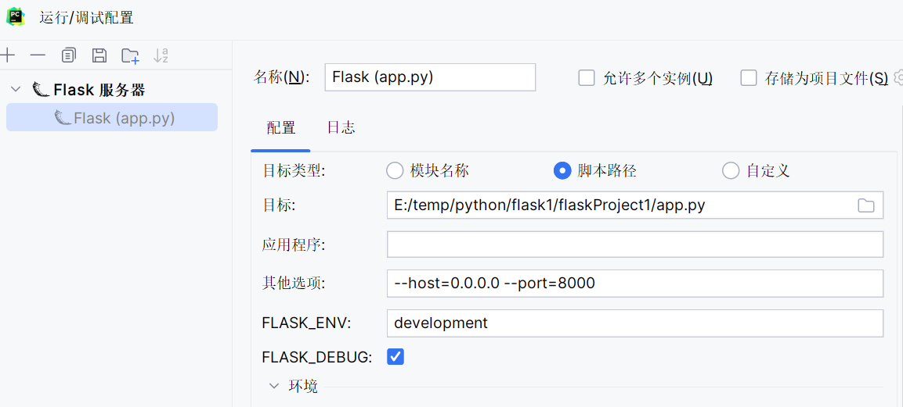
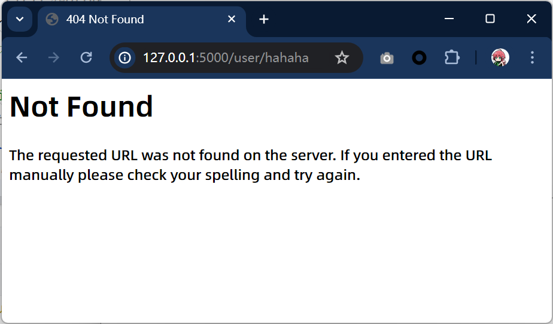

# Flask简介

`flask`是一款非常流行的`Python Web`框架，出生于2010年，作者是`Armin Ronacher`,本来这个项目只是作者在愚人节的一个玩笑，后来由于非常受欢迎，进而成为一个正式的项目。

`flask`自2010年发布第一个版本以来，大受欢迎，深得开发者的喜爱，目前在`Github`上的Star数已经超过`55.5k`了，有超`Django`之趋势。`flask`能如此流行的原因，可以分为以下几点：

- 微框架、简洁、只做他需要做的，给开发者提供了很大的扩展性。
- Flask和相应的插件写得很好，用起来很爽。
- 开发效率非常高，比如使用`SQLAlchemy`的`ORM`操作数据库可以节省开发者大量书写`sql`的时间。

`Flask`的灵活度非常之高，他不会帮你做太多的决策，一些你都可以按照自己的意愿进行更改。比如：

- 使用`Flask`开发数据库的时候，具体是使用`SQLAlchemy`还是`MongoEngine`，选择权完全掌握在你自己的手中。区别于`Django`，`Django`内置了非常完善和丰富的功能，并且如果你想替换成你自己想要的，要么不支持，要么非常麻烦。
- 把默认的`Jinija2`模板引擎替换成其他模板引擎都是非常容易的。

# 安装flask

在pycharm中可以在如下位置安装


在命令行中可以输入如下命令安装

```
pip install flask==2.0.3
```

# Flask项目

## 运行helloworld

```python
import flask
# 导入flask框架

app = flask.Flask(__name__)
# 传入__name__初始化一个Flask实例

@app.route('/')
# app.route装饰器映射URL和执行的函数。这个设置将根URL映射到了hello_world函数上
def hello_world():
    return 'Hello'
    # 返回的内容就会呈现到浏览器上

if __name__ == '__main__':
    # 运行本项目，host=0.0.0.0可以让其他电脑也能访问到该网站，port指定访问的端口。默认的host是127.0.0.1，port为5000
    app.run(debug=True,host='0.0.0.0',port=8080)
# 在pycharm中，debug，host，port等代码中的设置无效
```

如果在pycharm中想要修改调试的地址和端口可以进行如下设置



# URL与视图

## URL与函数的映射

一个`URL`要与执行函数进行映射，使用的是`@app.route`装饰器。`@app.route`装饰器中，可以指定`URL`的规则来进行更加详细的映射，比如现在要映射一个文章详情的`URL`，文章详情的`URL`是`/article/id/`，id有可能为1、2、3…,那么可以通过以下方式：

```python
@app.route('/article/<id>/')
# 可以用<xxx>来读取对应的内容
def article(id):
   return f'{id}article detail'
```


其中`<id>`，尖括号是固定写法，语法为`<variable>`，`variable`默认的数据类型是字符串。如果需要指定类型，则要写成`<converter:variable>`，其中`converter`就是类型名称，可以有以下几种：

- string: 默认的数据类型，接受没有任何斜杠`/`的字符串。
- int: 整形
- float: 浮点型。
- path： 和`string`类似，但是可以传递斜杠`/`。
- uuid： `uuid`类型的字符串。
- any：可以指定多种路径

举例说明

```python
@app.route('/guess/<int:num>')
# 由于指定了int类型，所以num可以直接和整数型比较大小
def guess(num):
    if num < 66:
        return "你猜的数字小了"
    elif num > 66:
        return "你猜的数字大了"
    else:
        return "你猜对了"
```

访问结果


如果传入一个不是int类型的，就无法触发这个路由，就会返回404


关于any类型可以看下面这个案例

```python
@app.route('/user/<any(article,blog):url_path>')
# 在/user/后面只能是article和blog二选一，并且会被传递到url_path变量
def url_path(url_path):
    return f"你输入的是{url_path},此处只能是article或者blog"
```


如果输入了别的字符串，就会返回404



## 构造URL

一般我们通过一个`URL`就可以执行到某一个函数。如果反过来，我们知道一个函数，怎么去获得这个`URL`呢？`url_for`函数就可以帮我们实现这个功能。`url_for()`函数接收两个及以上的参数，他接收**函数名**作为第一个参数，接收对应**URL规则的命名参数**，如果还出现其他的参数，则会添加到`URL`的后面作为**查询参数**。

通过构建`URL`的方式而选择直接在代码中拼`URL`的原因有两点：

1. 将来如果修改了`URL`，但没有修改该`URL`对应的函数名，就不用到处去替换`URL`了。
2. `url_for()`函数会转义一些特殊字符和`unicode`字符串，这些事情`url_for`会自动的帮我们搞定。

下面用一个例子来进行解释：

```python
from flask import Flask,url_for
app = Flask(__name__)

@app.route('/article/<id>/')
def article(id):
    return '%s article detail' % id

@app.route('/')
def index():
    return url_for("article",id=1)
    # 可以使用url_for来帮我们构造一个url，会帮助我们检查此url的合法性
```

在访问的时候，会打印出`/article/1/`。

## 指定URL末尾的斜杠

当访问一个结尾不带斜线的`URL`：`/article`，会被重定向到带斜线的`URL`：`/article/`上去。但是当我们在定义`article`的`url`的时候，如果在末尾没有加上斜杠，但是在访问的时候又加上了斜杠，这时候就会抛出一个`404`错误页面了：

```python
@app.route('/test')
def haha():
    return '你好'
```


## 指定HTTP方法

在`@app.route()`中可以传入一个关键字参数`methods`来指定本方法支持的`HTTP`方法，默认情况下，只能使用`GET`请求，看以下例子：

```python
@app.route('/search/')
def search():
    # return f"你输入的要搜索的东西是{request.args['kw']}"
    return f"你输入的要搜索的东西是{request.args.get('kw')}"
    # 可以和字典一样去取对应的值
    # http://xxxx:5000/search?kw=xxx
```

如果使用post提交就会触发错误


如果想要使用post请求，可以看如下例子

```python
from flask import Flask,request
app = Flask(__name__)

@app.route('/login/',methods=['POST'])
def login():
    username = request.form['username']
    password = request.form['password']
    if username == 'admin' and password == '123456':
        return 'Logged in successfully'
    else:
        return 'Invalid username or password'
```

尝试登陆一下


## 页面跳转和重定向

重定向分为永久性重定向和暂时性重定向，在页面上体现的操作就是浏览器会从一个页面自动跳转到另外一个页面。比如用户访问了一个需要权限的页面，但是该用户当前并没有登录，因此我们应该给他重定向到登录页面。

- 永久性重定向：`http`的状态码是`301`，多用于旧网址被废弃了要转到一个新的网址确保用户的访问，最经典的就是京东网站，你输入`www.jingdong.com`的时候，会被重定向到`www.jd.com`，因为`jingdong.com`这个网址已经被废弃了，被改成`jd.com`，所以这种情况下应该用永久重定向。
- 暂时性重定向：`http`的状态码是`302`，表示页面的暂时性跳转。比如访问一个需要权限的网址，如果当前用户没有登录，应该重定向到登录页面，这种情况下，应该用暂时性重定向。

在`flask`中，重定向是通过`flask.redirect(location,code=302)`这个函数来实现的，`location`表示需要重定向到的`URL`，应该配合之前讲的`url_for()`函数来使用，`code`表示采用哪个重定向，默认是`302`也即`暂时性重定向`，可以修改成`301`来实现永久性重定向。

以下来看一个例子，关于在`flask`中怎么使用重定向：

```python
from flask import Flask, request, session, redirect, url_for

app = Flask(__name__)
app.secret_key = '啦啦啦，我是买糕的小行家'
# 使用session的话，需要配置一个secret_key，内容随意，最好别人想不到
@app.route('/login/',methods=['POST','GET'])
def login():
    if 'username' not in request.form and 'password' not in request.form:
        # 如果没有携带用户名和密码，就显示请登陆
        return "请登陆"
    username = request.form['username']
    password = request.form['password']
    if username == 'admin' and password == '123456':
        session['username'] = 'admin'
        # 登陆成功之后，服务器存储session值
        return 'Logged in successfully'
    else:
        return 'Invalid username or password'

@app.route("/profile/",methods=['GET'])
def profile():
    if 'username' in session:
        return f"欢迎用户{session['username']}"
        # 如果已经登陆，就欢迎
    else:
        return redirect(url_for('login'))
        # 如果cookie中没有合法的session值，就重定向去登陆
```

