# 数据通信背景

## 通信发展史

- 第一阶段：
  - 以语言为主，通过人力、马力、烽火等原始手段传递信息。
- 第二阶段：
  - 文字、邮政。（增加了信息传播的手段）
- 第三阶段：
  - 印刷。（扩大信息传播范围）
- 第四阶段：
  - 电报、电话、广播。（进入电气时代）
- 第五阶段：
  - 信息时代，除语言信息外，还有数据、图像历史

## 以太网发展

计算机网络最终目的是为了数据通信和资源共享(俗话说“能通”)

1. 共享介质实现局域网
2. 交换机优化局域网
3. 路由器连接各个局域网
4. 路由协议连接各个自治系统

# 常见网络设备

## 网络设备

1. 集线器：冲突域
2. 交换机：隔离冲突域
3. 路由器：隔离广播域

## 安全设备

1. 防火墙：网络防火墙、下一代防火墙
2. WAF
3. IPS、IDS
4. 蜜罐

……

# 图标约定

- 路由器


- 交换机


- 运营商


- 个人PC


- 服务器


- 集线器


# 网络拓扑

网络拓扑(Network Topology)是指用传输介质互连各种设备的布局。


# OSI参考模型

- OSI通信模型是由国际标准化组织ISO制定的
- OSI参考模型是为了统一标准而制定的
- 由于是“参考”模型，所以也可以不参考，很多厂商都有自己的私有技术
- 虽然大家都有“私货”，但是这个模型必须要兼容，不然大家都会排斥


## 应用层(Application Layer)

- 网络服务与最终用户的一个接口标准
- 说白了就是各种格式的规定
  - 你想看网页，那么服务器必须发送html给你
  - 你想发送邮件，那么你的邮件客户端必须把邮件打包为pop3的格式
  - 你想聊QQ，那么QQ客户端必须将数据包装为oicq的格式
  - 等等

## 表示层(Presentation Layer)

- 数据的表示、安全、压缩
  - 同一张图片可以有png,jpg,gif等等不同的格式
  - 对文件的加解密
- 这一层名存实亡，因为都是由应用层的app来解决这个问题的，并没有设计出通用的加解密和格式接口

## 会话层(Session Layer)

- 建立、管理、终止会话
- 也是由应用层的软件和协议来解决这个问题了，比如cookie

## 传输层(Transport Layer)

- 数据的分段及重组
- 端口号，TCP/UDP等等就是这一层起作用的
- 可以理解为公司门口收发快递的传达室

## 网络层(Network Layer)

- 这层规定了数据包必须写上发出者和接收者的IP地址(IP地址相当于邮政编码！)
- 路由器(相当于快递员)根据数据包的接收者IP地址传递数据
- 这层相当于邮局，规定了信封的内容和格式，并且提供城市与城市之间的快递传输(只是城市和城市之间的！)

## 数据链路层(Data Link Layer)

- 快递到达了邮编所标识的城市，由快递员根据收件人地址(MAC地址)去进行投递
- 交换机收到了数据，根据数据链路层标识的目的MAC地址转达到准确的网口
- 相当于快递的最后一站，快递小哥。

## 物理层(Physical Layer)

- 在介质上传输比特；提供机械的和电气的规约
- 接口类型，介质类型
  - RJ45
  - SFP
  - BNC

# Dod模型

- 另外一个机构根据自己的想法也出了个模型，记住就好，防止面试官问


# 数据传输过程


## 数据封装与解封装


- 当数据产生之后，首先需要经过传输层的处理(其实就是在数据前面加上控制信息，提醒接收方怎么操作数据)
- 传输层处理主要有如下几个方面
  - 检查数据包是否过大，一般最大报文段长度(MSS)不超过1460字节(想知道为啥？继续往下听课)
  - 使用端口号来确定数据包在源和目的地应该哪个进程(进程就是电脑上运行中的软件)来接收
  - 决定这个数据应该以哪种方式传递
    - 可靠传输TCP
    - 尽力而为传输UDP
- 如果数据过大，需要进行分段，还需要保障接收到的数据不会错乱(可靠性和流量控制)

# 端口号

## 端口号简介

- 类似于银行，医院，政府行政楼等等地方，不同的窗口处理不同的业务
- 一个IP地址可以有65535个端口号，每个端口号可以对应一个不同的服务
- 在电脑上一个服务，往往是一个对应的进程在等着接收数据(就像政府公务员坐在窗口等着你上门)
  - 打开电脑cmd，然后输入netstat -ano可以看到这个对应关系

## 固定端口号与随机端口号

- 你需要先去找大堂经理、导医台、工作人员等等地方问下，才能知道哪个窗口办理自己的业务
- 电脑可以直接查询C:\Windows\System32\drivers\etc\service文件得知自己应该找对方的什么端口号
  - 服务器上面的应用需要被别人访问，所以会一直在某个端口号等待着
- 对方如果想回复自己，那么自己电脑上也应该有个端口号对应相关程序在等待着，比如浏览器需要等待对方吧网页发过来
  - 浏览器这种应用不需要被访问，只需要主动出击，所以会使用一个大于1023的随机端口号来等待接收
  - 而且为了安全，一旦数据接收完毕，一段时间之后，浏览器就会抛弃这个随机端口号，免得被人攻击了
- 常见的需要被记住的端口

| **协议** | **端口号**      |
| -------- | --------------- |
| http     | 80/tcp          |
| dns      | 53/tcp 53/udp   |
| ftp      | 20/tcp 21/tcp   |
| dhcp     | 67/udp 68/udp   |
| https    | 443/tcp 443/udp |
| telnet   | 23/tcp          |
| ssh      | 22/tcp          |


# IP编址

- 在IP网络中，通信节点需要有一个唯一的IP地址
- IP地址用于IP报文的寻址以及标识一个节点
- IPv4地址一共32bits，使用点分十进制的形式表示
- IPv4地址由网络位和主机位组成
  - 网络位一致表示在同一个广播域中，可以直接通信
  - 主机位用于在同一个局域网中标识唯一节点


## IP地址的类别


- 早期参与互联网的设备不多，所以仅仅使用ABC类地址分配给用户即可
- 随着网络用户的增多，ABC类分配地址过于浪费，于是出现子网掩码方式划分网络位和主机位

## IP网络通信类型

- 单播(Unicast)
- 广播(Broadcast)
- 组播(Multicast)

## 子网掩码(Netmask)

- 网络掩码与IP地址搭配使用，用于描述一个IP地址中的网络部分及主机部分
- 网络掩码32bits，与32bits的IP地址一一对应，掩码中为1的位对应IP地址中的网络位，掩码中为0的位对应IP地址中的主机位

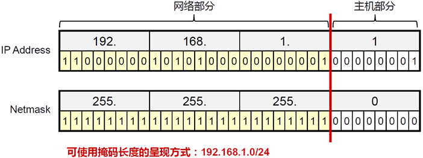

- 减少一个局域网中的设备数量可以有效降低广播报文消耗资源
- 可变长子网掩码可以将一个局域网中的主机地址分配的更加小

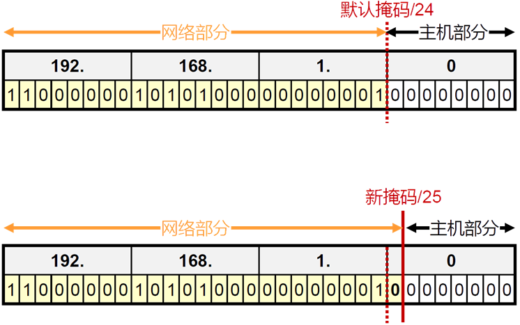

## 广播地址与网络号

- 在局域网中经常会有广播的需要(比如，mac地址查询，地址冲突检测等等)，所以将主机位全为1的地址做为本局域网的广播地址(注意！广播并不能跨越不同的局域网)
- 在网络中需要表示整个局域网，就像邮政编码表示一个大的区域一样，所以将主机位全为0的地址作为本局域网的网络号，用来代指整个网段
- 综上所述，计算产生的子网及每个子网的主机数量公式如下：


# 私有IP地址

- 如果要取得互联网合法地址用于通信，必须要找iana.org组织分配
- 很多企业内部都有大量的网络设备，大多数时候这些设备只需要内部通信即可
- 企业的网络管理员可以从如下网段中自行分配地址


- 私有IP地址空间中的地址不需要申请，随意使用，但是不能在互联网上与合法地址通信(因为对方没法回复你这个地址，因为世界上私有IP地址段无数个重复的，怎么知道回到谁那里呢)
- 而我们明明用的私有IP地址，也可以上网，因为我们需要先把自己的上网请求提交给网络中的网关(就是你家的出口路由器)，再由网关代替我们去获取内容转交给我们的电脑手机，而网关往往能从运营商那里得到一个合法的公有IP地址
- 网络层处理完的数据其实已经可以看出来是谁来接收了，但是还是有些问题没解决
- 数据链路层主要完成如下工作
  - 读取物理层二进制信号转换成数据帧
  - 校验数据是否完整(物理层不可靠)
  - 配合不同的物理介质特性，做出对应的处理
    - 比如拨号上网(pppoe)就需要在数据链路层中加入认证信息来给用户计费
    - 比如HDLC网络中，就需要由特殊的地址和控制字段
  - 在以太网中需要标识发送者MAC地址和接收者MAC地址
  - 告诉计算机下一个数据包头的格式，数据链路层之后不一定是IPv4包头哦

# 以太网数据帧格式


## MAC(Media Access Control)

- mac地址是在网卡出厂的时候刷写入网卡固件中，无法轻易改变
- mac地址是48位二进制，通常表示为12个16进制数，如：00-16-EA-AE-3C-40


- IP地址的分配是基于网络拓扑，MAC地址的分配是基于制造商

# ARP(Address Resolution Protocol)

- 在访问目的地的时候，需要完成数据封装，然而我们平时最多关注对方IP地址，而MAC地址则是通过ARP(地址解析协议)自动获得的
- ARP作用如下
  - 将IPv4 地址解析为MAC 地址
  - 维护IP与MAC映射关系的缓存

## ARP的工作机制

## 代理ARP

- 访问非本局域网的地址的时候，请求ARP的广播将无法得到目的地的响应，路由器就会代替目的地对arp请求回应
- 代理ARP可能会导致ARP表爆满，导致网速缓慢

## 免费ARP(地址冲突检测)

- 用来检测地址冲突的，设备会对局域网广播查询自己IP地址的arp请求，如果收到回应，说明局域网内有冲突的地址。

## 反向ARP

- 知道自己的mac地址，但是不知道自己的IP的时候，就会有反向ARP
- 无盘工作站

# PNET安装与使用

略

# 什么是路由器

- 路由器的主要工作就是查看数据包的目的IP地址，然后从对应的接口进行转发
- 每个路由器都会有个路由表，里面会记载着可以到达的各个网段与对应的接口
- 路由表有三种方式生成
  - 直连接口
    - 与接口的状态属性挂钩
  - 静态路由
    - 手动添加路由条目
  - 动态路由
    - 路由器之间自动协商，互相学习路由表

## 路由表

- 当路由器产生或者转发一个数据的时候，必须要先查找下面这张表格，有匹配上的条目才会从对应的下一跳转发数据，如果没有匹配条目，则会丢弃

```
R1#show ip route
 Codes: L - local, C - connected, S - static, R - RIP, M - mobile, B - BGP
        D - EIGRP, EX - EIGRP external, O - OSPF, IA - OSPF inter area 
        N1 - OSPF NSSA external type 1, N2 - OSPF NSSA external type 2
        E1 - OSPF external type 1, E2 - OSPF external type 2
        i - IS-IS, su - IS-IS summary, L1 - IS-IS level-1, L2 - IS-IS level-2
        ia - IS-IS inter area, * - candidate default, U - per-user static route
        o - ODR, P - periodic downloaded static route, H - NHRP, l - LISP
        a - application route
        + - replicated route, % - next hop override, p - overrides from PfR
 ---------------代码参考表--------------------
 Gateway of last resort is 192.168.12.2 to network 0.0.0.0
 ---------------默认路由---------------------
 S*    0.0.0.0/0 [1/0] via 192.168.12.2      # 这条是静态路由，并且是默认路由
       1.0.0.0/8 is variably subnetted, 2 subnets, 2 masks   # 这个不是条目，只是提醒是1.0.0.0/8的子网
 C        1.1.1.0/24 is directly connected, Loopback0    # 这个是直连网段
 L        1.1.1.1/32 is directly connected, Loopback0    # 这个是本地接口
       2.0.0.0/32 is subnetted, 1 subnets
 O        2.2.2.2 [110/11] via 192.168.12.2, 00:01:26, Ethernet0/0   # 参照上面的表，知道这个是OSPF条目
 R     20.0.0.0/8 [120/1] via 192.168.12.2, 00:00:22, Ethernet0/0    # 参照上面的表，知道这个是RIP条目
       192.168.12.0/24 is variably subnetted, 2 subnets, 2 masks
 C        192.168.12.0/24 is directly connected, Ethernet0/0
 L        192.168.12.1/32 is directly connected, Ethernet0/0
```

## 匹配条件

- 1.1.1.0/24中的/24表示如果目的IP地址前24位二进制和1.1.1.0是一样的，那么就算匹配上了
  - 目的地是1.1.1.2、1.1.1.199，1.1.1.66等等都是这条匹配的上的
- 192.168.12.1/32表示目的IP地址，必须是192.168.12.1一模一样，才能匹配上
- 0.0.0.0/0这个条目表示任何的目的地都是和这个条件匹配的上的
- 路由表在匹配的时候会遵循最长匹配原则，也就是多个条目都能匹配，那么选择匹配位数最长的
  - 192.168.12.2这个目的地在这个路由表中与14行和22行的条目都能匹配上，但是22行的能匹配到24位，而14行的只能匹配到0位，所以选择22行的条目

## 下一跳

- 一旦被路由表匹配上以后，数据就会发往下一跳
- 下一跳有两种形式，这两种形式可以同时存在
  - 路由器流量出接口
  - 下一个节点的IP地址
    - 如果只有下一个节点的IP地址，那么会触发再次路由表查找，直到找到出接口

# 环回接口

- 主要用于测试、管理等作用，是一个虚拟的接口
- 几乎任何操作系统都支持环回接口，这个接口是软件模拟的，所以不会被物理损坏，特别稳定
- 环回接口拥有与物理接口一样的属性，可以配置IP地址，并且也可以响应请求

```
R1(config)#int loopback0
 R1(config-if)#ip add 1.1.1.1 255.255.255.0
 # 在cisco设备上，loopback接口默认就是up状态的，不需要no shutdown
```

- cisco设备可以创建2147483648个环回接口

```
R1(config)#int lo ?
   <0-15>          LongReachEthernet interface number
   <0-2147483647>  Loopback interface number
```

## 环回口实验

### 拓扑


### 配置

- R1

```
R1#conf t
 R1(config)#int lo0
 R1(config-if)#ip add 1.1.1.1 255.255.255.0
 R1(config-if)#int e0/0
 R1(config-if)#ip add 192.168.12.1 255.255.255.0
 R1(config-if)#no sh
 R1(config-if)#end       # 这个是回到特权模式(看自己的需要)
```

- R2

```
R2#conf t
 R2(config)#int lo0
 R2(config-if)#ip add 2.2.2.2 255.255.255.0
 R2(config-if)#int e0/0
 R2(config-if)#ip add 192.168.12.2 255.255.255.0
 R2(config-if)#no sh
```

### 测试

- 在R1上访问192.168.12.2和2.2.2.2
- 思考为啥是这个想象，用路由表和ARP来解释

```
R1#ping 192.168.12.2
 Type escape sequence to abort.
 Sending 5, 100-byte ICMP Echos to 192.168.12.2, timeout is 2 seconds:
 .!!!!
 Success rate is 80 percent (4/5), round-trip min/avg/max = 1/1/2 ms
 R1#ping 2.2.2.2  
 Type escape sequence to abort.
 Sending 5, 100-byte ICMP Echos to 2.2.2.2, timeout is 2 seconds:
 .....
 Success rate is 0 percent (0/5)
```

- 在简单的网络环境中，我们可以手动添加路由表，让路由器知道可以去往某些地方
- 静态路由需要关注匹配条件能够正好匹配上需要转发的流量
- 路由表只会收录合格的条目，如果静态路由下一跳无法到达，那么是不会出现在路由表中的

# 静态路由配置

## 拓扑

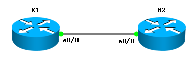

## IP地址配置

- R1

```
R1#conf t
 R1(config)#int lo0
 R1(config-if)#ip add 1.1.1.1 255.255.255.0
 R1(config-if)#int e0/0
 R1(config-if)#ip add 192.168.12.1 255.255.255.0
 R1(config-if)#no sh
 R1(config-if)#end       # 这个是回到特权模式(看自己的需要)
```

- R2

```
R2#conf t
 R2(config)#int lo0
 R2(config-if)#ip add 2.2.2.2 255.255.255.0
 R2(config-if)#int e0/0
 R2(config-if)#ip add 192.168.12.2 255.255.255.0
 R2(config-if)#no sh
```

## 查看路由表

- R1

```
R1#show ip route
       1.0.0.0/8 is variably subnetted, 2 subnets, 2 masks
 C        1.1.1.0/24 is directly connected, Loopback0
 L        1.1.1.1/32 is directly connected, Loopback0
       192.168.12.0/24 is variably subnetted, 2 subnets, 2 masks
 C        192.168.12.0/24 is directly connected, Ethernet0/0
 L        192.168.12.1/32 is directly connected, Ethernet0/0
```

- 可以看到R1的路由表中没有条目能够匹配2.2.2.2，所以也就无法发出这个数据

## 添加静态路由

 R1(config)#ip route 2.2.2.2 255.255.255.255 e0/0

- 添加之后，查看R1的路由表

```
R1#show ip route
       1.0.0.0/8 is variably subnetted, 2 subnets, 2 masks
 C        1.1.1.0/24 is directly connected, Loopback0
 L        1.1.1.1/32 is directly connected, Loopback0
       2.0.0.0/32 is subnetted, 1 subnets
 S        2.2.2.2 is directly connected, Ethernet0/0
       192.168.12.0/24 is variably subnetted, 2 subnets, 2 masks
 C        192.168.12.0/24 is directly connected, Ethernet0/0
 L        192.168.12.1/32 is directly connected, Ethernet0/0
```

- 测试能否去往R2

```
R1#ping 2.2.2.2
 Type escape sequence to abort.
 Sending 5, 100-byte ICMP Echos to 2.2.2.2, timeout is 2 seconds:
 !!!!!
 Success rate is 100 percent (5/5), round-trip min/avg/max = 1/1/1 ms
```

### 源IP地址的问题

- 虽然数据传递只关心目的IP地址，但是源IP地址关系到数据包的回复
- 有时候不通不一定是数据无法到达目的地，也可能是无法收到回复
- R1如果在访问2.2.2.2的时候，指定了源IP地址为1.1.1.1，那么最终R2收到了数据，但是没法回复

```
R1#ping 2.2.2.2 source 1.1.1.1
 Type escape sequence to abort.
 Sending 5, 100-byte ICMP Echos to 2.2.2.2, timeout is 2 seconds:
 Packet sent with a source address of 1.1.1.1 
 .....
 Success rate is 0 percent (0/5)
```

- 在R2上添加静态路由

 R2(config)#ip route 1.1.1.1 255.255.255.255 e0/0

- 在R1上测试是否正常

```
R1#ping 2.2.2.2 source 1.1.1.1
Type escape sequence to abort.
Sending 5, 100-byte ICMP Echos to 2.2.2.2, timeout is 2 seconds:
Packet sent with a source address of 1.1.1.1 
!!!!!
Success rate is 100 percent (5/5), round-trip min/avg/max = 1/5/8 ms
```

# 静态路由实验

## 拓扑


- 在每台路由上都创建一个loopback接口
- 最终要求全网互联，在实验过程中要善用排错思路，不通的情况下好好查看路由表
- 务必做好，下面路由汇总章节继续用这张图
- 最终检查效果

```
R1#ping 3.3.3.3
Type escape sequence to abort.
Sending 5, 100-byte ICMP Echos to 3.3.3.3, timeout is 2 seconds:
.!!!!
Success rate is 80 percent (4/5), round-trip min/avg/max = 1/1/1 ms
R1#ping 3.3.3.3 source 1.1.1.1
Type escape sequence to abort.
Sending 5, 100-byte ICMP Echos to 3.3.3.3, timeout is 2 seconds:
Packet sent with a source address of 1.1.1.1 
!!!!!
Success rate is 100 percent (5/5), round-trip min/avg/max = 1/1/3 ms
```

# 路由汇总

- 基于上面的三台路由器的拓扑开始实验
- 在R1上配置三个环回接口

```
R1(config)#int lo1 
R1(config-if)#ip add 172.16.1.1 255.255.255.0
R1(config-if)#int lo2
R1(config-if)#ip add 172.16.2.1 255.255.255.0
R1(config-if)#int lo3
R1(config-if)#ip add 172.16.3.1 255.255.255.0
```

- 可以在R2和R3上放宽路由匹配条件，配置静态路由匹配条件为172.16.0.0/16，这样就可以一条静态路由就可以匹配这三条，这个就叫**路由汇总**

R2(config)#ip route 172.16.0.0 255.255.0.0 e0/0

- 路由汇总会丢失路由明细信息，导致不必要的路由转发，比如现在R2上面如果ping 172.16.4.1，那么R2也会从e0/0接口发出，因为路由表中有匹配条目

## 路由汇总练习

- 在R3上面添加一个环回接口172.16.4.1/24，然后怎么才能让每个地址都能访问？

```
R2#ping 172.16.4.1
Type escape sequence to abort.
Sending 5, 100-byte ICMP Echos to 172.16.4.1, timeout is 2 seconds:
.!!!!
Success rate is 80 percent (4/5), round-trip min/avg/max = 1/1/1 ms
R2#ping 172.16.1.1
Type escape sequence to abort.
Sending 5, 100-byte ICMP Echos to 172.16.1.1, timeout is 2 seconds:
!!!!!
Success rate is 100 percent (5/5), round-trip min/avg/max = 1/1/1 ms
```

# 默认路由

- 默认路由有时候也被叫做缺省路由，默认网关
- 一般是用来表示整个内部网络的出口，也就是告诉内网路由器怎么去往运营商
- 可以使用静态的方式配置，默认路由必须要匹配任意目的IP地址

ip route 0.0.0.0 0.0.0.0 <出接口/IP地址>

# 下一跳问题

## 查看ARP表

```
R1#sh arp
Protocol  Address          Age (min)  Hardware Addr   Type   Interface
Internet  3.3.3.3                15   aabb.cc00.0200  ARPA   Ethernet0/0
Internet  192.168.12.1            -   aabb.cc00.0100  ARPA   Ethernet0/0
Internet  192.168.12.2           12   aabb.cc00.0200  ARPA   Ethernet0/0
```

- 可以发现第3行和第5行的mac地址是一样的，这个是因为代理ARP
- 可以测试再访问一些能去往的地址(不一定要通，路由表里面要有)

```
R1#ping 192.168.23.4
Type escape sequence to abort.
Sending 5, 100-byte ICMP Echos to 192.168.23.4, timeout is 2 seconds:
.....
Success rate is 0 percent (0/5)
R1#sh arp
Protocol  Address          Age (min)  Hardware Addr   Type   Interface
Internet  3.3.3.3                16   aabb.cc00.0200  ARPA   Ethernet0/0
Internet  192.168.12.1            -   aabb.cc00.0100  ARPA   Ethernet0/0
Internet  192.168.12.2           13   aabb.cc00.0200  ARPA   Ethernet0/0
Internet  192.168.23.4            0   aabb.cc00.0200  ARPA   Ethernet0/0
```

可以看到不管通不通，都能得到代理ARP的结果，如果这台设备是网关设备，每时每刻都要访问无数个IP地址，每个IP地址都要产生一条ARP结果，那么这台设备的ARP表很快就撑爆了
因为在配置静态路由的时候写的是出接口，所以路由表就会认为这个目的地是直连，所以就会直接尝试对这个目的地的ARP请求，从而触发代理ARP

```
R1#sh ip route
S     192.168.23.0/24 is directly connected, Ethernet0/0	# 这边写的是直连
```

cisco设备默认接口是开启代理ARP的，然而很多厂商(比如华为)设备是默认关闭ARP的，我们尝试关闭R2的代理ARP功能，然后清空R1的arp表

```
R2(config)#int e0/0
R2(config-if)#no ip proxy-arp
```

```
R1(config)#int e0/0		# 重启接口，就会删除和这个接口相关的arp表项
R1(config-if)#sh
R1(config-if)#no sh
```

再次访问本来可以访问的IP地址，并且查看arp表项，会发现无法完成arp，从而无法访问

```
R1#ping 192.168.23.3
Type escape sequence to abort.
Sending 5, 100-byte ICMP Echos to 192.168.23.3, timeout is 2 seconds:
.....
Success rate is 0 percent (0/5)
R1#show arp
Protocol  Address          Age (min)  Hardware Addr   Type   Interface
Internet  192.168.23.3            0   Incomplete      ARPA
```

修改静态路由为下一跳IP地址

```
R1(config)#no ip route 192.168.23.0 255.255.255.0 e0/0
R1(config)#ip route 192.168.23.0 255.255.255.0 192.168.12.2
```

查看路由表

```
R1#sh ip route
C     192.168.12.0/24 is directly connected, Ethernet0/0
S     192.168.23.0/24 [1/0] via 192.168.12.2
# 发现不是直连，当访问192.168.23.3的时候，需要借用192.168.12.2的节点做转发
```

再次尝试访问和查询arp表

```
R1#ping 192.168.23.3
Type escape sequence to abort.
Sending 5, 100-byte ICMP Echos to 192.168.23.3, timeout is 2 seconds:
!!!!!
Success rate is 100 percent (5/5), round-trip min/avg/max = 1/1/1 ms
R1#sh arp
Protocol  Address          Age (min)  Hardware Addr   Type   Interface
Internet  192.168.12.1            -   aabb.cc00.0100  ARPA   Ethernet0/0
Internet  192.168.12.2            1   aabb.cc00.0200  ARPA   Ethernet0/0
```

## 总结

- 配置静态路由的时候尽量使用下一跳IP地址来规避ARP问题


- 如果多条匹配条件一样的条目被路由表学习，只会从中选择一个最佳条目
- 路由器使用管理距离来比较同一个匹配条件的不同条目
- 管理距离不同厂商数字不一样，在使用的时候需要注意
- cisco的管理距离如下表

| **路由来源**         | **管理距离** | **备注** |
| -------------------- | ------------ | -------- |
| 直连接口             | 0            |          |
| 关联出接口的静态路由 | 1            | 度量值=0 |
| 关联下一跳的静态路由 | 1            | 度量值=0 |
| EIGRP汇总路由        | 5            |          |
| 外部BGP              | 20           |          |
| 内部EIGRP            | 90           |          |
| IGRP                 | 100          |          |
| OSPF                 | 110          |          |
| ISIS                 | 115          |          |
| RIPv1、v2            | 120          |          |
| 外部EIGRP            | 170          |          |
| 内部BGP              | 200          |          |

# 负载均衡

- 如果多个条目管理距离和度量值(以后会讲到)都是一样，那么就会同时被路由表收录
- 去往一个目的地的流量，如果有多个下一跳，就会进行负载均衡
- 负载均衡有两种情况
  - 不等价负载均衡
  - 等价负载均衡
- 负载均衡的条目路由表会显示如下

```
R2#sh ip route
 S     192.168.34.0/24 is directly connected, Ethernet0/2
                       is directly connected, Ethernet0/1
```

- 当流量需要去往192.168.34.0/24的时候，会对这两个下一跳进行负载均衡

```
R2#sh ip route 192.168.34.0
 Routing entry for 192.168.34.0/24
   Known via "static", distance 1, metric 0 (connected)
   Routing Descriptor Blocks:
     directly connected, via Ethernet0/2
       Route metric is 0, traffic share count is 1
   * directly connected, via Ethernet0/1         # 前面的*号，表示下一个数据包的下一跳
       Route metric is 0, traffic share count is 1
```

# 浮动静态路由

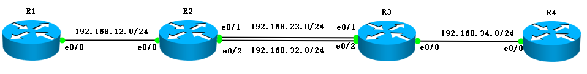

- 可以通过配置多个下一跳不同管理距离的方式让静态路由也能根据链路状态自动切换

## 拓扑

- 要求在R2和R3之间的两个链路正常的情况下，从1.1.1.1去往4.4.4.4的流量从192.168.23.0/24线路经过，4.4.4.4去往1.1.1.1的流量从192.168.32.0/24线路经过
- 当R2和R3之间的任何一根线路出现故障的时候，能自动切换路径保障通信

## 配置

- R1

```
R1#conf t
 R1(config)#int e0/0
 R1(config-if)#ip add 192.168.12.1 255.255.255.0
 R1(config-if)#no sh
 R1(config-if)#int lo0
 R1(config-if)#ip add 1.1.1.1 255.255.255.0
 R1(config-if)#ip route 0.0.0.0 0.0.0.0 192.168.12.2
```

- R2

```
R2#conf t 
 R2(config)#int lo0
 R2(config-if)#ip add 2.2.2.2 255.255.255.0
 R2(config-if)#int e0/0
 R2(config-if)#ip add 192.168.12.2 255.255.255.0
 R2(config-if)#no sh
 R2(config-if)#int e0/1
 R2(config-if)#ip add 192.168.23.2 255.255.255.0
 R2(config-if)#no sh
 R2(config-if)#int e0/2
 R2(config-if)#ip add 192.168.32.2 255.255.255.0
 R2(config-if)#no sh
 R2(config)#ip route 4.4.4.4 255.255.255.255 192.168.23.3
 R2(config)#ip route 4.4.4.4 255.255.255.255 192.168.32.3 10     # 这个后面加上管理距离为10
 R2(config)#ip route 1.1.1.1 255.255.255.255 192.168.12.1
```

- R3

```
R3#conf t
 R3(config)#int lo0
 R3(config-if)#ip add 3.3.3.3 255.255.255.0
 R3(config-if)#int e0/0
 R3(config-if)#ip add 192.168.34.3 255.255.255.0
 R3(config-if)#no sh
 R3(config-if)#int e0/1
 R3(config-if)#ip add 192.168.23.3 255.255.255.0
 R3(config-if)#no sh
 R3(config-if)#int e0/2
 R3(config-if)#ip add 192.168.32.3 255.255.255.0
 R3(config-if)#no sh
 R3(config)#ip route 1.1.1.1 255.255.255.255 192.168.32.2
 R3(config)#ip route 1.1.1.1 255.255.255.255 192.168.23.2 10
 R3(config)#ip route 4.4.4.4 255.255.255.255 192.168.34.4
```

- R4

```
R4#conf t
 R4(config)#int lo0
 R4(config-if)#ip add 4.4.4.4 255.255.255.0
 R4(config-if)#int e0/0
 R4(config-if)#ip add 192.168.34.4 255.255.255.0
 R4(config-if)#no sh
 R4(config-if)#ip route 0.0.0.0 0.0.0.0 192.168.34.3
```

## 检查

- 检查1.1.1.1到4.4.4.4的连通性

```
R1#ping 4.4.4.4 so 1.1.1.1
 Type escape sequence to abort.
 Sending 5, 100-byte ICMP Echos to 4.4.4.4, timeout is 2 seconds:
 Packet sent with a source address of 1.1.1.1 
 !!!!!
 Success rate is 100 percent (5/5), round-trip min/avg/max = 1/1/1 ms
```

- 检查流量有没有按照预期路线进行

```
R1#traceroute 4.4.4.4 source 1.1.1.1
 Type escape sequence to abort.
 Tracing the route to 4.4.4.4
 VRF info: (vrf in name/id, vrf out name/id)
   1 192.168.12.2 1 msec 5 msec 7 msec
   2 192.168.23.3 1 msec 1 msec 2 msec
   3 192.168.34.4 2 msec 1 msec 1 msec
```

```
R4#traceroute 1.1.1.1 source 4.4.4.4
Type escape sequence to abort.
Tracing the route to 1.1.1.1
VRF info: (vrf in name/id, vrf out name/id)
  1 192.168.34.3 1 msec 0 msec 1 msec
  2 192.168.32.2 1 msec 0 msec 0 msec
  3 192.168.12.1 1 msec 0 msec 1 msec
```

- 模拟R2的e0/1接口故障

```
R2(config)#int e0/1
R2(config-if)#sh
```

- 再次检查流量的路线，发现已经自动切换了

```
R1#traceroute 4.4.4.4 source 1.1.1.1
Type escape sequence to abort.
Tracing the route to 4.4.4.4
VRF info: (vrf in name/id, vrf out name/id)
  1 192.168.12.2 0 msec 0 msec 5 msec
  2 192.168.32.3 5 msec 1 msec 1 msec
  3 192.168.34.4 1 msec 1 msec 1 msec
```

 

- DHCP用于给设备自动分配IP地址，我们几乎天天用到
- DHCP给设备提供的内容如下
  - IP地址
  - 子网掩码
  - 网关地址
  - DNS服务器地址
  - 租约时间

# DHCP配置

## 拓扑


## 路由器配置

```
R1#conf t
 R1(config)#int e0/0
 R1(config-if)#ip add 192.168.1.1 255.255.255.0
 R1(config-if)#no sh
 R1(config-if)#ip dhcp pool cisco        # 创建一个地址池
 R1(dhcp-config)#network 192.168.1.0 /24     # 在地址池中放一个网段
 R1(dhcp-config)#default-router 192.168.1.1      # 设置默认网关
 R1(dhcp-config)#dns-server 114.114.114.114 114.114.115.115      # 设置主备DNS
 R1(dhcp-config)#lease 1     # 租约时间改为1天
 R1(dhcp-config)#exit        
 R1(config)#ip dhcp excluded-address 192.168.1.1     # 设置排除地址
```

## 检查IP地址分配情况


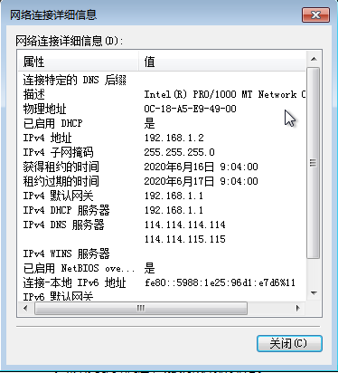

- 在路由器上查看地址池分配的情况

```
R1#show ip dhcp binding 
 Bindings from all pools not associated with VRF:
 IP address          Client-ID/          Lease expiration        Type
             Hardware address/
             User name
 192.168.1.2         010c.18a5.e949.00       Jun 17 2020 09:04 AM    Automatic
 192.168.1.3         010c.18a5.fca9.00       Jun 17 2020 09:05 AM    Automatic
```

# DHCP工作过程

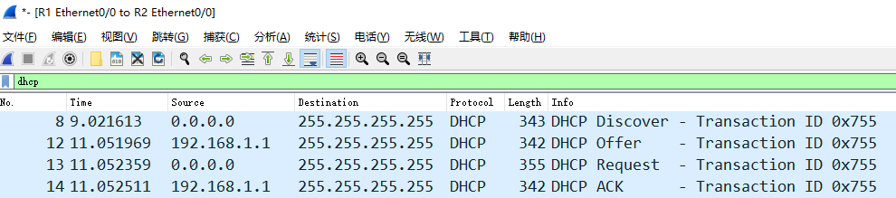

通过对DHCP获取信息的过程抓包，可以得到如下4个数据包

1. Discover消息是用于客户端向整个内网发送广播，期待DHCP服务器进行回应
   1. 这个数据包中的重要内容就是：消息类型，客户端ID，主机名，请求获得的信息
2. Offer消息是DHCP服务器对客户的回应
   1. 这个消息中会回复对方所需要的所有信息
3. Request这个是客户端确认DHCP服务器的消息
   1. 这个消息和第一个消息差不多，但是消息类别变为Request，并且会携带请求的IP地址
4. ACKDHCP服务器给客户端的最终确认
   1. 这个消息和第二个消息差不多，但是消息类型变为ACK

# DHCP续租

DHCP分配的信息是有有效期的，在DHCP服务器给客户端的数据包中可以明确看到


为了我们做实验方便，我们将DHCP的租约时间减少到只有两分钟，这样就可以清楚的看到续租的过程
并且我们在客户端获得IP之后，就关闭服务端，让客户端无法续租成功，看客户端是怎么去Rebinding的

- DHCP服务端操作

```
R1(config)#ip dhcp pool cisco   
 R1(dhcp-config)#lease 0 0 2         # 租约时间改为2分钟
 R1(config)#int e0/0
 R1(config-if)#sh            # 在客户端获得IP信息之后关闭接口
```


## 总结

- 客户端会在租约时间过去二分之一的时候以单播方式请求续租
- 在租约时间过去八分之七的时候以广播的方式请求续租
- 在租约时间过去100%的时候，以广播方式重新发现局域网中的DHCP服务器

# DHCP地址绑定

- 通过上面的学习，我们知道设备必须提供自己的身份信息才能在dhcp服务端获取地址信息
- 那么想要给设备绑定固定的IP地址，就必须知道设备的身份信息

## 拓扑


- 我们分别测试windows、linux、Router在DHCP中使用什么身份信息

## 路由器配置

```
R1#conf t
 R1(config)#int e0/0
 R1(config-if)#ip add 192.168.1.1 255.255.255.0
 R1(config-if)#no sh
 R1(config-if)#ip dhcp pool cisco
 R1(dhcp-config)#netw 192.168.1.0 /24
 R1(dhcp-config)#def 192.168.1.1
 R1(dhcp-config)#dns 114.114.114.114 114.114.115.115
 R1(dhcp-config)#exit
 R1(config)#ip dhcp ex 192.168.1.1
```

## windows绑定DHCP

- 查看windows获取到的IP地址

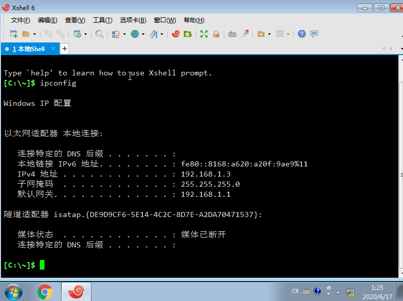

- 去路由器上查看分配这个地址的对应身份信息

```
R1#sh ip dhcp binding 
 Bindings from all pools not associated with VRF:
 IP address          Client-ID/          Lease expiration        Type
             Hardware address/
             User name
 192.168.1.3         010c.18a5.af90.00       Jun 18 2020 01:23 AM    Automatic
```

可以看到windows使用的是010c.18a5.af90.00这个信息获得的这个IP地址，而这个信息并不是MAC地址，这台windows的mac地址我们可以通过ipconfig /all查看


所以windows会在mac地址前加上01组成Client-ID向DHCP服务端发起请求，我们下面绑定这个Client-ID到一个地址池，这个地址池中只放一个IP地址，这样windows的地址就被绑定了

```
R1(config)#ip dhcp pool windows
 R1(dhcp-config)#host 192.168.1.100
 R1(dhcp-config)#client-identifier 010c.18a5.af90.00
 % A binding for this client already exists.
```

如果绑定的时候出现% A binding for this client already exists.，说明你要绑定的这个身份信息在dhcp地址池中已经被占用，先去清理一下
 R1#clear ip dhcp binding *
清理完成后，再次绑定，就可以成功了，查看地址池，可以看到windows地址池只有一个IP地址

```
R1#sh ip dhcp pool
 
 Pool cisco :
  Utilization mark (high/low)    : 100 / 0
  Subnet size (first/next)       : 0 / 0 
  Total addresses                : 254
  Leased addresses               : 0
  Pending event                  : none
  1 subnet is currently in the pool :
  Current index        IP address range                    Leased addresses
  192.168.1.4          192.168.1.1      - 192.168.1.254     0
 
 Pool windows :
  Utilization mark (high/low)    : 100 / 0
  Subnet size (first/next)       : 0 / 0 
  Total addresses                : 1
  Leased addresses               : 1
  Pending event                  : none
  0 subnet is currently in the pool :
  Current index        IP address range                    Leased addresses
  192.168.1.100        192.168.1.100    - 192.168.1.100     1
```

让windows重新获取IP地址

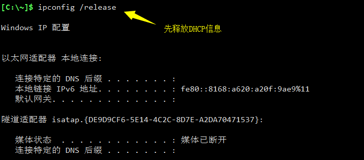


## Linux绑定DHCP

- 步骤和windows一样，不过要注意linux是使用mac地址作为身份信息来获取DHCP的
- 查看Linux获得的IP地址


- 在路由器上查看dhcp地址池，可以看到linux就是用mac地址来获得的DHCP信息

```
R1#show ip dhcp bin
Bindings from all pools not associated with VRF:
IP address          Client-ID/	 	    Lease expiration        Type
		    Hardware address/
		    User name
192.168.1.2         0c18.a52c.fa00          Jun 18 2020 01:38 AM    Automatic
```

- 绑定

```
R1#clear ip dhcp bin *		# 别忘了先清空地址池
R1#conf t
R1(config)#ip dhcp pool linux
R1(dhcp-config)#host 192.168.1.101
R1(dhcp-config)#hardware-address 0c18.a52c.fa00		# 这次绑定的是硬件地址，也就是mac地址
```

- linux需要重新获得一下dhcp信息

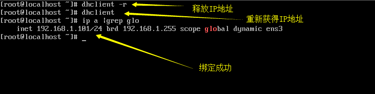

## 路由器等其他网络设备绑定DHCP

- cisco设备是使用的Client-ID来获取DHCP信息的
- 首先要让想获取DHCP信息的设备随意获得一下DHCP信息

```
R2#conf t
R2(config)#int e0/0
R2(config-if)#ip add dhcp
R2(config-if)#no sh
```

- 在DHCP服务端上查看DHCP地址池绑定情况

```
R1#sh ip dhcp binding 
Bindings from all pools not associated with VRF:
IP address          Client-ID/	 	    Lease expiration        Type
		    Hardware address/
		    User name
192.168.1.5         0063.6973.636f.2d61.    Jun 18 2020 01:51 AM    Automatic
                    6162.622e.6363.3030.
                    2e30.3330.302d.4574.
                    302f.30
```

- cisco设备提供的Client-ID太长了，在复制的时候需要稍微处理一下，变成一行

0063.6973.636f.2d61.6162.622e.6363.3030.2e30.3330.302d.4574.302f.30

- 开始绑定

```
R1#clea ip dhcp bin *
R1#conf t
R1(config)#ip dhcp pool Router
R1(dhcp-config)#host 192.168.1.102 
R1(dhcp-config)#client-identifier 0063.6973.636f.2d61.6162.622e.6363.3030.2e30.3330.302d.4574.302f.30
```

- DHCP客户端重新获得IP地址

```
R2(config)#int e0/0
R2(config-if)#sh
R2(config-if)#no sh
R2(config-if)#do sh ip int br
Interface                  IP-Address      OK? Method Status                Protocol
Ethernet0/0                192.168.1.102   YES DHCP   up                    up
```

- 访问控制列表可以对数据流量进行操作，放行或者拦截
- 访问控制列表无法对本设备产生的数据进行匹配
- 访问控制列表(Access Control Lists)分为标准和扩展两种
  - 标准ACL，只能对整个网段的所有流量做限制
  - 扩展ACL，可以针对流量的特征和类别进行过滤

# ACL格式

- 访问控制列表是一系列的策略，我们要给一个编号，然后在这个编号下写多条策略，最后还需要进行调用

```
R1#conf t
 R1(config)#access-list 1 deny 192.168.1.0 /24       # acl1的第一条策略
 R1(config)#access-list 1 deny 192.168.2.0 /24       # acl1的第二条策略
 R1(config)#access-list 1 deny 192.168.3.0 /24       # acl1的第三条策略
 R1(config)#access-list 1 permit any                 # acl1的第四条策略
 R1(config)#int e0/0
 R1(config-if)#ip access-group 1 out                 # 接口上调用acl1，并且在出去方向使用
 R1(config-if)#end
 R1#sh ip access-lists 
 Standard IP access list 1
     10 deny   192.168.1.0, wildcard bits 0.0.0.255      # 最前面的10，是匹配顺序
     20 deny   192.168.2.0, wildcard bits 0.0.0.255
     30 deny   192.168.3.0, wildcard bits 0.0.0.255
     40 permit any
```

- 标准的acl编号范围是<1-99>，扩展范围是<100-199>，不同的厂商编号范围不一样
- ACL策略匹配的时候是按照顺序一条条匹配，如果匹配上了，就不再往下继续匹配
- 默认情况下，后配置的ACL会往后排，序列号以10递增
- 如果一条都没有被匹配上，默认的行为是deny，如果一个acl中，没有一个是permit的，那么这个acl毫无意义
- 必须要调用才能生效

# 标准ACL

- 只能对IP报头中的源IP地址做匹配

## 拓扑


- 拒绝源自1.1.1.1的流量访问R3，但是不影响1.1.1.1访问其他的地址
- 由于标准acl只能匹配IP报头中的源IP地址，所以只能配置在R3e0/0的in方向上

## 基础配置

- R1

```
R1#conf t
 R1(config)#int lo0
 R1(config-if)#ip add 1.1.1.1 255.255.255.0
 R1(config-if)#int e0/0
 R1(config-if)#ip add 192.168.12.1 255.255.255.0
 R1(config-if)#no sh
 R1(config-if)#ip route 2.2.2.2 255.255.255.255 192.168.12.2
 R1(config)#ip route 192.168.23.0 255.255.255.0 192.168.12.2
 R1(config)#ip route 3.3.3.3 255.255.255.255 192.168.12.2
```

- R2

```
R2(config)#int lo0
 R2(config-if)#ip add 2.2.2.2 255.255.255.0
 R2(config-if)#int e0/0
 R2(config-if)#ip add 192.168.12.2 255.255.255.0
 R2(config-if)#no sh
 R2(config-if)#int e0/1
 R2(config-if)#ip add 192.168.23.2 255.255.255.0
 R2(config-if)#no sh
 R2(config-if)#ip route 1.1.1.1 255.255.255.255 192.168.12.1
 R2(config)#ip route 3.3.3.3 255.255.255.255 192.168.23.3
```

- R3

```
R3(config)#int lo0
 R3(config-if)#ip add 3.3.3.3 255.255.255.0
 R3(config-if)#int e0/0
 R3(config-if)#ip add 192.168.23.3 255.255.255.0
 R3(config-if)#no sh
 R3(config-if)#ip route 1.1.1.1 255.255.255.255 192.168.23.2
 R3(config)#ip route 192.168.12.0 255.255.255.0 192.168.23.2
 R3(config)#ip route 2.2.2.2 255.255.255.255 192.168.23.2
```

## 检查连通性

```
R1#ping 3.3.3.3 source 1.1.1.1
 Type escape sequence to abort.
 Sending 5, 100-byte ICMP Echos to 3.3.3.3, timeout is 2 seconds:
 !!!!!
 Success rate is 100 percent (5/5), round-trip min/avg/max = 1/1/2 ms
 R1#ping 2.2.2.2 source 1.1.1.1
 Type escape sequence to abort.
 Sending 5, 100-byte ICMP Echos to 2.2.2.2, timeout is 2 seconds:
 !!!!!
 Success rate is 100 percent (5/5), round-trip min/avg/max = 1/1/1 ms
```

- 现在R1是可以通往R2和R3的

## 添加策略

```
R3(config)#access-list 1 deny 1.1.1.1 /32
 R3(config)#access-list 1 permit any 
 R3(config)#int e0/0
 R3(config-if)#ip access-group 1 in
```

- 然后再次在R1上测试

```
R1#ping 2.2.2.2 source 1.1.1.1
 Type escape sequence to abort.
 Sending 5, 100-byte ICMP Echos to 2.2.2.2, timeout is 2 seconds:
 Packet sent with a source address of 1.1.1.1 
 !!!!!
 Success rate is 100 percent (5/5), round-trip min/avg/max = 1/1/1 ms
 R1#ping 3.3.3.3 source 1.1.1.1
 Type escape sequence to abort.
 Sending 5, 100-byte ICMP Echos to 3.3.3.3, timeout is 2 seconds:
 Packet sent with a source address of 1.1.1.1 
 UUUUU           # U表示目标地址不可达
 Success rate is 0 percent (0/5)
```

# 扩展访问控制列表

- 可以针对流量的类型做准确的匹配
- IP报文的源和目的IP地址都可以被匹配

## 拓扑


- 开启R3的telnet功能，我们用telnet来模拟服务
- 让R1无法ping通R3，但是可以被telnet访问

## 配置

- R1

```
R1(config)#int e0/0
 R1(config-if)#ip add 192.168.12.1 255.255.255.0
 R1(config-if)#no sh
 R1(config-if)#ip route 192.168.23.0 255.255.255.0 192.168.12.2
```

- R2

```
R2(config)#int e0/0
 R2(config-if)#ip add 192.168.12.2 255.255.255.0
 R2(config-if)#no sh
 R2(config-if)#int e0/1
 R2(config-if)#ip add 192.168.23.2 255.255.255.0
 R2(config-if)#no sh
```

- R3

```
R3(config)#int e0/0
 R3(config-if)#ip add 192.168.23.3 255.255.255.0
 R3(config-if)#no sh
 R3(config-if)#ip route 192.168.12.0 255.255.255.0 192.168.23.2
 R3(config)#line vty 0 4
 R3(config-line)#pass cisco
 R3(config-line)#login
 R3(config-line)#transport inp all
```

## 检测

- R1当前可以ping通R3，并且也可以telnet管理R3

```
R1#ping 192.168.23.3
 Type escape sequence to abort.
 Sending 5, 100-byte ICMP Echos to 192.168.23.3, timeout is 2 seconds:
 !!!!!
 Success rate is 100 percent (5/5), round-trip min/avg/max = 1/1/2 ms
 R1#telnet 192.168.23.3
 Trying 192.168.23.3 ... Open
 
 
 User Access Verification
 
 Password: 
 R3>q
 
 [Connection to 192.168.23.3 closed by foreign host]
```

## 增加策略

- 在R2上针对性的拦截流量

```
R2(config)#access-list 100 deny icmp host 192.168.12.1 host 192.168.23.3 echo
 R2(config)#access-list 100 permit ip any any        # 其他未被匹配上的流量需要放行
 R2(config)#int e0/0
 R2(config-if)#ip access-group 100 in
```

- 在R1上检查结果

```
R1#ping 192.168.23.3
 Type escape sequence to abort.
 Sending 5, 100-byte ICMP Echos to 192.168.23.3, timeout is 2 seconds:
 UUUUU           # 目前已经无法ping通R3了
 Success rate is 0 percent (0/5)
 R1#telnet 192.168.23.3
 Trying 192.168.23.3 ... Open
 
 User Access Verification
 
 Password: 
 R3>q
 
 [Connection to 192.168.23.3 closed by foreign host]
```

# DNS域名系统

## DNS的诞生

DNS(Domain Name System) 是一套从域名到IP的映射系统。 
在网络中要确定一台主机，可以通过IP地址来做到。但是IP地址不方便记忆， 于是人们发明了一种叫主机名的东西 。
最初时候人们把主机名和IP地址的对应关系都写在一个hosts文件里面，然后这个hosts文件由“互联网信息中心（SRI-NIC）”来管理和分发。也就是人们需要定期更新hosts文件。这个文件目前在windows系统的C:\Windows\System32\drivers\etc\hosts中。
时间长了，这个Hosts的机制并不好用，而且更新不及时，主机名多了之后hosts文件太大了，后来就不用这个机制了。
人们后来改用域名解析系统DNS

- 一个组织的系统管理机构，维护系统内的每个主机的IP和主机名的对应关系
- 如果新计算机接入网络，将这个信息注册到数据库中
- 用户输入域名的时候，会自动查询DNS服务器，由DNS服务器检索数据库, 得到对应的IP地址。

## 域名

主域名是用来识别主机名称和主机所属的组织机构的一种分层结构的名称。例如：
[http://www.baidu.com(](http://www.baidu.com()域名使用.连接)

- com： 一级域名，表示这是一个企业域名。同级的还有 "net"(网络提供商)，"org"(非盈利组织) 等。
- baidu: 二级域名, 公司名。
- www: 只是一种习惯用法，并不是每个域名都支持。
- http:// : 要使用什么协议来连接这个主机名。

## 域名解析的过程

1. 浏览器发起域名解析，首先查询浏览器缓存，如果没有，就查询hosts文件，如果没有就提出域名解析请求
2. 客户机提出域名解析请求，并将该请求发送给本地的域名服务器。
3. 当本地的域名服务器收到请求后,就先查询本地的缓存,如果有该纪录项,则本地的域名服务器就直接把查询的结果返回。
4. 如果本地的缓存中没有该纪录,则本地域名服务器就直接把请求发给根域名服务器,然后根域名服务器再返回给本地域名服务器一个所查询域(根的子域)的主域名服务器的地址。
5. 本地服务器再向上一步返回的域名服务器发送请求,然后接受请求的服务器查询自己的缓存,如果没有该纪录,则返回相关的下级的域名服务器的地址。
6. 重复第四步,直到找到正确的纪录。
7. 本地域名服务器把返回的结果保存到缓存,以备下一次使用,同时还将结果返回给客户机

## 查看域名解析的工具

### nslookup

windows上在cmd中直接输入使用

```
C:\Users\Aaron>nslookup iproute.cn
 服务器:  public1.114dns.com
 Address:  114.114.114.114
 
 非权威应答:
 名称:    cqfz53.coding-pages.com
 Address:  124.156.193.111
 Aliases:  iproute.cn
```

### dig

```
[root@eagleslab ~]# dig iproute.cn
 
 ; <<>> DiG 9.11.4-P2-RedHat-9.11.4-9.P2.el7 <<>> iproute.cn
 ;; global options: +cmd
 ;; Got answer:
 ;; ->>HEADER<<- opcode: QUERY, status: NOERROR, id: 9577
 ;; flags: qr rd ra; QUERY: 1, ANSWER: 2, AUTHORITY: 0, ADDITIONAL: 1
 
 ;; OPT PSEUDOSECTION:
 ; EDNS: version: 0, flags:; udp: 4096
 ;; QUESTION SECTION:
 ;iproute.cn.            IN  A
 
 ;; ANSWER SECTION:
 iproute.cn.     600 IN  CNAME   cqfz53.coding-pages.com.
 cqfz53.coding-pages.com. 600    IN  A   150.109.19.98
 
 ;; Query time: 84 msec
 ;; SERVER: 100.100.2.136#53(100.100.2.136)
 ;; WHEN: Fri Mar 13 19:18:33 CST 2020
 ;; MSG SIZE  rcvd: 92
```

## cisco路由器配置DNS

```
ip dns server   # 开启DNS服务器
 ip host domain.com 192.168.1.1
```

### 拓扑


- windows的DNS设置为1.1.1.1，当windows访问linux.com的时候，由centos回应

### 配置

- R1

```
R1(config)#int e0/0
 R1(config-if)#ip add 192.168.1.1 255.255.255.0
 R1(config-if)#no sh
 R1(config-if)#int e0/1
 R1(config-if)#ip add 192.168.2.1 255.255.255.0
 R1(config-if)#no sh
 R1(config-if)#int lo0
 R1(config-if)#ip add 1.1.1.1 255.255.255.0
 R1(config-if)#ip dns server
 R1(config)#ip host linux.com 192.168.2.2
```

- windows


- Linux


### 检测DNS是否正常工作


### 抓包分析

- 找到解析的数据包


- 查看请求数据


- 查看回复的数据


# NAT(Network Address Translation)

- 当今的互联网是由一个个小的自治系统组成，一个家庭，一个企业就是一个小的自治系统
- 自治系统内部有着众多的设备需要IP地址联网，每个地址都需要去IANA申请明显做不到，所以就会使用私有IP地址进行分配
- 私有IP地址无法做到互联网通信，在内网之中就需要一个默认网关来代替大家请求互联网数据
- NAT网络地址转换技术能够将数据包中的IP地址进行转换

## NAT优缺点

| **优点**                             | **缺点**                              |
| ------------------------------------ | ------------------------------------- |
| 节省IP地址空间                       | 增加转发延迟                          |
| 解决IP地址重叠问题                   | 丧失端到端的寻址能力                  |
| 增加网络的连入Internet的弹性         | 某些应用不支持NAT                     |
| 网络变更的时候减少IP重编址带来的麻烦 | 需要一定的内存空间支持动态存储NAT表项 |
| 对外隐藏内部地址，增加网络安全性     | 需要耗费一定CPU内存资源进行NAT操作    |

## NAT术语

| **术语** | **英文**       | **解释**         |
| -------- | -------------- | ---------------- |
| 内部本地 | inside local   | 转换之前源地址   |
| 外部本地 | outside local  | 转换之前目的地址 |
| 内部全局 | inside global  | 转换之后源地址   |
| 内部全局 | outside global | 转换之后目的地址 |

- inside表示源地址，outside表示目的地址
- local表示转换之前，global表示转换之后

## 静态NAT

- 一对一映射，为每个内部的地址指定一个公网IP地址
- 这种方法主要用在内网中存在需要对公网提供服务的服务器的场景，类似的例子有WEB服务器、邮件服务器、FTP服务器等

### 拓扑


### 配置

- R1

```
R1(config)#int e0/0
 R1(config-if)#ip add 192.168.1.1 255.255.255.0
 R1(config-if)#no sh
 R1(config-if)#int e0/1
 R1(config-if)#ip add 100.12.12.1 255.255.255.0
 R1(config-if)#no sh
 R1(config-if)#ip route 0.0.0.0 0.0.0.0 100.12.12.2      # 网关需要指向运营商默认路由
```

- R2

```
R2(config)#int lo0
 R2(config-if)#ip add 2.2.2.2 255.255.255.0
 R2(config-if)#int e0/0
 R2(config-if)#ip add 100.12.12.2 255.255.255.0
 R2(config-if)#no sh
```

- windows


### 分析

- 当前windows无法访问互联网的2.2.2.2网段，因为windows是以自己的IP地址192.168.1.2作为源，而这个地址在互联网上无法被路由
- 在R2上开启debug ip packet，然后在windows上尝试访问2.2.2.2
  - 看第7行，unroutable表示无法路由

```
R2#debug ip packet 
 IP packet debugging is on
 *Jun 18 10:52:22.122: IP: s=192.168.1.2 (Ethernet0/0), d=2.2.2.2, len 60, input feature, MCI Check(109), rtype 0, forus FALSE, sendself FALSE, mtu 0, fwdchk FALSE
 *Jun 18 10:52:22.122: IP: tableid=0, s=192.168.1.2 (Ethernet0/0), d=2.2.2.2 (Loopback0), routed via RIB
 *Jun 18 10:52:22.122: IP: s=192.168.1.2 (Ethernet0/0), d=2.2.2.2, len 60, rcvd 4
 *Jun 18 10:52:22.122: IP: s=192.168.1.2 (Ethernet0/0), d=2.2.2.2, len 60, stop process pak for forus packet
 *Jun 18 10:52:22.122: IP: s=2.2.2.2 (local), d=192.168.1.2, len 60, unroutable

```

- 正常情况下运营商会直接拦截和丢弃这种无效数据包，所以在真实的网络环境中，目的地根本都收不到源地址为私有IP的数据包

### 静态NAT配置

- 我们找运营商获得一个全新的公网IP地址，假设是100.12.12.3，然后将其对应的分配给192.168.1.2，那么windows在上网的时候就可以用公网IP地址对外了

```
R1(config-if)#int e0/1
 R1(config-if)#ip nat outside    # 必须标注接口对互联网
 R1(config-if)#int e0/0
 R1(config-if)#ip nat inside     # 必须标注接口对内网
 R1(config-if)#exit              
 R1(config)#ip nat inside source static 192.168.1.2 100.12.12.3  # 分配公网IP地址给内网
```

- 在windows上测试是否能访问R2

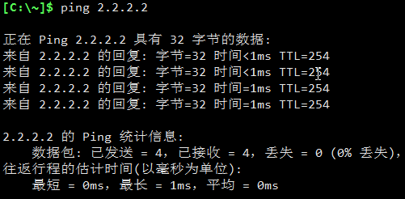

- R2的e0/0口抓包，可以看到确实是由100.12.12.3来访问的目的地


- 在网关上查看nat的映射关系

```
R1#sh ip nat translations 
Pro Inside global      Inside local       Outside local      Outside global
--- 100.12.12.3        192.168.1.2        ---                ---
```

- 在windows上搭建一个网站

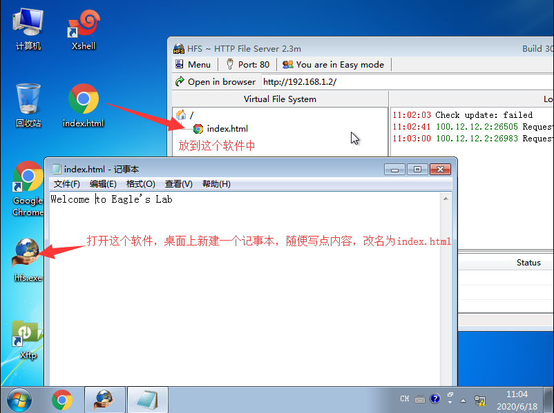

- 尝试使用R2来模拟用户访问100.12.12.3是否能打得开

```
R2#telnet 100.12.12.3 80
Trying 100.12.12.3, 80 ... Open
GET /index.html HTTP/1.1

HTTP/1.1 200 OK
Content-Type: text/html
Content-Length: 22
Accept-Ranges: bytes
Server: HFS 2.3m
Set-Cookie: HFS_SID_=0.823777113575488; path=/; HttpOnly
ETag: E7859486A427E189D004529E3CB873B6
Last-Modified: Thu, 18 Jun 2020 03:04:14 GMT
Content-Disposition: filename="index.html";

Welcome to Eagle's Lab[Connection to 100.12.12.3 closed by foreign host]	# 内容正确显示
```

- 静态NAT在服务器提供商的应用场景下使用较多

## PAT(端口地址转换)

- 正常情况下我们家用宽带，或者仅仅只是有上网需求的情况下，没必要为每个设备都申请一个公网IP(也做不到)
- 在数据通信的时候只是需要一个端口号用于接收和发送数据即可，而一个IP地址可以有65535个端口号，所以将端口号轮流着分配给内网设备即可

### 拓扑


### 配置

- R1

```
R1(config)#int e0/0
R1(config-if)#ip add 100.12.12.1 255.255.255.0
R1(config-if)#no sh
R1(config-if)#ip nat out
R1(config-if)#int e0/1
R1(config-if)#ip add 192.168.1.1 255.255.255.0
R1(config-if)#no sh
R1(config-if)#ip nat in
R1(config)#ip route 0.0.0.0 0.0.0.0 100.12.12.2
R1(config-if)#access-list 1 per 192.168.1.0 /24
R1(config)#ip nat inside source list 1 interface Ethernet0/0 overload	# 匹配acl1的流量过载nat到e0/0口
```

- R2

```
R2(config)#int e0/0
R2(config-if)#ip add 100.12.12.2 255.255.255.0
R2(config-if)#no sh
R2(config-if)#int e0/1
R2(config-if)#ip add 100.23.23.2 255.255.255.0
R2(config-if)#no sh
```

- win7-1

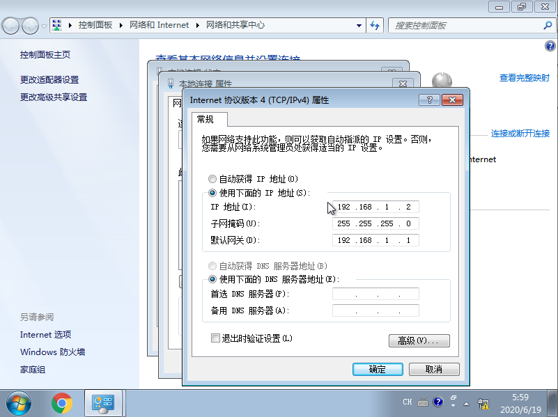

- win7-2


- win7-3


- 在win7-3上搭建一个网页来模拟服务器


### 测试

- 在win7-1和win7-2上面打开网页


- 查看nat表

```
R1#sh ip nat tr
Pro Inside global      Inside local       Outside local      Outside global
tcp 100.12.12.1:1024   192.168.1.2:49166  100.23.23.3:80     100.23.23.3:80
tcp 100.12.12.1:1025   192.168.1.2:49167  100.23.23.3:80     100.23.23.3:80
tcp 100.12.12.1:49166  192.168.1.3:49166  100.23.23.3:80     100.23.23.3:80
tcp 100.12.12.1:49167  192.168.1.3:49167  100.23.23.3:80     100.23.23.3:80
tcp 100.12.12.1:49168  192.168.1.3:49168  100.23.23.3:80     100.23.23.3:80
```

# 端口映射

- NAT会导致只能内网主动访问外网，而互联网没法主动访问内部网络，这样虽然保护了内部网络，但是却丢失了端到端通信的过程
- 端口映射可以将公网IP地址的端口对应到内网某个IP的端口号，从而让内网的设备也可以对外发布服务
- 端口映射可以让内网多个IP地址共用一个公网IP，可以节约很多成本

## 拓扑


- 那个cloud上面的eth1接口如果不知道怎么调整出来，说明你没认真听老师上课！

## 配置

- R1

```
R1(config)#int e0/0
R1(config-if)#ip add dhcp   
R1(config-if)#no sh
R1(config-if)#ip nat out
R1(config-if)#int e0/1
R1(config-if)#ip add 
R1(config-if)#ip add 192.168.1.1 255.255.255.0
R1(config-if)#no sh
R1(config-if)#ip nat in
R1(config-if)#acc 1 per 192.168.1.0 /24
R1(config)#ip nat in so li 1 int e0/0 over
```

- win7-1


## 验证配置

- 如果你一切顺利，那么win7-1就已经可以正常访问互联网了


## 搭建web服务

- 将win7-1当作服务器，在上面搭建服务


## 启用远程桌面


- 设置用户密码，因为windows默认不给没密码的用户远程登录


## 端口映射

- 因为网页需要被各种用户访问，所以最好端口使用大家都公认的端口，web使用的是80端口

R1(config)#ip nat inside source static tcp 192.168.1.2 80 interface e0/0 80

- 使用自己的电脑浏览器访问R1的e0/0接口，如果打开了网页，说明映射成功


- 由于远程桌面不需要客户访问，为了安全起见，最好不要放在大家都公认的端口，这样容易被黑客扫描和破解
- 需要注意，默认远程桌面用的端口号是3389，并且tcp和udp都会使用

```
R1(config)#ip nat inside source static tcp 192.168.1.2 3389 int e0/0 23333   
R1(config)#ip nat inside source static udp 192.168.1.2 3389 int e0/0 23333
```

- 在自己电脑上远程桌面R1的e0/0接口的23333端口
- 远程桌面是在自己的电脑上运行mstsc后即可打开远程桌面连接软件

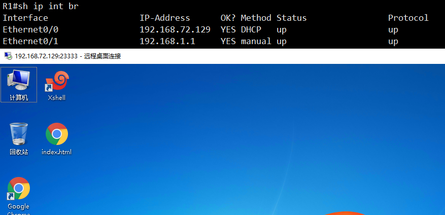

# 负载均衡

- NAT也支持对公网IP地址的请求，分发给内部的设备来进行处理

## 拓扑


- R1配置好正常的SNAT(源IP地址转换)，保障两台windows能正常访问互联网
- win7-1的IP地址是192.168.1.2/24，win7-2的IP地址是192.168.1.3/24
- 在两台windows上都搭建好网站，网站内容有所区分

## NAT负载均衡配置

- R1

```
R1(config)#access-list 2 permit 192.168.72.129
R1(config)#ip nat pool webservers 192.168.1.2 192.168.1.3 netmask 255.255.255.0 type rotary
R1(config)#ip nat inside destination list 2 pool webservers
```

1. 将被访问的公网地址匹配出来，本案例中是R1的e0/0接口
2. 配置web服务器地址池，在地址池中将服务器的IP地址都加入，然后配置地址池是轮询着响应请求
3. 当访问的目的地是acl2中匹配的地址时，将目的IP转换为地址池中给的地址

## 检查结果

- 使用自己电脑的浏览器多次访问R1的e0/0接口的IP地址，会发现由两台服务器轮询着响应请求

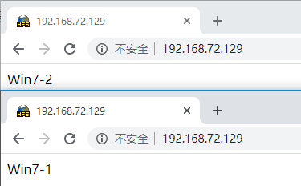


# 拓扑


# 需求

1. 运营商网络要实现全网互联，并且所有路由器都可以ping通公网的某个IP
2. R3作为DNS服务器，需要回应对test.com的请求，指向R5
3. 用户网络中的PC要能上网
4. 用户网络浏览器多次访问test.com可以看到不同的服务器回应
5. 用户网络无法ping通R5