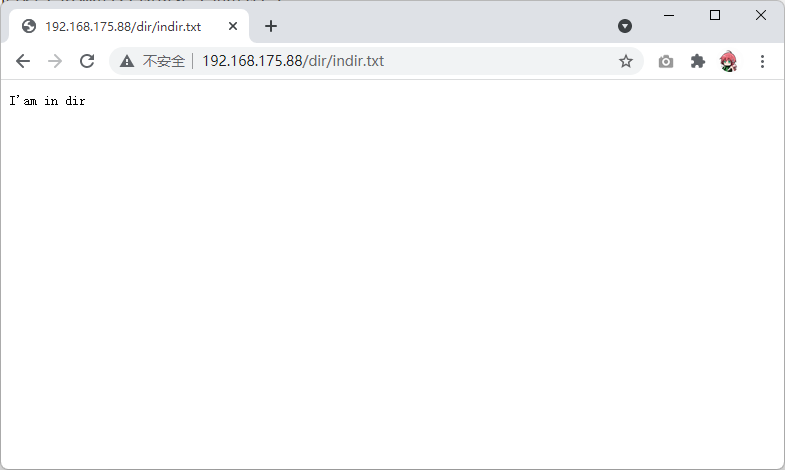
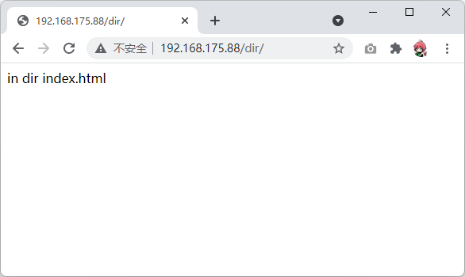
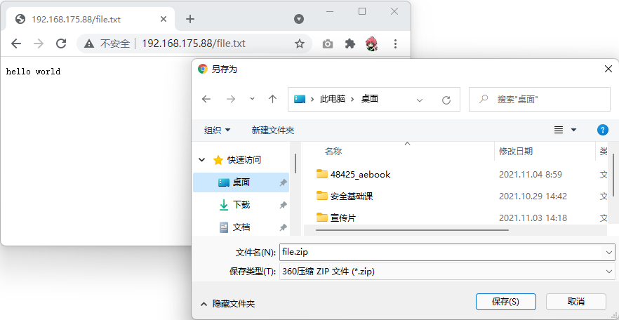
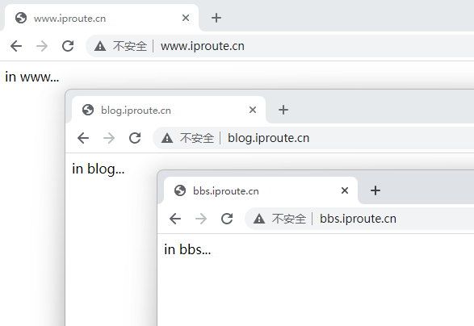

# Nginx介绍

Nginx：engine X ，2002年开始开发，2004年开源，2019年3⽉11⽇，Nginx公司被F5 Networks以6.7亿美元收购。

Nginx 则是免费的、开源的、⾼性能的HTTP和反向代理服务器、邮件代理服务器、以及TCP/UDP代理服务器 解决[C10K问题](https://www.ideawu.net/blog/archives/740.html)（10K Connections）

Nginx官⽹：[http://nginx.org](http://nginx.org/)

Nginx 商业版为Nginx Plus：https://www.nginx.com/products/nginx/

- nginx的其它的⼆次发⾏版：
  - Tengine：由淘宝⽹发起的Web服务器项⽬。它在Nginx的基础上，针对⼤访问量⽹站的需求，添加了很多⾼级功能和特性。Tengine的性能和稳定性已经在⼤型的⽹站如淘宝⽹，天猫商城等得到了很好的检验。它的最终⽬标是打造⼀个⾼效、稳定、安全、易⽤的Web平台，从2011年12⽉开始，Tengine成为⼀个开源项⽬，官⽹http://tengine.taobao.org/
  - OpenResty：基于 Nginx 与 Lua 语⾔的⾼性能 Web 平台， 章亦春团队开发，官⽹：http://openresty.org/cn/

## Nginx的作用

Nginx的作用非常的多，算是企业软件中的“变形金刚”，我们现在不需要过多的纠结Nginx的作用，在基础课程中我们只要知道一个事情，就是Nginx可以作为网页服务器，为我们电脑提供网站服务

## Nginx使用过程

我们在后续的学习过程中，Nginx是非常重要的知识点，也是IT技术人员必会的技能之一，所以关于Nginx的运行原理也是需要我们在后续的课程中深入了解的。

本次基础课程我们针对Nginx的网站服务做简单讲解和练习

- Nginx安装
- 了解Nginx的网站根目录
- 了解vhosts作用
- 配置vhosts

# Nginx安装

Nginx支持windows和Linux系统，但是在企业中99.9999%都是部署在Linux中的，我们需要打开Linux虚拟机，然后远程连接上去，在命令行中敲如下代码

```bash
# 默认情况下，kali linux自带nginx
┌──(root㉿kali)-[~]
└─# systemctl enable nginx --now
```

# 网站相关的内容

## 输入网址之后发生了什么

[有一篇博客](https://iproute.cn/2020/03/13/%E8%BE%93%E5%85%A5URL%E5%9B%9E%E8%BD%A6%E4%B9%8B%E5%90%8E%E5%8F%91%E7%94%9F%E4%BA%86%E4%BB%80%E4%B9%88%EF%BC%9F/)

## 域名

### DNS的诞生

DNS(Domain Name System) 是一套从域名到IP的映射系统。 

在网络中要确定一台主机，可以通过IP地址来做到。但是IP地址不方便记忆， 于是人们发明了一种叫主机名的东西 。

最初时候人们把主机名和IP地址的对应关系都写在一个hosts文件里面，然后这个hosts文件由“互联网信息中心（SRI-NIC）”来管理和分发。也就是人们需要定期更新hosts文件。这个文件目前在windows系统的`C:\Windows\System32\drivers\etc\hosts`中。

时间长了，这个Hosts的机制并不好用，而且更新不及时，主机名多了之后hosts文件太大了，后来就不用这个机制了。

人们后来改用域名解析系统DNS

- 一个组织的系统管理机构，维护系统内的每个主机的`IP和主机名`的对应关系
- 如果新计算机接入网络，将这个信息注册到`数据库`中
- 用户输入域名的时候，会自动查询`DNS`服务器，由`DNS服务器`检索数据库, 得到对应的IP地址。

### 域名

主域名是用来识别主机名称和主机所属的组织机构的一种分层结构的名称。
例如：http://www.baidu.com(域名使用.连接)

- com： 一级域名，表示这是一个企业域名。同级的还有 "net"(网络提供商)，"org"(非盈利组织) 等。
- baidu: 二级域名, 公司名。
- www: 只是一种习惯用法，并不是每个域名都支持。
- http:// :  要使用什么协议来连接这个主机名。

### 域名解析的过程

1. 浏览器发起域名解析，首先查询浏览器缓存，如果没有，就查询hosts文件，如果没有就提出域名解析请求
2. 客户机提出域名解析请求，并将该请求发送给本地的域名服务器。
3. 当本地的域名服务器收到请求后,就先查询本地的缓存,如果有该纪录项,则本地的域名服务器就直接把查询的结果返回。
4. 如果本地的缓存中没有该纪录,则本地域名服务器就直接把请求发给根域名服务器,然后根域名服务器再返回给本地域名服务器一个所查询域(根的子域)的主域名服务器的地址。
5. 本地服务器再向上一步返回的域名服务器发送请求,然后接受请求的服务器查询自己的缓存,如果没有该纪录,则返回相关的下级的域名服务器的地址。
6. 重复第四步,直到找到正确的纪录。
7. 本地域名服务器把返回的结果保存到缓存,以备下一次使用,同时还将结果返回给客户机

### 查看域名解析的工具

nslookup

windows上在`cmd`中直接输入使用

```
C:\Users\Aaron>nslookup iproute.cn
服务器:  public1.114dns.com
Address:  114.114.114.114

非权威应答:
名称:    cqfz53.coding-pages.com
Address:  124.156.193.111
Aliases:  iproute.cn
```

## 网站根目录

网站根目录是用来存放网页文件的，把你想让别人访问的资源放在这个目录中，让别人通过URL来定位这些资源进行访问

Nginx默认的网站根目录是在`/usr/share/nginx/html/`中，但 kali 默认是 /var/www/html/

```bash
# 在Nginx的网站目录下创建一个文件
cd /var/www/html
vim file.txt
hello world
```

创建好了之后，我们就可以启动Nginx服务了，在我们的浏览器中可以访问这个文件了

```bash
# 启动Nginx服务
systemctl start nginx
```

如果这个时候你浏览器访问的是`http://192.168.175.88/file.txt`，这个IP地址是我当前虚拟机的IP！


相信各位同学也发现了，我们可以在IP地址后面加上对应的文件名，来访问网站根目录下的文件，下面我们可以尝试在网站根目录下创建文件夹

```bash
# 创建一个文件夹，并且在文件夹中放入一个文件
cd /var/www/html
mkdir dir
cd dir
vim indir.txt
I'am in dir
```

那么你访问这个资源的方式将是下面的样子



结论就是，我们在地址后面加上文件的路径和文件名，就可以正确的访问我们在网站服务器上的资源。

## 默认文件

有些网站并不是在地址后面一定是一个文件，我们也见过这样的网址


这样的网站地址并没有定位到一个文件，而是只定位到了一个文件夹，这个是因为如果没有指定文件Nginx会尝试打开你访问目录下的默认文件，默认文件名往往叫`index.html`，如果在目录中有`index.html`，那么在访问路径资源的时候就可以不用指定文件名。

```bash
# 在dir文件夹中创建index.html
# cd不是必须的，这个是防止有的同学并没有在网站根目录下，就直接创建了文件
cd /var/www/html/dir/
vim index.html
in dir index.html
```



如果访问某个目录，这个目录下没有默认的文件，那么会出现如下错误

可以在/etc/nginx/nginx.conf中加入

```bash
autoindex on;
```

来给予nginx枚举文件的权限，没权限的话就会出现403报错


# 支持的资源

先说结论，只要是浏览器支持的资源类型，都可以支持

但是...

目前我们浏览器在没安装任何额外的软件情况下，最主要支持的文件如下

- 网页文件
  - html、css、js
  - xml、json
  - 等等
- 媒体文件
  - 视频：mp4、swf等等
  - 音频：mp3等等
  - 图片：jpg，png，svg等等
- 文档
  - txt、pdf等等

其他的大多数文件，都会默认是做下载处理

我们可以尝试一下，在根目录放一个压缩包

```bash
# cd不是必须的，这个是防止有的同学并没有在网站根目录下，就直接创建了文件
cd /usr/share/nginx/html/

# 创建一个空文件，假装是压缩包，浏览器是看文件的后缀名来判断的
touch file.zip
```

浏览器访问这个zip文件，会发现是默认情况下是下载



# 搭建游戏小网站

英格科技准备好了一个flash小游戏网站，我们可以下载到网站根目录下

```bash
# cd不是必须的，这个是防止有的同学并没有在网站根目录下，就直接开始文件操作
cd /var/www/html

# 下载英格科技准备好的网页小游戏源代码，也可以手动访问这个http://file.eagleslab.com:8889/地址获取
wget http://file.eagleslab.com:8889/课程相关软件/云计算课程/课程相关文件/games.zip

# 解压
unzip games.zip

# games文件夹的目录结构如下
[root@localhost html]# tree -C -L 1 games
games
├── game
├── index_files
└── index.html
```

我们可以看到games的index.html文件，在games的目录中，所以我们浏览器需要访问`http://192.168.175.88/games`


# 虚拟主机

如果一台服务器一个IP地址仅仅只搭建一个网站是非常浪费的，我们可以让Nginx搭建多个网站，然后根据我们浏览器访问的域名来判断应该回应我们哪一个页面，这种功能就被称之为虚拟主机

我们先创建三个文件夹用于存放三个不同网站的内容

```bash
# 为了方便使用，我们把网站目录创建在根目录下
mkdir -p /html/www/
mkdir -p /html/bbs/
mkdir -p /html/blog/

[root@localhost ~]# tree /html/
/html/
├── bbs
├── blog
└── www
```

Nginx会主动加载`/etc/nginx/conf.d`目录中的配置文件，我们可以将不同网站的配置文件放在这个目录中

```bash
# 创建用于存放网站主页文件的配置文件
vim /etc/nginx/conf.d/www.conf
server {
  listen 80;
  server_name www.iproute.cn;
  location / {
    root /html/www;
    index index.html;
  }
}
```

关于这个配置文件中的解释如下：

- server
  - 开始服务器配置
- listen
  - 这个网站的端口号
  - 默认是80端口，如果不是80端口，那么在访问的时候就需要加上端口号
- server_name
  - 如果访问的是这个域名，那么将会是此配置文件生效
- root
  - 网站根目录
- index
  - 默认的打开的文件

依照上面的格式，创建好额外的两个文件

```bash
# 创建论坛相关的配置文件
vim /etc/nginx/conf.d/bbs.conf
server {
  listen 80;
  server_name bbs.iproute.cn;
  location / {
    root /html/bbs;
    index index.html;
  }
}

# 创建博客相关的配置文件
vim /etc/nginx/conf.d/blog.conf
server {
  listen 80;
  server_name blog.iproute.cn;
  location / {
    root /html/blog;
    index index.html;
  }
}

# 创建好后进行检查
[root@localhost ~]# ls -lh /etc/nginx/conf.d/
总用量 12K
-rw-r--r--. 1 root root 115 11月  4 14:35 bbs.conf
-rw-r--r--. 1 root root 117 11月  4 14:36 blog.conf
-rw-r--r--. 1 root root 115 11月  4 14:33 www.conf

# 检查nginx配置文件是否语法错误
[root@localhost ~]# nginx -t
nginx: the configuration file /etc/nginx/nginx.conf syntax is ok
nginx: configuration file /etc/nginx/nginx.conf test is successful

# 加载配置文件
nginx -s reload
```

下面准备好三个网站的网页内容，我们下次才会学习动态网站环境搭建，这边我们就先用自己写的页面测试效果

```bash
# 准备好三个网站的内容
cat << EOF > /html/www/index.html
in www...
EOF

cat << EOF > /html/bbs/index.html
in bbs...
EOF

cat << EOF > /html/blog/index.html
in blog...
EOF
```

正常情况下，我们应该去购买一个域名，并且在域名主机商那边解析到我们的IP地址上，但是这边我们只是学习测试的，我们可以修改自己本机的hosts文件，来让我们的电脑可以成功解析到这个地址上

用记事本编辑我们电脑上的`C:\Windows\System32\drivers\etc\hosts`文件，在最后加上(注意，这边的IP是虚拟机的IP，域名是我上面配置文件里面写的三个域名)

```bash
192.168.175.88 www.iproute.cn
192.168.175.88 bbs.iproute.cn
192.168.175.88 blog.iproute.cn
```

如果大家都配置正确，那么最后效果如下




