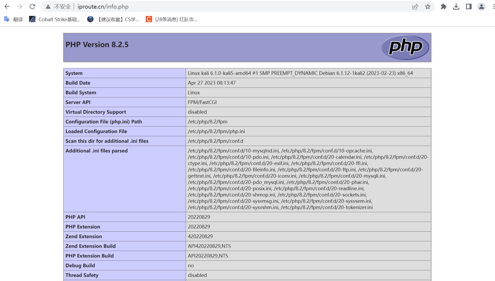
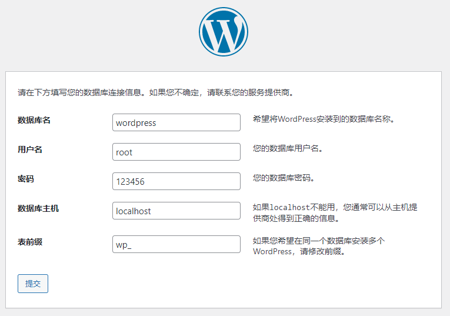

# LNMP架构概述

## 什么是LNMP

LNMP是一套技术的组合，L=Linux、N=Nginx、M~=MySQL、P=PHP

## LNMP架构是如何工作的

- 首先nginx服务是不能请求动态请求，那么当用户发起动态请求时，nginx无法处理
- 当用户发起http请求，请求会被nginx处理，如果是静态资源请求nginx则直接返回，如果是动态请求nginx则通过fastcgi协议转交给后端的PHP程序处理


## Nginx与fastcgi详细工作流程


1. 用户通过http协议发起请求，请求会先抵达LNMP架构中的nginx；
2. nginx会根据用户的请求进行location规则匹配；
3. location如果匹配到请求是静态，则由nginx读取本地直接返回；
4. location如果匹配到请求是动态，则由nginx将请求转发给fastcgi协议；
5. fastcgi收到请求交给php-fpm管理进程，php-fpm管理进程接收  到后会调用具体的工作进程wrapper；
6. wrapper进程会调用PHP程序进行解析，如果只是解析代码，php直接返回；
7. 如果有查询数据库操作，则由php连接数据库（用户 密码 ip）发起查询的操作；
8. 最终数据由mysql-->php-->php-fpm-->fastcgi-->nginx-->http-->user

# LNMP架构环境部署

## 使用官方仓库安装nginx

```bash
┌──(root㉿kali)-[/html]
└─# systemctl enable nginx --now
```

## 修改nginx用户

```bash
[root@localhost ~]# groupadd www -g 666
[root@localhost ~]# useradd www -u 666 -g 666 -s /sbin/nologin -M
[root@localhost ~]# sed -i '/^user/c user www;' /etc/nginx/nginx.conf
```

vim /etc/nginx/nginx.conf 可以看到user变成www

## 启动nginx并加入开机自启

```bash
[root@localhost ~]# systemctl restart nginx
```

## 使用第三方扩展源安装php

更换国内源

```
vim /etc/apt/sources.list

#中科大
deb http://mirrors.ustc.edu.cn/kali kali-rolling main non-free contrib
deb-src http://mirrors.ustc.edu.cn/kali kali-rolling main non-free contrib
#阿里云
#deb http://mirrors.aliyun.com/kali kali-rolling main non-free contrib
#deb-src http://mirrors.aliyun.com/kali kali-rolling main non-free contrib
#清华大学
#deb http://mirrors.tuna.tsinghua.edu.cn/kali kali-rolling main contrib non-free
#deb-src https://mirrors.tuna.tsinghua.edu.cn/kali kali-rolling main contrib non-free
#浙大
#deb http://mirrors.zju.edu.cn/kali kali-rolling main contrib non-free
#deb-src http://mirrors.zju.edu.cn/kali kali-rolling main contrib non-free
#东软大学
#deb http://mirrors.neusoft.edu.cn/kali kali-rolling/main non-free contrib
#deb-src http://mirrors.neusoft.edu.cn/kali kali-rolling/main non-free contrib
#重庆大学
#deb http://http.kali.org/kali kali-rolling main non-free contrib
#deb-src http://http.kali.org/kali kali-rolling main non-free contrib

```


```bash
┌──(root㉿kali)-[/html]
└─# apt -y install php-fpm

┌──(root㉿kali)-[/html]
└─# systemctl start php8.2-fpm.service

┌──(root㉿kali)-[/html]
└─# systemctl enable php8.2-fpm.service
┌──(root㉿kali)-[/html]
└─# apt -y install php8.2-mysql

┌──(root㉿kali)-[/html]
└─# vim /etc/php/8.2/fpm/pool.d/www.conf

;listen = /run/php/php8.2-fpm.sock
listen = 9000
```


用yum info php命令查看版本

## 配置php-fpm用户与nginx的运行用户保持一致

```bash
[root@localhost ~]# sed -i '/^user/c user = www' /etc/php/8.2/fpm/pool.d/www.conf
[root@localhost ~]# sed -i '/^group/c user = www' /etc/php/8.2/fpm/pool.d/www.conf
```

## 启动php-fpm并加入开机自启

```bash
┌──(root㉿kali)-[/html]
└─# systemctl restart php8.2-fpm.service
```

## 安装mariadb数据库

```bash
┌──(root㉿kali)-[/html]
└─# systemctl enable --now mysql

[root@localhost ~]# mysqladmin password '123456'
[root@localhost ~]# mysql -uroot -p123456
```

# LNMP架构环境配置

- 在将nginx与PHP集成的过程中，需要先了解fastcgi代理配置语法

## 设置fastcgi服务器的地址

- 该地址可以指定为域名或IP地址，以及端口

```bash
Syntax: fastcgi_pass address;
Default:-
Context:location,if in location
#语法示例
fastcgi_pass location:9000;
fastcgi_pass unix:/tmp/fastcgi.socket;
```

## 设置fastcgi默认的首页文件

- 需要结合fastcgi_param一起设置

```bash
Syntax: fastcgi_index name;
Default:-
Context:http,server,location
```

## 通过fastcgi_param设置变量

- 将设置的变量传递到后端的fastcgi服务器

```bash
Syntax: fastcgi_param parameter value [if_not_empty];
Default:-
Context:http,server,location
#语法示例
fastcgi_index index.php;
fastcgi_param SCRIPT_FILENAME /code$fastcgi_script_name;
```

## fastcgi_index与fastcgi_param的作用

## Nginx连接Fastcgi服务器配置

```bash
[root@localhost ~]# vim /etc/nginx/conf.d/www.conf
server {
        listen 80;
        server_name www.iproute.cn;
        root /html/www;

        location / {
                index index.php index.html;
         }

        location ~ \.php$ {
                fastcgi_pass 127.0.0.1:9000;
                fastcgi_param SCRIPT_FILENAME $document_root$fastcgi_script_name; #资源的路径+脚本的名字
                include fastcgi_params;
         }
}
[root@localhost ~]# nginx -t
nginx: the configuration file /etc/nginx/nginx.conf syntax is ok
nginx: configuration file /etc/nginx/nginx.conf test is successful
[root@localhost ~]# systemctl restart nginx
```

一定要关闭selinux： setenforce 0，也要本地hosts文件配置URL。

## 测试Fastcgi是否正常

```bash
[root@localhost ~]# vim /html/www/info.php
<?php
    phpinfo();
?>
```




## 测试数据库连接

```bash
[root@localhost ~]# vim /html/www/info.php
<?php
    $servername = "localhost";
    $username = "root";
    $password = "123456";

    // 创建连接
    $conn = mysqli_connect($servername, $username, $password);

    // 检测连接
    if (!$conn) {
         die("Connection failed: " . mysqli_connect_error());
    }
    echo "连接MySQL...成功！";
?>
```


# 部署WordPress

## 配置Nginx虚拟主机站点

- 部署博客产品WordPress配置Nginx虚拟主机站点，域名为blog.iproute.cn

```bash
[root@localhost ~]# vim /etc/nginx/conf.d/blog.conf
server {
        listen 80;
        server_name blog.iproute.cn;
        root /html/blog/wordpress;
        index index.php index.html;

        location ~ \.php$ {
                fastcgi_pass   127.0.0.1:9000;
                fastcgi_index  index.php;
                fastcgi_param  SCRIPT_FILENAME $document_root$fastcgi_script_name;
                include fastcgi_params;
        }
}
[root@localhost code]# nginx -t
[root@localhost code]# systemctl restart nginx
```

## 下载wordpress源码

```bash
[root@localhost ~]# cd /html/blog
[root@localhost code]# wget https://cn.wordpress.org/latest-zh_CN.tar.gz
[root@localhost code]# tar xzvf latest-zh_CN.tar.gz
[root@localhost code]# chown -R www:www /html
```


## 创建所需数据库

- 由于wordpress产品需要依赖数据库,所以需要手动建立数据库

```bash
[root@localhost ~]# mysql -uroot -p123456 -e "create database wordpress;show databases;"
+--------------------+
| Database           |
+--------------------+
| information_schema |
| mysql              |
| performance_schema |
| test               |
| wordpress          |
+--------------------+
```

## 配置wordpress





## 设置文件上传大小限制

- 解决nginx上传文件大小限制，413错误

```bash
[root@localhost ~]# vim /etc/nginx/conf.d/blog.conf
server {
        listen 80;
        server_name blog.test.com;
        root /html/blog/wordpress;
        index index.php index.html;
        client_max_body_size 100m; 

        location ~ \.php$ {
                root /code/wordpress;
                fastcgi_pass   127.0.0.1:9000;
                fastcgi_index  index.php;
                fastcgi_param  SCRIPT_FILENAME $document_root$fastcgi_script_name;
                include fastcgi_params;
        }
}
[root@localhost ~]# nginx -t
[root@localhost ~]# systemctl restart nginx
```

- 测试大文件上传


PHP对文件大小有限制，需要vim /etc/php/8.2/fpm/php.ini 将upload_max_filesize = 2M修改成100M；

以及post_max_size = 8M修改成100M；

修改完重启 php

