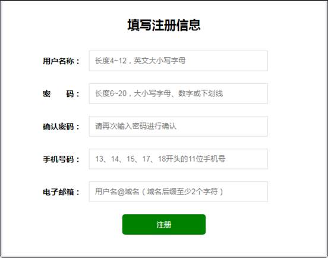
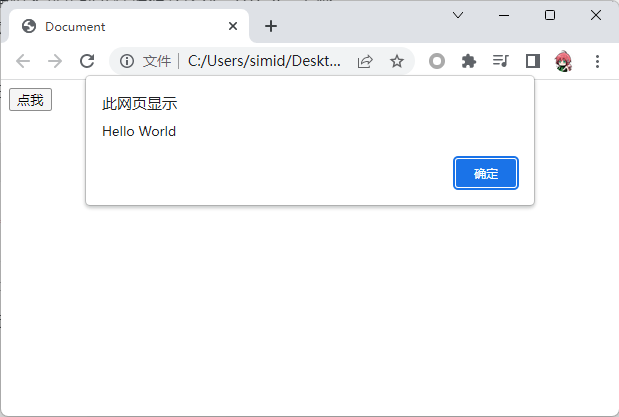
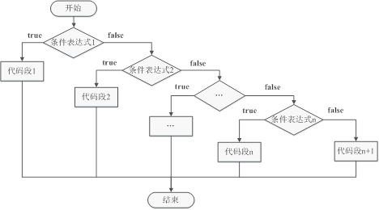
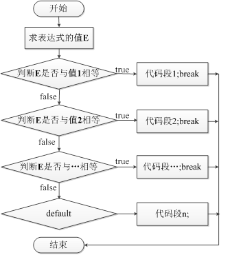
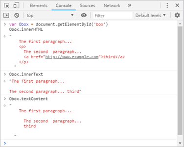
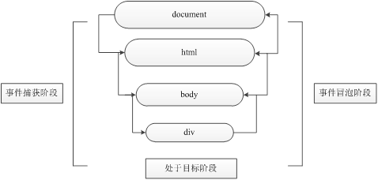
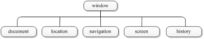

# JavaScript概述
JavaScript是Web开发领域中的一种功能强大的编程语言，主要用于开发交互式的Web页面。在计算机、手机等设备上浏览的网页，其大多数的交互逻辑几乎都是由JavaScript实现的。
对于制作一个网页而言，HTML、CSS和JavaScript分别代表了结构、样式和行为，结构是网页的骨架，样式是网页的外观，行为是网页的交互逻辑

| **语言** | **作用** | **说明** |
| --- | --- | --- |
| HTML | 结构 | 决定网页的结构和内容，相当于人的身体 |
| CSS | 样式 | 决定网页呈现给用户的模样，相当于给人穿衣服、化妆 |
| JavaScript | 行为 | 实现业务逻辑和页面控制，相当于人的各种动作 |

JavaScript内嵌于HTML网页中，通过浏览器内置的JavaScript引擎进行解释执行，把一个原本只用来显示的页面转变成支持用户交互的页面程序。
在1995年时，Netscape（网景）公司（现在的Mozilla）的布兰登·艾奇（Brendan Eich）在网景导航者浏览器上首次设计出了JavaScript。Netscape最初将这个脚本语言命名为LiveScript，后来Netscape公司与Sun公司（2009年被Oracle公司收购）合作之后将其改名为JavaScript，这是由于当时Sun公司推出的Java语言备受关注，Netscape公司为了营销借用了Java这个名称，但实际上JavaScript与Java的关系就像“雷锋”与“雷峰塔”，它们本质上是两种不同的编程语言。
在设计之初，JavaScript是一种可以嵌入到网页中的编程语言，用来控制浏览器的行为。例如，直接在浏览器中进行表单验证，用户只有填写格式正确的内容后才能够提交表单。这样避免了用户因表单填写错误导致的反复提交，节省了时间和网络资源。



现在，JavaScript的用途已经不仅局限于浏览器了。Node.js的出现使得开发人员能够在服务器端编写JavaScript代码，使得JavaScript的应用更加广泛，而本书主要针对浏览器端的JavaScript基础进行讲解。学习了JavaScript基础之后，读者可以深入学习三大主流框架Vue.js、Angular、React，或者进行前端开发、小程序开发，或者混合App的开发。推荐读者在掌握JavaScript语言基础后再学习更高级的技术。
JavaScript是由ECMAScript、DOM、BOM三部分组成的

- ECMAScript：是JavaScript的核心。ECMAScript规定了JavaScript的编程语法和基础核心内容，是所有浏览器厂商共同遵守的一套JavaScript语法工业标准。
- DOM：文档对象模型，是W3C组织推荐的处理可扩展标记语言的标准编程接口，通过DOM提供的接口，可以对页面上的各种元素进行操作（如大小、位置、颜色等）。
- BOM：浏览器对象模型，它提供了独立于内容的、可以与浏览器窗口进行互动的对象结构。通过BOM，可以对浏览器窗口进行操作（如弹出框、控制浏览器导航跳转等）。

## 代码引入方式
### 行内式

行内式是指将单行或少量的JavaScript代码写在HTML标签的事件属性中（也就是以on开头的属性，如onclick）。下面通过具体操作步骤进行演示。

（1）创建一个简单的HTML页面，将文件命名为demo01.html。

（2）编写demo01.html，具体代码如下。

```html
<!DOCTYPE html>
<html lang="en">
<head>
    <meta charset="UTF-8">
    <title>Document</title>
</head>
<body>
    
</body>
</html>
```

在上述代码中，第4行声明了网页的编码为UTF-8，帮助浏览器正确识别网页的编码。在声明编码后，还需要确保文件本身的编码也是UTF-8。目前大多数代码编辑器新建的文件编码默认都是UTF-8。另外，Windows记事本默认的编码是ANSI，在记事本中编写的网页容易出现乱码，因此读者应杜绝使用记事本编写代码文件。

（3）使用行内式编写JavaScript代码，实现单击一个按钮后，弹出一个警告框，显示一些提示信息，具体代码如下。

```html
<body>
    <input type="button" value="点我" onclick="alert('Hello World')">
</body>
```

在上述代码中，写在onclick属性里的代码就是JavaScript代码。

（4）通过浏览器访问demo01.html，运行结果如图所示。



以上步骤演示了行内式的使用。在实际开发中，使用行内式还需要注意以下4点。
① 注意单引号和双引号的使用。在HTML中推荐使用双引号，而JavaScript推荐使用单引号。
② 行内式可读性较差，尤其是在HTML中编写大量JavaScript代码时，不方便阅读。
③ 在遇到多层引号嵌套的情况时，非常容易混淆，导致代码出错。
④ 只有临时测试，或者特殊情况下再使用行内式，一般情况下不推荐使用行内式。

### 内嵌式（嵌入式）
内嵌式是使用`<script>`标签包裹JavaScript代码，`<script>`标签可以写在`<head>`或`<body>`标签中。通过内嵌式，可以将多行JavaScript代码写在`<script>`标签中。内嵌式是学习JavaScript时最常使用的方式。
下面我们通过具体操作步骤进行演示。
（1）创建demo02.html，用来编写内嵌式JavaScript代码，示例代码如下。

```html
<head>
    <meta charset="UTF-8">
    <title>Document</title>
    <script>
        alert("Hello World")
    </script>
</head>
```
在上述代码中，第4行是一条JavaScript语句，其末尾的分号“;”表示该语句结束，后面可以编写下一条语句。`<script>`标签还有一个type属性，在HTML 5中该属性的默认值为“text/javascript”，因此在编写时可以省略type属性。

（2）通过浏览器访问demo02.html，页面一打开后，就会自动弹出一个警告框，提示信息为“Hello World”。

### 外部式（外链式）
外部式是指将JavaScript代码写在一个单独的文件中，一般使用“js”作为文件的扩展名，在HTML页面中使用`<script>`标签进行引入，适合JavaScript代码量比较多的情况。
外部式有利于HTML页面代码结构化，把大段的JavaScript代码独立到HTML页面之外，既美观，也方便文件级别的代码复用。需要注意的是，外部式的`<script>`标签内不可以编写JavaScript代码。
下面我们通过具体操作步骤进行演示。

（1）创建demo03.html，用来编写外部式JavaScript代码，示例代码如下。

```html
<head>
    <meta charset="UTF-8">
    <title>Document</title>
    <script src="test.js"></script>
</head>
```

（2）创建test.js文件，在文件中编写JavaScript代码，如下所示。

```html
alert("Hello World")
```

（3）通过浏览器访问demo03.html，页面一打开后，就会自动弹出一个警告框，提示信息为“Hello World”。
## 注释
在JavaScript开发过程中，使用注释更有利于代码的可读性。注释在程序解析时会被JavaScript解释器忽略。JavaScript支持单行注释和多行注释，具体示例如下。

- 单行注释“//”
- 多行注释“/* */”
## 输入和输出语句
常用的输入和输出语句

| **语句** | **说明** |
| --- | --- |
| alert('msg') | 浏览器弹出警告框 |
| console.log('msg') | 浏览器控制台输出信息 |
| prompt('msg') | 浏览器弹出输入框，用户可以输入内容 |

# JavaScript基础
## 变量
声明变量
```javascript
var age;
```
变量赋值
```javascript
var age;        // 声明变量
age = 10;        // 为变量赋值
```
在为变量赋值以后，可以用输出语句输出变量的值
```javascript
alert(age);       // 使用alert()警告框输出age的值
console.log(age);    // 将age的值输出到控制台中
```
变量的初始化
声明一个变量并为其赋值，这个过程就是变量的初始化。
```javascript
var age = 18;
```
同时声明多个变量
```javascript
var myName, age, email; // 同时声明多个变量，不赋值
var myName = '小明',
  age = 18,
  email = 'xiaoming@localhost';
// 同时声明多个变量，并赋值 
```
只声明变量，但不赋值，则输出变量时，结果为undefined
```javascript
var age;
console.log(age);  // 输出结果：undefined
```
不声明变量，直接输出变量的值，则程序会出错

在对变量进行命名时，需要遵循变量的命名规范，从而避免代码出错，以及提高代码的可读性
① 由字母、数字、下划线和美元符号（$）组成，如age、num。
② 严格区分大小写，如app和App是两个变量。
③ 不能以数字开头，如18age是错误的变量名。
④ 不能是关键字、保留字，如var、for、while等是错误的变量名。
⑤ 要尽量做到“见其名知其意”，如age表示年龄，num表示数字。
⑥ 建议遵循驼峰命名法，首字母小写，后面的单词首字母大写，如myFirstName。

在JavaScript中，关键字分为“保留关键字”和“未来保留关键字”。保留关键字是指在JavaScript语言中被事先定义好并赋予特殊含义的单词，不能作为变量名使用。下面我们列举一些常见的保留关键字

| **break** | **Case** | **catch** | **class** |
| --- | --- | --- | --- |
| const | Continue | debugger | default |
| delete | Do | else | export |
| extends | Finally | for | function |
| if | Import | in | instanceof |
| new | Return | super | switch |
| this | Throw | try | typeof |
| var | Void | while | with |
| yield | - | - | - |

未来保留关键字是指ECMAScript规范中预留的关键字，目前它们没有特殊功能，但是在未来的某个时间可能会加上。

| **enum** | **implements** | **package** | **public** |
| --- | --- | --- | --- |
| interface | private | static | let |
| protected | - | - | - |

## 数据类型
JavaScript是一种弱类型语言，不用提前声明变量的数据类型。在程序运行过程中，变量的数据类型会被自动确定。
JavaScript中的数据类型分为两大类，分别是基本数据类型和复杂数据类型（或称为引用数据类型）。


数字型（Number)，包含整型值和浮点型值

```javascript
var num1 = 21;    // 整型值
var num2 = 0.21;   // 浮点型值
```
布尔型（Boolean），包含true和false两个布尔值
```javascript
var bool1 = true ;  // 表示真、1、成立
var bool2 = false;  // 表示假、0、不成立
```
字符串（String）型，用单引号或双引号包裹
```javascript
var str1 = '';    // 空字符串
var str2 = 'abc';  // 单引号包裹的字符串abc
var str3 = "abc";  // 双引号包裹的字符串abc
```
Undefined型，只有一个值undefined
```javascript
var a;        // 声明变量"a"，未赋值，此时a就是undefined
var b = undefined;  // 变量b的值为undefined
```
Null型，只有一个值null：
```javascript
var a = null;    // 变量a的值为null
```
### 数值型
JavaScript中的数字型可以用来保存整数或浮点数（小数）
```javascript
var age = 18;    // 整数
var pi = 3.14;    // 浮点数（小数）
```
常见的进制有二进制、八进制、十进制和十六进制。在一般情况下，数字都是使用十进制来表示的。在JavaScript中还可以用八进制和十六进制，具体如下。
（1）在数字开头加上0，表示八进制数。八进制数由0~7组成，逢8进位：
```javascript
var num1 = 07;
console.log(num1);  // 输出结果：7
var num2 = 010;
console.log(num2);   // 输出结果：8
```
（2）在数字开头加上0x，表示十六进制数。十六进制数由0~9，a~f组成：
```javascript
var num1 = 0x9;
console.log(num1);  // 输出结果：9
var num2 = 0xa;
console.log(num2);  // 输出结果：10
```
十六进制数中的“x”和“a~f”不区分大小写。

数字型的最大值和最小值可以用如下代码来获取。
```javascript
console.log(Number.MAX_VALUE);  // 输出结果：1.7976931348623157e+308
console.log(Number.MIN_VALUE);  // 输出结果：5e-324
```
在输出结果中，使用了科学计数法来表示，在JavaScript中可以使用科学计数法来表示数字。

数字型有3个特殊值，分别是Infinity（无穷大）、-Infinity（无穷小）和NaN（Not a Number，非数值）。下面我们通过代码演示这3种值出现的情况。
```javascript
console.log(Number.MAX_VALUE * 2);    // 输出结果：Infinity

console.log(-Number.MAX_VALUE * 2);   // 输出结果：-Infinity

console.log('abc' - 100);        // 输出结果：NaN
```
若要判断一个变量是否为非数字的类型，可以用isNaN()来进行判断，它会返回一个布尔值，返回true表示非数字，返回false表示是数字。示例代码如下。
```javascript
console.log(isNaN(12));         // 输出结果：false

console.log(isNaN('abc'));        // 输出结果：true
```
### 字符串型
字符串是指计算机中用于表示文本的一系列字符，在JavaScript中使用单引号或双引号来包裹字符串
在单引号字符串中可以直接书写双引号，在双引号字符串中也可以直接书写单引号
```javascript
// 正确的语法

var str1 = 'I am a "programmer"';  // I am a "programmer"

var str2 = "I'm a 'programmer'"; // I'm a 'programmer'

// 常见的错误语法

var str1 = 'I'm a programmer';    // 单引号错误用法

var str2 = "I'm a "programmer""; // 双引号错误用法

var str3 = 'I am a programmer";   // 单双引号混用
```
在字符串中使用换行、Tab等特殊符号时，可以用转义符来进行转义。转义符都是以“\”开始的，常用的转义符如表所示。

| **转义符** | **解释说明** | **转义符** | **解释说明** |
| --- | --- | --- | --- |
| **'** | 单引号 | **"** | 双引号 |
| **\\n** | LF换行，n表示newline | **\\v** | 跳格（Tab、水平） |
| **\\t** | Tab符号 | **\\r** | CR换行 |
| **\\f** | 换页 | **\\** | 反斜线（\\） |
| **\\b** | 退格，b表示blank | **\\0** | Null字节 |
| **\\xhh** | 由2位十六进制数字hh表示的ISO-8859-1字符。如“\\x61”表示“a” | **\\uhhhh** | 由4位十六进制数字hhhh表示的Unicode字符。如“\\u597d”表示“好” |

```javascript
var str1 = 'I\'m a programmer';   // I'm a programmer

var str2 = 'I am a\nprogrammer'   // I am a（换行）programmer

var str3 = 'C:\\JavaScript\\';    // C:\JavaScript\

var str4 = '**\x61bc**';       // abc

var str5 = '\u597d学生';       // 好学生
```
字符串长度
```javascript
var str1 = 'I\'m a programmer';

console.log(str1.length);      // 输出结果：16

var str2 = '我是程序员';

console.log(str2.length);      // 输出结果：5
```
访问字符串中的字符
```javascript
var str = 'I\'m a programmer';

console.log(str[0]);     // 输出结果：I

console.log(str[1]);     // 输出结果：'

console.log(str[15]);      // 输出结果：r

console.log(str[16]);      // 输出结果：undefined
```
字符串拼接
```javascript
console.log('a' + 'b');     // ab

console.log('a' + 18);      // a18

console.log('_' + true);   // _true

console.log('12' + 14);     // 1214

console.log(12 + 14);      // 两个数字相加，结果为26（非字符串拼接）

var age = 18;
console.log('小明' + age + '岁'); //小明18岁
```
### 布尔型
布尔型有两个值：true和false，表示事物的“真”和“假”，通常用于逻辑判断。
当布尔型和数字型相加的时候，true会转换为1，false会转换为0
```javascript
console.log(true + 1);    // 输出结果：2

console.log(false + 1);   // 输出结果：1
```
### undefined和null
如果一个变量声明后没有赋值，则变量的值就是undefined。我们也可以给一个变量赋一个null值，null一般用来表示空对象指针
```javascript
var a;

console.log(a);       // 输出结果：undefined

console.log(a + '_');    // 输出结果：undefined_（字符串型）

console.log(a + 1);     // 输出结果：NaN

var b = null;

console.log(b + '_');    // 输出结果：null_（字符串型）

console.log(b + 1);     // 输出结果：1（b转换为0）

console.log(b + true);    // 输出结果：1（b转换为0，true转换为1）
```
### 数据类型检测
在开发中，当不确定一个变量或值是什么数据类型的时候，可以利用typeof运算符进行数据类型检测。
```javascript
console.log(typeof 12);       // 输出结果：number

console.log(typeof '12');      // 输出结果：string

console.log(typeof true);      // 输出结果：boolean

console.log(typeof undefined);    // 输出结果：undefined

console.log(typeof null);      // 输出结果：objectjavascript

<script>
    var age = prompt('请输入年龄');
    document.write('你输入的类型是：'+typeof age);
</script>
```
上述代码执行后，如果用户什么都不输入，单击“确定”按钮，则age的值为空字符串，类型为string。如果单击“取消”按钮，则的值为null，类型为object。如果输入的是一个数字，则age的值是用字符串保存的数字，类型为string。

typeof运算符的返回结果是一个字符串，可以使用比较运算符“==”来判断typeof返回的检测结果是否符合预期，
```javascript
var a = '12';

console.log(typeof a == 'string');    // 输出结果：true

console.log(typeof a == 'number');    // 输出结果：false
```
### 转换为字符串型
在开发中，将数据转换成字符串型时，有3种常见的方式
```javascript
// 先准备一个变量

var num = 3.14;

// 方式1：利用“+”拼接字符串（最常用的一种方式）

var str = num + '';

console.log(str, typeof str);        // 输出结果：3.14 string

// 方式2：利用toString()转换成字符串

var str = num.toString();

console.log(str, typeof str);        // 输出结果：3.14 string

// 方式3：利用String()转换成字符串

var str = String(num);

console.log(str, typeof str);        // 输出结果：3.14 string
```
### 转换为数字型
将数据转换为数字型，有4种常见的方式
```javascript
// 方式1：使用parseInt()将字符串转为整数

console.log(parseInt('78'));     // 输出结果：78

// 方式2：使用parseFloat()将字符串转为浮点数

console.log(parseFloat('3.94'));   // 输出结果：3.94

// 方式3：使用Number()将字符串转为数字型

console.log(Number('3.94'));     // 输出结果：3.94

// 方式4：利用算术运算符（-、*、/）隐式转换

console.log('12' - 1);          // 输出结果：11
```
在将不同类型的数据转换为数字型时，转换结果不同

| **待转数据** | **Number()**和隐式转换**** | **parseInt()** | **parseFloat()** |
| --- | --- | --- | --- |
| 纯数字字符串 | 转成对应的数字 | 转成对应的数字 | 转成对应的数字 |
| 空字符串 | 0 | NaN | NaN |
| 数字开头的字符串 | NaN | 转成开头的数字 | 转成开头的数字 |
| 非数字开头字符串 | NaN | NaN | NaN |
| Null | 0 | NaN | NaN |
| undefined | NaN | NaN | NaN |
| False | 0 | NaN | NaN |
| True | 1 | NaN | NaN |

在转换纯数字时，会忽略前面的0，如字符串“0123”会被转换为123。如果数字的开头有“+”，会被当成正数，“-”会被当成负数。
```javascript
console.log(parseInt('03.14'));     // 输出结果：3

console.log(parseInt('03.94'));     // 输出结果：3

console.log(parseInt('120px'));     // 输出结果：120

console.log(parseInt('-120px'));   // 输出结果：-120

console.log(parseInt('a120'));      // 输出结果：NaN
```
使用parseInt()还可以利用第2个参数设置转换的进制
```javascript
console.log(parseInt('F', 16));      // 输出结果：15
```
### 转换为布尔型
转换为布尔型使用Boolean()，在转换时，代表空、否定的值会被转换为false，如空字符串、0、NaN、null和undefined，其余的值转换为true。
```javascript
console.log(Boolean(''));      // false

console.log(Boolean(0));     // false

console.log(Boolean(NaN));      // false

console.log(Boolean(null));     // false

console.log(Boolean(undefined)); // false

console.log(Boolean('小白'));    // true

console.log(Boolean(12));      // true
```
## 运算符
算术运算符用于对两个变量或值进行算术运算，与数学上的加、减、乘、除类似

| **运算符** | **运算** | **示例** | **结果** |
| --- | --- | --- | --- |
| + | 加 | 1 + 5 | 6 |
| - | 减 | 8 - 4 | 4 |
| * | 乘 | 3 * 4 | 12 |
| / | 除 | 3 / 2 | 1.5 |
| % | 取余数（取模） | 7 % 5 | 2 |

算术运算符的使用看似简单，但是在实际应用过程中还需要注意以下4点。
（1）进行四则混合运算时，运算顺序要遵循数学中“先乘除后加减”的原则。例如，1 + 2 * 3的计算结果是7。
（2）在进行取模运算时，运算结果的正负取决于被模数（%左边的数）的符号，与模数（%右边的数）的符号无关。例如，(-8)%7 = -1，而8%(-7)= 1。
（3）在开发中尽量避免利用浮点数进行运算，因为有可能会因JavaScript的精度问题导致结果的偏差。例如，0.1 + 0.2正常的计算结果应该是0.3，但是JavaScript的计算结果却是0.30000000000000004。此时，可以将参与运算的小数转换为整数，计算后再转换为小数即可。例如，将0.1和0.2分别乘以10，相加后再除以100，即可得到0.3。
（4）使用“+”和“-”可以表示正数或负数。例如，(+2.1) + (-1.1)的计算结果为1。
### 递增和递减运算符
```javascript
var num = 1;

++num;        // 递增运算符

console.log(num);  // 输出结果：2

var a = 1, b = 1;

console.log(++a);  // 输出结果：2（前置递增）

console.log(a);   // 输出结果：2

console.log(b++);  // 输出结果：1（后置递增）

console.log(b);   // 输出结果：2
```
增和递减运算符的优先级高于“+”“-”等运算符，在一个表达式中进行计算时，应注意运算顺序
```javascript
var a = 10;

var b = ++a + 2;   // b = 11 + 2，a = 11

var c = b++ + 2;   // c = 13 + 2，b = 14

var d = c++ + ++a;  // d = 15 + 12，c = 16，a = 12
```
### 比较运算符
比较运算符用于对两个数据进行比较，其结果是一个布尔值，即true或false。

| **运算符** | **运算** | **示例** | **结果** |
| --- | --- | --- | --- |
| > | 大于 | 5 > 5 | false |
| < | 小于 | 5 < 5 | false |
| >= | 大于或等于 | 5 >= 5 | true |
| <= | 小于或等于 | 5 <= 5 | true |
| == | 等于 | 5 == 4 | false |
| != | 不等于 | 5 != 4 | true |
| === | 全等 | 5 === 5 | true |
| !== | 不全等 | 5 !== '5' | true |

需要注意的是，`==`和`!=`运算符在进行比较时，如果比较的两个数据的类型不同，会自动转换成相同的类型再进行比较。例如，字符串'123'与数字123比较时，首先会将字符串'123'转换成数字123，再与123进行比较。而`===`和`!==`运算符在进行比较时，不仅要比较值是否相等，还要比较数据的类型是否相同。
```javascript
console.log(3 >= 5);   // 输出结果：false

console.log(2 <= 4);   // 输出结果：true

console.log(5 == 5);   // 输出结果：true

console.log(5 == '5');    // 输出结果：true

console.log(5 === 5);    // 输出结果：true

console.log(5 === '5');   // 输出结果：false
```
### 逻辑运算符
逻辑运算符用于对布尔值进行运算，其返回值也是布尔值。在实际开发中，逻辑运算符经常用于多个条件的判断。

| **运算符** | **运算** | **示例** | **结果** |
| --- | --- | --- | --- |
| && | 与 | a && b | a和b都为true，结果为true，否则为false |
| &#124;&#124; | 或 | a &#124;&#124; b | a和b中至少有一个为true，则结果为true，否则为false |
| ! | 非 | !a | 若a为false，结果为true，否则相反 |

```javascript
// 逻辑“与”

var res = 2 > 1 && 3 > 1;  // true && true

console.log(res);      // 输出结果：true

var res = 2 > 1 && 3 < 1;  // true && false

console.log(res);      // 输出结果：false

// 逻辑“或”

var res = 2 > 3 || 1 < 2;  // false || true

console.log(res);      // 输出结果：true

var res = 2 > 3 || 1 > 2;  // false || false

console.log(res);      // 输出结果：false

// 逻辑“非”（取反）

console.log(!res);      // 输出结果：true
```
逻辑运算符在使用时，是从左到右的顺序进行求值，因此运算时需要注意，可能会出现“短路”的情况，具体如下所示。
（1）使用“&&”连接两个表达式，语法为“表达式1 && 表达式2”。如果表达式1的值为true，则返回表达式2的值，如果表达式1的值为false，则返回false。
（2）使用“||”连接两个表达式，语法为“表达式1 || 表达式2”。如果表达式1的值为true，则返回true，如果表达式1的值为false，则返回表达式2的值。
```javascript
// “短路”效果演示

console.log(123 && 456);         // 输出结果：456

console.log(0 && 456);            // 输出结果：0

console.log(0 && 1 + 2 && 456 - 56789);   // 输出结果：0

console.log(123 || 456);         // 输出结果：123

console.log(0 || 456);            // 输出结果：456

// “与”运算时，表达式1为false，则表达式2不执行

var num = 0; 

console.log(123 && num++);          // 输出结果：0

console.log(num);              // 输出结果：1

console.log(0 && num++);         // 输出结果：0

console.log(num);              // 输出结果：1

// “或”运算时，表达式1为true，则表达式2不执行

var num = 0; 

console.log(123 || num++);          // 输出结果：123

console.log(num);              // 输出结果：0

console.log(0 || num++);         // 输出结果：0

console.log(num);              // 输出结果：1
```
### 赋值运算符
赋值运算符用于将运算符右边的值赋给左边的变量，在JavaScript中，除了可以使用“=”进行赋值外，还可以使用 “+=”相加并赋值、“-=”相减并赋值、“*=”相乘并赋值等。

| **运算符** | **运算** | **示例** | **结果** |
| --- | --- | --- | --- |
| = | 赋值 | a = 3; | a = 3 |
| += | 加并赋值 | a = 3; a += 2; | a = 5 |
| -= | 减并赋值 | a = 3; a -= 2; | a = 1 |
| *= | 乘并赋值 | a = 3; a *= 2; | a = 6 |
| /= | 除并赋值 | a = 3; a /= 2; | a = 1.5 |
| %= | 求模并赋值 | a = 3; a %= 2; | a = 1 |
| += | 连接并赋值 | a = 'abc'; a += 'def'; | a = 'abcdef' |
| <<= | 左移位并赋值 | a = 9; a <<= 2; | a = 36 |
| >>= | 右移位并赋值 | a = -9; a >>= 2; | a = -3 |
| >>>= | 无符号右移位并赋值 | a = 9; a >>>= 2; | a = 2 |
| &= | 按位“与”并赋值 | a = 3; a &= 9; | a = 1 |
| ^= | 按位“异或”并赋值 | a = 3; a ^= 9; | a = 10 |
| &#124;= | 按位“或”并赋值 | a = 3; a &#124;= 9; | a = 11 |

### 三元运算符
三元运算符是一种需要三个操作数的运算符，运算的结果根据给定条件决定。
```javascript
var age = prompt('请输入需要判断的年龄：'); 
var status = age >= 18 ? '已成年' : '未成年';
console.log(status);
```
## 流程控制
### if
if
```javascript
var age = prompt('请输入您的年龄');
if (age == '' || age == null) {
  alert('用户未输入');
}
```
if...else
```javascript
var year = prompt('请输入年份');
if (year % 4 == 0 && year % 100 != 0 || year % 400 == 0) {
 alert('您输入的年份是闰年');
} else {
 alert('您输入的年份是平年');
}
```
if...else if


```javascript
if (score >= 90) {
  console.log('优秀');
} else if (score >= 80) {
  console.log('良好');  
} else if (score >=  70) {
  console.log('中等');  
} else if (score >=  60) {
  console.log('及格');  
} else {   console.log('不及格');  
}
```
### switch



```javascript
var score = prompt('请输入0~100范围内的数字');
switch (parseInt(score / 10)) {
 case 10:
  console.log('满分');
 case 9:
  console.log('优');
  break;
 case 8:
  console.log('良');
  break;
 default:
  console.log('差');
}
```
### for
```javascript
for (var i = 1; i <= 100; i++) {
 console.log(i);
}
```
### while
```javascript
var num = 1;
while (num <= 100) {
 console.log(num);
 num++;
}
```
### do...while
```javascript
var num = 1;
do {
 console.log(num);
 num++;
} while (num <= 100);
```
### continue
```javascript
for (var i = 1; i <= 5; i++) {
 if (i == 3) {
  continue;  // 跳出本次循环，直接跳到i++
 }
 console.log('我吃完了第' + i +'个苹果');
}
```
### break
```javascript
for (var i = 1; i <= 5; i++) {
 if (i == 3) {
  break;
 }
 console.log('我吃完了第' + i +'个苹果');
}
```
除此之外，break语句还可跳转到指定的标签语句处，实现循环嵌套中的多层跳转。
```javascript
outerloop:
for (var i = 0; i < 10; i++) {
 for (var j = 0; j < 1; j++) {
  if (i == 3) {
   break outerloop;
  }
  console.log('i = ' + i + ', j = ' + j);
 }
}
```
## 数组
在JavaScript中创建数组有两种常见的方式，一种是使用“new Array()”创建数组，另一种是使用“[ ]”字面量来创建数组。
```javascript
// 使用new Array()创建数组

var arr1 = new Array();                 // 空数组

var arr2 = new Array('苹果', '橘子', '香蕉', '桃子');   // 含有4个元素

// 使用字面量来创建数组

var arr1 = [];                      // 空数组

var arr2 = ['苹果', '橘子', '香蕉', '桃子'];        // 含有4个元素
```
上述代码演示了如何创建空数组，以及如何创建和含有4个元素的数组。
在数组中可以存放任意类型的元素
```javascript
// 在数组中保存各种常见的数据类型

var arr1 = [123, 'abc', true, null, undefined];

// 在数组中保存数组

var arr2 = [1, [21, 22], 3];
```
### 访问数据元素
在数组中，每个元素都有索引（或称为下标），数组中的元素使用索引来进行访问。数组中的索引是一个数字，从0开始


```javascript
var arr = ['苹果', '橘子', '香蕉', '桃子'];
console.log(arr[0]);  // 输出结果：苹果
console.log(arr[1]);  // 输出结果：橘子
console.log(arr[2]);  // 输出结果：香蕉
console.log(arr[3]);  // 输出结果：桃子
console.log(arr[4]);  // 输出结果：undefined（数组元素不存在）
```
### 数组遍历
```javascript
var arr = [80, 75, 69, 95, 92, 88, 76];
var sum = 0;
for (var i = 0; i < arr.length; i++) {
 sum += arr[i];
}
var avg = sum / arr.length;
console.log(avg.toFixed(2));  // 输出结果：82.14
```
### 修改数组长度
使用“数组名.length”可以获取或修改数组的长度。数组长度的计算方式为数组中元素的最大索引值加1
```javascript
var arr = ['a', 'b', 'c'];
console.log(arr.length);    // 输出结果：3
```
在上述代码中，数组中最后一个元素是c，该元素的索引为2，因此数组长度为3。
使用arr.length不仅可以获取数组长度，还可以修改数组长度
```javascript
var arr1 = [1, 2];

arr1.length = 4;     // 大于原有长度

console.log(arr1);    // 输出结果：(4) [1, 2, empty × 2]

var arr2 = [1, 2, 3, 4];

arr2.length = 2;     // 小于原有长度 

console.log(arr2);    // 输出结果：(2) [1, 2]
```
在console.log()的输出结果中，前面的“(4)”表示数组的长度为4，后面显示的是数组中的元素，empty表示空元素。若length的值大于数组中原来的元素个数，则缺少的元素会占用索引位置，成为空元素；若length的值小于数组中原来的元素个数，多余的数组元素将会被舍弃。
当访问空元素时，返回结果为undefined
```javascript
var arr = [1];

arr.length = 4;      // 修改数组的长度为4

console.log(arr);     // 输出结果：(4) [1, empty × 3]

console.log(arr[1]); // 输出结果：undefined
```
除了上述情况外，还有如下3种常见的情况也会出现空元素。
```javascript
// 情况1：在使用字面量创建数组时出现空元素

var arr = [1, 2, , 4];

console.log(arr);    // 输出结果：(4) [1, 2, empty, 4]

// 情况2：在new Array()中传入数组长度的参数

var arr = new Array(4);

console.log(arr);    // 输出结果：(4) [empty × 4]

// 情况3：为数组添加索引不连续的元素

var arr = [1];

arr[3] = 4;       // 向数组中添加一个元素，索引为3

console.log(arr);    // 输出结果：(4) [1, empty × 2, 4]
```
### 新增或修改数组元素
通过数组索引可以新增或修改数组元素，如果给定的索引超过了数组中的最大索引，则表示新增元素，否则表示修改元素。
```javascript
var arr = ['red', 'green', 'blue'];

arr[3] = 'pink';   // 新增元素

console.log(arr);  // (4) ["red", "green", "blue", "pink"]

arr[0] = 'yellow';  // 修改元素

console.log(arr);  // (4) ["yellow", "green", "blue", "pink"]
```
通过循环语句可以很方便地为数组添加多个元素
```javascript
var arr = [];
for (var i = 0; i < 10; i++) {
 arr[i] = i + 1;
}
console.log(arr);  // 输出结果：(10) [1, 2, 3, 4, 5, 6, 7, 8, 9, 10]
```
### 筛选数组
在开发中，经常会遇到筛选数组的需求。例如，将一个数组中所有大于或等于10的元素筛选出来，放入到新的数组中
```javascript
var arr = [2, 0, 6, 1, 77, 0, 52, 0, 25, 7];
var newArr = [];
var j = 0;
for (var i = 0; i < arr.length; i++) {
 if (arr[i] >= 10) {
  newArr[j++] = arr[i];  // 新数组索引号从0开始，依次递增
 }
}
console.log(newArr);    // 输出结果：(3) [77, 52, 25]
```
### 删除指定的数组元素
在数组中删除指定的数组元素，其思路和前面讲解的筛选数组的思路类似。例如，将一个数组中所有数值为0的元素删除
```javascript
var arr = [2, 0, 6, 1, 77, 0, 52, 0, 25, 7];
var newArr = [];
for (var i = 0; i < arr.length; i++) {
 if (arr[i] != 0) {
  newArr[newArr.length] = arr[i];
 }
}
console.log(newArr);  // 输出结果：(7) [2, 6, 1, 77, 52, 25, 7]
```
### 反转数组元素顺序
本案例要求将一个数组中所有元素的顺序反过来。例如，有一个数组为['red', 'green', 'blue', 'pink', 'purple']，反转结果为['purple', 'pink', 'blue', 'green', 'red']。若要实现这个效果，就需要改变数组遍历的顺序，从数组的最后1个元素遍历到第1个元素，将遍历到的每个元素添加到新的数组中，即可完成数组的反转。
```javascript
var arr = ['red', 'green', 'blue', 'pink', 'purple'];
var newArr = [];
for (var i = arr.length - 1; i >= 0; i--) {
 newArr[newArr.length] = arr[i];
}
// 输出结果：(5) ["purple", "pink", "blue", "green", "red"]
console.log(newArr);
```
# JavaScript函数
函数在使用时分为两步，声明函数和调用函数
```javascript
function 函数名() {

 // 函数体代码

}
```
在上述语法中，function是声明函数的关键字，必须全部使用小写字母。
当函数声明后，里面的代码不会执行，只有调用函数的时候才会执行。调用函数的语法为“函数名()”。
```javascript
// 声明函数

function sayHello() {

 console.log('hello');

}

// 调用函数

sayHello();
```
JavaScript函数参数的使用非常灵活，它允许函数的形参和实参个数不同。当实参数量多于形参数量时，函数可以正常执行，多余的实参由于没有形参接收，会被忽略，除非用其他方式（如后面学到的arguments）才能获得多余的实参。当实参数量小于形参数量时，多出来的形参类似于一个已声明未赋值的变量，其值为undefined。
```javascript
function getSum(num1, num2) {
 console.log(num1, num2);
}
getSum(1, 2, 3);  // 实参数量大于形参数量，输出结果：1 2
getSum(1);     // 实参数量小于形参数量，输出结果：1 undefined
```
## 函数返回值
函数的返回值是通过return语句来实现的
```javascript
function 函数名() {

 return 要返回的值;     // 利用return返回一个值给调用者

}
```
如果函数没有使用return返回一个值，则函数调用后获取到的返回结果为undefined。
```javascript
function getResult() {
 // 该函数没有return
}
console.log(getResult());  // 输出结果：undefined
```
## 函数表达式
函数表达式是将声明的函数赋值给一个变量，通过变量完成函数的调用和参数的传递。
```javascript
var sum = function(num1, num2) {   // 函数表达式

 return num1 + num2;

};

console.log(sum(1, 2));         // 调用函数，输出结果：3
```
从上述代码可以看出，函数表达式与函数声明的定义方式几乎相同，不同的是函数表达式的定义必须在调用前，而函数声明的方式则不限制声明与调用的顺序。由于sum是一个变量名，给这个变量赋值的函数没有函数名，所以这个函数也称为匿名函数。将匿名函数赋值给了变量sum以后，变量sum就能像函数一样调用。
## 回调函数
所谓回调函数指的就是一个函数A作为参数传递给一个函数B，然后在B的函数体内调用函数A。此时，我们称函数A为回调函数。其中，匿名函数常用作函数的参数传递，实现回调函数。
```javascript
function cal(num1, num2, fn) {
 return fn(num1, num2);
}
console.log(cal(45, 55, function (a, b) {
 return a + b;
}));
console.log(cal(10, 20, function (a, b) {
 return a * b;
}));
```
## 递归调用
递归调用是函数嵌套调用中一种特殊的调用。它指的是一个函数在其函数体内调用自身的过程，这种函数称为递归函数。需要注意的是，递归函数只有在特定的情况下使用，如计算阶乘。
```javascript
function factorial(n) {   // 定义回调函数
 if (n == 1) {
  return 1;         // 递归出口
 }
 return n * factorial(n - 1);
}
var n = prompt('求n的阶乘\n n是大于等于1的正整数，如2表示求2!。');
n = parseInt(n);
if (isNaN(n)) {
 console.log('输入的n值不合法');
} else {
 console.log(n + '的阶乘为：' + factorial(n));
}
```
## 作用域
变量需要先声明后使用，但这并不意味着，声明变量后就可以在任意位置使用该变量。例如，在函数中声明一个age变量，在函数外进行访问，就会出现age变量未定义的错误
① 全局变量：不在任何函数内声明的变量（显式定义）或在函数内省略var声明的变量（隐式定义）都称为全局变量，它在同一个页面文件中的所有脚本内都可以使用。
② 局部变量：在函数体内利用var关键字定义的变量称为局部变量，它仅在该函数体内有效。
③ 块级变量：ES 6提供的let关键字声明的变量称为块级变量，仅在“{}”中间有效，如if、for或while语句等。
```javascript
// 全局作用域

var num = 10;    // 全局变量

function fn() {

 // 局部作用域

 var num = 20;   // 局部变量

 console.log(num); // 输出局部变量num的值，输出结果：20

}

fn();

console.log(num);  // 输出全局变量10的值，输出结果：10
```
## 闭包函数
在JavaScript中，内嵌函数可以访问定义在外层函数中的所有变量和函数，并包括其外层函数能访问的所有变量和函数。但是在函数外部则不能访问函数的内部变量和嵌套函数。此时就可以使用“闭包”来实现。
所谓“闭包”指的就是有权访问另一函数作用域内变量（局部变量）的函数。它最主要的用途是以下两点：
① 可以在函数外部读取函数内部的变量；
② 可以让变量的值始终保持在内存中。
需要注意的是，由于闭包会使得函数中的变量一直被保存在内存中，内存消耗很大，所以闭包的滥用可能会降低程序的处理速度，造成内存消耗等问题。
```javascript
function fn() {
 var times = 0;
 var c = function () {
  return ++times;
 };
 return c;
}
var count = fn();    // 保存fn()返回的函数，此时count就是一个闭包
// 访问测试
console.log(count());  // 输出结果：1
console.log(count());  // 输出结果：2
console.log(count());  // 输出结果：3
console.log(count());  // 输出结果：4
console.log(count());  // 输出结果：5
```
## 预解析
JavaScript代码是由浏览器中的JavaScript解析器来执行的，JavaScript解析器在运行JavaScript代码的时候会进行预解析，也就是提前对代码中的var变量声明和function函数声明进行解析，然后再去执行其他的代码。
```javascript
// 以下代码中的var num变量声明会进行预解析
console.log(num);  // 输出结果：undefined
var num = 10;
// 以下代码由于不存在var num2，所以会报错
console.log(num2); // 报错，提示num2 is not defined（num2未定义）
```
由此可见，由于num的变量声明被预解析，所以console.log(num)不会报错，并且由于赋值操作num = 10不会被预解析，所以此时num的值为undefined。
同样，JavaScript中的函数也具有预解析的效果
```javascript
fn();
function fn() {
 console.log('fn');
}
```
在上述代码中，fn()函数调用的代码写在了函数声明的前面，但函数仍然可以正确调用，这是因为function函数声明操作也会被预解析。
需要注意的是，函数表达式不会被预解析
```javascript
fun(); // 报错，提示fun is not a function（fun不是一个函数）
var fun = function() {
 console.log('fn');
};
```
上述代码提示fun不是一个函数，这是因为var fun变量声明会被预解析，预解析后，fun的值为undefined，此时的fun还不是一个函数，所以无法调用，只有第2~4行代码执行后，才可以通过fun()来调用函数。
# JavaScript对象
在现实生活中，对象是一个具体的事物，是一种看得见、摸得着的东西。例如，一本书、一辆汽车、一个人，可以看成是“对象”。在计算机中，一个网页、一个与远程服务器建立的连接也可以看成是“对象”。
在JavaScript中，对象是一种数据类型，它是由属性和方法组成的一个集合。属性是指事物的特征，方法是指事物的行为。例如，在JavaScript中描述一个手机对象，则手机拥有的属性和方法如下所示。

- 手机的属性：颜色、重量、屏幕尺寸。
- 手机的方法：打电话、发短信、看视频、听音乐。

在代码中，属性可以看成是对象中保存的一个变量，使用“对象.属性名”，方法可以看成是对象中保存的一个函数，使用“对象.方法名()”进行访问。假设现在有一个手机对象p1，则可以用以下代码来访问p1的属性或调用p1的方法。
```javascript
// 假设现在有一个手机对象p1，通过代码创建出来

var p1 = {

 color: '黑色',

 weight: '188g',

 screenSize: '6.5',

 call: function(num) {

  console.log('打电话给' + num);

},

sendMessage: function(num, message) {

 console.log('给' + num + '发短信，内容为：' + message);

},

playVideo: function() {

 console.log('播放视频');

},

playMusic: function() {

 console.log('播放音乐');

}

};

// 访问p1的属性

console.log(p1.color);    // 输出结果：“黑色”，表示手机的颜色为黑色

console.log(p1.weight);   // 输出结果：“188g”，表示手机的重量为188克

console.log(p1.screenSize); // 输出结果：“6.5”，表示手机的屏幕尺寸为6.5英寸

// 调用p1的方法

p1.call('123');           // 调用手机的拨打电话方法，拨打号码为123

p1.sendMessage('123', 'hello');   // 给电话号码123发短信，内容为hello

p1.playVideo();           // 调用手机的播放视频方法

p1.playMusic();           // 调用手机的播放音乐方法
```
## 访问对象的属性和方法
在将对象创建好以后，就可以访问对象的属性和方法
```javascript
// 访问对象的属性（语法1）

console.log(stu1.name);   // 输出结果：小明

// 访问对象的属性（语法2）

console.log(stu1['age']);  // 输出结果：18

// 调用对象的方法（语法1）

stu1.sayHello();       // 输出结果：Hello

// 调用对象的方法（语法2）

stu1['sayHello']();   // 输出结果：Hello
```
如果对象的成员名中包含特殊字符，则可以用字符串来表示
```javascript
var obj = {

'name-age': '小明-18'

};

console.log(obj['name-age']);  // 输出结果：“小明-18”
```
JavaScript中的对象具有动态特征，如果一个对象没有成员，用户可以手动赋值属性或方法来添加成员。
```javascript
var stu2 = {};            // 创建一个空对象

stu2.name = 'Jack';         // 为对象增加name属性

stu2.introduce = function() {    // 为对象增加introduce方法

 alert('My name is ' + this.name); // 在方法中使用this代表当前对象

};

alert(stu2.name);    // 访问name属性，输出结果：Jack

stu2.introduce();    // 调用introduce()方法，输出结果：My name is Jack
```
在上述代码中，在对象的方法中可以用this来表示对象自身，因此，使用this.name就可以访问对象的name属性。
如果访问对象中不存在的属性时，会返回undefined。
```javascript
var stu3 = {};        // 创建一个空对象

console.log(stu3.name);   // 输出结果：undefined
```
## 利用new Object创建对象
前面在学习数组时，可以使用new Array创建数组对象，而数组是一种特殊的对象，如果要创建一个普通的对象，则使用new Object进行创建。
```javascript
var obj = new Object();   // 创建了一个空对象

obj.name = '小明';      // 创建对象后，为对象添加成员

obj.age = 18;

obj.sex = '男';

obj.sayHello = function() {

 console.log('Hello');

};
```
## 利用构造函数创建对象
前面学习的字面量的方式只适合创建一个对象，而当需要创建多个对象时，还要将对象的每个成员都写一遍，显得比较麻烦，因此，可以用构造函数来创建对象。使用构造函数创建对象的语法为“new 构造函数名()”，在小括号中可以传递参数给构造函数，如果没有参数，小括号可以省略。实际上，“new Object()”就是一种使用构造函数创建对象的方式，Object就是构造函数的名称，但这种方式创建出来的是一个空对象。如果我们想要创建的是一些具有相同特征的对象，则可以自己写一个构造函数。
```javascript
// 编写构造函数

function 构造函数名() {

 this.属性 = 属性;

 this.方法 = function() {

  // 方法体

};

}

// 使用构造函数创建对象

var obj = new 构造函数名();
```
在上述代码中，构造函数中的this表示新创建出来的对象，在构造函数中可以通过this来为新创建出来的对象添加成员。需要注意的是，构造函数的名称推荐首字母大写。
下面我们通过代码演示如何编写一个Student构造函数，并创建对象
```javascript
// 编写一个Student构造函数

function Student(name, age) {

 this.name = name;

 this.age = age;

 this.sayHello = function() {

  console.log('你好，我叫' + this.name);

};

}

// 使用Student构造函数创建对象

var stu1 = new Student('小明', 18);

console.log(stu1.name);       // 输出结果：小明

console.log(stu1.sayHello());    // 输出结果：你好，我叫小明

var stu2 = new Student('小红', 17);

console.log(stu2.name);       // 输出结果：小红

console.log(stu2.sayHello());    // 输出结果：你好，我叫小红
```
使用for…in语法可以遍历对象中的所有属性和方法
```javascript
// 准备一个待遍历的对象

var obj = { name: '小明', age: 18, sex: '男' };

// 遍历obj对象

for (var k in obj) {

 // 通过k可以获取遍历过程中的属性名或方法名

 console.log(k);    // 依次输出：name、age、sex

 console.log(obj[k]);  // 依次输出：小明、18、男

}
```
在上述代码中，k是一个变量名，可以自定义，习惯上命名为k或者key，表示键名。当遍历到每个成员时，使用k来获取当前成员的名称，使用obj[k]获取对应的值。另外，如果对象中包含方法，则可以通过“objk”进行调用。
## Math对象
Math对象用来对数字进行与数学相关的运算，该对象不是构造函数，不需要实例化对象，可以直接使用其静态属性和静态方法。

| **成员** | **作用** |
| --- | --- |
| PI | 获取圆周率，结果为3.141592653589793 |
| abs(x) | 获取x的绝对值，可传入普通数值或是用字符串表示的数值 |
| max([value1[,value2, ...]]) | 获取所有参数中的最大值 |
| min([value1[,value2, ...]]) | 获取所有参数中的最小值 |
| pow(base, exponent) | 获取基数（base）的指数（exponent）次幂，即 baseexponent |
| sqrt(x) | 获取x的平方根 |
| ceil(x) | 获取大于或等于x的最小整数，即向上取整 |
| floor(x) | 获取小于或等于x的最大整数，即向下取整 |
| round(x) | 获取x的四舍五入后的整数值 |
| random() | 获取大于或等于0.0且小于1.0的随机值 |

```javascript
Math.PI;        // 获取圆周率

Math.abs(-25);      // 获取绝对值，返回结果：25

Math.abs('-25');     // 获取绝对值，自动转换为数字，返回结果：25

Math.max(5, 7, 9, 8);  // 获取最大值，返回结果：9

Math.min(6, 2, 5, 3);  // 获取最小值，返回结果：2

Math.pow(2, 4);     // 获取2的4次幂，返回结果：16

Math.sqrt(9);      // 获取9的平方根，返回结果为：3

Math.ceil(1.1);     // 向上取整，返回结果：2

Math.ceil(1.9);     // 向上取整，返回结果：2

Math.floor(1.1);    // 向下取整，返回结果：1

Math.floor(1.9);    // 向下取整，返回结果：1

Math.round(1.1);     // 四舍五入，返回结果：1

Math.round(1.5);     // 四舍五入，返回结果：2

Math.round(1.9);     // 四舍五入，返回结果：2

Math.round(-1.5);    // 四舍五入，返回结果：-1（取较大值）

Math.round(-1.6);    // 四舍五入，返回结果：-2
```
### 生成指定范围的随机数
Math.random()用来获取随机数，每次调用该方法返回的结果都不同。该方法返回的结果是一个很长的浮点数
由于Math.random()返回的这个随机数不太常用，我们可以借助一些数学公式来转换成任意范围内的随机数，公式为“Math.random() * (max - min) + min”，表示生成大于或等于min且小于max的随机值。
```javascript
Math.random() * (3 - 1) + 1;    //  1 ≤ 返回结果 < 3

Math.random() * (20 - 10) + 10;   // 10 ≤ 返回结果 < 20

Math.random() * (99 - 88) + 88;   // 88 ≤ 返回结果 < 99
```
上述代码的返回结果是浮点数，当需要获取整数结果时，可以搭配Math.floor()来实现。下面我们通过代码演示如何获取1~3范围内的随机整数，返回结果可能是1、2或3。
```javascript
function getRandom(min, max) {
 return Math.floor(Math.random() * (max - min + 1) + min);
}
console.log(getRandom(1, 3));  // 最小值1，最大值3
```
上述代码中，第2行用来生成min到max之间的随机整数，包含min和max。另外，还可以使用Math.floor(Math.random() * (max + 1))表示生成0到max之间的随机整数，使用Math.floor(Math.random() * (max + 1) + 1)表示生成1到max之间的随机整数。
利用随机数，可以实现在数组中随机获取一个元素
```javascript
var arr = ['apple', 'banana', 'orange', 'pear'];
// 调用前面编写的getRandom()函数获取随机数
console.log(arr[getRandom(0, arr.length - 1)]);
```
### 猜数字游戏
```javascript
function getRandom(min, max) {
 return Math.floor(Math.random() * (max - min + 1) + min);
}
var random = getRandom(1, 10);
while (true) { // 死循环，利用第13行的break来跳出循环
 var num = prompt('猜数字，范围在1~10之间。');
 if (num > random) {
  alert('你猜大了');
 } else if (num < random) {
  alert('你猜小了')
 } else {
  alert('恭喜你，猜对了');
  break;
 }
}
```
## 日期对象
JavaScript中的日期对象需要使用new Date()实例化对象才能使用，Date()是日期对象的构造函数。在创建日期对象时，可以为Date()构造函数可以传入一些参数，来表示具体的日期
```javascript
// 方式1：没有参数，使用当前系统的当前时间作为对象保存的时间
var date1 = new Date();
// 输出结果：Wed Oct 16 2019 10:57:56 GMT+0800 (中国标准时间)
console.log(date1); 

// 方式2：传入年、月、日、时、分、秒（月的范围是0~11，即真实月份-1）
var date2 = new Date(2019, 10, 16, 10, 57, 56);
// 输出结果：Sat Nov 16 2019 10:57:56 GMT+0800 (中国标准时间)
console.log(date2); 

// 方式3：用字符串表示日期和时间
var date3 = new Date('2019-10-16 10:57:56');
// 输出结果：Wed Oct 16 2019 10:57:56 GMT+0800 (中国标准时间)
console.log(date3);
```
日期对象的常用方法分为get和set两大类
Date对象的常用get方法

| **方法** | **作用** |
| --- | --- |
| getFullYear() | 获取表示年份的4位数字，如2020 |
| getMonth() | 获取月份，范围0~11（0表示一月，1表示二月，依次类推） |
| getDate() | 获取月份中的某一天，范围1~31 |
| getDay() | 获取星期，范围0~6（0表示星期日，1表示星期一，依次类推） |
| getHours() | 获取小时数，返回0~23 |
| getMinutes() | 获取分钟数，范围0~59 |
| getSeconds() | 获取秒数，范围0~59 |
| getMilliseconds() | 获取毫秒数，范围0~999 |
| getTime() | 获取从1970-01-01 00:00:00距离Date对象所代表时间的毫秒数 |

Date对象的常用set方法

| **方法** | **作用** |
| --- | --- |
| setFullYear(value) | 设置年份 |
| setMonth(value) | 设置月份 |
| setDate(value) | 设置月份中的某一天 |
| setHours(value) | 设置小时数 |
| setMinutes(value) | 设置分钟数 |
| setSeconds(value) | 设置秒数 |
| setMilliseconds(value) | 设置毫秒数 |
| setTime(value) | 通过从1970-01-01 00:00:00计时的毫秒数来设置时间 |

```javascript
var date = new Date();        // 基于当前日期时间创建Date对象
var year = date.getFullYear();   // 获取年
var month = date.getMonth();     // 获取月
var day = date.getDate();       // 获取日

// 通过数组将星期值转换为字符串
var week = ['星期日', '星期一', '星期二', '星期三', '星期四', '星期五', '星期六']; 

// 输出date对象保存的时间，示例：今天是2019年9月16日 星期三
console.log('今天是' + year + '年' + month + '月' + day + '日 ' + week[date.getDay()]);
```
在开发中，还经常需要将日期对象中的时间转换成指定的格式
```javascript
// 返回当前时间，格式为：时:分:秒，用两位数字表示
function getTime() {
 var time = new Date();
 var h = time.getHours();
 h = h < 10 ? '0' + h : h;
 var m = time.getMinutes();
 m = m < 10 ? '0' + m : m;
 var s = time.getSeconds();
 s = s < 10 ? '0' + s : s;
 return h + ':' + m + ':' + s;
}
console.log(getTime());   // 输出结果示例：10:07:56
```
### 统计代码执行时间
通过日期对象可以获取从1970年1月1日0时0分0秒开始一直到当前UTC时间所经过的毫秒数，这个值可以作为时间戳来使用。通过时间戳，可以计算两个时间之间的时间差，还可以用于加密、数字签名等技术中。获取时间戳常见的方式如下。
```javascript
 // 方式1：通过日期对象的valueof()或getTime()方法

var date1 = new Date();

console.log(date1.valueOf());  // 示例结果：1571196996188

console.log(date1.getTime());  // 示例结果：1571196996188

// 方式2：使用“+”运算符转换为数值型

var date2 = +new Date();

console.log(date2);       // 示例结果：1571196996190

// 方式3：使用HTML5新增的Date.now()方法

console.log(Date.now());    // 示例结果：1571196996190
```
在掌握如何获取到时间戳后，下面我们来完成案例的代码编写
```javascript
var timestamp1 = +new Date();
for (var i = 1, str = ''; i <= 90000; i++) {
 str += i;
}
var timestamp2 = +new Date();
// 示例结果：代码执行时间：37毫秒
console.log('代码执行时间：' + (timestamp2 - timestamp1) + '毫秒');
```
### 倒计时
```javascript
function countDown(time) {
 var nowTime = +new Date();
 var inputTime = +new Date(time);
 var times = (inputTime - nowTime) / 1000;
 var d = parseInt(times / 60 / 60 / 24);
 d = d < 10 ? '0' + d : d;
 var h = parseInt(times / 60 / 60 % 24);
 h = h < 10 ? '0' + h : h;
 var m = parseInt(times / 60 % 60);
 m = m < 10 ? '0' + m : m;
 var s = parseInt(times % 60);
 s = s < 10 ? '0' + s : s;
 return d + '天' + h + '时' + m + '分' + s + '秒';
}
// 示例结果：05天23时06分10秒
console.log(countDown('2019-10-22 10:56:57'));
```
## 数组对象
在开发中，有时候需要检测变量的类型是否为数组。例如，在函数中，要求传入的参数必须是一个数组，不能传入其他类型的值，否则会出错，所以这时候可以在函数中检测参数的类型是否为数组。数组类型检测有两种常用的方式，分别是使用instanceof运算符和使用Array.isArray()方法。
```javascript
var arr = [];
var obj = {};
// 第1种方式
console.log(arr instanceof Array);   // 输出结果：true
console.log(obj instanceof Array);   // 输出结果：false
// 第2种方式
console.log(Array.isArray(arr));    // 输出结果：true
console.log(Array.isArray(obj));    // 输出结果：false
```
### 添加或删除数组元素
| **方法名** | **功能描述** | **返回值** |
| --- | --- | --- |
| push(参数1…) | 数组末尾添加一个或多个元素，会修改原数组 | 返回数组的新长度 |
| unshift(参数1…) | 数组开头添加一个或多个元素，会修改原数组 | 返回数组的新长度 |
| pop() | 删除数组的最后一个元素，若是空数组则返回undefined，会修改原数组 | 返回删除的元素的值 |
| shift() | 删除数组的第一个元素，若是空数组则返回undefined，会修改原数组 | 返回第一个元素的值 |

需要注意的是，push()和unshift()方法的返回值是新数组的长度，而pop()和shift()方法返回的是移出的数组元素
```javascript
<script>
 var arr = ['Rose', 'Lily'];
 console.log('原数组：' + arr);
 var last = arr.pop();
 console.log('在末尾移出元素：' + last + ' - 移出后数组：' + arr);
 var len = arr.push('Tulip', 'Jasmine');
 console.log('在末尾添加元素后长度变为：' + len + ' - 添加后数组：' + arr);
 var first = arr.shift();
 console.log('在开头移出元素：' + first + ' - 移出后数组：' + arr);
 len = arr.unshift('Balsam', 'sunflower');
 console.log('在开头添加元素后长度变为：' + len + ' - 添加后数组：' + arr);
</script>
```
### 数组排序
| **方法名** | **功能描述** |
| --- | --- |
| reverse() | 颠倒数组中元素的位置，该方法会改变原数组，返回新数组 |
| sort() | 对数组的元素进行排序，该方法会改变原数组，返回新数组 |

需要注意的是，reverse()和sort()方法的返回值是新数组的长度。
```javascript
// 反转数组
var arr = ['red', 'green', 'blue'];
arr.reverse();
console.log(arr);  // 输出结果：(3) ["blue", "green", "red"]
// 数组排序
var arr1 = [13, 4, 77, 1, 7];
arr1.sort(function(a, b) {
 return b - a;   // 降序的顺序排列
});
console.log(arr1); // 输出结果：(5) [77, 13, 7, 4, 1]
```
### 数组索引
在开发中，若要查找指定的元素在数组中的位置，则可以利用Array对象提供的检索方法

| **方法名** | **功能描述** |
| --- | --- |
| indexOf() | 返回在数组中可以找到给定值的第一个索引，如果不存在，则返回-1 |
| lastIndexOf() | 返回指定元素在数组中的最后一个的索引，如果不存在则返回-1 |

上述方法中，默认都是从指定数组索引的位置开始检索，并且检索方式与运算符“===”相同，即只有全等时才会返回比较成功的结果。
```javascript
var arr = ['red', 'green', 'blue', 'pink', 'blue'];
console.log(arr.indexOf('blue'));    // 输出结果：2
console.log(arr.lastIndexOf('blue'));  // 输出结果：4
```
### 数组转换为字符串
在开发中，若需要将数组转换为字符串，可以利用数组对象的join()和toString()方法实现。

| **方法名称** | **功能描述** |
| --- | --- |
| toString() | 把数组转换为字符串，逗号分隔每一项 |
| join('分隔符') | 将数组的所有元素连接到一个字符串中 |

```javascript
// 使用toString()

var arr = ['a', 'b', 'c'];

console.log(arr.toString()); // 输出结果：a,b,c

// 使用join()

console.log(arr.join());   // 输出结果：a,b,c

console.log(arr.join(''));    // 输出结果：abc

console.log(arr.join('-'));   // 输出结果：a-b-c
```
### 其他方法
| **方法名** | **功能描述** |
| --- | --- |
| fill() | 用一个固定值填充数组中指定下标范围内的全部元素 |
| splice() | 数组删除，参数为splice(第几个开始, 要删除个数)，返回被删除项目的新数组 |
| slice() | 数组截取，参数为slice(begin, end)，返回被截取项目的新数组 |
| concat() | 连接两个或多个数组，不影响原数组，返回一个新数组 |

接下来我们以splice()方法为例，演示如何在指定位置添加或删除数组元素
```javascript
var arr = ['sky', 'wind', 'snow', 'sun'];
// 从索引为2的位置开始，删除2个元素
arr.splice(2, 2);
console.log(arr);    // 输出结果：(2) ["sky", "wind"]
// 从索引为1的位置开始，删除1个元素后，再添加snow元素
arr.splice(1, 1, 'snow');
console.log(arr);    // 输出结果：(2) ["sky", "snow"]
// 从索引为1的位置开始，添加数组元素
arr.splice(1, 0, 'hail', 'sun');
console.log(arr);    // 输出结果：(4) ["sky", "hail", "sun", "snow"]
```
## 字符串对象
字符串对象使用new String()来创建，在String构造函数中传入字符串，就会在返回的字符串对象中保存这个字符串。
```javascript
var str = new String('apple'); // 创建字符串对象

console.log(str);        // 输出结果：String {"apple"}

console.log(str.length);    // 获取字符串长度，输出结果：5

在前面的学习中，可以使用“字符串变量.length”的方式进行获取，这种方式很像是在访问一对象的length属性，示例代码如下。

var str = 'apple';

console.log(str.length);    // 输出结果：5
```
实际上，字符串在JavaScript中是一种基本包装类型。JavaScript中的基本包装类型包括String、Number和Boolean，用来把基本数据类型包装成为复杂数据类型，从而使基本数据类型也有了属性和方法。

需要注意的是，虽然JavaScript基本包装类型的机制可以使普通变量也能像对象一样访问属性和方法，但它们并不属于对象类型，示例代码如下。
```javascript
var obj = new String('Hello');
console.log(typeof obj);        // 输出结果：object
console.log(obj instanceof String); // 输出结果：true
var str = 'Hello';
console.log(typeof str);        // 输出结果：string
console.log(str instanceof String); // 输出结果：false
```
### 根据字符返回位置
| **成员** | **作用** |
| --- | --- |
| indexOf(searchValue) | 获取searchValue在字符串中首次出现的位置 |
| lastIndexOf(searchValue) | 获取searchValue在字符串中最后出现的位置 |

```javascript
var str = 'HelloWorld';

str.indexOf('o');    // 获取“o”在字符串中首次出现的位置，返回结果：4

str.lastIndexOf('o'); // 获取“o”在字符串中最后出现的位置，返回结果：6
```
要求在一组字符串中，找到所有指定元素出现的位置以及次数。字符串为 ' Hello World, Hello JavaScript '。
```javascript
var str = 'Hello World, Hello JavaScript';
var index = str.indexOf('o');
var num = 0;
while (index != -1) {
 console.log(index);          // 依次输出：4、7、17
 index = str.indexOf('o', index + 1);
 num++;
}
console.log('o出现的次数是：' + num); // o出现的次数是：3
```
### 根据位置返回字符
| **成员** | **作用** |
| --- | --- |
| charAt(index) | 获取index位置的字符，位置从0开始计算 |
| charCodeAt(index) | 获取index位置的字符的ASCII码 |
| str[index] | 获取指定位置处的字符（HTML5新增） |

```javascript
var str = 'Apple';
console.log(str.charAt(3));     // 输出结果：1
console.log(str.charCodeAt(0));   // 输出结果：65（字符A的ASCII码为65）
console.log(str[0]);        // 输出结果：A
```
### 字符串操作
| **成员** | **作用** |
| --- | --- |
| concat(str1, str2, str3…) | 连接多个字符串 |
| slice(start,[ end]) | 截取从start位置到end位置之间的一个子字符串 |
| substring(start[, end]) | 截取从start位置到end位置之间的一个子字符串，基本和slice相同，但是不接收负值 |
| substr(start[, length]) | 截取从start位置开始到length长度的子字符串 |
| toLowerCase() | 获取字符串的小写形式 |
| toUpperCase() | 获取字符串的大写形式 |
| split([separator[, limit]) | 使用separator分隔符将字符串分隔成数组，limit用于限制数量 |
| replace(str1, str2) | 使用str2替换字符串中的str1，返回替换结果，只会替换第一个字符 |

```javascript
var str = 'HelloWorld';
str.concat('!');    // 在字符串末尾拼接字符，结果：HelloWorld!
str.slice(1, 3);    // 截取从位置1开始包括到位置3的范围内的内容，结果为：el
str.substring(5);   // 截取从位置5开始到最后的内容，结果：World
str.substring(5, 7); // 截取从位置5开始到位置7范围内的内容，结果：Wo
str.substr(5);     // 截取从位置5开始到字符串结尾的内容，结果：World
str.substring(5, 7); // 截取从位置5开始到位置7范围内的内容，结果：Wo
str.toLowerCase();   // 将字符串转换为小写，结果：helloworld
str.toUpperCase();   // 将字符串转换为大写，结果：HELLOWORLD
str.split('l');     // 使用“l”切割字符串，结果：["He", "", "oWor", "d"]
str.split('l', 3);   // 限制最多切割3次，结果：["He", "", "oWor"]
str.replace('World', '!'); // 替换字符串，结果："Hello!"
```
### json格式
```javascript
var str = '{"name":"张三","age":100}'
var obj = JSON.parse(str)
console.log(obj)
console.log(obj.name)

var obj1 = {"name":"张三","age":100}
var str1 = JSON.stringify(obj1)
console.log(obj1,str1)
```
# DOM
JavaScript语言由3部分组成，分别是ECMAScript、BOM和DOM，其中ECMAScript是JavaScript语言的核心，它的内容包括前面学习的JavaScript基本语法、数组、函数和对象等。而Web API包括BOM和DOM两部分。

文档对象模型（Document Object Model，DOM），是W3C组织推荐的处理可扩展标记语言（HTML或者XML)的标准编程接口。
W3C定义了一系列的DOM接口，利用DOM可完成对HTML文档内所有元素的获取、访问、标签属性和样式的设置等操作。在实际开发中，诸如改变盒子的大小、标签栏的切换、购物车功能等带有交互效果的页面，都离不开DOM。
DOM中将HTML文档视为树结构，被称之为文档树模型，把文档映射成树形结构，通过节点对象对其处理，处理的结果可以加入到当前的页面。

展示了DOM树中各节点之间的关系后，接下来我们针对DOM中的专有名词进行解释，具体如下。

- 文档（document）：一个页面就是一个文档。
- 元素（element）：页面中的所有标签都是元素。
- 节点（node）：网页中的所有内容，在文档树中都是节点（如：元素节点、属性节点、文本节点、注释节点等）。在DOM中会把所有的节点都看作是对象，这些对象拥有自己的属性和方法。
## 获取元素
getElementById()方法是由document对象提供的用于查找元素的方法，该方法返回的是拥有指定id的元素，如果没有找到指定id的元素则返回null，如果存在多个指定id的元素则返回undefined。需要注意的是，JavaScript中严格区分大小写，所以在书写时一定要遵守书写规范，否则程序会报错。
```javascript
<body>
 <div id="box">你好</div>
 <script>
  var Obox = document.getElementById('box');
  console.log(Obox);       // 结果为：<div id="box">你好</div>
  console.log(typeof Obox);   // 结果为：object
  console.dir(Obox);       // 结果为：div#box
 </script>
</body>
```
### 根据标签获取元素
根据标签名获取元素有两种方式，分别是通过document对象获取元素和通过element对象获取元素，如下所示。
```javascript
document.getElementsByTagName('标签名');

element.getElementsByTagName('标签名');
```
上述代码中的element是元素对象的统称，通过元素对象可以查找该元素的子元素或后代元素，实现局部查找元素的效果，而document对象是从整个文档中查找元素。
由于相同标签名的元素可能有多个，上述方法返回的不是单个元素对象，而是一个集合。这个集合是一个类数组对象，或称为伪数组，它可以像数组一样用索引来访问元素，但不能使用push()等方法。使用Array.isArray()也可以证明它不是一个数组。
```javascript
<body>
 <ul>
  <li>苹果</li><li>香蕉</li><li>西瓜</li><li>樱桃</li>
 </ul>
 <ol id="ol">
  <li>绿色</li><li>蓝色</li><li>白色</li><li>红色</li>
 </ol>
 <script>
  var lis = document.getElementsByTagName('li');
  // 结果为：HTMLCollection(8) [li, li, li, li, li, li, li, li]
  console.log(lis);

  // 查看集合中的索引为0的元素，结果为：<li>苹果</li>
  console.log(lis[0]);

  // 遍历集合中的所有元素
  for (var i = 0; i < lis.length; i++) {
   console.log(lis[i]);
  }

  // 通过元素对象获取元素
  var ol = document.getElementById('ol');

  // 结果为：HTMLCollection(4) [li, li, li, li]
  console.log(ol.getElementsByTagName('li'));
 </script>
</body>
```
### 根据name获取元素
```javascript
<body>
 <p>请选择你最喜欢的水果（多选）</p>
 <label><input type="checkbox" name="fruit" value="苹果">苹果</label>
 <label><input type="checkbox" name="fruit" value="香蕉">香蕉</label>
 <label><input type="checkbox" name="fruit" value="西瓜">西瓜</label>
 <script>
  var fruits = document.getElementsByName('fruit');
  fruits[0].checked = true;
 </script>
</body>
```
在上述代码中，getElementsByName()方法返回的是一个对象集合，使用索引获取元素。fruits[0].checked为true，表示将fruits中的第1个元素的checked属性值设置为true，表示将这一项勾选。
### HTML5新增的获取方式
HTML5中为document对象新增了getElementsByClassName()、querySelector()和querySelectorAll()方法，在使用时需要考虑到浏览器的兼容性问题。接下来我们就来讲解这3种方法的具体使用。

document.getElementsByClassName()方法，用于通过类名来获得某些元素集合。
```javascript
<body>
 <span class="one">英语</span> <span class="two">数学</span>
 <span class="one">语文</span> <span class="two">物理</span>
 <script>
  var Ospan1 = document.getElementsByClassName('one');
  var Ospan2 = document.getElementsByClassName('two');
  Ospan1[0].style.fontWeight = 'bold';
  Ospan2[1].style.background = 'red';
 </script>
</body>
```


querySelector()和querySelectorAll()
querySelector()方法用于返回指定选择器的第一个元素对象。querySelectorAll()方法返回指定选择器的所有元素对象集合。
```javascript
<body>
 <div class="box">盒子1</div>
 <div class="box">盒子2</div>
 <div id="nav">
  <ul>
   <li>首页</li>
   <li>产品</li>
  </ul>
 </div>
 <script>
  var firstBox = document.querySelector('.box'); 
  console.log(firstBox); // 获取class为box的第1个div
  var nav = document.querySelector('#nav');
  console.log(nav);    // 获取id为nav的第1个div 
  var li = document.querySelector('li');
  console.log(li);    // 获取匹配到的第一个li
  var allBox = document.querySelectorAll('.box');
  console.log(allBox);  // 获取class为box的所有div
  var lis = document.querySelectorAll('li');
  console.log(lis);    // 获取匹配到的所有li
</script>
```
从上述代码可以看出，在利用querySelector()和querySelectorAll()方法获取操作的元素时，直接书写标签名或CSS选择器名称即可，根据类名获取元素时在类名前面加上“.”，根据id获取元素时在id前面加上“#”。
### document对象的属性
document对象提供了一些属性，可用于获取文档中的元素。例如，获取所有表单标签、图片标签等。

| **属性** | **说明** |
| --- | --- |
| document.body | 返回文档的body元素 |
| document.title | 返回文档的title元素 |
| document.documentElement | 返回文档的html元素 |
| document.forms | 返回对文档中所有Form对象引用 |
| document.images | 返回对文档中所有Image对象引用 |

document对象中的body属性用于返回body元素，而documentElement属性用于返回HTML文档的根节点html元素。
```javascript
<body>
 <script>
  var bodyEle = document.body;
  console.dir(bodyEle);
  var htmlEle = document.documentElement;
  console.log(htmlEle);
 </script>
</body>
```
## 操作元素
### 操作元素内容
在JavaScript中，想要操作元素内容，首先要获取到该元素，前面已经讲解了获取元素的几种方式，在本小节中我们将利用DOM提供的属性实现对元素内容的操作。

| **属性** | **说明** |
| --- | --- |
| element.innerHTML | 设置或返回元素开始和结束标签之间的HTML，包括HTML标签，同时保留空格和换行 |
| element.innerText | 设置或返回元素的文本内容，在返回的时候会去除HTML标签和多余的空格、换行，在设置的时候会进行特殊字符转义 |
| element.textContent | 设置或者返回指定节点的文本内容，同时保留空格和换行 |

```javascript
<body>
 <div id="box">
  The first paragraph...
  <p>
   The second paragraph...
   <a href="http://www.example.com">third</a>
  </p>
 </div>
</body>
```
按照上述代码设计好HTML文档后，在控制台中通过不同的方式获取div中的内容。


### 操作元素属性
在DOM中，HTML属性操作是指使用JavaScript来操作一个元素的HTML属性。一个元素包含很多的属性，例如，对于一个img图片元素来说，我们可以操作它的src、title属性等；或者对于input元素来说，我们可以操作它的disabled、checked、selected属性等。

img元素的属性操作
```javascript
<body>
 <button id="flower">鲜花</button>
 <button id="grass">四叶草</button> <br>
 
 <script>
  // 1. 获取元素
  var flower = document.getElementById('flower');
  var grass = document.getElementById('grass');
  var img = document.querySelector('img');
  // 2. 注册事件处理程序
  flower.onclick = function () {
   img.src = 'images/flower.png';
   img.title = '鲜花';
  };
  grass.onclick = function () {
   img.src = 'images/grass.png';
   img.title = '四叶草';
  };
 </script>
</body>
```

表单input元素的属性操作
```javascript
<body>
 <button>按钮</button>
 <input type="text" value="输入内容">
 <script>
  // 1. 获取元素
  var btn = document.querySelector('button');
  var input = document.querySelector('input');
  // 2. 注册事件处理程序
  btn.onclick = function () {
   input.value = '被点击了！'; // 通过value来修改表单里面的值
   this.disabled = true;   // this指向的是事件函数的调用者 btn
  };
 </script>
</body>
```
### 操作元素样式
作元素样式有两种方式，一种是操作style属性，一种是操作className属性

操作style属性
除了前面讲解的元素内容和属性外，对于元素对象的样式，可以直接通过“元素对象.style.样式属性名”的方式操作。样式属性名对应CSS样式名，但需要去掉CSS样式名里的半字线“-”，并将半字线后面的英文的首字母大写。例如，设置字体大小的样式名font-size，对应的样式属性名为fontSize。

| **名称** | **说明** |
| --- | --- |
| [background](http://www.runoob.com/jsref/prop-style-background.html) | 设置或返回元素的背景属性 |
| [backgroundColor](http://www.runoob.com/jsref/prop-style-backgroundcolor.html) | 设置或返回元素的背景色 |
| [display](http://www.runoob.com/jsref/prop-style-display.html) | 设置或返回元素的显示类型 |
| fontSize | 设置或返回元素的字体大小 |
| [height](http://www.runoob.com/jsref/prop-style-height.html) | 设置或返回元素的高度 |
| [left](http://www.runoob.com/jsref/prop-style-left.html) | 设置或返回定位元素的左部位置 |
| [listStyleType](http://www.runoob.com/jsref/prop-style-liststyletype.html) | 设置或返回列表项标记的类型 |
| [overflow](http://www.runoob.com/jsref/prop-style-overflow.html) | 设置或返回如何处理呈现在元素框外面的内容 |
| [textAlign](http://www.runoob.com/jsref/prop-style-textalign.html) | 设置或返回文本的水平对齐方式 |
| [textDecoration](http://www.runoob.com/jsref/prop-style-textdecoration.html) | 设置或返回文本的修饰 |
| [textIndent](http://www.runoob.com/jsref/prop-style-textindent.html) | 设置或返回文本第一行的缩进 |
| [transform](http://www.runoob.com/jsref/prop-style-transform.html) | 向元素应用2D或3D转换 |

```javascript
<div id="box"></div>
<script>
 var ele = document.querySelector('#box'); // 获取元素对象
 ele.style.width = '100px';
 ele.style.height = '100px';
 ele.style.transform = 'rotate(7deg)';
</script>
```

操作className属性
在开发中，如果样式修改较多，可以采取操作类名的方式更改元素样式，语法为“元素对象.className”。访问className属性的值表示获取元素的类名，为className属性赋值表示更改元素类名。如果元素有多个类名，在className中以空格分隔。
（1）编写html结构代码，具体示例如下。
```javascript
<style>
 div {
  width: 100px;
  height: 100px;
  background-color: pink;
 } 
</style>
<body>
 <div class="first">文本</div>
</body>
```

（2)单击div元素更改元素的样式，示例代码如下。

```javascript
<script>
 var test = document.querySelector('div');
 test.onclick = function () {
  this.className = 'change';
 };
</script>
```
（3）在style中添加change类，样式代码如下。
```javascript
.change {
 background-color: purple;
 color: #fff;
 font-size: 25px;
 margin-top: 100px;
}
```
（4）单击div盒子，浏览器预览效果


## 属性操作
### 获取属性值
在DOM对象中可以使用“element.属性”的方式来获取内置的属性值，但是DOM对象并不能直接使用点语法获取到自定义属性的值，那么如何获取自定义属性值呢？在DOM中，可以使用getAttribute('属性')方法来返回指定元素的属性值。
```javascript
<body>
 <div id="demo" index="1" class="nav"></div>
 <script>
  var div = document.querySelector('div');
  console.log(div.id);             // 结果为：demo
  console.log(div.getAttribute('id'));   // 结果为：demo
  console.log(div.getAttribute('index')); // 结果为：1
 </script>
</body>
```
### 设置属性值
```javascript
<body>
 <div></div>
 <script>
  var div = document.querySelector('div');
  div.id = 'test';
  div.className = 'navs';
  div.setAttribute('index', 2);
 </script>
</body>
```
### 移除属性
```javascript
<body>
 <div id="test" class="footer" index="2"></div>
 <script>
  var div = document.querySelector('div');  
  div.removeAttribute('id');
  div.removeAttribute('class');
  div.removeAttribute('index');
 </script>
</body>
```
## 节点操作
一般来说，节点至少拥有nodeType（节点类型）、nodeName（节点名称）和nodeValue（节点值）这3个基本属性。

- 元素节点，nodeType为1；
- 属性节点，nodeType为2；
- 文本节点，nodeType为3，文本节点包含文字、空格、换行等。

DOM中将HTML文档视为树结构，一个HTML文件可以看作是所有元素组成的一个节点树，各元素节点之间有级别的划分。具体示例如下。
```javascript
<!DOCTYPE html>

<html>

 <head>

<meta charset="UTF-8">

  <title>测试</title>

 </head>

 <body>

    <a href="#">链接</a>

    <p>段落...</p>

 </body>

</html>
```

- 根节点：<html>标签是整个文档的根节点，有且仅有一个。
- 父节点：指的是某一个节点的上级节点，例如，`<html>`元素则是`<head>`和`<body>`的父节点。
- 子节点：指的是某一个节点的下级节点，例如，`<head>`和`<body>`节点是`<html>`节点的子节点。
- 兄弟节点：两个节点同属于一个父节点，例如，`<head>`和`<body>`互为兄弟节点。

获取父级节点
```javascript
<body>
 <div class="demo">
  <div class="box">
   <span class="child">span元素</span>
  </div>
 </div>
 <script>
  var child = document.querySelector('.child');
  console.log(child.parentNode);
 </script>
</body>
```

获取子级节点
在JavaScript中，可以使用childNodes属性或者children属性两种方式来获得当前元素的所有子节点的集合，接下来我们就分别介绍这两种方式的用法。
```javascript
<body>
 <ul>
  <li>我是li</li>
  <li>我是li</li>
  <li>我是li</li>
  <li>我是li</li>
 </ul>
 <script>
  // DOM 提供的方法（API）获取
  var ul = document.querySelector('ul');
  var lis = ul.querySelectorAll('li');
   console.log(lis);
  console.log(ul.childNodes);
  console.log(ul.childNodes[0].nodeType);
  console.log(ul.childNodes[1].nodeType);
 </script>
</body>
```
childNodes属性返回的是NodeList对象的集合，返回值里面包含了元素节点、文本节点等其他类型的节点。如果想要获取childNodes里面的元素节点，需要做专门的处理。在第15行代码下面编写如下代码获取元素节点。
```javascript
for (var i = 0; i < ul.childNodes.length; i++) {
 if (ul.childNodes[i].nodeType === 1) {
  console.log(ul.childNodes[i]);
 }
}
```

children是一个可读的属性，返回所有子元素节点。children只返回子元素节点，其余节点不返回。目前各大浏览器都支持该属性，在实际开发中推荐使用children
```javascript
<body>
 <ol>
  <li>我是li</li>
  <li>我是li</li>
  <li>我是li</li>
  <li>我是li</li>
 </ol>
 <script>
  var ul = document.querySelector('ol');
  var lis = ul.querySelectorAll('li');
  console.log(ul.children);
 </script>
</body>
```

获取兄弟节点
在JavaScript中，可以使用nextSibling属性来获得下一个兄弟节点，使用previousSibling属性来获得上一个兄弟节点。它们的返回值包含元素节点或者文本节点等。如果找不到，就返回null。
如果想要获得兄弟元素节点，则可以使用nextElementSibling返回当前元素的下一个兄弟元素节点，使用previousElementSibling属性返回当前元素的上一个兄弟元素节点。如果找不到则返回null。要注意的是，这两个属性有兼容性问题，IE 9以上才支持。
实际开发中，nextSibling和previousSibling属性返回值都包含其他节点，操作不方便，而nextElementSibling和previousElementSibling又有兼容性问题。为了解决兼容性问题，在实际开发中通常使用封装函数来处理兼容性。
```javascript
function getNextElementSibling(element) {
 var el = element;
 while (el = el.nextSibling) {
  if (el.nodeType === 1) {
   return el;
  }
 }
 return null;
}
```
### 创建节点
动态创建元素节点有3种常见方式，具体如下。
1. document.write()
document.write()创建元素，如果页面文档流加载完毕，再调用会导致页面重绘。

2. element.innerHTML
element.innerHTML是将内容写入某个DOM节点，不会导致页面全部重绘。

3. document.createElement()
document.createElement()创建多个元素效率稍微低一点，但是结构更加清晰。

### 添加和删除节点
1. appendChild()
appendChild()方法，将一个节点添加到指定父节点的子节点列表末尾，类似于CSS中的after伪元素。

2. insertBefore()
insertBefore(child, 指定元素)方法，将一个节点添加到父节点的指定子节点前面，类似于CSS中的before伪元素。

3. removeChild(child)
removeChild(child)用于删除节点，该方法从DOM中删除一个子节点，返回删除的节点。

### 复制节点
在DOM中，提供了node.cloneNode()方法，返回调用该方法的节点的一个副本，也称为克隆节点或者拷贝节点。语法为“需要被复制的节点.cloneChild(true/false) ”。如果参数为空或false，则是浅拷贝，即只复制节点本身，不复制里面的子节点；如果括号参数为true，则是深拷贝，即会复制节点本身及里面所有的子节点。
```javascript
<body>
 <ul id="myList"><li>苹果</li><li>橙子</li><li>橘子</li></ul>
 <ul id="op"></ul>
 <button onclick="myFunction()">点我</button>
 <script>
  function myFunction() {
   var item = document.getElementById('myList').firstChild;
   var cloneItem = item.cloneNode(true);
   document.getElementById('op').appendChild(cloneItem);
  }
 </script>
</body>
```
## 事件
### 事件基础
事件三要素

- 事件源：触发事件的元素。
- 事件类型：如 click 单击事件。
- 事件处理程序：事件触发后要执行的代码（函数形式），也称事件处理函数。
```javascript
<body>
 <button id="btn">单击</button>
 <script>
  var btn = document.getElementById('btn'); // 第1步：获取事件源
  // 第2步：注册事件btn.onclick
  btn.onclick = function () { // 第3步：添加事件处理程序（采取函数赋值形式）
    alert('弹出');
  };
 </script>
</body>
```
### 注册事件
在JavaScript中，注册事件（绑定事件）有两种方式，即传统方式注册事件和事件监听方式注册事件。
传统方式
在JavaScript代码中，经常使用on开头的事件（如onclick），为操作的DOM元素对象添加事件与事件处理程序。
`oBtn.onclick = function () { }`
在上述语法中，元素对象是指使用getElementById()等方法获取到的元素节点。这种方式注册事件的特点在于注册事件的唯一性，即同一个元素同一个事件只能设置一个处理函数，最后注册的处理函数将会覆盖前面注册的处理函数。

事件监听方式
```javascript
<div id="t">test</div>

<script>

var obj = document.getElementById('t');

// 添加第1个事件处理程序

obj.addEventListener('click', function(){

  console.log('one');

});

// 添加第2个事件处理程序

obj.addEventListener('click', function(){

  console.log('two');

});

</script>
```
### 删除事件
```javascript
DOM对象.onclick = null;               // 传统方式删除事件

DOM对象.removeEventListener(type, callback); // 标准浏览器
```
### 事件对象的使用
```javascript
<button id="btn">获取event对象</button>
<script>
 var btn = document.getElementById('btn');
 btn.onclick = function(e) {
  var event = e || window.event;  // 获取事件对象的兼容处理
  console.log(event);
 };
</script>
```
上述代码中，第3行代码根据id属性值获取button按钮的元素对象。第4~7行代码通过动态绑定式为按钮添加单击事件。其中，事件处理函数中传递的参数e（参数名称只要符合变量定义的规则即可）表示的就是事件对象event。第5行通过“或”运算符实现不同浏览器间获取事件对象兼容的处理。若是标准浏览器，则可以直接通过e获取事件对象；否则若是早期版本的IE浏览器（IE 6~IE 8）则需要通过window.event才能获取事件对象。

在事件发生后，事件对象event中不仅包含着与特定事件相关的信息，还会包含一些所有事件都有的属性和方法。

| **属性** | **说明** | **浏览器** |
| --- | --- | --- |
| e.target | 返回触发事件的对象 | 标准浏览器 |
| e.srcElement | 返回触发事件的对象 | 非标准IE 6~IE 8使用 |
| e.type | 返回事件的类型 | 所有浏览器 |
| e.stopPropagation() | 阻止事件冒泡 | 标准浏览器 |
| e.cancelBubble | 阻止事件冒泡 | 非标准IE 6~IE 8使用 |
| e.preventDefault() | 阻止默认事件（默认行为） | 标准浏览器 |
| e.returnValue | 阻止默认事件（默认行为） | 非标准IE 6~IE 8使用 |

type是标准浏览器和早期版本IE浏览器的事件对象的公有属性，通过该属性可以获取发生事件的类型，如click、mouseover等（不带on）

对比e.target和this的区别
在事件处理函数中，e.target返回的是触发事件的对象，而this返回的是绑定事件的对象。简而言之，e.target 是哪个元素触发事件了，就返回哪个元素；而 this 是哪个元素绑定了这个事件，就返回哪个元素。
```javascript
div.onclick = function(e) {
 e = e || window.event;
 var target = e.target || e.srcElement;
 console.log(target);
};
```
值得一提的是，this和e.currentTarget的值相同，但考虑到e.currentTarge有兼容性问题（IE 9以上支持），所以在实际开发中推荐使用this。

阻止默认行为
在HTML中，有些元素标签拥有一些特殊的行为。例如，单击`<a>`标签后，会自动跳转到href属性指定的URL链接；单击表单的submit按钮后，会自动将表单数据提交到指定的服务器端页面处理。因此，我们把标签具有的这种行为称为默认行为。
但是在实际开发中，为了使程序更加严谨，想要确定含有默认行为的标签符合要求后，才能执行默认行为时，可利用事件对象的preventDefault()方法和returnValue属性，禁止所有浏览器执行元素的默认行为。需要注意的是，只有事件对象的cancelable属性设置为true，才可以使用preventDefault()方法取消其默认行为。

```javascript
 <body>
  <a href="http://www.baidu.com">百度</a>
  <script>
   var a = document.querySelector('a');
   a.addEventListener('click', function (e) {
    e.preventDefault();   // DOM标准写法，早期版本浏览器不支持
   });
   // 推荐使用传统的注册方式
   a.onclick = function (e) {
    e.preventDefault();  // 标准浏览器使用e.preventDefault()方法
    e.returnValue;     // 早期版本浏览器（IE 6~IE 8）使用returnValue属性
   };
  </script>
 </body>
```

阻止事件冒泡
如果在开发中想要阻止事件冒泡，则可以利用事件对象调用stopPropagation()方法和设置cancelBubble属性，实现禁止所有浏览器的事件冒泡行为。


```javascript
if (window.event) {   // 早期版本的浏览器

 window.event.cancelBubble = true;

} else {         // 标准浏览器

 e.stopPropagation();

}
```
上述第1行代码用于判断当前是否为早期版本的IE浏览器，如果是，则利用事件对象调用cancelBubble属性阻止事件冒泡；否则利用事件对象e调用stopPropagation()方法完成事件冒泡的阻止设置。

事件委托
在现实生活中，有时快递员为了节省时间，会把快递放到某快递代收机构，然后让客户自行去领取，这种把事情委托给别人的方式，就是代为处理。事件委托（或称为事件代理）也是如此。事件委托的原理是，不给每个子节点单独设置事件监听器，而是把事件监听器设置在其父节点上，让其利用事件冒泡的原理影响到每个子节点。简而言之，就是不给子元素注册事件，给父元素注册事件，让处理代码在父元素的事件中执行。这样做的优点在于，只操作了一次DOM ，提高了程序的性能。
```javascript
<body>
 <ul>
  <li>我是第 1 个li</li>
  <li>我是第 2 个li</li>
  <li>我是第 3 个li</li>
  <li>我是第 4 个li</li>
  <li>我是第 5 个li</li>
 </ul>
 <script>
  var ul = document.querySelector('ul');
  ul.addEventListener('click', function (e) {
   e.target.style.backgroundColor = 'pink';
  });
 </script>
</body>
```
上述代码中，第10~13行代码采用事件委托原理，首先获取到ul父元素，并且在第11行给父元素绑定单击事件，实现单击子元素li时，给当前项改变背景色。
### 鼠标事件
| **事件名称** | **事件触发时机** |
| --- | --- |
| onclick | 单击鼠标左键时触发 |
| onfocus | 获得鼠标指针焦点触发 |
| onblur | 失去鼠标指针焦点触发 |
| onmouseover | 鼠标指针经过时触发 |
| onmouseout | 鼠标指针离开时触发 |
| onmousedown | 当按下任意鼠标按键时触发 |
| onmouseup | 当释放任意鼠标按键时触发 |
| onmousemove | 在元素内当鼠标指针移动时持续触发 |

禁止鼠标右击菜单
```javascript
document.addEventListener('contextmenu', function (e) {

 e.preventDefault();

});
```
禁止鼠标选中
```javascript
document.addEventListener('selectstart', function (e) {

 e.preventDefault();

});
```
在项目开发中还经常涉及一些常用的鼠标属性，用来获取当前鼠标的位置信息。

| **位置属性（只读）** | **描述** |
| --- | --- |
| clientX | 鼠标指针位于浏览器页面当前窗口可视区的水平坐标（X轴坐标） |
| clientY | 鼠标指针位于浏览器页面当前窗口可视区的垂直坐标（Y轴坐标） |
| pageX | 鼠标指针位于文档的水平坐标（X轴坐标），IE 6~IE 8不兼容 |
| pageY | 鼠标指针位于文档的垂直坐标（Y轴坐标），IE 6~IE 8不兼容 |
| screenX | 鼠标指针位于屏幕的水平坐标（X轴坐标） |
| screenY | 鼠标指针位于屏幕的垂直坐标（Y轴坐标） |

从表1可知，IE 6~IE 8浏览器中不兼容pageX和pageY属性。因此，项目开发时需要对IE 6~IE 8浏览器进行兼容处理，具体示例如下。
```javascript
var pageX = event.pageX || event.clientX + (document.body.scrollLeft || document.documentElement.scrollLeft);

var pageY = event.pageY || event.clientY + (document.body.scrollTop || document.documentElement.scrollTop);
```
### 键盘事件
| **事件名称** | **事件触发时机** |
| --- | --- |
| keypress | 某个键盘按键被按下时触发。不识别功能键，如Ctrl、Shift、箭头等 |
| keydown | 某个键盘按键被按下时触发 |
| keyup | 某个键盘按键被松开时触发 |

 为了让大家更好地理解键盘事件的使用，下面我们通过案例的形式进行展示。检测用户是否按下了s键，如果按下s 键，就把光标定位到搜索框里面，示例代码如下。
```javascript
<body>
 <input type="text">
 <script>
  var search = document.querySelector('input');
  document.addEventListener('keyup', function (e) {
   if (e.keyCode === 83) {
    search.focus();
   }
  });
 </script>
</body>
```
# BOM
浏览器对象模型（Brower Object Model，BOM）提供了独立于内容而与浏览器窗口进行交互的对象，其核心对象是window。
BOM由一系列相关的对象构成，并且每个对象都提供了很多方法和属性。但是BOM缺乏标准，JavaScript语法的标准化组织是ECMA，DOM的标准化组织是W3C，而BOM最初是Netscape网景浏览器标准的一部分。
DOM是文档对象模型，把文档当作一个对象来看待，它的顶级对象是document，我们主要学习的是操作页面元素。DOM是W3C标准规范。
BOM是浏览器对象模型，是把浏览器当做一个对象来看待，它的顶级对象是window，我们主要学习的是浏览器窗口交互的一些对象。BOM是浏览器厂商在各自浏览器上定义的，兼容性较差。

BOM比DOM更大，它包含DOM（document)。BOM的核心对象是window，其他的对象称为window的子对象，它们是以属性的方式添加到window对象的。
window对象是浏览器顶级对象，具有双重角色，既是JavaScript访问浏览器窗口的一个接口，又是一个全局对象，定义在全局作用域中的变量、函数都会变成window对象的属性和方法。
```javascript
<script>
 // 全局作用域中的变量是window对象的属性
 var num = 10;
 console.log(num);     // 结果为：10
 console.log(window.num); // 结果为：10
 // 全局作用域中的函数是window对象的方法
 function fn() {
  console.log(11);
 }
 fn();           // 结果为：11
 window.fn();       // 结果为：11
</script>
```
## 常见事件
window.onload
window.onload是窗口（页面）加载事件，当文档内容（包括图像、脚本文件、CSS文件等）完全加载完成会触发该事件，调用该事件对应的事件处理函数。
JavaScript代码是从上往下依次执行的，如果要在页面加载完成后执行某些代码，又想要把这些代码写到页面任意的地方，可以把代码写到window.onload事件处理函数中。因为onload事件是等页面内容全部加载完毕再去执行处理函数的。
onload页面加载事件有两种注册方式
```javascript
// 方式1

window.onload = function () {};

// 方式2

window.addEventListener('load', function () {});
```
需要注意的是，window.onload注册事件的方式只能写一次，如果有多个，会以最后一个window.onload为准。如果使用addEventListener则没有限制。

document.DOMContentLoaded
document.DOMContentLoaded加载事件会在DOM加载完成时触发，这里所说的加载不包括CSS样式表、图片和flash动画等额外内容的加载，因此，该事件的优点在于执行的时机更快，适用于页面中图片很多的情况。当页面图片很多时，从用户访问到onload事件触发可能需要较长的时间，交互效果就不能实现，这样会影响到用户的体验效果，在这时使用document.DOMContentLoaded事件更为合适，只要DOM元素加载完即可执行。需要注意的是，该事件有兼容性问题，IE 9以上才支持。
## 调整窗口大小
当调整window窗口大小的时候，就会触发window.onresize事件，调用事件处理函数。该事件有两种注册方式，
```javascript
// 方式1

window.onresize = function () {};

// 方式2

window.addEventListener('resize', function () {});
```
接下来我们通过案例进行演示。利用页面加载事件和调整窗口大小事件完成响应式布局
```javascript
<body>
 <script>
  window.addEventListener('load', function () {
   var div = document.querySelector('div');
   window.addEventListener('resize', function () {
    if (window.innerWidth <= 800) {
     div.style.display = 'none';
    } else {
     div.style.display = 'block';
    }
   });
  });
 </script>
 <div style="width:200px;height:100px;background-color:pink;"></div>
</body>
```
## 定时器
在JavaScript中，提供了两组方法用于定时器的实现

| **方法** | **说明** |
| --- | --- |
| setTimeout() | 在指定的毫秒数后调用函数或执行一段代码 |
| setInterval() | 按照指定的周期（以毫秒计）来调用函数或执行一段代码 |
| clearTimeout() | 取消由setTimeout()方法设置的定时器 |
| clearInterval() | 取消由setInterval()设置的定时器 |

setTimeout()和setInterval()方法都可以在一个固定时间段内执行代码，不同的是前者只执行一次代码，而后者会在指定的时间后自动重复执行代码。
在实际开发中，我们可以通过setTimeout()方法实现函数的一次调用，并且可以通过clearTimeout()来清除setTimeout()定时器。
```javascript
setTimeout(调用的函数, [延迟的毫秒数])

setInterval(调用的函数, [延迟的毫秒数])
```
下面我们以setTimeout()为例进行代码演示，具体代码如下。
```javascript
// 参数形式1：用字符串表示一段代码

setTimeout('alert("JavaScript");', 3000); 

// 参数形式2：传入一个匿名函数

setTimeout(function () {

alert('JavaScript');

}, 3000);

// 参数形式3：传入函数名

setTimeout(fn, 3000);

function fn() {

 console.log('JavaScript');

}
```
在上述代码中，当参数为一个函数名时，这个函数名不需要加()小括号，否则就变成了立即执行这个函数，将函数执行后的返回值传入。如果延迟的毫秒数省略时，默认为0。

在实际开发中，考虑到一个网页中可能会有很多个定时器，所以建议用一个变量保存定时器的id（唯一标识）。若想要在定时器启动后，取消该定时器操作，可以将setTimeout()的返回值（定时器id）传递给clearTimeout()方法。示例代码如下。
```javascript
// 在设置定时器时，保存定时器的唯一标识

var timer = setTimeout(fn, 3000);

// 如果要取消定时器，将唯一标识传递给clearTimeout()方法

clearTimeout(timer);
```
本案例将会使用setTimeout()实现3秒后自动关闭广告的效果。具体代码如下。
```javascript
 <body>
  <script>
   console.log('广告显示');
   var timer = setTimeout(fn, 3000);
   function fn() {
    console.log('广告关闭了');
   }
  </script>
 </body>
```
## location对象
在URL中，包含了网络协议、服务器的主机名、端口号、资源名称字符串、参数以及锚点
```javascript
// 示例1

protocol://host[:port]/path/[?query]#fragment

// 示例2

http://www.example.com:80/web/index.html?a=3&b=4#res
```
| **各部分** | **说明** |
| --- | --- |
| protocol | 网络协议，常用的如http，ftp，mailto等 |
| host | 服务器的主机名，如[www.example.com](http://www.example.com/) |
| port | 端口号，可选，省略时使用协议的默认端口，如http默认端口为80 |
| path | 路径，如“/web/index.html” |
| query | 参数，键值对的形式，通过“&”符号分隔，如“a=3&b=4” |
| fragment | 锚点，如“#res”，表示页面内部的锚点 |

location常用属性

| **属性** | **说明** |
| --- | --- |
| location.search | 返回（或设置）当前URL的查询部分（“?”之后的部分） |
| location.hash | 返回一个URL的锚部分（从“#”开始的部分） |
| location.host | 返回一个URL的主机名和端口 |
| location.hostname | 返回URL的主机名 |
| location.href | 返回完整的URL |
| location.pathname | 返回URL的路径名 |
| location.port | 返回一个URL服务器使用的端口号 |
| location.protocol | 返回一个URL协议 |

location常用方法

| **方法** | **说明** |
| --- | --- |
| assign() | 载入一个新的文档 |
| reload() | 重新加载当前文档 |
| replace() | 用新的文档替换当前文档，覆盖浏览器当前记录 |

- assign()方法是比较常用的方式，使用location.assign()就可以立即打开一个新的浏览器位置，并生成一条新的历史记录。接收的参数为URL地址。
- reload()方法的唯一参数，是一个布尔类型值，将其设置为true时，它会绕过缓存，从服务器上重新下载该文档，类似于浏览器中的“刷新页面”按钮。
- replace()方法作用就是会使浏览器位置改变，并且禁止在浏览器历史记录中生成新的记录，它只接受一个要导航到的URL参数，而且在调用replace()方法后，用户不能返回到前一个页面。
## navigator对象
navigator对象包含有关浏览器的信息，但是每个浏览器中的navigator对象中都有一套自己的属性。下面列举了主流浏览器中存在的属性和方法

| **分类** | **名称** | **说明** |
| --- | --- | --- |
| 属性 | appCodeName | 返回浏览器的内部名称 |
| appName | 返回浏览器的完整名称 |  |
| appVersion | 返回浏览器的平台和版本信息 |  |
| cookieEnabled | 返回指明浏览器中是否启用Cookie的布尔值 |  |
| platform | 返回运行浏览器的操作系统平台 |  |
| userAgent | 返回由客户端发送到服务器的User-Agent头部的值 |  |
| 方法 | javaEnabled() | 指定是否在浏览器中启用Java |

最常用的属性是userAgent
```javascript
<script>
 var msg = window.navigator.userAgent;
 console.log(msg);
</script>
```
## history对象
| **分类** | **名称** | **说明** |
| --- | --- | --- |
| 属性 | length | 返回历史列表中的网址数 |
| 方法 | back() | 加载history列表中的前一个URL |
| forward() | 加载history列表中的下一个URL |  |
| go() | 加载history列表中的某个具体页面 |  |

