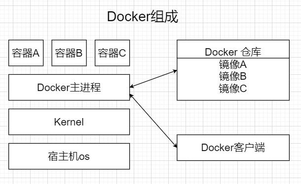
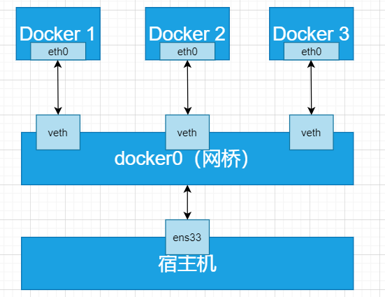
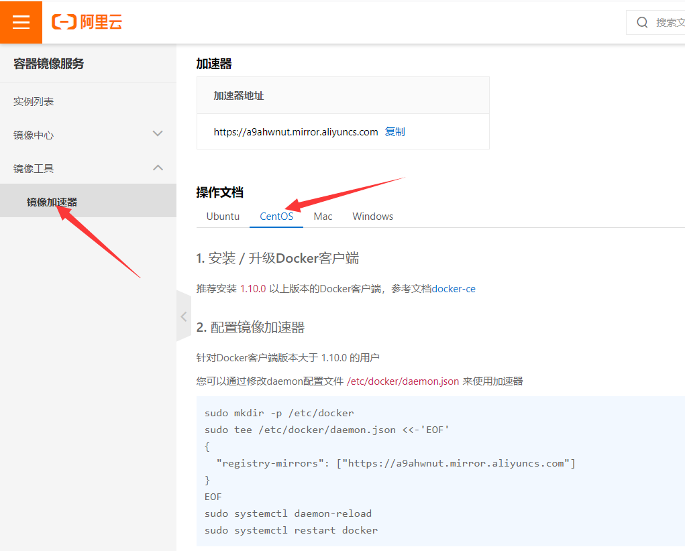

# Docker是什么？

Docker是一个在2013年开源的应用程序，并且是一个基于go语言编写的PAAS服务。

Docker最早采用LXC技术，之后改为自己研发并开源的runc技术运行容器。

Docker相比虚拟机的交付速度更快，资源消耗更低，Docker采用客户端、服务端架构，使用远程api来管理和创建Docker容器。

Docker的三大理念是build（构建）、ship（运输）、run（运行）。

Docker遵从apache2.0协议，并通过namespace、cgroup等技术来提供容器的资源隔离与安全保障。

# Docker与虚拟机之间的对比


| **虚拟化**                                       | **容器**                                                |
| ------------------------------------------------ | ------------------------------------------------------- |
| 隔离性强，有独立的GUEST  OS                      | 共享内核和OS，隔离性弱!                                 |
| 虚拟化性能差(>15%)                               | 计算/存储无损耗，无Guest  OS内存开销(~200M)             |
| 虚拟机镜像庞大(十几G~几十G),  且实例化时不能共享 | Docker容器镜象200~300M，且公共基础镜象实例化时可以共享  |
| 虚拟机镜象缺乏统一标准                           | Docker提供了容器应用镜象事实标准，OCI推动进一  步标准化 |
| 虚拟机创建慢(>2分钟)                             | 秒级创建(<10s)相当于建立索引                            |
| 虚拟机启动慢(>30s)  读文件逐个加载               | 秒级(<1s,不含应用本身启动)                              |
| 资源虚拟化粒度低，单机10~100虚拟机               | 单机支持1000+容器密度很高，适合大规模的部署             |

- 资源利用率更高：一台物理机可以运行数百个容器，但一般只能运行数十个虚拟机
- 开销更小：不需要启动单独的虚拟机占用硬件资源
- 启动速度更快：可以在数秒内完成启动

# Docker的组成

官网：https://docs.docker.com/get-started/overview/

Docker主机 host：一个物理机或者虚拟机，用于运行docker服务进程和容器

Docker服务端 Server：Docker守护进程，运行docker容器

Docker客户端 client：客户端使用docker命令或其他工具调用docker api

Docker仓库 registry：保存镜像的仓库，类似于git或svn这样的版本控制器

Docker镜像 images：镜像可以理解为创建实例使用的模板

Docker容器 container：容器是从镜像生成对外提供服务的一个或一组服务




# Docker安装及基础命令

- 安装docker-ce以及客户端

```bash
[root@docker-server ~]# yum install wget.x86_64 -y
[root@docker-server ~]# rm -rf /etc/yum.repos.d/*
[root@docker-server ~]# wget -O /etc/yum.repos.d/Centos-7.repo http://mirrors.aliyun.com/repo/Centos-7.repo
[root@docker-server ~]# wget -O /etc/yum.repos.d/epel-7.repo http://mirrors.aliyun.com/repo/epel-7.repo
[root@docker-server ~]# wget -O /etc/yum.repos.d/docker-ce.repo https://mirrors.aliyun.com/docker-ce/linux/centos/docker-ce.repo
[root@docker-server ~]# yum install docker-ce -y
```

- 启动docker

```bash
[root@docker-server ~]# systemctl enable docker.service 
Created symlink from /etc/systemd/system/multi-user.target.wants/docker.service to /usr/lib/systemd/system/docker.service.
[root@docker-server ~]# systemctl start docker.service 
```

- 使用国内镜像加速器

```bash
[root@localhost ~]# mkdir -p /etc/docker
[root@localhost ~]# vim /etc/docker/daemon.json
{
    "registry-mirrors": ["https://docker.m.daocloud.io"]
}

# 重启容器服务
[root@localhost ~]# systemctl daemon-reload
[root@localhost ~]# systemctl restart docker

# 可选加速地址：
1、https://docker.m.daocloud.io 
2、https://dockerpull.com 
3、https://atomhub.openatom.cn 
4、https://docker.1panel.live 
5、https://dockerhub.jobcher.com 
6、https://hub.rat.dev 
7、https://docker.registry.cyou 
8、https://docker.awsl9527.cn 
9、https://do.nark.eu.org/ 
10、https://docker.ckyl.me 
11、https://hub.uuuadc.top
12、https://docker.chenby.cn
13、https://docker.ckyl.me
```

- 快速开始

```bash
[root@docker-server ~]# docker pull nginx
[root@docker-server ~]# docker images
REPOSITORY   TAG       IMAGE ID       CREATED      SIZE
nginx        latest    d1a364dc548d   5 days ago   133MB
[root@docker-server ~]# docker run -d -p 80:80 nginx
e617ca1db9a5d242e6b4145b9cd3dff9f7955c6ab1bf160f13fb6bec081a29e4
[root@docker-server ~]# docker ps
CONTAINER ID   IMAGE     COMMAND                  CREATED         STATUS         PORTS                               NAMES
e617ca1db9a5   nginx     "/docker-entrypoint.…"   6 seconds ago   Up 5 seconds   0.0.0.0:80->80/tcp, :::80->80/tcp   intelligent_turing
[root@docker-server ~]# docker exec -it e617ca1db9a5 bash
root@e617ca1db9a5:/# cd /usr/share/nginx/html/
root@e617ca1db9a5:/usr/share/nginx/html# ls
50x.html  index.html
root@e617ca1db9a5:/usr/share/nginx/html# echo 'docker nginx test' > index.html 
[root@docker-server ~]# curl 192.168.88.10
docker nginx test

[root@admin ~]# docker ps
CONTAINER ID   IMAGE     COMMAND                   CREATED                                                        NAMES
e0a818c40b7e   nginx     "/docker-entrypoint.…"   About an hour ago  0.0.0.0:9000->9000/tcp, :::9000->9000/tcp   determined_sanderson
9b066ef4bcd2   nginx     "/docker-entrypoint.…"   About an hour ago  90->80/tcp, :::90->80/tcp                   vigorous_hypatia
[root@admin ~]# docker stop e0a818c40b7e
e0a818c40b7e
[root@admin ~]# docker stop 9b066ef4bcd2
9b066ef4bcd2

```

## 参数说明：

```bash
-d, --detach: 以守护进程方式运行容器
-p, --publish: 映射容器端口到宿主机端口
格式: -p [hostPort]:[containerPort]
-v, --volume: 挂载数据卷
格式: -v [hostPath]:[containerPath]
-e, --env: 设置环境变量
--name: 为容器指定名称
--network: 指定容器所属网络
--restart: 容器退出时的重启策略
可选值: no, on-failure, unless-stopped, always
-i, --interactive: 保持标准输入打开
-t, --tty: 分配一个伪终端
-u, --user: 指定运行容器的用户
--entrypoint: 覆盖容器的默认入口点
--rm: 容器退出后自动删除
--hostname: 设置容器主机名
--add-host: 添加自定义主机名到 IP 的映射
--link: 添加到另一个容器的链接
--expose: 暴露容器端口
--volume-driver: 指定数据卷驱动程序
--cpu-shares: 设置 CPU 权重
--memory: 设置容器内存限制
```

# Linux namespace技术

如果一个宿主机运行了N个容器，多个容器带来的以下问题怎么解决：

1. 怎么样保证每个容器都有不同的文件系统并且能互不影响？
2. 一个docker主进程内的各个容器都是其子进程，那么如何实现同一个主进程下不同类型的子进程？各个子进程间通信能相互访问吗？
3. 每个容器怎么解决IP以及端口分配的问题？
4. 多个容器的主机名能一样吗？
5. 每个容器都要不要有root用户？怎么解决账户重名问题呢？

以上问题怎么解决

**namespace**是Linux系统的底层概念，在内核层实现，即有一些不同类型的命名空间都部署在核内，**各个docker容器运行在同一个docker主进程并且共用同一个宿主机系统内核**，各个docker容器运行在宿主机的用户空间，每个容器都要有类似于虚拟机一样的相**互隔离的运行空间**，但是容器技术是在一个进程内实现运行指定服务的运行环境，并且还可以保护宿主机内核不受其他进程的干扰和影响，如文件系统、网络空间、进程空间等，目前主要通过以下技术实现容器运行空间的相互隔离：

| 隔离类型                                     | 功能                               | 系统调用参数  | 内核   |
| -------------------------------------------- | ---------------------------------- | ------------- | ------ |
| MNT Namespace（mount）                       | 提供磁盘挂载点和文件系统的隔离能力 | CLONE_NEWNS   | 2.4.19 |
| IPC Namespace（Inter-Process Communication） | 提供进程间通信的隔离能力           | CLONE_NEWIPC  | 2.6.19 |
| UTS Namespace（UNIX Timesharing System）     | 提供主机名隔离能力                 | CLONE_NEWUTS  | 2.6.19 |
| PID Namespace（Process Identification）      | 提供进程隔离能力                   | CLONE_NEWPID  | 2.6.24 |
| Net Namespace（network）                     | 提供网络隔离能力                   | CLONE_NEWNET  | 2.6.29 |
| User Namespace（user）                       | 提供用户隔离能力                   | CLONE_NEWUSER | 3.8    |

## MNT Namespace

每个容器都要有独立的根文件系统有独立的用户空间，以实现容器里面启动服务并且使用容器的运行环境。

- 启动三个容器

```bash
[root@docker-server ~]# docker run -d --name nginx-1 -p 80:80 nginx
0e72f06bba417073d1d4b2cb53e62c45b75edc699b737e46a157a3249f3a803e
[root@docker-server ~]# docker run -d --name nginx-2 -p 81:80 nginx
c8ce6a0630b66e260eef16d8ecf48049eed7b893b87459888b634bf0e9e40f23
[root@docker-server ~]# docker run -d --name nginx-3 -p 82:80 nginx
1cddbd412b5997f8935815c2f588431e100b752595ceaa92b95758ca45179096
```

- 连接进入某一个容器中，并创建一个文件

```bash
[root@docker-server ~]# docker exec -it nginx-1 bash
root@0e72f06bba41:/# echo 'hello world test!' > /opt/test1
root@0e72f06bba41:/# exit
```

- 宿主机是使用了chroot技术把容器锁定到一个指定的运行目录里

```bash
[root@docker-server diff]# find / -name test1
/var/lib/docker/overlay2/f9cc560395b5e3b11d2b1293922c4d31e6a6a32ca59af3d9274eabdfc6832424/diff/opt/test1
/var/lib/docker/overlay2/f9cc560395b5e3b11d2b1293922c4d31e6a6a32ca59af3d9274eabdfc6832424/merged/opt/test1
```

## IPC Namespace

一个容器内的进程间通信，允许一个容器内的不同进程数据互相访问，但是不能跨容器访问其他容器的数据

UTS Namespace包含了运行内核的名称、版本、底层体系结构类型等信息用于系统表示，其中包含了hostname和域名，它使得一个容器拥有属于自己hostname标识，这个主机名标识独立于宿主机系统和其上的其他容器。

## PID Namespace

Linux系统中，有一个pid为1的进程（init/systemd）是其他所有进程的父进程，那么在每个容器内也要有一个父进程来管理其下属的进程，那么多个容器的进程通PID namespace进程隔离

- 安装软件包

```bash
[root@localhost ~]# docker exec -it 065f06e5caa4 bash
root@0e72f06bba41:/# apt update
# ifconfig
root@0e72f06bba41:/# apt install net-tools
# top
root@0e72f06bba41:/# apt install procps
# ping
root@0e72f06bba41:/# apt install iputils-ping
root@0e72f06bba41:/# ps -ef
UID         PID   PPID  C STIME TTY          TIME CMD
root          10  0 03:20 ?        00:00:00 nginx: master process nginx -g d
nginx        32      1  0 03:20 ?        00:00:00 nginx: worker process
nginx        33      1  0 03:20 ?        00:00:00 nginx: worker process
nginx        34      1  0 03:20 ?        00:00:00 nginx: worker process
nginx        35      1  0 03:20 ?        00:00:00 nginx: worker process
nginx        36      1  0 03:20 ?        00:00:00 nginx: worker process
nginx        37      1  0 03:20 ?        00:00:00 nginx: worker process
nginx        38      1  0 03:20 ?        00:00:00 nginx: worker process
nginx        39      1  0 03:20 ?        00:00:00 nginx: worker process
root         59      0  0 03:35 pts/0    00:00:00 bash
root        503     59  0 03:42 pts/0    00:00:00 ps -ef
```

**那么宿主机的PID与容器内的PID是什么关系？**

```bash
[root@docker-server ~]# yum install psmisc
[root@docker-server ~]# pstree -p
systemd(1)─┬─NetworkManager(638)─┬─{NetworkManager}(665)
           │                     └─{NetworkManager}(667)
           ├─agetty(651)
           ├─auditd(607)───{auditd}(608)
           ├─chronyd(637)
           ├─containerd(880)─┬─{containerd}(1024)
           │                 ├─{containerd}(1025)
           │                 ├─{containerd}(1026)
           │                 ├─{containerd}(1047)
           │                 ├─{containerd}(1048)
           │                 ├─{containerd}(1049)
           │                 ├─{containerd}(1078)
           │                 └─{containerd}(1105)
           ├─containerd-shim(1472)─┬─nginx(1492)───nginx(1545)
           │                       ├─{containerd-shim}(1473)
           │                       ├─{containerd-shim}(1474)
           │                       ├─{containerd-shim}(1475)
           │                       ├─{containerd-shim}(1476)
           │                       ├─{containerd-shim}(1477)
           │                       ├─{containerd-shim}(1478)
           │                       ├─{containerd-shim}(1479)
           │                       ├─{containerd-shim}(1480)
           │                       ├─{containerd-shim}(1482)
           │                       ├─{containerd-shim}(1512)
           │                       ├─{containerd-shim}(1519)
           │                       └─{containerd-shim}(1520)
           ├─crond(647)
           ├─dbus-daemon(634)
           ├─dockerd(1069)─┬─docker-proxy(1456)─┬─{docker-proxy}(1457)
           │               │                    ├─{docker-proxy}(1458)
           │               │                    ├─{docker-proxy}(1459)
           │               │                    └─{docker-proxy}(1461)
           │               ├─docker-proxy(1460)─┬─{docker-proxy}(1462)
           │               │                    ├─{docker-proxy}(1463)
           │               │                    ├─{docker-proxy}(1464)
           │               │                    └─{docker-proxy}(1465)
           │               ├─{dockerd}(1144)
           │               ├─{dockerd}(1145)
           │               ├─{dockerd}(1146)
           │               ├─{dockerd}(1147)
           │               ├─{dockerd}(1148)
           │               ├─{dockerd}(1149)
           │               ├─{dockerd}(1150)
           │               ├─{dockerd}(1152)
           │               └─{dockerd}(1153)

[root@localhost ~]# ps aux | grep 065f06e5caa4
```

1. **独立的 PID 命名空间**:
   - 每个 Docker 容器都有自己独立的 PID 命名空间。
   - 容器内的进程 PID 从 1 开始编号,与宿主机上的 PID 是相互独立的。
2. **PID 映射**:
   - 容器内的进程 PID 与宿主机上的进程 PID 之间是有映射关系的。
   - 通过 `docker inspect <container_id>` 命令,可以查看容器内进程的 PID 与宿主机上进程 PID 的对应关系。
3. **PID 可见性**:
   - 容器内的进程只能看到容器内部的 PID。
   - 宿主机上的进程可以看到容器内部的 PID,但容器内的进程无法看到宿主机上的 PID。
4. **PID 隔离**:
   - 容器内的进程无法访问或影响宿主机上的其他进程。
   - 宿主机上的进程可以访问和管理容器内的进程。

## Net Namespace

每一个容器都类似于虚拟机一样有自己的网卡、监听端口、TCP/IP协议栈等，Docker使用network namespace启动一个vethX接口，这样容器将拥有它自己的桥接IP地址，通常是docker0，而docker0实质就是linux的虚拟网桥。

```bash
[root@docker-server ~]# yum install bridge-utils.x86_64 -y
[root@docker-server ~]# brctl show
bridge name	bridge id		STP enabled	interfaces
docker0		8000.0242c83ab23e	no		veth3ad3c5b
[root@docker-server ~]# ifconfig 
docker0: flags=4163<UP,BROADCAST,RUNNING,MULTICAST>  mtu 1500
        inet 172.17.0.1  netmask 255.255.0.0  broadcast 172.17.255.255
        inet6 fe80::42:c8ff:fe3a:b23e  prefixlen 64  scopeid 0x20<link>
        ether 02:42:c8:3a:b2:3e  txqueuelen 0  (Ethernet)
        RX packets 0  bytes 0 (0.0 B)
        RX errors 0  dropped 0  overruns 0  frame 0
        TX packets 5  bytes 438 (438.0 B)
        TX errors 0  dropped 0 overruns 0  carrier 0  collisions 0

ens33: flags=4163<UP,BROADCAST,RUNNING,MULTICAST>  mtu 1500
        inet 192.168.88.10  netmask 255.255.255.0  broadcast 192.168.88.255
        inet6 fe80::eaf3:dc40:2bf:6da2  prefixlen 64  scopeid 0x20<link>
        ether 00:0c:29:f7:bf:0d  txqueuelen 1000  (Ethernet)
        RX packets 20899  bytes 26611365 (25.3 MiB)
        RX errors 0  dropped 0  overruns 0  frame 0
        TX packets 9785  bytes 640866 (625.8 KiB)
        TX errors 0  dropped 0 overruns 0  carrier 0  collisions 0

lo: flags=73<UP,LOOPBACK,RUNNING>  mtu 65536
        inet 127.0.0.1  netmask 255.0.0.0
        inet6 ::1  prefixlen 128  scopeid 0x10<host>
        loop  txqueuelen 1  (Local Loopback)
        RX packets 72  bytes 5768 (5.6 KiB)
        RX errors 0  dropped 0  overruns 0  frame 0
        TX packets 72  bytes 5768 (5.6 KiB)
        TX errors 0  dropped 0 overruns 0  carrier 0  collisions 0

veth3ad3c5b: flags=4163<UP,BROADCAST,RUNNING,MULTICAST>  mtu 1500
        inet6 fe80::28f5:d3ff:feda:4f03  prefixlen 64  scopeid 0x20<link>
        ether 2a:f5:d3:da:4f:03  txqueuelen 0  (Ethernet)
        RX packets 0  bytes 0 (0.0 B)
        RX errors 0  dropped 0  overruns 0  frame 0
        TX packets 13  bytes 1086 (1.0 KiB)
        TX errors 0  dropped 0 overruns 0  carrier 0  collisions 0
```

- 查看docker内部网卡

```bash
root@0d5d7069b9d9:/# ifconfig 
eth0: flags=4163<UP,BROADCAST,RUNNING,MULTICAST>  mtu 1500
        inet 172.17.0.2  netmask 255.255.0.0  broadcast 172.17.255.255
        ether 02:42:ac:11:00:02  txqueuelen 0  (Ethernet)
        RX packets 3708  bytes 8489188 (8.0 MiB)
        RX errors 0  dropped 0  overruns 0  frame 0
        TX packets 3340  bytes 182520 (178.2 KiB)
        TX errors 0  dropped 0 overruns 0  carrier 0  collisions 0

lo: flags=73<UP,LOOPBACK,RUNNING>  mtu 65536
        inet 127.0.0.1  netmask 255.0.0.0
        loop  txqueuelen 1  (Local Loopback)
        RX packets 0  bytes 0 (0.0 B)
        RX errors 0  dropped 0  overruns 0  frame 0
        TX packets 0  bytes 0 (0.0 B)
        TX errors 0  dropped 0 overruns 0  carrier 0  collisions 0
```

逻辑图



## User Namespace

各个容器内可能会出现重名的用户和用户组名称，或重复的用户UID或者GID，那么怎么隔离各个容器内的用户空间呢？

User Namespace允许在各个宿主机的各个容器空间内创建相同的用户名以及相同的uid和gid，只是此用户的有效范围仅仅是当前的容器内，不能访问另外一个容器内的文件系统，即相互隔离、互不影响、永不相见

# Linux control groups

在一个容器内部，如果不对其做任何资源限制，则宿主机会允许其占用无限大的内存空间，有时候会因为代码bug程序会一直申请内存，直到把宿主机内存占完，为了避免此类的问题出现，宿主机有必要对容器进行资源分配限制，比如cpu、内存等，Linux Cgroups的全称是Linux control Groups，它最重要的作用就是限制一个进程组能够使用的资源上线，包括cpu、内存、磁盘、网络等等。

- 验证系统内核层已经默认开启cgroup功能

```bash
[root@docker-server ~]# cat /boot/config-3.10.0-957.el7.x86_64| grep cgroup -i
CONFIG_CGROUPS=y
# CONFIG_CGROUP_DEBUG is not set
CONFIG_CGROUP_FREEZER=y
CONFIG_CGROUP_PIDS=y
CONFIG_CGROUP_DEVICE=y
CONFIG_CGROUP_CPUACCT=y
CONFIG_CGROUP_HUGETLB=y
CONFIG_CGROUP_PERF=y
CONFIG_CGROUP_SCHED=y
CONFIG_BLK_CGROUP=y
# CONFIG_DEBUG_BLK_CGROUP is not set
CONFIG_NETFILTER_XT_MATCH_CGROUP=m
CONFIG_NET_CLS_CGROUP=y
CONFIG_NETPRIO_CGROUP=y
```

- 关于内存的模块

```bash
[root@docker-server ~]#  cat /boot/config-3.10.0-957.el7.x86_64 | grep mem -i | grep cg -i
CONFIG_MEMCG=y
CONFIG_MEMCG_SWAP=y
CONFIG_MEMCG_SWAP_ENABLED=y
CONFIG_MEMCG_KMEM=y
```

```bash
CPU: 这个子系统通过 CPU 调度程序为 cgroup 任务提供 CPU 访问。可以控制每个 cgroup 的 CPU 份额、优先级等。
cpuacct: 这个子系统会产生每个 cgroup 任务的 CPU 资源使用报告,方便监控和管理。
cpuset: 在多核 CPU 环境下,这个子系统可以为 cgroup 任务分配特定的 CPU 核心和内存区域。
devices: 这个子系统可以允许或拒绝 cgroup 任务对特定设备的访问。
freezer: 这个子系统可以暂停和恢复 cgroup 任务的运行。
memory: 这个子系统可以为每个 cgroup 设置内存使用限制,并产生内存资源使用报告。
net_cls: 这个子系统可以为 cgroup 任务生成的网络数据包打标签,方便网络策略的管理。
ns: 这个子系统提供了对 cgroup 的命名空间隔离。
perf event: 这个子系统增强了对 cgroup 任务的性能监控和跟踪能力。
```

扩展阅读：

https://blog.csdn.net/qyf158236/article/details/110475457


## 使用压缩工具测试

```plain
[root@bogon ~]# docker pull lorel/docker-stress-ng
Using default tag: latest
latest: Pulling from lorel/docker-stress-ng
c52e3ed763ff: Pull complete 
a3ed95caeb02: Pull complete 
7f831269c70e: Pull complete 
Digest: sha256:c8776b750869e274b340f8e8eb9a7d8fb2472edd5b25ff5b7d55728bca681322
Status: Downloaded newer image for lorel/docker-stress-ng:latest
```

### 测试内存

不限制cpu使用

```bash
[root@bogon ~]# docker container run --name stress -it --rm lorel/docker-stress-ng:latest  --cpu 8
stress-ng: info: [1] defaulting to a 86400 second run per stressor
stress-ng: info: [1] dispatching hogs: 8 cpu
[root@bogon ~]# docker stats
CONTAINER ID        NAME                CPU %               MEM USAGE / LIMIT     MEM %               NET I/O             BLOCK I/O           PIDS
92b0b8d916c1        stress              101.54%             15.81MiB / 983.3MiB   1.61%               648B / 0B           0B / 0B             9
[root@bogon ~]# top
top - 19:15:49 up 2 days,  2:38,  2 users,  load average: 7.02, 3.00, 1.15
Tasks: 131 total,  10 running, 121 sleeping,   0 stopped,   0 zombie
%Cpu(s): 99.7 us,  0.3 sy,  0.0 ni,  0.0 id,  0.0 wa,  0.0 hi,  0.0 si,  0.0 st
KiB Mem :  1006892 total,   100680 free,   320704 used,   585508 buff/cache
KiB Swap:  2097148 total,  2096628 free,      520 used.   422732 avail Mem 
  PID USER      PR  NI    VIRT    RES    SHR S %CPU %MEM     TIME+ COMMAND                                                                     
40035 root      20   0    6908   4180    252 R 12.6  0.4   0:12.79 stress-ng-cpu                                                               
40037 root      20   0    6908   4180    252 R 12.6  0.4   0:12.78 stress-ng-cpu                                                               
40038 root      20   0    6908   2136    252 R 12.6  0.2   0:12.78 stress-ng-cpu                                                               
40040 root      20   0    6908   2136    252 R 12.6  0.2   0:12.78 stress-ng-cpu                                                               
40036 root      20   0    6908   2136    252 R 12.3  0.2   0:12.77 stress-ng-cpu                                                               
40039 root      20   0    6908   2136    252 R 12.3  0.2   0:12.78 stress-ng-cpu                                                               
40041 root      20   0    6908   4180    252 R 12.3  0.4   0:12.77 stress-ng-cpu                                                               
40042 root      20   0    6908   2136    252 R 12.3  0.2   0:12.77 stress-ng-cpu                                                               
    1 root      20   0  128484   7208   4196 S  0.0  0.7   0:10.12 systemd
```

可以看到，cpu使用已经满了

重新启动容器加入内存限制参数

```plain
[root@bogon ~]# docker container run --name stress --cpus=0.5 -it --rm lorel/docker-stress-ng:latest  --cpu 8
stress-ng: info: [1] defaulting to a 86400 second run per stressor
stress-ng: info: [1] dispatching hogs: 8 cpu
[root@bogon ~]# docker stats
CONTAINER ID        NAME                CPU %               MEM USAGE / LIMIT     MEM %               NET I/O             BLOCK I/O           PIDS
845220ef9982        stress              51.57%              20.05MiB / 983.3MiB   2.04%               648B / 0B           0B / 0B             9
```

设置的参数生效

# 容器规范

容器技术除了docker之外，还有coreOS的rkt，还有阿里的Pouch，还有红帽 的podman，为了保证容器生态的标准性和健康可持续发展，包括Linux基金会、Docker、微软、红帽、谷歌和IBM等公司在2015年6月共同成立了一个叫open container（OCI）的组织，其目的就是制定开放的标准的容器规范，目前OCI一共发布了两个规范分别是runtime spec和image format spec，不同的容器公司只需要兼容这两个规范，就可以保证容器的可移植性和相互可操作性。

runtime是真正运行容器的地方，因此运行了不同的容器runtime需要和操作系统内核紧密合作相互在支持，以便为容器提供相应的运行环境，目前主流的三种runtime：

lxc：linux上早期的runtime，Docker早期就是采用lxc作为runtime

runc：是目前docker默认的runtime，runc遵守oci规范，因此可以兼容lxc

rkt：是coreOS开发的容器runtime，也符合oci规范

# docker info信息

```bash
[root@docker-server ~]# docker info 
Client:
 Context:    default
 Debug Mode: false
 Plugins:
  app: Docker App (Docker Inc., v0.9.1-beta3)
  buildx: Build with BuildKit (Docker Inc., v0.5.1-docker)
  scan: Docker Scan (Docker Inc.)

Server:
 Containers: 2		# 当前主机运行容器总数
  Running: 1		# 有几个容器是正在运行的
  Paused: 0			# 有几个容器是暂停的
  Stopped: 1		# 有几个容器是停止的
 Images: 1			# 当前服务器的镜像数
 Server Version: 20.10.6		# 服务端版本
 Storage Driver: overlay2		# 正在使用的存储引擎
  Backing Filesystem: xfs		# 后端文件系统，即服务器的磁盘文件系统
  Supports d_type: true			# 是否支持d_type
  Native Overlay Diff: true		# 是否支持差异数据存储
  userxattr: false
 Logging Driver: json-file		# 日志文件类型
 Cgroup Driver: cgroupfs		# cgroups类型
 Cgroup Version: 1
 Plugins:						# 插件
  Volume: local					# 卷
  Network: bridge host ipvlan macvlan null overlay
  Log: awslogs fluentd gcplogs gelf journald json-file local logentries splunk syslog
 Swarm: inactive				# 是否支持swarm
 Runtimes: io.containerd.runc.v2 io.containerd.runtime.v1.linux runc
 Default Runtime: runc			# 默认的runtime
 Init Binary: docker-init		# 初始化容器的守护进程
 containerd version: d71fcd7d8303cbf684402823e425e9dd2e99285d
 runc version: b9ee9c6314599f1b4a7f497e1f1f856fe433d3b7
 init version: de40ad0
 Security Options:				# 安全选项
  seccomp
   Profile: default
 Kernel Version: 3.10.0-693.el7.x86_64		# 宿主机内核版本
 Operating System: CentOS Linux 7 (Core)	# 宿主机操作系统
 OSType: linux								# 宿主机操作系统类型
 Architecture: x86_64						# 宿主机架构
 CPUs: 1									# 宿主机cpu数量
 Total Memory: 1.781GiB						# 宿主机总内存
 Name: docker-server						# 宿主机主机名
 ID: ARN5:ESPO:FEZ4:KDZ6:RWGG:WQ3X:SIXN:3FVG:ATXH:JAXA:ENGH:RAVE
 Docker Root Dir: /var/lib/docker			# 宿主机数据保存目录
 Debug Mode: false
 Registry: https://index.docker.io/v1/		# 镜像仓库
 Labels:
 Experimental: false						# 是否是测试版
 Insecure Registries:
  127.0.0.0/8
 Live Restore Enabled: false				# 是否开启活动容器（重启不关闭容器）
```

docker 存储引擎

目前docker的默认存储引擎为overlay2，不同的存储引擎需要相应的系统支持，如需要磁盘分区的时候传递d-type文件分层功能，即需要传递内核参数开启格式化磁盘的时候指定功能。

官网关于存储引擎的信息：

https://docs.docker.com/storage/storagedriver/select-storage-driver/

由于存储引擎选择错误引起的血案（扩展阅读）

https://www.cnblogs.com/youruncloud/p/5736718.html

# 镜像加速配置

打开网址

http://cr.console.aliyun.com/

登陆之后点击镜像加速器，按照指导说明即可

