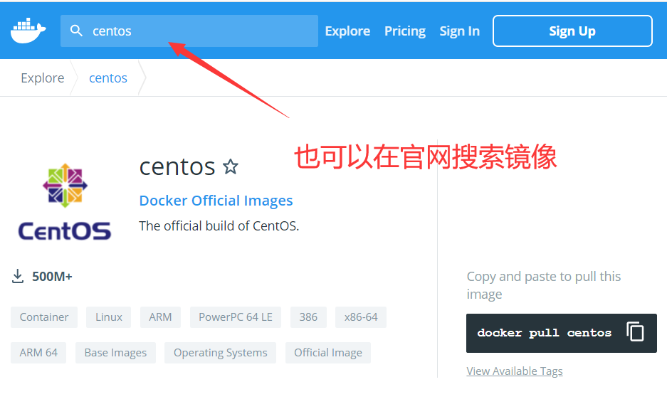

# 搜索镜像

```bash
[root@docker-server ~]# docker search centos
NAME                               DESCRIPTION                                     STARS     OFFICIAL   AUTOMATED
centos                             The official build of CentOS.                   6584      [OK]       
ansible/centos7-ansible            Ansible on Centos7                              134                  [OK]
consol/centos-xfce-vnc             Centos container with "headless" VNC session…   129                  [OK]
jdeathe/centos-ssh                 OpenSSH / Supervisor / EPEL/IUS/SCL Repos - …   118                  [OK]
centos/systemd                     systemd enabled base container.                 99                   [OK]
imagine10255/centos6-lnmp-php56    centos6-lnmp-php56                              58                   [OK]
tutum/centos                       Simple CentOS docker image with SSH access      48                   
kinogmt/centos-ssh                 CentOS with SSH                                 29                   [OK]
pivotaldata/centos-gpdb-dev        CentOS image for GPDB development. Tag names…   13                   
guyton/centos6                     From official centos6 container with full up…   10                   [OK]
centos/tools                       Docker image that has systems administration…   7                    [OK]
drecom/centos-ruby                 centos ruby                                     6                    [OK]
pivotaldata/centos                 Base centos, freshened up a little with a Do…   5                    
pivotaldata/centos-gcc-toolchain   CentOS with a toolchain, but unaffiliated wi…   3                    
darksheer/centos                   Base Centos Image -- Updated hourly             3                    [OK]
mamohr/centos-java                 Oracle Java 8 Docker image based on Centos 7    3                    [OK]
pivotaldata/centos-mingw           Using the mingw toolchain to cross-compile t…   3                    
miko2u/centos6                     CentOS6 日本語環境                                   2                    [OK]
indigo/centos-maven                Vanilla CentOS 7 with Oracle Java Developmen…   2                    [OK]
amd64/centos                       The official build of CentOS.                   2                    
dokken/centos-7                    CentOS 7 image for kitchen-dokken               2                    
pivotaldata/centos6.8-dev          CentosOS 6.8 image for GPDB development         1                    
blacklabelops/centos               CentOS Base Image! Built and Updates Daily!     1                    [OK]
smartentry/centos                  centos with smartentry                          0                    [OK]
```

可以看到返回了很多包含关键字的镜像，其中包括镜像名字、描述、点赞数（表示该镜像的受欢迎程度）、是否官方创建、是否自动创建。默认输出结果按照星级评价进行排序。



# 下载镜像

可以使用docker pull命令直接下载镜像，语法为：

```bash
docker pull NAME:TAG
```

其中，NAME是镜像名称，TAG是镜像的标签（往往用来是表示版本信息），通常情况下，描述一个镜像需要包括名称+标签，如果不指定标签，标签的值默认为latest。

- 下载nginx、centos、hello-world镜像

```bash
[root@docker-server ~]# docker pull nginx
[root@docker-server ~]# docker pull centos
[root@docker-server ~]# docker pull hello-world
```

# 查看镜像信息

## docker images

- 列出本地所有镜像

```bash
[root@docker-server ~]# docker images
REPOSITORY    TAG       IMAGE ID       CREATED        SIZE
nginx         latest    d1a364dc548d   2 weeks ago    133MB
hello-world   latest    d1165f221234   3 months ago   13.3kB
centos        latest    300e315adb2f   6 months ago   209MB
```

在列出的信息中可以看到几个字段：

- REPOSITORY：镜像仓库名称
- TAG：镜像的标签信息
- 镜像ID：唯一用来标识镜像，如果两个镜像的ID相同，说明他们实际上指向了同一个镜像，只是具有不同标签名称而已
- CREATED：创建时间，说明镜像的最后更新时间
- SIZE：镜像大小，优秀的镜像往往体积都较小

## docker tag

为了方便在后续工作中使用特定镜像，可以使用docker tag命令来为本地镜像任意添加新的标签

```bash
[root@docker-server ~]# docker tag centos:latest mycentos:latest
[root@docker-server ~]# docker images
REPOSITORY    TAG       IMAGE ID       CREATED        SIZE
nginx         latest    d1a364dc548d   2 weeks ago    133MB
hello-world   latest    d1165f221234   3 months ago   13.3kB
centos        latest    300e315adb2f   6 months ago   209MB
mycentos      latest    300e315adb2f   6 months ago   209MB
```

## docker inspect

可以使用docker inspect命令获取该镜像的详细信息

```bash
[root@docker-server ~]# docker inspect centos:latest 
[
    {
        "Id": "sha256:300e315adb2f96afe5f0b2780b87f28ae95231fe3bdd1e16b9ba606307728f55",
        "RepoTags": [
            "centos:latest",
            "mycentos:latest"
        ],
        "RepoDigests": [
            "centos@sha256:5528e8b1b1719d34604c87e11dcd1c0a20bedf46e83b5632cdeac91b8c04efc1"
        ],
        "Parent": "",
        "Comment": "",
        "Created": "2020-12-08T00:22:53.076477777Z",
        "Container": "395e0bfa7301f73bc994efe15099ea56b8836c608dd32614ac5ae279976d33e4",
        "ContainerConfig": {
            "Hostname": "395e0bfa7301",
            "Domainname": "",
            "User": "",
            "AttachStdin": false,
            "AttachStdout": false,
            "AttachStderr": false,
            "Tty": false,
            "OpenStdin": false,
            "StdinOnce": false,
            "Env": [
                "PATH=/usr/local/sbin:/usr/local/bin:/usr/sbin:/usr/bin:/sbin:/bin"
            ],
            "Cmd": [
                "/bin/sh",
                "-c",
                "#(nop) ",
                "CMD [\"/bin/bash\"]"
            ],
            "Image": "sha256:6de05bdfbf9a9d403458d10de9e088b6d93d971dd5d48d18b4b6758f4554f451",
            "Volumes": null,
            "WorkingDir": "",
            "Entrypoint": null,
            "OnBuild": null,
            "Labels": {
                "org.label-schema.build-date": "20201204",
                "org.label-schema.license": "GPLv2",
                "org.label-schema.name": "CentOS Base Image",
                "org.label-schema.schema-version": "1.0",
                "org.label-schema.vendor": "CentOS"
            }
        },
        "DockerVersion": "19.03.12",
        "Author": "",
        "Config": {
            "Hostname": "",
            "Domainname": "",
            "User": "",
            "AttachStdin": false,
            "AttachStdout": false,
            "AttachStderr": false,
            "Tty": false,
            "OpenStdin": false,
            "StdinOnce": false,
            "Env": [
                "PATH=/usr/local/sbin:/usr/local/bin:/usr/sbin:/usr/bin:/sbin:/bin"
            ],
            "Cmd": [
                "/bin/bash"
            ],
            "Image": "sha256:6de05bdfbf9a9d403458d10de9e088b6d93d971dd5d48d18b4b6758f4554f451",
            "Volumes": null,
            "WorkingDir": "",
            "Entrypoint": null,
            "OnBuild": null,
            "Labels": {
                "org.label-schema.build-date": "20201204",
                "org.label-schema.license": "GPLv2",
                "org.label-schema.name": "CentOS Base Image",
                "org.label-schema.schema-version": "1.0",
                "org.label-schema.vendor": "CentOS"
            }
        },
        "Architecture": "amd64",
        "Os": "linux",
        "Size": 209348104,
        "VirtualSize": 209348104,
        "GraphDriver": {
            "Data": {
                "MergedDir": "/var/lib/docker/overlay2/fc171623b3190077aec6cf1fdd969e635e7a5144b30ad8ca94204d02739b1e9e/merged",
                "UpperDir": "/var/lib/docker/overlay2/fc171623b3190077aec6cf1fdd969e635e7a5144b30ad8ca94204d02739b1e9e/diff",
                "WorkDir": "/var/lib/docker/overlay2/fc171623b3190077aec6cf1fdd969e635e7a5144b30ad8ca94204d02739b1e9e/work"
            },
            "Name": "overlay2"
        },
        "RootFS": {
            "Type": "layers",
            "Layers": [
                "sha256:2653d992f4ef2bfd27f94db643815aa567240c37732cae1405ad1c1309ee9859"
            ]
        },
        "Metadata": {
            "LastTagTime": "2021-06-09T10:18:13.630764623+08:00"
        }
    }
]
```

## docker history

镜像由多层组成，可以使用history子命令，该命令将列出各层创建信息

```bash
[root@docker-server ~]# docker history centos:latest 
IMAGE          CREATED        CREATED BY                                      SIZE      COMMENT
300e315adb2f   6 months ago   /bin/sh -c #(nop)  CMD ["/bin/bash"]            0B        
<missing>      6 months ago   /bin/sh -c #(nop)  LABEL org.label-schema.sc…   0B        
<missing>      6 months ago   /bin/sh -c #(nop) ADD file:bd7a2aed6ede423b7…   209MB  
```

# 镜像导入导出

## 导出

可以将镜像从本地导出为一个压缩文件，然后复制到其他服务器进行导入使用

- 导出方法一

```bash
[root@docker-server ~]# docker save centos:latest -o /opt/centos.tar.gz
[root@docker-server ~]# ll /opt/centos.tar.gz 
-rw------- 1 root root 216535040 6月   9 10:33 /opt/centos.tar.gz
```

- 导出方法二

```bash
[root@docker-server ~]# docker save centos:latest > /opt/centos-1.tar.gz
[root@docker-server ~]# ll /opt/centos-1.tar.gz 
-rw-r--r-- 1 root root 216535040 6月   9 10:35 /opt/centos-1.tar.gz
```

## 导入

先将导出的镜像发到需要导入的docker服务器中

- 导入方法一

```bash
[root@docker-server ~]# docker load -i /opt/centos.tar.gz 
Loaded image: centos:latest
```

- 导出方法二

```bash
[root@docker-server ~]# docker load < /opt/centos.tar.gz 
Loaded image: centos:latest
```

# 删除镜像
- 使用镜像名称+标签

```bash
[root@docker-server ~]# docker images
REPOSITORY    TAG       IMAGE ID       CREATED        SIZE
nginx         latest    d1a364dc548d   2 weeks ago    133MB
hello-world   latest    d1165f221234   3 months ago   13.3kB
centos        latest    300e315adb2f   6 months ago   209MB
mycentos      latest    300e315adb2f   6 months ago   209MB
[root@docker-server ~]# docker rmi nginx:latest 
Untagged: nginx:latest
Untagged: nginx@sha256:6d75c99af15565a301e48297fa2d121e15d80ad526f8369c526324f0f7ccb750
Deleted: sha256:d1a364dc548d5357f0da3268c888e1971bbdb957ee3f028fe7194f1d61c6fdee
Deleted: sha256:fcc8faba78fe8a1f75025781c8fa1841079b75b54fce8408d039f73a48b7a81b
Deleted: sha256:a476b265974ace4c857e3d88b358e848f126297a8249840c72d5f5ea1954a4bf
Deleted: sha256:56722ee1ee7e73a5c6f96ea2959fa442fb4db9f044399bcd939bb0a6eb7919dc
Deleted: sha256:c657df997c75f6c1a9c5cc683e8e34c6f29e5b4c1dee60b632d3477fd5fdd644
Deleted: sha256:e9e1f772d2a8dbbeb6a4a4dcb4f0d07ff1c432bf94fac7a2db2216837bf9ec5b
Deleted: sha256:02c055ef67f5904019f43a41ea5f099996d8e7633749b6e606c400526b2c4b33
```
- 使用镜像id
```bash
[root@docker-server ~]# docker images
REPOSITORY    TAG       IMAGE ID       CREATED        SIZE
hello-world   latest    d1165f221234   3 months ago   13.3kB
centos        latest    300e315adb2f   6 months ago   209MB
mycentos      latest    300e315adb2f   6 months ago   209MB
[root@docker-server ~]# docker rmi 300e315adb2f
Error response from daemon: conflict: unable to delete 300e315adb2f (must be forced) - image is referenced in multiple repositories
[root@docker-server ~]# docker rmi 300e315adb2f -f
Untagged: centos:latest
Untagged: centos@sha256:5528e8b1b1719d34604c87e11dcd1c0a20bedf46e83b5632cdeac91b8c04efc1
Untagged: mycentos:latest
Deleted: sha256:300e315adb2f96afe5f0b2780b87f28ae95231fe3bdd1e16b9ba606307728f55
Deleted: sha256:2653d992f4ef2bfd27f94db643815aa567240c37732cae1405ad1c1309ee9859
[root@docker-server ~]# docker images
REPOSITORY    TAG       IMAGE ID       CREATED        SIZE
hello-world   latest    d1165f221234   3 months ago   13.3kB

```
