# 概述

## 云计算

- 从炒概念到人人皆知
- 发展历程
  - IT需求较少，单机阶段
  - IT需求增多，资源集中管理
  - 对稳定性安全性提出更高的要求
  - 业务操作系统迁往虚拟机
  - 分布式计算需求
  - 业务应用隔离与虚拟化

- 将各个应用比喻成一个个租客，那么云计算就是物业管理

### 三种服务模式

- SAAS(Software as a Service)
- PAAS(Platform as a Service)
- IAAS(Infrastructure as a Service)


## 传统企业应用构建

应用被直接部署在操作系统之上，并且操作系统直接安装于硬件之上

应用被操作系统绑定

操作系统被硬件绑定

缺点

- 部署非常慢
- 成本非常高
- 资源浪费
- 难于迁移和扩展
- 被限定硬件厂商

##  虚拟化应用部署

应用被直接部署在操作系统之上，操作系统安装于虚拟硬件之上，虚拟硬件依赖硬件

应用被操作系统绑定

操作系统被封装于文件中，可以在硬件设备之间自由的传播

优点

- 隔离分区
- 文件封装
- 资源池
- 易扩展
- 易上云

缺点

- 资源浪费
- 启动速度慢
- 迁移过程慢
- 不能适应SOA架构

## 容器的由来

1982年 Unix系统中出现chroot工具，然后后期衍生出LXC一整套工具

2005年 OpenVZ发布

2013年 dotCloud发起基于Go语言的开源项目Docker

2014年 Docker镜像下载数达到了一百万次

2015年 Docker镜像下载数突破十亿次

2017年 Docker镜像下载数突破百亿次

2018年 "最受欢迎的云计算开源项目"调查中，Docker仅次于2010年发起的Openstack

至今 主流的操作系统都已经支持Docker，甚至内置Docker引擎

## 容器部署应用

在容器引擎中运行容器，在独立的容器中运行应用

应用与容器捆绑

容器只依赖于容器引擎

容器不与操作系统和硬件绑定

### Docker与虚拟机比较


| 特性     | 容器               | 虚拟机     |
| -------- | ------------------ | ---------- |
| 启动速度 | 秒级               | 分钟级     |
| 性能     | 接近原生           | 较弱       |
| 内存代价 | 很小               | 较多       |
| 硬盘使用 | 一般为MB           | 一般为GB   |
| 运行密度 | 单机支持上千个容器 | 一般几十个 |
| 隔离性   | 安全隔离           | 完全隔离   |
| 迁移性   | 优秀               | 一般       |

优势

- 对软件和其依赖的标准化打包
- 应用之间相互隔离
- 共享同一个OS kernel
- 可以运行在很多主流操作系统上
- 秒级的启动和重建

# Docker引擎的安装

Windows当前不推荐安装Docker（虽然支持）

Linux下输入如下命令

```bash
# 若安装过docker，需要先删掉，之后再安装依赖
yum remove docker docker-common docker-selinux docker-engine
yum install -y yum-utils device-mapper-persistent-data lvm2

# 下载repo文件
wget -O /etc/yum.repos.d/docker-ce.repo https://repo.huaweicloud.com/docker-ce/linux/centos/docker-ce.repo

# 替换软件仓库地址
sed -i 's+download.docker.com+repo.huaweicloud.com/docker-ce+' /etc/yum.repos.d/docker-ce.repo

# 更新索引文件并安装
yum makecache fast
yum install -y docker-ce

# 启动docker容器服务
systemctl start docker
systemctl enable docker

# 查看docker版本来验证是否完成，要注意有两个版本Client和Server
[root@localhost ~]# docker version
Client: Docker Engine - Community
 Version:           20.10.8
 API version:       1.41
 Go version:        go1.16.6
 Git commit:        3967b7d
 Built:             Fri Jul 30 19:55:49 2021
 OS/Arch:           linux/amd64
 Context:           default
 Experimental:      true

Server: Docker Engine - Community
 Engine:
  Version:          20.10.8
  API version:      1.41 (minimum version 1.12)
  Go version:       go1.16.6
  Git commit:       75249d8
  Built:            Fri Jul 30 19:54:13 2021
  OS/Arch:          linux/amd64
  Experimental:     false
 containerd:
  Version:          1.4.9
  GitCommit:        e25210fe30a0a703442421b0f60afac609f950a3
 runc:
  Version:          1.0.1
  GitCommit:        v1.0.1-0-g4144b63
 docker-init:
  Version:          0.19.0
  GitCommit:        de40ad0
```

Docker 大部分的操作都围绕着它的三大核心概念： 镜像、容器和仓库。

# 核心概念

## Docker镜像

Docker 镜像类似于虚拟机镜像，可以将它理解为一个只读的模板。

例如，一个镜像可以包含一个基本的操作系统环境，里面仅安装了Apache 应用程序（或
用户需要的其他软件） 。可以把它称为一个Apache 镜像。

## Docker容器

Docker 容器类似于一个轻量级的沙箱， Docker 利用容器来运行和隔离应用。
容器是从镜像创建的应用运行实例。它可以启动、开始、停止、删除，而这些容器都是
彼此相互隔离、互不可见的。
可以把容器看作一个简易版的Linux 系统环境（包括root 用户权限、进程空间、用户空
间和网络空间等）以及运行在其中的应用程序打包而成的盒子。

<font color=red>镜像自身是只读的。容器从镜像启动的时候，会在镜像的最上层创建一个可写层。</font>

## Docker仓库

Docker 仓库类似于代码仓库，是Docker 集中存放镜像文件的场所。


Docker 仓库可以分为公开仓库（ Public ）和私有仓库（ Private ）两种形式。

目前，最大的公开仓库是官方提供的Docker Hub

当用户创建了自己的镜像之后就可以使用push 命令将它上传到指定的公有或者私有仓库。

用户下次在另外一台机器上使用该镜像时，只需要将其从仓库上pull下来就可以了。

如果需要添加定义仓库需要创建`/etc/docker/daemon.json`文件

```bash
sudo mkdir -p /etc/docker
sudo tee /etc/docker/daemon.json <<-'EOF'
{
  "registry-mirrors": ["https://仓库地址"],
  "insecure-registries": ["自建仓库地址"]
}
EOF
sudo systemctl daemon-reload
sudo systemctl restart docker
```

## 镜像加速服务

默认情况下Docker会尝试从`hub.docker.com`上获取镜像，由于众所周知的原因，这个网站访问速度很慢，而且可能会出现无法打开的情况，所以建议大家使用阿里云的容器镜像加速仓库

每个人都可以在阿里云控制台的容器镜像服务那边得到自己的加速地址，也可以直接使用英格提供的加速地址

```bash
# 直接使用如下命令
sudo mkdir -p /etc/docker
sudo tee /etc/docker/daemon.json <<-'EOF'
{
  "registry-mirrors": ["https://m66ssmqq.mirror.aliyuncs.com"]
}
EOF
sudo systemctl daemon-reload
sudo systemctl restart docker
```

# Docker使用

下面将以Centos和Nginx容器作为案例，快速带大家掌握Docker容器的使用方法

## 获取镜像

docker提供了镜像仓库搜索的功能，可以通过搜索关键字得到排名考前的几个镜像

```bash
[root@localhost ~]# docker search nginx
NAME                              DESCRIPTION                                     STARS     OFFICIAL   AUTOMATED
nginx                             Official build of Nginx.                        15761     [OK]
jwilder/nginx-proxy               Automated Nginx reverse proxy for docker con…   2091                 [OK]
richarvey/nginx-php-fpm           Container running Nginx + PHP-FPM capable of…   818                  [OK]
jc21/nginx-proxy-manager          Docker container for managing Nginx proxy ho…   273
linuxserver/nginx                 An Nginx container, brought to you by LinuxS…   159
tiangolo/nginx-rtmp               Docker image with Nginx using the nginx-rtmp…   143                  [OK]
jlesage/nginx-proxy-manager       Docker container for Nginx Proxy Manager        143                  [OK]
alfg/nginx-rtmp                   NGINX, nginx-rtmp-module and FFmpeg from sou…   110                  [OK]
jasonrivers/nginx-rtmp            Docker images to host RTMP streams using NGI…   95                   [OK]
......
```

- NAME
  - 镜像的名字
- DESCRIPTION
  - 镜像的描述
- STARS
  - 可以理解为大家对这个仓库的认可度，越大说明完成度越高
- OFFICIAL
  - 是否为软件作者官方提供的镜像，我们可以看到第一个是Nginx官方提供的镜像仓库
- AUTOMATED
  - 有些镜像并不是作者手动上传的，而是作者提供了这个镜像的制作步骤(我们下面会学习到的Dockerfile)，然后由仓库自动构建出来的

下面就可以使用镜像名对镜像进行下载

```bash
[root@localhost ~]# docker pull nginx
Using default tag: latest
latest: Pulling from library/nginx
b380bbd43752: Pull complete
fca7e12d1754: Pull complete
745ab57616cb: Pull complete
a4723e260b6f: Pull complete
1c84ebdff681: Pull complete
858292fd2e56: Pull complete
Digest: sha256:644a70516a26004c97d0d85c7fe1d0c3a67ea8ab7ddf4aff193d9f301670cf36
Status: Downloaded newer image for nginx:latest
docker.io/library/nginx:latest
```

下载完成之后，我们可以查看已经下载的镜像

```bash
[root@localhost ~]# docker images
REPOSITORY   TAG       IMAGE ID       CREATED       SIZE
nginx        latest    87a94228f133   3 weeks ago   133MB
```

- TAG
  - 大多数情况下指的是这个镜像在仓库中的版本，最新的版本会标注为`latest`
  - 我们可以指定nginx的版本，把镜像名写成nginx:版本号，如果不写就等同于nginx:latest

我们也可以获取操作系统的镜像，比如Centos

```bash
[root@localhost ~]# docker pull centos
Using default tag: latest
latest: Pulling from library/centos
a1d0c7532777: Pull complete
Digest: sha256:a27fd8080b517143cbbbab9dfb7c8571c40d67d534bbdee55bd6c473f432b177
Status: Downloaded newer image for centos:latest
docker.io/library/centos:latest

[root@localhost ~]# docker images
REPOSITORY   TAG       IMAGE ID       CREATED       SIZE
nginx        latest    87a94228f133   3 weeks ago   133MB
centos       latest    5d0da3dc9764   7 weeks ago   231MB
```

## 运行容器

下面我们可以从centos镜像创建一个容器，去运行`ping -c 3 baidu.com`，下面是运行结果

```bash
[root@localhost ~]# docker run centos ping -c 3 baidu.com
PING baidu.com (220.181.38.251) 56(84) bytes of data.
64 bytes from 220.181.38.251 (220.181.38.251): icmp_seq=1 ttl=127 time=36.7 ms
64 bytes from 220.181.38.251 (220.181.38.251): icmp_seq=2 ttl=127 time=36.7 ms
64 bytes from 220.181.38.251 (220.181.38.251): icmp_seq=3 ttl=127 time=37.7 ms

--- baidu.com ping statistics ---
3 packets transmitted, 3 received, 0% packet loss, time 2005ms
rtt min/avg/max/mdev = 36.657/37.031/37.721/0.512 ms
```

- docker run <容器镜像名> <执行的任务>
  - 用来运行容器，常用选项如下表

| 选项        | 说明                                                        |
| ----------- | ----------------------------------------------------------- |
| `-d`        | 是否在后台运行容器，默认为否                                |
| `-i`        | 保持标准输入打开，默认为false                               |
| `-P`        | 通过NAT机制将容器标记暴露的端口自动映射到本地主机的临时端口 |
| `-p`        | 指定如何映射到本地主机端口，例如 -p 11234-12234:1234-2234   |
| `-t`        | 是否分配一个伪终端，默认为false                             |
| `-v`        | 挂载主机上的文件卷到容器内                                  |
| `--rm`      | 容器退出后是否自动删除，不能跟`-d`同时使用                  |
| `-h`        | 指定容器内的主机名                                          |
| `--name=""` | 指定容器的别名                                              |

## 绑定端口

nginx是用来对外提供网页服务的，所以我们必须要将nginx容器的80端口对外开放

```bash
# 运行容器，指定镜像为nginx，容器名字为webserver，放入后台运行，映射端口到临时端口
docker run --name="webserver" -d -P nginx

# 查看webserver容器映射的端口
[root@localhost ~]# docker port webserver
80/tcp -> 0.0.0.0:49154
80/tcp -> :::49154
```

通过`docker port  <容器名>` 可以看到这个容器的80端口被映射到主机IP地址的49154端口上，打开浏览器，访问虚拟机的49154端口


不过临时端口在使用上有很多不方便，因为不是手动指定的所以每次运行容器都可能不一样。

```bash
# 绑定固定的端口到Nginx容器
# 其中-p <主机端口>:<容器端口>
docker run --name="webserver1" -d -p 8080:80 nginx

# 查看端口号映射状态
[root@localhost ~]# docker port webserver1
80/tcp -> 0.0.0.0:8080
80/tcp -> :::8080
```

在浏览器访问测试

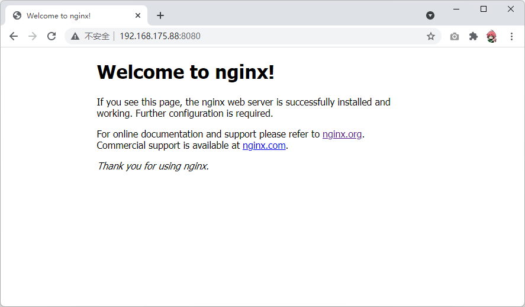

## 查看容器

可以输入如下命令查看容器

```bash
[root@localhost ~]# docker ps -a
CONTAINER ID   IMAGE     COMMAND                  CREATED              STATUS                     PORTS                                     NAMES
3cea5b546024   nginx     "/docker-entrypoint.…"   6 seconds ago        Up 5 seconds               0.0.0.0:49155->80/tcp, :::49155->80/tcp   webserver
95c7828fdada   centos    "ping -c 3 baidu.com"    12 seconds ago       Exited (0) 9 seconds ago                                             nervous_babbage
bd45f59569b9   nginx     "/docker-entrypoint.…"   About a minute ago   Up About a minute          0.0.0.0:8080->80/tcp, :::8080->80/tcp     webserver1
```

我们可以看到STATUS字段已经是Exited的状态，也就是已经退出了，因为容器必须指定任务可以运行，任务结束就会自动退出。

这个Centos容器的任务是ping三次baidu.com，完成了之后就会退出

容器判断任务是否完成主要看程序是否在前台运行，如果任务后台运行了，或者进入阻塞(可以理解为等待)状态，都会被判定为需要退出

- docker ps
  - 查看容器，后面常常会加上`-a`用来查看所有的容器，默认只显示运行中的容器

## 修改容器

目前nginx容器只能展示默认的页面，我们可以进入Nginx容器中，修改主页文件

```bash
# 输入下面的命令可以进入容器的内部命令行，退出输入exit
docker exec -it webserver1 bash

# 修改index.html文件
root@bd45f59569b9:/# cat << EOF > /usr/share/nginx/html/index.html
> <h1>Hello Docker!</h1>
> EOF
root@bd45f59569b9:/# exit
```

打开浏览器，刷新页面，可以看到网页已经被修改

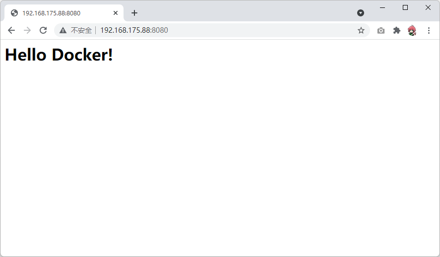

- docker exec -it <容器名> bash
  - 这条命令可以在容器中另外开启一个bash交互命令行，让你可以修改这个容器
  - 主要用于容器测试，因为这种修改并不能永久保存，大家只要把容器理解为一次性的打工人即可，随用随弃。下次用就从镜像重新运行。
  - 关于镜像的修改，我们会在下次课上详细的讲解

```bash
# 在Linux中，可以使用这样的方式查看Linux的发行版本
# 我们的主机是centos7操作系统
cat /etc/os-release

# 创建一个一直ping baidu.com的容器，这样这个容器就不会自动exited了
docker run -d --name="pingbaidu" centos ping baidu.com

# 查看这个容器的状态 -l 是最后创建的一个容器
[root@localhost ~]# docker ps -l
CONTAINER ID   IMAGE     COMMAND            CREATED          STATUS         PORTS     NAMES
aadb0818a798   centos    "ping baidu.com"   10 seconds ago   Up 9 seconds             pingbaidu

# 进入这个容器
docker exec -it pingbaidu bash

# 查看进程关系
[root@aadb0818a798 /]# ps auxf
USER        PID %CPU %MEM    VSZ   RSS TTY      STAT START   TIME COMMAND
root          7  0.0  0.1  12036  2172 pts/0    Ss   05:16   0:00 bash
root         76  0.0  0.0  44652  1808 pts/0    R+   05:18   0:00  \_ ps auxf
root          1  0.0  0.1  52288  2372 ?        Ss   05:15   0:00 ping baidu.com
```

`ping baidu.com`并不是在bash下运行的，也就是我们进入容器相当于开启了一个后门，而前台的`ping baidu.com`任务并不会停止

## 映射磁盘

容器中的数据往往并不能持久的存在，会随着容器的删除而消失，如下图所示

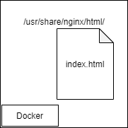

可以在创建容器的时候映射本机的一个文件夹到容器中的指定位置，如下图所示

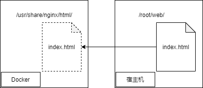

```bash
# 准备好网站文件
mkdir /root/web
vim /root/web/index.html
<h1>in /root/web</h1>

# 创建容器，并且指定磁盘映射
docker run -d -p 8081:80 \
-v /root/web:/usr/share/nginx/html \
--name="webserver2" nginx
```

打开浏览器访问


下面可以将games.zip的源代码放入这个目录中

```bash
# 下载源码
wget http://file.eagleslab.com:8889/%E8%AF%BE%E7%A8%8B%E7%9B%B8%E5%85%B3%E8%BD%AF%E4%BB%B6/%E4%BA%91%E8%AE%A1%E7%AE%97%E8%AF%BE%E7%A8%8B/%E8%AF%BE%E7%A8%8B%E7%9B%B8%E5%85%B3%E6%96%87%E4%BB%B6/games.zip
unzip games.zip

# 查看目录结构
[root@localhost web]# tree -C -L 2
.
├── games
│   ├── game
│   ├── index_files
│   └── index.html
├── games.zip
└── index.html

3 directories, 3 files
```

打开页面访问，确认容器是可以完美使用宿主机上的目录的


这么做的好处就是将运行环境与数据分离开，如果运行环境出现问题，只需要立马启动一个新的运行环境即可，不用担心数据不一致的问题。

各位同学可能遇到过电脑坏了无法工作了，但是电脑上的文件还在，我们只要想办法把文件复制到新的电脑上就可以正常使用了

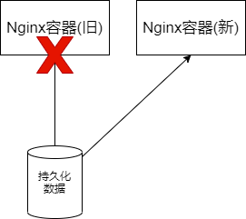

传统的做法需要想办法修复旧的运行环境才能恢复业务的进行，有了Docker，只需要启动一个全新的环境，就可以直接恢复业务了

# 作业

将Nginx容器的配置文件持久化存储在/root/web/config目录中，并且创建两个虚拟主机。

Docker也可以完成LNMP的架构，最终如下图所示

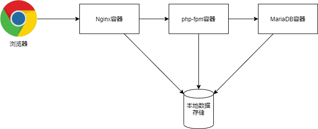

为了防止之前的容器占用的端口号造成冲突，我们可以删除所有的容器

```bash
# 下面的这个命令生产环境严禁使用
docker rm -f `docker ps -qa`
```

# 项目设计

在完成这个案例之前，我们要先好好的规划资源，比如容器名，端口号，本地存储等等

## 存储资源

- 将程序源代码放在/app/data下
- 将配置文件放在/app/config下

## 端口号

- Nginx的80端口暴露在外被浏览器访问
- php-fpm的9000端口不暴露，但是要能被nginx访问
- mariadb的3306端口不暴露，但是要能被php-fpm访问

## 容器名称

这个案例需要容器之间相互连通，容器主要使用容器名称进行访问，所以我们需要将容器名称进行固定

- Nginx容器名为webserver
- php-fpm容器名为php
- mysql容器名为db

# nginx容器

在构建nginx容器的时候需要将配置文件和网站根目录映射到本地的文件夹中

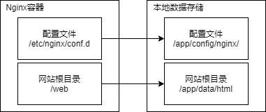

创建对应的文件夹

```bash
mkdir -p /app/config/nginx
mkdir -p /app/data/html
```

在映射覆盖容器文件夹之前，一定要确认一下容器的原文件夹中是否存在配置文件，不然可能会导致无法启动容器

```bash
# 这边发现在容器的原配置文件夹中有一个配置文件
[root@localhost ~]# docker run --rm nginx ls /etc/nginx/conf.d
default.conf
```

我们可以将原本这个文件夹中的文件复制到我们需要映射的文件夹中

```bash
# 将原本的配置复制到需要映射的文件夹中
docker run --rm -v /app/config/nginx:/data nginx cp /etc/nginx/conf.d/default.conf /data
ls /app/config/nginx
```

下面启动Nginx容器

```bash
docker run -d -p 80:80 \
-v /app/data/html:/web \
-v /app/config/nginx:/etc/nginx/conf.d \
--name="webserver" \
--restart=always nginx
```

此时已经可以正常打开Nginx的页面了

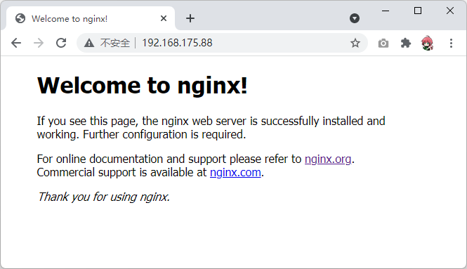

# PHP容器

这边我们选择php:7.3-fpm镜像，下面运行php容器

```bash
docker run -d --name="php" \
-v /app/data/html:/var/www/html \
--restart=always php:7.3-fpm

# 我们可以观察到这个php容器的9000端口是开放的，不过我们未给任何映射，所以只能容器之间访问
[root@localhost ~]# docker ps -l
CONTAINER ID   IMAGE         COMMAND                  CREATED          STATUS          PORTS      NAMES
b9175c6239d1   php:7.3-fpm   "docker-php-entrypoi…"   38 seconds ago   Up 37 seconds   9000/tcp   php
```

## php探针

为了让nginx可以连接到php容器，我们将Nginx容器的启动命令改成如下

```bash
# 先删除nginx容器
docker stop webserver
docker rm webserver

# 启动命令修改如下
docker run -d -p 80:80 \
-v /app/data/html:/web \
-v /app/config/nginx:/etc/nginx/conf.d \
--name="webserver" \
--link php:php \
--restart=always nginx

# 可以观察到，原理其实就是修改了hosts文件
[root@localhost ~]# docker exec -it webserver cat /etc/hosts
127.0.0.1       localhost
::1     localhost ip6-localhost ip6-loopback
fe00::0 ip6-localnet
ff00::0 ip6-mcastprefix
ff02::1 ip6-allnodes
ff02::2 ip6-allrouters
172.17.0.3      php b9175c6239d1
172.17.0.2      dea509ab38a8
```

创建Nginx配置文件，在其中连接php容器

```bash
# 在宿主机上创建虚拟主机配置文件
vim /app/config/nginx/php.conf
server {
        listen 80;
        server_name php.iproute.cn;
        root /web/php;

        location / {
                index index.php index.html;
         }

        location ~ \.php$ {
                fastcgi_pass php:9000;
                fastcgi_index index.php;
                fastcgi_param SCRIPT_FILENAME php$fastcgi_script_name;
                fastcgi_param SCRIPT_NAME $fastcgi_script_name;
                include fastcgi_params;
         }
}

# 检查配置，重启nginx容器
docker exec webserver nginx -t
docker restart webserver
```

创建php探针

```bash
vim /app/data/html/php/index.php
<?php
    phpinfo();
?>
```

打开浏览器进行访问测试

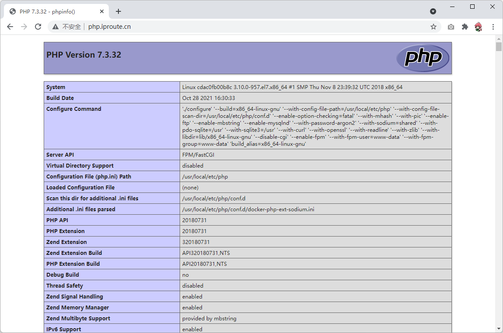

# Mysql容器

这边我们选用官方的Mysql镜像，说明文档：https://hub.docker.com/_/mysql

启动mysql容器

```bash
# 先创建用于存放mysql数据的文件夹
mkdir /app/data/mysql
docker run --name some-mysql \
-v /app/data/mysql:/var/lib/mysql \
-e MYSQL_ROOT_PASSWORD=123456 -d \
--name="db" --restart="always" mysql:5.6
```

将php容器与mysql容器互联

```bash
# 删除php容器
docker stop php
docker rm php

# 修改php启动命令如下
docker run -d --name="php" \
-v /app/data/html:/var/www/html \
--link db:db \
--restart=always php:7.3-fpm
```

## 测试mysql数据库

编写php程序如下

```bash
vim /app/data/html/php/mysql.php
<?php
    $servername = "db";
    $username = "root";
    $password = "123456";

    // 创建连接
    $conn = mysqli_connect($servername, $username, $password);

    // 检测连接
    if (!$conn) {
         die("Connection failed: " . mysqli_connect_error());
    }
    echo "连接MySQL...成功！";
?>
```

发现根本连不上，因为php容器默认情况下根本不支持mysql连接功能

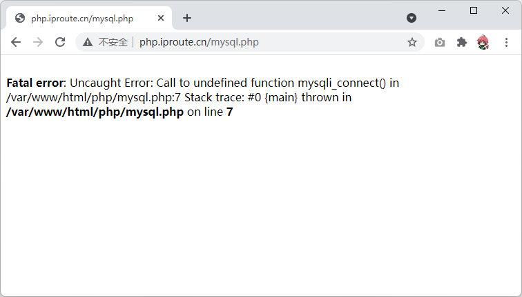

我们可以对这个php容器进行定制，关于Dockerfile的功能，我们会在下节课详解，这边只需要知道这个可以对镜像进行定制即可。

```bash
# 在/root下创建一个文件叫做Dockerfile
vim Dockerfile
FROM php:7.3-fpm
RUN docker-php-ext-install mysqli
RUN docker-php-ext-enable mysqli
RUN docker-php-ext-install pdo pdo_mysql
EXPOSE 9000

# 开始构建我们定制的支持mysql的php容器
docker build -t myphp:7.3-fpm .

# 删除php容器
docker stop php
docker rm php

# 将启动镜像换成我们自己定制的php镜像
docker run -d --name="php" \
-v /app/data/html:/var/www/html \
--link db:db \
--restart=always myphp:7.3-fpm
```

在浏览器中测试，发现功能已经正常


# 作业

结合前面课程学到的知识，自行搭建如下几个服务

## phpmyadmin

源码下载地址：http://file.eagleslab.com:8889/%E8%AF%BE%E7%A8%8B%E7%9B%B8%E5%85%B3%E8%BD%AF%E4%BB%B6/%E4%BA%91%E8%AE%A1%E7%AE%97%E8%AF%BE%E7%A8%8B/%E8%AF%BE%E7%A8%8B%E7%9B%B8%E5%85%B3%E6%96%87%E4%BB%B6/phpmyadmin.zip

搭建好之后如下图

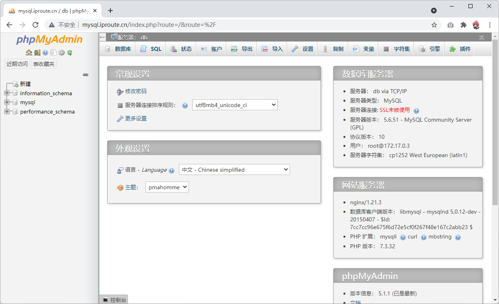

## kodexplore

搭建好之后如下图

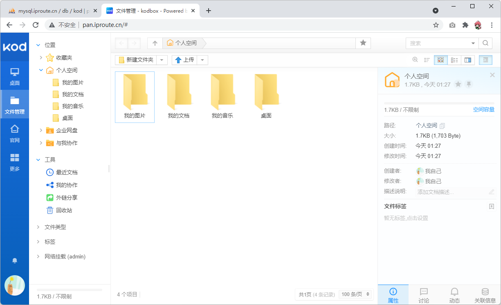

