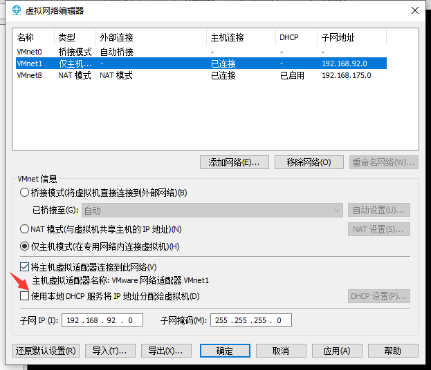
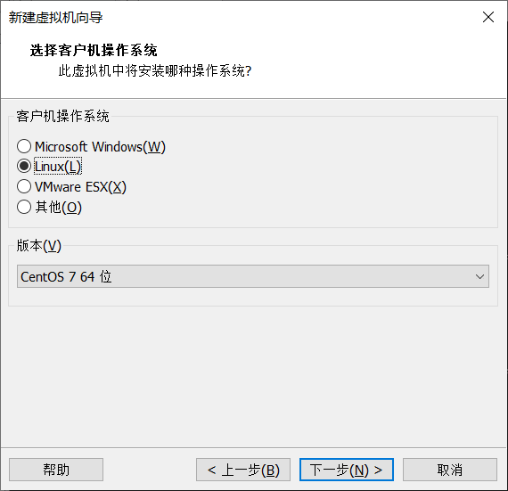
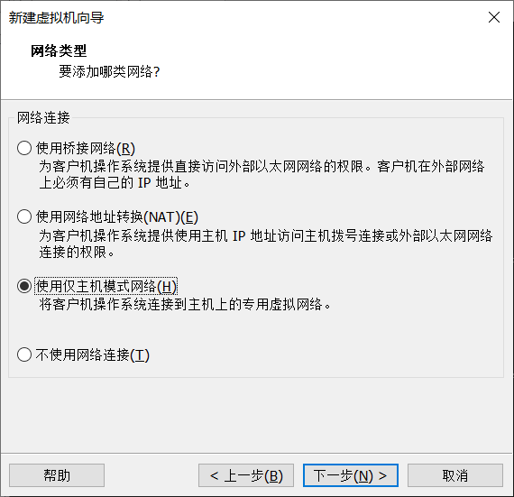
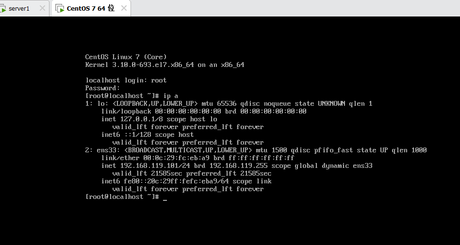

# PXE无人值守安装系统

使用PXE+KickStart可以通过非交互模式完成无人值守安装操作系统。

PXE 客户端从DHCP服务器获取到PXE服务端的具体IP，然后再从PXE配置文件中获取vmlinuz、initrd.img、ks.cfg、系统镜像等文件所在的服务器和位置信息。

# 什么是PXE?

- PXE (Preboot Execution Environment) 是一种基于网络的操作系统无人值守安装技术。它允许客户端计算机通过网络引导并安装操作系统,而无需任何本地存储介质。

  将 PXE 与 Kickstart 配合使用,可以实现以下自动化安装流程:

  1. 配置 PXE 服务器
     在网络上建立一个 PXE 引导服务器,提供 DHCP 和 TFTP 服务,用于为客户端机器提供 PXE 引导环境。
  2. 准备 Kickstart 配置文件
     编写好符合您需求的 Kickstart 配置文件,并将其置于 PXE 服务器的 HTTP 共享目录下。
  3. 客户端机器 PXE 引导
     配置客户端机器的 BIOS 以支持 PXE 网络引导。在客户端启动时,它会通过 DHCP 获取 PXE 引导所需的信息,然后从 TFTP 服务器下载引导程序。
  4. 自动安装操作系统
     引导程序会从 HTTP 服务器下载 Kickstart 配置文件,并根据文件中定义的规则自动安装操作系统。整个过程不需要任何人工干预。

- Client/Server的工作模式


# 批量装机软件

1. **Cobbler：**
   Cobbler 是一款开源的网络安装管理系统,提供基于 PXE 的自动化安装和部署功能。它支持多种操作系统,包括 Red Hat、CentOS、Fedora、Debian、Ubuntu 等。Cobbler 使用简单的配置文件来定义系统安装过程,类似于 Kickstart。它可以与 Puppet、Ansible 等配置管理工具集成使用。

2. **Preseed：**
   Preseed 是 Debian/Ubuntu 系列操作系统的自动化安装工具,与 Kickstart 的功能类似。Preseed 使用一个应答文件来定义安装过程中的各种选项,如磁盘分区、软件包选择等。这个应答文件可以放在网络上供安装程序自动获取。

3. **AutoYaST：**
   AutoYaST 是 SUSE/openSUSE 系统的自动安装工具,同样使用一个配置文件来定义安装过程。与 Kickstart 相似,AutoYaST 配置文件可以指定分区信息、软件包选择、服务配置等。

4. **Kickstart：**

   Kickstart 是 Red Hat Enterprise Linux (RHEL) 和 CentOS 等发行版中的一个功能,用于实现操作系统的自动化安装。它可以通过一个预先配置好的安装配置文件来完成整个安装过程,省去了手动安装的繁琐步骤。

   Kickstart 的主要特点包括:

   - 自动化安装
     Kickstart 配置文件定义了操作系统的各种安装选项,如分区方案、软件包选择、网络设置等。安装过程可以完全自动化进行,无需人工干预。

   - 可重复性
     一旦 Kickstart 配置文件编写好,就可以在多台机器上重复执行安装,确保系统环境的一致性。这对于大规模部署非常有帮助。

   - 灵活性
     Kickstart 支持丰富的配置指令,可以满足各种复杂的安装需求。您可以根据实际情况自定义配置文件。

   - 集中管理
     Kickstart 配置文件可以集中存储在网络服务器上,在需要时由客户端机器自动下载并执行安装。这简化了配置文件的维护和更新。

   使用 Kickstart 的典型流程如下:

   1. 编写 Kickstart 配置文件
   2. 将配置文件发布到网络服务器
   3. 在客户端机器上启动 PXE 网络安装
   4. 客户端自动读取配置文件并完成无人值守的安装过程

# 实验部署

- 关闭防火墙和selinux

```shell
[root@server1 ~]# systemctl status firewalld.service 
● firewalld.service - firewalld - dynamic firewall daemon
   Loaded: loaded (/usr/lib/systemd/system/firewalld.service; disabled; vendor preset: enabled)
   Active: inactive (dead)
     Docs: man:firewalld(1)
[root@server1 ~]# getenforce 
Permissive
```

- 配置DHCP Server：DHCP是一个局域网的网络协议，使用UDP协议工作，主要有两个用途，给内部网络或网络服务供应商自动分配IP地址，给用户或者内部网络管理员作为对所有计算机中央管理的手段。
- 准备网卡，添加一张仅主机网卡

```bash
[root@server1 ~]# nmcli connection modify '有线连接 1' con-name ens37
[root@server1 ~]# nmcli connection modify ens37 ipv4.addresses 192.168.99.200/24 autoconnect yes ipv4.method manual
[root@server1 ~]# nmcli connection down ens37
[root@server1 ~]# nmcli connection up ens37
[root@server1 ~]# ip a | grep global
    inet 192.168.92.200/24 brd 192.168.92.255 scope global ens37
```

- 配置dhcp服务
  - 关闭仅主机网卡的自动dhcp



- 准备dhcp服务器

```bash
[root@server1 ~]# yum -y install dhcp -y
[root@server1 ~]# vim /etc/dhcp/dhcpd.conf 
subnet 192.168.99.0 netmask 255.255.255.0 {
range 192.168.99.100 192.168.99.199;
option subnet-mask 255.255.255.0;
default-lease-time 21600;
max-lease-time 43200;
next-server 192.168.99.200;
filename "/pxelinux.0";
}
[root@server1 ~]# systemctl restart dhcpd
[root@server1 ~]# systemctl enable dhcpd
Created symlink from /etc/systemd/system/multi-user.target.wants/dhcpd.service to /usr/lib/systemd/system/dhcpd.service.

# 配置文件解释
range 192.168.92.100 192.168.92.199; # 可分配的起始IP-结束IP
option subnet-mask 255.255.255.0; # 设定netmask
default-lease-time 21600; # 设置默认的IP租用期限
max-lease-time 43200; # 设置最大的IP租用期限
next-server 192.168.92.200; # 告知客户端TFTP服务器的ip
filename "/pxelinux.0"; # 告知客户端从TFTP根目录下载pxelinux.0文件

# 验证端口号
[root@server1 ~]# ss -uanp | grep 67
UNCONN     0      0            *:67                       *:*                   users:(("dhcpd",pid=4333,fd=7))
```

- 安装tftp

```bash
  [root@server1 ~]# yum install tftp-server -y
  [root@server1 ~]# systemctl start tftp
  [root@server1 ~]# systemctl enable tftp
  [root@server1 ~]# ss -uanp | grep 69
  UNCONN     0      0           :::69                      :::*                   users:(("systemd",pid=1,fd=25))
```

- pxe引导配置，syslinux是一个功能强大的引导加载程序，而且兼容各种介质。syslinux是一个小型的Linux操作系统，它的目的是简化首次安装或其他特殊用途的启动盘。首先需要将pxelinux.0配置文件复制到tftp目录下，再将光盘镜像中的一些文件复制到tftp的目录中。

```bash
[root@server1 ~]# yum install syslinux -y
[root@server1 ~]# cd /var/lib/tftpboot/
[root@server1 tftpboot]# cp /usr/share/syslinux/pxelinux.0 /var/lib/tftpboot/
[root@server1 tftpboot]# mkdir -p /media/cdrom
[root@server1 tftpboot]# mount /dev/cdrom /media/cdrom/
mount: /dev/sr0 写保护，将以只读方式挂载
[root@server1 tftpboot]# cp /media/cdrom/images/pxeboot/{vmlinuz,initrd.img} /var/lib/tftpboot/
[root@server1 tftpboot]# cp /media/cdrom/isolinux/{vesamenu.c32,boot.msg} /var/lib/tftpboot/
```

- 配置syslinux服务程序，这个文件是开机时的选项菜单

```bash
[root@server1 tftpboot]# mkdir -p /var/lib/tftpboot/pxelinux.cfg
[root@server1 tftpboot]# cp /media/cdrom/isolinux/isolinux.cfg pxelinux.cfg/default
[root@server1 tftpboot]# vim /var/lib/tftpboot/pxelinux.cfg/default 
  1 default linux
 64   append initrd=initrd.img inst.stage2=ftp://192.168.99.200 ks=ftp://192.168.99.200/pub/ks.cfg quiet
```

- 配置vsftpd服务程序，光盘镜像是通过ftp协议传输的，因此要用到vsftpd服务程序

```bash
[root@server1 tftpboot]# yum install -y vsftpd
[root@server1 tftpboot]# systemctl restart vsftpd
[root@server1 tftpboot]# systemctl enable vsftpd
Created symlink from /etc/systemd/system/multi-user.target.wants/vsftpd.service to /usr/lib/systemd/system/vsftpd.service.
[root@server1 tftpboot]# cp -r /media/cdrom/* /var/ftp/
```

- 创建Kickstart应答文件，Kickstart应答文件中包含了系统安装过程中需要使用的选项和参数信息，系统可以自动调取这个应答文件的内容，从而彻底实现无人值守安装系统。

```bash
[root@server1 tftpboot]# cp ~/anaconda-ks.cfg /var/ftp/pub/ks.cfg
[root@server1 tftpboot]# chmod +r /var/ftp/pub/ks.cfg 
[root@server1 tftpboot]# vim /var/ftp/pub/ks.cfg 
  5 url --url=ftp://192.168.99.200		# 删除原本的cdrom
 30 clearpart --all --initlabel			# 意思是清空所有磁盘内容并初始化磁盘
```

- 自动部署客户端主机








