# Zabbix企业级监控方案

# 常见监控软件介绍

## Cacti

- Cacti 是一套基于 PHP、MySQL、SNMP 及 RRD Tool 开发的监测图形分析工具，Cacti 是使用**轮询**的方式由主服务器向设备发送数据请求来获取设备上状态数据信息的,如果设备不断增多,这个**轮询的过程就非常的耗时**，轮询的结果就不能即时的反应设备的状态了。Cacti 监控关注的是对数据的**展示**，却不关注数据异常后的反馈。如果凌晨 3 点的时候设备的某个数据出现异常，除非监控人员在屏幕前发现这个异常变化，否则是没有任何报警机制能够让我们道出现了异常。

## Nagios

- Nagios 是一款**开源**的免费网络监控报警服务,能有效监控 Windows、Linux 和 Unix 的主机状态，交换机、路由器和防火墙等网络设置，打印机、网络投影、网络摄像等设备。在系统或服务状态异常时发出邮件或短信报警第一时间通知运维人员，在状态恢复后发出正常的邮件或短信通知。Nagios 有完善的插件功能,可以方便的根据应用服务扩展功能。
- Nagios 已经可以支持由数万台服务器或上千台网络设备组成的云技术平台的监控,它可以充分发挥自动化运维技术特点在设备和人力资源减少成本。只是 Nagios 无法将多个相同应用集群的数据集合起来,也不能监控到集群中特殊节点的迁移和恢复。

## Ganglia

- Ganglia 是 UC Berkeley 发起的一个开源集群监视项目,设计用于测量数以千计的节点。Ganglia 的核心包含 gmond、gmetad 以及一个 Web 前端。
- 主要是用来**监控系统性能**,如:CPU 、内存、硬盘利用率, I/O 负载、网络流量情况等,通过曲线很容易见到每个节点的工作状态,对合理调整、分配系统资源,提高系统整体  性能起到重要作用,目前是监控HADOOP 的官方推荐服务。

## Zabbix

- Zabbix 是一个基于 WEB 界面的提供分布式系统监视以及网络监视功能的企业级的开源解决方案。zabbix 能监视各种网络参数,保证服务器系统的安全运营;并提供灵活的通知机制以让系统管理员快速定位/解决存在的各种问题。
- Zabbix 是由 Alexei Vladishev 创建，目前由 Zabbix SIA 在持续开发和支持。
- Zabbix 是一个企业级的分布式开源监控方案。 
- Zabbix 是一款能够监控各种网络参数以及服务器健康性和完整性的软件。
- Zabbix 使用灵活的通知机制，允许用户为几乎任何事件配置基于邮件的告警。这样可以快速反馈服务器的问题。基于已存储的数据，Zabbix提供了出色的报告和数据可视化功能。这些功能使得Zabbix成为容量规划的理想方案。 
- Zabbix 支持主动轮询和被动捕获。
- Zabbix所有的报告、统计信息和配置参数都可以通过基于Web的前端页面进行访问。基于Web的前端页面可以确保您从任何方面评估您的网络状态和服务器的健康性。
- Zabbix是免费的。Zabbix是根据GPL通用公共许可证第2版编写和发行的。这意味着它的源代码都是免费发行的，可供公众任意使用, [商业支持](http://www.zabbix.com/support.php) 由Zabbix公司提供。

## 监控区别

- nagios 图形不是特别好，也可以安装图形插件，但是也不怎么好看
- nagios 一般情况下如果需要图形可以和 cacti 配合使用
- cacti 的监控是轮询监控,效率低，图形相对 nagios 比较好看
- zabbix 和 nagios 因为是并发监控，对 cpu 的要求更高
- zabbix 在性能和功能上都强大很多
- zabbix 的图形相当漂亮
- 支持多种监控方式 zabbix-agent  snmp 等等
- 支持分布式监控,能监控的 agent 非常多
- zabbix 有图形的 web 配置界面，配置简洁
- zabbix 支持自动发现功能

# Zabbix监控简介

## zabbix优点

- 开源,无软件成本投入
- Server 对设备性能要求低
- 支持设备多,自带多种监控模板
- 支持分布式集中管理,有自动发现功能,可以实现自动化监控
- 开放式接口,扩展性强,插件编写容易
- 当监控的 item 比较多服务器队列比较大时可以采用主动状态,被监控客户端主动 从server 端去下载需要监控的 item 然后取数据上传到 server 端。 这种方式对服务器的负载比较小。
- Api 的支持,方便与其他系统结合

## zabbix缺点

- 需在被监控主机上安装 agent,所有数据都存在数据库里, 产生的数据据很大,瓶颈主要在数据库。
- 项目批量修改不方便  
- 社区虽然成熟，但是中文资料相对较少，服务支持有限；
- 入门容易，能实现基础的监控，但是深层次需求需要非常熟悉Zabbix并进行大量的二次定制开发难度较大
- 系统级别报警设置相对比较多，如果不筛选的话报警邮件会很多；并且自定义的项目报警需要自己设置，过程比较繁琐；
- 缺少数据汇总功能，如无法查看一组服务器平均值，需进行二次开发； 

## zabbix组件结构

- Zabbix_Server：整个监控体系中最核心的组件，它负责接收客户端发送的报告信息，所有配置、统计数据及操作 数据都由它组织。 
- 数据库存储：所有配置信息和Zabbix收集到的数据都被存储在数据库中。 
- Web界面：为了从任何地方和任何平台都可以轻松的访问Zabbix, 我们提供基于Web的Zabbix界面。该界面是 Zabbix Server的一部分，通常跟Zabbix Server运行在同一台物理机器上（！如果使用SQLite,Zabbix Web界面必 须要跟Zabbix Server运行在同一台物理机器上。） 
- Zabbix_Proxy（可选）：用于监控节点非常多的分布式环境中，它可以代理zabbix-server的功能，减轻zabbixserver的压力。 
- Zabbix_Agent：zabbix-agent为客户端软件，用于采集各监控项目的数据，并把采集的数据传输给zabbixproxy或zabbix-server。

## zabbix监控方式

- 被动模式：

  - 被动检测：相对于agent而言；agent, **server向agent请求获取配置的各监控项相关的数据**，agent接收请求、获取数据并响应给server；

- 主动模式

  - 主动检测：相对于agent而言；agent(active),**agent向server请求与自己相关监控项配置**，主动地将server配置的监控项相关的数据发送给server；
  - 主动监控能极大节约监控server 的资源。

## Zabbix架构

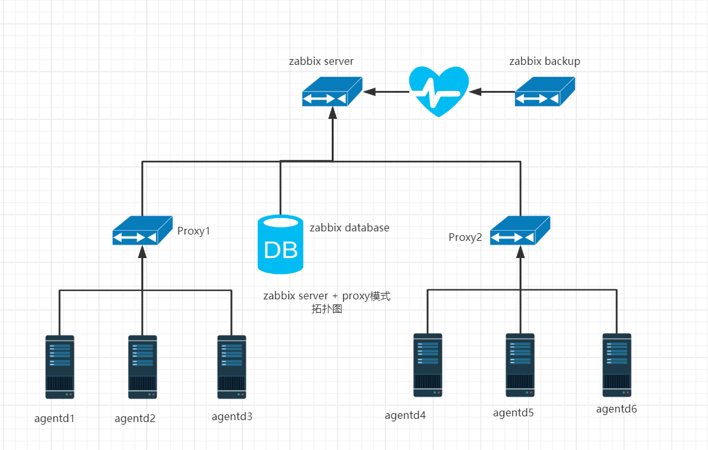

## Zabbix常用术语

- 主机：一台你想监控的网络设备，用IP或域名表示 
- 主机组：主机的逻辑组；它包含主机和模板。一个主机组里的主机和模板之间并没有任何直接的关联。通常在给不同用户组的主机分配权限时候使用主机组。 
- 监控项：你想要接收的主机的特定数据，一个度量数据。
- 触发器：一个被用于定义问题阈值和“评估”监控项接收到的数据的逻辑表达式 当接收到的数据高于阈值时，触发器从“OK”变成“Problem”状态。当接收到的数据低于阈值时，触发器保留/返回一个“OK”的状态。 

# Zabbix-server部署

## 安装Zabbix 服务端

1. 准备zabbix的yum源，这里通过安装zabbix-release软件包来自动获取zabbix的源。然后安装服务端相关组件

   官网地址：https://www.zabbix.com/

```bash
[root@server1 ~]# rpm -Uvh https://repo.zabbix.com/zabbix/4.0/rhel/7/x86_64/zabbix-release-4.0-2.el7.noarch.rpm
[root@server1 ~]# yum install zabbix-server-mysql zabbix-web-mysql zabbix-agent -y

```

2. 关闭防火墙和Selinux

```bash
[root@server1 ~]# setenforce 0
[root@server1 ~]# systemctl stop firewalld
```

## 准备数据库环境

1. 安装数据库，这里还是选择mariadb即可

```bash
[root@server1 ~]# yum install -y mariadb-server
# 启动mariadb数据库
[root@server1 ~]# systemctl enable --now mariadb
# 初始化数据库并设置密码
[root@server1 ~]# mysqladmin -uroot password '123456'
# 测试数据库连接是否正常
[root@server1 ~]# mysql -uroot -p123456 -e "show databases;"
+--------------------+
| Database           |
+--------------------+
| information_schema |
| mysql              |
| performance_schema |
| test               |
+--------------------+
```

2. 创建zabbix所需数据库以及zabbix账户

```bash
# 创建zabbix库
MariaDB [(none)]> create database zabbix char set utf8 collate utf8_bin;
Query OK, 1 row affected (0.00 sec)
# 创建zabbix账户
MariaDB [(none)]> grant all privileges on zabbix.* to zabbix@localhost identified by  '123456';
Query OK, 0 rows affected (0.00 sec)
# 刷新账户信息
MariaDB [(none)]> flush privileges;
Query OK, 0 rows affected (0.00 sec)
```

## 修改服务端相关配置

1. 导入初始架构数据

```bash
[root@server1 ~]# zcat /usr/share/doc/zabbix-server-mysql*/create.sql.gz | mysql -uzabbix -D zabbix -p123456
# zabbix安装包中有一个SQL文件，这是zabbix架构的初始数据。
[root@server1 ~]# mysql -uzabbix -p123456 -D zabbix -e "show tables"
+----------------------------+
| Tables_in_zabbix           |
+----------------------------+
| acknowledges               |
| actions                    |
| alerts                     |
| application_discovery      |
| application_prototype      |
| application_template       |
| applications               |
| auditlog                   |
| auditlog_details           |
| autoreg_host               |
......
......
......
```

2. 配置zabbix连接数据库

```bash
[root@server1 ~]# vim /etc/zabbix/zabbix_server.conf
DBPassword=123456
```

3. 编辑zabbix网站中php的相关配置

```bash
[root@server1 ~]# vim /etc/httpd/conf.d/zabbix.conf
php_value max_execution_time 300
php_value memory_limit 128M
php_value post_max_size 16M
php_value upload_max_filesize 2M
php_value max_input_time 300
php_value always_populate_raw_post_data ‐1
php_value date.timezone Asia/Shanghai 

# 配置解释
设置 PHP 脚本的最大执行时间为 300 秒(5分钟)
设置 PHP 脚本的最大内存使用限制为 128 MB
设置 POST 请求的最大数据大小为 16 MB
设置上传文件的最大大小为 2 MB
设置 PHP 脚本接受输入的最大时间为 300 秒(5分钟)
设置 PHP 总是填充 $HTTP_RAW_POST_DATA 变量
设置 PHP 的时区为 Asia/Shanghai(中国时区)
```

4. 启动所有服务

```bash
# 安装zabbix的时候，会附带按照httpd来提供web服务，因为zabbix默认情况下是有一个web网站的
[root@server1 ~]# systemctl restart zabbix-server httpd mariadb zabbix-agent
```

## 服务端初始化

完成上述配置后，可以在浏览器中输入`http://IP/zabbix`打开zabbix的web界面开始初始化

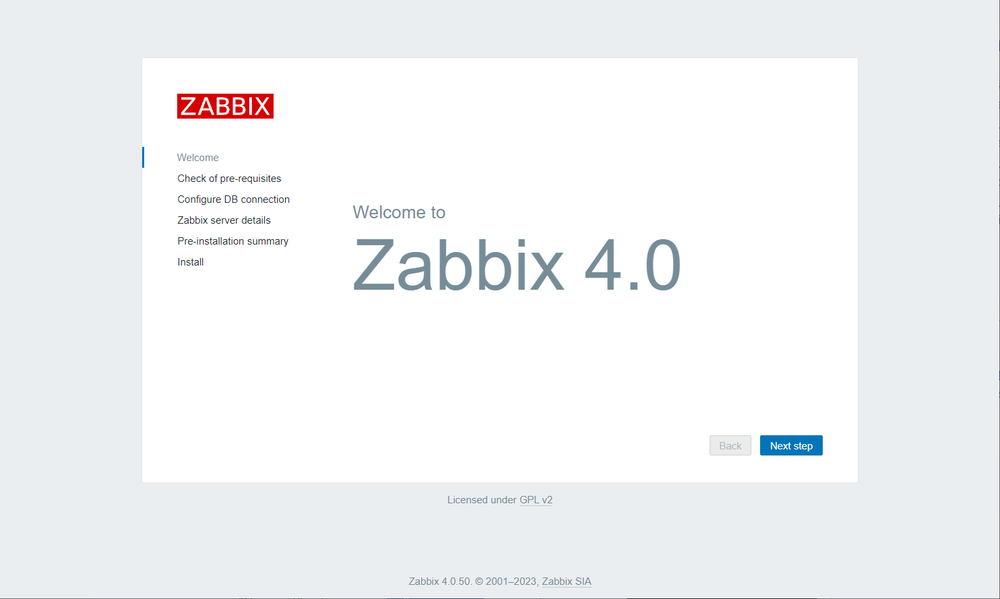

2. 状态检测

   确保所有的php检测都是ok的状态


3. 连接数据库

   数据库的信息按照图上的填入，其中密码是我们刚刚设置的zabbix用户的密码，端口号3306


4. zabbix信息

   这里保持默认，name可以空着不填

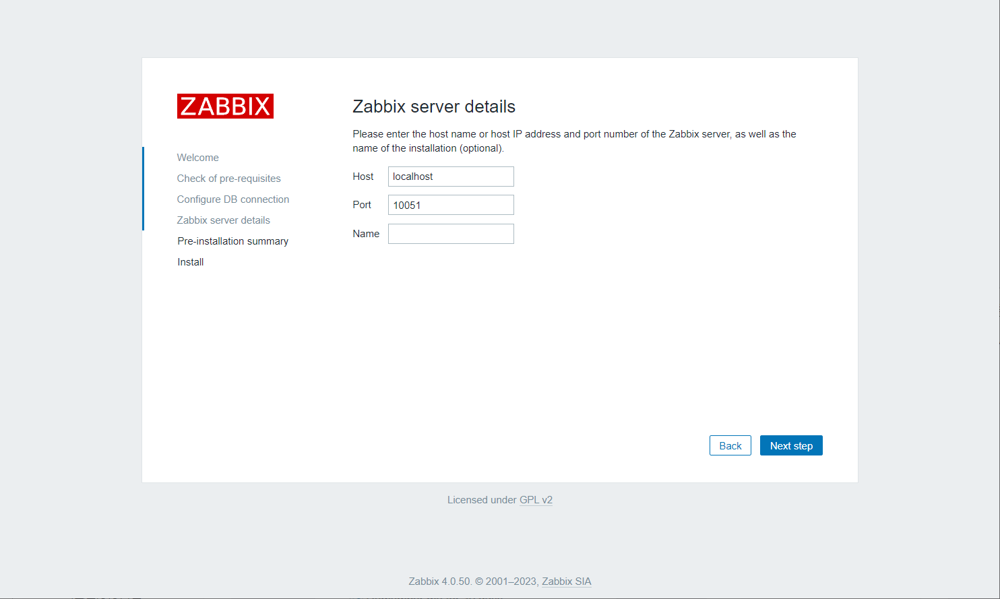

5. 完成安装

   看到如下界面，说明zabbix初始化成功


6. 登录zabbix的web网站

   **默认的username：Admin    password：zabbix**


7. 修改中文显示

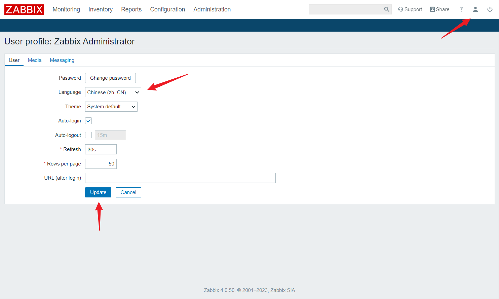

## 客户端配置

1. 在server2上安装zabbix-agent客户端

```bash
[root@server2 ~]# rpm -Uvh https://repo.zabbix.com/zabbix/4.0/rhel/7/x86_64/zabbix-release-4.0-2.el7.noarch.rpm
[root@server2 ~]# yum install zabbix-agent -y
```

2. 修改客户端配置文件

```bash
[root@server2 ~]# vim /etc/zabbix/zabbix_agentd.conf 
# 主要修改以下三个参数
Server=192.168.175.10
ServerActive=192.168.175.10
Hostname=server1
```

3. 启动zabbix-agent

```bash
[root@server2 ~]# setenforce 0
[root@server2 ~]# systemctl stop firewalld
[root@server2 ~]# systemctl start zabbix-agent.service
```

# 快速使用

## 主机监控

先简单的监控一个主机的状态和信息

1. 添加一个主机

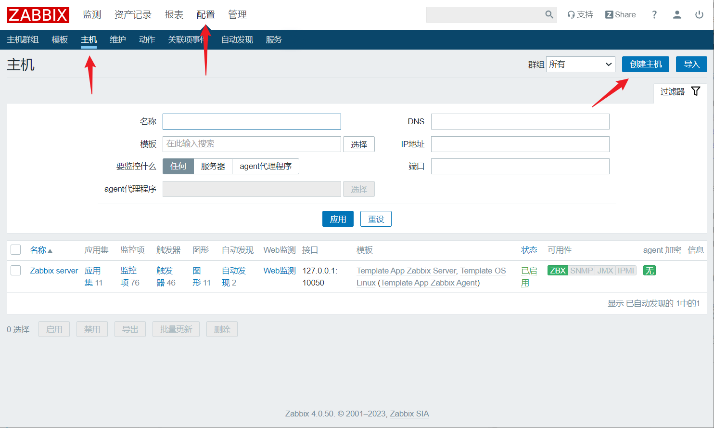


2. 添加模板

   zabbix内置了很多模板，比如监控Linux主机的模板，监控httpd的模板，监控MySQL的模板等等。我们可以直接使用这些模板，当然也可以自定义。一个模板中包含很多的应用集，每个应用集中又包含很多具体的监控项


3. 创建应用集

   模板中内置的很多的监控项，但是如果没有我们想要的监控项的话，我们可以手动添加。先创建一个应用集，然后再应用集中创建监控项


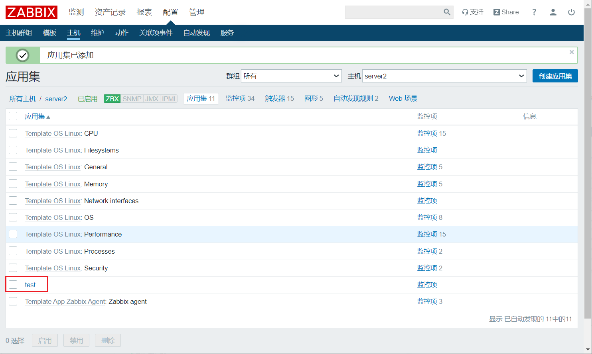

4. 创建监控项

   创建好了test应用集以后，我们再向该应用集中添加具体的监控项。


## 自定义配置监控项

### Nginx进程监控

在server2上安装nginx服务，然后编写监控项配置文件，来监控nginx的进程数量

#### 安装nginx

```bash
[root@server2 ~]# yum install -y epel-release
[root@server2 ~]# yum install -y nginx
[root@server2 ~]# systemctl enable --now nginx
```

#### 配置监控项文件

```bash
[root@server2 ~]# vim /etc/zabbix/zabbix_agentd.d/userparameter_nginx.conf 
UserParameter=nginx_process_num,ps aux | grep -c nginx

# 重启zabbix-agent
[root@server2 ~]# systemctl restart zabbix-agent
```

#### 服务端验证

可以在服务端上安装一个zabbix工具`zabbix-get`,可以通过该工具在命令行中验证监控项的是否生效

```bash
[root@server1 ~]# yum install -y zabbix-get
[root@server1 ~]# zabbix_get -s 192.168.88.20 -k nginx_process_num
7
```

#### 添加监控项

在web网站上使用刚刚编写的监控项

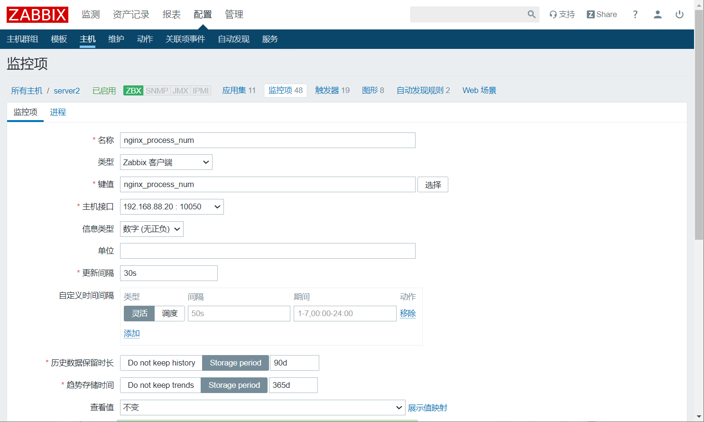

查看刚刚添加的监控项键值的状态


查看具体的检测到的数据，在菜单栏中点击监测->最新数据，然后过滤刚刚的监控项


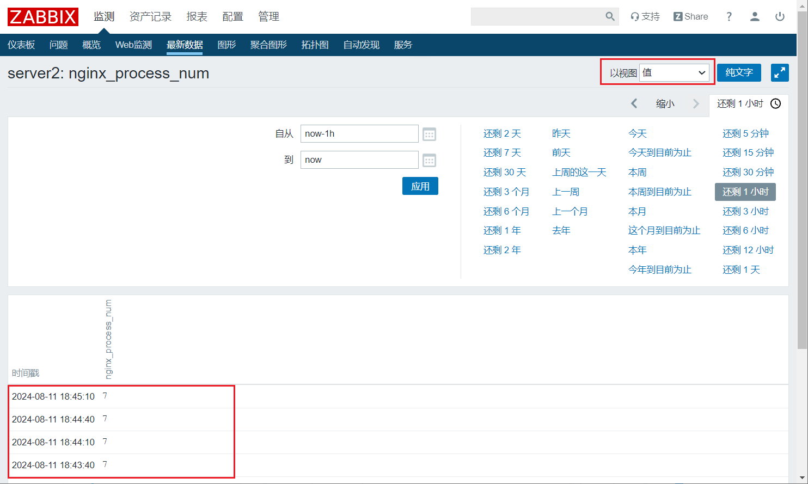

#### 添加触发器

给该监控项添加触发器，让他能够出发警告通知


创建一个新的触发器


可以看到我们刚刚添加的触发器

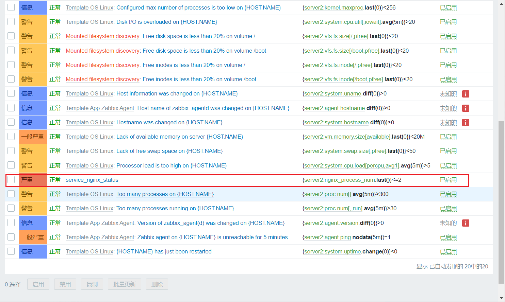

#### 手动宕机告警测试

在server2上手动关闭nginx后，在仪表盘中查看告警信息

```bash
[root@server2 ~]# systemctl stop nginx
```

查看仪表盘

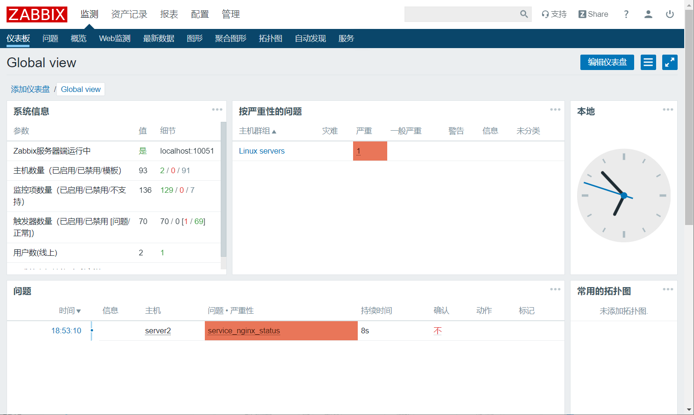

可以看到这里有一个告警信息，说明我们刚刚创建的触发器生效了。

这样的话，运维工程师就可以直接在这个网站上看到当前服务器组或者集群中各个机器和服务的状态。 不需要在一个一个登录上去查看了。

但是只是这样还是不够只能，稍后我们将继续配置触发告警以后，通过邮件或者叮叮企业微信等平台向工程师发送告警信息。

## 常见服务的监控项

### Redis自定义监控项

```bash
vim /usr/local/zabbix/etc/zabbix_agentd.conf.d/redis.conf
UserParameter=Redis.Status,/usr/local/redis/bin/redis-cli -h 127.0.0.1 -p 6379 ping |grep -c PONG
UserParameter=Redis_conn[*],/usr/local/redis/bin/redis-cli -h $1 -p $2 info | grep -w "connected_clients" | awk -F':' '{print $2}'
UserParameter=Redis_rss_mem[*],/usr/local/redis/bin/redis-cli -h $1 -p $2 info | grep -w "used_memory_rss" | awk -F':' '{print $2}'
UserParameter=Redis_lua_mem[*],/usr/local/redis/bin/redis-cli -h $1 -p $2 info | grep -w "used_memory_lua" | awk -F':' '{print $2}'
UserParameter=Redis_cpu_sys[*],/usr/local/redis/bin/redis-cli -h $1 -p $2 info | grep -w "used_cpu_sys" | awk -F':' '{print $2}'
UserParameter=Redis_cpu_user[*],/usr/local/redis/bin/redis-cli -h $1 -p $2 info | grep -w "used_cpu_user" | awk -F':' '{print $2}'
UserParameter=Redis_cpu_sys_cline[*],/usr/local/redis/bin/redis-cli -h $1 -p $2 info | grep -w "used_cpu_sys_children" | awk -F':' '{print $2}'
UserParameter=Redis_cpu_user_cline[*],/usr/local/redis/bin/redis-cli -h $1 -p $2 info | grep -w "used_cpu_user_children" | awk -F':' '{print $2}'
UserParameter=Redis_keys_num[*],/usr/local/redis/bin/redis-cli -h $1 -p $2 info | grep -w "$$1" | grep -w "keys" | grep db$3 | awk -F'=' '{print $2}' | awk -F',' '{print $1}'
UserParameter=Redis_loading[*],/usr/local/redis/bin/redis-cli -h $1 -p $2 info | grep loading | awk -F':' '{print $$2}'

Redis.Status --检测Redis运行状态， 返回整数
Redis_conn  --检测Redis成功连接数，返回整数
Redis_rss_mem  --检测Redis系统分配内存，返回整数
Redis_lua_mem  --检测Redis引擎消耗内存，返回整数
Redis_cpu_sys --检测Redis主程序核心CPU消耗率，返回整数
Redis_cpu_user --检测Redis主程序用户CPU消耗率，返回整数
Redis_cpu_sys_cline --检测Redis后台核心CPU消耗率，返回整数
Redis_cpu_user_cline --检测Redis后台用户CPU消耗率，返回整数
Redis_keys_num --检测库键值数，返回整数
Redis_loding --检测Redis持久化文件状态，返回整数
```

### Nginx自定义监控项

```bash
vim /etc/nginx/conf.d/default.conf
    location /nginx-status
    {
        stub_status on;
        access_log off;
        allow 127.0.0.1;
        deny all;
    }

    
vim /usr/local/zabbix/etc/zabbix_agentd.conf.d/nginx.conf
UserParameter=Nginx.active,/usr/bin/curl -s "http://127.0.0.1:80/nginx-status" | awk '/Active/ {print $NF}'
UserParameter=Nginx.read,/usr/bin/curl -s "http://127.0.0.1:80/nginx-status" | grep 'Reading' | cut -d" " -f2
UserParameter=Nginx.wrie,/usr/bin/curl -s "http://127.0.0.1:80/nginx-status" | grep 'Writing' | cut -d" " -f4
UserParameter=Nginx.wait,/usr/bin/curl -s "http://127.0.0.1:80/nginx-status" | grep 'Waiting' | cut -d" " -f6
UserParameter=Nginx.accepted,/usr/bin/curl -s "http://127.0.0.1:80/nginx-status" | awk '/^[ \t]+[0-9]+[ \t]+[0-9]+[ \t]+[0-9]+/ {print $1}'
UserParameter=Nginx.handled,/usr/bin/curl -s "http://127.0.0.1:80/nginx-status" | awk '/^[ \t]+[0-9]+[ \t]+[0-9]+[ \t]+[0-9]+/ {print $2}'
UserParameter=Nginx.requests,/usr/bin/curl -s "http://127.0.0.1:80/nginx-status" | awk '/^[ \t]+[0-9]+[ \t]+[0-9]+[ \t]+[0-9]+/ {print $3}'
```

### TCP协议自定义监控项

```bash
vim /usr/local/zabbix/share/zabbix/alertscripts/tcp_connection.sh
#!/bin/bash
function ESTAB { 
/usr/sbin/ss -ant |awk '{++s[$1]} END {for(k in s) print k,s[k]}' | grep 'ESTAB' | awk '{print $2}'
}
function TIMEWAIT {
/usr/sbin/ss -ant | awk '{++s[$1]} END {for(k in s) print k,s[k]}' | grep 'TIME-WAIT' | awk '{print $2}'
}
function LISTEN {
/usr/sbin/ss -ant | awk '{++s[$1]} END {for(k in s) print k,s[k]}' | grep 'LISTEN' | awk '{print $2}'
}
$1

vim /usr/local/zabbix/etc/zabbix_agentd.conf.d/cattcp.conf
UserParameter=tcp[*],/usr/local/zabbix/share/zabbix/alertscripts/tcp_connection.sh $1

tcp[TIMEWAIT] --检测TCP的驻留数，返回整数
tcp[ESTAB]  --检测tcp的连接数、返回整数
tcp[LISTEN] --检测TCP的监听数，返回整数
```

### 系统监控自带监控项

```bash
agent.ping 检测客户端可达性、返回nothing表示不可达。1表示可达
system.cpu.load --检测cpu负载。返回浮点数
system.cpu.util -- 检测cpu使用率。返回浮点数
vfs.dev.read -- 检测硬盘读取数据，返回是sps.ops.bps浮点类型，需要定义1024倍
vfs.dev.write -- 检测硬盘写入数据。返回是sps.ops.bps浮点类型，需要定义1024倍
net.if.out[br0] --检测网卡流速、流出方向，时间间隔为60S
net-if-in[br0] --检测网卡流速，流入方向（单位：字节） 时间间隔60S
proc.num[]  目前系统中的进程总数，时间间隔60s
proc.num[,,run] 目前正在运行的进程总数，时间间隔60S
###处理器信息
通过zabbix_get 获取负载值
合理的控制用户态、系统态、IO等待时间剋保证进程高效率的运行
系统态运行时间较高说明进程进行系统调用的次数比较多，一般的程序如果系统态运行时间占用过高就需要优化程序，减少系统调用
io等待时间过高则表明硬盘的io性能差，如果是读写文件比较频繁、读写效率要求比较高，可以考虑更换硬盘，或者使用多磁盘做raid的方案
system.cpu.swtiches --cpu的进程上下文切换，单位sps，表示每秒采样次数，api中参数history需指定为3
system.cpu.intr  --cpu中断数量、api中参数history需指定为3
system.cpu.load[percpu,avg1]  --cpu每分钟的负载值，按照核数做平均值(Processor load (1 min average per core))，api中参数history需指定为0
system.cpu.load[percpu,avg5]  --cpu每5分钟的负载值，按照核数做平均值(Processor load (5 min average per core))，api中参数history需指定为0
system.cpu.load[percpu,avg15]  --cpu每5分钟的负载值，按照核数做平均值(Processor load (15 min average per core))，api中参数history需指定为0
```

### 自定义系统监控项

```bash
###内存相关
vim /usr/local/zabbix/etc/zabbix_agentd.conf.d/catcarm.conf
UserParameter=ram.info[*],/bin/cat  /proc/meminfo  |awk '/^$1:{print $2}'
ram.info[Cached] --检测内存的缓存使用量、返回整数，需要定义1024倍
ram.info[MemFree] --检测内存的空余量，返回整数，需要定义1024倍
ram.info[Buffers] --检测内存的使用量，返回整数，需要定义1024倍

####TCP相关的自定义项
vim /usr/local/zabbix/share/zabbix/alertscripts/tcp_connection.sh
#!/bin/bash
function ESTAB { 
/usr/sbin/ss -ant |awk '{++s[$1]} END {for(k in s) print k,s[k]}' | grep 'ESTAB' | awk '{print $2}'
}
function TIMEWAIT {
/usr/sbin/ss -ant | awk '{++s[$1]} END {for(k in s) print k,s[k]}' | grep 'TIME-WAIT' | awk '{print $2}'
}
function LISTEN {
/usr/sbin/ss -ant | awk '{++s[$1]} END {for(k in s) print k,s[k]}' | grep 'LISTEN' | awk '{print $2}'
}
$1

vim /usr/local/zabbix/etc/zabbix_agentd.conf.d/cattcp.conf
UserParameter=tcp[*],/usr/local/zabbix/share/zabbix/alertscripts/tcp_connection.sh $1

tcp[TIMEWAIT] --检测TCP的驻留数，返回整数
tcp[ESTAB]  --检测tcp的连接数、返回整数
tcp[LISTEN] --检测TCP的监听数，返回整数
```

# Zabbix告警配置

## Zabbix通过邮件告警

### 配置告警设置

1. 配置E-mail参数

   在上面菜单栏中选择管理->报警媒介类型


按照图中配置参数，最后面的密码是在QQ邮箱中申请的**授权码**

教程如下：https://www.hzhcontrols.com/new-2123428.html

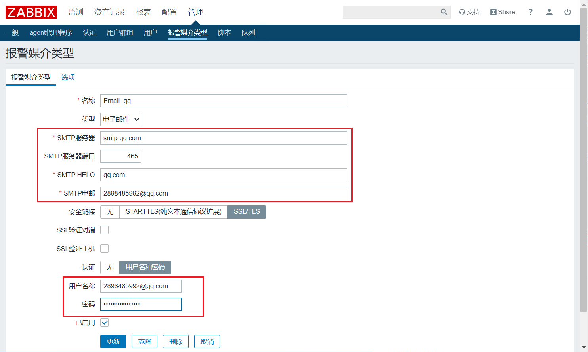

2. 修改Admin用户的报警媒介

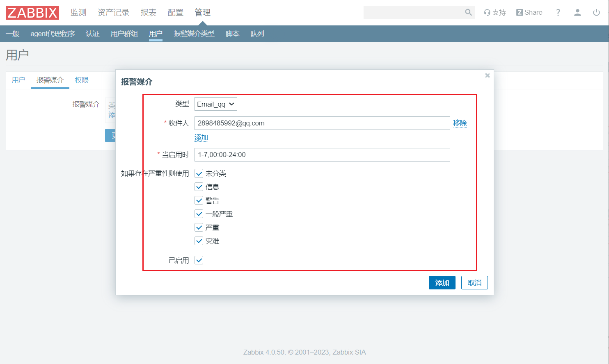

3. 配置告警动作

   这里定义如果触发告警，应该怎么处理。以及如果发送邮件，邮件的内容是什么样的....

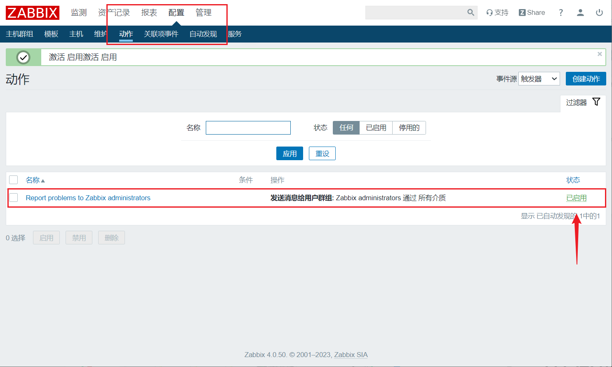

当然也可以自定义告警信息


### 邮件告警测试

手动停止server2上面的nginx服务以后，查看邮件

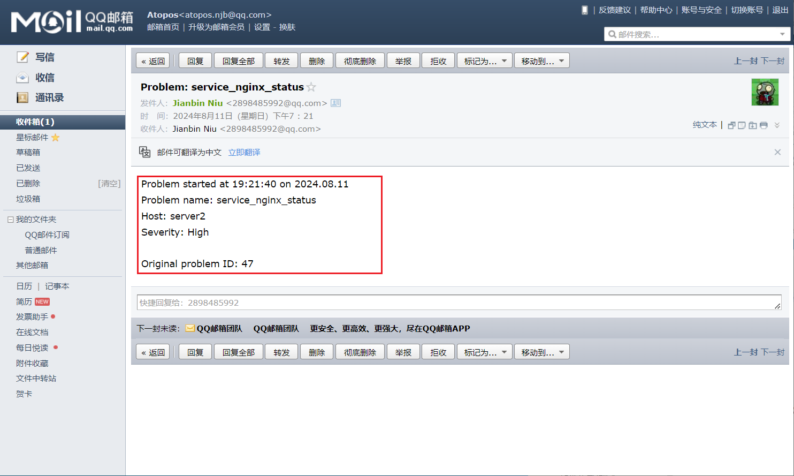

可以看到，成功通过邮件发送告警信息

当问题恢复以后，也会发送邮件给我们


## Zabbix通过钉钉告警

### 创建钉钉群聊

先下载电脑版本的钉钉，然后创建一个群聊（创建群聊需要三个好友起步，大家可以相互之间添加好友）并且创建群聊

### 添加群机器人

添加自定义机器人，并且配置关键词


保存好Webhook，并且设置安全关键词为：告警


### 创建python脚本

由于zabbix无法直接向钉钉发送告警信息，所以这里需要借助python脚本来实现，让zabbix调用python脚本来向机器人接口发送信息

1. 安装requests模块

```bash
[root@server1 ~]# yum install -y python-requests  
```

2. python脚本如下：

```bash
[root@server1 alertscripts]# cd /usr/lib/zabbix/alertscripts
[root@server1 alertscripts]# vim zabbix_send_ding.py 
#!/usr/bin/python
# -*- coding: utf-8 -*-
# Author: xxxxxxxx
import requests
import json
import sys
import os

headers = {'Content-Type': 'application/json;charset=utf-8'}
api_url = "https://oapi.dingtalk.com/robot/send?access_token=d68555399dc737c450c50ddac16ab6c529f3a99dc68bdf88ac60e88f1b4ef340"
def msg(text):
    json_text= {
    "msgtype": "text",
    "at": {
        "atMobiles": [
            "18888888888"
        ],
            "isAtAll": True
     },
     "text": {
        "content": text
     }
    }
    print requests.post(api_url,json.dumps(json_text),headers=headers).content

if __name__ == '__main__':
# 这里用发送关键字用来触发告警
    text = "告警"
# 使用sys.argv来接收一个参数，该参数是zabbix发送的消息
    text = sys.argv[1]
    msg(text)
```

3. 测试脚本

```bash
# 如果手动测试脚本的话，需要把text = sys.argv[1]先注释了
[root@server1 alertscripts]# chmod a+x zabbix_send_ding.py
[root@server1 alertscripts]# ./zabbix_send_ding.py
{"errcode":0,"errmsg":"ok"}
```

### 配置zabbix钉钉告警

1. 添加告警媒介

   因为我们使用的python脚本只接收一个参数（内容），所以只需要添加一个参数{ALERT.MESSAGE}即可

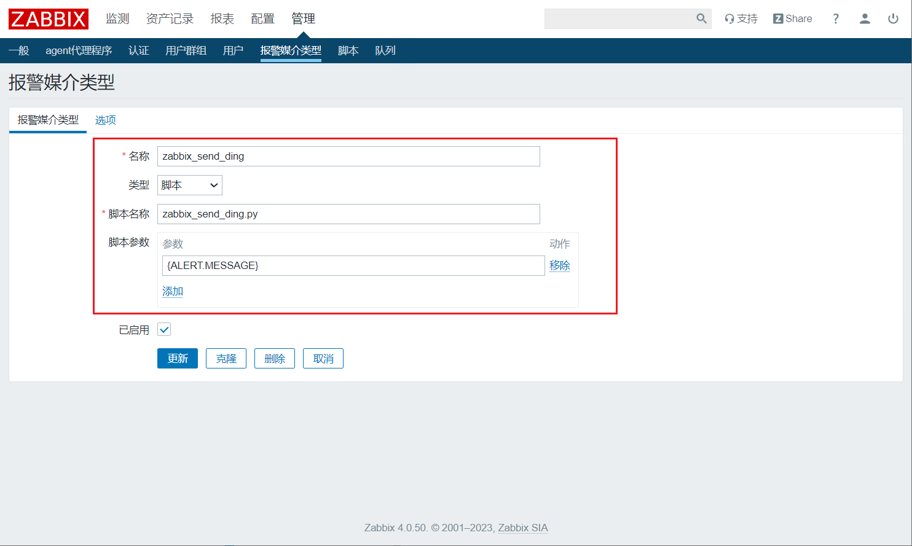

2. 添加处理动作

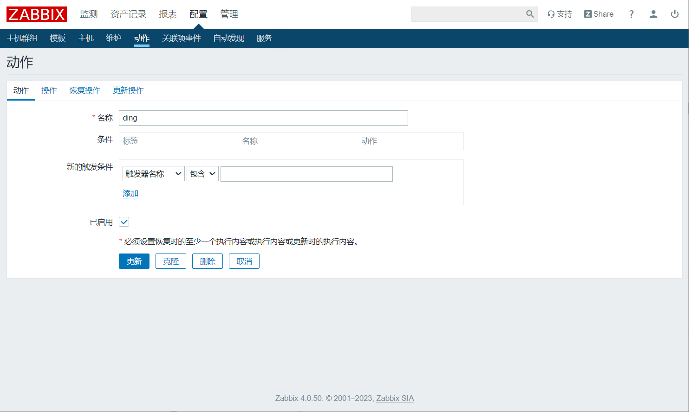


恢复操作

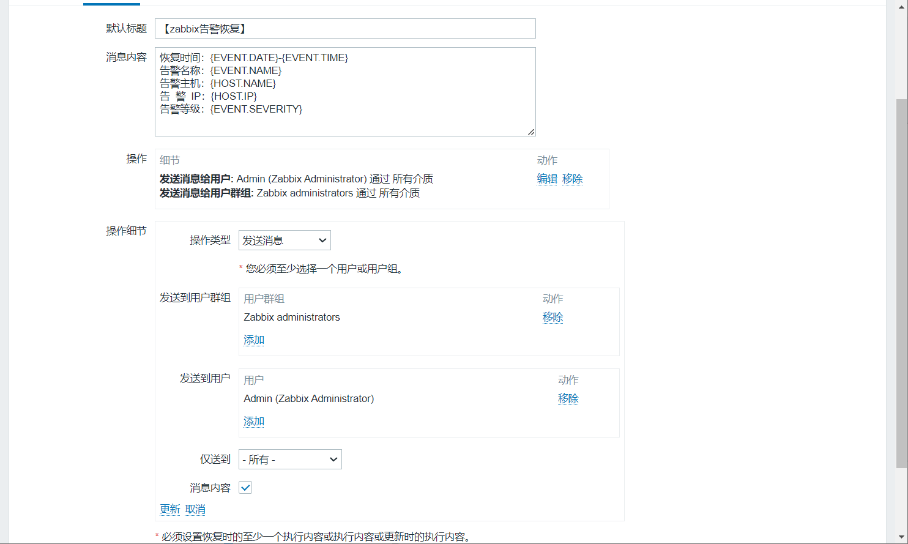

告警消息内容如下：

```bash
【zabbix告警】
告警问题：{EVENT.NAME}
告警时间：{EVENT.DATE}-{EVENT.TIME}
告警主机：{HOST.NAME}
告  警  IP：{HOST.IP}
监控项目：{ITEM.NAME}
故障等级：{EVENT.SEVERITY}


【zabbix告警恢复】
恢复时间：{EVENT.DATE}-{EVENT.TIME}
告警名称：{EVENT.NAME}
告警主机：{HOST.NAME}
告  警  IP：{HOST.IP}
告警等级：{EVENT.SEVERITY}


【zabbix告警更新】
{USER.FULLNAME} {EVENT.UPDATE.ACTION} problem at {EVENT.UPDATE.DATE} {EVENT.UPDATE.TIME}.
{EVENT.UPDATE.MESSAGE}
```

3. 绑定用户，填写钉钉的手机号即可


### 测试钉钉告警

